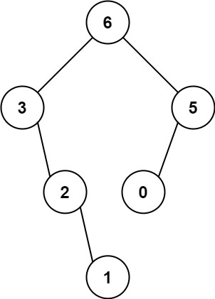

# 二叉树


**满二叉树**：

1. 对于k层的二叉树来说，拥有 2^k^ -1 个结点的二叉树称为满二叉树
2. 度为0的结点(叶子结点)都在同一层上


**完全二叉树：**

1. 二叉树的结点位置按照对应的完全二叉树的位置相吻合
2. 最后一层的结点，一定是从左往右依次排满的


**线索二叉树**

若根结点的左、右子树均不为空，那么有：

- 左子树的所有结点的值均**小于**根结点的值
- 右子树的所有结点的值均**大于**根节点的值


**平衡二叉树**

平衡二叉树，又称AVL，一个树的左右子树的高度的差值不能大于1


**二叉树的遍历**

二叉树遍历方式分为三种：

- 前序遍历
- 中序遍历
- 后序遍历

每一种遍历都可以用递归和迭代俩种方法来实现，对应LeetCode题目：

- [144.二叉树的前序遍历(opens new window)](https://leetcode.cn/problems/binary-tree-preorder-traversal/)
- [94.二叉树的中序遍历(opens new window)](https://leetcode.cn/problems/binary-tree-inorder-traversal/)
- [145.二叉树的后序遍历](https://leetcode.cn/problems/binary-tree-postorder-traversal/)


## 1、二叉树递归遍历

递归方法比较简单，只要弄清楚结束条件即可，所谓前、中、后序遍历只不过调整加入集合的顺序即可。

### 前序遍历

前序遍历顺序：

- 先遍历根节点
- 在遍历左子树
- 最后遍历右子树

**代码实现**

定义结点

```java
public class TreeNode {
    int val;
    TreeNode left;
    TreeNode right;

    TreeNode() {
    }

    TreeNode(int val) {
        this.val = val;
    }

    TreeNode(int val, TreeNode left, TreeNode right) {
        this.val = val;
        this.left = left;
        this.right = right;
    }
}

```

```java
    /**
     * 方法一：递归
     *  根节点、左子树、右子树
     * */
    ArrayList<Integer> res = new ArrayList<Integer>();
    public List<Integer> preorderTraversal(TreeNode root) {
        if (root == null) return res;
        // 先遍历根节点
        res.add(root.val);
        // 递归遍历左子树
        preorderTraversal(root.left);
        // 递归遍历左子树
        preorderTraversal(root.right);
        return res;
    }
```

### **中序遍历**

遍历顺序：

- 先遍历左子树
- 在遍历根节点
- 最后遍历右子树

```java
    ArrayList<Integer> res = new ArrayList<>();

    public List<Integer> inorderTraversal(TreeNode root) {
        if (root == null) return  res;
        // 先遍历左子树
        inorderTraversal(root.left);
        // 遍历根节点
        res.add(root.val);
        // 遍历右子树
        inorderTraversal(root.right);

        return  res;
    }
```


### **后序遍历**

- 先遍历左子树
- 在遍历右子树
- 最后遍历根节点

```java
    ArrayList<Integer> res = new ArrayList<>();

    public List<Integer> postorderTraversal(TreeNode root) {
        if (root == null) return  res;

        // 先遍历左子树
        postorderTraversal(root.left);
        // 在遍历右子树
        postorderTraversal(root.right);
        // 最后遍历根节点
        res.add(root.val);

        return res;
    }
```


## 2、二叉树迭代遍历

二叉树的迭代遍历相较于递归比较困难一些，我们知道所谓的**递归，其实就是将局部变量，返回值，返回地址存放在栈中**，二叉树的迭代遍历也可以用栈来实现。

### **前序遍历**

先将根节点入栈，然后弹栈，再将右孩子结点、左孩子结点依次入栈

> 由于栈先进后出，所以先将右孩子放入栈中，后放左孩子


```java
    /**
     * 方法二：迭代遍历
     * */
    public List<Integer> preorderTraversal2(TreeNode root) {
        ArrayList<Integer> res = new ArrayList<Integer>();
        if (root == null) return res;
        Stack<TreeNode> stack = new Stack<>();

        //   先将根节点入栈
        stack.push(root);
        while (!stack.isEmpty()) {
            // 将根节点弹栈
            TreeNode node = stack.pop();
            // 将根节点加入到集合中
            res.add(node.val);

            // 将右孩子结点入栈，切记: 空结点不放入栈中
            if (node.right != null) stack.push(node.right);
            // 同理将左孩子放入栈中
            if (node.left != null) stack.push(node.left);
        }
        return res;
    }
```


### 中序遍历

在递归中我们只修改了处理结点的顺序（将节点增加到集合中），代码都一样，只是顺序改变了。

但是在迭代中，我们就无法这样做了，为什么呢？

> 在前序遍历中，我们访问结点和处理结点的顺序是一致的，从根结点开始访问，也是从根结点开始处理！
>
> 但是在中序遍历中，我们从根节点开始访问，但是处理的结点却是左边最底部的结点。
>
> 因此我们**需要一个指针，帮助我们访问结点**


```java
    public List<Integer> inorderTraversal2(TreeNode root) {
        ArrayList<Integer> res = new ArrayList<>();
        if (root == null) return  res;
        Stack<TreeNode> stack = new Stack<>();
        // 使用一个指针，帮助访问处理的结点
        TreeNode cur = root;

        while(cur != null || !stack.isEmpty()) {
            if (cur != null) {
                // 说明还未到达左边最底部的结点，继续向下访问
                stack.push(cur);
                // 左
                cur = cur.left;
            }else {
                // 说明到达了左边最底部的结点，进行处理
                // 中
                TreeNode node = stack.pop();
                res.add(node.val);
                // 右
                cur = node.right;
            }
        }
        return  res;
    }
```


### 后序遍历

再来看后序遍历，先序遍历是中左右，后续遍历是左右中，那么我们只需要调整一下先序遍历的代码顺序，就变成中右左的遍历顺序，然后在反转 res 集合，输出的结果顺序就是左右中了，如下图：


**切记**： 栈的原则为先进后出，先放左，后放右，右先出，左后出！


```java
    /**
     * 方法二：迭代遍历
     * */
    public List<Integer> postorderTraversal2(TreeNode root) {
        ArrayList<Integer> res = new ArrayList<>();
        if (root == null) return  res;
        Stack<TreeNode> stack = new Stack<>();

        // 先将根节点入栈
        stack.push(root);
        while(!stack.isEmpty()) {
            // 根
            TreeNode cur = stack.pop();
            res.add(cur.val);
            // 左
            if (cur.left != null) stack.push(cur.left);
            // 右
            if (cur.right != null) stack.push(cur.right);
        }
        // 反转
        Collections.reverse(res);
        return res;
    }
```


### 总结

其中前序遍历和后序遍历会有一些联系，和中序遍历代码不相关。

原因就是中序遍历访问和处理的结点不是同一个，需要用额外的一个指针来访问！


## 3、二叉树的层序遍历

### [102.二叉树的层序遍历(opens new window)](https://leetcode.cn/problems/binary-tree-level-order-traversal/)

给你二叉树的根节点 `root` ，返回其节点值的 **层序遍历** 。 （即逐层地，从左到右访问所有节点）。


**示例 1：**


```
输入：root = [3,9,20,null,null,15,7]
输出：[[3],[9,20],[15,7]]
```

**示例 2：**

```
输入：root = [1]
输出：[[1]]
```

**示例 3：**

```
输入：root = []
输出：[]
```


**提示：**

- 树中节点数目在范围 `[0, 2000]` 内
- `-1000 <= Node.val <= 1000`


#### 思路分析


> 作者：nettee
> 链接：https://leetcode.cn/problems/binary-tree-level-order-traversal/

DFS（深度优先搜索）和 BFS（广度优先搜索）就像孪生兄弟，提到一个总是想起另一个。然而在实际使用中，我们用 DFS 的时候远远多于 BFS。那么，是不是 BFS 就没有什么用呢？

如果我们使用 DFS/BFS 只是为了遍历一棵树、一张图上的所有结点的话，那么 DFS 和 BFS 的能力没什么差别，我们当然更倾向于更方便写、空间复杂度更低的 DFS 遍历。不过，某些使用场景是 DFS 做不到的，只能使用 BFS 遍历。这就是本文要介绍的两个场景：「层序遍历」、「最短路径」。

**DFS 与 BFS**

让我们先看看在二叉树上进行 DFS 遍历和 BFS 遍历的代码比较。

DFS 遍历使用 **递归**：

```java
void dfs(TreeNode root) {
    if (root == null) {
        return;
    }
    dfs(root.left);
    dfs(root.right);
}
```


BFS 遍历使用**队列**数据结构：

```java
void bfs(TreeNode root) {
    Queue<TreeNode> queue = new ArrayDeque<>();
    queue.add(root);
    while (!queue.isEmpty()) {
        TreeNode node = queue.poll(); // Java 的 pop 写作 poll()
        if (node.left != null) {
            queue.add(node.left);
        }
        if (node.right != null) {
            queue.add(node.right);
        }
    }
}
```

是比较两段代码的话，最直观的感受就是：DFS 遍历的代码比 BFS 简洁太多了！这是因为递归的方式隐含地使用了系统的 **栈**，我们不需要自己维护一个数据结构。如果只是简单地将二叉树遍历一遍，那么 DFS 显然是更方便的选择。

虽然 DFS 与 BFS 都是将二叉树的所有结点遍历了一遍，但它们遍历结点的顺序不同。


**BFS应用场景: 层序遍历**

>  **什么是层序遍历？**

从上至下，从左到右依次访问二叉树的每一个结点。


其实乍一看这个遍历顺序和 BFS(广度优先遍历)是一样的，但是与BFS不同的是，二叉树的层次遍历却是一个二维数组。而BFS 遍历后得到是一维数组，无法区分每一层


那么，怎么给 BFS 遍历的结果分层呢？我们首先来观察一下 BFS 遍历的过程中，结点进队列和出队列的过程：


截取 BFS 遍历过程中的某一时刻：


可以看到，此时队列中的结点是 3、4、5，分别来自第 1 层和第 2 层。这个时候，第 1 层的结点还没出完，第 2 层的结点就进来了，而且两层的结点在队列中紧挨在一起，我们 **无法区分队列中的结点来自哪一层**。

因此，我们需要稍微修改一下代码，在每一层遍历开始前，先记录队列中的结点数量 n（也就是这一层的结点数量），然后一口气处理完这一层的 n 个结点

```java
// 二叉树的层序遍历
void bfs(TreeNode root) {
    Queue<TreeNode> queue = new ArrayDeque<>();
    queue.add(root);
    while (!queue.isEmpty()) {
        int n = queue.size();
        for (int i = 0; i < n; i++) { 
            // 变量 i 无实际意义，只是为了循环 n 次
            TreeNode node = queue.poll();
            if (node.left != null) {
                queue.add(node.left);
            }
            if (node.right != null) {
                queue.add(node.right);
            }
        }
    }
}
```


将BFS遍历改成了层序遍历，在遍历过程中，结点的出队入队过程为：


可以看到，在 while 循环的每一轮中，都是将当前层的所有结点出队列，再将下一层的所有结点入队列，这样就实现了层序遍历。

最终我们得到的题解代码为：

```java
class Solution {
     List<List<Integer>> res = new ArrayList<>();
    public List<List<Integer>> levelOrder(TreeNode root) {
        if (root == null) return res;

        Queue<TreeNode> queue = new ArrayDeque<>();
        queue.add(root);
        // n记录每一层的结点个数
        while(!queue.isEmpty()) {
            int n = queue.size();
            ArrayList<Integer> item = new ArrayList<>();
            for (int i = 0; i < n; i++) {
                // n 无实际意义，只是为了能够一次性将一层的结点出队
                TreeNode treeNode = queue.poll();
                item.add(treeNode.val);

                // 将左孩子结点入队
                if (treeNode.left != null) queue.add(treeNode.left);
                // 将右孩子结点入队
                if (treeNode.right != null) queue.add(treeNode.right);
            }
            res.add(item);
        }
        return res;
    }
}
```

**递归版本**：

```java
class Solution {
    List<List<Integer>> res = new ArrayList<>();

    public List<List<Integer>> levelOrder(TreeNode root) {
        recursion(root, 0);
        return res;
    }

    // deep表示遍历的层次
    public void recursion(TreeNode node, int deep) {
        // 终止条件
        if (node == null) return;
        // 没执行一次，层次加一
        deep++;
        if (res.size() < deep) {
            // 每一层的元素加集合，当deep增加时，增加一层元素
            List<Integer> item = new ArrayList<>();
            res.add(item);
        }
        // 增加当前结点,list索引下标从0开始，所以-1
        res.get(deep - 1).add(node.val);
        // 遍历左子树
        recursion(node.left, deep);
        // 遍历右子树
        recursion(node.right, deep);
    }
}
```


### [107. 二叉树的层序遍历 II](https://leetcode.cn/problems/binary-tree-level-order-traversal-ii/)

给你二叉树的根节点 `root` ，返回其节点值 **自底向上的层序遍历** 。 （即按从叶子节点所在层到根节点所在的层，逐层从左向右遍历）


**示例 1：**


```
输入：root = [3,9,20,null,null,15,7]
输出：[[15,7],[9,20],[3]]
```

**示例 2：**

```
输入：root = [1]
输出：[[1]]
```

**示例 3：**

```
输入：root = []
输出：[]
```


**提示：**

- 树中节点数目在范围 `[0, 2000]` 内
- `-1000 <= Node.val <= 1000`

#### 思路分析

简单一批，直接将集合反转即可


```java
   public List<List<Integer>> levelOrderBottom(TreeNode root) {
        List<List<Integer>> res = new ArrayList<>();
        if (root == null) return  res;

        Queue<TreeNode> queue = new ArrayDeque<>();
        queue.add(root);
        while (!queue.isEmpty()) {
            int n = queue.size();
            List<Integer> item = new ArrayList<>();
            for (int i = 0; i < n; i++) {
                TreeNode node = queue.poll();
                item.add(node.val);

                if (node.left != null) queue.add(node.left);
                if (node.right != null) queue.add(node.right);
            }
            res.add(item);
        }
       /
        Collections.reverse(res);
        return res;
    }
```


### [199. 二叉树的右视图](https://leetcode.cn/problems/binary-tree-right-side-view/)

给定一个二叉树的 **根节点** `root`，想象自己站在它的右侧，按照从顶部到底部的顺序，返回从右侧所能看到的节点值。


**示例 1:**


```
输入: [1,2,3,null,5,null,4]
输出: [1,3,4]
```

**示例 2:**

```
输入: [1,null,3]
输出: [1,3]
```

**示例 3:**

```
输入: []
输出: []
```


**提示:**

- 二叉树的节点个数的范围是 `[0,100]`
- `-100 <= Node.val <= 100`


#### 思路分析

如图所示，我们只需要将层序遍历结果中，每一层的最后一个元素放入结果集中即可


```java
/**
 * Definition for a binary tree node.
 * public class TreeNode {
 *     int val;
 *     TreeNode left;
 *     TreeNode right;
 *     TreeNode() {}
 *     TreeNode(int val) { this.val = val; }
 *     TreeNode(int val, TreeNode left, TreeNode right) {
 *         this.val = val;
 *         this.left = left;
 *         this.right = right;
 *     }
 * }
 */
class Solution {
    public List<Integer> rightSideView(TreeNode root) {
        ArrayList<Integer> res = new ArrayList<>();
        if (root == null) return res;
        Queue<TreeNode> queue = new ArrayDeque<>();
        queue.add(root);

        while(!queue.isEmpty()) {
            int levelSize = queue.size();
            for (int i = 1; i <= levelSize; i++) {
                TreeNode node = queue.poll();
                // 将左孩子入队
                if (node.left != null) queue.add(node.left);
                // 将右孩子结点入队
                if (node.right != null) queue.add(node.right);
                // 只需要将每层的最后一个放到res即可
                if (i == levelSize) res.add(node.val);
            }
        }
        return  res;
    }
}
```


### [637. 二叉树的层平均值](https://leetcode.cn/problems/average-of-levels-in-binary-tree/)

给定一个非空二叉树的根节点 `root` , 以数组的形式返回每一层节点的平均值。与实际答案相差 `10-5` 以内的答案可以被接受。


**示例 1：**


```
输入：root = [3,9,20,null,null,15,7]
输出：[3.00000,14.50000,11.00000]
解释：第 0 层的平均值为 3,第 1 层的平均值为 14.5,第 2 层的平均值为 11 。
因此返回 [3, 14.5, 11] 。
```

**示例 2:**


```
输入：root = [3,9,20,15,7]
输出：[3.00000,14.50000,11.00000]
```


**提示：**


- 树中节点数量在 `[1, 104]` 范围内
- `-231 <= Node.val <= 231 - 1`


#### 思路分析

遍历每层结点时，累加结点的值，每一层累加完求平均值即可


```java
/**
 * Definition for a binary tree node.
 * public class TreeNode {
 *     int val;
 *     TreeNode left;
 *     TreeNode right;
 *     TreeNode() {}
 *     TreeNode(int val) { this.val = val; }
 *     TreeNode(int val, TreeNode left, TreeNode right) {
 *         this.val = val;
 *         this.left = left;
 *         this.right = right;
 *     }
 * }
 */
class Solution {
    public List<Double> averageOfLevels(TreeNode root) {
        ArrayList<Double> res = new ArrayList<>();
        if (root == null) return res;

        ArrayDeque<TreeNode> queue = new ArrayDeque<>();
        queue.add(root);
        while(!queue.isEmpty()) {
            int levelSize = queue.size();
            double sum = 0;
            for (int i = 0; i < levelSize; i++) {
                TreeNode node = queue.pop();
                sum += node.val;
                
                if (node.left != null) queue.add(node.left);
                if (node.right != null) queue.add(node.right);
            }
            res.add(sum/levelSize);
        }
        return res;
    }
}
```


### [429. N 叉树的层序遍历](https://leetcode.cn/problems/n-ary-tree-level-order-traversal/)

给定一个 N 叉树，返回其节点值的*层序遍历*。（即从左到右，逐层遍历）。

树的序列化输入是用层序遍历，每组子节点都由 null 值分隔（参见示例）。


**示例 1：**


```
输入：root = [1,null,3,2,4,null,5,6]
输出：[[1],[3,2,4],[5,6]]
```

**示例 2：**


```
输入：root = [1,null,2,3,4,5,null,null,6,7,null,8,null,9,10,null,null,11,null,12,null,13,null,null,14]
输出：[[1],[2,3,4,5],[6,7,8,9,10],[11,12,13],[14]]
```


**提示：**

- 树的高度不会超过 `1000`
- 树的节点总数在 `[0, 10^4]` 之间


#### 思路分析

在进行二叉树遍历时，我们是将左孩子、右孩子结点入队，N叉树我们只需要改变入队规则，将 结点的 `children`  入队即可


```java
/*
// Definition for a Node.
class Node {
    public int val;
    public List<Node> children;

    public Node() {}

    public Node(int _val) {
        val = _val;
    }

    public Node(int _val, List<Node> _children) {
        val = _val;
        children = _children;
    }
};
*/

class Solution {
    public List<List<Integer>> levelOrder(Node root) {
                List<List<Integer>> res = new ArrayList<>();
        if (root == null) return res;
        Queue<Node> queue = new ArrayDeque<>();
        queue.add(root);
        
        while(!queue.isEmpty()) {
            int levelSize = queue.size();
            ArrayList<Integer> item = new ArrayList<>();
            for (int i = 0; i < levelSize; i++) {
                Node node = queue.poll();
                item.add(node.val);
                
                // 改变入队方式
                if (node.children != null){
                    queue.addAll(node.children);
                }
            }
            res.add(item);
        }
        return res;
    }
}
```


### [515. 在每个树行中找最大值](https://leetcode.cn/problems/find-largest-value-in-each-tree-row/)


给定一棵二叉树的根节点 `root` ，请找出该二叉树中每一层的最大值。


**示例1：**


```
输入: root = [1,3,2,5,3,null,9]
输出: [1,3,9]
```

**示例2：**

```
输入: root = [1,2,3]
输出: [1,3]
```


**提示：**

- 二叉树的节点个数的范围是 `[0,104]`
- `-231 <= Node.val <= 231 - 1`


#### 思路分析

没啥好分析的，和求平均值一样


```java
/**
 * Definition for a binary tree node.
 * public class TreeNode {
 *     int val;
 *     TreeNode left;
 *     TreeNode right;
 *     TreeNode() {}
 *     TreeNode(int val) { this.val = val; }
 *     TreeNode(int val, TreeNode left, TreeNode right) {
 *         this.val = val;
 *         this.left = left;
 *         this.right = right;
 *     }
 * }
 */
class Solution {
    public List<Integer> largestValues(TreeNode root) {
        ArrayList<Integer> res = new ArrayList<>();
        if (root == null) return res;

        Queue<TreeNode> queue = new ArrayDeque<>();
        queue.add(root);

        while(!queue.isEmpty()) {
            int levelSize = queue.size();
            int maxValue = Integer.MIN_VALUE;
            for (int i = 0; i < levelSize; i++) {
                TreeNode node = queue.poll();
               maxValue = Math.max(maxValue,node.val);

                if (node.left!=null) queue.add(node.left);
                if (node.right!=null) queue.add(node.right);
            }
            res.add(maxValue);
        }
        return res;
    }
}
```

### [116. 填充每个节点的下一个右侧节点指针](https://leetcode.cn/problems/populating-next-right-pointers-in-each-node/)

给定一个 **完美二叉树** ，其所有叶子节点都在同一层，每个父节点都有两个子节点。二叉树定义如下：

```
struct Node {
  int val;
  Node *left;
  Node *right;
  Node *next;
}
```

填充它的每个 next 指针，让这个指针指向其下一个右侧节点。如果找不到下一个右侧节点，则将 next 指针设置为 `NULL`。

初始状态下，所有 next 指针都被设置为 `NULL`。


**示例 1：**


```
输入：root = [1,2,3,4,5,6,7]
输出：[1,#,2,3,#,4,5,6,7,#]
解释：给定二叉树如图 A 所示，你的函数应该填充它的每个 next 指针，以指向其下一个右侧节点，如图 B 所示。序列化的输出按层序遍历排列，同一层节点由 next 指针连接，'#' 标志着每一层的结束。
```


**示例 2:**

```
输入：root = []
输出：[]
```


**提示：**

- 树中节点的数量在 `[0, 212 - 1]` 范围内
- `-1000 <= node.val <= 1000`


**进阶：**

- 你只能使用常量级额外空间。
- 使用递归解题也符合要求，本题中递归程序占用的栈空间不算做额外的空间复杂度。


#### 思路分析

只需要将每一层 poll 出来的结点：

- 如果下一个结点不为空，则指向下一个结点
- 如果下一个结点为空，则置为null

```java
/*
// Definition for a Node.
class Node {
    public int val;
    public Node left;
    public Node right;
    public Node next;

    public Node() {}
    
    public Node(int _val) {
        val = _val;
    }

    public Node(int _val, Node _left, Node _right, Node _next) {
        val = _val;
        left = _left;
        right = _right;
        next = _next;
    }
};
*/

class Solution {
    public Node connect(Node root) {
         if (root == null) return root;
          Queue<Node> queue = new ArrayDeque<Node>();
        queue.add(root);

        while (!queue.isEmpty()) {
            int levelSize = queue.size();
            for (int i = 0; i < levelSize; i++) {
                // 当前层的第一个节点
                Node node = queue.poll();
                // 当前节点的下一个节点,当前结点为这一层的最后一个节点,则为null
                  node.next = (i == levelSize - 1) ? null : queue.peek();

                if (node.left != null) queue.add(node.left);
                if (node.right != null) queue.add(node.right);
            }
        }
        return root;
    }
}
```


### [104. 二叉树的最大深度](https://leetcode.cn/problems/maximum-depth-of-binary-tree/)

给定一个二叉树 `root` ，返回其最大深度。

二叉树的 **最大深度** 是指从根节点到最远叶子节点的最长路径上的节点数。


**示例 1：**


```
输入：root = [3,9,20,null,null,15,7]
输出：3
```

**示例 2：**

```
输入：root = [1,null,2]
输出：2
```


**提示：**

- 树中节点的数量在 `[0, 104]` 区间内。
- `-100 <= Node.val <= 100`


#### 思路分析

在遍历完每一层时，用一个变量进行累加


```java
/**
 * Definition for a binary tree node.
 * public class TreeNode {
 *     int val;
 *     TreeNode left;
 *     TreeNode right;
 *     TreeNode() {}
 *     TreeNode(int val) { this.val = val; }
 *     TreeNode(int val, TreeNode left, TreeNode right) {
 *         this.val = val;
 *         this.left = left;
 *         this.right = right;
 *     }
 * }
 */
class Solution {
    public int maxDepth(TreeNode root) {
        if (root == null) return 0;

        ArrayDeque<TreeNode> queue = new ArrayDeque<>();
        queue.add(root);
        // 记录最大深度
        int max = 0;
        while (!queue.isEmpty()) {
            int size = queue.size();
            for (int i = 0; i < size; i++) {

                TreeNode node = queue.poll();
                if (node.left!= null) queue.add(node.left);
                if (node.right!= null) queue.add(node.right);
            }
            max++;
        }
        return max;
    }
}
```


### [111. 二叉树的最小深度](https://leetcode.cn/problems/minimum-depth-of-binary-tree/)

给定一个二叉树，找出其最小深度。

最小深度是从根节点到最近叶子节点的最短路径上的节点数量。

**说明：**叶子节点是指没有子节点的节点。


**示例 1：**


```
输入：root = [3,9,20,null,null,15,7]
输出：2
```

**示例 2：**

```
输入：root = [2,null,3,null,4,null,5,null,6]
输出：5
```


**提示：**

- 树中节点数的范围在 `[0, 105]` 内
- `-1000 <= Node.val <= 1000`

#### 思路分析

相较于最大深度，最小深度是 当某个结点的`左右子树都为空`时，此时就达到了最近的叶子结点，直接返回深度即可。

```java
/**
 * Definition for a binary tree node.
 * public class TreeNode {
 *     int val;
 *     TreeNode left;
 *     TreeNode right;
 *     TreeNode() {}
 *     TreeNode(int val) { this.val = val; }
 *     TreeNode(int val, TreeNode left, TreeNode right) {
 *         this.val = val;
 *         this.left = left;
 *         this.right = right;
 *     }
 * }
 */
class Solution {
    public int minDepth(TreeNode root) {
        if (root == null)   return 0;
        ArrayDeque<TreeNode> queue = new ArrayDeque<>();
        queue.add(root);
        int level = 1;
        while (!queue.isEmpty()) {
            int size = queue.size();
            for (int i = 0; i < size; i++) {
                TreeNode node = queue.poll();
                // 当左右子树都为空时，说明到达叶子节点，返回当前层数
                if (node.left == null && node.right == null) {
                    return level;
                }
                if (node.left != null) {
                    queue.add(node.left);
                }
                if (node.right != null) {
                    queue.add(node.right);
                }
            }
            level++;
        }
        return level;
    }
}
```


### 总结

二叉树的层序遍历有俩种思想： 一种是 bfs(广度优先遍历)、一种是  dfs(深度优先遍历)，其中层序遍历使用 bfs 更简单，其模板：

```java
void bfs(TreeNode root) {
    Queue<TreeNode> queue = new ArrayDeque<>();
    queue.add(root);
    while (!queue.isEmpty()) {
        TreeNode node = queue.poll(); // Java 的 pop 写作 poll()
        if (node.left != null) {
            queue.add(node.left);
        }
        if (node.right != null) {
            queue.add(node.right);
        }
    }
}
```


## [226. 翻转二叉树](https://leetcode.cn/problems/invert-binary-tree/)

给你一棵二叉树的根节点 `root` ，翻转这棵二叉树，并返回其根节点。


**示例 1：**


```
输入：root = [4,2,7,1,3,6,9]
输出：[4,7,2,9,6,3,1]
```

**示例 2：**


```
输入：root = [2,1,3]
输出：[2,3,1]
```

**示例 3：**

```
输入：root = []
输出：[]
```


**提示：**

- 树中节点数目范围在 `[0, 100]` 内
- `-100 <= Node.val <= 100`


### 思路分析

通过题目描述中也可以得知，所谓的翻转，其实就是将每一层的左右孩子结点进行交换即可。

先序、后序、层序遍历均可以实现，为什么没有中序呢？中序其实也可以，但是需要考虑的是，在遍历结点的过程中，可能会交换俩次。


**递归：先序遍历**

```java
/**
 * Definition for a binary tree node.
 * public class TreeNode {
 *     int val;
 *     TreeNode left;
 *     TreeNode right;
 *     TreeNode() {}
 *     TreeNode(int val) { this.val = val; }
 *     TreeNode(int val, TreeNode left, TreeNode right) {
 *         this.val = val;
 *         this.left = left;
 *         this.right = right;
 *     }
 * }
 */
class Solution {
    public TreeNode invertTree(TreeNode root) {
        if (root == null) return root;
        // 交换
        swap(root);
        // 遍历左子树
        invertTree(root.left);
        // 遍历右子树
        invertTree(root.right);
        
        return  root;
    }
        // 交换左右孩子结点
    public void swap(TreeNode node) {
        if (node == null) return;
        TreeNode temp = node.left;
        node.left = node.right;
        node.right = temp;
    }
}
```


**bfs - 层序遍历**

```java
/**
 * Definition for a binary tree node.
 * public class TreeNode {
 *     int val;
 *     TreeNode left;
 *     TreeNode right;
 *     TreeNode() {}
 *     TreeNode(int val) { this.val = val; }
 *     TreeNode(int val, TreeNode left, TreeNode right) {
 *         this.val = val;
 *         this.left = left;
 *         this.right = right;
 *     }
 * }
 */
class Solution {
    public TreeNode invertTree(TreeNode root) {
        if (root == null) return root;

        Queue<TreeNode> queue = new ArrayDeque<>();
        queue.add(root);
        
        while(!queue.isEmpty()) {
            TreeNode node = queue.poll();
            // 左右交换
             swap(node);
            if (node.left!= null) queue.add(node.left);
            if (node.right!= null) queue.add(node.right);
        }
        return root;
    }
}
```


## [101. 对称二叉树](https://leetcode.cn/problems/symmetric-tree/)

给你一个二叉树的根节点 `root` ， 检查它是否轴对称。


**示例 1：**


```
输入：root = [1,2,2,3,4,4,3]
输出：true
```

**示例 2：**


```
输入：root = [1,2,2,null,3,null,3]
输出：false
```


**提示：**

- 树中节点数目在范围 `[1, 1000]` 内
- `-100 <= Node.val <= 100`


**进阶：**你可以运用递归和迭代两种方法解决这个问题吗？


#### 思路分析

首先要思考一颗对称的二叉树他有什么特点，根据下图来说：

1. 俩颗对称的子树它的根的值是相等的
2. 俩颗子树互为镜像。（这句话怎么理解呢？）
    1. 左子树的左节点和右子树的右结点是相等的
    2. 左子树的右结点和右子树的左节点是相等的
    3. 即：$left.left = right.right , left.right = right.left$

只要满足以上几种情况，就可以说明该二叉树是对称的，否则则不是。我们也可以利用这些条件做题。


**第一种方法**：递归

1. 终止条件就是上面说的那几种情况，只要不满足就返回false
    1. 根结点值不相等，返回false
    2. 左子树或者右子树有一个为空，返回 false
    3. 左子树和右子树都为空，返回true(说明已经没有结点了，也没有返回false)
2. 每次递归的元素为：左子树的左节点和右子树的右结点，左子树的右结点和右子树的左节点

```java
    public boolean isSymmetric2(TreeNode root) {
        if (root == null) return true;
        return recursive(root.left, root.right);
    }

    private boolean recursive(TreeNode left, TreeNode right) {
        // 如果两个结点都为空，那么就对称的
        if (left == null && right == null) return true;
        // 如果有一个结点为空，那么就是不对称的
        if (left == null || right == null) return false;
        // 根结点的值不相等，那么就不是对称的
        if (left.val != right.val) return false;
        // 递归比较左右子树
        return recursive(left.left,right.right) && recursive(left.right,right.left);
    }
```


**第二种方法**：迭代

将递归的比较换成队列，先将左右子树入队，然后继续根据上面的三个条件进行比较。

将 `left.left、right.right 入队，left.right、right.left 入队`


```java
 public boolean isSymmetric1(TreeNode root) {
        // 如果只有一个结点，那么一定是对称的
        if (root == null || (root.left == null && root.right == null)) return true;
        LinkedList<TreeNode> queue = new LinkedList<>();
        queue.add(root.left);
        queue.add(root.right);

        while (queue.size() > 0) {
            // 取出俩个结点，比较它们的值
            TreeNode left = queue.poll();
            TreeNode right = queue.poll();
            if (left == null && right == null) continue;
            // 如果其中一个结点为空，另一个不为空，那么就不是对称的
            if (left == null || right == null) return false;
            // 如果两个结点的值不相等，那么就不是对称的
            if (left.val != right.val) return false;

            // 比较左子树的左孩子结点和右子树的右孩子结点
            queue.add(left.left);
            queue.add(right.right);
            // 比较左子树的右孩子结点和右子树的左孩子结点
            queue.add(left.right);
            queue.add(right.left);
        }
        // 如果循环结束，那么说明所有的结点都比较完了，那么就是对称的
        return true;
    }
```


## [222. 完全二叉树的节点个数](https://leetcode.cn/problems/count-complete-tree-nodes/)

给你一棵 **完全二叉树** 的根节点 `root` ，求出该树的节点个数。

[完全二叉树](https://baike.baidu.com/item/完全二叉树/7773232?fr=aladdin) 的定义如下：在完全二叉树中，除了最底层节点可能没填满外，其余每层节点数都达到最大值，并且最下面一层的节点都集中在该层最左边的若干位置。若最底层为第 `h` 层，则该层包含 `1~ 2h` 个节点。


**示例 1：**


```
输入：root = [1,2,3,4,5,6]
输出：6
```

**示例 2：**

```
输入：root = []
输出：0
```

**示例 3：**

```
输入：root = [1]
输出：1
```


**提示：**

- 树中节点的数目范围是`[0, 5 * 104]`
- `0 <= Node.val <= 5 * 104`
- 题目数据保证输入的树是 **完全二叉树**


#### 思路分析

使用 dfs 和 bfs 都可以

dfs：

```java
/**
 * Definition for a binary tree node.
 * public class TreeNode {
 *     int val;
 *     TreeNode left;
 *     TreeNode right;
 *     TreeNode() {}
 *     TreeNode(int val) { this.val = val; }
 *     TreeNode(int val, TreeNode left, TreeNode right) {
 *         this.val = val;
 *         this.left = left;
 *         this.right = right;
 *     }
 * }
 */
class Solution {
    public int countNodes(TreeNode root) {
        if (root == null) return 0;
        // 左子树结点+右子树结点+根节点
       return countNodes(root.left) + countNodes(root.right) + 1;
    }
}
```


bfs：

```java
    public int countNodes(TreeNode root) {
        if (root == null) return 0;
        ArrayDeque<TreeNode> queue = new ArrayDeque<>();
        int sum = 0;
        queue.add(root);

        while(!queue.isEmpty()) {
            int size = queue.size();
            for (int i = 0; i < size; i++) {
                TreeNode node = queue.pop();
                sum+=1;
                if (node.left != null) queue.add(node.left);
                if (node.right != null) queue.add(node.right);
            }
        }
        return sum;
    }
```


## [110. 平衡二叉树](https://leetcode.cn/problems/balanced-binary-tree/)

给定一个二叉树，判断它是否是高度平衡的二叉树。

本题中，一棵高度平衡二叉树定义为：

> 一个二叉树*每个节点* 的左右两个子树的高度差的绝对值不超过 1 。


**示例 1：**


```
输入：root = [3,9,20,null,null,15,7]
输出：true
```

**示例 2：**


```
输入：root = [1,2,2,3,3,null,null,4,4]
输出：false
```

**示例 3：**

```
输入：root = []
输出：true
```


**提示：**

- 树中的节点数在范围 `[0, 5000]` 内
- `-104 <= Node.val <= 104`

### 思路分析

平衡二叉树的定义：$一个二叉树 每个节点 的左右两个子树的高度差的绝对值不超过 1 $。

对于一颗平衡二叉树来说，他所有的子树均为二叉树，因此我们可以使用递归判断所有的子树是否为二叉树

有俩种递归方式，一种是自上而下，另一种是自下而上

**方法一**：自上而下

自上而下类似与前序遍历，对每一颗子树都进行判断是否是平衡二叉树

```java
    public boolean isBalanced(TreeNode root) {
        if (root == null) return true;
        return Math.abs(height(root.left) - height((root.right))) <= 1 && isBalanced(root.right) && isBalanced(root.left);
    }

    // 求出二叉树的最大深度（先序遍历）
    public int height(TreeNode node){
        if (node == null) return 0;
        return Math.max(height(node.left) , height(node.right)) + 1;
    }
```


**方法二：** 自下而上

类似于后序遍历，以该结点为根节点的二叉树是平衡二叉树则返回最大 高度，若不是返回-1.

相较于自上而下来说，这种方法对于每个结点只会处理一次，而自上而下需要处理该结点下的每颗子树。

```java
/**
 * Definition for a binary tree node.
 * public class TreeNode {
 *     int val;
 *     TreeNode left;
 *     TreeNode right;
 *     TreeNode() {}
 *     TreeNode(int val) { this.val = val; }
 *     TreeNode(int val, TreeNode left, TreeNode right) {
 *         this.val = val;
 *         this.left = left;
 *         this.right = right;
 *     }
 * }
 */
class Solution {
    public boolean isBalanced(TreeNode root) {
 return height1(root) >=0;
    }
        public int height1(TreeNode node) {
        if (node == null) return 0;
        int left = height1(node.left);
        int right = height1(node.right);
        // 如果左右子树的高度差大于1，则返回-1
        if (left == -1 || right == -1 || Math.abs(left - right) > 1) {
            return -1;
        } else {
            // 否则返回高度
            return Math.max(left , right) + 1;
        }

    }
}
```


## ☆ [257. 二叉树的所有路径](https://leetcode.cn/problems/binary-tree-paths/)

给你一个二叉树的根节点 `root` ，按 **任意顺序** ，返回所有从根节点到叶子节点的路径。

**叶子节点** 是指没有子节点的节点。


**示例 1：**


```
输入：root = [1,2,3,null,5]
输出：["1->2->5","1->3"]
```

**示例 2：**

```
输入：root = [1]
输出：["1"]
```


**提示：**

- 树中节点的数目在范围 `[1, 100]` 内
- `-100 <= Node.val <= 100`

### 思路分析

通过题意我们很清楚的知道使用**先序遍历 + 回溯**方法。当我们将一条路径存到集合中，我们需要回溯到初始结点，继续找下一条路径！

先序遍历的方法有： 递归、迭代，也可以使用bfs层序遍历实现！

**1、递归**

递归版本的先序遍历代码如下

```java
    public void dfs(TreeNode node){
        if (node == null) return;
        System.out.println(node.val);
        dfs(node.left);
        dfs(node.right);
    }
```

我们可以依据上面为模板进行改良，此时不再是输出结点，而是将叶子结点的路径保存起来，代码如下：

可能会有疑问？这也没进行回溯啊？其实是有的，回溯隐藏在在每次递归的时候。即：$path + node.val + "->"$

```java
class Solution {
    public List<String> binaryTreePaths(TreeNode root) {
        ArrayList<String> res = new ArrayList<>();
        dfs(root, "", res);
        return res;
    }

    public void dfs(TreeNode node, String path, List<String> res) {
        if (node == null) return;

        if (node.left == null && node.right == null) {
            // 该结点为叶子结点
            res.add(path + node.val);
            return;
        }

        // 在每次遍历的过程中，都要将当前结点的值添加到路径中，这也是隐藏的回溯
        dfs(node.left, path + node.val + "->", res);
        dfs(node.right , path + node.val + "->", res);
    }
}
```


**2、非递归**


先看一下非递归的先序遍历代码，如下：

```java
    public void iterator(TreeNode root) {
        if (root == null) return;
        Stack<TreeNode> stack = new Stack<>();
        stack.push(root);
        
        while(!stack.isEmpty()){
            TreeNode node = stack.pop();
            System.out.println(node.val);
            
            if (node.right != null) stack.push(node.right);
            if (node.left != null) stack.push(node.left);
        }
    }
```

同样我们也可以对以上代码进行改良，但此时我们需要注意使用迭代的方式，注意进行回溯，递归与回溯一一对应，每一次递归(入栈) 都要进行一次回溯！

```java
    public List<String> iterator(TreeNode root) {
        ArrayList<String> res = new ArrayList<>();
        if (root == null) return res;
        // 在这里，路径和结点是成双成对的，，保存路径的栈和保存结点的栈使用一个栈来实现
        Stack<Object> stack = new Stack<>();
        stack.push(root.val + "");
        stack.push(root);

        while (!stack.isEmpty()) {
            // 注意push、pop的时机，都是先push路径，在push结点。先弹出来的是结点，后是路径
            TreeNode node = (TreeNode) stack.pop();
            String path = (String) stack.pop();

            // 如果是叶子结点，保存路径
            if (node.left == null && node.right == null) res.add(path);

            if (node.right != null) {
                // 每进行一次入栈，都要进行一次回溯
                stack.push(path + "->" + node.right.val);
                stack.push(node.right);
            }
            ;
            if (node.left != null) {
                stack.push(path + "->" + node.left.val);
                stack.push(node.left);
            }
            ;
        }
        return res;
    }
```


**3、bfs层序遍历**

同样，先看层序遍历代码模板：

```java
    public void sequence(TreeNode root) {
        if (root == null) return;
        Queue<TreeNode> queue = new ArrayDeque<>();
        queue.add(root);

        while (!queue.isEmpty()) {
            TreeNode node = queue.poll();
            System.out.println(node.val);
            if (node.left != null) queue.add(node.left);
            if (node.right != null) queue.add(node.right);
        }
    }
```

改进思路和**第二种方法** 一样，也是要注意回溯的时机

```java
 public List<String> sequence(TreeNode root) {
        ArrayList<String> res = new ArrayList<>();
        if (root == null) return res;
        Queue<Object> queue = new ArrayDeque<>();

        queue.add(root.val + "");
        queue.add(root);

        while (!queue.isEmpty()) {
            String path = (String)queue.poll();
            TreeNode node = (TreeNode) queue.poll();

            if (node.left==null && node.right==null) res.add(path);

            if (node.left != null) {
                queue.add(path + "->" + node.left.val);
                queue.add(node.left);
            };
            if (node.right != null) {
                queue.add(path + "->" + node.right.val);
                queue.add(node.right);
            };
        }
        return res;
    }
```

## [404. 左叶子之和](https://leetcode.cn/problems/sum-of-left-leaves/)

给定二叉树的根节点 `root` ，返回所有左叶子之和。


**示例 1：**


```
输入: root = [3,9,20,null,null,15,7] 
输出: 24 
解释: 在这个二叉树中，有两个左叶子，分别是 9 和 15，所以返回 24
```

**示例 2:**

```
输入: root = [1]
输出: 0
```


**提示:**

- 节点数在 `[1, 1000]` 范围内
- `-1000 <= Node.val <= 1000`

### 思路分析

> 当某个结点没有左右孩子结点，该结点就是叶子结点。

我们可以使用 dfs 和 bfs 俩种方法，即递归或者迭代。

在遍历过程中，我们只需要判断它的左子节点是否有左右孩子结点，如果没有就是叶子结点，累加左子节点的值即可。


**dfs：**

```java
class Solution {
    // 先序遍历-递归
    int sum = 0;
    public int sumOfLeftLeaves(TreeNode root) {
        dfs(root);
        return sum;
    }
    public void dfs(TreeNode node) {
        if (node == null) return;
        // 左叶子节点
        if (node.left != null && node.left.left == null && node.left.right == null){
            sum += node.left.val;
        }
        dfs(node.left);
        dfs(node.right);
    }
}
```

**bfs：**

```java
class Solution {
    public int sumOfLeftLeaves(TreeNode root) {
        if (root == null) return 0;
        int sum = 0;
        Stack<TreeNode> stack = new Stack<>();
        stack.push(root);

        while(!stack.isEmpty()) {
            TreeNode node = stack.pop();

            if (node.left!= null){
                if (node.left.left == null && node.left.right == null) {
                    // 说明是叶子节点
                    sum += node.left.val;
                }else{
                    stack.push(node.left);
                }
            }
            if (node.right != null) stack.push(node.right);
        }
        return sum;
    }
}
```

## [513. 找树左下角的值](https://leetcode.cn/problems/find-bottom-left-tree-value/)

给定一个二叉树的 **根节点** `root`，请找出该二叉树的 **最底层 最左边** 节点的值。

假设二叉树中至少有一个节点。


**示例 1:**


```
输入: root = [2,1,3]
输出: 1
```

**示例 2:**


```
输入: [1,2,3,4,null,5,6,null,null,7]
输出: 7
```


**提示:**

- 二叉树的节点个数的范围是 `[1,104]`
- `-231 <= Node.val <= 231 - 1`


### 思路分析

题目要求找到**最后一层最左边的结点**，我的第一想法是：

1、求出二叉树的高度

2、进行层序遍历，找出最后一层的第一个结点，该结点为最左侧的结点

**代码如下**：

```java
    public int findBottomLeftValue(TreeNode root) {
        if (root == null) return 0;
        Queue<TreeNode> queue = new ArrayDeque<>();
        queue.add(root);
        int height = getHeight(root);

        while(!queue.isEmpty()) {
            int levelSize = queue.size();
            height--;
            for (int i = 0; i < levelSize; i++) {
                TreeNode node = queue.poll();
                if (node.left!= null) queue.add(node.left);
                if (node.right!= null) queue.add(node.right);
                // 判断该结点是否为最后一层最左边的
                if (height == 0) return node.val;
            }
        }
        return 0;
    }
    // 获取二叉树的高度
    public int  getHeight(TreeNode node) {
        if (node == null) return  0;
        return Math.max(getHeight(node.left), getHeight(node.right)) + 1;
    }
```


随后又仔细想了一下，我直接从右向左层序遍历，最后一个结点不就是最左侧的结点吗？ 好一个脱裤子放屁！！

改良后的代码：

```java
   // 层序遍历————从右往左，最后一个访问的就是最左侧的结点
    public int findBottomLeftValue1(TreeNode root) {
        if (root == null) return 0;
        Queue<TreeNode> queue = new ArrayDeque<>();
        queue.add(root);
        int res = 0;

        while(!queue.isEmpty()) {
            TreeNode node = queue.poll();
            res = node.val;

            if (node.right != null) queue.add(node.right);
            if (node.left != null) queue.add(node.left);
        }
        return res;
    }
```


## [112. 路径总和](https://leetcode.cn/problems/path-sum/)

给你二叉树的根节点 `root` 和一个表示目标和的整数 `targetSum` 。判断该树中是否存在 **根节点到叶子节点** 的路径，这条路径上所有节点值相加等于目标和 `targetSum` 。如果存在，返回 `true` ；否则，返回 `false` 。

**叶子节点** 是指没有子节点的节点。


**示例 1：**


```
输入：root = [5,4,8,11,null,13,4,7,2,null,null,null,1], targetSum = 22
输出：true
解释：等于目标和的根节点到叶节点路径如上图所示。
```

**示例 2：**


```
输入：root = [1,2,3], targetSum = 5
输出：false
解释：树中存在两条根节点到叶子节点的路径：
(1 --> 2): 和为 3
(1 --> 3): 和为 4
不存在 sum = 5 的根节点到叶子节点的路径。
```

**示例 3：**

```
输入：root = [], targetSum = 0
输出：false
解释：由于树是空的，所以不存在根节点到叶子节点的路径。
```


**提示：**

- 树中节点的数目在范围 `[0, 5000]` 内
- `-1000 <= Node.val <= 1000`
- `-1000 <= targetSum <= 1000`

### 思路分析

这道题和 [257. 二叉树的所有路径](https://leetcode.cn/problems/binary-tree-paths/) 思路一样，都需要进行回溯，只不过该题回溯的是 结点的和！

**1、递归**

回溯隐藏在递归中，`targetSum - root.val`

```java
    public boolean hasPathSum(TreeNode root, int targetSum) {
        if (root == null) return false;
        if (root.left == null && root.right == null) return targetSum - root.val == 0;

        // 递归+回溯
        return hasPathSum(root.left,targetSum - root.val) ||  hasPathSum(root.right,targetSum - root.val) ;
    }
```


**2、非递归**

```java
    public boolean hasPathSum(TreeNode root, int targetSum) {
        if (root == null) return false;
        // 即保存结点也保存结点和
        Stack<Object> stack = new Stack<>();
        stack.push(root.val);
        stack.push(root);

        while (!stack.isEmpty()) {
            TreeNode node = (TreeNode) stack.pop();
            Integer sum = (Integer) stack.pop();
            // 如果sum和等于targetSum并且该结点为叶子结点 直接返回true
            if (sum == targetSum && node.left == null && node.right == null) return true;

            // 每次入栈都要伴随着一次回溯
            if (node.left != null) {
                stack.push(sum + node.left.val);
                stack.push(node.left);
            }

            if (node.right != null) {
                stack.push(sum + node.right.val);
                stack.push(node.right);
            }
        }
        return false;
    }
```


## [106. 从中序与后序遍历序列构造二叉树](https://leetcode.cn/problems/construct-binary-tree-from-inorder-and-postorder-traversal/)

给定两个整数数组 `inorder` 和 `postorder` ，其中 `inorder` 是二叉树的中序遍历， `postorder` 是同一棵树的后序遍历，请你构造并返回这颗 *二叉树* 。


**示例 1:**


```
输入：inorder = [9,3,15,20,7], postorder = [9,15,7,20,3]
输出：[3,9,20,null,null,15,7]
```

**示例 2:**

```
输入：inorder = [-1], postorder = [-1]
输出：[-1]
```


**提示:**

- `1 <= inorder.length <= 3000`
- `postorder.length == inorder.length`
- `-3000 <= inorder[i], postorder[i] <= 3000`
- `inorder` 和 `postorder` 都由 **不同** 的值组成
- `postorder` 中每一个值都在 `inorder` 中
- `inorder` **保证**是树的中序遍历
- `postorder` **保证**是树的后序遍历

### 思路分析

中序遍历+后续遍历确定一颗二叉树步骤：

1、找出根节点： 由于后续遍历根节点总是在最后遍历，因此`postorder` 数组最后一个元素为根结点

2、确定根节点在`inorder` 中的位置： 中序遍历中根结点在中间，左边为左子树，右边为右子树

3、确定根节点的左子树的起始范围

4、确定根节点的右子树的起始范围

不断重复上面的四步，直到构成一个二叉树！


其实构建二叉树的步骤大家都明白，只是在递归的过程中，左右子树的起始范围不太好确定, 看一下下面这张图：


**疑问点**：

$rootIndex - inStart  $是什么？

通过图片其实可以看出，$rootIndex - inStart  $ 得到的是**根结点左子树的个数** ，无论是中序、后续，它的左右子树结点个数肯定是不会变的。

```java
    // 保存中序遍历的值与下标对应关系
    HashMap<Integer, Integer> map = new HashMap<Integer, Integer>();

    public TreeNode buildTree1(int[] inorder, int[] postorder) {
        for (int i = 0; i < inorder.length; i++) {
            map.put(inorder[i], i);
        }
        return helper(postorder, 0, inorder.length - 1, 0, postorder.length - 1);
    }

    // 递归
    public TreeNode helper(int[] postorder, int inStart, int inEnd, int postStart, int postEnd) {
        if (inStart > inEnd || postStart > postEnd) {
            return null;
        }
        // 找到根结点
        TreeNode root = new TreeNode(postorder[postEnd]);
        // 从map中找到根结点在中序遍历中的下表
        Integer rootIndex = map.get(root.val);
        // 计算出中序遍历中根结点的左子树结点的个数
        int nums_in_left = rootIndex - inStart;
        // 递归左子树
        root.left = helper(postorder, inStart, rootIndex - 1, postStart, postStart + nums_in_left - 1);
        root.right = helper(postorder, rootIndex + 1, inEnd, postStart + nums_in_left, postEnd - 1);
        return root;
    }
```


## [105. 从前序与中序遍历序列构造二叉树](https://leetcode.cn/problems/construct-binary-tree-from-preorder-and-inorder-traversal/)

给定两个整数数组 `preorder` 和 `inorder` ，其中 `preorder` 是二叉树的**先序遍历**， `inorder` 是同一棵树的**中序遍历**，请构造二叉树并返回其根节点。


**示例 1:**


```
输入: preorder = [3,9,20,15,7], inorder = [9,3,15,20,7]
输出: [3,9,20,null,null,15,7]
```

**示例 2:**

```
输入: preorder = [-1], inorder = [-1]
输出: [-1]
```


**提示:**

- `1 <= preorder.length <= 3000`
- `inorder.length == preorder.length`
- `-3000 <= preorder[i], inorder[i] <= 3000`
- `preorder` 和 `inorder` 均 **无重复** 元素
- `inorder` 均出现在 `preorder`
- `preorder` **保证** 为二叉树的前序遍历序列
- `inorder` **保证** 为二叉树的中序遍历序列

### 思路分析

思路其实和 [106. 从中序与后序遍历序列构造二叉树](https://leetcode.cn/problems/construct-binary-tree-from-inorder-and-postorder-traversal/) 一样：

1、从前序遍历中找到根结点： 与后序遍历不同的是，根节点为前序遍历中的第一个结点

2、从中序遍历中找到根结点的位置

3、确定根结点左子树的起始范围

4、确定根结点右子树的起始范围

不断循环上面的步骤，直到构建出二叉树！

与后序遍历+中序遍历不同的是，每次循环左子树、右子树的起始范围不同，看下面这张图：


```java
class Solution {
    // 使用map保存inOrder节点值与下标的对应关系
    HashMap<Integer, Integer> map = new HashMap<>();

    public TreeNode buildTree(int[] preorder, int[] inorder) {
        for (int i = 0; i < inorder.length; i++) {
            map.put(inorder[i], i);
        }
        return helper(preorder, 0, preorder.length - 1, 0, inorder.length - 1);
    }

    public TreeNode helper(int[] preorder, int preStart, int preEnd, int inStart, int inEnd) {
        // 终止条件
        if (preStart > preEnd || inStart > inEnd) return null;
        // 获取根节点
        TreeNode root = new TreeNode(preorder[preStart]);
        // 根据结点值从map中获取根节点的下标
        Integer rootIndex = map.get(root.val);
        // 计算根节点左子树的结点数量
        Integer nums_left_nodes = rootIndex - inStart;
        // 递归处理左右子树
        root.left = helper(preorder, preStart + 1, preStart + nums_left_nodes, inStart, rootIndex - 1);
        root.right = helper(preorder, preStart + nums_left_nodes + 1, preEnd, rootIndex + 1, inEnd);
        return root;
    }
}
```


## [654. 最大二叉树](https://leetcode.cn/problems/maximum-binary-tree/)

给定一个不重复的整数数组 `nums` 。 **最大二叉树** 可以用下面的算法从 `nums` 递归地构建:

1. 创建一个根节点，其值为 `nums` 中的最大值。
2. 递归地在最大值 **左边** 的 **子数组前缀上** 构建左子树。
3. 递归地在最大值 **右边** 的 **子数组后缀上** 构建右子树。

返回 *`nums` 构建的* ***最大二叉树\*** 。


**示例 1：**



```
输入：nums = [3,2,1,6,0,5]
输出：[6,3,5,null,2,0,null,null,1]
解释：递归调用如下所示：
- [3,2,1,6,0,5] 中的最大值是 6 ，左边部分是 [3,2,1] ，右边部分是 [0,5] 。
    - [3,2,1] 中的最大值是 3 ，左边部分是 [] ，右边部分是 [2,1] 。
        - 空数组，无子节点。
        - [2,1] 中的最大值是 2 ，左边部分是 [] ，右边部分是 [1] 。
            - 空数组，无子节点。
            - 只有一个元素，所以子节点是一个值为 1 的节点。
    - [0,5] 中的最大值是 5 ，左边部分是 [0] ，右边部分是 [] 。
        - 只有一个元素，所以子节点是一个值为 0 的节点。
        - 空数组，无子节点。
```

**示例 2：**


```
输入：nums = [3,2,1]
输出：[3,null,2,null,1]
```


**提示：**

- `1 <= nums.length <= 1000`
- `0 <= nums[i] <= 1000`
- `nums` 中的所有整数 **互不相同**

### 思路分析

该题和 105、106一样，只不过不再是从前序或者后序找根结点，而是找最大值。

还是要强调一点：注意搜索最大值的起始范围。我才用的左闭右开区间。

假设最大值下标为rootIndex，则左子树搜索范围：[begin,rootIndex),  右子树搜索范围: [rootIndex,end)

```java
    public TreeNode constructMaximumBinaryTree(int[] nums) {
        return helper(nums, 0, nums.length);
    }

    public TreeNode helper(int[] nums, int begin, int end) {
        // 终止条件，如果是左闭右闭区间，则是 begin>end
        if (begin >= end) return null;
        // 找到数组最大值的下标
        int rootIndex = findMax(nums, begin, end);
        // 以最大值为根结点
        TreeNode root = new TreeNode(nums[rootIndex]);
        // 递归找左右字数：[begin,rootIdnex)  [rootIndex,end)
        root.left = helper(nums, begin, rootIndex);
        root.right = helper(nums, rootIndex + 1, end);
        return root;
    }

    private static int findMax(int[] nums, int begin, int end) {
        // 假设第一个元素为最大值
        int max_index = begin;
        for (int i = begin; i < end; i++) {
            if (nums[max_index] < nums[i]) {
                max_index = i;
            }
        }
        return max_index;
    }
```


## [617. 合并二叉树](https://leetcode.cn/problems/merge-two-binary-trees/)

给你两棵二叉树： `root1` 和 `root2` 。

想象一下，当你将其中一棵覆盖到另一棵之上时，两棵树上的一些节点将会重叠（而另一些不会）。你需要将这两棵树合并成一棵新二叉树。合并的规则是：如果两个节点重叠，那么将这两个节点的值相加作为合并后节点的新值；否则，**不为** null 的节点将直接作为新二叉树的节点。

返回合并后的二叉树。

**注意:** 合并过程必须从两个树的根节点开始。


**示例 1：**


```
输入：root1 = [1,3,2,5], root2 = [2,1,3,null,4,null,7]
输出：[3,4,5,5,4,null,7]
```

**示例 2：**

```
输入：root1 = [1], root2 = [1,2]
输出：[2,2]
```


**提示：**

- 两棵树中的节点数目在范围 `[0, 2000]` 内
- `-104 <= Node.val <= 104`

```java
    public TreeNode mergeTrees(TreeNode root1, TreeNode root2) {
        if (root1 == null) return root2;
        if (root2 == null) return root1;
        // 采用先序遍历，先处理结点
        root1.val += root2.val; // 根
       root1.left =  mergeTrees(root1.left,root2.left); // 左
        root1.right = mergeTrees(root1.right,root2.right); // 右

        return root1;
    }
```


## [700. 二叉搜索树中的搜索](https://leetcode.cn/problems/search-in-a-binary-search-tree/)

给定二叉搜索树（BST）的根节点 `root` 和一个整数值 `val`。

你需要在 BST 中找到节点值等于 `val` 的节点。 返回以该节点为根的子树。 如果节点不存在，则返回 `null` 。


**示例 1:**


```
输入：root = [4,2,7,1,3], val = 2
输出：[2,1,3]
```

**示例 2:**


```
输入：root = [4,2,7,1,3], val = 5
输出：[]
```


**提示：**

- 数中节点数在 `[1, 5000]` 范围内
- `1 <= Node.val <= 107`
- `root` 是二叉搜索树
- `1 <= val <= 107`

### 思路分析

最直观的方法其实就是按照普通二叉树去挨个结点遍历，找到等于val的结点返回即可。什么先序、中序、后序、层序自己选一个喜欢的就行。如下：

**层序遍历**：

```java
    public TreeNode searchBST(TreeNode root, int val) {
        Queue<TreeNode> queue = new ArrayDeque<>();
        queue.add(root);

        while(!queue.isEmpty()) {
            TreeNode node = queue.poll();
            if (node.val == val) return node;

            if (node.left != null) queue.add(node.left);
            if (node.right != null) queue.add(node.right);
        }
        return null;
    }
```

**先序遍历：**

```java
    public TreeNode searchBST1(TreeNode root, int val) {
        // 终止条件
        if (root == null || root.val == val) return root;
        
        TreeNode left = searchBST1(root.left, val);
        if (left != null ) return left;

        return searchBST1(root.right, val);
    }
```


但是这样写就违背这道题的初衷了，也没有用到 二叉搜索树的性质，什么性质呢？

- 对于一个结点，如果它的左右子树不为空，那么就有：
    - 左子树上的所有结点的值都**小于**该结点的值
    - 右子树上的所有结点的值都**大于**该结点的值

那么它相较于普通二叉树的搜索来说多了一层判断：

**递归**：

```java
    // 二叉树搜索树--递归
    public TreeNode searchBST2(TreeNode root, int val) {
        // 终止条件
        if (root == null || root.val == val) return root;

        TreeNode result = null;
        // 去右子树查找
        if (root.val < val) result = searchBST2(root.right,val);
        // 去左子树查找
        if (root.val > val) result = searchBST2(root.left,val);

        return result;
    }
```

**迭代：**

```java
    // 二叉搜索树 -迭代
    public TreeNode searchBST3(TreeNode root, int val) {

        // 大于val，去左子树查找
        // 小于val，去右子树查找
        // 等于val，直接返回
        while(root != null) {
            if (root.val > val) root = root.left;
            else if (root.val < val) root = root.right;
            else return root;
        }
        return null;
    }
```


## [98. 验证二叉搜索树](https://leetcode.cn/problems/validate-binary-search-tree/)

给你一个二叉树的根节点 `root` ，判断其是否是一个有效的二叉搜索树。

**有效** 二叉搜索树定义如下：

- 节点的左子树只包含 **小于** 当前节点的数。
- 节点的右子树只包含 **大于** 当前节点的数。
- 所有左子树和右子树自身必须也是二叉搜索树。


**示例 1：**


```
输入：root = [2,1,3]
输出：true
```

**示例 2：**


```
输入：root = [5,1,4,null,null,3,6]
输出：false
解释：根节点的值是 5 ，但是右子节点的值是 4 。
```


**提示：**

- 树中节点数目范围在`[1, 104]` 内
- `-231 <= Node.val <= 231 - 1`

### 思路分析

**第一种方法**：

将二叉树中序遍历，遍历的元素放放到集合中，判断集合是否有序 （如果是搜索树那么中序遍历一定是从小到大排列）

```java
    public boolean isValidBST1(TreeNode root) {
        ArrayList<Integer> res = new ArrayList<>();
        dfs(root,res);

        for (int i = 1; i < res.size(); i++) {
            // 如果是搜索树，res一定是从小到大排
            if (res.get(i) <= res.get(i-1)) return false;
        }
        return true;
    }

    // 中序遍历
    public void dfs(TreeNode root, List<Integer> res) {
        if (root == null) return;

        // 左
        dfs(root.left,res);
        // 根
        res.add(root.val);
        // 右
        dfs(root.right,res);
    }
```


**第二种方法**：

二叉搜索树的中序遍历一定是升序的，因此我们可以判断当前结点是否比上一个节点大，如果小于或者等于，说明不满足二叉搜索树。

```java
    // 中序遍历
    public boolean isValidBST(TreeNode root) {
        if (root == null) return true;

        // 左
        boolean left = isValidBST(root.left);
        // 根, 中序遍历二叉搜索树是升序的，判断当前结点是否比上一个节点大，如果小于或者等于，就不是一颗二叉搜索树
        if (root.val <= minValue) return false;
        minValue = (long) root.val;

        // 右
        boolean right = isValidBST(root.right);
        return left && right;
    }
```


## [530. 二叉搜索树的最小绝对差](https://leetcode.cn/problems/minimum-absolute-difference-in-bst/)

给你一个二叉搜索树的根节点 `root` ，返回 **树中任意两不同节点值之间的最小差值** 。

差值是一个正数，其数值等于两值之差的绝对值。


**示例 1：**


```
输入：root = [4,2,6,1,3]
输出：1
```

**示例 2：**


```
输入：root = [1,0,48,null,null,12,49]
输出：1
```


**提示：**

- 树中节点的数目范围是 `[2, 104]`
- `0 <= Node.val <= 105`


### 思路分析

依然利用二叉搜索树的行： 左子树 < 根节点 < 右子树， 那么中序遍历： 左 -- 根 -- 右，遍历出来的一定是一个升序数组。

可以先利用中序遍历保存到一个集合中，然后遍历集合求相邻俩个结点的差，找出最小的即可。

也可以在遍历过程中，**维护一个变量，保存上一个结点的值**，不断更新这个变量，并且求出当前结点与这个变量的差。

```java
    // 用来保存结果值
    private Integer res = -2000000;
    // 保存遍历的上一个结点的值
    private Integer pre = Integer.MAX_VALUE;
    public int getMinimumDifference(TreeNode root) {
        dfs(root);
        return res;
    }

    /**
     * 二叉搜索树的最小绝对差，只可能出现在相邻的结点中
     * 1、左孩子结点  和 父节点
     * 2、父节点 和 右孩子结点
     * 因此我们需要保存上一个结点的值
     * */
    public void dfs(TreeNode root) {
        if (root == null) return;
        dfs(root.left);
        res = Math.min(res,root.val - pre);
        pre = root.val;
        dfs(root.right);
    }
```


**技巧**：

在递归遍历的过程中，一定要学会记录前后俩个指针。


## [501. 二叉搜索树中的众数](https://leetcode.cn/problems/find-mode-in-binary-search-tree/)

给你一个含重复值的二叉搜索树（BST）的根节点 `root` ，找出并返回 BST 中的所有 [众数](https://baike.baidu.com/item/众数/44796)（即，出现频率最高的元素）。

如果树中有不止一个众数，可以按 **任意顺序** 返回。

假定 BST 满足如下定义：

- 结点左子树中所含节点的值 **小于等于** 当前节点的值
- 结点右子树中所含节点的值 **大于等于** 当前节点的值
- 左子树和右子树都是二叉搜索树


**示例 1：**


```
输入：root = [1,null,2,2]
输出：[2]
```

**示例 2：**

```
输入：root = [0]
输出：[0]
```


**提示：**

- 树中节点的数目在范围 `[1, 104]` 内
- `-105 <= Node.val <= 105`


**进阶：**你可以不使用额外的空间吗？（假设由递归产生的隐式调用栈的开销不被计算在内）


### 思路分析

如果是普通二叉树，我们这道题该如何做呢？

> 遍历二叉树，然后使用map统计二叉树出现的次数，然后将map按照出现的次数升序，最后取出频率最高的结点即可。

这道题也可以这样做，但是这就失去了这道题的意义，如何利用二叉搜索树的性质解决这道题呢？

**二叉搜索树的中序遍历一定是升序的(这句话背下来)**  ，因此它相同的结点一定是相邻的。

那么好了，我们又要用到上面的**技巧**了，在遍历的过程需要记录上一个结点的值，我们需要判断 **当前结点** 是否和**上一个结点相同**，如果相等我们就记录次数 `count++`。如果不相等，就将次数`count` 恢复成 1 。

并且我们还需要一个变量`maxCount` 记录出现的最大频率，如果 `count == maxCount ` 我们就记录这个结点，代码如下：

```java
 if (count == maxCount) {
            res.add(root.val);
        }
```

但是问题来了，我们怎么知道当前结点出现的频率是不是最高的呢？ 因此我们还需要再多一层比较，如果` count > maxCount ` 就说明当前结点比上一个结点出现的频率要高，因此清空res集合，将当前结点重新加入进去。


完整代码如下：

```java
    // 上一个结点的值
    private Integer pre = Integer.MIN_VALUE ;
	// 记录结点出现的频率
    private Integer count= 0;
	// 记录遍历时出现的最大频率
    private Integer maxCount = 0;
    private List<Integer> res = new ArrayList<>();
    public int[] findMode(TreeNode root) {
        dfs(root);
        int[] ints = new int[res.size()];
        for (int i = 0; i < res.size(); i++) {
            ints[i] = res.get(i);
        }
        return ints;
    }
    public void dfs(TreeNode root){
        if (root == null) return;
        dfs(root.left);
        // 统计出现的频率
        if(root.val == pre) {
            count++;
        }else {
            count=1;
        }
        if (count == maxCount) {
            // 说明遍历到当前结点为止，该结点的值已经是出现的频率最高了，因此需要将当前节点的值放入集合中
            // 但是并不代表 遍历完所有结点后，当前结点的值出现的频率还是最高
            res.add(root.val);
        }else if (count > maxCount){
            // 此时 count > maxCount,说明已经出现比上一个元素出现频率更高的元素了。
            // 因此需要将上一个元素清空，并重新记录当前这个频率更高的元素
            res.clear();
            res.add(root.val);
            maxCount = count;
        }
        pre = root.val;
        dfs(root.right);
    }
```


## [236. 二叉树的最近公共祖先](https://leetcode.cn/problems/lowest-common-ancestor-of-a-binary-tree/)

给定一个二叉树, 找到该树中两个指定节点的最近公共祖先。

[百度百科](https://baike.baidu.com/item/最近公共祖先/8918834?fr=aladdin)中最近公共祖先的定义为：“对于有根树 T 的两个节点 p、q，最近公共祖先表示为一个节点 x，满足 x 是 p、q 的祖先且 x 的深度尽可能大（**一个节点也可以是它自己的祖先**）。”


**示例 1：**


```
输入：root = [3,5,1,6,2,0,8,null,null,7,4], p = 5, q = 1
输出：3
解释：节点 5 和节点 1 的最近公共祖先是节点 3 。
```

**示例 2：**


```
输入：root = [3,5,1,6,2,0,8,null,null,7,4], p = 5, q = 4
输出：5
解释：节点 5 和节点 4 的最近公共祖先是节点 5 。因为根据定义最近公共祖先节点可以为节点本身。
```

**示例 3：**

```
输入：root = [1,2], p = 1, q = 2
输出：1
```


**提示：**

- 树中节点数目在范围 `[2, 105]` 内。
- `-109 <= Node.val <= 109`
- 所有 `Node.val` `互不相同` 。
- `p != q`
- `p` 和 `q` 均存在于给定的二叉树中。


### 思路分析

**公共祖先**：简单来说就是一个或多个结点的共同父节点(若只有一个结点，本身也是公共祖先)

先来讨论一下几种情况，假设 root 为 p、q的公共祖先，那么一共有以下几种情况：

1. q和p在二叉树的异侧，即一个在左子树一个在右子树
2. p = root，即q在p的左子树或者右子树
3. q=root，即p在q的右子树或者左子树

根据以上条件，我们可以定义一个递归，用来寻找公共祖先：

**终止条件：**

1. $root == null$ 则返回 root
2. $root == q || root == p$ , 则直接返回 root

**返回值：**

由于我们使用的是递归，默认左右子树已经有结果，即用 **left ** 和 **right** 表示：

1. 若` left == null `，则公共祖先在右子树，返回 **right**
2. 若 `right == null `，则公共祖先在左子树，返回 **left**
3. 如果` root != null && right != null` ， 说明 p 和 q在root的左右子树中，即 root 就是公共祖先，返回 **root**
4. 若 ` root == null && right == null` ，则不存在公共祖先，返回NULL （此步判断其实已经包在 1 和 2里）


```java
    public TreeNode lowestCommonAncestor(TreeNode root, TreeNode p, TreeNode q) {
        if ( root == q || root == p || root == null) return root;
        TreeNode left = lowestCommonAncestor(root.left,p,q); // 遍历左子树
        TreeNode right = lowestCommonAncestor(root.right,p,q); // 遍历右子树
        // 如果左子树为空，说明 最近的公共祖先在右子树上，返回right
        if (left == null) return right;
        // 同理，右子树为空，说明左子树上存在公共祖先
        if (right == null) return left;
        // 如果 left和right都不为空，说明当前结点就是公共祖先
        return root;
    }
```


## [235. 二叉搜索树的最近公共祖先](https://leetcode.cn/problems/lowest-common-ancestor-of-a-binary-search-tree/)

给定一个二叉搜索树, 找到该树中两个指定节点的最近公共祖先。

[百度百科](https://baike.baidu.com/item/最近公共祖先/8918834?fr=aladdin)中最近公共祖先的定义为：“对于有根树 T 的两个结点 p、q，最近公共祖先表示为一个结点 x，满足 x 是 p、q 的祖先且 x 的深度尽可能大（**一个节点也可以是它自己的祖先**）。”

例如，给定如下二叉搜索树: root = [6,2,8,0,4,7,9,null,null,3,5]


**示例 1:**

```
输入: root = [6,2,8,0,4,7,9,null,null,3,5], p = 2, q = 8
输出: 6 
解释: 节点 2 和节点 8 的最近公共祖先是 6。
```

**示例 2:**

```
输入: root = [6,2,8,0,4,7,9,null,null,3,5], p = 2, q = 4
输出: 2
解释: 节点 2 和节点 4 的最近公共祖先是 2, 因为根据定义最近公共祖先节点可以为节点本身。
```


**说明:**

- 所有节点的值都是唯一的。
- p、q 为不同节点且均存在于给定的二叉搜索树中。


### 思路分析

利用二叉搜索树的性质：

- 如果 root.val 比 q、p都大，说明公共祖先在 root 的左子树上
- 如果 root.val 比 q、p都小，说明公共祖先在 root 的右子树上
- 如果 root.val 在 [p,q]或者[q,p] 区间之内，说明root就是公共祖先


```java
    public TreeNode lowestCommonAncestor(TreeNode root, TreeNode p, TreeNode q) {
        // 如果 root 比 q、p都大说明在root的左边
        if (root.val > q.val && root.val > p.val) return lowestCommonAncestor(root.left,p,q);
        // 如果 root 比 q、p都小说明在root的左右边
        if (root.val < q.val && root.val < p.val) return lowestCommonAncestor(root.right,p,q);
        // 如果 root在 [p,q]的区间之内，说明root就是公共祖先
        return root;
    }
```


##  [701. 二叉搜索树中的插入操作](https://leetcode.cn/problems/insert-into-a-binary-search-tree/)

给定二叉搜索树（BST）的根节点 `root` 和要插入树中的值 `value` ，将值插入二叉搜索树。 返回插入后二叉搜索树的根节点。 输入数据 **保证** ，新值和原始二叉搜索树中的任意节点值都不同。

**注意**，可能存在多种有效的插入方式，只要树在插入后仍保持为二叉搜索树即可。 你可以返回 **任意有效的结果** 。


**示例 1：**


```
输入：root = [4,2,7,1,3], val = 5
输出：[4,2,7,1,3,5]
解释：另一个满足题目要求可以通过的树是：
```

**示例 2：**

```
输入：root = [40,20,60,10,30,50,70], val = 25
输出：[40,20,60,10,30,50,70,null,null,25]
```

**示例 3：**

```
输入：root = [4,2,7,1,3,null,null,null,null,null,null], val = 5
输出：[4,2,7,1,3,5]
```


**提示：**

- 树中的节点数将在 `[0, 104]`的范围内。
- `-108 <= Node.val <= 108`
- 所有值 `Node.val` 是 **独一无二** 的。
- `-108 <= val <= 108`
- **保证** `val` 在原始BST中不存在。

### 思路分析

题目中说，二叉搜索树中的任意一个结点都不相同，并且val在二叉树中不存在。

那么我们就可以直接遍历二叉搜索树，找到一个空的位置插入即可。

- 当前结点值 < val 就去右子树搜索
- 当前结点值 > val 就去左子树搜索
- 如果当前节点值为空，则该位置就是要插入的位置


**递归**

```java
    // 递归
    public TreeNode insertIntoBST(TreeNode root, int val) {
        if (root == null) return  new TreeNode(val);

        // 递归左右子树，如果小于val，就去右子树搜索。相反则去左子树上去搜索
        if (root.val < val) root.right = insertIntoBST(root.right,val);
        if (root.val > val) root.left = insertIntoBST(root.left,val);

        return root;
    }
```


**迭代**

```java
    public TreeNode insertIntoBST1(TreeNode root, int val) {
        if (root == null) return  new TreeNode(val);
        TreeNode cur = root;

        while(cur != null) {
            if (cur.val < val) {
                // 去右子树上搜素
                if (cur.right == null) {
                    // 右子树为空，直接插入
                    cur.right = new TreeNode(val);
                    break;
                }else {
                    // 如果不为空，继续往下遍历
                    cur = cur.right;
                }
            }else {
                // 左子树上去搜索
                if (cur.left == null) {
                    cur.left = new TreeNode(val);
                    break;
                }else {
                    cur = cur.left;
                }
            }
        }
        return root;
    }
```


## [450. 删除二叉搜索树中的节点](https://leetcode.cn/problems/delete-node-in-a-bst/)

给定一个二叉搜索树的根节点 **root** 和一个值 **key**，删除二叉搜索树中的 **key** 对应的节点，并保证二叉搜索树的性质不变。返回二叉搜索树（有可能被更新）的根节点的引用。

一般来说，删除节点可分为两个步骤：

1. 首先找到需要删除的节点；
2. 如果找到了，删除它。


**示例 1:**


```
输入：root = [5,3,6,2,4,null,7], key = 3
输出：[5,4,6,2,null,null,7]
解释：给定需要删除的节点值是 3，所以我们首先找到 3 这个节点，然后删除它。
一个正确的答案是 [5,4,6,2,null,null,7], 如下图所示。
另一个正确答案是 [5,2,6,null,4,null,7]。
```

**示例 2:**

```
输入: root = [5,3,6,2,4,null,7], key = 0
输出: [5,3,6,2,4,null,7]
解释: 二叉树不包含值为 0 的节点
```

**示例 3:**

```
输入: root = [], key = 0
输出: []
```


**提示:**

- 节点数的范围 `[0, 104]`.
- `-105 <= Node.val <= 105`
- 节点值唯一
- `root` 是合法的二叉搜索树
- `-105 <= key <= 105`


**进阶：** 要求算法时间复杂度为 O(h)，h 为树的高度。


### 思路分析

二叉搜索树的题目往往都可以使用递归来解决

**结束条件**

当 root 为空的时候，则返回 root

**返回值**

在二叉搜索树的插入中，用返回值确定插入的结点，此处也可以用返回值来确定要删除的结点

**单层递归逻辑**

此处就是删除结点的逻辑，我们需要分情况讨论：

- 没有找到删除的结点，遍历到空结点直接返回
- 找到删除的结点，假设为root
    - 第一种情况：root为叶子结点，即没有左右子树，直接删除即可，返回 NULL
    - 第二种情况：左子树不为空，右子树为空，返回左子树代替删除结点root
    - 第三种情况：右子树不为空，左子树为空，返回右子树代替删除节点root
    - 第四种情况：也是最复杂的情况，左右子树均不为空时，将 root 的左子树移动到 root 的右子树的最左侧结点的左子树上(即root的右子树最小结点上)，如图所示：


```java
    public TreeNode deleteNode(TreeNode root, int key) {
        if (root == null) return root;
        if (root.val == key) {
            // 此时root为要删除的结点

            // 第一种情况：左右子树都为空，直接删除结点
            if (root.right == null && root.left == null) return null;
            // 第二种情况：左子树不为空，右子树为空，返回左子树为新的子树
            if (root.right == null) return root.left;
            // 第三种情况：左子树为空，右子树不为空，返回右子树为新的子树
            if (root.left == null) return root.right;
            // 第四种情况：左右子树都不为空
            TreeNode cur = root.right;
            // 移动到要删除结点的右子树的最左边的结点(删除结点右子树的最小值)
            while (cur.left != null) cur = cur.left;
            // 删除操作
            // 将删除结点的左子树移动到 删除结点的右子树中最小结点的左子树上
            cur.left = root.left;
            // 覆盖删除结点
            root = root.right;
            return root;
        }
        if (root.val > key) root.left = deleteNode(root.left, key);
        if (root.val < key) root.right = deleteNode(root.right, key);
        return root;
    }
```


## [669. 修剪二叉搜索树](https://leetcode.cn/problems/trim-a-binary-search-tree/)

给你二叉搜索树的根节点 `root` ，同时给定最小边界`low` 和最大边界 `high`。通过修剪二叉搜索树，使得所有节点的值在`[low, high]`中。修剪树 **不应该** 改变保留在树中的元素的相对结构 (即，如果没有被移除，原有的父代子代关系都应当保留)。 可以证明，存在 **唯一的答案** 。

所以结果应当返回修剪好的二叉搜索树的新的根节点。注意，根节点可能会根据给定的边界发生改变。


**示例 1：**


```
输入：root = [1,0,2], low = 1, high = 2
输出：[1,null,2]
```

**示例 2：**


```
输入：root = [3,0,4,null,2,null,null,1], low = 1, high = 3
输出：[3,2,null,1]
```


**提示：**

- 树中节点数在范围 `[1, 104]` 内
- `0 <= Node.val <= 104`
- 树中每个节点的值都是 **唯一** 的
- 题目数据保证输入是一棵有效的二叉搜索树
- `0 <= low <= high <= 104`


### 思路分析

这道题其实和 450 道题差不多，无非就是一个删除单个结点，该题可能删除多个结点。

```java
    public TreeNode trimBST(TreeNode root, int low, int high) {
        if (root == null) return root;

        root.right = trimBST(root.right, low, high);
        root.left = trimBST(root.left, low, high);

        if (!(root.val <= high && root.val >= low)) {
            // 找到修剪的结点
            // 第一种情况：左右子树都为null，直接返回null
            if (root.left == null && root.right == null) return null;
            // 第二种情况：左子树为空，右子树不为空，返回右子树为新的子树
            if (root.left == null) return root.right;
            // 第三种情况：左子树不为空，右子树为空，返回左子树为新的子树
            if (root.right == null) return root.left;

            // 第四种情况：当左右子树都不为空时，将 删除结点的左子树 移动到删除节点右子树中最小的结点
            TreeNode curr = root.right;
            while (curr.left != null) {
                curr = curr.left;
            }
            // 将删除结点的左子树移动到cur的左子树上
            curr.left = root.left;
            root = root.right;
            return root;
        }
        return root;
    }
```


但是我们大可不必这么麻烦，题目中给了 [low,high] 区间，那么:

- 当 `root.val > high `时，说明root的整颗右子树都要修剪掉，我们直接跳过root结点及右子树，从` root.left `开始递归
- 当 `root.val < left`时，说明root的整颗左子树都要修剪掉，我们直接跳过root结点及左子树，从` root.right `开始递归

```java
    public TreeNode trimBST1(TreeNode root, int low, int high) {
        if (root == null) return root;

        // root.val < low 不在范围内，说明root的整颗左子树都符合修剪条件，跳过root及左子树，从右子树开始递归
        if (root.val < low) return trimBST1(root.right,low,high);
        // 同理，root.val比最大值还大，说明root的整颗右子树都符合修剪条件，跳过root结点及右子树，递归左子树
        if (root.val > high) return trimBST1(root.left,low,high);

        // 此时接入上面返回的左子树或者右子树
        root.left = trimBST(root.left,low,high);
        root.right = trimBST(root.right,low,high);
        return root;
    }
```

## [108. 将有序数组转换为二叉搜索树](https://leetcode.cn/problems/convert-sorted-array-to-binary-search-tree/)

给你一个整数数组 `nums` ，其中元素已经按 **升序** 排列，请你将其转换为一棵 **高度平衡** 二叉搜索树。

**高度平衡** 二叉树是一棵满足「每个节点的左右两个子树的高度差的绝对值不超过 1 」的二叉树。


**示例 1：**


```
输入：nums = [-10,-3,0,5,9]
输出：[0,-3,9,-10,null,5]
解释：[0,-10,5,null,-3,null,9] 也将被视为正确答案：
```

**示例 2：**


```
输入：nums = [1,3]
输出：[3,1]
解释：[1,null,3] 和 [3,1] 都是高度平衡二叉搜索树。
```


**提示：**

- `1 <= nums.length <= 104`
- `-104 <= nums[i] <= 104`
- `nums` 按 **严格递增** 顺序排列

### 思路分析

在写这道题之前，建议看看

- [654. 最大二叉树](https://leetcode.cn/problems/maximum-binary-tree/)
- [106. 从中序与后序遍历序列构造二叉树](https://leetcode.cn/problems/construct-binary-tree-from-inorder-and-postorder-traversal/)
- [105. 从前序与中序遍历序列构造二叉树](https://leetcode.cn/problems/construct-binary-tree-from-preorder-and-inorder-traversal/)

该题和上面三题思路一样，只不过是找根结点和递归的边界有所不同。

那么在 此题中，根节点为数组中间的一个，而根节点左边为左子树，根节点右边为右子树


```java
    public TreeNode sortedArrayToBST(int[] nums) {
        return helper(nums, 0, nums.length);
    }

    public TreeNode helper(int[] nums, int left, int right) {
        if (left > right) return null;
        // 确定根结点
        int rootIndex = left(right - left) / 2;
        TreeNode root = new TreeNode(nums[rootIndex]);
        // 递归创建左右子树
        root.left = helper(nums, left, rootIndex - 1);
        root.right = helper(nums, rootIndex + 1, right);
        return root;
    }
```


## [538. 把二叉搜索树转换为累加树](https://leetcode.cn/problems/convert-bst-to-greater-tree/)

给出二叉 **搜索** 树的根节点，该树的节点值各不相同，请你将其转换为累加树（Greater Sum Tree），使每个节点 `node` 的新值等于原树中大于或等于 `node.val` 的值之和。

提醒一下，二叉搜索树满足下列约束条件：

- 节点的左子树仅包含键 **小于** 节点键的节点。
- 节点的右子树仅包含键 **大于** 节点键的节点。
- 左右子树也必须是二叉搜索树。

**注意：**本题和 1038: https://leetcode-cn.com/problems/binary-search-tree-to-greater-sum-tree/ 相同


**示例 1：**

****

```
输入：[4,1,6,0,2,5,7,null,null,null,3,null,null,null,8]
输出：[30,36,21,36,35,26,15,null,null,null,33,null,null,null,8]
```

**示例 2：**

```
输入：root = [0,null,1]
输出：[1,null,1]
```

**示例 3：**

```
输入：root = [1,0,2]
输出：[3,3,2]
```

**示例 4：**

```
输入：root = [3,2,4,1]
输出：[7,9,4,10]
```


**提示：**

- 树中的节点数介于 `0` 和 `104` 之间。
- 每个节点的值介于 `-104` 和 `104` 之间。
- 树中的所有值 **互不相同** 。
- 给定的树为二叉搜索树。

### 思路分析

题目要求`将结点的值改为比当前结点值 大于或等于 节点值的总和`

这样可能不好理解，我举个栗子：

将二叉搜索树变成一个有序数组（中序遍历），[0,1,2,3,4,5,6,7,8] ，那么求节点4的新值，就是 4+5+6+7+8=30， 求节点5的新值为：5+6+7+8 = 26

其实就是`从后到前累加节点的和`！！！！

```java
    public TreeNode convertBST(TreeNode root) {
        dfs(root);
        return root;
    }

    public void dfs(TreeNode root) {
        if (root == null) return;
        // 从最大值开始遍历
        dfs(root.right);
        // 累加从后到当前节点的和
        total += root.val;
        root.val = total;
        dfs(root.left);
    }
```

# 
