# 动态规划

**动态规划与贪心的区别：**

- 动态规划的每一步都是由上一步推导出来来的
- 贪心则是每一步尽量选择最优解，与上一步没有关系

**动态规划五部曲**：

- 确定dp数组（dp table）以及下标的含义
- 确定递推公式
- dp数组如何初始化
- 确定遍历顺序
- 举例推导dp数组


## [509. 斐波那契数](https://leetcode.cn/problems/fibonacci-number/)

**斐波那契数** （通常用 `F(n)` 表示）形成的序列称为 **斐波那契数列** 。该数列由 `0` 和 `1` 开始，后面的每一项数字都是前面两项数字的和。也就是：

```
F(0) = 0，F(1) = 1
F(n) = F(n - 1) + F(n - 2)，其中 n > 1
```

给定 `n` ，请计算 `F(n)` 。


**示例 1：**

```
输入：n = 2
输出：1
解释：F(2) = F(1) + F(0) = 1 + 0 = 1
```

**示例 2：**

```
输入：n = 3
输出：2
解释：F(3) = F(2) + F(1) = 1 + 1 = 2
```

**示例 3：**

```
输入：n = 4
输出：3
解释：F(4) = F(3) + F(2) = 2 + 1 = 3
```


**提示：**

- `0 <= n <= 30`

### 思路分析

- 确定dp数组（dp table）以及下标的含义

保存前 i 项的和

- 确定递推公式

递推公式其实题目中已经给出。dp[i] = dp[i-1] + dp[i-2]

- dp数组如何初始化

dp[0]=0 、dp[1]=1

- 确定遍历顺序
- 举例推导dp数组

```java
    public int fib(int n) {
        if (n <= 1) return n;
        // 定义dp数组,dp数组的含义：保存前N项的和
        int[] dp = new int[n+1];
        // 初始化F0=0，F1=1
        dp[0] = 0;
        dp[1] = 1;
        for (int i = 2; i <= n; i++) {
            // 确定递推公式 dp[i-1] + dp[i-2]
            dp[i] = dp[i-1] + dp[i-2];
        }
        return dp[n];
    }
```


## [70. 爬楼梯](https://leetcode.cn/problems/climbing-stairs/)

假设你正在爬楼梯。需要 `n` 阶你才能到达楼顶。

每次你可以爬 `1` 或 `2` 个台阶。你有多少种不同的方法可以爬到楼顶呢？


**示例 1：**

```
输入：n = 2
输出：2
解释：有两种方法可以爬到楼顶。
1. 1 阶 + 1 阶
2. 2 阶
```

**示例 2：**

```
输入：n = 3
输出：3
解释：有三种方法可以爬到楼顶。
1. 1 阶 + 1 阶 + 1 阶
2. 1 阶 + 2 阶
3. 2 阶 + 1 阶
```


**提示：**

- `1 <= n <= 45`

### 思路分析

- 确定dp数组（dp table）以及下标的含义

dp[i]： 爬到第i层楼梯，有dp[i]种方法

- 确定递推公式

第 i 层，只能通过 i-1 层 或者 i-2 层上来(只能跨1步或者2步)，因此第i层的方法其实就是 i-1 层的方法 + i -2 层的方法。即：dp[i] = dp[i-1] + dp[i-2]

- dp数组如何初始化

dp[1] = 1, dp[2] = 2 第一层只有一种方法，第二层有俩种方法 即 1+1， 2

- 确定遍历顺序
- 举例推导dp数组

```java
    public int climbStairs(int n) {
        if (n < 3) return n;
        // 定义dp数组,含义：保存爬到第i层有dp[i]中方案
        int[] dp = new int[n+1];
        dp[1] = 1;
        dp[2] = 2;
        for (int i = 3; i <= n; i++) {
            dp[i] = dp[i-1] + dp[i-2];
        }
        return dp[n];
    }
```


**优化**

像这种dp问题，由于 dp[i]  dp[i-1] 之和 dp[i-2] 有关系，我们可以利用滚动数组的思想：


```java
    // 优化：利用滚动数组的思想
    public int climbStairs1(int n) {
        int p = 0, q = 0, r = 1;
        for (int i = 1; i <= n; i++) {
            p = q;
            q = r;
            r = p + q;
        }
        return r;
    }
```


## [746. 使用最小花费爬楼梯](https://leetcode.cn/problems/min-cost-climbing-stairs/)

给你一个整数数组 `cost` ，其中 `cost[i]` 是从楼梯第 `i` 个台阶向上爬需要支付的费用。一旦你支付此费用，即可选择向上爬一个或者两个台阶。

你可以选择从下标为 `0` 或下标为 `1` 的台阶开始爬楼梯。

请你计算并返回达到楼梯顶部的最低花费。


**示例 1：**

```
输入：cost = [10,15,20]
输出：15
解释：你将从下标为 1 的台阶开始。
- 支付 15 ，向上爬两个台阶，到达楼梯顶部。
总花费为 15 。
```

**示例 2：**

```
输入：cost = [1,100,1,1,1,100,1,1,100,1]
输出：6
解释：你将从下标为 0 的台阶开始。
- 支付 1 ，向上爬两个台阶，到达下标为 2 的台阶。
- 支付 1 ，向上爬两个台阶，到达下标为 4 的台阶。
- 支付 1 ，向上爬两个台阶，到达下标为 6 的台阶。
- 支付 1 ，向上爬一个台阶，到达下标为 7 的台阶。
- 支付 1 ，向上爬两个台阶，到达下标为 9 的台阶。
- 支付 1 ，向上爬一个台阶，到达楼梯顶部。
总花费为 6 。
```


**提示：**

- `2 <= cost.length <= 1000`
- `0 <= cost[i] <= 999`

### 思路分析

假设 cost = [10,15,20] ,其实要走四节楼梯才能到达楼顶，如图所示：

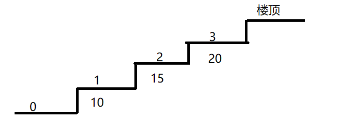

从第0层走到 1 、2 层是不需要花费体力的

假设我们从第0层一次性爬俩步到第二层，花费体力为0.

从第二层我们仍然可以选择一次性爬俩步到达楼顶，总共花费：15

- 确定dp数组（dp table）以及下标的含义
    - dp[i] : 表示爬到第 i 节楼梯最低的花费
    - 由于楼梯数要比层数大1，因此：dp[cost.length+1]
- 确定递推公式
    - 到达第 i 节楼梯时，一共有俩种方式：
        - 可以从第 i-1 节使用 cost[i-1] 到达
        - 可以从 i-2 节使用 cost[i-2] 到达
    - 因此为了使花费最少，应在以上俩种方式中选择一个花费最少的：
        - *dp*[*i*]=min(*dp*[*i*−1]+*cost*[*i*−1],*dp*[*i*−2]+*cost*[*i*−2])

```java
    public int minCostClimbingStairs(int[] cost) {
        // 定义dp数组，含义：爬到第i层的最低花费
        int[] dp = new int[cost.length+1];
        // 第一步不需要花费
        dp[0] = 0;
        dp[1] = 0;
        for (int i = 2; i <= cost.length; i++) {
            // 选择最少的花费开始爬
            dp[i] = Math.min(dp[i - 1] + cost[i - 1],  dp[i - 2] + cost[i - 2]);
        }
        System.out.println(Arrays.toString(dp));
        return dp[cost.length];
    }
```


## [62. 不同路径](https://leetcode.cn/problems/unique-paths/)

一个机器人位于一个 `m x n` 网格的左上角 （起始点在下图中标记为 “Start” ）。

机器人每次只能向下或者向右移动一步。机器人试图达到网格的右下角（在下图中标记为 “Finish” ）。

问总共有多少条不同的路径？


**示例 1：**

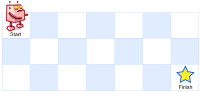

```
输入：m = 3, n = 7
输出：28
```

**示例 2：**

```
输入：m = 3, n = 2
输出：3
解释：
从左上角开始，总共有 3 条路径可以到达右下角。
1. 向右 -> 向下 -> 向下
2. 向下 -> 向下 -> 向右
3. 向下 -> 向右 -> 向下
```

**示例 3：**

```
输入：m = 7, n = 3
输出：28
```

**示例 4：**

```
输入：m = 3, n = 3
输出：6
```


**提示：**

- `1 <= m, n <= 100`
- 题目数据保证答案小于等于 `2 * 109`

### 思路分析

- 确定dp数组（dp table）以及下标的含义
    - 当前位置共有dp\[i][j] 种路径
- 确定递推公式

这道题其实我们仔细找一下规律和杨辉三角非常的像

每种结果都等于 `上面的结果 + 左边的结果`  , 用转化为 递推公式为：`dp[i][j] = dp[i][j-1] +dp[i-1][j] `


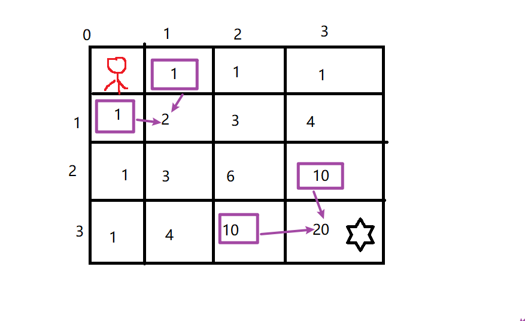

- dp数组如何初始化

通过上图可以得知，第一行和第一列初始化为1

- 确定遍历顺序

从递推公式可以看出，当前结果是由上一层和前一列得出，因此一层一层的从左往右遍历即可。

- 举例推导dp数组

**完整代码**

```java
  /**
     * 1. 确定dp数组下标含义 dp[i][j] 到每一个坐标可能的路径种类
     * 2. 递推公式 dp[i][j] = dp[i-1][j] dp[i][j-1]
     * 3. 初始化 dp[i][0]=1 dp[0][i]=1 初始化横竖就可
     * 4. 遍历顺序 一行一行遍历
     * 5. 推导结果 。。。。。。。。
     *
     * @param m
     * @param n
     * @return
     */
    public int uniquePaths(int m, int n) {
        int[][] dp = new int[m][n];
        //初始化
        for (int i = 0; i < m; i++) {
            dp[i][0] = 1;
        }
        for (int i = 0; i < n; i++) {
            dp[0][i] = 1;
        }

        for (int i = 1; i < m; i++) {
            for (int j = 1; j < n; j++) {
                dp[i][j] = dp[i-1][j]+dp[i][j-1];
            }
        }
        return dp[m-1][n-1];
    }
```

## [343. 整数拆分](https://leetcode.cn/problems/integer-break/)

给定一个正整数 `n` ，将其拆分为 `k` 个 **正整数** 的和（ `k >= 2` ），并使这些整数的乘积最大化。

返回 *你可以获得的最大乘积* 。


**示例 1:**

```
输入: n = 2
输出: 1
解释: 2 = 1 + 1, 1 × 1 = 1。
```

**示例 2:**

```
输入: n = 10
输出: 36
解释: 10 = 3 + 3 + 4, 3 × 3 × 4 = 36。
```


**提示:**

- `2 <= n <= 58`


### 思路分析

对于整数 n 来说，他的每个正整数的最大乘积取决于上一个整合的最大乘积，因此我们可以用 **动态规划**

1、dp数组下标的含义

dp[i] : 表示将 整数 i 拆分成整数的最大乘积为 dp[i]

2、dp数组的初始化

dp[0] = dp[1] = 0 , dp[2] = 2

3、确定递推公式

n >=  2, 假设拆分出第一个整数为 j，那么他有俩种可能得到最大乘积：

1. 拆分俩个正整数：j 和 i-j ，则乘积为：(i-j) * j
2. 拆分俩个以上的正整数：j 和  i-j 拆分更多的正整数，则乘积为： dp[i-j] * j

```
dp[i-j] 相当于拆分 i-j，得到的是 i-j 的最大乘积
```


**完整代码**

```java
class Solution {
    public int integerBreak(int n) {
        if (n == 2) return 1;
        // 定义dp数组
        int[] dp = new int[n + 1];
        // 初始化，整数为2，最大乘积就是 1*1 = 2
        dp[2] = 1;

        for (int i = 3; i <= n; i++) {
            // j表示拆分的正整数，从1开始，0没有意义，任何数*0=0
            for (int j = 1; j < i - 1; j++) {
                /*
                * (i - j) * j 表示拆分成2个正整数: j 和 i-j
                * dp[i - j] * j : 表示将 i-j拆分成多个正整数
                * */
                dp[i] = Math.max(dp[i], Math.max((i - j) * j, dp[i - j] * j));
            }
        }
        return dp[n];
    }
}
```


## [96. 不同的二叉搜索树](https://leetcode.cn/problems/unique-binary-search-trees/)

给你一个整数 `n` ，求恰由 `n` 个节点组成且节点值从 `1` 到 `n` 互不相同的 **二叉搜索树** 有多少种？返回满足题意的二叉搜索树的种数。


**示例 1：**


```
输入：n = 3
输出：5
```

**示例 2：**

```
输入：n = 1
输出：1
```


**提示：**

- `1 <= n <= 19`


### 思路分析

1、定义dp数组以及下标的含义

dp[i] 表示：整数为i时，一共可以构建 dp[i] 种二叉搜索树

2、初始化

dp[0] = dp[1] = 1, 空树也算二叉搜索树

3、确定递推关系式

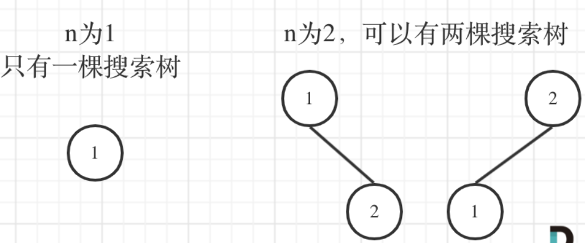

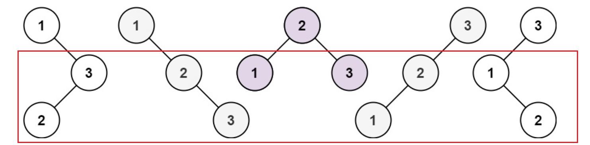


当头结点为 1 或者 3 时，我们看左右子节点其实和 n=2 时一样

当头结点为 2 时，左右子节点其实和 n=1 一样

```java
// 因此求 n 个结点的二叉搜索树的数量时就是： 左子树的二叉搜素树数量 * 右子树的二叉搜索树数量
// 假设头结点为 j，则有：
dp[i] += dp[j-1] * dp[i-j] // j-1 为左子树，i-j为右子树，这是利用了二叉搜索树的性质。
// 使用 += 的原因是因为我们要逐渐累加左右子树的二叉搜索树的数量
```


**完整代码**

```java
class Solution {
    public int numTrees(int n) {
        // 定义dp数组
        int[] dp = new int[n+1];
        // 初始化
        dp[0] = dp[1] = 1;
        // 外层循环计算由 2~n的二叉搜索树数量
        for (int i = 2; i <= n; i++) {
            // 内层循环计算: 由j为头结点时，左右子树的二叉搜索树数量
            for (int j = 1; j <= i; j++) {
                // 使用 += 是因为我们要逐渐累加头结点为 1~i时的左右子树的二叉搜索树的数量
                dp[i] += dp[j-1] * dp[i-j];
            }
        }
        return dp[n];
    }
}
```


## 背包问题

对于背包问题，分为：01背包、完全背包、多重背包、分组背包等等，掌握01、完全背包对付面试完全足够了！

01背包：有n种物品，每种物品只有一个

完全背包：有n种物品，每种物品有无限个

多重背包：有n种物品，每种物品的个数不确定


### 01背包-二维数组

有一个背包，容量为4磅 ， 现有如下物品， 要求达到的目标为装入的背包的**总价值最大**，并且重量**不超出背包的容量**， 要求装入的物品**不能重复**

|       | 重量w | 价值v |
| ----- | ----- | ----- |
| 物品0 | 1     | 15    |
| 物品1 | 3     | 20    |
| 物品2 | 4     | 30    |


- **确定dp数组及下标的含义**

对于01背包问题，可以使用基础的二维数组，也可以用优化的一维数组。先来说二维数组

dp\[i]\[j] : 表示装入 0~i 个物品，重量为 j 的最大价值

- **确定递推关系式**

确定关系式，就要知道 dp\[i]\[j] 由哪种情况可以得来，对于背包问题来说，无非有俩种情况，一种是不放第 i 个物品，一种是放第 i 个物品：

不放第 i 个物品 的价值，当前背包容量小于第 i 个物品的重量： dp\[i-1]\[j]

放第i 个物品的价值，当前背包容量大于等于第 i 个物品的重量： dp\[i-1][j-w[i]] + v[i]

```
dp[i-1][j-w[i]] + v[i] : 背包容量 - 物品i的重量 所能装入物品的最大价值 + 物品i的价值
```

俩种方案选择最大价值的为结果：

`Math.max（dp[i-1][j]，dp[i-1][j-w[i]] + v[i]）`

- **初始化dp数组**

当 j = 0 时，放不下任何物品，其总价值也一定为0.

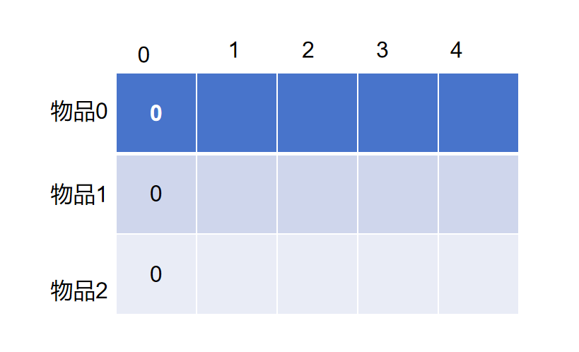

当 j != 0 时，我们说了有俩种方案可以得到当前的总价值，一个是由正上方推导而来，一个是由左上方推导而来，因此我们还需要初始化第一行。
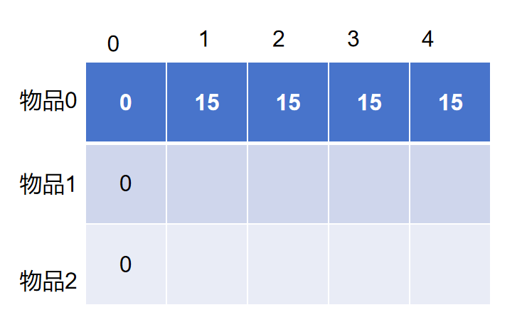需要注意的是，如果物品0的重量为3，那么对于重量为 1、2时，他的总价值也为0

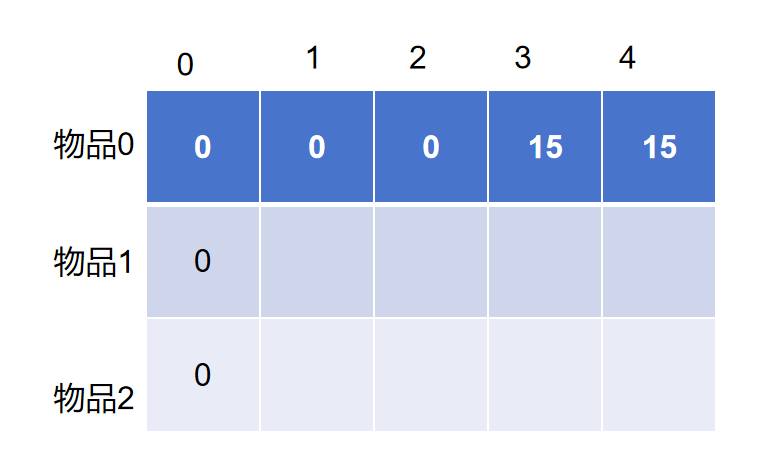


**完整代码**

```java
public class Knapsack01 {
    public static void main(String[] args) {
        int[] weight = {1, 2, 4};
        int[] value = {15, 20, 30};
        testWeightBagProblem(weight, value, 4);
    }

    public static void testWeightBagProblem(int[] weight, int[] value, int bagSize) {
        // 定义dp数组:，dp[i][j]含义：放入0~i个物品重量为 j 时的最大价值
        int[][] dp = new int[weight.length][bagSize + 1];

        // 初始化dp数组，第一行为物品0的价值
        for (int j = 1; j <= bagSize; j++) {
            dp[0][j] = value[0];
        }

        // 填充dp数组
        for (int i = 1; i < weight.length; i++) { // 遍历物品
            for (int j = 1; j <= bagSize; j++) { // 遍历背包容量
                if (weight[i] > j) {
                    // 当前物品的容量大于背包容量
                    dp[i][j] = dp[i - 1][j];
                } else {
                    // 当前物品容量小于或等于背包容量
                    dp[i][j] = Math.max(dp[i - 1][j], dp[i - 1][j - weight[i]] + value[i]);
                }
            }
        }

        // 打印dp数组
        for (int i = 0; i < weight.length; i++) {
            for (int j = 0; j <= bagSize; j++) {
                System.out.print(dp[i][j] + "\t");
            }
            System.out.println("\n");
        }
    }
}
```


### **01背包-一维数组**

相较于二维数组的实现，一维数组其实就是将每一行的数据都进行拷贝。利用上一层的数据拷贝到当前层(滚动数组)

- **dp数组的含义**

dp[j] : 表示重量为 j 的容量的最大价值

- **递推关系式**

同样是有俩种情况：

1. 不放入第 i 个物品:  dp[j]
2. 放入第 i 个物品 ： dp[j-weight[i]] + value[i]

- **初始化**

初始化尽量初始化成一个最小的非负整数，避免由于值太大而覆盖原本计算出来的值，这里直接都初始化成0是可以的

- **遍历顺序**

一维数组的遍历顺序是非常讲究的，在二维数组中我们正序、倒序遍历都可以，但是在一维数组中，我们只能倒序，即：

```java
        for (int i = 0; i < weight.length; i++) { // 遍历物品
            for (int j = bagSize; j >= weight[i]; j--) { // 遍历背包容量，一定要倒序，保证每个物品仅增加一遍
                }
            }
```


这是因为我们使用的是一维数组，每个值都是需要重复使用的，如果正序遍历，就会导致一个物品被重复装入的可能。

比如：

dp[j-weight[i]] + value[i] 带入：

dp[1] = dp[1-1] + 15 = 15

dp[2] = dp[2-1] + 15 = 30

可以发现，容量为2时，重复增加了物品0

倒序就不会出现这种情况：

dp[2] = dp[2-1] + 15 = 15

dp[1] = dp[1-1] + 15 = 15


**完整代码**

```java
    // 一维数组实现
    public static void testWeightBagProblemByOne(int[] weight, int[] value, int bagSize) {
        // dp[j] 表示容量为j时 所能装入的最大价值
        int[] dp = new int[bagSize + 1];

        // 填充数组
        for (int i = 0; i < weight.length; i++) { // 遍历物品
            for (int j = bagSize; j >= weight[i]; j--) { // 遍历背包容量，一定要倒序，保证每个物品仅增加一遍
                 dp[j] = Math.max(dp[j - weight[i]] + value[i],dp[j]);
            }
        }
        System.out.println(Arrays.toString(dp));
    }
```


### 完全背包

完全背包与01背包的区别: 01背包中的物品只能使用一次，完全背包中的物品可以无限使用

在 01背包问题中起始就有过说明,在我们遍历容量的时候要使用倒序，目的就是为了防止物品重复增加，而对于完全背包来说，只需要将容量正序遍历即可。

```java
        for (int i = 0; i < weight.length; i++) { // 遍历物品
            for (int j = weight[i]; j <= bagSize; j--) { // 遍历背包容量
                dp[j] = Math.max(dp[j - weight[i]] + value[i],dp[j]);
            }
        }


		for (int j = 0; j <= bagSize; j--) { // 遍历背包容量
           for (int i = 0; i < weight.length; i++) { // 遍历物品
               if(j - weight[i] >= 0)
                   dp[j] = Math.max(dp[j - weight[i]] + value[i],dp[j]);
       	 }
        }    


```

对于完全背包问题，其实先遍历物品还是先遍历背包容量是无所谓的, 因为当前背包的价值由前一个背包的价值得来，只要保障前一个价值计算值正确即可。

但是对于LeetCode某些题，遍历顺序就很重要了！！


## [416. 分割等和子集](https://leetcode.cn/problems/partition-equal-subset-sum/)

给你一个 **只包含正整数** 的 **非空** 数组 `nums` 。请你判断是否可以将这个数组分割成两个子集，使得两个子集的元素和相等。


**示例 1：**

```
输入：nums = [1,5,11,5]
输出：true
解释：数组可以分割成 [1, 5, 5] 和 [11] 。
```

**示例 2：**

```
输入：nums = [1,2,3,5]
输出：false
解释：数组不能分割成两个元素和相等的子集。
```


**提示：**

- `1 <= nums.length <= 200`
- `1 <= nums[i] <= 100`

### 思路分析

这道题大概一看，可能会发现使用回溯进行求解，但是毫无疑问，超时！！！！

因此，这道题我们也可以转换为 01背包问题，那么我们需要知道以下问题：

- 物品的价值、重量对应本地中的数组元素值
- 背包的容量为 数组元素总和 / 2
- 背包不能放入重复的元素

了解以上问题，我们就可以将这道题转换为01背包问题了

- **确定dp数组及下标含义**

01背包中，dp[j] 表示： 容量为j的背包，所背的物品价值最大可以为dp[j]。

在这道题中我们可以认为，在容量为 j 时，元素值的最大和为 dp[j] , 由于重量和价值是等价的，因此我们可以认为，当 dp 装满之后，如果等于 数组元素总和 / 2  就说明可以分割成俩个元素相等的子集。

- **递推关系式**

01背包的递推公式为：dp[j] = max(dp[j], dp[j - weight[i]] + value[i]);

weight[i] 和 value[i] 都是 nums[i], 因此该题的关系式为：

dp[j] = max(dp[j], dp[j - nums[i]] + nums[i]);

- **初始化**

和01背包一样，都为0

- **遍历顺序**

01背包问题最重要的一个条件就是物品不能重复使用，因此在使用一维数组时，仍然要采取倒序遍历

- **推导dp数组**

输入[1,5,11,5] 为例，如图：

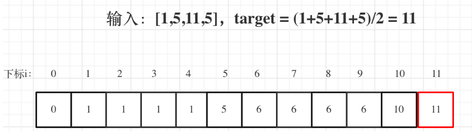


**完整代码**

```java
class Solution {
    public boolean canPartition(int[] nums) {
        if (nums.length == 0) return false;


        int sum = Arrays.stream(nums).sum();
        // 如果可以分割等和子集，则该子集的和为target

                // 和为奇数，不能分割成等长的子集
        if (sum % 2 != 0) return false;
        int target = sum / 2;

        int[] dp = new int[target + 1];

        for (int i = 0; i < nums.length; i++) {
            // 保证每个元素只使用一次，一定要倒序！
            // nums[i] 即表示重量也表示价值
            for (int j = target; j >= nums[i]; j--) {
                dp[j] = Math.max(dp[j],dp[j-nums[i]] + nums[i]);
            }
            // 当dp数组被填满之后，并且最大值为子集的和
            if (dp[target] == target) return true;
        }
        return dp[target] == target;
    }
}
```

## [1049. 最后一块石头的重量 II](https://leetcode.cn/problems/last-stone-weight-ii/)

有一堆石头，用整数数组 `stones` 表示。其中 `stones[i]` 表示第 `i` 块石头的重量。

每一回合，从中选出**任意两块石头**，然后将它们一起粉碎。假设石头的重量分别为 `x` 和 `y`，且 `x <= y`。那么粉碎的可能结果如下：

- 如果 `x == y`，那么两块石头都会被完全粉碎；
- 如果 `x != y`，那么重量为 `x` 的石头将会完全粉碎，而重量为 `y` 的石头新重量为 `y-x`。

最后，**最多只会剩下一块** 石头。返回此石头 **最小的可能重量** 。如果没有石头剩下，就返回 `0`。


**示例 1：**

```
输入：stones = [2,7,4,1,8,1]
输出：1
解释：
组合 2 和 4，得到 2，所以数组转化为 [2,7,1,8,1]，
组合 7 和 8，得到 1，所以数组转化为 [2,1,1,1]，
组合 2 和 1，得到 1，所以数组转化为 [1,1,1]，
组合 1 和 1，得到 0，所以数组转化为 [1]，这就是最优值。
```

**示例 2：**

```
输入：stones = [31,26,33,21,40]
输出：5
```


**提示：**

- `1 <= stones.length <= 30`
- `1 <= stones[i] <= 100`


### 思路分析

其实这道题难得是 **如何转换成01 背包**

首先我们看题目描述，目的是随机取走俩个数，计算其差值，将差值放入原数组中，继续与其他元素求差值，使求得的差值最小。

假设有 a,b,c,d 四个元素，并且满足 a >= b >= c >=d

第一次取a,b，求出差值 a - b, 此时 stones = [a-b,c,d]

第二次取c,d，求出差值 c -d , 此时 stones =[a-b,c-d]

第三次取a-b,c-d，求出差值(a-b) - (c-d)

通过上面的例子我们可以看出来，所谓的【取出】【放回】无非是改变元素的符号，最后形成一个扁平化的 【计算表达式】

而想要 `(a-b) - (c-d) <==> a-b-c+d <==> (a+d) - (b+c)` 这个【计算表达式】差值最小，那么就应该保证`a+d` 和 `b+c` 尽可能的接近。接近总和 sum/2。

说到这，其实就和 [416. 分割等和子集](https://leetcode.cn/problems/partition-equal-subset-sum/) 题一样了，在 416 题中，是 "==" sum/2 , 而在这道题中是尽可能接近  sum/2.

> 将 stones 所有的石头尽可能分成俩堆，这俩堆的总和尽可能的接近 sum/2

```java
    public int lastStoneWeightII(int[] stones) {

        // 计算石头的总重量
        int sum = Arrays.stream(stones).sum();
        // 尽量将俩堆的重量分成相等的情况
        int target = sum / 2;

        int[] dp = new int[target + 1];
        for (int i = 0; i < stones.length; i++) { // 遍历物品
            for (int j = target; j >= stones[i]; j--) { // 遍历背包，倒序遍历，防止多次放入同一个石头
                // 俩种情况，放或者不放
                dp[j] = Math.max(dp[j], dp[j - stones[j]] + stones[j]);
            }
        }
        // 俩个target值都不会超过 sum/2 ，因此求出来一定是正整数且最少
        return sum - dp[target] * 2;
    }
```

## [494. 目标和](https://leetcode.cn/problems/target-sum/)

给你一个非负整数数组 `nums` 和一个整数 `target` 。

向数组中的每个整数前添加 `'+'` 或 `'-'` ，然后串联起所有整数，可以构造一个 **表达式** ：

- 例如，`nums = [2, 1]` ，可以在 `2` 之前添加 `'+'` ，在 `1` 之前添加 `'-'` ，然后串联起来得到表达式 `"+2-1"` 。

返回可以通过上述方法构造的、运算结果等于 `target` 的不同 **表达式** 的数目。


**示例 1：**

```
输入：nums = [1,1,1,1,1], target = 3
输出：5
解释：一共有 5 种方法让最终目标和为 3 。
-1 + 1 + 1 + 1 + 1 = 3
+1 - 1 + 1 + 1 + 1 = 3
+1 + 1 - 1 + 1 + 1 = 3
+1 + 1 + 1 - 1 + 1 = 3
+1 + 1 + 1 + 1 - 1 = 3
```

**示例 2：**

```
输入：nums = [1], target = 1
输出：1
```


**提示：**

- `1 <= nums.length <= 20`
- `0 <= nums[i] <= 1000`
- `0 <= sum(nums[i]) <= 1000`
- `-1000 <= target <= 1000`


### 思路分析

这道题与上面的动态规划题有些不一样，在我们做过的动态背包问题中，都是背包最大容量下能够装多少

而这道题则是有多少种方式能够将背包装满，这么一听貌似是组合问题，可以用回溯算法。

但是回溯算法的时间复杂度为：2^n^ 对于这道题超时！！


**那么如何转化为动态规划呢？**

假如表达式中的加法总和为 x ，那么对应的减法总和为: sum - x

进一步推导  x - (sum - x )= target, x = (target - sum)/2 ， 此时target、sum已知，而问题的关键就是在nums中求出 x 的集合。

x 就是我们背包的容量，还需要注意一点，假设  (target - sum)/2 不是整除的话，其实是没有结果的。

**定义dp数组**

dp[j]:表示容量为j时，有dp[j]种方法

**确定递推关系式**

有哪些来源可以推出dp[j]呢？

只要搞到nums[i]，凑成dp[j]就有dp[j - nums[i]] 种方法。

例如：dp[j]，j 为5，

- 已经有一个1（nums[i]） 的话，有 dp[4]种方法 凑成 容量为5的背包。
- 已经有一个2（nums[i]） 的话，有 dp[3]种方法 凑成 容量为5的背包。
- 已经有一个3（nums[i]） 的话，有 dp[2]中方法 凑成 容量为5的背包
- 已经有一个4（nums[i]） 的话，有 dp[1]中方法 凑成 容量为5的背包
- 已经有一个5 （nums[i]）的话，有 dp[0]中方法 凑成 容量为5的背包

那么凑整dp[5]有多少方法呢，也就是把 所有的 dp[j - nums[i]] 累加起来。

```
dp[j] += do[j-nums[i]]
```


**初始化**

在初始化时，我们要将 dp[0] = 1, 如果=0的话，无论有多少种方法最后都是0

```java
    public int findTargetSumWays(int[] nums, int target) {
        int sum = 0;
        for (int i = 0; i < nums.length; i++) sum += nums[i];
        //如果target过大 sum将无法满足
        if ( target < 0 && sum < -target) return 0;
        if ((target + sum) % 2 != 0) return 0;
        int size = (target + sum) / 2;
        if(size < 0) size = -size;
        int[] dp = new int[size + 1];
        dp[0] = 1;
        for (int i = 0; i < nums.length; i++) {
            for (int j = size; j >= nums[i]; j--) {
                dp[j] += dp[j - nums[i]];
            }
        }
        return dp[size];
    }
```


## [474. 一和零](https://leetcode.cn/problems/ones-and-zeroes/)

给你一个二进制字符串数组 `strs` 和两个整数 `m` 和 `n` 。

请你找出并返回 `strs` 的最大子集的长度，该子集中 **最多** 有 `m` 个 `0` 和 `n` 个 `1` 。

如果 `x` 的所有元素也是 `y` 的元素，集合 `x` 是集合 `y` 的 **子集** 。


**示例 1：**

```
输入：strs = ["10", "0001", "111001", "1", "0"], m = 5, n = 3
输出：4
解释：最多有 5 个 0 和 3 个 1 的最大子集是 {"10","0001","1","0"} ，因此答案是 4 。
其他满足题意但较小的子集包括 {"0001","1"} 和 {"10","1","0"} 。{"111001"} 不满足题意，因为它含 4 个 1 ，大于 n 的值 3 。
```

**示例 2：**

```
输入：strs = ["10", "0", "1"], m = 1, n = 1
输出：2
解释：最大的子集是 {"0", "1"} ，所以答案是 2 。
```


**提示：**

- `1 <= strs.length <= 600`
- `1 <= strs[i].length <= 100`
- `strs[i]` 仅由 `'0'` 和 `'1'` 组成
- `1 <= m, n <= 100`


### 思路分析

这道题我们可以把 0 和 1的个数看做背包的容量，再次之前背包容量只有一个维度来决定，这道题由俩个纬度，m 和 n，把每一个字符串看做放入背包的物品，因此可以使用01背包求解。

**动态规划的思路是**：物品一个一个尝试，容量一点一点尝试，每个物品分类讨论的标准是：选与不选。

**确定dp数组含义**

dp\[i][j] : 表示i个0 j 个1的情况下，有dp\[i][j] 个子集

**确定递推关系式**

原01背包递推关系式：dp\[j] = Math.max(dp[j],dp[j-weight[i]] + value[i])

对于这道题来说，有一个weight纬度变成了俩个纬度：因此 dp\[i][j] = Math.max(dp\[i][j],dp\[i - 当前字符串使用0的个数][j - 当前字符串使用1的个数] + 1)

```java
class Solution {
    public int findMaxForm(String[] strs, int m, int n) {
        int[][] dp = new int[m + 1][n + 1];
        int zero, one;

        for (String str : strs) { // 遍历物品
            zero = 0;
            one = 0;
            for (char c : str.toCharArray()) {
                if (c == '0') {
                    zero++;
                } else {
                    one++;
                }
            }

            for (int i = m; i >= zero; i--) { // 遍历背包容量，有俩个纬度
                for (int j = n; j >= one; j--) {
                    dp[i][j] = Math.max(dp[i][j], dp[i - zero][j - one] + 1);
                }
            }
        }
        return dp[m][n];
    }
}
```


## [518. 零钱兑换 II](https://leetcode.cn/problems/coin-change-ii/)

给你一个整数数组 `coins` 表示不同面额的硬币，另给一个整数 `amount` 表示总金额。

请你计算并返回可以凑成总金额的硬币组合数。如果任何硬币组合都无法凑出总金额，返回 `0` 。

假设每一种面额的硬币有无限个。

题目数据保证结果符合 32 位带符号整数。


**示例 1：**

```
输入：amount = 5, coins = [1, 2, 5]
输出：4
解释：有四种方式可以凑成总金额：
5=5
5=2+2+1
5=2+1+1+1
5=1+1+1+1+1
```

**示例 2：**

```
输入：amount = 3, coins = [2]
输出：0
解释：只用面额 2 的硬币不能凑成总金额 3 。
```

**示例 3：**

```
输入：amount = 10, coins = [10] 
输出：1
```


**提示：**

- `1 <= coins.length <= 300`
- `1 <= coins[i] <= 5000`
- `coins` 中的所有值 **互不相同**
- `0 <= amount <= 5000`


### 思路分析

题目说明硬币的数量无限，因此我们可以看出来使用完全背包进行求解。

**定义dp数组的含义**

dp[j]：金额为j时，一共有 dp[j]中组合方式。

**注意组合和排列的区别**：组合不强调元素的顺序，排列强调元素的顺序

{2,2,1},{2,1,2} 是一种组合，但是是俩种排列！！！！

**递推关系式**

在求组合问题时，公式通用：

dp[j] += dp[j - coins[i]]

**遍历顺序**

对于这道题的遍历顺序是非常讲究的，在讲完全背包时，我们说先遍历物品还是先遍历背包都无所谓，但对于这种求组合的问题，就不能无所谓了！！

当我们先遍历物品时,假设：coins[0] = 1，coins[1] = 5。

那么就是先把1加入计算，然后再把5加入计算，得到的方法数量只有{1, 5}这种情况。而不会出现{5, 1}的情况。

```java
        for (int i = 0; i < coins.length; i++) { //遍历物品
            for (int j = coins[i]; j <= amount; j++) { // 遍历容量
                dp[j] += dp[j - coins[i]];
            }
        }
```

**因此这种遍历顺序正是求组合的遍历顺序！！！**


当先遍历背包时：

```java
for (int j = 0; j <= amount; j++) { // 遍历背包容量
    for (int i = 0; i < coins.size(); i++) { // 遍历物品
        if (j - coins[i] >= 0) dp[j] += dp[j - coins[i]];
    }
}
```

背包容量的每一个值，都是经过 1 和 5 的计算，包含了{1, 5} 和 {5, 1}两种情况。

**因此这种遍历顺序是求全排列的遍历顺序！！！！**

```java
public int change(int amount, int[] coins) {
        // dp[j]: 表示金额为j时，一共有dp[j]中组合方式
        int[] dp = new int[amount + 1];
        dp[0] = 1;
        for (int i = 0; i < coins.length; i++) { //遍历物品
            for (int j = coins[i]; j <= amount; j++) { // 遍历容量
                dp[j] += dp[j - coins[i]];
            }
            System.out.println(Arrays.toString(dp));
        }

        return dp[amount];
    }
```


## [377. 组合总和 Ⅳ](https://leetcode.cn/problems/combination-sum-iv/)

给你一个由 **不同** 整数组成的数组 `nums` ，和一个目标整数 `target` 。请你从 `nums` 中找出并返回总和为 `target` 的元素组合的个数。

题目数据保证答案符合 32 位整数范围。


**示例 1：**

```
输入：nums = [1,2,3], target = 4
输出：7
解释：
所有可能的组合为：
(1, 1, 1, 1)
(1, 1, 2)
(1, 2, 1)
(1, 3)
(2, 1, 1)
(2, 2)
(3, 1)
请注意，顺序不同的序列被视作不同的组合。
```

**示例 2：**

```
输入：nums = [9], target = 3
输出：0
```


**提示：**

- `1 <= nums.length <= 200`
- `1 <= nums[i] <= 1000`
- `nums` 中的所有元素 **互不相同**
- `1 <= target <= 1000`


**进阶：**如果给定的数组中含有负数会发生什么？问题会产生何种变化？如果允许负数出现，需要向题目中添加哪些限制条件？


### 思路分析

这道题和 518 不同的是，这题要求的是 **全排列** 问题


**定义dp数组及下标含义**

dp[j]: 表示和为 j 时，一共有 dp[j] 种组合方式

**递推公式**

dp[j] += dp[j - nums[i]]

**遍历顺序**

对于动态规划，求组合问题 或者 全排列问题 遍历的顺序是不一样的。

**组合问题：** 先遍历物品，在遍历容量。

**全排列问题：** 先遍历容量，在遍历物品。

```java
class Solution {
    public int combinationSum4(int[] nums, int target) {
        // dp[j]: 表示和为j时，一共有dp[j]种方式
        int[] dp = new int[target + 1];
        dp[0] = 1;
        // 动态规划求全排列问题，先遍历容量在遍历物品。求组合问题则相反
        for (int j = 0; j <= target; j++) { // 遍历容量
            for (int i = 0; i < nums.length; i++) { // 遍历物品
               if (j - nums[i] >= 0) dp[j] += dp[j - nums[i]]; 
            }
        }
        // System.out.println(Arrays.toString(dp));
        return dp[target];
    }
}
```

## [322. 零钱兑换](https://leetcode.cn/problems/coin-change/)

给你一个整数数组 `coins` ，表示不同面额的硬币；以及一个整数 `amount` ，表示总金额。

计算并返回可以凑成总金额所需的 **最少的硬币个数** 。如果没有任何一种硬币组合能组成总金额，返回 `-1` 。

你可以认为每种硬币的数量是无限的。


**示例 1：**

```
输入：coins = [1, 2, 5], amount = 11
输出：3 
解释：11 = 5 + 5 + 1
```

**示例 2：**

```
输入：coins = [2], amount = 3
输出：-1
```

**示例 3：**

```
输入：coins = [1], amount = 0
输出：0
```


**提示：**

- `1 <= coins.length <= 12`
- `1 <= coins[i] <= 231 - 1`
- `0 <= amount <= 104`


### 思路分析

**确定dp数组及其下标含义**

dp[j] : 表示凑成金额j时，最少需要dp[j]个硬币

**确定递推公式**

凑足总额为 j - coins[i] 的最少个数为dp[j - coins[i]]，那么只需要加上一个钱币coins[i]即dp[j - coins[i]] + 1就是dp[j]（考虑coins[i]）

所以dp[j] 要取所有 dp[j - coins[i]] + 1 中最小的。

递推公式：dp[j] = min(dp[j - coins[i]] + 1, dp[j]);


**初始化**

在对dp数组初始化时，应尽量初始化为一个较大值，否则就会在dp[j] = min(dp[j - coins[i]] + 1, dp[j]);  比较时被覆盖！

**遍历顺序**

由于这道题并不是求组合、全排列问题，因此先遍历背包或者是物品都可以

```java
class Solution {
    public int coinChange(int[] coins, int amount) {
        // dp[j]: 当金额为j时，最少需要dp[j]个硬币
        int[] dp = new int[amount + 1];
        // 将dp数组填充尽可能大的值，否则不会被覆盖
        Arrays.fill(dp,Integer.MAX_VALUE);
        dp[0] = 0;

        for (int i = 0; i < coins.length; i++) {
            for (int j = coins[i]; j <= amount; j++) {
                // 只有当dp[j - coins[i]]不是最大值的时候，才有必要进行替换
                // // 否则在进行比较时dp[j - coins[i]] + 1 可能会溢出或者导致不正确的值！！
                if (dp[j - coins[i]] != Integer.MAX_VALUE) {
                    dp[j] = Math.min(dp[j],dp[j - coins[i]] + 1);
                }
            }
        }
        return dp[amount] == Integer.MAX_VALUE ? -1 : dp[amount];
    }
}
```


## [279. 完全平方数](https://leetcode.cn/problems/perfect-squares/)

给你一个整数 `n` ，返回 *和为 `n` 的完全平方数的最少数量* 。

**完全平方数** 是一个整数，其值等于另一个整数的平方；换句话说，其值等于一个整数自乘的积。例如，`1`、`4`、`9` 和 `16` 都是完全平方数，而 `3` 和 `11` 不是。


**示例 1：**

```
输入：n = 12
输出：3 
解释：12 = 4 + 4 + 4
```

**示例 2：**

```
输入：n = 13
输出：2
解释：13 = 4 + 9
```


**提示：**

- `1 <= n <= 104`


### 思路分析

每一个完全平方数可以看做是物品，可以使用无限次，因此是完全背包。

背包容量就是完全平方数的和 n

**确定dp含义**

dp[j] : 表示和为j时，最少需要dp[j]个完全平方数

**递推关系式**

- dp[j] 可以由dp[j - i * i]推出， dp[j - i * i] + 1 便可以凑成dp[j]。
- 所以递推公式：dp[j] = min(dp[j - i * i] + 1, dp[j]);

**初始化**

由于要求最少值，数组尽可能初始化为较大的值

dp[0] 初始化成0


```java
class Solution {
    public int numSquares(int n) {
        // dp[j]: 表示和为j时,所需要最少得完全平方数个数为dp[j]个
        int[] dp = new int[n + 1];
        Arrays.fill(dp,Integer.MAX_VALUE);
        dp[0] = 0;


        for (int j = 0; j <= n; j++) { // 先遍历背包容量
            for (int i = 1; i * i <= j; i++) { // 遍历物品，物品为每一个完全平方数
                dp[j] = Math.min(dp[j],dp[j - i * i] + 1);
            }
        }
        return dp[n];
    }
}
```


## [139. 单词拆分](https://leetcode.cn/problems/word-break/)

给你一个字符串 `s` 和一个字符串列表 `wordDict` 作为字典。如果可以利用字典中出现的一个或多个单词拼接出 `s` 则返回 `true`。

**注意：**不要求字典中出现的单词全部都使用，并且字典中的单词可以重复使用。


**示例 1：**

```
输入: s = "leetcode", wordDict = ["leet", "code"]
输出: true
解释: 返回 true 因为 "leetcode" 可以由 "leet" 和 "code" 拼接成。
```

**示例 2：**

```
输入: s = "applepenapple", wordDict = ["apple", "pen"]
输出: true
解释: 返回 true 因为 "applepenapple" 可以由 "apple" "pen" "apple" 拼接成。
     注意，你可以重复使用字典中的单词。
```

**示例 3：**

```
输入: s = "catsandog", wordDict = ["cats", "dog", "sand", "and", "cat"]
输出: false
```


**提示：**

- `1 <= s.length <= 300`
- `1 <= wordDict.length <= 1000`
- `1 <= wordDict[i].length <= 20`
- `s` 和 `wordDict[i]` 仅由小写英文字母组成
- `wordDict` 中的所有字符串 **互不相同**


### 思路分析

**确定dp含义**

dp[i]: 表示前 i个字符串，是否能够为空格拆分。

**确定递推关系式**

在遍历s串的时候，我们可以尝试使用j来定位 s串的分割点。那么s串就会被分成俩个子串s1为

*s.substring(0, j)*,s2为 *s.substring(j, i)*，如果这俩个子串都合法，那么我们就可以证明 s 串合法。

*s.substring(0, j)*, 我们可以用 dp[j] 表示，如果 dp[j] = true ，表示s1是合法，那么我们只需要在判断 s2 是否出现在 wordDict 即可，如果有，就说明s串是合法的。

因此我们可以推出关系式为: `d[j] && wordDict.contains(s.substring(j, i))`

**初始化**

dp[0] = true, 表示空串是合法的。


```java
class Solution {
    public boolean wordBreak(String s, List<String> wordDict) {
        // 将list转换成set，提高效率
        HashSet<String> set = new HashSet<>(wordDict);
        // dp[i]: 表示S(0~i)是否是合法的
        boolean[] dp = new boolean[s.length() + 1];
        dp[0] = true;

        for (int i = 1; i <= s.length(); i++) { // 遍历字符串(背包)，从1开始，因为0是合法的
            for (int j = 0; j < i; j++) {
                if (dp[j] && set.contains(s.substring(j,i))){
                    // dp[j]表示S(0~j)是否合法
                    dp[i] = true;
                    break;
                }
            }
        }
        return dp[s.length()];
    }
}
```


## [198. 打家劫舍](https://leetcode.cn/problems/house-robber/)

你是一个专业的小偷，计划偷窃沿街的房屋。每间房内都藏有一定的现金，影响你偷窃的唯一制约因素就是相邻的房屋装有相互连通的防盗系统，**如果两间相邻的房屋在同一晚上被小偷闯入，系统会自动报警**。

给定一个代表每个房屋存放金额的非负整数数组，计算你 **不触动警报装置的情况下** ，一夜之内能够偷窃到的最高金额。


**示例 1：**

```
输入：[1,2,3,1]
输出：4
解释：偷窃 1 号房屋 (金额 = 1) ，然后偷窃 3 号房屋 (金额 = 3)。
     偷窃到的最高金额 = 1 + 3 = 4 。
```

**示例 2：**

```
输入：[2,7,9,3,1]
输出：12
解释：偷窃 1 号房屋 (金额 = 2), 偷窃 3 号房屋 (金额 = 9)，接着偷窃 5 号房屋 (金额 = 1)。
     偷窃到的最高金额 = 2 + 9 + 1 = 12 。
```


**提示：**

- `1 <= nums.length <= 100`
- `0 <= nums[i] <= 400`


### 思路分析

**确定dp含义及下标**

dp[j]: 表示前i个房屋，能够偷到的最高金额为dp[j]

**确定递推关系式**

在题目中我们可以得知，对于第i个房屋，只有俩种可能：

- 偷: dp[i] = dp[i-2] + nums[i], dp[i-2]表示在隔2个房屋偷到的最大金额，i-1是不行的，因为 i-1 和 i 表示连着偷相邻的房屋。
- 不偷: dp[i] = dp[i-1]

因此递推关系式为: dp[i] = Math.max(dp[i-2] + nums[i],dp[i-1])

**初始化**

从递推关系式上看来，推导的结果依赖于dp[0],dp[1]

dp[0] = nums[0], 而dp[1] = Math.max(dp[0],nums[1])


```java
class Solution {
    public int rob(int[] nums) {
      		if (nums == null || nums.length == 0) return 0;
		if (nums.length == 1) return nums[0];


        int[] dp = new int[nums.length];
        dp[0] = nums[0];
        dp[1] = Math.max(dp[0], nums[1]);

        for (int i = 2; i < nums.length; i++) {
            dp[i] = Math.max(dp[i - 2] + nums[i], dp[i - 1]);
        }
        return dp[nums.length - 1];
    }
}
```


## [213. 打家劫舍 II](https://leetcode.cn/problems/house-robber-ii/)

你是一个专业的小偷，计划偷窃沿街的房屋，每间房内都藏有一定的现金。这个地方所有的房屋都 **围成一圈** ，这意味着第一个房屋和最后一个房屋是紧挨着的。同时，相邻的房屋装有相互连通的防盗系统，**如果两间相邻的房屋在同一晚上被小偷闯入，系统会自动报警** 。

给定一个代表每个房屋存放金额的非负整数数组，计算你 **在不触动警报装置的情况下** ，今晚能够偷窃到的最高金额。


**示例 1：**

```
输入：nums = [2,3,2]
输出：3
解释：你不能先偷窃 1 号房屋（金额 = 2），然后偷窃 3 号房屋（金额 = 2）, 因为他们是相邻的。
```

**示例 2：**

```
输入：nums = [1,2,3,1]
输出：4
解释：你可以先偷窃 1 号房屋（金额 = 1），然后偷窃 3 号房屋（金额 = 3）。
     偷窃到的最高金额 = 1 + 3 = 4 。
```

**示例 3：**

```
输入：nums = [1,2,3]
输出：3
```


**提示：**

- `1 <= nums.length <= 100`
- `0 <= nums[i] <= 1000`


### 思路分析

这道题与[198. 打家劫舍](https://leetcode.cn/problems/house-robber/) 唯一的区别就是房屋是首尾相连的。

如果有一间房屋，我们就偷一间，如果有俩间房屋就偷较大金额的房屋。如果有超过2间的房屋，我们就需要考虑首尾相连了。

首先第一间房屋和最后一间房屋不能同时被偷，否则就会触发警报。

那么对于`可以偷的房屋`我们可以分成俩个线性队列：

- 偷第一间房屋,不偷最后一间: nums[0,length-2]
- 不偷第一间房屋，偷最后一间房屋:  nums[1,length-1]

对这俩个队列分别求出能够偷的最大金额，方法和[198. 打家劫舍](https://leetcode.cn/problems/house-robber/)  一样，然后取最大值即可！

```java
class Solution {
    public int rob(int[] nums) {
        /*分析：依然使用动态规划,只不过最后一个元素需要特殊处理
        * 核心：第一个元素与最后一个元素,只能去一个--->分解成两问题*/
        if(nums.length == 0) return 0;
        if(nums.length ==1) return nums[0];
        // 初始化
        int length = nums.length;
        int[] dp = new int[length + 2];
        
        // 偷第一间房屋,不偷最后一间
        for (int i = 2; i < length + 1; i++) {
            dp[i] = Math.max(dp[i - 2] + nums[i - 2], dp[i - 1]);
        }
        int  pre = dp[length];
        // 不偷第一间房屋，偷最后一间房屋
        dp[2] = 0;
        for (int i = 3; i < length + 2; i++) {
            dp[i] = Math.max(dp[i - 2] + nums[i - 2], dp[i - 1]);
        }
        return Math.max(pre, dp[length + 1]);

    }
}
```


**优化**：

我们发现 dp[n]  只与 dp[n−1] 和 dp[n−2]有关系，因此我们可以设两个变量 cur和 pre 交替记录，将空间复杂度降到 O(1)

递推关系式 :

​	偷当前屋: 直接用cur表示

​	不偷当前屋：上一个

```java

class Solution {
    public int rob(int[] nums) {
        if (nums == null || nums.length == 0) return 0;
        if (nums.length == 1) return nums[0];
        return Math.max(robMax(Arrays.copyOfRange(nums, 0, nums.length - 1)),
                robMax(Arrays.copyOfRange(nums, 1, nums.length)));
        
    }

    public int robMax(int[] nums) {
        int pre = 0, cur = 0, temp;
        for (int num : nums) {
            temp = cur;
            // 俩种情况:
            //  上一个未偷最大金额 + 偷当前房屋最大金额。
            //  偷当前房屋最大金额
            cur = Math.max(pre + num, cur);
            pre = temp;
        }
        return cur;
    }
}
```


## [337. 打家劫舍 III](https://leetcode.cn/problems/house-robber-iii/)

小偷又发现了一个新的可行窃的地区。这个地区只有一个入口，我们称之为 `root` 。

除了 `root` 之外，每栋房子有且只有一个“父“房子与之相连。一番侦察之后，聪明的小偷意识到“这个地方的所有房屋的排列类似于一棵二叉树”。 如果 **两个直接相连的房子在同一天晚上被打劫** ，房屋将自动报警。

给定二叉树的 `root` 。返回 ***在不触动警报的情况下** ，小偷能够盗取的最高金额* 。


**示例 1:**


```
输入: root = [3,2,3,null,3,null,1]
输出: 7 
解释: 小偷一晚能够盗取的最高金额 3 + 3 + 1 = 7
```

**示例 2:**


```
输入: root = [3,4,5,1,3,null,1]
输出: 9
解释: 小偷一晚能够盗取的最高金额 4 + 5 = 9
```


**提示：**


- 树的节点数在 `[1, 104]` 范围内
- `0 <= Node.val <= 104`


### 思路分析

这道题与 打家劫舍 和 打家劫舍二 有所不同，之前都是数组的动态规划，而这道题则是基于二叉树的动态规划。

对于每个节点依然有俩种情况，选或者不选，设当前节点为node：

- 选择node节点: 不能选儿子节点, 而是要考虑儿子的儿子结点
- 不选node节点: 可以选择儿子结点

在之前数组版本的打家劫舍，选/不选 的状态由 `i-1/i-2` 转移过来 ，如果应用的树形DP上，如果选择node节点，node节点的儿子节点不能选，就需要从儿子的儿子转移过来，这样需要最多考虑四个节点，这写起来就比较复杂。

既然每个节点有俩种情况，就将 选/不选 作为俩种状态:

- 当选择node节点时，这颗子树最大和是多少
- 当不选择node节点时，这颗子树最大和是多少

这样就只需要考虑儿子节点了！！

> 这里可能有一个疑问，为什么将选/不选作为状态，就只需要考虑儿子了呢？
>
> 这里画图将每一个节点选或者不选的最大值标出来就清晰了！

由于当前节点的状态由儿子节点转移而来，因此我们要采用后序遍历！

1、选择节点3最大和为3，不选则为0

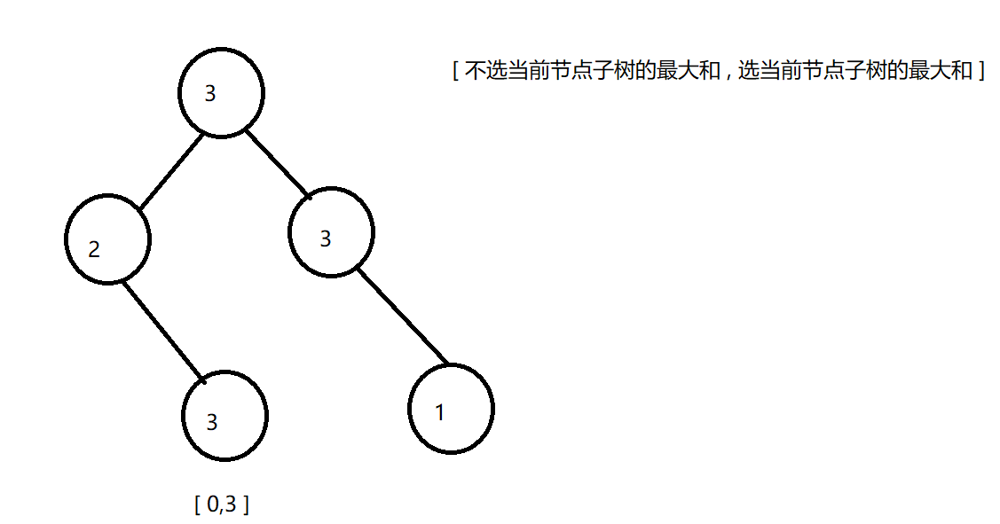

2、选择节点2，不能选择儿子节点最大值为2

不选择节点2，可以选择儿子节点，最大值为3

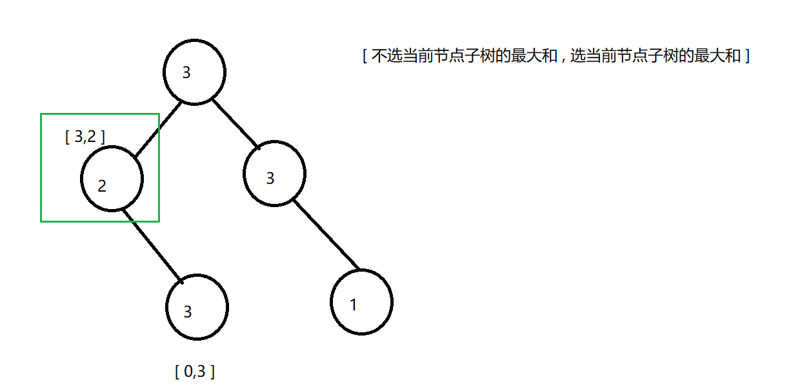


3、右子树同理

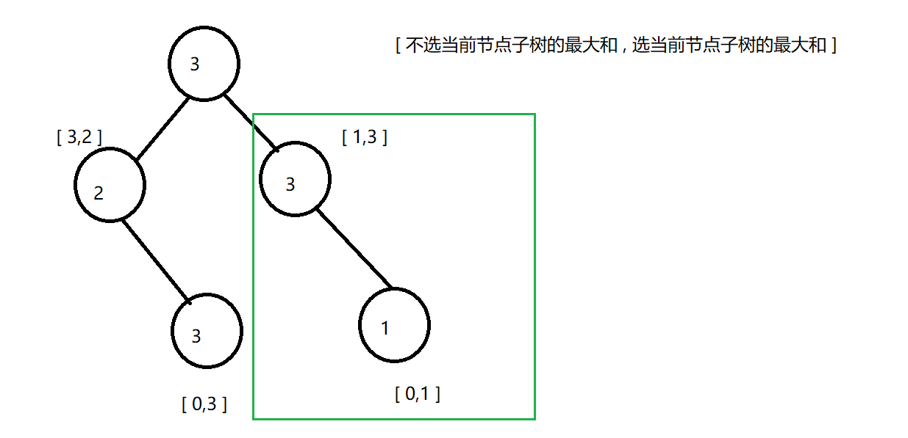

4、对于根节点3,：

选择: 儿子节点都不能选，从儿子节点返回的状态就可以看出，儿子节点选或不选的最大值，因此 3+1+3 = 7

不选： 儿子节点选不选都可以，我们取最大值 3+3 = 6

最后取最大值 Max(6,7) = 7

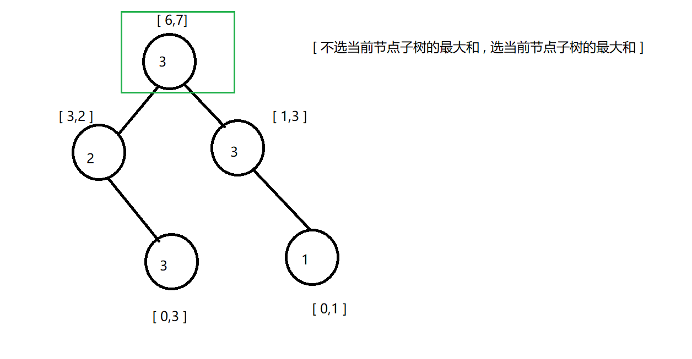

**总结**

图片来自：@[灵茶山艾府](https://space.bilibili.com/206214)

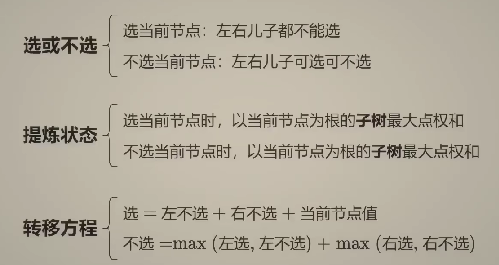


```java
/**
 * Definition for a binary tree node.
 * public class TreeNode {
 *     int val;
 *     TreeNode left;
 *     TreeNode right;
 *     TreeNode() {}
 *     TreeNode(int val) { this.val = val; }
 *     TreeNode(int val, TreeNode left, TreeNode right) {
 *         this.val = val;
 *         this.left = left;
 *         this.right = right;
 *     }
 * }
 */
class Solution {
    public int rob(TreeNode root) {
        int[] status = dfs(root);
        return Math.max(status[0],status[1]);
    }
    // int[0]: 不选当前节点子树最大和
    // int[1]: 选当前节点子树最大和
    public int[] dfs(TreeNode node){
        // 节点为null，最大和为0
        if (node == null) return new int[]{0,0};

        int[] left = dfs(node.left); // 递归左子树所得到的最大和(选/不选)
        int[] right = dfs(node.right);// 递归右子树所得到的最大和(选/不选)
        // 选则当前节点：左右孩子不选的最大和 + 当前节点的值
        int select = left[0] + right[0] + node.val;
        // 不选则当前节点：
        //  找出选择左孩子、不选择左孩子的最大值
        //  选择右孩子、不选择右孩子的最大值
        // 最后加在一起
        int not_select = Math.max(left[1],left[0]) + Math.max(right[1],right[0]);

        return new int[]{not_select,select};
    }
}
```


## 买卖股票全系列


### [121. 买卖股票的最佳时机](https://leetcode.cn/problems/best-time-to-buy-and-sell-stock/)

给定一个数组 `prices` ，它的第 `i` 个元素 `prices[i]` 表示一支给定股票第 `i` 天的价格。

你只能选择 **某一天** 买入这只股票，并选择在 **未来的某一个不同的日子** 卖出该股票。设计一个算法来计算你所能获取的最大利润。

返回你可以从这笔交易中获取的最大利润。如果你不能获取任何利润，返回 `0` 。


**示例 1：**

```
输入：[7,1,5,3,6,4]
输出：5
解释：在第 2 天（股票价格 = 1）的时候买入，在第 5 天（股票价格 = 6）的时候卖出，最大利润 = 6-1 = 5 。
     注意利润不能是 7-1 = 6, 因为卖出价格需要大于买入价格；同时，你不能在买入前卖出股票。
```

**示例 2：**

```
输入：prices = [7,6,4,3,1]
输出：0
解释：在这种情况下, 没有交易完成, 所以最大利润为 0。
```


**提示：**

- `1 <= prices.length <= 105`
- `0 <= prices[i] <= 104`


#### 思路分析

**一次遍历**

这道题和 买卖股票的最佳时机二 的区别就是 只能买入一次股票，只能在买入之后一次卖入股票。

因此我们在遍历过程维护一个`最低价格` 和 `每天与最低价格的利润` ，不断维护这俩个变量。

```java
    public int maxProfit(int[] prices) {
        // 记录历史最低价格
        int minPrice = Integer.MAX_VALUE;
        // 记录每一天的与历史最低价格的利润
        int maxProfit = 0;

        for (int price : prices) {
            if (price < minPrice) {
                minPrice = price;
            } else if (price - minPrice > maxProfit) {
                maxProfit = price - minPrice;
            }
        }
        return maxProfit;
    }
```


**动态规划**

对于某一天的股票只有俩种状态： 持有股票/不持有股票

**定义dp数组含义**

dp\[i][0] : 第i天交易完手里`没有股票的最大利润`

dp\[i][1] : 第i天交易完手里`有股票的最大利润`

**递推公式**

对于今天是否持有股票由前一天状态转移而来：

今天没有股票dp\[i][0]

- 可能前一天也没有股票: dp\[i-1][0]
- 可能前一天有股票，这时候卖出股票，增加利润： dp\[i-1][1] + prices[i]

今天有股票dp\[i][1]

- 前一天可能也有股票：dp\[i][1]
- 前一天没有股票，这时候买入股票，由于只能买一次，因此利润一定是股票的负数:   - prices[i]

因此递推公式为：

dp\[i][0] = max(dp\[i-1][0],dp\[i-1][1] + prices[i])

dp\[i][1] = max(dp\[i-1][1], - prices[i])

到最后一天一定是没有股票的状态，即返回结果：dp\[prices.length-1][0]


**初始化**

dp\[0][0] = 0 第一天没有股票，利润为0

dp\[0][1] = -prices[0] 第一天买入股票，利润为第一天的负数

```java
class Solution {
    public int maxProfit(int[] prices) {
        int length = prices.length;
        int[][] dp = new int[length][2];
        dp[0][0] = 0;
        dp[0][1] = -prices[0];

        for (int i = 1; i < length; i++) {
            dp[i][0] = Math.max(dp[i-1][0],dp[i-1][1] + prices[i]);
            dp[i][1] = Math.max(dp[i-1][1], - prices[i]);
        }
        return dp[length-1][0];
    }
}
```


### [122. 买卖股票的最佳时机 II](https://leetcode.cn/problems/best-time-to-buy-and-sell-stock-ii/)

给你一个整数数组 `prices` ，其中 `prices[i]` 表示某支股票第 `i` 天的价格。

在每一天，你可以决定是否购买和/或出售股票。你在任何时候 **最多** 只能持有 **一股** 股票。你也可以先购买，然后在 **同一天** 出售。

返回 *你能获得的 **最大** 利润* 。


**示例 1：**

```
输入：prices = [7,1,5,3,6,4]
输出：7
解释：在第 2 天（股票价格 = 1）的时候买入，在第 3 天（股票价格 = 5）的时候卖出, 这笔交易所能获得利润 = 5 - 1 = 4 。
     随后，在第 4 天（股票价格 = 3）的时候买入，在第 5 天（股票价格 = 6）的时候卖出, 这笔交易所能获得利润 = 6 - 3 = 3 。
     总利润为 4 + 3 = 7 。
```

**示例 2：**

```
输入：prices = [1,2,3,4,5]
输出：4
解释：在第 1 天（股票价格 = 1）的时候买入，在第 5 天 （股票价格 = 5）的时候卖出, 这笔交易所能获得利润 = 5 - 1 = 4 。
     总利润为 4 。
```

**示例 3：**

```
输入：prices = [7,6,4,3,1]
输出：0
解释：在这种情况下, 交易无法获得正利润，所以不参与交易可以获得最大利润，最大利润为 0 。
```


**提示：**

- `1 <= prices.length <= 3 * 104`
- `0 <= prices[i] <= 104`

#### 思路分析

**贪心算法**

这道题目可能我们只会想，选一个低的买入，再选个高的卖，再选一个低的买入.....循环反复。

**如果想到其实最终利润是可以分解的，那么本题就很容易了！**

如何分解呢？

假如第 0 天买入，第 3 天卖出，那么利润为：prices[3] - prices[0]。

相当于(prices[3] - prices[2]) + (prices[2] - prices[1]) + (prices[1] - prices[0])。

**此时就是把利润分解为每天为单位的维度，而不是从 0 天到第 3 天整体去考虑！**

那么根据 prices 可以得到每天的利润序列：(prices[i] - prices[i - 1]).....(prices[1] - prices[0])。

如图：


**局部最优：收集每天的正利润，全局最优：求得最大利润**。

```java
    public int maxProfit(int[] prices) {
        int res = 0;
        // 从第二天开始,第一天无法产生利润
        for (int i = 1; i < prices.length; i++) {
            // 只收集每天的正利润
            res += Math.max(prices[i] - prices[i-1],0);
        }
        return  res;
    }
```


**动态规划**

题目中规定每一天不能【重复交易】，那么每一天就只有俩种状态:

- 持有股票
- 不持有股票

**定义dp数组含义**

dp\[i][0] : 第i天交易完手里`没有股票的最大利润`

dp\[i][1] : 第i天交易完手里`有股票的最大利润`


**递推公式**

对于今天是否持有股票由前一天状态转移而来：

今天没有股票dp\[i][0]

- 可能前一天也没有股票: dp\[i-1][0]
- 可能前一天中持有股票，这时候要卖出股票，因此利润增加： dp\[i-1][1] + prices[i]

今天有股票dp\[i][1]

- 前一天可能也有股票：dp\[i][1]
- 前一天没有股票，这时候要卖入股票，利润减少:  dp\[i-1][0] - prices[i]

> 这里也是和[121. 买卖股票的最佳时机](https://leetcode.cn/problems/best-time-to-buy-and-sell-stock/) 的唯一区别：
>
> 由于 121 只能买一次，因此买入的时候一定是负利润
>
> 而 122 可以多次买入，因此买入的时候还要算上之前买卖的利润！

因此递推公式为：

dp\[i][0] = max(dp\[i-1][0],dp\[i-1][1] + prices[i])

dp\[i][1] = max(dp\[i-1][1],dp\[i-1][0] - prices[i])

到最后一天一定是没有股票的状态，即返回结果：dp\[prices.length-1][0]


**初始化**

dp\[0][0] = 0 第一天没有股票，利润为0

dp\[0][1] = -prices[0] 第一天买入股票，利润为第一天的负数

```java
class Solution {
    public int maxProfit(int[] prices) {
        int length = prices.length;
        int[][] dp = new int[length][2];
        dp[0][0] = 0;
        dp[0][1] = -prices[0];

        for (int i = 1; i < length; i++) {
            dp[i][0] = Math.max(dp[i-1][0],dp[i-1][1] + prices[i]);
            dp[i][1] = Math.max(dp[i-1][1],dp[i-1][0] - prices[i]);
        }
        return dp[length-1][0];
    }
}
```


### [123. 买卖股票的最佳时机 III](https://leetcode.cn/problems/best-time-to-buy-and-sell-stock-iii/)

给定一个数组，它的第 `i` 个元素是一支给定的股票在第 `i` 天的价格。

设计一个算法来计算你所能获取的最大利润。你最多可以完成 **两笔** 交易。

**注意：**你不能同时参与多笔交易（你必须在再次购买前出售掉之前的股票）。


**示例 1:**

```
输入：prices = [3,3,5,0,0,3,1,4]
输出：6
解释：在第 4 天（股票价格 = 0）的时候买入，在第 6 天（股票价格 = 3）的时候卖出，这笔交易所能获得利润 = 3-0 = 3 。
     随后，在第 7 天（股票价格 = 1）的时候买入，在第 8 天 （股票价格 = 4）的时候卖出，这笔交易所能获得利润 = 4-1 = 3 。
```

**示例 2：**

```
输入：prices = [1,2,3,4,5]
输出：4
解释：在第 1 天（股票价格 = 1）的时候买入，在第 5 天 （股票价格 = 5）的时候卖出, 这笔交易所能获得利润 = 5-1 = 4 。   
     注意你不能在第 1 天和第 2 天接连购买股票，之后再将它们卖出。   
     因为这样属于同时参与了多笔交易，你必须在再次购买前出售掉之前的股票。
```

**示例 3：**

```
输入：prices = [7,6,4,3,1] 
输出：0 
解释：在这个情况下, 没有交易完成, 所以最大利润为 0。
```

**示例 4：**

```
输入：prices = [1]
输出：0
```


**提示：**

- `1 <= prices.length <= 105`
- `0 <= prices[i] <= 105`


#### 思路分析

这题相较于前面俩道题难了不少，主要在于如何知道买卖的次数，有可能买卖一次，有可能买卖俩次，有可能不买卖，这时股票就应该有五种状态：

- 0:不进行买卖股票【可以忽略】
- 1:第一次持有股票
- 2:第一次不持有股票
- 3:第二次持有股票
- 4:第二次不持有股票

**定义dp数组含义**

dp\[i][5] : 表示第i天在 [0~4] 状态下所获得的最大利润

**递推公式**

达到dp\[i][1]状态由俩种操作转移而来：

1. 沿用前一天持有股票的状态: dp\[i-1][1]
2. 前一天没有股票，交易完买入股票： dp\[i-1][0] - prices[i]

这俩种状态取最大值: `max(dp\[i-1][1],dp\[i-1][0] - prices[i])`


达到dp\[i][2]状态由俩种操作转移而来：

1. 沿用前一天不持有股票的状态: dp\[i-1][2]
2. 前一天持有股票，交易完卖出股票： dp\[i-1][1] + prices[i]

这俩种状态取最大值:` max(dp\[i-1][2],dp\[i-1][1] + prices[i])`


同理求出状态3、4的公式为：

- ` max(dp\[i-1][3],dp\[i-1][2] - prices[i])`
- ` max(dp\[i-1][4],dp\[i-1][3] + prices[i])`


**初始化**

dp\[0][1] = -prices[0] // 第一次买入

dp\[0][2] =0 // 第一次卖出

dp\[0][3] = -prices[0] // 第二次买入

dp\[0][4] =0 // 第二次卖出


```java
class Solution {
    public int maxProfit(int[] prices) {
        int length = prices.length;
        // 定义dp数组
        /*
         * dp[i][0]：第i天不操作所获得的最大利润
         * dp[i][1]：第i天第一次持有股票所获得的最大利润
         * dp[i][2]：第i天第一次不持有股票所获得的最大利润
         * dp[i][3]：第i天第二次持有股票所获得的最大利润
         * dp[i][4]：第i天第二次不持有股票所获得的最大利润
         * */
        int[][] dp = new int[length][5];
        dp[0][1] = -prices[0];
        dp[0][3] = -prices[0];

        for (int i = 1; i < length; i++) {
            dp[i][1] = Math.max(dp[i - 1][1], dp[i - 1][0] - prices[i]);
            dp[i][2] = Math.max(dp[i - 1][2], dp[i - 1][1] + prices[i]);
            dp[i][3] = Math.max(dp[i - 1][3], dp[i - 1][2] - prices[i]);
            dp[i][4] = Math.max(dp[i - 1][4], dp[i - 1][3] + prices[i]);
        }
        return dp[length-1][4];
    }
}
```


### [188. 买卖股票的最佳时机 IV](https://leetcode.cn/problems/best-time-to-buy-and-sell-stock-iv/)

给你一个整数数组 `prices` 和一个整数 `k` ，其中 `prices[i]` 是某支给定的股票在第 `i` 天的价格。

设计一个算法来计算你所能获取的最大利润。你最多可以完成 `k` 笔交易。也就是说，你最多可以买 `k` 次，卖 `k` 次。

**注意：**你不能同时参与多笔交易（你必须在再次购买前出售掉之前的股票）。


**示例 1：**

```
输入：k = 2, prices = [2,4,1]
输出：2
解释：在第 1 天 (股票价格 = 2) 的时候买入，在第 2 天 (股票价格 = 4) 的时候卖出，这笔交易所能获得利润 = 4-2 = 2 。
```

**示例 2：**

```
输入：k = 2, prices = [3,2,6,5,0,3]
输出：7
解释：在第 2 天 (股票价格 = 2) 的时候买入，在第 3 天 (股票价格 = 6) 的时候卖出, 这笔交易所能获得利润 = 6-2 = 4 。
     随后，在第 5 天 (股票价格 = 0) 的时候买入，在第 6 天 (股票价格 = 3) 的时候卖出, 这笔交易所能获得利润 = 3-0 = 3 。
```


**提示：**

- `1 <= k <= 100`
- `1 <= prices.length <= 1000`
- `0 <= prices[i] <= 1000`


#### 思路分析

这道题说要完成k次交易,这回我们不知道要设几种状态。我们可以找一下规律：

- 1:第一次持有股票
- 2:第一次不持有股票
- 3:第二次持有股票
- 4:第二次不持有股票
- 5：第三次持有股票
- 6：第三次持有股票
- ....

我们可以发现当 k 为奇数时表示 持有/买入 股票，当 k 为偶数时表示 不持有/卖出 股票。

**定义dp数组含义**

dp\[i][j]: 第 i 天，状态为 j 时所获得的最大利润

```java
 // 奇数为买入，偶数为卖出
 int[][] dp = new int[length][ 2 * k + 1];
```

**递推公式**

达到dp\[i][1]状态由俩种操作转移而来：

1. 沿用前一天持有股票的状态: dp\[i-1][1]
2. 前一天没有股票，交易完买入股票： dp\[i-1][0] - prices[i]

这俩种状态取最大值: `max(dp\[i-1][1],dp\[i-1][0] - prices[i])`


达到dp\[i][2]状态由俩种操作转移而来：

1. 沿用前一天不持有股票的状态: dp\[i-1][2]
2. 前一天持有股票，交易完卖出股票： dp\[i-1][1] + prices[i]

这俩种状态取最大值:` max(dp\[i-1][2],dp\[i-1][1] + prices[i])`

....

由此我们可以推算出规律：

买入：`max(dp\[i-1][j+1],dp\[i-1][j] - prices[i])`

卖出: `max(dp\[i-1][j+2],dp\[i-1][j+1] + prices[i])`

```java
for (int j = 0; j < 2 * k - 1; j += 2) {
    dp[i][j + 1] = max(dp[i - 1][j + 1], dp[i - 1][j] - prices[i]);
    dp[i][j + 2] = max(dp[i - 1][j + 2], dp[i - 1][j + 1] + prices[i]);
}
```

**初始化**

k 为奇数为买入，将买入时的利润设为 -prices[0]

```java
        for (int i = 1; i < 2 * k; i += 2) {
            dp[0][i] = -prices[0];
        }
```

**完整代码**

```java
class Solution {
    public int maxProfit(int k, int[] prices) {
        int length = prices.length;
        // 奇数为买入，偶数为卖出
        int[][] dp = new int[length][2 * k + 1];

        // 初始化
        for (int i = 1; i < 2 * k; i += 2) {
            dp[0][i] = -prices[0];
        }

        for (int i = 1; i < length; i++) {
            for (int j = 0; j < 2 * k - 1; j += 2) {
                dp[i][j + 1] = Math.max(dp[i-1][j + 1], dp[i-1][j] - prices[i]);
                dp[i][j + 2] = Math.max(dp[i-1][j + 2], dp[i-1][j + 1] + prices[i]);
            }
        }
        return dp[length - 1][2 * k];
    }
}
```

### [309. 买卖股票的最佳时机含冷冻期](https://leetcode.cn/problems/best-time-to-buy-and-sell-stock-with-cooldown/)

给定一个整数数组`prices`，其中第 `prices[i]` 表示第 `*i*` 天的股票价格 。

设计一个算法计算出最大利润。在满足以下约束条件下，你可以尽可能地完成更多的交易（多次买卖一支股票）:

- 卖出股票后，你无法在第二天买入股票 (即冷冻期为 1 天)。

**注意：**你不能同时参与多笔交易（你必须在再次购买前出售掉之前的股票）。


**示例 1:**

```
输入: prices = [1,2,3,0,2]
输出: 3 
解释: 对应的交易状态为: [买入, 卖出, 冷冻期, 买入, 卖出]
```

**示例 2:**

```
输入: prices = [1]
输出: 0
```


**提示：**

- `1 <= prices.length <= 5000`
- `0 <= prices[i] <= 1000`


#### 思路分析

**确定dp数组及含义**

dp\[i][0] : 第i天交易完手里`没有股票的最大利润`

dp\[i][1] : 第i天交易完手里`有股票的最大利润`

**递推公式**

如果没有冷冻期，不难写出这样的递推公式：

dp\[i][0] = max(dp\[i-1][0],dp\[i-1][1] + prices[i])

dp\[i][1] = max(dp\[i-1][1],dp\[i-1][0] - prices[i])

而有了冷冻期之后，则表示在第i天持有股票的条件下，有可能 i-1 天为冷冻期，i-2 天为卖出操作。

因此递推关系式为：

dp\[i][0] = max(dp\[i-1][0],dp\[i-1][1] + prices[i])

dp\[i][1] = max(dp\[i-1][1],dp\[i-2][0] - prices[i])

**初始化**

由于递推关系式中依赖于 i-2 ，因此我们要初始化俩天的买入/卖出操作

```java
        dp[0][0] = 0; 
        dp[0][1] = -prices[0]; 
        dp[1][0] = Math.max(dp[0][0], dp[0][1] + prices[1]);
        dp[1][1] = Math.max(dp[0][1], -prices[1]);
```


**完整代码**

```java
class Solution {
    public int maxProfit(int[] prices) {
        if (prices == null || prices.length < 2) {
            return 0;
        }
        int[][] dp = new int[prices.length][2];

        // bad case
        dp[0][0] = 0;
        dp[0][1] = -prices[0];
        dp[1][0] = Math.max(dp[0][0], dp[0][1] + prices[1]);
        dp[1][1] = Math.max(dp[0][1], -prices[1]);

        for (int i = 2; i < prices.length; i++) {
            // dp公式
            dp[i][0] = Math.max(dp[i - 1][0], dp[i - 1][1] + prices[i]);
            dp[i][1] = Math.max(dp[i - 1][1], dp[i - 2][0] - prices[i]);
        }

        return dp[prices.length - 1][0];
    }
}
```


### [714. 买卖股票的最佳时机含手续费](https://leetcode.cn/problems/best-time-to-buy-and-sell-stock-with-transaction-fee/)

给定一个整数数组 `prices`，其中 `prices[i]`表示第 `i` 天的股票价格 ；整数 `fee` 代表了交易股票的手续费用。

你可以无限次地完成交易，但是你每笔交易都需要付手续费。如果你已经购买了一个股票，在卖出它之前你就不能再继续购买股票了。

返回获得利润的最大值。

**注意：**这里的一笔交易指买入持有并卖出股票的整个过程，每笔交易你只需要为支付一次手续费。


**示例 1：**

```
输入：prices = [1, 3, 2, 8, 4, 9], fee = 2
输出：8
解释：能够达到的最大利润:  
在此处买入 prices[0] = 1
在此处卖出 prices[3] = 8
在此处买入 prices[4] = 4
在此处卖出 prices[5] = 9
总利润: ((8 - 1) - 2) + ((9 - 4) - 2) = 8
```

**示例 2：**

```
输入：prices = [1,3,7,5,10,3], fee = 3
输出：6
```


**提示：**

- `1 <= prices.length <= 5 * 104`
- `1 <= prices[i] < 5 * 104`
- `0 <= fee < 5 * 104`

#### 思路分析


**定义dp数组及含义**

dp\[i][0] : 第i天交易完手里`没有股票的最大利润`

dp\[i][1] : 第i天交易完手里`有股票的最大利润`

**递推公式**

在股票 买入/卖出 之后要扣减手续费

dp\[i][0] = max(dp\[i-1][0],dp\[i-1][1] + prices[i] - fee)

dp\[i][1] = max(dp\[i-1][1],dp\[i-1][0] - prices[i])


```java
    public int maxProfit(int[] prices, int fee) {
        int length = prices.length;
        int[][] dp = new int[length][2];

        dp[0][1] = -prices[0];
        for (int i = 1; i < length; i++) {
            dp[i][0] = Math.max(dp[i-1][0],dp[i-1][1] + prices[i] - fee);
            dp[i][1] = Math.max(dp[i-1][1],dp[i-1][0] - prices[i]);
        }
        return Math.max(dp[length-1][0],dp[length-1][1]);
    }
```


## 子序列问题

### [300. 最长递增子序列](https://leetcode.cn/problems/longest-increasing-subsequence/)

给你一个整数数组 `nums` ，找到其中最长严格递增子序列的长度。

**子序列** 是由数组派生而来的序列，删除（或不删除）数组中的元素而不改变其余元素的顺序。例如，`[3,6,2,7]` 是数组 `[0,3,1,6,2,2,7]` 的子序列。


**示例 1：**

```
输入：nums = [10,9,2,5,3,7,101,18]
输出：4
解释：最长递增子序列是 [2,3,7,101]，因此长度为 4 。
```

**示例 2：**

```
输入：nums = [0,1,0,3,2,3]
输出：4
```

**示例 3：**

```
输入：nums = [7,7,7,7,7,7,7]
输出：1
```


**提示：**

- `1 <= nums.length <= 2500`
- `-104 <= nums[i] <= 104`


#### 思路分析

子序列问题通常要求出下标为 i的元素与 0~i-1之前的元素之间的关系。

**dp数组含义**

dp[i] 表示前i个元素的最长递增子序列为dp[i]

**递推公式**

位置i的最长升序子序列等于j从0到i-1各个位置的最长升序子序列 + 1 的最大值。

所以：if (nums[i] > nums[j]) dp[i] = max(dp[i], dp[j] + 1);

**初始化**

每一个i，对应的dp[i]（即最长递增子序列）起始大小至少都是1.

```java
    public int lengthOfLIS(int[] nums) {
        // dp[i] 表示前i个元素的最长递增子序列为dp[i]
        int[] dp = new int[nums.length];
        // 初始化，每个元素长度为1
        Arrays.fill(dp, 1);
        int res =1;

        for (int i = 1; i < nums.length; i++) {
            // 计算从0~i-1之间的最长递增子序列
            for (int j = 0; j < i; j++) {
                if (nums[i] > nums[j]) dp[i] = Math.max(dp[i], dp[j] + 1);

            }
            // 记录最长的递增子序列
            res = Math.max(res, dp[i]);

        }
        return res;
    }
```


### [674. 最长连续递增序列](https://leetcode.cn/problems/longest-continuous-increasing-subsequence/)

给定一个未经排序的整数数组，找到最长且 **连续递增的子序列**，并返回该序列的长度。

**连续递增的子序列** 可以由两个下标 `l` 和 `r`（`l < r`）确定，如果对于每个 `l <= i < r`，都有 `nums[i] < nums[i + 1]` ，那么子序列 `[nums[l], nums[l + 1], ..., nums[r - 1], nums[r]]` 就是连续递增子序列。


**示例 1：**

```
输入：nums = [1,3,5,4,7]
输出：3
解释：最长连续递增序列是 [1,3,5], 长度为3。
尽管 [1,3,5,7] 也是升序的子序列, 但它不是连续的，因为 5 和 7 在原数组里被 4 隔开。 
```

**示例 2：**

```
输入：nums = [2,2,2,2,2]
输出：1
解释：最长连续递增序列是 [2], 长度为1。
```


**提示：**

- `1 <= nums.length <= 104`
- `-109 <= nums[i] <= 109`

#### 思路分析

该题要求`连续的递增序列` ，可以用一个变量 `length` 维护到当前元素时的最长子序列，另一变量 `res` 维护整个序列最长子序列长度。

```java
class Solution {
    public int findLengthOfLCIS(int[] nums) {
        int length = 1;
        int res = 1;
        for (int i = 1; i < nums.length; i++) {
            if (nums[i] > nums[i-1]){
                length++;
                res = Math.max(length,res);
            }else {
                // 不符合连续递增，将length重置
                length = 1;
            }
        }
        return res;
    }
}
```


### [718. 最长重复子数组](https://leetcode.cn/problems/maximum-length-of-repeated-subarray/)

给两个整数数组 `nums1` 和 `nums2` ，返回 *两个数组中 **公共的** 、长度最长的子数组的长度* 。


**示例 1：**

```
输入：nums1 = [1,2,3,2,1], nums2 = [3,2,1,4,7]
输出：3
解释：长度最长的公共子数组是 [3,2,1] 。
```

**示例 2：**

```
输入：nums1 = [0,0,0,0,0], nums2 = [0,0,0,0,0]
输出：5
```


**提示：**

- `1 <= nums1.length, nums2.length <= 1000`
- `0 <= nums1[i], nums2[i] <= 100`

#### 思路分析

**定义dp数组**

dp\[i][j] : 表示以nums1以 i-1结尾，nums2以 j-1结尾的最长公共前缀为 dp\[i][j]


**递推公式**

若 nums1[i-1] == nums2[j-1] ，则dp\[i-1][j-1] + 1 ，相等 公共前缀长度+1

> 注意：
>
> 这里是 i-1、j-1，而不是i和j。这是为了初始化时的简便！
>
> i-1、j-1 说明遍历时要从下标为1开始，如果是 i 和 j 就需要考虑dp数组首个元素的初始化。
>
> 即：如果nums1[i] 与 nums2[0] 相同的话，对应的 dp\[i][0]就要初始为1， 因为此时最长重复子数组为1。 nums2[j] 与 nums1[0]相同的话，同理。
>
> ```java
> for (int i = 0; i < nums1.size(); i++) if (nums1[i] == nums2[0]) dp[i][0] = 1;
> for (int j = 0; j < nums2.size(); j++) if (nums1[0] == nums2[j]) dp[0][j] = 1;
> ```

**遍历顺序**

从递推公式中可以看出，nums1 和 nums2 要从下标1开始遍历


以nums1 = [1,2,3,2,1], nums2 = [3,2,1,4,7] 为例，最终dp数组如下图所示：

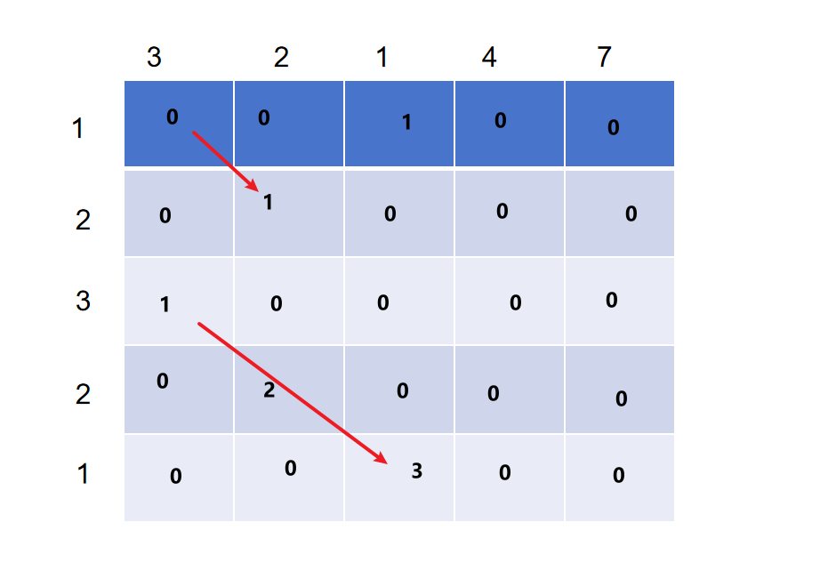


```java
    public int findLength(int[] nums1, int[] nums2) {
        // 表示nums以 i-1结尾，nums2以 j-1结尾时，最长公共前缀为 dp[i]
        int[][] dp = new int[nums1.length + 1][nums2.length + 1];
        int res = 0;

        for (int i = 1; i <= nums1.length; i++) {
            for (int j = 1; j <= nums2.length; j++) {
                if (nums1[i - 1] == nums2[j - 1]) {
                    dp[i][j] = dp[i - 1][j - 1] + 1;
                }
                if (dp[i][j] > res) res = dp[i][j];
            }
        }
        return res;
    }
```


### [1143. 最长公共子序列](https://leetcode.cn/problems/longest-common-subsequence/)

给定两个字符串 `text1` 和 `text2`，返回这两个字符串的最长 **公共子序列** 的长度。如果不存在 **公共子序列** ，返回 `0` 。

一个字符串的 **子序列** 是指这样一个新的字符串：它是由原字符串在不改变字符的相对顺序的情况下删除某些字符（也可以不删除任何字符）后组成的新字符串。

- 例如，`"ace"` 是 `"abcde"` 的子序列，但 `"aec"` 不是 `"abcde"` 的子序列。

两个字符串的 **公共子序列** 是这两个字符串所共同拥有的子序列。


**示例 1：**

```
输入：text1 = "abcde", text2 = "ace" 
输出：3  
解释：最长公共子序列是 "ace" ，它的长度为 3 。
```

**示例 2：**

```
输入：text1 = "abc", text2 = "abc"
输出：3
解释：最长公共子序列是 "abc" ，它的长度为 3 。
```

**示例 3：**

```
输入：text1 = "abc", text2 = "def"
输出：0
解释：两个字符串没有公共子序列，返回 0 。
```


**提示：**

- `1 <= text1.length, text2.length <= 1000`
- `text1` 和 `text2` 仅由小写英文字符组成。

#### 思路分析

这道题其实和 [718. 最长重复子数组](https://leetcode.cn/problems/maximum-length-of-repeated-subarray/) 非常类似，唯一的区别就是这道题要求是不连续的子序列。

因此在推导递推公式时，除了考虑俩个元素相等的情况，还要考虑不相等的情况。

**定义dp数组**

dp\[i][j] : 表示text1从 （0 ,i-1），text2从（0,j-1）的最长公共子序列

**递推公式**

若 nums1[i-1] == nums2[j-1] ，则dp\[i-1][j-1] + 1

若不相等，则取 dp\[i-1][j], dp\[i][j-1] 的最大值

dp\[i-1][j] : 表示不考虑text1的第 i 个字符，与 text2的最长公共子序列

dp\[i][j-1] : 表示不考虑text2的第 j' 个字符，与 text1的最长公共子序列

```java
    public int longestCommonSubsequence(String text1, String text2) {
        char[] char1 = text1.toCharArray();
        char[] char2 = text2.toCharArray();

        int[][] dp = new int[char1.length + 1][char2.length + 1];
        for (int i = 1; i < char1.length; i++) {
            for (int j = 1; j <= char2.length; j++) {
                if (char1[i-1] == char2[j-1]) {
                    dp[i][j] = dp[i - 1][j - 1] + 1;
                } else {
                    dp[i][j] = Math.max(dp[i - 1][j], dp[i][j - 1]);
                }
            }
        }
        return dp[char1.length][char2.length];
    }
```


### [1035. 不相交的线](https://leetcode.cn/problems/uncrossed-lines/)

在两条独立的水平线上按给定的顺序写下 `nums1` 和 `nums2` 中的整数。

现在，可以绘制一些连接两个数字 `nums1[i]` 和 `nums2[j]` 的直线，这些直线需要同时满足满足：

-  `nums1[i] == nums2[j]`
-  且绘制的直线不与任何其他连线（非水平线）相交。

请注意，连线即使在端点也不能相交：每个数字只能属于一条连线。

以这种方法绘制线条，并返回可以绘制的最大连线数。


**示例 1：**


```
输入：nums1 = [1,4,2], nums2 = [1,2,4]
输出：2
解释：可以画出两条不交叉的线，如上图所示。 
但无法画出第三条不相交的直线，因为从 nums1[1]=4 到 nums2[2]=4 的直线将与从 nums1[2]=2 到 nums2[1]=2 的直线相交。
```

**示例 2：**

```
输入：nums1 = [2,5,1,2,5], nums2 = [10,5,2,1,5,2]
输出：3
```

**示例 3：**

```
输入：nums1 = [1,3,7,1,7,5], nums2 = [1,9,2,5,1]
输出：2
```


**提示：**

- `1 <= nums1.length, nums2.length <= 500`
- `1 <= nums1[i], nums2[j] <= 2000`


#### 思路分析

题目中要求求最大连线数 其实就是求俩个数组的最长公共子序列(保持相对顺序)！

以 nums1 = [1,4,2], nums2 = [1,2,4] 为例，它的最长公共子序列为 1、4，因此它的连线数为2

> 要保持相对的顺序，即 元素4 在 nums1中元素1的后面，那么在 nums2中也应该元素1的后面

```java
    public int maxUncrossedLines(int[] nums1, int[] nums2) {
        int length1 = nums1.length;
        int length2 = nums2.length;

        // 表示nums1第i、nums2第j个元素的公共子序列的长度是dp[i][j]
        int[][] dp = new int[length1 + 1][length2 + 1];

        for (int i = 1; i <= length1; i++) {
            for (int j = 1; j <= length2; j++) {
                // 这里对 i-1、j-1 进行比较，主要为了初始化的方便。
                if (nums1[i - 1] == nums2[j - 1]) {
                    dp[i][j] = dp[i - 1][j - 1] + 1;
                } else {
                    dp[i][j] = Math.max(dp[i - 1][j], dp[i][j - 1]);
                }
            }
        }
        return dp[length1][length2];
    }
```


### [53. 最大子数组和](https://leetcode.cn/problems/maximum-subarray/)

给你一个整数数组 `nums` ，请你找出一个具有最大和的连续子数组（子数组最少包含一个元素），返回其最大和。

**子数组** 是数组中的一个连续部分。


**示例 1：**

```
输入：nums = [-2,1,-3,4,-1,2,1,-5,4]
输出：6
解释：连续子数组 [4,-1,2,1] 的和最大，为 6 。
```

**示例 2：**

```
输入：nums = [1]
输出：1
```

**示例 3：**

```
输入：nums = [5,4,-1,7,8]
输出：23
```


**提示：**

- `1 <= nums.length <= 105`
- `-104 <= nums[i] <= 104`


#### 思路分析

这道题在 贪心 章节用贪心算法已经做过了，现在用动态规划在实现一遍。

**确定dp数组及下标含义**

dp[i]: 表示前i个元素(包括i)的最大和为dp[i]

**确定递推关系式**

dp[i] 有俩个方向可以推导出来:

- dp[i-1] + nums[i] : 加上当前元素的值
- nums[i]: 从头开始计算连续子数组的和

**初始化**

根据 dp 数组的定义可以看出: dp[0] = nums[0]

**模拟dp数组**

以 nums = [-2,1,-3,4,-1,2,1,-5,4] 为例

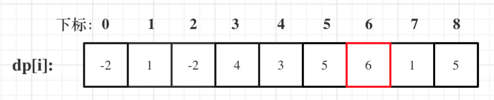

从图中可以看出，最大和并不是最后一个元素，因此在遍历过程中我们需要一个额外变量来保存最大值。


```java
    public int maxSubArray(int[] nums) {
        int length = nums.length;
        // 表示前i个元素(包括i)的最大和为dp[i]
        int[] dp = new int[length];
        int res = nums[0];
        dp[0] = nums[0];
        for (int i = 1; i < length; i++) {
          dp[i] =  Math.max(dp[i-1] + nums[i],nums[i]);
          if (dp[i] > res) res = dp[i];
        }
        return  res;
    }
```


## 编辑距离问题

### [392. 判断子序列](https://leetcode.cn/problems/is-subsequence/)

给定字符串 **s** 和 **t** ，判断 **s** 是否为 **t** 的子序列。

字符串的一个子序列是原始字符串删除一些（也可以不删除）字符而不改变剩余字符相对位置形成的新字符串。（例如，`"ace"`是`"abcde"`的一个子序列，而`"aec"`不是）。

**进阶：**

如果有大量输入的 S，称作 S1, S2, ... , Sk 其中 k >= 10亿，你需要依次检查它们是否为 T 的子序列。在这种情况下，你会怎样改变代码？

**致谢：**

特别感谢 [@pbrother ](https://leetcode.com/pbrother/)添加此问题并且创建所有测试用例。


**示例 1：**

```
输入：s = "abc", t = "ahbgdc"
输出：true
```

**示例 2：**

```
输入：s = "axc", t = "ahbgdc"
输出：false
```


**提示：**

- `0 <= s.length <= 100`
- `0 <= t.length <= 10^4`
- 两个字符串都只由小写字符组成。

#### 思路分析

方法一： **动态规划**

**确定dp数组及下标含义**

dp\[i][j] : 表示下标以 i-1 结尾的s 与 下标 j-1 结尾的t 的最长公共子序列的长度

**确定递推关系式**

还是分俩种情况:

s.charAt(i-1) == t.charAt(i-1)： 表示找到一个公共元素，则: dp\[i][j] =  dp\[i-1][j-1] + 1

s.charAt(i-1) != t.charAt(i-1): 表示要删除t中的第i个元素，继续向后边匹配。则不考虑第i个元素。

则 dp\[i][j] = dp\[i][j-1]

**遍历顺序**

通过递推关系式可以看出，从下标为1开始遍历，至于为什么不从0开始遍历，在[718. 最长重复子数组](https://leetcode.cn/problems/maximum-length-of-repeated-subarray/) 已经分析过。主要是为了初始化方便！

**初始化**

元素值初始化为0


```java
class Solution {
    public boolean isSubsequence(String s, String t) {
        int length1 = s.length();
        int length2 = t.length();
        // dp[i][j]: s中前 i-1 与 t中前  j-1 俩个字符串的子序列长度为 dp[i][j]
        int[][] dp = new int[length1 + 1][length2 + 1];

        for (int i = 1; i <= length1; i++) {
            for (int j = 1; j <= length2; j++) {
                if (s.charAt(i - 1) == t.charAt(j - 1)) {
                    dp[i][j] = dp[i - 1][j - 1] + 1;
                } else {
                    // 删除t中的第i个元素，也就是不考虑第i个元素
                    dp[i][j] = dp[i][j - 1];
                }
            }
        }
        return dp[length1][length2] == length1;
    }
}
```


方法二：**双指针**

采用双指针的方法，sIndex指向 s ,tIndex指向t

如果 s.charAt(sIndex) == s.charAt(tIndex) 将 sIndex后移,每比较一次将 tIndex 后移。

判断sIndex和 s.length 是否相等即可。

```java
    public boolean isSubsequence1(String s, String t) {
        int length1 = s.length();
        int length2 = t.length();

        int sIndex = 0;
        int tIndex = 0;

        while(sIndex <= length1 && tIndex <= length2 && sIndex <= tIndex){
            if (s.charAt(sIndex) == t.charAt(tIndex)){
                sIndex++;
            }
            tIndex++;
        }
        return sIndex == s.length();
    }
```


### [115. 不同的子序列](https://leetcode.cn/problems/distinct-subsequences/)

给你两个字符串 `s` 和 `t` ，统计并返回在 `s` 的 **子序列** 中 `t` 出现的个数，结果需要对 109 + 7 取模。


**示例 1：**

```
输入：s = "rabbbit", t = "rabbit"
输出：3
解释：
如下所示, 有 3 种可以从 s 中得到 "rabbit" 的方案。
rabbbit
rabbbit
rabbbit
```

**示例 2：**

```
输入：s = "babgbag", t = "bag"
输出：5
解释：
如下所示, 有 5 种可以从 s 中得到 "bag" 的方案。 
babgbag
babgbag
babgbag
babgbag
babgbag
```


**提示：**

- `1 <= s.length, t.length <= 1000`
- `s` 和 `t` 由英文字母组成


#### 思路分析

**确定dp数组及下标含义**

dp\[i][j]: t(0~j-1) 在 s(0~i-1) 中的方案个数

**确定递推关系式**

这一类问题，基本是要分析两种情况

- s[i - 1] 与 t[j - 1]相等
- s[i - 1] 与 t[j - 1] 不相等

当s[i - 1] 与 t[j - 1]相等时，dp\[i][j]可以有两部分组成。

- 一部分是用s[i - 1]来匹配，那么个数为dp\[i - 1][j - 1]。即不需要考虑当前s子串和t子串的最后一位字母，所以只需要 dp\[i-1][j-1]。
- 一部分是不用s[i - 1]来匹配，个数为dp\[i - 1][j]。
- 因此 ` dp\[i][j] = dp\[i - 1][j] + dp\[i - 1][j - 1]`

> **为什么还要考虑 不用s[i - 1]来匹配，都相同了指定要匹配啊**。
>
> 例如： s：bagg 和 t：bag ，s[3] 和 t[2]是相同的，但是字符串s也可以不用s[3]来匹配，即用s[0]s[1]s[2]组成的bag。
>
> 当然也可以用s[3]来匹配，即：s[0]s[1]s[3]组成的bag。

当s[i - 1] 与 t[j - 1]不相等时，dp\[i][j]只有一部分组成，不用s[i - 1]来匹配（就是模拟在s中删除这个元素），即：dp\[i - 1][j]

所以递推公式为：`dp\[i][j] = dp\[i - 1][j]`;


**初始化**

将dp数组的第一列初始化为1，因为空集是所有字符串子集, 所以我们第一列都是 `1`


```java
class Solution {
    public int numDistinct(String s, String t) {
        int[][] dp = new int[s.length() + 1][t.length() + 1];
        // 将第一列初始化为1.因为空集是所有字符串的子集
        for (int i = 0; i < s.length() + 1; i++) {
            dp[i][0] = 1;
        }
        
        for (int i = 1; i < s.length() + 1; i++) {
            for (int j = 1; j < t.length() + 1; j++) {
                if (s.charAt(i - 1) == t.charAt(j - 1)) {
                    dp[i][j] = dp[i - 1][j - 1] + dp[i - 1][j];
                }else{
                    dp[i][j] = dp[i - 1][j];
                }
            }
        }
        
        return dp[s.length()][t.length()];
    }
}
```


### [583. 两个字符串的删除操作](https://leetcode.cn/problems/delete-operation-for-two-strings/)

给定两个单词 `word1` 和 `word2` ，返回使得 `word1` 和 `word2` **相同**所需的**最小步数**。

**每步** 可以删除任意一个字符串中的一个字符。


**示例 1：**

```
输入: word1 = "sea", word2 = "eat"
输出: 2
解释: 第一步将 "sea" 变为 "ea" ，第二步将 "eat "变为 "ea"
```

**示例  2:**

```
输入：word1 = "leetcode", word2 = "etco"
输出：4
```


**提示：**

- `1 <= word1.length, word2.length <= 500`
- `word1` 和 `word2` 只包含小写英文字母


#### 思路分析

题目要求所需的最小步数，其实就是求俩个字符串公共子序列的长度。

然后将俩个字符串的长度 - 2倍的子序列长度。

拿 word1 = "sea", word2 = "eat" 来说，子序列长度为 2

3+3 - 2*2 = 2，最后求出最小步数为2

```java
class Solution {
    public int minDistance(String word1, String word2) {
        int length1 = word1.length();
        int length2 = word2.length();

        int[][] dp = new int[length1 + 1][length2 + 1];
        for (int i = 1; i <= length1; i++) {
            for (int j = 1; j <= length2; j++) {
                if (word1.charAt(i - 1) == word2.charAt(j - 1)) {
                    // 相等，子序列长度+1
                    dp[i][j] = dp[i - 1][j - 1] + 1;
                } else {
                    dp[i][j] = Math.max(dp[i - 1][j], dp[i][j - 1]);
                }
            }
        }
        
        return length1 + length2 - 2 * dp[length1][length2];
    }
}
```


### [72. 编辑距离](https://leetcode.cn/problems/edit-distance/)

给你两个单词 `word1` 和 `word2`， *请返回将 `word1` 转换成 `word2` 所使用的最少操作数* 。

你可以对一个单词进行如下三种操作：

- 插入一个字符
- 删除一个字符
- 替换一个字符


**示例 1：**

```
输入：word1 = "horse", word2 = "ros"
输出：3
解释：
horse -> rorse (将 'h' 替换为 'r')
rorse -> rose (删除 'r')
rose -> ros (删除 'e')
```

**示例 2：**

```
输入：word1 = "intention", word2 = "execution"
输出：5
解释：
intention -> inention (删除 't')
inention -> enention (将 'i' 替换为 'e')
enention -> exention (将 'n' 替换为 'x')
exention -> exection (将 'n' 替换为 'c')
exection -> execution (插入 'u')
```


**提示：**

- `0 <= word1.length, word2.length <= 500`
- `word1` 和 `word2` 由小写英文字母组成


#### 思路分析

**确定dp数组及下标含义**

dp\[i][j]: 表示下标以 i-1 结尾的word1 和 下标j-1 结尾的word2，最少得编辑距离为 dp\[i][j]

**确定递推关系式**

对于这个题有俩种操作

```java
if (word1[i - 1] == word2[j - 1])
    不操作
if (word1[i - 1] != word2[j - 1])
    操作(增、删、换)
```

对于以上四种情况依次进行讨论：

1.  `if (word1[i - 1] == word2[j - 1])` , 这时不用编辑, dp\[i][j] = dp\[i-1][j-1]
2.  `if (word1[i - 1] != word2[j - 1])`
    1. 考虑删除 word1 一个元素，即以下标 i-2 结尾的 word1 与以下标 j-1 结尾的word2 最少编辑距离 再加上一个删除操作，即：**dp\[i][j] = dp\[i-1][j] + 1**
    2. 考虑删除 word2 一个元素，即以下标 i-1 结尾的 word1 与以下标 j-2 结尾的word2 最少编辑距离 再加上一个删除操作，即：**dp\[i][j] = dp\[i][j-1] + 1**
    3. 替换操作,首先我们考虑替换的目的就是让俩个字符串相等，那么在 `if (word1[i - 1] == word2[j - 1])` 中得知 dp\[i][j] = dp\[i-1][j-1]，那么此时我们在加上一个替换操作就能够满足要求，即：**dp\[i][j] = dp\[i-1][j-1] + 1**

有的朋友会发现，上面这几种情况，为什么没有增加呢？

其实增加和删除是一样，对word1增加，其实就是对word2的删除，相反也一样。

**例如**：word1 = ac，word2 = a， 可以将word2增加一个c，也可以将word1删除一个c


**初始化**

从递推关系式中可以看出，递推关系式依赖于第一行和第一列的数据。

因此我们需要初始化：dp\[i][0], dp\[0][j], 那么应该初始化成多少呢？

首先要想清楚 dp\[i][0], dp\[0][j] 代表的是什么？

dp\[i][0]: 以下标 i-1 结尾的word1 和空串 wrod2，最少编辑距离 dp\[i][0]

dp\[j][0]: 以下标 j-1 结尾的word2 和空串 wrod1，最少编辑距离 dp\[0][j]

因此有多少元素就需要多少的编辑距离！！！

```java
        // 初始化, 有多少个元素就需要多少编辑距离变成空串
        for (int i = 1; i <= length1; i++)  dp[i][0] = i;
        for (int j = 1; j <= length2; j++)  dp[0][j] = j;
```


**遍历顺序**

从左到右，从上到下~~


```java
class Solution {
    public int minDistance(String word1, String word2) {
        int length1 = word1.length();
        int length2 = word2.length();

        int[][] dp = new int[length1 + 1][length2 + 1];
        // 初始化, 有多少个元素就需要多少编辑距离变成空串
        for (int i = 1; i <= length1; i++)  dp[i][0] = i;
        for (int j = 1; j <= length2; j++)  dp[0][j] = j;

        for (int i = 1; i <= length1; i++) {
            for (int j = 1; j <= length2; j++) {
                if (word1.charAt(i-1) == word2.charAt(j-1)){
                    dp[i][j] = dp[i-1][j-1];
                }else {
                    /*
                    * 删除word1：dp[i][j] = dp[i-1][j] + 1;
                    * 删除word2：dp[i][j] = dp[i][j-1] + 1;
                    * 替换：dp[i][j] = dp[i-1][j-1] + 1;
                    * */
                    dp[i][j] = Math.min(dp[i-1][j] + 1,Math.min(dp[i][j-1] + 1,dp[i-1][j-1] + 1));
                }
            }
        }
        return dp[length1][length2];
    }
}
```


### 总结

这几道题可谓是循序渐进：

**判断子序列**: 只涉及删除操作，不考虑增加和替换

- if (s[i - 1] == t[j - 1])
    - t中找到了一个字符在s中也出现了
- if (s[i - 1] != t[j - 1])
    - 相当于t要删除元素，继续匹配


**不同的子序列：** 虽然也只涉及到了删除操作，但是比 判断子序列 难了不少。

主要是对于递推关系上的考虑有一些复杂，在针对 `if (s[i - 1] == t[j - 1])` 这种情况时，有俩部分组成。

- s[i - 1] 与 t[j - 1]相等
- s[i - 1] 与 t[j - 1] 不相等

当s[i - 1] 与 t[j - 1]相等时，dp\[i][j]可以有两部分组成。

- 一部分是用s[i - 1]来匹配，那么个数为dp\[i - 1][j - 1]。即不需要考虑当前s子串和t子串的最后一位字母，所以只需要 dp\[i-1][j-1]。
- 一部分是不用s[i - 1]来匹配，个数为dp\[i - 1][j]。
- 因此 ` dp\[i][j] = dp\[i - 1][j] + dp\[i - 1][j - 1]`

> **为什么还要考虑 不用s[i - 1]来匹配，都相同了指定要匹配啊**。
>
> 例如： s：bagg 和 t：bag ，s[3] 和 t[2]是相同的，但是字符串s也可以不用s[3]来匹配，即用s[0]s[1]s[2]组成的bag。
>
> 当然也可以用s[3]来匹配，即：s[0]s[1]s[3]组成的bag。

当s[i - 1] 与 t[j - 1]不相等时，dp\[i][j]只有一部分组成，不用s[i - 1]来匹配（就是模拟在s中删除这个元素），即：dp\[i - 1][j]

所以递推公式为：`dp\[i][j] = dp\[i - 1][j]`;


**俩个字符串的删除操作：** 本题和[动态规划：115.不同的子序列 (opens new window)](https://programmercarl.com/0115.不同的子序列.html)相比，其实就是两个字符串可以都可以删除了，情况虽说复杂一些，但整体思路是不变的。

- 当word1[i - 1] 与 word2[j - 1]相同的时候
- 当word1[i - 1] 与 word2[j - 1]不相同的时候

当word1[i - 1] 与 word2[j - 1]相同的时候，dp\[i][j] = dp\[i - 1][j - 1];

当word1[i - 1] 与 word2[j - 1]不相同的时候，有三种情况：

情况一：删word1[i - 1]，最少操作次数为dp\[i - 1][j] + 1

情况二：删word2[j - 1]，最少操作次数为dp\[i][j - 1] + 1

情况三：同时删word1[i - 1]和word2[j - 1]，操作的最少次数为dp\[i - 1][j - 1] + 2

那最后当然是取最小值，所以当word1[i - 1] 与 word2[j - 1]不相同的时候，递推公式：dp\[i][j] = min({dp\[i - 1][j - 1] + 2, dp\[i - 1][j] + 1, dp\[i][j - 1] + 1});


**编辑距离**

1.  `if (word1[i - 1] == word2[j - 1])` , 这时不用编辑, dp\[i][j] = dp\[i-1][j-1]
2.  `if (word1[i - 1] != word2[j - 1])`
    1. 考虑删除 word1 一个元素，即以下标 i-2 结尾的 word1 与以下标 j-1 结尾的word2 最少编辑距离 再加上一个删除操作，即：**dp\[i][j] = dp\[i-1][j] + 1**
    2. 考虑删除 word2 一个元素，即以下标 i-1 结尾的 word1 与以下标 j-2 结尾的word2 最少编辑距离 再加上一个删除操作，即：**dp\[i][j] = dp\[i][j-1] + 1**
    3. 替换操作,首先我们考虑替换的目的就是让俩个字符串相等，那么在 `if (word1[i - 1] == word2[j - 1])` 中得知 dp\[i][j] = dp\[i-1][j-1]，那么此时我们在加上一个替换操作就能够满足要求，即：**dp\[i][j] = dp\[i-1][j-1] + 1**

有的朋友会发现，上面这几种情况，为什么没有增加呢？

其实增加和删除是一样，对word1增加，其实就是对word2的删除，相反也一样。

**例如**：word1 = ac，word2 = a， 可以将word2增加一个c，也可以将word1删除一个c


## [647. 回文子串](https://leetcode.cn/problems/palindromic-substrings/)

给你一个字符串 `s` ，请你统计并返回这个字符串中 **回文子串** 的数目。

**回文字符串** 是正着读和倒过来读一样的字符串。

**子字符串** 是字符串中的由连续字符组成的一个序列。

具有不同开始位置或结束位置的子串，即使是由相同的字符组成，也会被视作不同的子串。


**示例 1：**

```
输入：s = "abc"
输出：3
解释：三个回文子串: "a", "b", "c"
```

**示例 2：**

```
输入：s = "aaa"
输出：6
解释：6个回文子串: "a", "a", "a", "aa", "aa", "aaa"
```


**提示：**

- `1 <= s.length <= 1000`
- `s` 由小写英文字母组成


### 思路分析

**确定dp数组及下标含义**

在刚开始看到这道题时，觉着dp数组的定义是：

dp[i]: 以下标i结尾的字符串s的回文子串个数为 dp[i]

但是我们仔细看一下，如果这样定义的话，我们很难找到 dp[i] 的递推关系式，他与 dp[i-1]、dp[i+1]都没有什么关系。

因此我们可以通过回文串的性质下手：

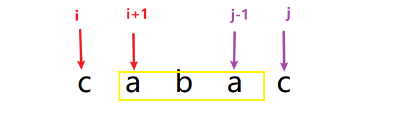

如果我们想要判断 [i~j] 范围内的字符串是否是回文子串，只需要`判断 [i+1,j-1] 范围内的字符串是否是回文子串`，如果是并且 i 和 j 的字符相等，那么 [i~j] 范围内的字符串就是回文子串，否则就不是

因此我们要定义一个 boolean类型的二维数组 dp\[i][j] : `表示[i,j] 范围内的字符串是否是回文子串`


**确定递推关系式**

整体上有俩种情况：

- s[i] != s[j]
- s[i] == s[j]

不相等时，dp\[i][j]肯定是false，没什么好说的。

相等时，又分为几种情况：

- 当 j == i 时，说明指向同一个字符，肯定是回文子串，即dp\[i][j] = true
- 当 j - i == 1时，说明相差一个字符，例如 bb ，也是回文子串
- 当 j - i > 1 时，此时要判断 `[i+1,j-1]` 是否是回文子串，如果是, 上面又有s[i] == s[j]的前提条件，那么 s[i,j] 就是回文子串。

```java
if (s[i] == s[j] && (j-i <= 1 || dp[i+1][j-1])) {
	res++; // 记录回文子串的数量
	dp[i][j] = true;
}
```


**初始化**

初始化全为false，默认肯定都不是回文子串

**遍历顺序**

通过上面的描述，我们可以得知，确定 dp\[i][j] 需要用到 dp\[i+1][j-1]

如果是从上到下、从左到右，那么会先使用 dp\[i][j]，就不知道 dp\[i+1][j-1] 是 true 还是false 了

因此遍历顺序应该为：从下到上，从左到右

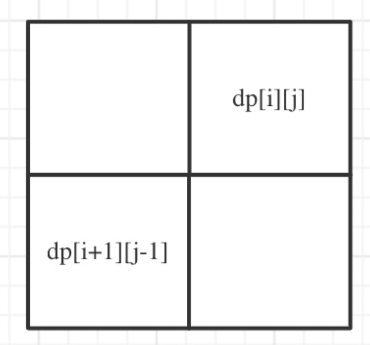


```java
class Solution {
    public int countSubstrings(String s) {
        int length = s.length();
        // dp[i][j] 表示s串从 i到j 的范围内是否是回文子串
        boolean[][] dp = new boolean[length][length];
        
        int res = 0;
        // 遍历顺序从下到上，从左到右
        for (int i = length - 1; i >= 0; i--) {
            for (int j = i; j < length; j++) {
                // 不相等的情况为false，初始化就是false，不用考虑
                if (s.charAt(i) == s.charAt(j) && (j-i <= 1 || dp[i+1][j-1])) {
                    res++;
                    dp[i][j] = true;
                }
            }
        }
        return res;
    }
}
```


## [516. 最长回文子序列](https://leetcode.cn/problems/longest-palindromic-subsequence/)

给你一个字符串 `s` ，找出其中最长的回文子序列，并返回该序列的长度。

子序列定义为：不改变剩余字符顺序的情况下，删除某些字符或者不删除任何字符形成的一个序列。


**示例 1：**

```
输入：s = "bbbab"
输出：4
解释：一个可能的最长回文子序列为 "bbbb" 。
```

**示例 2：**

```
输入：s = "cbbd"
输出：2
解释：一个可能的最长回文子序列为 "bb" 。
```


**提示：**

- `1 <= s.length <= 1000`
- `s` 仅由小写英文字母组成


### 思路分析

**定义dp数组及含义**

dp\[i][j] : 表示下标在 [i~j] 范围内的s串，它的回文子串的长度为 dp\[i][j]


**递推公式**

在求递推公式前，仍要利用回文串的特性：


若 s[i] == s[j] ，则 s[i~j] 范围内的s串的回文串的长度为 dp\[i+1][j-1] + 2 ,即： dp\[i][j] =  dp\[i+1][j-1] + 2

若 s[i] != s[j],仍然有俩种情况：

- 加入 s[i], 计算 s[i~j-1] 范围内的回文串长度，即 dp\[i][j] =  dp\[i][j-1]
- 加入 s[j], 计算 s[i+1~j] 范围内的回文串长度，即 dp\[i][j] =  dp\[i+1][j]

俩种情况取最大值，则：dp\[i][j] =  Math.max(dp\[i][j-1], dp\[i+1][j])


**初始化**

当 i 和 j 指向一个字符时，回文串的长度为 1

```java
for (int i = 0; i < length; i++) dp[i][i] = 1;
```


**遍历顺序**


```java
class Solution {
    public int longestPalindromeSubseq(String s) {
        int length = s.length();
        int[][] dp = new int[length][length];

        for (int i = 0; i < length; i++) dp[i][i] = 1;

        // 遍历顺序为 从下到上，从左到右
        for (int i = length - 1; i >= 0; i--) {
            for (int j = i + 1; j < length; j++) {
                if (s.charAt(i) == s.charAt(j)) {
                    dp[i][j] = dp[i + 1][j - 1] + 2;
                } else {
                    dp[i][j] = Math.max(dp[i + 1][j], dp[i][j - 1]);
                }
            }
        }
        return dp[0][length - 1];
    }
}
```

