# 回溯

## 简单介绍

回溯就是一种搜索的方式，它通常用于在搜索过程中`撤销`或`回退`一些步骤，以便在发现错误或达到某种条件时重新尝试其他路径。

回溯算法的效率其实并不高，虽然可以通过`剪枝操作`来提高效一些效率，但是效率仍然不高！

**通过回溯做的题目类型**：

- 组合问题：N个数里面按一定规则找出k个数的集合
- 切割问题：一个字符串按一定规则有几种切割方式
- 子集问题：一个N个数的集合里有多少符合条件的子集
- 排列问题：N个数按一定规则全排列，有几种排列方式
- 棋盘问题：N皇后，解数独等等

**组合和排列的区别**：

`组合不强调元素的顺序，而排列则强调元素的顺序`。

**例如**：{1、3} 和 {3、1} 对于组合来说就是一个集合，而对于排列来说就是俩种集合

## 如何理解回溯

回溯基本上都是通过递归来解决问题，因此所有的回溯都可以抽象成树结构！递归的终止条件为二叉树的高度。

回溯算法解决的基本都是在集合中递归查找子集，**集合的大小就构成了树的宽度，递归的深度，都构成的树的深度**。


**PS**：看到这里 "懵" 是很正常的，做了几道题就清晰了！

## 回溯模板

1. 回溯返回值及参数

```java
// 回溯的参数，一般都是用到啥写啥参数
void backtracking(参数)
```


2. 回溯的终止条件

一般来说搜到叶子节点了，也就找到了满足条件的一条答案，把这个答案存放起来，并结束本层递归。

```java
if (终止条件) {
    存放结果;
    return;
}
```


3. 回溯算法的搜索过程

在上面我们提到了，回溯法一般是在集合中递归搜索，集合的大小构成了树的宽度，递归的深度构成的树的深度。


**注意图中**：集合的大小和孩子的数量是相等的。

伪代码如下：

```java
for (选择：本层集合中元素（孩子的数量就是集合的大小）) {
    处理节点;
    backtracking(路径，选择列表); // 递归
    回溯，撤销处理结果
}
```

**for循环可以理解是横向遍历，backtracking（递归）就是纵向遍历**，这样就把这棵树全遍历完了，一般来说，搜索叶子节点就是找的其中一个结果了。


**回溯算法模板如下**：

```java
void backtracking(参数) {
    if (终止条件) {
        存放结果;
        return;
    }

    for (选择：本层集合中元素（树中节点孩子的数量就是集合的大小）) {
        处理节点;
        backtracking(路径，选择列表); // 递归
        回溯，撤销处理结果
    }
}

```


## [77. 组合](https://leetcode.cn/problems/combinations/)

给定两个整数 `n` 和 `k`，返回范围 `[1, n]` 中所有可能的 `k` 个数的组合。

你可以按 **任何顺序** 返回答案。


**示例 1：**

```
输入：n = 4, k = 2
输出：
[
  [2,4],
  [3,4],
  [2,3],
  [1,2],
  [1,3],
  [1,4],
]
```

**示例 2：**

```
输入：n = 1, k = 1
输出：[[1]]
```


**提示：**

- `1 <= n <= 20`
- `1 <= k <= n`

### 思路分析

该题就是典型回溯问题。假设使用 for 循环，如例题中 的k=2，那么就得使用俩层 for 循环：

```java
        for (int i = 0; i < n; i++) {
            for (int j = i+1; j < n; j++) {
                
            }
        }
```

如果 k =3 ，就得用三层for循环，那么k=50呢？ 很明显暴力法是不行。

虽然递归也算是暴力法，但不至于像for循环那样绝望~~

在介绍回溯算法时，说过所有的回溯问题都可以抽象成一颗二叉树，那么将该题抽象成二叉树为：


其实从图中可以看出，n就是树的宽度，k就是 树的高度，也决定了有多少次循环。

首先，定义俩个集合，`item `存放集合中的元素，·`res`存放所有的集合

```java
    ArrayList<List<Integer>> res = new ArrayList<>();
    LinkedList<Integer> item = new LinkedList<>();
```

**确定终止条件**

当 item 集合中的元素等于 k 时，说明符合题意，将该集合放入到 `res` 中

```java
        // 终止条件
        if (item.size() == k) {
            // 这里一定要new一个集合，不然操作的始终是同一个item集合
            res.add(new ArrayList<>(item));
            return;
        }
```

**返回值及参数**

由于横向遍历时，需要确定起始的元素是哪个，因此我们需要一个 `startIndex` 指针

```java
 void backtracking(int n,int k,int startIndex)
```

**单层逻辑**

for循环就是横向遍历，递归调用的过程就是纵向遍历。不断递归达到叶子节点时，将元素放入到 `item`集合中。

递归和回溯是息息相关的，每进行一次递归都要进行一次回溯。在[257. 二叉树的所有路径](https://leetcode.cn/problems/binary-tree-paths/) 我们已经说过了！

`item.removeLast()` 删除上一个增加到`item` 集合中的元素，简单来说，**递归之前做了什么(增加元素)，递归之后就要做相同的逆操作(删除元素)**，进行回溯！

```java
        for (int i = startIndex; i <= n; i++) {
            // 处理结点
            item.add(i);
            // 纵向递归遍历：控制树的纵向遍历，注意下一层搜索要从i+1开始
            backtracking(n,k,i+1);
            // 回溯：撤销处理过的结点
            item.removeLast();
        }
```


**完整代码**

```java
   ArrayList<List<Integer>> res = new ArrayList<>();
    LinkedList<Integer> item = new LinkedList<>();

    public List<List<Integer>> combine(int n, int k) {

        backtracking(n,k,1);
        return res;
    }
    /**
     * 回溯
     * startIndex为每次回溯的起点
     * */
    public void backtracking(int n,int k,int startIndex) {
        // 终止条件
        if (item.size() == k) {
            // 这里一定要new一个集合，不然操作的始终是同一个item集合
            res.add(new ArrayList<>(item));
            return;
        }
        for (int i = startIndex; i <= n; i++) {
            // 处理结点
            item.add(i);
            // 纵向递归遍历：控制树的纵向遍历，注意下一层搜索要从i+1开始
            backtracking(n,k,i+1);
            // 回溯：撤销处理过的结点
            item.removeLast();
        }
    }
```


### 剪枝优化

假设n=4，k=4，那么在第一次 for 循环的过程中，其实就没必要再往后面遍历了。因为只剩下3个元素，肯定是不满足条件。

`item.size ` 为已经选择的元素

`k `为需要的元素

`k - item.size `为还需要选择的元素

`n - （k - item.size） + 1` 为当前for循环中，起始元素的最大值。


**举例说明**

假设 n = 5，k = 3

当 item.size = 1 时，还需要选择 2 个元素，那么最大的起始元素为 4，组成的组合为: [4,5]

当 item.size = 2 时，还需要选择 1 个元素，那么最大的起始元素为 5，组成的组合为: [5]

**因此以得出**：

> $最大起始元素 + 还需要选择的元素个数 - 1 = n$
>
> $那么还需要选择的元素 = k - item.size$

**最后得出**：

> $最大的起始元素 = n - (k-item.size) + 1$

所以，剪枝的过程就是把` i<= n` 替换成 `i<=n - (k-item.size) + 1`

```java
        for (int i = startIndex; i <= n - (k - item.size()) + 1; i++) { // 剪枝
            // 处理结点
            item.add(i);
            // 纵向递归遍历：控制树的纵向遍历，注意下一层搜索要从i+1开始
            backtracking(n,k,i+1);
            // 回溯：撤销处理过的结点
            item.removeLast();
        }
```


## [216. 组合总和 III](https://leetcode.cn/problems/combination-sum-iii/)

找出所有相加之和为 `n` 的 `k` 个数的组合，且满足下列条件：

- 只使用数字1到9
- 每个数字 **最多使用一次**

返回 *所有可能的有效组合的列表* 。该列表不能包含相同的组合两次，组合可以以任何顺序返回。


**示例 1:**

```
输入: k = 3, n = 7
输出: [[1,2,4]]
解释:
1 + 2 + 4 = 7
没有其他符合的组合了。
```

**示例 2:**

```
输入: k = 3, n = 9
输出: [[1,2,6], [1,3,5], [2,3,4]]
解释:
1 + 2 + 6 = 9
1 + 3 + 5 = 9
2 + 3 + 4 = 9
没有其他符合的组合了。
```

**示例 3:**

```
输入: k = 4, n = 1
输出: []
解释: 不存在有效的组合。
在[1,9]范围内使用4个不同的数字，我们可以得到的最小和是1+2+3+4 = 10，因为10 > 1，没有有效的组合。
```


**提示:**

- `2 <= k <= 9`
- `1 <= n <= 60`

### 思路分析

做过 [77. 组合](https://leetcode.cn/problems/combinations/) 这道题就比较容易了。抽象为二叉树如下图所示：


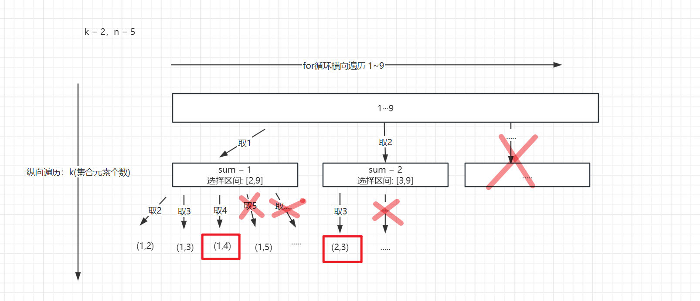

仍然需要定义俩个集合：

```java
    ArrayList<List<Integer>> res = new ArrayList<>();
    LinkedList<Integer> item = new LinkedList<>();
```

**返回值及条件**

除了需要定义` startIndex` 起始索引之外，还需要定义一个 `sum` 用来收集 item 集合的和 (不定义sum，用n减也行，如果等于0 就收集起来)

```java
 void backtracking(int k, int n, int sum, int startIndex)
```

**终止条件**

- 当 item 元素个数 等于 k，并且 sum = n

```java
        if (item.size() == k && sum == n) {
            res.add(new ArrayList<>(item));
            return;
        }
```


**单层搜索逻辑**

仍然通过 递归 将叶子结点增加到 item 集合中

```java
for (int i = startIndex; i <= 9 ; i++) {

    item.add(i);
    sum += i;
    backtracking(k, n, sum, i + 1);
    // 记住：递归之前干什么，递归之后就要逆向操作，也就是回溯！！！！
    sum -= i;
    item.removeLast();
}
```

**完整代码**

```java
    ArrayList<List<Integer>> res = new ArrayList<>();
    LinkedList<Integer> item = new LinkedList<>();

    public List<List<Integer>> combinationSum3(int k, int n) {
        backtracking(k, n, 0, 1);
        return res;
    }

    /**
     * @description
     * @date 2023/11/28 22:33
     * @param k
     * @param n
     * @param sum 记录增加到item中元素的和
     * @param startIndex 每次横向遍历时，起始的元素
     * @return void
     */
    public void backtracking(int k, int n, int sum, int startIndex) {

        if (item.size() == k && sum == n) {
            res.add(new ArrayList<>(item));
            return;
        }
        for (int i = startIndex; i <= 9; i++) {

            item.add(i);
            sum += i;
            backtracking(k, n, sum, i + 1);
            // 记住：递归之前干什么，递归之后就要逆向操作，也就是回溯！！！！
            sum -= i;
            item.removeLast();
        }
    }
```


### 剪枝优化

通过上图其实就可看出来了，有俩个地方可以进行剪枝

- 当sum > n 时, 在往后遍历就没有意义了，直接剪掉
- 和 77 一样，当所剩余元素不足需要选择的元素个数时，直接减掉【9 - (k - item.size) + 1】

```java
    ArrayList<List<Integer>> res = new ArrayList<>();
    LinkedList<Integer> item = new LinkedList<>();

    public List<List<Integer>> combinationSum3(int k, int n) {
        backtracking(k, n, 0, 1);
        return res;
    }

    /**
     * @description
     * @date 2023/11/28 22:33
     * @param k
     * @param n
     * @param sum 记录增加到item中元素的和
     * @param startIndex 每次横向遍历时，起始的元素
     * @return void
     */
    public void backtracking(int k, int n, int sum, int startIndex) {
        // 剪枝，如果当前和都已经大于n了，后面就没有必要在进行遍历了
        if (sum > n) return;


        if (item.size() == k && sum == n) {
            res.add(new ArrayList<>(item));
            return;
        }
        for (int i = startIndex; i <= 9 - (k - item.size()) + 1; i++) {

            item.add(i);
            sum += i;
            backtracking(k, n, sum, i + 1);
            // 记住：递归之前干什么，递归之后就要逆向操作，也就是回溯！！！！
            sum -= i;
            item.removeLast();
        }
    }
```


## [17. 电话号码的字母组合](https://leetcode.cn/problems/letter-combinations-of-a-phone-number/)

给定一个仅包含数字 `2-9` 的字符串，返回所有它能表示的字母组合。答案可以按 **任意顺序** 返回。

给出数字到字母的映射如下（与电话按键相同）。注意 1 不对应任何字母。


**示例 1：**

```
输入：digits = "23"
输出：["ad","ae","af","bd","be","bf","cd","ce","cf"]
```

**示例 2：**

```
输入：digits = ""
输出：[]
```

**示例 3：**

```
输入：digits = "2"
输出：["a","b","c"]
```


**提示：**

- `0 <= digits.length <= 4`
- `digits[i]` 是范围 `['2', '9']` 的一个数字。

### 思路分析

看到回溯的题目，首先要将其抽象成一个二叉树，如下图所示：


我们首先要知道 数字 和 字母要如何进行映射，给你一个数字字母串你得能找到对应的字母。

使用数组和map集合都可以。使用数组的话，用下标表数组，字母代表值。map用key代表数字，value代表值。

因此，定义如下：

```java
        // 使用map保存数字和字母的映射关系。也可以用数组表示，值为字母，下标代表数字
        HashMap<Character, List<String>> map = new HashMap<>();
        map.put('2', Arrays.asList("a", "b", "c"));
        map.put('3', Arrays.asList("d", "e", "f"));
        map.put('4', Arrays.asList("g", "h", "i"));
        map.put('5', Arrays.asList("j", "k", "l"));
        map.put('6', Arrays.asList("m", "n", "o"));
        map.put('7', Arrays.asList("p", "q", "r", "s"));
        map.put('8', Arrays.asList("t", "u", "v"));
        map.put('9', Arrays.asList("w", "x", "y", "z"));
```

**终止条件**

通过图片我们可以看出来，给定的数字字符串长度为多少，那么每一种组合他的字母长度就为多少。也就是说**树的深度与数组字符串的长度相等**。

假设我们 `StringBuilder` 用来保存字母，那么就有：

此处我将数字字符串转换成字符数组 `chars`了。

```java
        // sb保存字母，当字母长度等于数字长度时，说明为一组集合
        if (sb.length() == chars.length) {
            res.add(sb.toString());
            return;
        }
```


**返回值及参数：**

除了` chars数组以及map集合`，我们仍需要使用 startIndex 指针，用来指向当前遍历的数字。也就是当前树的深度。

```java
 public void backtracking(char[] chars, Integer startIndex, HashMap<Character, List<String>> map) {}
```


**单层递归逻辑**

在 for循环里，我们遍历的应该是数字对应的字母集合。因此我们先通过map集合找出数字对应的集合。

然后通过递归将每一个字母加到 `sb` 中。

此处需要注意的是，for循环不在以 startIndex 开始，因为我们需要使用 startIndex 来确定遍历的数字，而for循环遍历的是字母。

```java
        // 当前数字代表的字母集合
        List<String> letterList = map.get(chars[startIndex]);
        for (int i = 0; i < letterList.size(); i++) {
            sb.append(letterList.get(i));
            backtracking(chars, startIndex + 1, map);
            sb.deleteCharAt(sb.length() - 1); // 回溯，删除上一个处理的字母，继续处理
        }
```


**整体代码**

```java
    List<String> res = new ArrayList<>();
    StringBuilder sb = new StringBuilder();

    public List<String> letterCombinations(String digits) {
        if (digits == null || digits.length() == 0) return res;
        char[] chars = digits.toCharArray();
        // 使用map保存数字和字母的映射关系。也可以用数组表示，值为字母，下标代表数字
        HashMap<Character, List<String>> map = new HashMap<>();
        map.put('2', Arrays.asList("a", "b", "c"));
        map.put('3', Arrays.asList("d", "e", "f"));
        map.put('4', Arrays.asList("g", "h", "i"));
        map.put('5', Arrays.asList("j", "k", "l"));
        map.put('6', Arrays.asList("m", "n", "o"));
        map.put('7', Arrays.asList("p", "q", "r", "s"));
        map.put('8', Arrays.asList("t", "u", "v"));
        map.put('9', Arrays.asList("w", "x", "y", "z"));
        backtracking(chars, 0, map);
        return res;
    }

    public void backtracking(char[] chars, Integer startIndex, HashMap<Character, List<String>> map) {
        // sb保存字母，当字母长度等于数字长度时，说明为一组集合
        if (sb.length() == chars.length) {
            res.add(sb.toString());
            return;
        }
        // 当前数字代表的字母集合
        List<String> letterList = map.get(chars[startIndex]);
        for (int i = 0; i < letterList.size(); i++) {
            sb.append(letterList.get(i));
            backtracking(chars, startIndex + 1, map);
            sb.deleteCharAt(sb.length() - 1); // 回溯，删除上一个处理的字母，继续处理
        }

    }
```


## [39. 组合总和](https://leetcode.cn/problems/combination-sum/)

给你一个 **无重复元素** 的整数数组 `candidates` 和一个目标整数 `target` ，找出 `candidates` 中可以使数字和为目标数 `target` 的 所有 **不同组合** ，并以列表形式返回。你可以按 **任意顺序** 返回这些组合。

`candidates` 中的 **同一个** 数字可以 **无限制重复被选取** 。如果至少一个数字的被选数量不同，则两种组合是不同的。

对于给定的输入，保证和为 `target` 的不同组合数少于 `150` 个。


**示例 1：**

```
输入：candidates = [2,3,6,7], target = 7
输出：[[2,2,3],[7]]
解释：
2 和 3 可以形成一组候选，2 + 2 + 3 = 7 。注意 2 可以使用多次。
7 也是一个候选， 7 = 7 。
仅有这两种组合。
```

**示例 2：**

```
输入: candidates = [2,3,5], target = 8
输出: [[2,2,2,2],[2,3,3],[3,5]]
```

**示例 3：**

```
输入: candidates = [2], target = 1
输出: []
```


**提示：**

- `1 <= candidates.length <= 30`
- `2 <= candidates[i] <= 40`
- `candidates` 的所有元素 **互不相同**
- `1 <= target <= 40`

### 思路分析

此题的唯一一个难点，就是选取的元素可以无限重复。但是在代码中，我们不可能让它无限重复，假设我们用` sum` 保存集合的和，当 sum > tartget 时，就没有必须在选取了。因此：

**终止条件**

- sum == target，保存当前组合
- sum > target 结束

```java
        if (sum == target) {
            res.add(new ArrayList<>(path));
            return;
        }

        if (sum > target) return;
```

**返回值及参数**

仍然需要 `startIndex` 指针，指向当前遍历的元素。

当我们求同一个集合中的不同组合时，就需要用 `startIndex`，像 77、216 这俩道题

当我们求不同集合之间的组合时，就不需要用 `startIndex` ,  像 17 题

```java
public void backtracking(int[] candidates, int target, int sum, int startIndex) {}
```


**单层递归逻辑**

```java
        for (int i = startIndex; i < candidates.length; i++) {
            path.add(candidates[i]);
            sum += candidates[i];

            backtracking(candidates, target, sum, i); // 由于元素可以重复，i 就无需+1
            // 进行回溯
            sum -= candidates[i];
            path.remove(path.size() - 1);
        }
```


**完整代码**

```java
    List<List<Integer>> res = new ArrayList<>();
    List<Integer> path = new ArrayList<>();

    public List<List<Integer>> combinationSum(int[] candidates, int target) {
        backtracking(candidates, target, 0, 0);
        return res;
    }

    public void backtracking(int[] candidates, int target, int sum, int startIndex) {
        if (sum == target) {
            res.add(new ArrayList<>(path));
            return;
        }

        if (sum > target) return;
        for (int i = startIndex; i < candidates.length; i++) {
            path.add(candidates[i]);
            sum += candidates[i];

            backtracking(candidates, target, sum, i); // 由于元素可以重复，i 就无需+1
            // 进行回溯
            sum -= candidates[i];
            path.remove(path.size() - 1);
        }
    }
```


## [40. 组合总和 II](https://leetcode.cn/problems/combination-sum-ii/)

给定一个候选人编号的集合 `candidates` 和一个目标数 `target` ，找出 `candidates` 中所有可以使数字和为 `target` 的组合。

`candidates` 中的每个数字在每个组合中只能使用 **一次** 。

**注意：**解集不能包含重复的组合。


**示例 1:**

```
输入: candidates = [10,1,2,7,6,1,5], target = 8,
输出:
[
[1,1,6],
[1,2,5],
[1,7],
[2,6]
]
```

**示例 2:**

```
输入: candidates = [2,5,2,1,2], target = 5,
输出:
[
[1,2,2],
[5]
]
```


**提示:**

- `1 <= candidates.length <= 100`
- `1 <= candidates[i] <= 50`
- `1 <= target <= 30`

### 思路分析

该题相较于上面几题的区别就是： 选取元素的集合可能有重复元素，但是不能包含重复的组合。

> 比如：
>
> 输入: candidates = [10,1,2,7,6,1,5], target = 8,
>
> 像 [1,1,6] 和 [6,1,1] 这样是不行的


集合中可以存在重复的元素，就是在一个 "树枝" 中 可以重复

不能有重复的组合，就是在同一 "层" 中不能有重复。

如下图所示：


**完整代码**

```java
    List<List<Integer>> res = new ArrayList<>();
    List<Integer> path = new ArrayList<>();

    public List<List<Integer>> combinationSum2(int[] candidates, int target) {
        Arrays.sort(candidates);
        backtracking(candidates, target, 0, 0);
        return res;
    }

    public void backtracking(int[] candidates, int target, int sum, int startIndex) {
        if (sum == target) {
            res.add(new ArrayList<>(path));
            return;
        }
        for (int i = startIndex; i < candidates.length; i++) {
            // 剪枝
            if (sum + candidates[i] >target) break;
            // i=startIndex 为同一层的第一个元素
            // 去重操作,这里用 i > startIndex, 是因为去重主要是对同一层进行去重。
            if (i > startIndex && candidates[i] == candidates[i - 1]) {
                continue;
            }
            path.add(candidates[i]);
            sum += candidates[i];

            backtracking(candidates, target, sum, i + 1);

            // 回溯
            sum -= candidates[i];
            path.remove(path.size() - 1);
        }
    }
```

## [131. 分割回文串](https://leetcode.cn/problems/palindrome-partitioning/)

给你一个字符串 `s`，请你将 `s` 分割成一些子串，使每个子串都是 **回文串** 。返回 `s` 所有可能的分割方案。

**回文串** 是正着读和反着读都一样的字符串。


**示例 1：**

```
输入：s = "aab"
输出：[["a","a","b"],["aa","b"]]
```

**示例 2：**

```
输入：s = "a"
输出：[["a"]]
```


**提示：**

- `1 <= s.length <= 16`
- `s` 仅由小写英文字母组成

### 思路分析

在我看来，解决该题，至少要知道：

- 如何进行切割
- 如何判断回文串

首先看第一个问题，"切割"问题其实和 "组合" 问题一样，都可以使用回溯方法来做，都可以抽象成一颗二叉树，如下图所示：

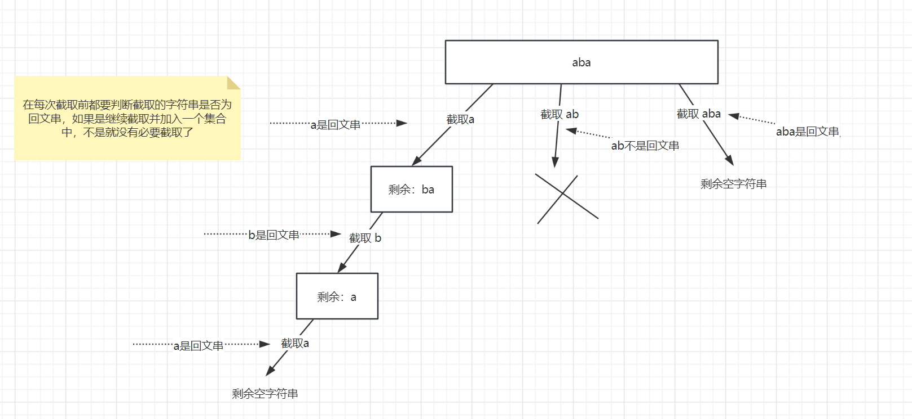

**变量**

仍然需要俩个集合，一个 `res` 保存所有的切割方案，一个 `path` 用来保存每一个切割方案

```java
    List<String> path = new ArrayList<>();
    List<List<String>> res = new ArrayList<>();
```

**终止条件**

这道题仍然需要一个 startIndex 来指向即将遍历的字符，也就是说当 startIndex 指向 s串的末尾时，说明已经有了一个切割方案，即加入到 res 中。

```java
        if (startIndex == s.length()) {
            res.add(new ArrayList<>(path));
            return;
        }
```

**返回值及参数**

```java
public void backtracking(String s, int startIndex) {}
```

**单层递归逻辑**

通过上面图中可以看到，在截取每个字符时，都要判断当前截取的字符是否为回文串。如何截取呢？

`startIndex` 为起始索引，而 for 循环中的 i 变量则表示，该次遍历的结束索引。那么 `substring(startIndex, i + 1)`  则为当前要截取的字符串，

```java
        for (int i = startIndex; i < s.length(); i++) {
            // 判断是否是回文子串,[startIndex,i] 为当前遍历时要截取的子串
            if (isPalindrome(s,startIndex,i)) {
                String substring = s.substring(startIndex, i + 1);
                path.add(substring);
            }else{
                continue;
            }
            backtracking(s,i+1);
            path.remove(path.size()-1);
        }
```

**判断回文串**

采用双指针法，比较头尾字符

```java
    // 判断字符串是否是回文串
    public boolean isPalindrome(String s,int start,int end) {
        for (int i = start,j = end; i < j; i++,j--) {
            if (s.charAt(i) != s.charAt(j)) return false;
        }
        return true;

    }
```

**完整代码**

```java
   List<String> path = new ArrayList<>();
    List<List<String>> res = new ArrayList<>();

    public List<List<String>> partition(String s) {
        backtracking(s, 0);
        return res;
    }

    public void backtracking(String s, int startIndex) {
        if (startIndex == s.length()) {
            res.add(new ArrayList<>(path));
            return;
        }
        for (int i = startIndex; i < s.length(); i++) {
            // 判断是否是回文子串,[startIndex,i] 为当前遍历时要截取的子串
            if (isPalindrome(s,startIndex,i)) {
                String substring = s.substring(startIndex, i + 1);
                path.add(substring);
            }else{
                continue;
            }
            backtracking(s,i+1);
            path.remove(path.size()-1);
        }
    }

    // 判断字符串是否是回文串
    public boolean isPalindrome(String s,int start,int end) {
        for (int i = start,j = end; i < j; i++,j--) {
            if (s.charAt(i) != s.charAt(j)) return false;
        }
        return true;

    }
```


## [93. 复原 IP 地址](https://leetcode.cn/problems/restore-ip-addresses/)

**有效 IP 地址** 正好由四个整数（每个整数位于 `0` 到 `255` 之间组成，且不能含有前导 `0`），整数之间用 `'.'` 分隔。

- 例如：`"0.1.2.201"` 和` "192.168.1.1"` 是 **有效** IP 地址，但是 `"0.011.255.245"`、`"192.168.1.312"` 和 `"192.168@1.1"` 是 **无效** IP 地址。

给定一个只包含数字的字符串 `s` ，用以表示一个 IP 地址，返回所有可能的**有效 IP 地址**，这些地址可以通过在 `s` 中插入 `'.'` 来形成。你 **不能** 重新排序或删除 `s` 中的任何数字。你可以按 **任何** 顺序返回答案。


**示例 1：**

```
输入：s = "25525511135"
输出：["255.255.11.135","255.255.111.35"]
```

**示例 2：**

```
输入：s = "0000"
输出：["0.0.0.0"]
```

**示例 3：**

```
输入：s = "101023"
输出：["1.0.10.23","1.0.102.3","10.1.0.23","10.10.2.3","101.0.2.3"]
```


**提示：**

- `1 <= s.length <= 20`
- `s` 仅由数字组成

### 思路分析

这道题思路分析 其实和 [131. 分割回文串](https://leetcode.cn/problems/palindrome-partitioning/) 是一样的，只不过上面是判断是否是回文串，这道题是判断是否是有效IP地址。

那么对于有效的IP地址，应该满足以下三个条件：

1. 每一段不能以0开头，但是当该段只有一个字符时，可以是 0.比如：255.0.0.1 是有效的，255.0.01.1 是无效的
2. 每一段不能为非数字
3. 每一段不能超过255

**抽象成二叉树为**：

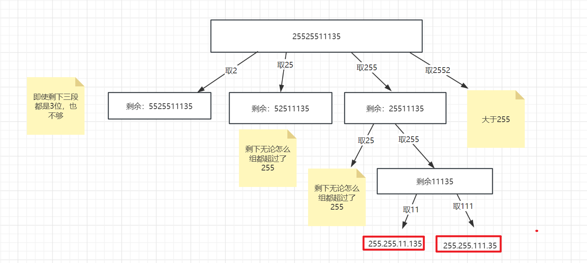

**定义俩个变量**

```java
    // 保存所有合法的ip地址
    List<String> res = new ArrayList<>();
    // 保存ip地址的每一段，例如：["255","255","11","135"]
    List<String> path = new ArrayList<>();
```

**终止条件**

仍然需要使用 startIndex 指针， 当 path.size = 4 时，说明有一组合法的IP地址，并且还需要判断 startIndex 的位置，一定要指向 s串的末尾。不然像 2.5.5.2 也会符合条件。

```java
        if (path.size() == 4 && startIndex >= s.length()) {
            // 将ip地址保存到最终的集合中
            res.add(String.join(".", path));
            return;
        }
```

**返回值及参数**

```java
 public void backtracking(String s, int startIndex) {}
```

**单层递归逻辑**

```java
        for (int i = startIndex; i < s.length(); i++) {

            // 校验当前区间是否合法
            if (isValid(s, startIndex, i)) {
                String substring = s.substring(startIndex, i + 1);
                path.add(substring);
            } else {
                continue;
            }
            backtracking(s, i + 1);
            path.remove(path.size() - 1);
        }
```

**判断是否为合法的IP地址**

```java
    // 校验该段ip地址是否合法
    private boolean isValid(String s, int start, int end) {
        // if (start > end) return false;
        //1、每一段起始不能为0,start != end为了防止每段中只有一个元素，因为 0.0.0.0 是合法的
        if (s.charAt(start) == '0' && start != end) return false;
        //2、每一段中不能含有非数字
        //3、每一段中不能超过255
        int nums = 0;
        for (int i = start; i <= end; i++) {
            if (s.charAt(i) > '9' || s.charAt(i) < '0') return false;
            // 将当前字符转换成int型
            nums = (s.charAt(i) - '0') + nums * 10;
            if (nums > 255) return false;
        }
        return true;
    }
```


**完整代码**

```java
   // 保存所有合法的ip地址
    List<String> res = new ArrayList<>();
    // 保存ip地址的每一段，例如：["255","255","11","135"]
    List<String> path = new ArrayList<>();

    public List<String> restoreIpAddresses(String s) {
        backtracking(s, 0);
        return res;
    }

    public void backtracking(String s, int startIndex) {
        // if (path.size() > 4) return;

        if (path.size() == 4 && startIndex >= s.length()) {
            // 将ip地址保存到最终的集合中
            res.add(String.join(".", path));
            return;
        }
        for (int i = startIndex; i < s.length(); i++) {

            // 校验当前区间是否合法
            if (isValid(s, startIndex, i)) {
                String substring = s.substring(startIndex, i + 1);
                path.add(substring);
            } else {
                continue;
            }
            backtracking(s, i + 1);
            path.remove(path.size() - 1);
        }
    }

    // 校验该段ip地址是否合法
    private boolean isValid(String s, int start, int end) {
        // if (start > end) return false;
        //1、每一段起始不能为0,start != end为了防止每段中只有一个元素，因为 0.0.0.0 是合法的
        if (s.charAt(start) == '0' && start != end) return false;
        //2、每一段中不能含有非数字
        //3、每一段中不能超过255
        int nums = 0;
        for (int i = start; i <= end; i++) {
            if (s.charAt(i) > '9' || s.charAt(i) < '0') return false;
            // 将当前字符转换成int型
            nums = (s.charAt(i) - '0') + nums * 10;
            if (nums > 255) return false;
        }
        return true;
    }
```

## [78. 子集](https://leetcode.cn/problems/subsets/)

给你一个整数数组 `nums` ，数组中的元素 **互不相同** 。返回该数组所有可能的子集（幂集）。

解集 **不能** 包含重复的子集。你可以按 **任意顺序** 返回解集。


**示例 1：**

```
输入：nums = [1,2,3]
输出：[[],[1],[2],[1,2],[3],[1,3],[2,3],[1,2,3]]
```

**示例 2：**

```
输入：nums = [0]
输出：[[],[0]]
```


**提示：**

- `1 <= nums.length <= 10`
- `-10 <= nums[i] <= 10`
- `nums` 中的所有元素 **互不相同**

### 思路分析

到目前为止，对于回溯问题我遇见了三种：

- 组合
- 切割
- 子集

组合即从一组元素中，任意选取若干个元素组合成一个集合，不考虑元素的顺序。使用回溯时通常要在终止条件时，判断组成的集合是否符合条件。

切割问题通常对给定的字符串进行切割，判断切割出来的序列是否符合条件，然后加到集合中。

子集问题则是要遍历所有的元素，每遍历一个元素都要加入到集合中，形成新的子集。

**抽象为二叉树为**：

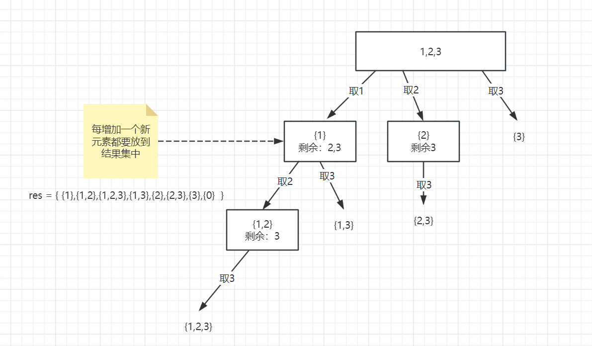

**变量**

仍然需要俩个集合

```java
    List<List<Integer>> res = new ArrayList<>();
    List<Integer> path = new ArrayList<>();
```

**终止条件**

子集问题要遍历所有元素，因此仍然需要使用 startIndex 记录遍历的元素，当 startIndex 指针指向最后一个元素时表示遍历完成

```java
if (startIndex >= nums.length)return;
```

**返回值及参数**

```java
public void backtracking(int[] nums,int startIndex) {}
```

**单层递归逻辑**

在前面说过，子集问题通常要扫描所有元素，没遍历一个元素都要加入集合中去，形成一个新的子集

```java
        for (int i = startIndex; i < nums.length; i++) {
            // 每遍历一个元素，就将该元素加入到path中，并加入到 res集合中。都算是一个子集
            path.add(nums[i]);
            res.add(new ArrayList<>(path));
            backtracking(nums,i+1);
            path.remove(path.size() -1);
        }
```

**完整代码：**

最后不要忘记，将 {0} 也加入到结果集当中

```java
    List<List<Integer>> res = new ArrayList<>();
    List<Integer> path = new ArrayList<>();
    public List<List<Integer>> subsets(int[] nums) {
        // 空集合也算是一个子集
        res.add(new ArrayList<>());
        backtracking(nums,0);
        return res;
    }

    public void backtracking(int[] nums,int startIndex) {
        if (startIndex >= nums.length)return;

        for (int i = startIndex; i < nums.length; i++) {
            // 每遍历一个元素，就将该元素加入到path中，并加入到 res集合中。都算是一个子集
            path.add(nums[i]);
            res.add(new ArrayList<>(path));
            backtracking(nums,i+1);
            path.remove(path.size() -1);
        }
    }
```


## [90. 子集 II](https://leetcode.cn/problems/subsets-ii/)

给你一个整数数组 `nums` ，其中可能包含重复元素，请你返回该数组所有可能的子集（幂集）。

解集 **不能** 包含重复的子集。返回的解集中，子集可以按 **任意顺序** 排列。


**示例 1：**

```
输入：nums = [1,2,2]
输出：[[],[1],[1,2],[1,2,2],[2],[2,2]]
```

**示例 2：**

```
输入：nums = [0]
输出：[[],[0]]
```


**提示：**

- `1 <= nums.length <= 10`
- `-10 <= nums[i] <= 10`

### 思路分析

该题相较于 [78. 子集](https://leetcode.cn/problems/subsets/) 仅仅多了一个去重的步骤，而去重操作其实在   [40. 组合总和 II](https://leetcode.cn/problems/combination-sum-ii/) 已经有过说明，再来看一下。

先抽象成一个二叉树，如下图所示：

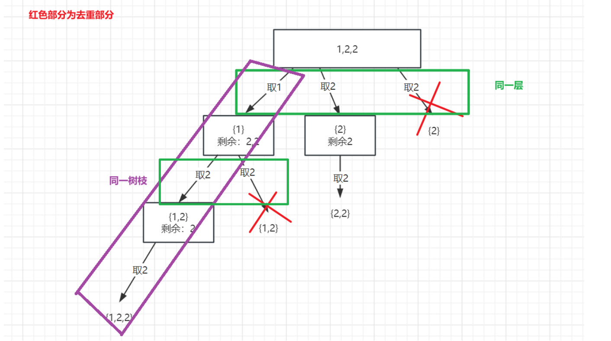

通过图中可以看出，去重是针对同一层是否有重复元素，而对于同一个树枝是允许有重复元素的。

每一层其实就是每次递归进行的 for循环，而 `startIndex` 则为for循环的起始下标。因此当 `i> startIndex` 时，也就是从每一层的第二个元素开始，进行判断前后俩个元素是否相等。相等则跳过(提前对数组进行排序)。


```java
List<List<Integer>> res = new ArrayList<>();
List<Integer> path = new ArrayList<>();
public List<List<Integer>> subsetsWithDup(int[] nums) {
    Arrays.sort(nums);
    res.add(new ArrayList<>());
    backtracking(nums,0);
    return res;
}

public void backtracking(int[] nums,int startIndex) {
    if (startIndex >= nums.length) return;

    for (int i = startIndex; i < nums.length;i++) {
        // 进行去重
        if (i > startIndex && nums[i] == nums[i-1]) continue;
        path.add(nums[i]);
        res.add(new ArrayList<>(path));
        backtracking(nums,i+1);
        path.remove(path.size()-1);
    }
}
```


## [491. 递增子序列](https://leetcode.cn/problems/non-decreasing-subsequences/)

给你一个整数数组 `nums` ，找出并返回所有该数组中不同的递增子序列，递增子序列中 **至少有两个元素** 。你可以按 **任意顺序** 返回答案。

数组中可能含有重复元素，如出现两个整数相等，也可以视作递增序列的一种特殊情况。


**示例 1：**

```
输入：nums = [4,6,7,7]
输出：[[4,6],[4,6,7],[4,6,7,7],[4,7],[4,7,7],[6,7],[6,7,7],[7,7]]
```

**示例 2：**

```
输入：nums = [4,4,3,2,1]
输出：[[4,4]]
```


**提示：**

- `1 <= nums.length <= 15`
- `-100 <= nums[i] <= 100`

### 思路分析

该题大概一看其实和 子集二 差不多，如果这样认为的话，其实就掉坑里了。

这道题与 子集二 的区别就是： 子集二可以对序列排序，该题不能排序，因为排完序后会影响原序列的递增顺序。

因此我们**不能**和 子集二 一样**比较前后俩个元素进行去重**。 可以使用 hash 进行去重，将每一层的元素都放到 hash 中。

**抽象成二叉树如下图所示**：

注意：hash是保存同一层的元素。这个 "同一层" 是指在同一个父结点下

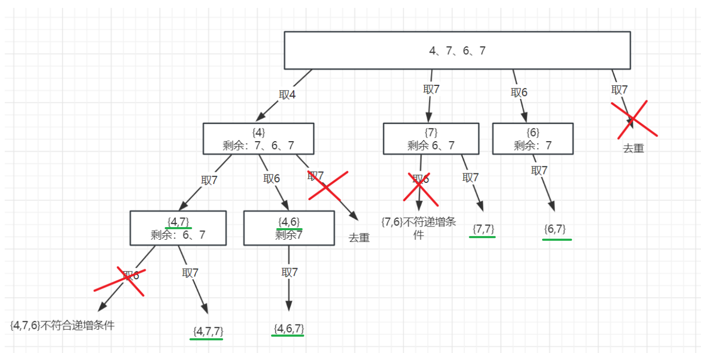


**定义集合变量：**

```java
    List<List<Integer>> res = new ArrayList<>();
    List<Integer> path = new ArrayList<>();
```

**终止条件**

这里不要 return ，要一直递归到叶子结点。将所有的子集都加到集合中

```java
        // 这里不要return, 要遍历当前 "树枝" 下的所有元素
        if (path.size() >= 2) res.add(new ArrayList<>(path));
```

**返回值及参数**

```java
public void backtracking(int[] nums, int startIndex) {}
```

**单层递归逻辑**

for循环就是对 同一层 进行遍历，在 添加到 path 集合前，要进行去重(使用set去重)，并且判断是否符合递增的条件！

```java
        // 此处不能在像 90/40 题一样，简单的比较前后俩个元素进行去重，因为该题不能进行排序
        // 可以使用set对同一层的元素进行去重
        HashSet<Integer> set = new HashSet<>();
        for (int i = startIndex; i < nums.length; i++) {
            // 利用set进行去重，如果有重复的就无需在使用当前元素。或者path中最后一个元素大于当前元素，也不符合递增，也不使用当前元素
            if (!path.isEmpty() && path.get(path.size() - 1) > nums[i] || set.contains(nums[i])) continue;
            set.add(nums[i]);
            path.add(nums[i]);
            backtracking(nums, i + 1);
            path.remove(path.size() - 1);
        }
```


**完整代码**

```java
    List<List<Integer>> res = new ArrayList<>();
    List<Integer> path = new ArrayList<>();

    public List<List<Integer>> findSubsequences(int[] nums) {
        backtracking(nums, 0);
        return res;
    }

    public void backtracking(int[] nums, int startIndex) {
        // 这里不要return, 要遍历当前 "树枝" 下的所有元素
        if (path.size() >= 2) res.add(new ArrayList<>(path));

        // 此处不能在像 90/40 题一样，简单的比较前后俩个元素进行去重，因为该题不能进行排序
        // 可以使用set对同一层的元素进行去重
        HashSet<Integer> set = new HashSet<>();
        for (int i = startIndex; i < nums.length; i++) {
            // 利用set进行去重，如果有重复的就无需在使用当前元素。或者path中最后一个元素大于当前元素，也不符合递增，也不使用当前元素
            if (!path.isEmpty() && path.get(path.size() - 1) > nums[i] || set.contains(nums[i])) continue;
            set.add(nums[i]);
            path.add(nums[i]);
            backtracking(nums, i + 1);
            path.remove(path.size() - 1);
        }
    }
```


## [46. 全排列](https://leetcode.cn/problems/permutations/)

给定一个不含重复数字的数组 `nums` ，返回其 *所有可能的全排列* 。你可以 **按任意顺序** 返回答案。


**示例 1：**

```
输入：nums = [1,2,3]
输出：[[1,2,3],[1,3,2],[2,1,3],[2,3,1],[3,1,2],[3,2,1]]
```

**示例 2：**

```
输入：nums = [0,1]
输出：[[0,1],[1,0]]
```

**示例 3：**

```
输入：nums = [1]
输出：[[1]]
```


**提示：**

- `1 <= nums.length <= 6`
- `-10 <= nums[i] <= 10`
- `nums` 中的所有整数 **互不相同**

### 思路分析


首先全排列问题是给定一个序列，求他的排列方式，抽象成二叉树如下图所示：


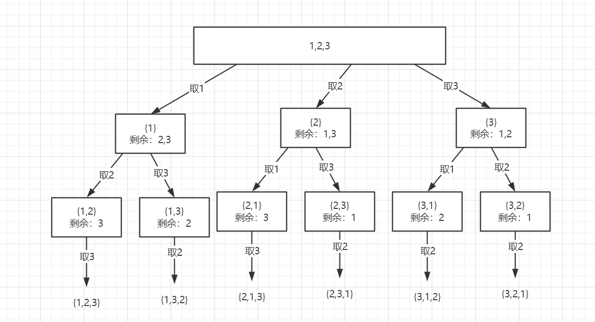

通过图片其实也可以看出与组合、子集的不同之处，首先在同一层的遍历当中，也就是for循环中，使用过的元素在后续的遍历还会使用到。

因此 for 循环不用在 从 `startIndex` 开始了，而是每次for循环都从0开始，重新遍历。但是还仍然有个问题，当我们重新遍历的时候，就有可能将元素重复放到 `path`集合中，因此我们还要判断集合中是否有这个元素。


**定义变量**

```java
    List<List<Integer>> res = new ArrayList<>();
    List<Integer> path = new ArrayList<>();
```


**终止条件**

由于是求序列的排列方式，因此元素个数肯定能是和原序列个数相等的

```java
        // 找到nums的排列方式,因此每一种排列方式元素个数肯定都是一样的。
        if (path.size() == nums.length) {
            res.add(new ArrayList<>(path));
            return;
        }
```

**返回值及参数**

全排列问题无需在使用 `startIndex`

```java
public void backtracking(int[] nums) {}
```


**单层递归逻辑**

for循环从0开始，并且将元素增加到 path 集合之前，先判断是否已经重复添加

```java
        for (int i = 0; i < nums.length; i++) {
            // 防止重复增加到集合中
            if (path.contains(nums[i])) continue;
            path.add(nums[i]);
            backtracking(nums);
            path.remove(path.size()-1);
        }
```


**完整代码**

```java
    List<List<Integer>> res = new ArrayList<>();
    List<Integer> path = new ArrayList<>();
    public List<List<Integer>> permute(int[] nums) {
        backtracking(nums);
        return res;
    }

    public void backtracking(int[] nums) {
        // 找到nums的排列方式,因此每一种排列方式元素个数肯定都是一样的。
        if (path.size() == nums.length) {
            res.add(new ArrayList<>(path));
            return;
        }
        for (int i = 0; i < nums.length; i++) {
            // 防止重复增加到集合中
            if (path.contains(nums[i])) continue;
            path.add(nums[i]);
            backtracking(nums);
            path.remove(path.size()-1);
        }
    }
```


## [47. 全排列 II](https://leetcode.cn/problems/permutations-ii/)

给定一个可包含重复数字的序列 `nums` ，***按任意顺序*** 返回所有不重复的全排列。


**示例 1：**

```
输入：nums = [1,1,2]
输出：
[[1,1,2],
 [1,2,1],
 [2,1,1]]
```

**示例 2：**

```
输入：nums = [1,2,3]
输出：[[1,2,3],[1,3,2],[2,1,3],[2,3,1],[3,1,2],[3,2,1]]
```


**提示：**

- `1 <= nums.length <= 8`
- `-10 <= nums[i] <= 10`

### 思路分析

该题相较于  [46. 全排列](https://leetcode.cn/problems/permutations/)多了一个去重的步骤，对于去重我们在 组合问题、子集问题已经遇见过了，但是对于全排列问题，没有 `startIndex `指针 并且也不能比较前后俩个元素（因为我们for循环从0开始，很容易造成重复添加）

因此我们可以使用一个 boolean 类型的数组来表示当前元素是否使用过，这里我用` used `表示。如果**当前元素和前一个元素相等，并且前一个元素已经被使用了，我们就跳过当前元素**。

**先给出代码:**

注意：去重问题均要先对数组进行排序，方便跳过重复元素！！

```java
    public List<List<Integer>> permuteUnique(int[] nums) {
        boolean[] used = new boolean[nums.length];
        Arrays.sort(nums);
        // Arrays.fill(used,false);
        backtracking(nums, used);
        return res;
    }

    List<List<Integer>> res = new ArrayList<>();
    List<Integer> path = new ArrayList<>();

    public void backtracking(int[] nums, boolean[] used) {
        if (path.size() == nums.length) {
            res.add(new ArrayList<>(path));
            return;
        }

        for (int i = 0; i < nums.length; i++) {
            // 这里的 used[i-1] == false 表示同一层上，num[i-1]被使用过，那么 nums[i]与之右相等，因此跳过nums[i]
            // 这里的 used[i-1] == true 表示同一树枝上，num[i-1]被使用过，在组合内是允许有重复元素的。
            if (i > 0 && nums[i - 1] == nums[i] && !used[i - 1]) continue;
            if (!used[i]) {
                path.add(nums[i]);
                used[i] = true;
                backtracking(nums, used);
                path.remove(path.size() - 1);
                used[i] = false;
            }
        }
```

这段代码也就是我们去重的代码，也是较为不好理解的代码。

```java
  if (i > 0 && nums[i - 1] == nums[i] && !used[i - 1]) continue;
```

**先抽象成二叉树为**：希望大家能有画图的习惯，对于回溯问题，画完图已经解决一半了。哈哈

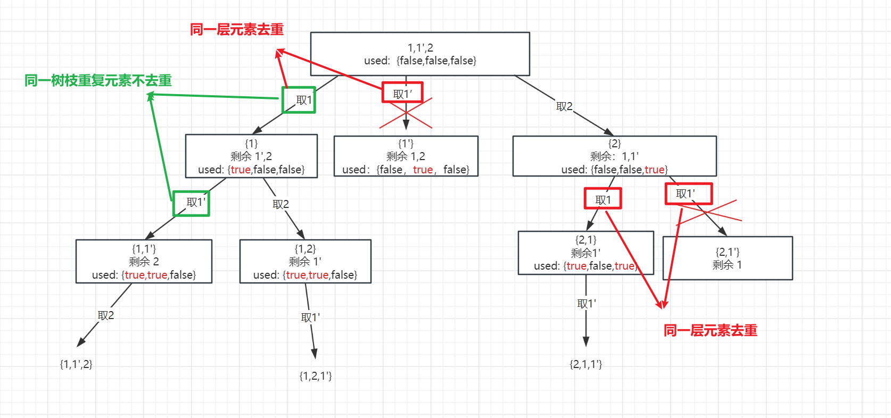

看了上面的图，可能大家会清晰不少，但是仍然可能会有一些疑问（至少我是有的，哈哈哈）：

- 判断前一个元素被使用过，难道不是 used[i-1] == true 吗？ 为什么会判断 used[i-1] == false 呢？

这是因为我们在回溯的过程中，其实是有步操作：` used[i] = false` ,  因此只有 `used[i-1] == false`, 才能表示 nums[i] 是由 num[i-1] 回溯而来，也就可以判断 nums[i-1] 已经被使用了！


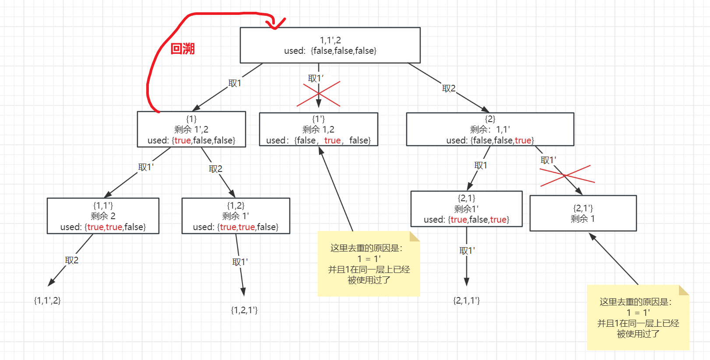

我们也可以认为 `used[i-1] == false` 才是对 同一层重复元素的判断

而 在递归之前，有步操作是` used[i] = true`，因此 `used[i-1] == true` 则是对同一树枝重复元素的判断，继续看一下张图：


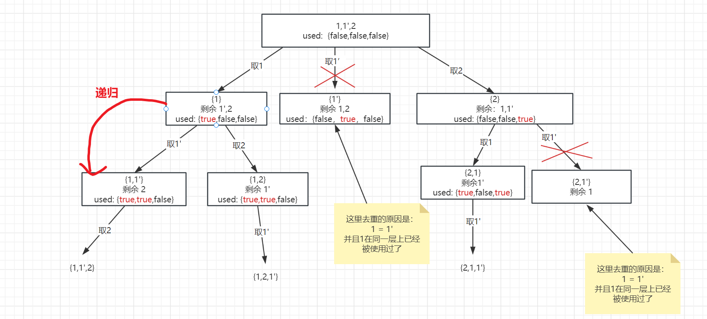

对于 "同一层" 不能有重复元素可以理解为：不能有重复的组合

对于 "同一树枝" 不能有重复元素可以理解为：集合内不能有重复的元素

## [332. 重新安排行程](https://leetcode.cn/problems/reconstruct-itinerary/)

给你一份航线列表 `tickets` ，其中 `tickets[i] = [fromi, toi]` 表示飞机出发和降落的机场地点。请你对该行程进行重新规划排序。

所有这些机票都属于一个从 `JFK`（肯尼迪国际机场）出发的先生，所以该行程必须从 `JFK` 开始。如果存在多种有效的行程，请你按字典排序返回最小的行程组合。

- 例如，行程 `["JFK", "LGA"]` 与 `["JFK", "LGB"]` 相比就更小，排序更靠前。

假定所有机票至少存在一种合理的行程。且所有的机票 必须都用一次 且 只能用一次。


**示例 1：**


```
输入：tickets = [["MUC","LHR"],["JFK","MUC"],["SFO","SJC"],["LHR","SFO"]]
输出：["JFK","MUC","LHR","SFO","SJC"]
```

**示例 2：**


```
输入：tickets = [["JFK","SFO"],["JFK","ATL"],["SFO","ATL"],["ATL","JFK"],["ATL","SFO"]]
输出：["JFK","ATL","JFK","SFO","ATL","SFO"]
解释：另一种有效的行程是 ["JFK","SFO","ATL","JFK","ATL","SFO"] ，但是它字典排序更大更靠后。
```


**提示：**

- `1 <= tickets.length <= 300`
- `tickets[i].length == 2`
- `fromi.length == 3`
- `toi.length == 3`
- `fromi` 和 `toi` 由大写英文字母组成
- `fromi != toi`


### 思路分析

从题目中可以得知，机票中可能含有重复的机票，因此我们仍然需要使用 一个 used 数组来进行标记使用过的机票。

并且如果能构成一个合理的行程，有以下的特点：

- 当前机票的起点必然是上一个机票的终点
- 一个合理的行程所经历的机场必然是机票数+1

**抽象成二叉树为**：

例子：[{JFK,KUL},{JFK,NRT},{NRT,JFK}]

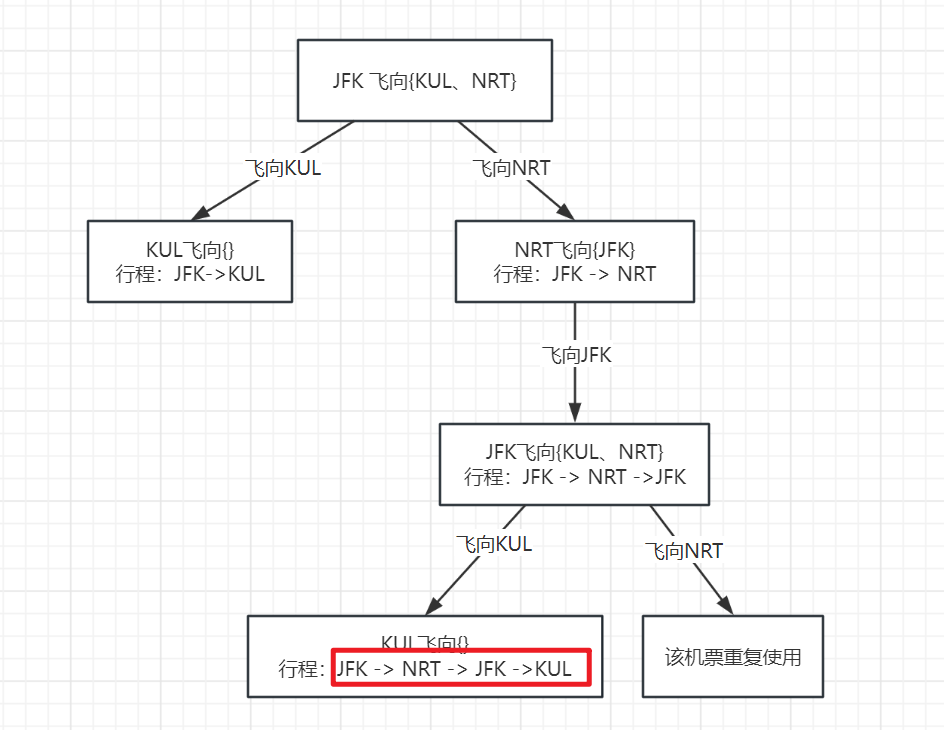

**定义变量**

path保存行程，所经历的机场，res保存最终的一个行程

```java
    private LinkedList<String> path = new LinkedList<>();
    private LinkedList<String> res;
```


**返回值及参数**

回溯一般没有返回值，但是对于该题来说，我们仅需要一种结果，找到即返回！

```java
 public boolean backtracking(List<List<String>> tickets, boolean[] used) {}
```

**终止条件**

经历的机场数 = 机票数 + 1

```java
        if (path.size() == tickets.size() + 1) {
            res = new LinkedList<>(path);
            return true;
        }
```


**单层递归逻辑**

判断逻辑其实和 全排列二 一样，判断当前机票的标志： used[i] == false 表示当前机票没有被使用过，并且要构成合理的行程，当前机票的起点必然是上一个机票的终点

```java
            if (!used[i] && tickets.get(i).get(0).equals(path.getLast())) {
                path.add(tickets.get(i).get(1));
                used[i] = true;
                // 找到一个合理的行程返回
                if (backtracking(tickets, used)) return true;
                // 回溯
                path.removeLast();
                used[i] = false;
            }
```

**剪枝**

```java
            // 进行剪枝，如果不加会超时
            // 如果当前航班和上一个航班相同，并且上一个航班没有使用过，说明是由上一个航班回溯来的。其实是已经使用过了，就跳过当前航班
            if (i > 0 && tickets.get(i).get(0).equals(tickets.get(i - 1).get(0))
                    && tickets.get(i).get(1).equals(tickets.get(i - 1).get(1)) && !used[i - 1]) continue;
```

**完整代码**

```java
 public List<String> findItinerary(List<List<String>> tickets) {
        // 对航班进行排序
        tickets.sort((a, b) -> a.get(1).compareTo(b.get(1)));
        path.add("JFK");
        backtracking(tickets, new boolean[tickets.size()]);
        return res;
    }

    private LinkedList<String> path = new LinkedList<>();
    private LinkedList<String> res;

    /**
     *  此处的回溯有返回值是因为我们只需要找到一种合理的行程返回即可。
     * */
    public boolean backtracking(List<List<String>> tickets, boolean[] used) {
        if (path.size() == tickets.size() + 1) {
            res = new LinkedList<>(path);
            return true;
        }

        // 遍历所有的航班
        for (int i = 0; i < tickets.size(); i++) {
            // 进行剪枝，如果不加会超时
            // 如果当前航班和上一个航班相同，并且上一个航班没有使用过，说明是由上一个航班回溯来的。其实是已经使用过了，就跳过当前航班
            if (i > 0 && tickets.get(i).get(0).equals(tickets.get(i - 1).get(0))
                    && tickets.get(i).get(1).equals(tickets.get(i - 1).get(1)) && !used[i - 1]) continue;
            // 先校验该航班是否已经飞过
            // 并且当前航班的起点必须是上一个航班的终点才能构成一个合理的行程
            if (!used[i] && tickets.get(i).get(0).equals(path.getLast())) {
                path.add(tickets.get(i).get(1));
                used[i] = true;
                // 找到一个合理的行程返回
                if (backtracking(tickets, used)) return true;
                // 回溯
                path.removeLast();
                used[i] = false;
            }
        }
        return false;
    }
```


## [51. N 皇后](https://leetcode.cn/problems/n-queens/)

按照国际象棋的规则，皇后可以攻击与之处在同一行或同一列或同一斜线上的棋子。

**n 皇后问题** 研究的是如何将 `n` 个皇后放置在 `n×n` 的棋盘上，并且使皇后彼此之间不能相互攻击。

给你一个整数 `n` ，返回所有不同的 **n 皇后问题** 的解决方案。

每一种解法包含一个不同的 **n 皇后问题** 的棋子放置方案，该方案中 `'Q'` 和 `'.'` 分别代表了皇后和空位。


**示例 1：**


```
输入：n = 4
输出：[[".Q..","...Q","Q...","..Q."],["..Q.","Q...","...Q",".Q.."]]
解释：如上图所示，4 皇后问题存在两个不同的解法。
```

**示例 2：**

```
输入：n = 1
输出：[["Q"]]
```


**提示：**

- `1 <= n <= 9`

### 思路分析

通过题目可以知道，对于N皇后的约束条件：

- 不能同行
- 不能同列
- 不能同一斜线

对于N皇后问题，我们同样可以抽象成二叉树：


棋盘的深度(行)决定了递归的深度，而宽度(列)决定了for循环的长度。

利用上面那三个约束条件，不断的递归、回溯找到每个皇后的位置。

**返回值及参数**

row表示当前处理的是第几行，chessboard 用来表示棋盘

```java
public void backtracking(int row,  int n,char[][] chessboard ) {}
```


**终止条件**

当处理完最后一行时，则表名所有皇后均放置完毕

```java
        // 一行放入一个皇后，如果遍历的行数等于皇后数说明已经放置完毕
        if (row == n) {
            res.add(newArrayList(chessboard));
            return;
        }
```

**单层递归逻辑**

每次放置皇后前，要与其他皇后校验是否冲突，不冲突则放入棋盘内，冲突则换下一列

```java
        for (int col = 0; col < n; col++) {
            // 检查放入的位置是否冲突
            if (!isValid(row,col,chessboard,n)) {
                chessboard[row][col] = 'Q';
                backtracking(row+1,n,chessboard);
                chessboard[row][col] = '.'; // 回溯
            }
        }
```


**检验冲突**

```java
    // 判断当前位置[row][col] 是否有冲突
    private boolean isValid(int row, int col, char[][] chessboard, int n) {
        // 检查同一列是否冲突
        for (int i = 0; i < row; i++) {
            if (chessboard[i][col] == 'Q') return true;
        }
        // 检查45度是否有冲突,当前位置的左上方
        for (int i = row -1 ,j = col -1; i >= 0 && j >=0; i--,j--) {
            if (chessboard[i][j] == 'Q') return true;
        }
        // 检查135度方向是否有冲突，当前位置的右上方
        for (int i = row -1,j = col+1; i >= 0 && j < n; i--,j++) {
            if (chessboard[i][j] == 'Q') return true;
        }

        return false;
    }
```


**完整代码**

```java
  public List<List<String>> solveNQueens(int n) {
        char[][] chessboard = new char[n][n];
        for (char[] strings : chessboard) {
            Arrays.fill(strings,'.');
        }
        backtracking(0,n,chessboard);
        return res;

    }
    List<List<String>> res =new ArrayList<>();
    /**
     * @description
     * @date 2023/12/11 23:01
     * @param row 遍历的行数
     * @param n  皇后数量
     * @param chessboard  棋盘
     * @return void
     */
    public void backtracking(int row,  int n,char[][] chessboard ) {
        // 一行放入一个皇后，如果遍历的行数等于皇后数说明已经放置完毕
        if (row == n) {
            res.add(newArrayList(chessboard));
            return;
        }
        for (int col = 0; col < n; col++) {
            // 检查放入的位置是否冲突
            if (!isValid(row,col,chessboard,n)) {
                chessboard[row][col] = 'Q';
                backtracking(row+1,n,chessboard);
                chessboard[row][col] = '.'; // 回溯
            }
        }
    }

    private List<String> newArrayList(char[][] chessboard) {
        ArrayList<String> list = new ArrayList<>();
        for (char[] strings : chessboard) {
            list.add(String.copyValueOf(strings));
        }
        return list;
    }

    // 判断当前位置[row][col] 是否有冲突
    private boolean isValid(int row, int col, char[][] chessboard, int n) {
        // 检查同一列是否冲突
        for (int i = 0; i < row; i++) {
            if (chessboard[i][col] == 'Q') return true;
        }
        // 检查45度是否有冲突,当前位置的左上方
        for (int i = row -1 ,j = col -1; i >= 0 && j >=0; i--,j--) {
            if (chessboard[i][j] == 'Q') return true;
        }
        // 检查135度方向是否有冲突，当前位置的右上方
        for (int i = row -1,j = col+1; i >= 0 && j < n; i--,j++) {
            if (chessboard[i][j] == 'Q') return true;
        }

        return false;
    }
```


## [37. 解数独](https://leetcode.cn/problems/sudoku-solver/)

编写一个程序，通过填充空格来解决数独问题。

数独的解法需 **遵循如下规则**：

1. 数字 `1-9` 在每一行只能出现一次。
2. 数字 `1-9` 在每一列只能出现一次。
3. 数字 `1-9` 在每一个以粗实线分隔的 `3x3` 宫内只能出现一次。（请参考示例图）

数独部分空格内已填入了数字，空白格用 `'.'` 表示。


**示例 1：**


```
输入：board = [["5","3",".",".","7",".",".",".","."],["6",".",".","1","9","5",".",".","."],[".","9","8",".",".",".",".","6","."],["8",".",".",".","6",".",".",".","3"],["4",".",".","8",".","3",".",".","1"],["7",".",".",".","2",".",".",".","6"],[".","6",".",".",".",".","2","8","."],[".",".",".","4","1","9",".",".","5"],[".",".",".",".","8",".",".","7","9"]]
输出：[["5","3","4","6","7","8","9","1","2"],["6","7","2","1","9","5","3","4","8"],["1","9","8","3","4","2","5","6","7"],["8","5","9","7","6","1","4","2","3"],["4","2","6","8","5","3","7","9","1"],["7","1","3","9","2","4","8","5","6"],["9","6","1","5","3","7","2","8","4"],["2","8","7","4","1","9","6","3","5"],["3","4","5","2","8","6","1","7","9"]]
解释：输入的数独如上图所示，唯一有效的解决方案如下所示：
```


**提示：**

- `board.length == 9`
- `board[i].length == 9`
- `board[i][j]` 是一位数字或者 `'.'`
- 题目数据 **保证** 输入数独仅有一个解


### 思路分析

该题与N皇后的区别就是：

N皇后是每一行只填充一个数，对于数独来说，所有的行和列都要填充。因此我们要用双层 for 循环遍历所有的行 和 列。

**返回值及参数**

返回值仍然为boolean类型，找到一种填充结果就返回

```java
public boolean backtracking(char[][] board) {}
```

**终止条件**

对于该题来说没有终止条件，遍历完所有的行和列就算完成递归。

**单层递归逻辑**

使用双层 for  循环遍历所有的行和列，逐个对 1~9个数字进行校验是否冲突并填入。

而当 这9个数字都试过来之后，仍然没有填充结果，就返回 false，这也是没有终止条件而不陷入无线循环的原因。

```java
        for (int row = 0; row < board.length; row++) {
            for (int col = 0; col < board[col].length; col++) {
                if (board[row][col] == '.') continue;
                for (char k = '1'; k <= '9';k++){// 遍历1~9个数，逐渐增加到board中
                    if (!isValid(row,col,k,board)){
                        board[row][col] = k;
                        if (backtracking(board)) return true;
                        board[row][col] = '.'; // 回溯
                    }
                }
                // 若9个数都试完了，都不行，就返回false
                return false;
            }
        }
```

**校验冲突**

同一行、同一列、3*3方格内均不能有重复的数字

```java
private boolean isValid(int row, int col, char k, char[][] board) {
        // 判断行
        for (int i = 0; i < row; i++) {
            if (board[i][col] == k) return true;
        }
        // 判断列
        for (int i = 0; i < row; i++) {
            if (board[row][i] == k) return true;
        }
        // 判断3*3方格内
        int startRow = (row / 3) * 3; // 起始行
        int startCol = (col / 3) * 3; // 起始列

        for (int i = startRow; i < startRow+3; i++) {
            for (int j = startCol; j < startCol + 3; j++) {
                if (board[i][j] == 'k') return true;
            }
        }
        return false;
    }
```


**完整代码**

```java
class Solution {
  public void solveSudoku(char[][] board) {
        backtracking(board);
    }
    public boolean backtracking(char[][] board) {
        // 由于我们需要遍历board所有位置，遍历完意味着结束递归，因此不需要返回值
        // row表示行 col表示列,遍历完即结束递归
        for (int row = 0; row < 9; row++) {
            for (int col = 0; col < 9; col++) {
                // 当前位置已有数字，跳过当前循环
                if (board[row][col] != '.') continue;
                for (char k = '1'; k <= '9';k++){// 遍历1~9个数，逐渐增加到board中
                    if (!isValid(row,col,k,board)){
                        board[row][col] = k;
                        if (backtracking(board)) return true;
                        board[row][col] = '.'; // 回溯
                    }
                }
                // 若9个数都试完了，都不行，就返回false
                return false;
            }
        }
        return true;
    }
    // 判断是否冲突
    private boolean isValid(int row, int col, char k, char[][] board) {
        // 判断行
        for (int i = 0; i < 9; i++) {
            if (board[row][i] == k) return true;
        }
        // 判断列
        for (int i = 0; i < 9; i++) {
            if (board[i][col] == k) return true;
        }
        // 判断3*3方格内
        int startRow = (row / 3) * 3; // 起始行
        int startCol = (col / 3) * 3; // 起始列

        for (int i = startRow; i < startRow+3; i++) {
            for (int j = startCol; j < startCol + 3; j++) {
                if (board[i][j] == k) return true;
            }
        }
        return false;
    }
}
```


## 总结

**回溯是递归的副产品，只要有递归就会有回溯，递归之前做了什么，递归之后就做相反的操作**，所以回溯法也经常和二叉树遍历，深度优先搜索混在一起，因为这两种方式都是用了递归。

回溯算法并不是什么高效的算法，就相当于是暴力搜索，最多在剪枝一下。

**对于回溯类型的题目：**

- 组合问题：N个数里面按一定规则找出k个数的集合
- 排列问题：N个数按一定规则全排列，有几种排列方式
- 切割问题：一个字符串按一定规则有几种切割方式
- 子集问题：一个N个数的集合里有多少符合条件的子集
- 棋盘问题：N皇后，解数独等等

**而对于以上的问题，经常遇到的去重问题**：

- 对于去重问题，能先排序就先排序，然后利用前后元素比较进行去重，比如：组合II，子集II
- 而对于全排列问题和递增子序列问题，没有办法进行排序，就可以考虑使用一种数据结构进行标记。如比：used数组、set集合

