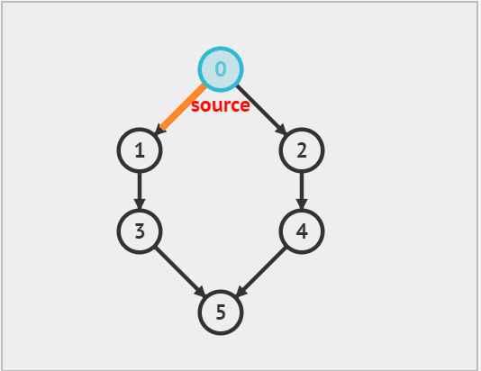
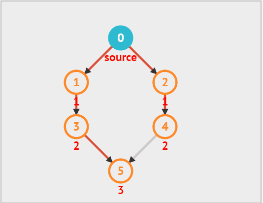

# 图论

## dfs 和 bfs 的区别

深度优先遍历(dfs): 顺着一个方向遍历，就像是不到黄河不回头，直到没有元素了，再换另一个方向继续遍历。

广度优先遍历(bfs): 先遍历与本节点连接的所有节点，然后在遍历与下一个节点相连接的所有节点

其实**dfs就是回溯**，当遍历到头时，就需要回溯换另一个方向继续遍历。在二叉树中的递归遍历其实就是 dfs，而迭代遍历就是 bfs。


**下面通过俩张动图，体会一下dfs和bfs的区别**：

**dfs**：



从上面的动态图中可以看出，每次向下搜索都是递归的过程，而 '换方向' 拿图中来说，从 5 换到了 2 就是回溯的过程，因此递归 和回溯 是相辅相成的。

**再来回顾一下回溯算法的代码模板**：

在回溯章节中，已经练习了大量的回溯算法，一般情况，深搜需要 二维数组数组结构保存所有路径，需要一维数组保存单一路径，这种保存结果的数组，我们可以定义一个全局变量，避免让我们的函数参数过多。


```java
List<List<String>> res = new ArrayList<>();
List<String> path = new ArrayList<>();

void dfs(参数){
	if (终止条件){
		存放结果;
		return;
	}
	for (选择：本节点所连接的其他节点) {
    处理节点;
    dfs(图，选择的节点); // 递归
    回溯，撤销处理结果
}
}
```


**bfs**:

BFS是一圈一圈的搜索过程，但具体是怎么一圈一圈来搜呢。

从某一个节点开始，先将该节点的`上下左右`四个方向的节点搜索出来，然后继续遍历下一个节点。



通常在 bfs 中需要使用一个容器来保存节点用来遍历。这个容器可以使用`栈、队列、数组`。

在这里我使用队列，这样遍历不用考虑遍历顺序的问题。用栈的话还要考虑先进后出的顺序。

除了容器之外，还需要一个 `数组 用来记录当前节点是否被访问`过，在 dfs 中不需要是因为在搜索的过程中，每个节点在被访问时就被标记为已访问，而在回溯时会将标记清除，这样每个节点都只会被访问一次

总结起来，bfs做的步骤就是：入队 - 标记 - 出队 - 入队 - 标记.....


## [797. 所有可能的路径](https://leetcode.cn/problems/all-paths-from-source-to-target/)

给你一个有 `n` 个节点的 **有向无环图（DAG）**，请你找出所有从节点 `0` 到节点 `n-1` 的路径并输出（**不要求按特定顺序**）

`graph[i]` 是一个从节点 `i` 可以访问的所有节点的列表（即从节点 `i` 到节点 `graph[i][j]`存在一条有向边）。


**示例 1：**


```
输入：graph = [[1,2],[3],[3],[]]
输出：[[0,1,3],[0,2,3]]
解释：有两条路径 0 -> 1 -> 3 和 0 -> 2 -> 3
```

**示例 2：**


```
输入：graph = [[4,3,1],[3,2,4],[3],[4],[]]
输出：[[0,4],[0,3,4],[0,1,3,4],[0,1,2,3,4],[0,1,4]]
```


**提示：**

- `n == graph.length`
- `2 <= n <= 15`
- `0 <= graph[i][j] < n`
- `graph[i][j] != i`（即不存在自环）
- `graph[i]` 中的所有元素 **互不相同**
- 保证输入为 **有向无环图（DAG）**


### 思路分析

**dfs版本**

在上面已经说过了，dfs就可以看做是回溯算法！因此我们直接套用回溯算法模板！

首先定义俩个集合，一个保存每一条路径，一个保存所有的路径

```java
List<List<Integer>> allPath = new ArrayList<>();
List<Integer> path = new ArrayList<>();
```

**确定返回值及参数**

```java
void dfs(graph,node)
```


**终止条件**

当前遍历的节点值等于图中最后一个元素值，就说明找到一条路径

```java
if (node == graph.length()-1){
	allPath.add(path)
	return
}
```


**单层递归逻辑**

当前结点为 node，那么要找到与node相连接的下一个节点，则 graph\[node] 就是与node所有相连的节点列表。

逐个将它加到path集合中，并往下递归，递归之后要进行回溯。每一次递归结束说明找到了一条路径。因此要回溯到上一个结点继续搜索

```java
        // graph[node] 表示所有与node相连的节点列表
        for (int i = 0; i < graph[node].length; i++) {
            path.add(graph[node][i]);
            dfs(graph,graph[node][i]); // 递归，继续找与graph[node][i]相连的节点
            // 回溯：递归之前做了什么递归之后就要回溯
            path.remove(path.size()-1);
        }
```


**完整代码**

```java
class Solution {
     List<List<Integer>> allPath = new ArrayList<>();
    List<Integer> path = new ArrayList<>();
    public List<List<Integer>> allPathsSourceTarget(int[][] graph) {
         path.add(0); // 不要忘记将0结点加入到路径当中
        dfs(graph,0);
        return allPath;
    }
    void dfs(int[][] graph,int node){
        if (node == graph.length-1) {
            // 说明找到了一条路径
            allPath.add(new ArrayList(path));
            return;
        }
        // graph[node] 表示所有与node相连的节点列表
        for (int i = 0; i < graph[node].length; i++) {
            path.add(graph[node][i]);
            dfs(graph,graph[node][i]); // 递归，继续找与graph[node][i]相连的节点
            // 回溯：递归之前做了什么递归之后就要回溯
            path.remove(path.size()-1);
        }
    }
}
```


## [200. 岛屿数量](https://leetcode.cn/problems/number-of-islands/)

给你一个由 `'1'`（陆地）和 `'0'`（水）组成的的二维网格，请你计算网格中岛屿的数量。

岛屿总是被水包围，并且每座岛屿只能由水平方向和/或竖直方向上相邻的陆地连接形成。

此外，你可以假设该网格的四条边均被水包围。


**示例 1：**

```
输入：grid = [
  ["1","1","1","1","0"],
  ["1","1","0","1","0"],
  ["1","1","0","0","0"],
  ["0","0","0","0","0"]
]
输出：1
```

**示例 2：**

```
输入：grid = [
  ["1","1","0","0","0"],
  ["1","1","0","0","0"],
  ["0","0","1","0","0"],
  ["0","0","0","1","1"]
]
输出：3
```


**提示：**

- `m == grid.length`
- `n == grid[i].length`
- `1 <= m, n <= 300`
- `grid[i][j]` 的值为 `'0'` 或 `'1'`


### 思路分析

**dfs**

遍历数组，如果当前值为1，将岛屿数量+1，并且进入到 感染函数里。

**感染函数**：其实就是一个递归标注的过程，它会将所有相连的1都标注成2。为什么要标注？这样就避免了遍历过程中的重复计数的情况，一个岛所有的1都变成了2后，遍历的时候就不会重复遍历了。

```java
class Solution {
    public int numIslands(char[][] grid) {
        int landNums = 0; // 岛屿数量
        for (int i = 0; i < grid.length; i++) {
            for (int j = 0; j < grid[i].length; j++) {
                if (grid[i][j] == '1') {
                    landNums++;
                    infect(grid, i, j);
                }
            }
        }
        return landNums;
    }

    // 感染函数，目的就是将相连的岛屿进行标记，避免重复计算
    private void infect(char[][] grid, int i, int j) {
        if (i < 0 || i >= grid.length ||
                j < 0 || j >= grid[0].length || grid[i][j] != '1') {
            return;
        }
        // 标记当前陆地
        grid[i][j] = '2';
        infect(grid, i + 1, j);
        infect(grid, i - 1, j);
        infect(grid, i, j + 1);
        infect(grid, i, j - 1);
    }
}
```


**bfs**

```java
    public int numIslandsBFS(char[][] grid) {
        int landNums = 0; // 岛屿数量
        visited = new boolean[grid.length][grid[0].length];

        for (int i = 0; i < grid.length; i++) {
            for (int j = 0; j < grid[i].length; j++) {
                if (grid[i][j] == '1' && !visited[i][j]) {
                    landNums++;
                    infectBFS(grid, i, j);
                }
            }
        }
        return landNums;
    }

    // 标记是否被访问
    boolean[][] visited;
    // 上下左右四个方向
    int[][] move = {{0, 1}, {0, -1}, {1, 0}, {-1, 0}};

    // bfs 感染函数
    public void infectBFS(char[][] grid, int i, int j) {
        Queue<int[]> queue = new ArrayDeque<>();
        // 入队
        queue.offer(new int[]{i, j});
        // 标记
        visited[i][j] = true;

        while(!queue.isEmpty()) {
            // 出队
            int[] poll = queue.poll();
            int x = poll[0];
            int y = poll[1];
            // 向四个方向移动
            for (int k = 0; k < 4; k++) {
                int nextX = x + move[k][0];
                int nextY = y + move[k][1];
                // 下标越界，跳过
                if (nextX < 0 || nextX >= grid.length || nextY <0 || nextY >= grid[0].length) continue;
                if (!visited[nextX][nextY] && grid[nextX][nextY] == '1') {
                    queue.offer(new int[]{nextX, nextY});
                    visited[nextX][nextY] = true;
                }
            }
        }
    }
```


## [695. 岛屿的最大面积](https://leetcode.cn/problems/max-area-of-island/)

给你一个大小为 `m x n` 的二进制矩阵 `grid` 。

**岛屿** 是由一些相邻的 `1` (代表土地) 构成的组合，这里的「相邻」要求两个 `1` 必须在 **水平或者竖直的四个方向上** 相邻。你可以假设 `grid` 的四个边缘都被 `0`（代表水）包围着。

岛屿的面积是岛上值为 `1` 的单元格的数目。

计算并返回 `grid` 中最大的岛屿面积。如果没有岛屿，则返回面积为 `0` 。


**示例 1：**


```
输入：grid = [[0,0,1,0,0,0,0,1,0,0,0,0,0],[0,0,0,0,0,0,0,1,1,1,0,0,0],[0,1,1,0,1,0,0,0,0,0,0,0,0],[0,1,0,0,1,1,0,0,1,0,1,0,0],[0,1,0,0,1,1,0,0,1,1,1,0,0],[0,0,0,0,0,0,0,0,0,0,1,0,0],[0,0,0,0,0,0,0,1,1,1,0,0,0],[0,0,0,0,0,0,0,1,1,0,0,0,0]]
输出：6
解释：答案不应该是 11 ，因为岛屿只能包含水平或垂直这四个方向上的 1 。
```

**示例 2：**

```
输入：grid = [[0,0,0,0,0,0,0,0]]
输出：0
```


**提示：**

- `m == grid.length`
- `n == grid[i].length`
- `1 <= m, n <= 50`
- `grid[i][j]` 为 `0` 或 `1`

### 思路分析

和[200. 岛屿数量](https://leetcode.cn/problems/number-of-islands/)一样，只不过在每次 "感染"  陆地时，记录一下陆地的数量。

**dfs**

```java
    int area = 0;
    public int maxAreaOfIsland(int[][] grid) {
        int maxArea = 0;
        for (int i = 0; i < grid.length; i++) {
            for (int j = 0; j < grid[i].length; j++) {
                if (grid[i][j] == 1) {
                    // 记录每块陆地的面积
                    area = 0;
                    infect(grid,i,j);
                    // 记录最大面积
                    maxArea = Math.max(maxArea,area);
                }
            }
        }
        return maxArea;
    }
    // dfs 感染函数: 将每块陆地 "感染"，避免重复计算
    public void infect(int[][] grid, int x, int y) {
        if (x < 0 || y < 0 || x >= grid.length || y >= grid[x].length || grid[x][y] != 1) return;
        grid[x][y] = 2;
        area++; // 将当前陆地的面积+1
        infect(grid, x + 1, y);
        infect(grid, x - 1, y);
        infect(grid, x, y - 1);
        infect(grid, x, y + 1);
    }
```


**bfs**

```java
    boolean[][] visited;
    int[][] move = {{0, 1}, {0, -1}, {1, 0}, {-1, 0}};
     int area = 0;
    public int maxAreaOfIslandBFS(int[][] grid) {
        visited = new boolean[grid.length][grid[0].length];
        int maxArea = 0;
        for (int i = 0; i < grid.length; i++) {
            for (int j = 0; j < grid[i].length; j++) {
                if (grid[i][j] == 1 && !visited[i][j]) {
                    area = 0;
                    infectBFS(grid,i,j);
                    // 记录最大面积
                    maxArea = Math.max(maxArea,area);
                }
            }
        }
        return maxArea;
    }
        // bfs
    public void infectBFS(int[][] grid, int x, int y) {
        Queue<int[]> queue = new ArrayDeque<>();
        queue.offer(new int[]{x,y});
        visited[x][y] = true;
        area++;
        while(!queue.isEmpty()) {
            int[] poll = queue.poll();
            int i = poll[0];
            int j = poll[1];
            for (int k = 0; k < 4; k++) {
                int nextX = i + move[k][0];
                int nextY = j + move[k][1];
                if (nextX < 0 || nextY < 0 || nextX > grid.length || nextY >= grid[0].length ) continue;

                if (!visited[nextX][nextY] && grid[nextX][nextY] == 1) {
                    area++;
                    queue.offer(new int[]{nextX, nextY});
                    visited[nextX][nextY] = true;
                }
            }
        }
    }
```


## [1020. 飞地的数量](https://leetcode.cn/problems/number-of-enclaves/)

给你一个大小为 `m x n` 的二进制矩阵 `grid` ，其中 `0` 表示一个海洋单元格、`1` 表示一个陆地单元格。

一次 **移动** 是指从一个陆地单元格走到另一个相邻（**上、下、左、右**）的陆地单元格或跨过 `grid` 的边界。

返回网格中 **无法** 在任意次数的移动中离开网格边界的陆地单元格的数量。


**示例 1：**


```
输入：grid = [[0,0,0,0],[1,0,1,0],[0,1,1,0],[0,0,0,0]]
输出：3
解释：有三个 1 被 0 包围。一个 1 没有被包围，因为它在边界上。
```

**示例 2：**


```
输入：grid = [[0,1,1,0],[0,0,1,0],[0,0,1,0],[0,0,0,0]]
输出：0
解释：所有 1 都在边界上或可以到达边界。
```


**提示：**

- `m == grid.length`
- `n == grid[i].length`
- `1 <= m, n <= 500`
- `grid[i][j]` 的值为 `0` 或 `1`


### 思路分析

题目要求不与边界相连的陆地单元格的数量，那么我们应该利用 "感染" 函数将边界陆地都 "感染" 为海洋，然后在统计陆地单元格的数量

**dfs**

```java
class Solution {
    public int numEnclaves(int[][] grid) {
        int rowLength = grid.length;
        int colLength = grid[0].length;

        for (int i = 0; i < rowLength; i++) {
            for (int j = 0; j < colLength; j++) {
                // 将靠近边界的陆地都变成海洋
                if ((i == 0 || j == 0 || i == rowLength - 1 || j == colLength - 1) && grid[i][j] == 1)
                    infect(grid, i, j);
            }
        }
        int landNums = 0;
        // 统计陆地单元格的数量
        for (int i = 0; i < rowLength; i++) {
            for (int j = 0; j < colLength; j++) {
                    if (grid[i][j] == 1) landNums++;
            }
        }
        return landNums;
    }

    // 感染函数
    public void infect(int[][] grid, int x, int y) {
        if (x < 0 || y < 0 || x >= grid.length || y >= grid[x].length || grid[x][y] == 0) return;
        // 将陆地变成海洋
        grid[x][y] = 0;

        infect(grid, x - 1, y);
        infect(grid, x + 1, y);
        infect(grid, x, y - 1);
        infect(grid, x, y + 1);
    }
}
```


**bfs**

这道题无需使用 visited 数组，不关心他是否重复访问，只要将边界的陆地变为海洋即可。

```java
class Solution {
    int[][] move  = {{0,1},{0,-1},{1,0},{-1,0}};

    public int numEnclaves(int[][] grid) {
       int rowLength = grid.length;
        int colLength = grid[0].length;

        for (int i = 0; i < rowLength; i++) {
            for (int j = 0; j < colLength; j++) {
                // 将靠近边界的陆地都变成海洋
                if ((i == 0 || j == 0 || i == rowLength - 1 || j == colLength - 1) && grid[i][j] == 1 )
                    infectBFS(grid, i, j);
            }
        }
        int landNums = 0;
        // 统计陆地单元格的数量
        for (int i = 0; i < rowLength; i++) {
            for (int j = 0; j < colLength; j++) {
                if (grid[i][j] == 1) landNums ++;
            }
        }
        return landNums;
    }

        public void infectBFS(int[][] grid, int x, int y){
        Queue<int[]> queue = new ArrayDeque<>();

        queue.offer(new int[]{x,y});
        grid[x][y] = 0;

        while(!queue.isEmpty()) {
            int[] poll = queue.poll();
            int m = poll[0];
            int n = poll[1];
            // 遍历四个方向
            for (int i = 0; i < 4; i++) {
                int nextX = m + move[i][0];
                int nextY = n + move[i][1];

                if (nextX < 0 || nextY < 0 || nextX >= grid.length || nextY >= grid[nextX].length ) continue;
                
                if (grid[nextX][nextY] == 1) {
                    queue.offer(new int[]{nextX,nextY});
                     grid[nextX][nextY] = 0;
                }
            }

        }
    }
}
```


## [130. 被围绕的区域](https://leetcode.cn/problems/surrounded-regions/)

给你一个 `m x n` 的矩阵 `board` ，由若干字符 `'X'` 和 `'O'` ，找到所有被 `'X'` 围绕的区域，并将这些区域里所有的 `'O'` 用 `'X'` 填充。


**示例 1：**


```
输入：board = [["X","X","X","X"],["X","O","O","X"],["X","X","O","X"],["X","O","X","X"]]
输出：[["X","X","X","X"],["X","X","X","X"],["X","X","X","X"],["X","O","X","X"]]
解释：被围绕的区间不会存在于边界上，换句话说，任何边界上的 'O' 都不会被填充为 'X'。 任何不在边界上，或不与边界上的 'O' 相连的 'O' 最终都会被填充为 'X'。如果两个元素在水平或垂直方向相邻，则称它们是“相连”的。
```

**示例 2：**

```
输入：board = [["X"]]
输出：[["X"]]
```


**提示：**

- `m == board.length`
- `n == board[i].length`
- `1 <= m, n <= 200`
- `board[i][j]` 为 `'X'` 或 `'O'`


### 思路分析

和 [1020. 飞地的数量](https://leetcode.cn/problems/number-of-enclaves/) 思路一样，先将与边界相连的陆地，也就是O变成另外一个字符，比如我变成 A。遍历数组，将O变成X，将A变成O

**dfs**

```java
class Solution {
    public void solve(char[][] board) {
        int rowLength = board.length;
        int colLength = board[0].length;

        for (int i = 0; i < rowLength; i++) {
            for (int j = 0; j < colLength; j++) {
                // 将靠近边界的O都改为A
                if ((i == 0 || j == 0 || i == rowLength - 1 || j == colLength - 1) && (board[i][j] == 'O') )
                    infect(board, i, j);
            }
        }

        // 将图中的O改为X，A改为A
        for (int i = 0; i < rowLength; i++) {
            for (int j = 0; j < colLength; j++) {
                if (board[i][j] == 'O')
                    board[i][j] = 'X';

                if (board[i][j] == 'A')
                    board[i][j] = 'O';
            }
        }
    }

    // 感染函数
    public void infect(char[][] board, int x, int y) {
        if (x < 0 || y < 0 || x >= board.length || y >= board[x].length || board[x][y] == 'A' ||board[x][y] == 'X' ) return;
        board[x][y] = 'A';

        infect(board, x - 1, y);
        infect(board, x + 1, y);
        infect(board, x, y - 1);
        infect(board, x, y + 1);
    }
}
```


**bfs**

```java
class Solution {
    int[][] move  = {{0,1},{0,-1},{1,0},{-1,0}};

    public void solve(char[][] board) {
        int rowLength = board.length;
        int colLength = board[0].length;

        for (int i = 0; i < rowLength; i++) {
            for (int j = 0; j < colLength; j++) {
                // 将靠近边界的O都改为A
                if ((i == 0 || j == 0 || i == rowLength - 1 || j == colLength - 1) && board[i][j] == 'O')
                    infectBFS(board, i, j);
            }
        }
        // 将图中的O改为X，A改为A
        for (int i = 0; i < rowLength; i++) {
            for (int j = 0; j < colLength; j++) {
                if (board[i][j] == 'O')
                    board[i][j] = 'X';

                if (board[i][j] == 'A')
                    board[i][j] = 'O';
            }
        }
    }

        public void infectBFS(char[][] board, int x, int y){
        Queue<int[]> queue = new ArrayDeque<>();

        queue.offer(new int[]{x,y});
        board[x][y] = 'A';


        while(!queue.isEmpty()) {
            int[] poll = queue.poll();
            int m = poll[0];
            int n = poll[1];
            // 遍历四个方向
            for (int i = 0; i < 4; i++) {
                int nextX = m + move[i][0];
                int nextY = n + move[i][1];

                if (nextX < 0 || nextY < 0 || nextX >= board.length || nextY >= board[nextX].length || board[nextX][nextY] == 'X') continue;

                if ( board[nextX][nextY] == 'O' ) {
                    queue.offer(new int[]{nextX,nextY});
                    board[nextX][nextY] = 'A';
                }
            }
        }
    }
}
```


## [417. 太平洋大西洋水流问题](https://leetcode.cn/problems/pacific-atlantic-water-flow/)

有一个 `m × n` 的矩形岛屿，与 **太平洋** 和 **大西洋** 相邻。 **“太平洋”** 处于大陆的左边界和上边界，而 **“大西洋”** 处于大陆的右边界和下边界。

这个岛被分割成一个由若干方形单元格组成的网格。给定一个 `m x n` 的整数矩阵 `heights` ， `heights[r][c]` 表示坐标 `(r, c)` 上单元格 **高于海平面的高度** 。

岛上雨水较多，如果相邻单元格的高度 **小于或等于** 当前单元格的高度，雨水可以直接向北、南、东、西流向相邻单元格。水可以从海洋附近的任何单元格流入海洋。

返回网格坐标 `result` 的 **2D 列表** ，其中 `result[i] = [ri, ci]` 表示雨水从单元格 `(ri, ci)` 流动 **既可流向太平洋也可流向大西洋** 。


**示例 1：**


```
输入: heights = [[1,2,2,3,5],[3,2,3,4,4],[2,4,5,3,1],[6,7,1,4,5],[5,1,1,2,4]]
输出: [[0,4],[1,3],[1,4],[2,2],[3,0],[3,1],[4,0]]
```

**示例 2：**

```
输入: heights = [[2,1],[1,2]]
输出: [[0,0],[0,1],[1,0],[1,1]]
```


**提示：**

- `m == heights.length`
- `n == heights[r].length`
- `1 <= m, n <= 200`
- `0 <= heights[r][c] <= 105`


### 思路分

该题目求：大西洋和太平洋都能够到达的坐标

我们可以逆向分析，先从太平洋出发找到能够到达的坐标，将其标记，然后再从大西洋出发找到能够到达的坐标，将其标记。

同时被标记的就是都能够到达的坐标

**dfs**

```java
class Solution {
    int[][] move = {{-1, 0}, {1, 0}, {0, -1}, {0, 1}};
    int rowLength, colLength;

    public List<List<Integer>> pacificAtlantic(int[][] heights) {
        List<List<Integer>> res = new ArrayList<>();
        rowLength = heights.length;
        colLength = heights[0].length;

        // 保存太平洋可以到达的地点
        boolean[][] pacific = new boolean[rowLength][colLength];
        // 保存大西洋可以到达的地点
        boolean[][] atlantic = new boolean[rowLength][colLength];

        for (int i = 0; i < rowLength; i++) {
            infect(heights, i, 0, pacific); // 左边界
            infect(heights, i, colLength - 1, atlantic);// 右边界
        }

        for (int i = 0; i < colLength; i++) {
            infect(heights, 0, i, pacific); // 上边界
            infect(heights, rowLength - 1, i, atlantic); // 下边界
        }
        


        for (int i = 0; i < rowLength; i++) {
            for (int j = 0; j < colLength; j++) {
                if (atlantic[i][j] && pacific[i][j]) {
                    // 大西洋、太平洋同时可以到达的地点
                    ArrayList<Integer> list = new ArrayList<>();
                    list.add(i);
                    list.add(j);
                    res.add(list);
                }
            }
        }
        return res;
    }

    // 感染函数
    public void infect(int[][] heights, int x, int y, boolean[][] ocean) {
        // 地点已被标记,结束递归
        if (ocean[x][y]) return;
        ocean[x][y] = true;

        for (int i = 0; i < 4; i++) {
            int nextX = x + move[i][0];
            int nextY = y + move[i][1];
            // 边界条件，
            // heights[x][y]当前单元格高度
            // heights[nextX][nextY] 相连单元格高度
            // 如果相连的单元格高度小于当前单元格高度，说明它到不了当前单元格(因为是由低->高)，因此跳过！
            if (nextX < 0 || nextY < 0 || nextX >= rowLength || nextY >= colLength || heights[x][y] > heights[nextX][nextY])
                continue;

            infect(heights, nextX, nextY, ocean);
        }
    }
}
```

