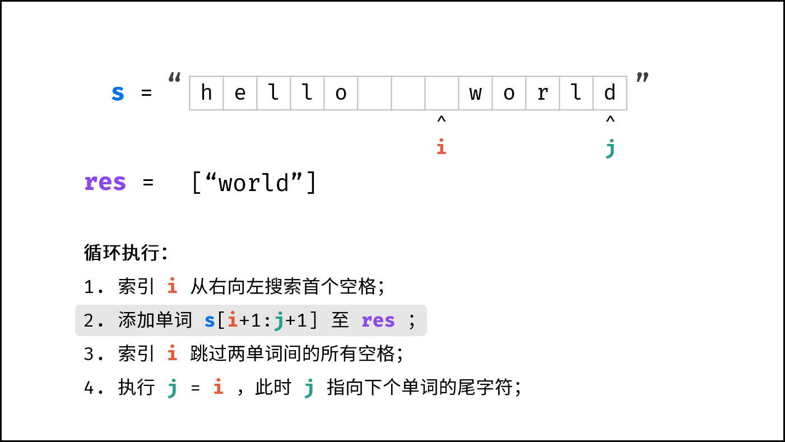
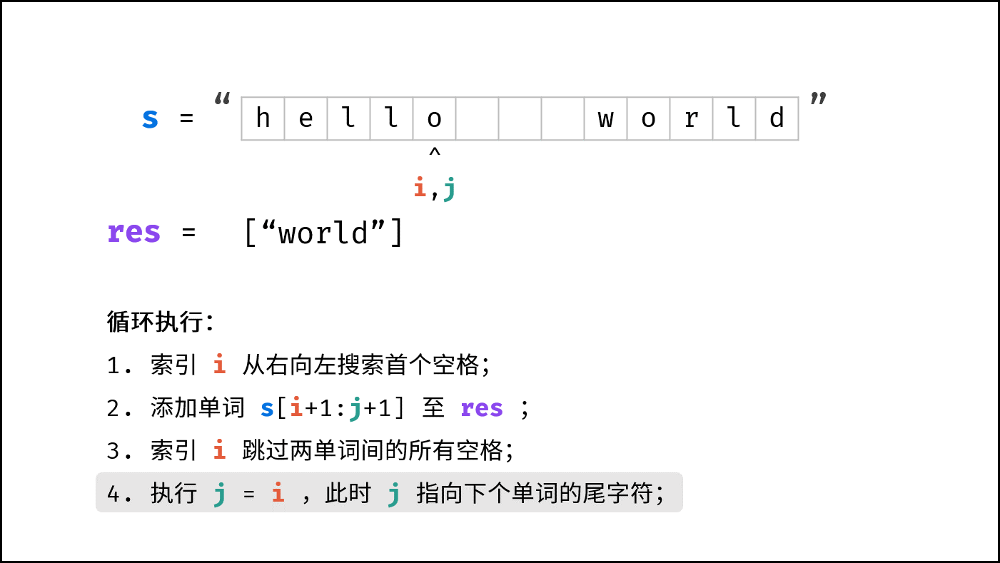
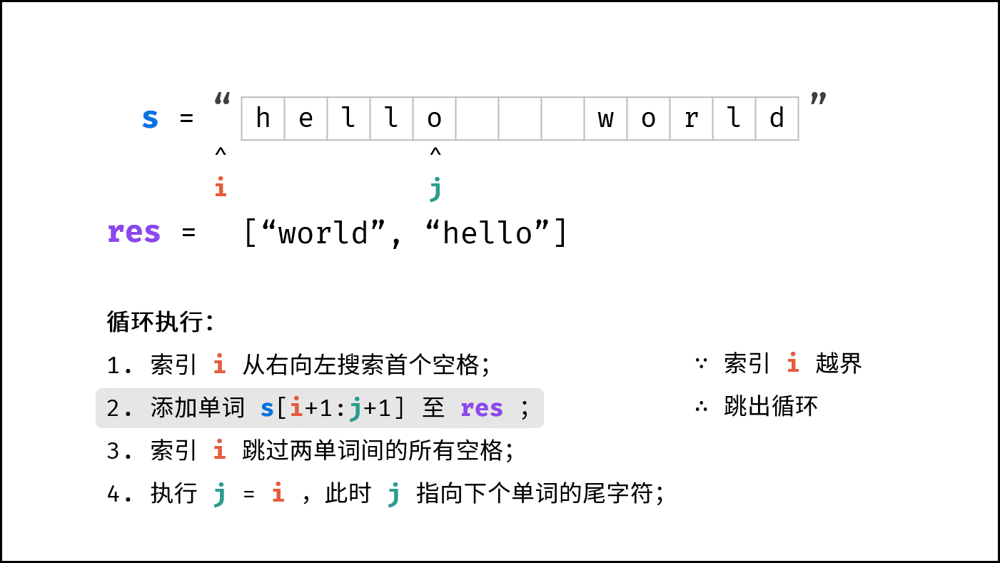
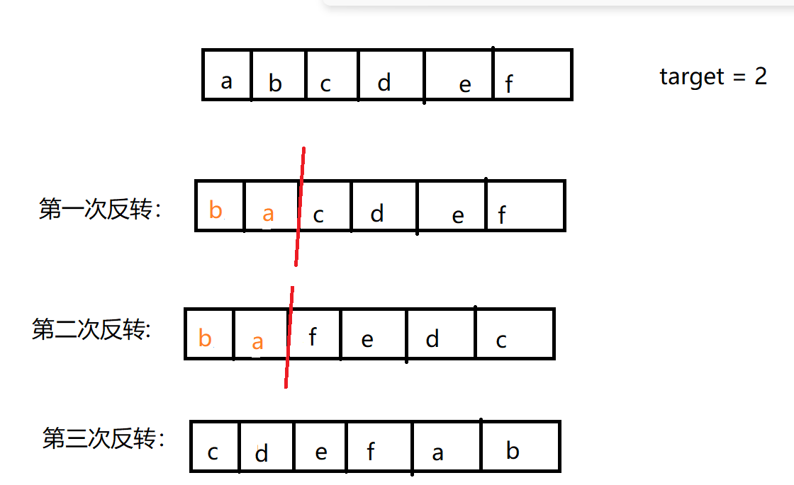
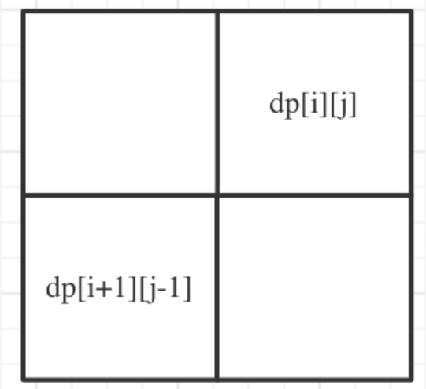

# 字符串

## 双指针系列

### [14. 最长公共前缀](https://leetcode.cn/problems/longest-common-prefix/)

[LeetCode题解](https://leetcode.cn/problems/longest-common-prefix/solutions/2459021/problem-14-zui-chang-gong-gong-qian-zhui-tlgr/)

### [167. 两数之和 II - 输入有序数组](https://leetcode.cn/problems/two-sum-ii-input-array-is-sorted/)

给你一个下标从 **1** 开始的整数数组 `numbers` ，该数组已按 **非递减顺序排列** ，请你从数组中找出满足相加之和等于目标数 `target` 的两个数。如果设这两个数分别是 `numbers[index1]` 和 `numbers[index2]` ，则 `1 <= index1 < index2 <= numbers.length` 。

以长度为 2 的整数数组 `[index1, index2]` 的形式返回这两个整数的下标 `index1` 和 `index2`。

你可以假设每个输入 **只对应唯一的答案** ，而且你 **不可以** 重复使用相同的元素。

你所设计的解决方案必须只使用常量级的额外空间。


**示例 1：**

```
输入：numbers = [2,7,11,15], target = 9
输出：[1,2]
解释：2 与 7 之和等于目标数 9 。因此 index1 = 1, index2 = 2 。返回 [1, 2] 。
```

**示例 2：**

```
输入：numbers = [2,3,4], target = 6
输出：[1,3]
解释：2 与 4 之和等于目标数 6 。因此 index1 = 1, index2 = 3 。返回 [1, 3] 。
```

**示例 3：**

```
输入：numbers = [-1,0], target = -1
输出：[1,2]
解释：-1 与 0 之和等于目标数 -1 。因此 index1 = 1, index2 = 2 。返回 [1, 2] 。
```


**提示：**

- `2 <= numbers.length <= 3 * 104`
- `-1000 <= numbers[i] <= 1000`
- `numbers` 按 **非递减顺序** 排列
- `-1000 <= target <= 1000`
- **仅存在一个有效答案**

#### 思路分析

**根据题目可知**：

- numbers 是一个升序数组
- 仅有一个有效答案
- 下标从 1 开始

该题目完全可以利用双指针的方法，首尾开始遍历。

- 假设left指向首元素，right指向尾元素
- 如果 $numbers [left] + numbers [right] < target $ , 说明当前数太小，将 left指针右移，相反如果大于，则将 right--
- 相等则保存 left、right指针在数组中，并返回。返回时不要忘记将 left、right 加 1，因为下标从 1开始

#### 代码实现

```java
    public static int[] twoSum(int[] numbers, int target) {
        int left = 0;
        int right = numbers.length -1;
        int[] ints = new int[2];
        while (left < right) {
            if (numbers[left] + numbers[right] > target){
                right--;
            }else if (numbers[left] + numbers[right] < target){
                left ++;
            }else {
               
                ints[0] = left+1;
                ints[1] = right+1;
                break;
            };
        }
        return ints;
    }

```


## 反转字符串系列

### [151. 反转字符串中的单词](https://leetcode.cn/problems/reverse-words-in-a-string/)

给你一个字符串 `s` ，请你反转字符串中 **单词** 的顺序。

**单词** 是由非空格字符组成的字符串。`s` 中使用至少一个空格将字符串中的 **单词** 分隔开。

返回 **单词** 顺序颠倒且 **单词** 之间用单个空格连接的结果字符串。

**注意：**输入字符串 `s`中可能会存在前导空格、尾随空格或者单词间的多个空格。返回的结果字符串中，单词间应当仅用单个空格分隔，且不包含任何额外的空格。


**示例 1：**

```
输入：s = "the sky is blue"
输出："blue is sky the"
```

**示例 2：**

```
输入：s = "  hello world  "
输出："world hello"
解释：反转后的字符串中不能存在前导空格和尾随空格。
```

**示例 3：**

```
输入：s = "a good   example"
输出："example good a"
解释：如果两个单词间有多余的空格，反转后的字符串需要将单词间的空格减少到仅有一个。
```


**提示：**

- `1 <= s.length <= 104`
- `s` 包含英文大小写字母、数字和空格 `' '`
- `s` 中 **至少存在一个** 单词


#### 思路分析

在Java中提供了很多对字符串操作的API，可以直接使用API进行其操作

```java
    public static String reverseWords(String s) {
        // 先去掉首尾空格
        s = s.trim();
        // \s+ 可以匹配一个或者多个空字符
        List<String> wordList = Arrays.asList(s.split("\\s+"));
        // 进行反转
        Collections.reverse(wordList);
        // 每个单词后边增加空格
        return String.join(" ", wordList);
    }
```


**第二种方法：双指针**

- 俩个指针倒序遍历字符串，遇到空格停止，然后截取字符串，并将单词放到 res 集合中



- 、跳过单词间的所有空格，将 j 重新指向下一个单词的尾部



- 重复上面操作，直到 i 指针跳出循环




```java
    public static String reverseWords(String s) {
        // 先去掉首尾空格
        s = s.trim();
        // 将俩个指针指向尾部
        int i  = s.length()-1;
        int j = i;
        ArrayList<String> res = new ArrayList<>();

        while (i >= 0) {
            // 遇到空格停止
            while(i >= 0 && s.charAt(i) != ' ') i--;
            // 截取单词并加入到集合中
            res.add( s.substring(i+1,j+1));
            // 跳过空格
            while(i >=0 && s.charAt(i) == ' ') i--;
            j = i;
        }
        return String.join(" ",res);
    }

```

### [557. 反转字符串中的单词 III](https://leetcode.cn/problems/reverse-words-in-a-string-iii/)

给定一个字符串 `s` ，你需要反转字符串中每个单词的字符顺序，同时仍保留空格和单词的初始顺序。


**示例 1：**

```
输入：s = "Let's take LeetCode contest"
输出："s'teL ekat edoCteeL tsetnoc"
```

**示例 2:**

```
输入： s = "God Ding"
输出："doG gniD"
```


***\**\*\*\*提示：\*\*\*\*\****

- `1 <= s.length <= 5 * 104`
- `s` 包含可打印的 **ASCII** 字符。
- `s` 不包含任何开头或结尾空格。
- `s` 里 **至少** 有一个词。
- `s` 中的所有单词都用一个空格隔开。


#### 思路分析

利用Java中的API，先分割，在反转，在组合

#### 代码实现

```java
    public String reverseWords(String s) {
        String[] split = s.split("\\s+");
        for (int i = 0; i < split.length; i++) {
           split[i] = new StringBuilder(split[i]).reverse().toString();
        }
        return String.join(" ",split);
    }
```


### [344. 反转字符串](https://leetcode.cn/problems/reverse-string/)

编写一个函数，其作用是将输入的字符串反转过来。输入字符串以字符数组 `s` 的形式给出。

不要给另外的数组分配额外的空间，你必须**[原地](https://baike.baidu.com/item/原地算法)修改输入数组**、使用 O(1) 的额外空间解决这一问题。


**示例 1：**

```
输入：s = ["h","e","l","l","o"]
输出：["o","l","l","e","h"]
```

**示例 2：**

```
输入：s = ["H","a","n","n","a","h"]
输出：["h","a","n","n","a","H"]
```


**提示：**

- `1 <= s.length <= 105`
- `s[i]` 都是 [ASCII](https://baike.baidu.com/item/ASCII) 码表中的可打印字符


#### **思路分析**

题目要求，不允许使用额外数组，要原地修改。这就需要我们使用到双指针的思想：

- 双指针情形一:   指针向中间或两端移动，移动方向始终相对
- 双指针情形二： 指针向同侧移动，形成前后指针或快慢指针

此道题目很明显是情形一，我们需要使用俩个指针，然后将指向的元素交换并移动，直到相遇为止


#### 代码实现

```java
    public static void reverseString(char[] s) {
        // 定义双指针
        int left = 0;
        int right = s.length -1 ;

        while(left <= right) {
            // 将left与right指向的元素交换
            char temp = s[left];
            s[left] = s[right];
            s[right] = temp;
            // 移动指针
            left++;
            right--;
        }
    }

```


### [541. 反转字符串 II](https://leetcode.cn/problems/reverse-string-ii/)

给定一个字符串 `s` 和一个整数 `k`，从字符串开头算起，每计数至 `2k` 个字符，就反转这 `2k` 字符中的前 `k` 个字符。

- 如果剩余字符少于 `k` 个，则将剩余字符全部反转。
- 如果剩余字符小于 `2k` 但大于或等于 `k` 个，则反转前 `k` 个字符，其余字符保持原样。


**示例 1：**

```
输入：s = "abcdefg", k = 2
输出："bacdfeg"
```

**示例 2：**

```
输入：s = "abcd", k = 2
输出："bacd"
```


#### 思路分析

假设字符串的长度为 n:

- 如果 k <= n < 2k , 就反转 前k个字符

- 如果 n < k ,  就反转n个字符

所以在遍历字符串时，只需要每次移动 2k 个位置，找到反转字符串的起始点，判断该起始点与 n 的长度即可。


#### 代码实现

```java
    public static String reverseStr(String s, int k) {
        int n = s.length();
        char[] chars = s.toCharArray();
        // 每次都从 2k 的下标开始，如果长度不足k则全部翻转，否则翻转前k个字符
        for (int i = 0; i < chars.length; i+= 2*k) {
            // 如果长度满足k个长度，结束下标就为 i+k
            // 否则就反转全部字符串，结束下标为 n
            reverse(chars,i,Math.min(i+k,n)-1);
        }
        return new String(chars);
    }
    public static  void reverse(char[] chars, int left, int right) {
        while(left < right) {
            char temp = chars[left];
            chars[left] = chars[right];
            chars[right] =  temp;

            left++;
            right++;
        }
```

### [LCR 182. 动态口令](https://leetcode.cn/problems/zuo-xuan-zhuan-zi-fu-chuan-lcof/)

某公司门禁密码使用动态口令技术。初始密码为字符串 `password`，密码更新均遵循以下步骤：

- 设定一个正整数目标值 `target`
- 将 `password` 前 `target` 个字符按原顺序移动至字符串末尾

请返回更新后的密码字符串。


**示例 1：**

```
输入: password = "s3cur1tyC0d3", target = 4
输出: "r1tyC0d3s3cu"
```

**示例 2：**

```
输入: password = "lrloseumgh", target = 6
输出: "umghlrlose"
```


**提示：**

- `1 <= target < password.length <= 10000`


#### 思路分析

如果不要求空间复杂度的话，极简版：

```java
    public static String dynamicPassword(String password, int target) {
        // 截取移动后边的字符串
        String substring = password.substring(target);
        // 截取移动的字符串
        String front = password.substring(0, target);

        return substring + front;
    }
```


**如果要求只能在源字符串上进行修改呢？要求时间复杂度为 O(1)**

可以采用多次反转，第一次反转 0~target ，第二次反转 target~ n(n为字符串长度) ，第三次反转整个字符串！



```java
    // 如果要求空间复杂度为O(1)
    public static String dynamicPassword1(String password, int target) {
        char[] arr = password.toCharArray();
        // 第一次反转，0~target
        reverse(arr,0,target-1);
        // 第二次反转，target~n
        reverse(arr,target,password.length()-1);
        // 第三次反转，整个字符串
        reverse(arr,0,password.length()-1);

        return new String(arr);
    }

    // 反转函数
    public static  void reverse(char[] arr,int left,int right) {
        while(left < right) {
            char temp = arr[left];
            arr[left] = arr[right];
            arr[right] = temp;

            left++;
            right--;
        }
    }
```


## [561. 数组拆分](https://leetcode.cn/problems/array-partition/)

给定长度为 `2n` 的整数数组 `nums` ，你的任务是将这些数分成 `n` 对, 例如 `(a1, b1), (a2, b2), ..., (an, bn)` ，使得从 `1` 到 `n` 的 `min(ai, bi)` 总和最大。

返回该 **最大总和** 。


**示例 1：**

```
输入：nums = [1,4,3,2]
输出：4
解释：所有可能的分法（忽略元素顺序）为：
1. (1, 4), (2, 3) -> min(1, 4) + min(2, 3) = 1 + 2 = 3
2. (1, 3), (2, 4) -> min(1, 3) + min(2, 4) = 1 + 2 = 3
3. (1, 2), (3, 4) -> min(1, 2) + min(3, 4) = 1 + 3 = 4
所以最大总和为 4
```

**示例 2：**

```
输入：nums = [6,2,6,5,1,2]
输出：9
解释：最优的分法为 (2, 1), (2, 5), (6, 6). min(2, 1) + min(2, 5) + min(6, 6) = 1 + 2 + 6 = 9
```


**提示：**

- `1 <= n <= 104`
- `nums.length == 2 * n`
- `-104 <= nums[i] <= 104`


### 思路分析

题目要求 求得每俩个元素的最小值加起来的和最大。

那么就尽可能的让俩个元素的最小值较大，也就是较小元素和较小元素组合，较大元素和较大元素组合。

因此我们可以先升序，然后每俩个元素组合在一起


### 代码实现

```java
    public static int arrayPairSum(int[] nums) {
       Arrays.sort(nums);
        int sum = 0;
        for (int i = 0; i < nums.length; i+=2) {
            sum += Math.min(nums[i], nums[i+1]);
        }
        return sum;
    }

```


## [5. 最长回文子串](https://leetcode.cn/problems/longest-palindromic-substring/)

给你一个字符串 `s`，找到 `s` 中最长的回文子串。

如果字符串的反序与原始字符串相同，则该字符串称为回文字符串。


**示例 1：**

```
输入：s = "babad"
输出："bab"
解释："aba" 同样是符合题意的答案。
```

**示例 2：**

```
输入：s = "cbbd"
输出："bb"
```


**提示：**

- `1 <= s.length <= 1000`
- `s` 仅由数字和英文字母组成

### 思路分析

像这种求最值问题基本都可以利用 `动态规划` 来求解，此题也不例外。


**定义dp数组及下标含义: **

dp\[i][j] : 表示 s 串在下标 i 和 j区间内是否是回文子串

**确定递推公式**

s[i] 与 s[j] 无非就有俩种情况，相等或者不相等

- s[i] != s[j] ,那么 dp\[i][j]  = false, 这个无需考虑
- s[i] == s[j] ，有以下几种情况：
    - i == j 说明指向同一个字符，那肯定是回文子串
    - i - j == 1, 也就是 i 和 j相差一个字符，并且 s[i] == s[j] 还想等，那么 i ~ j 也是回文子串，例如： aba
    - i - j > 1,若是相差多个字符，就需要判断 $S[i+1 , j-1] $  是否是回文子串了，例如：`wttw`，子串 tt 是回文子串，那么 wttw 很明显也是，因为首尾元素相等

因此 $ S[i] == S[j]$   一共有俩种情况：
$$
\left\{
\begin{matrix}
j - i <= 1  , true \\
dp[i+1 , j-1] ,  true
\end{matrix}
\right.
$$
**遍历**顺序

如下图所示，由于我们要得到$ dp[i][j]$ ,是通过计算 $dp[i+1 , j-1] $ 而来，因此循环应该从**下到上，从左到右**



**更新回文子串**

再循环的过程中，要不断更新回文子串的长度


### 代码实现

```java
    public String longestPalindrome(String s) {
        int length = s.length();
        // dp数组，初始为 false
        // 保存 i~j 是否为回文子串
        boolean[][] dp = new boolean[length][length];
        // 保存回文子串
        String res = "";
        // 从下到上，从左到右
        for (int i = length; i >=0; i--) {
            for (int j = i; j < length; j++) {
                // 是回文子串的俩种情况
                if (s.charAt(i) == s.charAt(j) && (j-i < 2 || dp[i+1][j-1])) {
                    dp[i][j] = true;
                }
                // 不断更新回文子串
                if (dp[i][j] && (j-i+1) > res.length()) {
                    res = s.substring(i,j+1);
                }
            }
        }
        return res;
    }

```

