# 数组

## 217 存在重复元素

给你一个整数数组 `nums` 。如果任一值在数组中出现 **至少两次** ，返回 `true` ；如果数组中每个元素互不相同，返回 `false` 。

**示例 1：**

```
输入：nums = [1,2,3,1]
输出：true
```

**示例 2：**

```
输入：nums = [1,2,3,4]
输出：false
```

**示例 3：**

```
输入：nums = [1,1,1,3,3,4,3,2,4,2]
输出：true
```

### 思路分析

题比较简单，实现思路也有很多。

1. 可以转换成一个 Set 集合，因为 set 集合是不重复的。通过对比转换前后的长度就可以得知是否重复
2. 也可以先对数组进行排序，重复的肯定是相邻的俩个数，挨个比对判断就行了。
3. 使用 Jdk8 中 的 Stream流，通过去重操作，然后收集去重后的数据，比对长度即可。

### 代码实现

> 由于题比较简单，就写出第三种方式的代码。

```java
    /*
    * 利用JDK8的新特性,对nums数组进行去重操作，统计去重后数组的长度
    * 比原来数组小就说明有重复的，反之则没有
    * */
    public static boolean  containsDuplicate(int[] nums) {
        long count = Arrays.stream(nums).distinct().count();
        return !(count == nums.length);
    }
```


## 704 二分查找

给定一个 `n` 个元素有序的（升序）整型数组 `nums` 和一个目标值 `target` ，写一个函数搜索 `nums` 中的 `target`，如果目标值存在返回下标，否则返回 `-1`。

**示例 1:**

```
输入: nums = [-1,0,3,5,9,12], target = 9
输出: 4
解释: 9 出现在 nums 中并且下标为 4
```

**示例 2:**

```
输入: nums = [-1,0,3,5,9,12], target = 2
输出: -1
解释: 2 不存在 nums 中因此返回 -1
```

**提示：**

1. 你可以假设 `nums` 中的所有元素是不重复的。
2. `n` 将在 `[1, 10000]`之间。
3. `nums` 的每个元素都将在 `[-9999, 9999]`之间。


### 思路分析

二分查找是一个简单，但是一个非常经典的搜索算法，但是经常会将 while 条件搞混，例如到底是 `while(left < right)` 还是 `while(left <= right)`，到底是`right = middle`呢，还是要`right = middle - 1`呢？

混淆的原因主要是区间没有定义好，在二分查找中一般有俩个常用的区间:

- 左闭右闭 ：[ left, right ]
- 左闭右开 : [ left, right )

### 代码实现

**第一种写法：左闭右闭**

确定好了左闭右闭区间，这就决定了我们如何写 while 条件以及right 的变化：

- `while (left <= right) `要使用 <= ，因为` left == right` 是有意义的，所以使用 <=
- `if (nums[middle] > target) right = middle - 1`，因为当前这个 `nums[middle]`一定不是target，那么接下来要查找的左区间结束下标位置就是 `middle - 1`

```java
    // 定义区间: [left,right]
    public static int search(int[] nums, int target) {
        int left = 0;
        int right = nums.length - 1;
        // 因为我们定义的是左闭右闭区间， left == right 是有意义的
        while (left <= right) {
            // 找出中间索引
            int middle  = (left + right) / 2;
            if (nums[middle ] > target) {
                // 这里使用 middle-1,因为在 if 中已经判断了 middle 处的值一定不是 target
                // 因此在 middle-1 为终止条件
                right = middle  - 1;
            }else if (nums[middle] < target) {
                left = middle + 1;
            }else {
                return middle;
            }
        }
        return -1;
    }
```


**第二种：左闭右开区间**

- `while (left < right)`，这里使用 < ,因为 `left == right `在区间 `[left, right)` 是没有意义的
- `if (nums[middle] > target) right = middle`，在 if 中同样能看出，`nums[middle]`  一定不等于 target，因此需要从 `middle -1` 作为结束索引，但是在` [left,middle) `中，已经不包含 middle ，因此就无需 -1 。

```java
    // 定义区间: [left,right)
    public static int search(int[] nums, int target) {
        int left = 0;
        int right = nums.length;
        // 因为我们定义的是左闭右开区间， left == right 是不成立的
        while (left < right) {
            // 找出中间索引
            int middle  = (left + right) / 2;
            if (nums[middle ] > target) {
                // 这里使用 middle,是因为 [left,middle) 中已经不包含了 middle。
                right = middle ;
            }else if (nums[middle] < target) {
                left = middle + 1;
            }else {
                return middle;
            }
        }
        return -1;
    }
```


### 相关题目

#### 35 搜索插入位置

给定一个排序数组和一个目标值，在数组中找到目标值，并返回其索引。如果目标值不存在于数组中，返回它将会被按顺序插入的位置。

请必须使用时间复杂度为 `O(log n)` 的算法。

**示例 1:**

```
输入: nums = [1,3,5,6], target = 5
输出: 2
```

**示例 2:**

```
输入: nums = [1,3,5,6], target = 2
输出: 1
```

**示例 3:**

```
输入: nums = [1,3,5,6], target = 7
输出: 4
```


**提示:**

- `1 <= nums.length <= 104`
- `-104 <= nums[i] <= 104`
- `nums` 为 **无重复元素** 的 **升序** 排列数组
- `-104 <= target <= 104`


**思路分析**：

在分析该题目时，不要太在意 `左闭右开、左闭右闭区间` ，而是应该具体问题具体分析，根据题意确定 left、right 以及 mid 与 target的关系 的变化

通过题目可以得知：**要求返回第一个大于等于 target 的元素位置**

**情况一**: 如果 nums[mid] 小于 target 的值, 那么 **mid 以及 mid 左边所有的位置**都不符合题意。因此需要向右移动 left = mid + 1

**情况二**：如果 nums[mid] 大于 target 的值，那么 **mid 右边所有的位置**肯定不符合题意，因此需要向左移动：right = mid，并且 mid 有可能是需要返回的位置， 但前提是 mid 左边的所有元素都不符合题意。也就是说 mid 左边的所有元素都小于或者不等于 target


**代码**

```java
    public static int searchInsert(int[] nums, int target) {
        int left = 0;
        int right = nums.length;
        int mid = 0;
        while (left < right) {
            mid =  (left + right) / 2;
            // 如果 nums[mid] < target 说明，mid及mid左边的所有位置都不符合题意
            if (nums[mid] < target) {
                left = mid + 1;
            } else {
                // 相反如果等于 nums[mid] >= target, 此时说明 mid 有可能是需要返回的位置
                // 但前提是 mid 左边的所有元素都不符合题意。也就是说 mid 左边的所有元素都小于或者不等于 target
                right = mid;
            }
        }
        return left;
    }
}
```


**第二种思路**：

题目中重要的俩个条件：1、升序   2、无重复元素

我们可以得知，在找到 target 合适的位置 i 时  ，那么它一定满足以下的条件：$ target >= nums[0]...nums[i-1]$

我们就可以利用这个条件，不使用二分查找，直接使用 for 循环。

**代码如下**：

```java
    public int searchInsert(int[] nums, int target) {
        // 升序、无重复元素，只要某个元素大于target值，该元素的位置就是就是要返回的值
        if(nums.length == 0) return -1;
        for (int i = 0; i < nums.length; i++) {
            if (nums[i] >= target) return i;
        }
        // 循环结束仍然没有位置，说明 target 在数组中是最大的，直接插入数组末尾即可。
        return nums.length;
    }
```

#### [278. 第一个错误的版本](https://leetcode.cn/problems/first-bad-version/)


你是产品经理，目前正在带领一个团队开发新的产品。不幸的是，你的产品的最新版本没有通过质量检测。由于每个版本都是基于之前的版本开发的，所以错误的版本之后的所有版本都是错的。

假设你有 `n` 个版本 `[1, 2, ..., n]`，你想找出导致之后所有版本出错的第一个错误的版本。

你可以通过调用 `bool isBadVersion(version)` 接口来判断版本号 `version` 是否在单元测试中出错。实现一个函数来查找第一个错误的版本。你应该尽量减少对调用 API 的次数。

**示例 1：**

```
输入：n = 5, bad = 4
输出：4
解释：
调用 isBadVersion(3) -> false 
调用 isBadVersion(5) -> true 
调用 isBadVersion(4) -> true
所以，4 是第一个错误的版本。
```

**示例 2：**

```
输入：n = 1, bad = 1
输出：1
```


**提示：**

- `1 <= bad <= n <= 231 - 1`


**思路分析**

题目要求和 35 题一样，该题是求出第一个错误版本。但是有一个小坑。

int类型最大值为 2^31 - 1 , 这里如果单纯的使用: `mid =  (left + right) / 2;` 可能会造成溢出

因此使用：`left + (right - left) / 2;`

```java
public int firstBadVersion(int n) {
        int left = 1;
        int right = n;

        while(left < right) {
            int mid = left + (right - left) / 2;
            if (!isBadVersion(mid)) {
                // 当前mid版本没有错误，说明mid及mid之前都没有错误,
                left = mid + 1;
            }else {
                // 相反,mid出错，可能是mid是第一个出错的，也可能是mid前面版本出错
                right = mid;
            }
        }
        return left;
}
```


#### [34. 在排序数组中查找元素的第一个和最后一个位置](https://leetcode.cn/problems/find-first-and-last-position-of-element-in-sorted-array/)

给你一个按照非递减顺序排列的整数数组 `nums`，和一个目标值 `target`。请你找出给定目标值在数组中的开始位置和结束位置。

如果数组中不存在目标值 `target`，返回 `[-1, -1]`。

你必须设计并实现时间复杂度为 `O(log n)` 的算法解决此问题。


**示例 1：**

```
输入：nums = [5,7,7,8,8,10], target = 8
输出：[3,4]
```

**示例 2：**

```
输入：nums = [5,7,7,8,8,10], target = 6
输出：[-1,-1]
```

**示例 3：**

```
输入：nums = [], target = 0
输出：[-1,-1]
```


**提示：**

- `0 <= nums.length <= 105`
- `-109 <= nums[i] <= 109`
- `nums` 是一个非递减数组
- `-109 <= target <= 109`

**思路分析**

**第一种方法： 直接遍历**

第一次遍历找到第一个相等的元素下标，第二次遍历找到最后一个相等元素的下标

```java
    public int[] searchRange(int[] nums, int target) {
        int start = -1;
        int end = -1;
        for (int i = 0; i < nums.length; i++) {
            if (nums[i] == target) {
                start = i;
                end = i;
                break;
            }
        }
        if (start == -1) return new int[]{start,end};

        for (int i = start; i < nums.length; i++) {
            if (nums[i] != target) break;
            end++;
        }
        return new int[]{start,end};
        }
```

**第二种方法：二分法**

通过二分法找到相等的元素后，向左继续搜索找到开始下标，向右继续搜索找到结束下标

```java
class Solution {
    public int[] searchRange(int[] nums, int target) {
        int left = 0;
        int right = nums.length-1;
        while(left<=right){
            int mid = left+(right-left)/2;
            if(nums[mid]==target){
                // 向两边扩张
                int l = mid;
                while(l>=left&&nums[l]==target){
                    l--;
                }
                int r = mid;
                while(r<=right&&nums[r]==target){
                    r++;
                }
                return new int[]{++l,--r};
            }else if(nums[mid]>target){
                //左边
                right = mid-1;
            }else{
                left = mid+1;
            }
        }
        return new int[]{-1,-1};
    }
}
```


#### [153. 寻找旋转排序数组中的最小值](https://leetcode.cn/problems/find-minimum-in-rotated-sorted-array/)

已知一个长度为 `n` 的数组，预先按照升序排列，经由 `1` 到 `n` 次 **旋转** 后，得到输入数组。例如，原数组 `nums = [0,1,2,4,5,6,7]` 在变化后可能得到：

- 若旋转 `4` 次，则可以得到 `[4,5,6,7,0,1,2]`
- 若旋转 `7` 次，则可以得到 `[0,1,2,4,5,6,7]`

注意，数组 `[a[0], a[1], a[2], ..., a[n-1]]` **旋转一次** 的结果为数组 `[a[n-1], a[0], a[1], a[2], ..., a[n-2]]` 。

给你一个元素值 **互不相同** 的数组 `nums` ，它原来是一个升序排列的数组，并按上述情形进行了多次旋转。请你找出并返回数组中的 **最小元素** 。

你必须设计一个时间复杂度为 `O(log n)` 的算法解决此问题。


**示例 1：**

```
输入：nums = [3,4,5,1,2]
输出：1
解释：原数组为 [1,2,3,4,5] ，旋转 3 次得到输入数组。
```

**示例 2：**

```
输入：nums = [4,5,6,7,0,1,2]
输出：0
解释：原数组为 [0,1,2,4,5,6,7] ，旋转 4 次得到输入数组。
```

**示例 3：**

```
输入：nums = [11,13,15,17]
输出：11
解释：原数组为 [11,13,15,17] ，旋转 4 次得到输入数组。
```


**提示：**

- `n == nums.length`
- `1 <= n <= 5000`
- `-5000 <= nums[i] <= 5000`
- `nums` 中的所有整数 **互不相同**
- `nums` 原来是一个升序排序的数组，并进行了 `1` 至 `n` 次旋转

**思路分析**

根据题意得知：

输入数组是一个**不重复的升序数组**旋转 1~n 次得到的，具体旋转咱也不知道，但是不管旋转几次，肯定是有一部分是有序的，并且最小值一定是在无序的那部分上。因此可以利用二分法找无序的那一部分。

- $nums[mid] > nums[right]$ ， 说明最小值在右半边，舍弃左半边。即:` left = mid + 1`;
    - 这里为什么是 ` left = mid + 1`;而不是 ` left = mid` 呢？ 这是因为mid一定不是最小的，至少 `nums[right]` 比它小
- $nums[mid] <= nums[right]$ , 说明最小值在左半边，舍弃右半边，即:` right = mid `;
    - 这里 mid 有可能是最小值，因此保留mid的取值

**代码实现**

```java
    // 使用二分法
    public int findMin1(int[] nums) {
        int low = 0;
        int high = nums.length -1 ;
        while (low < high) {
            int mid = (low + high) /2 ;
            if (nums[mid] < nums[high]) {
                // 如果中间值小于最大值，那么就抛弃右区间
                high = mid;
            }else{
                // 否则抛弃左区间
                low = mid + 1;
            }
        }
        return nums[low];
    }
```

**疑问**：

1、为什么要使用 $low < high$ , 使用 $low <= high$ 不行嘛？

> 其实是可以的，但是需要多考虑一些情况，如果是 <= 的话，当 low=high时，还要执行一遍循环。
>
> 如下图所示，此时 low=high，符合条件，仍需要执行一遍 low = mid - 1，此时 low = -1。所以当使用 <= 时，返回值有俩种写法：
>
> - return  nums[low+1]
> - return nums[high]

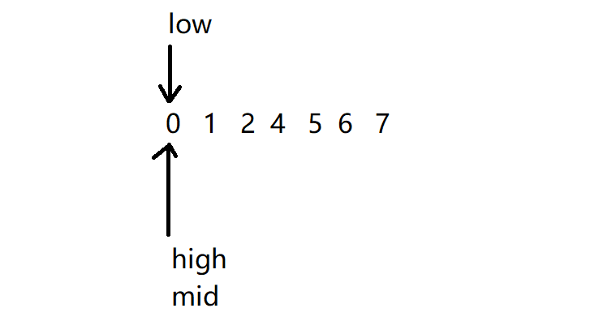

#### [33. 搜索旋转排序数组](https://leetcode.cn/problems/search-in-rotated-sorted-array/)

整数数组 `nums` 按升序排列，数组中的值 **互不相同** 。

在传递给函数之前，`nums` 在预先未知的某个下标 `k`（`0 <= k < nums.length`）上进行了 **旋转**，使数组变为 `[nums[k], nums[k+1], ..., nums[n-1], nums[0], nums[1], ..., nums[k-1]]`（下标 **从 0 开始** 计数）。例如， `[0,1,2,4,5,6,7]` 在下标 `3` 处经旋转后可能变为 `[4,5,6,7,0,1,2]` 。

给你 **旋转后** 的数组 `nums` 和一个整数 `target` ，如果 `nums` 中存在这个目标值 `target` ，则返回它的下标，否则返回 `-1` 。

你必须设计一个时间复杂度为 `O(log n)` 的算法解决此问题。


**示例 1：**

```
输入：nums = [4,5,6,7,0,1,2], target = 0
输出：4
```

**示例 2：**

```
输入：nums = [4,5,6,7,0,1,2], target = 3
输出：-1
```

**示例 3：**

```
输入：nums = [1], target = 0
输出：-1
```


**提示：**

- `1 <= nums.length <= 5000`
- `-104 <= nums[i] <= 104`
- `nums` 中的每个值都 **独一无二**
- 题目数据保证 `nums` 在预先未知的某个下标上进行了旋转
- `-104 <= target <= 104`


**思路分析**

题目要求 O(logN)的时间复杂度，基本可以断定本题是需要使用二分查找，怎么分是关键。由于题目说数字了无重复，举个例子：`1 2 3 4 5 6 7`可以大致分为两类，

- 第一类 2 3 4 5 6 7 1 这种，也就是 nums[left] <= nums[mid]。此例子中就是 2 <= 5。
    - 这种情况下，前半部分有序。因此如果 nums[left] <=target<nums[mid]，则在前半部分找，否则去后半部分找。

- 第二类 6 7 1 2 3 4 5 这种，也就是 nums[left] > nums[mid]。此例子中就是 6 > 2。
    - 这种情况下，后半部分有序。因此如果 nums[mid] <target<=nums[right]，则在后半部分找，否则去前半部分找。

```java
class Solution {
    public int search(int[] nums, int target) {
       int left = 0;
        int right = nums.length - 1;

        while (left <= right) {
            int mid = left + (right - left) / 2;

            if (nums[mid] == target) {
                return mid;
            } else if (nums[mid] >= nums[left]) { // 中间值>最左边的值，说明左半段是有序的
                if (target >= nums[left] && target < nums[mid]) { // 判断目标值在中间值的左边还是右边，以此调整left和right
                    // 在左边，需要舍弃右边
                    right = mid - 1;
                } else {
                    // 在右边,需要舍弃左边
                    left = mid + 1;
                }
            } else { // 中间值 < 最左边的值，说明右半段是有序的
                if (target <= nums[right] && target > nums[mid]) {
                    left = mid + 1;
                }else {
                    right = mid - 1;
                }
            }
        }
        return -1;
    }
}
```


## [27. 移除元素](https://leetcode.cn/problems/remove-element/description/)

给你一个数组 `nums` 和一个值 `val`，你需要 **[原地](https://baike.baidu.com/item/原地算法)** 移除所有数值等于 `val` 的元素，并返回移除后数组的新长度。

不要使用额外的数组空间，你必须仅使用 `O(1)` 额外空间并 **[原地 ](https://baike.baidu.com/item/原地算法)修改输入数组**。

元素的顺序可以改变。你不需要考虑数组中超出新长度后面的元素。


**说明:**

为什么返回数值是整数，但输出的答案是数组呢?

请注意，输入数组是以**「引用」**方式传递的，这意味着在函数里修改输入数组对于调用者是可见的。

你可以想象内部操作如下:

```
// nums 是以“引用”方式传递的。也就是说，不对实参作任何拷贝
int len = removeElement(nums, val);

// 在函数里修改输入数组对于调用者是可见的。
// 根据你的函数返回的长度, 它会打印出数组中 该长度范围内 的所有元素。
for (int i = 0; i < len; i++) {
    print(nums[i]);
}
```


**示例 1：**

```
输入：nums = [3,2,2,3], val = 3
输出：2, nums = [2,2]
解释：函数应该返回新的长度 2, 并且 nums 中的前两个元素均为 2。你不需要考虑数组中超出新长度后面的元素。例如，函数返回的新长度为 2 ，而 nums = [2,2,3,3] 或 nums = [2,2,0,0]，也会被视作正确答案。
```

**示例 2：**

```
输入：nums = [0,1,2,2,3,0,4,2], val = 2
输出：5, nums = [0,1,4,0,3]
解释：函数应该返回新的长度 5, 并且 nums 中的前五个元素为 0, 1, 3, 0, 4。注意这五个元素可为任意顺序。你不需要考虑数组中超出新长度后面的元素。
```


### 思路分析

此题看着并不难，实际考察的是你对数据底层的一个存储原理。很多人，包括我自己，在初始认为只需要遍历数组，将指定值删除即可, 这时你就会掉入了一个误区。因为==数组中的存储空间是连续的，一经开辟，是无法删除的，只能将后边的元素往前移覆盖==

**双指针法**

首先需要确定是双指针的含义（一般来说对于数组使用双指针，一个用来遍历，一个用来执行具体操作。）：

`fast` 指针： 指向可以输出的元素

`slow`指针：指向`被替换(删除)`的元素【等于val的元素】

其次定义双指针如何移动：

- 如果 fast 指针指向不等于 val 的元素 ，就说明该元素是`输出元素`，不用替换的元素。此时就将  fast 指向的元素替换掉 slow 指向的元素，完整"删除"操作。同时将 slow 指针向右移动。
- 如果 fast 指针指向等于val的元素，就说明该元素是需要被替换的元素，此时 slow 指针不动， fast 指针继续向右移动，直到找到一个输出元素。

**具体的流程**：

> 动画来源于：[代码随想录 (programmercarl.com)](https://www.programmercarl.com/0027.移除元素.html#思路)

、

### 代码实现

```java
    /*
    * 采用双指针：
    *   fast：指向输出元素【!= val的元素】
    *   slow：指向被替换的元素 【== val的元素】
    * 当前元素是输出元素时，将fast指向的元素替换掉slow指向的元素。并移动双指针
    * 当前元素不是输出元素时：只需要移动fast指针
    * */
    public static int removeElement(int[] nums, int val) {
        // 定义双指针
        int slow = 0;
        for (int fast = 0; fast < nums.length; fast++) {
            // 找到输出元素
            if (nums[fast] != val) {
                nums[slow] = nums[fast];
                slow++;
            }
        }

        // 遍历检查
        // for (int i = 0; i < slow; i++) {
        //     System.out.println(nums[i]);
        // }

        // 此时 slow 就是新数组的长度
        return slow;
    }
```


## 977 有序数组的平方

给你一个按 **非递减顺序** 排序的整数数组 `nums`，返回 **每个数字的平方** 组成的新数组，要求也按 **非递减顺序** 排序。

**示例 1：**

```
输入：nums = [-4,-1,0,3,10]
输出：[0,1,9,16,100]
解释：平方后，数组变为 [16,1,0,9,100]
排序后，数组变为 [0,1,9,16,100]
```

**示例 2：**

```
输入：nums = [-7,-3,2,3,11]
输出：[4,9,9,49,121]
```


### 思路分析

从题目可以得知，原始数组是递增的，并且平方后的数组也要求是递增。

**暴力法**：遍历数组，将每个数平方，然后将数组排序。

**双指针法**：

1. 从题目可以得知，平方后最大的数不是在第一位【负数平方后变正数】就是最后一位。
2. 因此可以利用双指针 i ，j ，i 指向数组首端，j指向尾端。
3. 循环比较俩个数的值，将较大的数，放入一个新数组尾端【递增】,同时移动指向较大数的指针。

`if (nums[i] * nums[i] < nums[j] * nums[j]) result [k--] = nums[j] * nums[j]`

`if (nums[i] * nums[i] >= nums[j] * nums[j]) result [k--] = nums[i] * nums[i]`

> 效果图来源于代码随想录：[代码随想录 (programmercarl.com)](https://www.programmercarl.com/0977.有序数组的平方.html#双指针法)


### 代码实现

暴力法：

```java
    public static int[] sortedSquares(int[] nums) {
        for (int i = 0; i < nums.length; i++) {
            nums[i] *= nums[i];
        }
        // 重新排序
        Arrays.sort(nums);

        return nums;
    }
```

双指针法：

```java
    // 双指针法
    public static int[] sortedSquares(int[] nums) {
        // 定义双指针
        int i = 0;
        int j = nums.length -1 ;
        // 新数组
        int[] result = new int[nums.length];
        // 新数组指针
        int k = j;
        // i 超过 j指针时，循环结束
        while (i <= j) {
            // 将较大的数，放入新数组的尾端
            if (nums[i] * nums[i] < nums[j] * nums[j]) {
                result[k--] = nums[j] * nums[j];
                j--;
            }else {
                result[k--] = nums[i] * nums[i];
                i++;
            }
        }
        return  result;
    }
```


## 209 长度最小的子数组

给定一个含有 `n` 个正整数的数组和一个正整数 `target` **。**

找出该数组中满足其和 `≥ target` 的长度最小的 **连续子数组** `[numsl, numsl+1, ..., numsr-1, numsr]` ，并返回其长度**。**如果不存在符合条件的子数组，返回 `0` 。


**示例 1：**

```
输入：target = 7, nums = [2,3,1,2,4,3]
输出：2
解释：子数组 [4,3] 是该条件下的长度最小的子数组。
```

**示例 2：**

```
输入：target = 4, nums = [1,4,4]
输出：1
```

**示例 3：**

```
输入：target = 11, nums = [1,1,1,1,1,1,1,1]
输出：0
```


### 思路分析

**暴力法**：

我直接想到的方法就是暴力法，通过俩层 for 循环，第一层循环是以某个元素为起始位置，第二层循环是以符合条件的终止位置。

**滑动窗口：**

所谓的滑动窗口，其实就是双指针，通过调节双指针的位置，确定滑动窗口的范围。在此范围内保证所有元素的和都 >= target

### 代码实现

```java
    // 双指针法: 滑动窗口
    public static int minSubArrayLen(int target, int[] nums) {
        int result = Integer.MAX_VALUE;
        // left 指向滑动窗口起始位置
        int left = 0;
        int sum = 0;
        // 通过for循环，将 right 指针移动到滑动窗口终止的位置
        for (int right = 0; right < nums.length; right++) {
            // sum 保存的是移动窗口内所有元素的和
            sum += nums[right];
            while (sum >= target){
                // 符合条件
               //  始终记录子数组的最小长度
               result =  Math.min(result,(right -left + 1));
               // 由于left指针向右移动了一位，移动窗口缩小，因此sum也要减去移动的元素值
               sum -= nums[left];
                // 移动窗口
                left++;
            }
        }
        return result==Integer.MAX_VALUE ? 0: result;
    }
```


## 59 螺旋矩阵 II

给你一个正整数 `n` ，生成一个包含 `1` 到 `n2` 所有元素，且元素按顺时针顺序螺旋排列的 `n x n` 正方形矩阵 `matrix` 。


**示例 1：**


```
输入：n = 3
输出：[[1,2,3],[8,9,4],[7,6,5]]
```

**示例 2：**

```
输入：n = 1
输出：[[1]]
```


### 思路分析

矩阵的创建流程分俩种情况，第一种是偶数的情况，第二种是奇数的情况，如果是奇数，只需在循环结束后将矩阵中间的位置设置为最大值。因为最终都是到矩阵中间的位置结束。

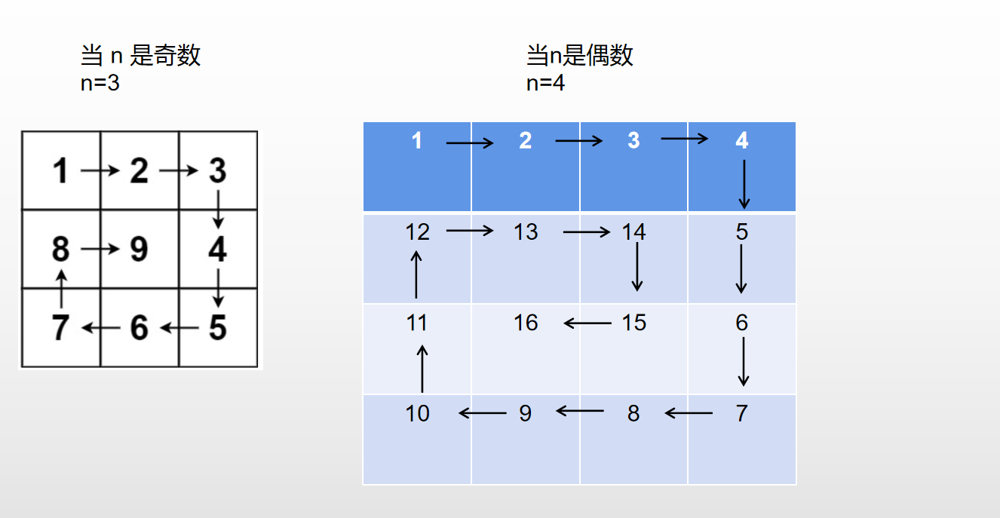

模拟顺时针画矩阵的过程:

- 顶层从左到右
- 右列从上到下
- 底层从右到左
- 左列从下到上

由外向内一圈圈的画下去

1、首先最重要的就是要确定 画矩阵 统一的规则，并且在画每一边时都要遵循这个规则。

比如：采取`左闭右开` 的原则，每一边都留下最后一个元素，留给下一条边处理。这样在处理的过程中就不会乱。

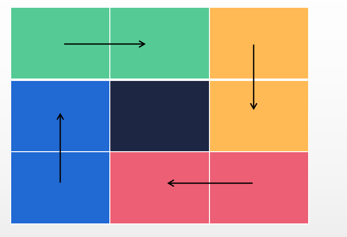


2、确定好规则，接下来就需要确定我们的循环的次数为：n/2 【如果不清楚，画一个找规律就知道为什么n/2了】

3、确定好循环次数，接下来就是对每一边进行处理。


### 代码实现

```java
public static int[][] generateMatrix(int n) {
        int loop = 0;  // 控制循环次数
        int[][] res = new int[n][n]; // 存放矩阵
        int start = 0;  // 每次循环的开始点(start, start)
        int count = 1;  // 定义填充数字
        int i, j; // 模拟矩阵的行和列

        while (loop++ < n / 2) { // 判断边界后，loop从1开始
            // 模拟上侧从左到右
            for (j = start; j < n - loop; j++) { 
                res[start][j] = count++;
            }

            // 模拟右侧从上到下
            for (i = start; i < n - loop; i++) {
                res[i][j] = count++;
            }

            // 模拟下侧从右到左
            for (; j >= loop; j--) {
                res[i][j] = count++;
            }

            // 模拟左侧从下到上
            for (; i >= loop; i--) {
                res[i][j] = count++;
            }
            // 每一次循环结束，下一次都会向里缩一圈。
            // 所以起始位置+1
            start++;
        }

        if (n % 2 == 1) {
            res[start][start] = count;
        }

        return res;
    }
```


## 1991 寻找数组的中心索引

给你一个下标从 **0** 开始的整数数组 `nums` ，请你找到 **最左边** 的中间位置 `middleIndex` （也就是所有可能中间位置下标最小的一个）。

中间位置 `middleIndex` 是满足 `nums[0] + nums[1] + ... + nums[middleIndex-1] == nums[middleIndex+1] + nums[middleIndex+2] + ... + nums[nums.length-1]` 的数组下标。

如果 `middleIndex == 0` ，左边部分的和定义为 `0` 。类似的，如果 `middleIndex == nums.length - 1` ，右边部分的和定义为 `0` 。

请你返回满足上述条件 **最左边** 的 `middleIndex` ，如果不存在这样的中间位置，请你返回 `-1` 。


**示例 1：**

```
输入：nums = [2,3,-1,8,4]
输出：3
解释：
下标 3 之前的数字和为：2 + 3 + -1 = 4
下标 3 之后的数字和为：4 = 4
```

**示例 2：**

```
输入：nums = [1,-1,4]
输出：2
解释：
下标 2 之前的数字和为：1 + -1 = 0
下标 2 之后的数字和为：0
```

**示例 3：**

```
输入：nums = [2,5]
输出：-1
解释：
不存在符合要求的 middleIndex 。
```

**示例 4：**

```
输入：nums = [1]
输出：0
解释：
下标 0 之前的数字和为：0
下标 0 之后的数字和为：0
```


**提示：**

- `1 <= nums.length <= 100`
- `-1000 <= nums[i] <= 1000`


### 思路分析

看到这道题的首先第一个想法就是暴力法，假设第一个位置为 midIndex ，分别计算 midIndex 左边的和  与  右边的和，判断是否相等，相等则返回，不相等则 将 midIndex++， 指向下一个元素


### 代码实现

```java
    public int findMiddleIndex(int[] nums) {
        // 特殊情况
        if (nums.length == 1) return 0;
        // 返回值值
        int midIndex = 0;
        while(midIndex < nums.length) {
            // 分别保存左边和右边的和
            int leftSum = 0;
            int rightSum = 0;
            // 左边和右边的指针
            int left = 0;
            int right = midIndex + 1;
            // 计算左边的和
            while (left < midIndex) {
                leftSum += nums[left];
                left++;
            }
            // 计算右边的和
            while(right < nums.length) {
                rightSum += nums[right];
                right++;
            }
            // 如果相等返回 midIndex
            if (rightSum == leftSum) return midIndex;
            // 将midIndex继续指向下一个元素
            midIndex++;
        }
        return -1;
    }
```


### 优化

除了上面比较笨重的方法，在这里其实我们可以利用一个数学公式，已知 midIndex  左边与右边元素的和相等，假设用 leftSum 表示左边之和 , sum 表示 nums 数组总和，那么可以得出：

$leftSum = sum - leftSum - nums[midIndex]$


**代码实现**

```java
    public static int findMiddleIndex2(int[] nums) {
        // 数组总和
        int sum = 0;
        for (int i = 0; i < nums.length; i++) {
           sum += nums[i];

        }
        int leftSum = 0;
        for (int i = 0; i < nums.length; i++) {
            if (leftSum == sum - leftSum - nums[i] ) return i;
            leftSum += nums[i];
        }
        return -1;
    }
```


## [56. 合并区间](https://leetcode.cn/problems/merge-intervals/)

以数组 `intervals` 表示若干个区间的集合，其中单个区间为 `intervals[i] = [starti, endi]` 。请你合并所有重叠的区间，并返回 *一个不重叠的区间数组，该数组需恰好覆盖输入中的所有区间* 。


**示例 1：**

```
输入：intervals = [[1,3],[2,6],[8,10],[15,18]]
输出：[[1,6],[8,10],[15,18]]
解释：区间 [1,3] 和 [2,6] 重叠, 将它们合并为 [1,6].
```

**示例 2：**

```
输入：intervals = [[1,4],[4,5]]
输出：[[1,5]]
解释：区间 [1,4] 和 [4,5] 可被视为重叠区间。
```


**提示：**

- `1 <= intervals.length <= 104`
- `intervals[i].length == 2`
- `0 <= starti <= endi <= 104`

### 思路分析

- 首先要按照每个区间的首元素进行升序
    - 因为我们要根据首元素判断是否合并
- 其次我们需要一个额外的集合，将不合并的区间放入进去
- 判断是否可以合并

首先我们看如果俩个区间合并的话，需要满足以下的条件：

$$
intervals[i][0] <= intervals[i-1][1]  (i >=1)
$$

> 第 i 个区间的首元素小于或者等于 第 i-1 个区间的末尾元素，就说明可以合并，例如：
>
> [1,4], [2,3] ==> [1,4]
>
> [2,5],[3,8] ==> [2,8]

从上面例子中可以看出，如果进行合并的话，首元素就是俩个区间较小的那个，末尾元素则是俩个区间较大的那个。

### 代码实现

```java
    public static int[][] merge(int[][] intervals) {
        // 结果集合
        ArrayList<int[]> res = new ArrayList<>();
        // 先对二维数组对初始元素进行排序
        Arrays.sort(intervals, (o1, o2) -> Integer.compare(o1[0], o2[0]));

        // 先将二维数组中第一个元素放到结果数组中
        res.add(intervals[0]);
        for (int i = 1; i < intervals.length; i++) {
            // 如果第二个区间的第一个元素 <= 结果集中最后一个区间的末尾元素，就进行合并
            if (intervals[i][0] <= res.get(res.size() - 1)[1]) {
                res.get(res.size() - 1)[1] = Math.max(intervals[i][1],res.get(res.size() - 1)[1]);
            } else {
                // 否则，直接加入结果数组中
                res.add(intervals[i]);
            }
        }
        return res.toArray(new int[res.size()][2]);
    }
```


## [48. 旋转图像](https://leetcode.cn/problems/rotate-image/)


给定一个 *n* × *n* 的二维矩阵 `matrix` 表示一个图像。请你将图像顺时针旋转 90 度。

你必须在**[ 原地](https://baike.baidu.com/item/原地算法)** 旋转图像，这意味着你需要直接修改输入的二维矩阵。**请不要** 使用另一个矩阵来旋转图像。


**示例 1：**


```
输入：matrix = [[1,2,3],[4,5,6],[7,8,9]]
输出：[[7,4,1],[8,5,2],[9,6,3]]
```

**示例 2：**


```
输入：matrix = [[5,1,9,11],[2,4,8,10],[13,3,6,7],[15,14,12,16]]
输出：[[15,13,2,5],[14,3,4,1],[12,6,8,9],[16,7,10,11]]
```


**提示：**

- `n == matrix.length == matrix[i].length`
- `1 <= n <= 20`
- `-1000 <= matrix[i][j] <= 1000`


### 第一种方法：使用辅助矩阵

首先要知道如何旋转，每次旋转有什么规律，以例二为例：

在第一行旋转之后，变成了矩阵的最后一列：

比如：

- 第一个行第一个元素 ——》 倒数第一列第一个元素
- 第一个行第二个元素 ——》 倒数第一列第二个元素
- ....

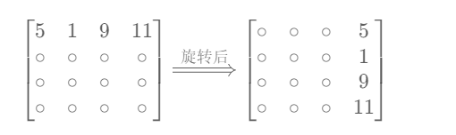

在第二行旋转之后，变成了矩阵的倒数第二列：

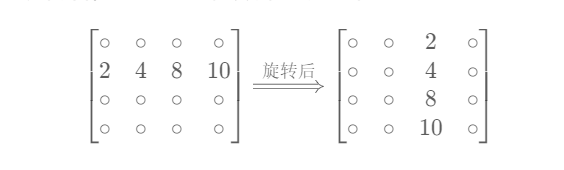

第三行、第四行依次类推，因此我们可以得出结论：

$在第 i 行 第j个元素，经过旋转之后出现在倒数第 i 列第j个位置$

**也就是说转换之前的列 是转换之后的行，而转换之后的列要根据转换之前的行计算**

由于我们下标从0开始，转换成代码为：

$ temp[j][n-i-1] = matrix[i][j] $


**代码实现**

```java
    public static void rotate(int[][] matrix) {
        int n = matrix.length;
        // 辅助矩阵
        int[][] temp = new int[n][n];
        for (int i = 0; i < n; i++) {
            for (int j = 0; j < n; j++) {
                temp[j][n-i-1] = matrix[i][j];
            }
        }

        // 复制会原矩阵
        for (int i = 0; i < n; i++) {
            for (int j = 0; j < n; j++) {
                matrix[i][j]= temp[i][j];
            }
        }
    }
```


### 第二种方法：原地修改

第二种方法不使用额外的矩阵，直接在原矩阵中修改。

以矩阵的四个顶点为例，它的旋转路径为：$A <—— D<—— C<—— B<—— A$ ，但是通过下图我们也可以看见，在第一步中，A的值被D的值覆盖了，因此需要使用一个额外变量  `temp` 保存 A的值 ， 即 $A <—— D<—— C<—— B<—— temp$


如上图所示，一轮可以完成矩阵 4 个元素的旋转。因而，只要分别以矩阵左上角 1/4 的各元素为起始点执行以上旋转操作，即可完整实现矩阵旋转。

- 当矩阵大小 n 为偶数时，取前 n/2作为行， n/2 列的元素作为起点

- 当矩阵大小 n 为奇数时，取前 n/2作为行，  （n+1）/2列作为元素的起点

假设起点元素matrix[i]\[j],  由第一种方法得出的公式，可任意推导出下面任一公式：
$$
暂存: temp = matrix[i][j]
$$
$$matrix[i][j] <—— matrix[n-1-j][i]  <—— matrix[j][n-i-1] <—— matrix[n-j-1][n-i-1] <—— temp$$


**公式推导过程**

由方法一得到**关键公式**为： $ temp[j][n-i-1] = matrix[i][j] $    ，这是使用辅助矩阵，如果我们想要原地修改即：
$$
matrix[j][n-i-1] = matrix[i][j]
$$
但是此时我们发现，$matrix[j][n-i-1]$ 原来的值会被 $ matrix[i$][j]  覆盖掉，因此我们可以使用临时变量 temp  存储：

$$
\left\{
\begin{matrix}
temp = matrix[j][n-i-1] \\
matrix[j][n-i-1] = matrix[i][j]
\end{matrix}
\right.
$$
上面的公式表示  $matrix[i][j]$ 旋转后的位置是 $ matrix[j][n-i-1]$，那么 $ matrix[j][n-i-1]$ 旋转之后的位置是什么呢？

接着将 i、j 带入关键公式，但此时的 i 和 j 变为：
$$
\left\{
\begin{matrix}
i = j \\
j = n-i-1
\end{matrix}
\right.
$$
带入之后得  $ matrix[n-i-1][n-j-1]$  ，该位置就是  $matrix[j][n-i-1]$ 旋转之后所在的位置，但是仍然存在被覆盖的问题，继续使用 temp 即可，因此得出：
$$
\left\{
\begin{matrix}
temp = matrix[n-i-1][n-j-1] \\
matrix[n-i-1][n-j-1] = matrix[j][n-i-1] \\
matrix[j][n-i-1] = matrix[i][j]
\end{matrix}
\right.
$$
紧接着继续带入 i 和 j  到关键公式：
$$
\left\{
\begin{matrix}
i = n-i-1 \\
j = n-j-1
\end{matrix}
\right.
$$
带入之后得$ matrix[n-j-1][i]  $ ， 该位置就是  $matrix[n-i-1][n-j-1]$ 旋转之后所在的位置，继续使用 temp 保存被覆盖的值，因此有：
$$
\left\{
\begin{matrix}
temp = [n-j-1][i]  \\
matrix[n-j-1][i] =  matrix[n-i-1][n-j-1] \\
matrix[n-i-1][n-j-1] = matrix[j][n-i-1] \\
matrix[j][n-i-1] = matrix[i][j]
\end{matrix}
\right.
$$
紧接着继续带入 i 和 j  到关键公式：
$$
\left\{
\begin{matrix}
i = n-j-1\\
j = i
\end{matrix}
\right.
$$
带入之后得$ matrix[i][j]$  ,   该位置就是  $matrix[n-j-1][i]$ 旋转之后所在的位置 ，继续使用 temp 保存被覆盖的值 ，因此有：
$$
\left\{
\begin{matrix}
temp =  matrix[i][j]  \\
matrix[i][j] =  matrix[n-j-1][i] \\
matrix[n-j-1][i] =  matrix[n-i-1][n-j-1] \\
matrix[n-i-1][n-j-1] = matrix[j][n-i-1] \\
matrix[j][n-i-1] = matrix[i][j]
\end{matrix}
\right.
$$
到这，我们发现又回到了起点，这几个公式为一个循环，每一个旋转之后的位置就是下一个要旋转的位置，因此我们可以使用临时变量保存：
$$
\left\{
\begin{matrix}
temp =  matrix[i][j]  \\
matrix[i][j] =  matrix[n-j-1][i] \\
matrix[n-j-1][i] =  matrix[n-i-1][n-j-1] \\
matrix[n-i-1][n-j-1] = matrix[j][n-i-1] \\
matrix[j][n-i-1] = temp
\end{matrix}
\right.
$$


**代码实现**

```java
class Solution {
    public void rotate(int[][] matrix) {
        int n = matrix.length;
        for (int i = 0; i < n / 2; i++) {
            for (int j = 0; j < (n + 1) / 2; j++) {
                int tmp = matrix[i][j];
                matrix[i][j] = matrix[n - 1 - j][i];
                matrix[n - 1 - j][i] = matrix[n - 1 - i][n - 1 - j];
                matrix[n - 1 - i][n - 1 - j] = matrix[j][n - 1 - i];
                matrix[j][n - 1 - i] = tmp;
            }
        }
    }
}
```


## [面试题 01.08. 零矩阵](https://leetcode.cn/problems/zero-matrix-lcci/)

编写一种算法，若M × N矩阵中某个元素为0，则将其所在的行与列清零。


**示例 1：**

```
输入：
[
  [1,1,1],
  [1,0,1],
  [1,1,1]
]
输出：
[
  [1,0,1],
  [0,0,0],
  [1,0,1]
]
```

**示例 2：**

```
输入：
[
  [0,1,2,0],
  [3,4,5,2],
  [1,3,1,5]
]
输出：
[
  [0,0,0,0],
  [0,4,5,0],
  [0,3,1,0]
]
```


### 思路分析

题目要求将为0元素所在的列和行都置为0，设计到查找某个元素首先肯定要遍历。找到为0的元素的位置，然后记录它所在的行和列。

知道了哪行和哪列要置为0，通过第二次遍历修改原矩阵的值。

### 代码实现

```java
    public static void setZeroes(int[][] matrix) {
        // 行和列的长度
        int rowLength = matrix.length;
        int colLength = matrix[0].length;
        // 使用俩个标记数组，记录0元素的行和列
        boolean[] row = new boolean[rowLength];
        boolean[] col = new boolean[colLength];
        
        // 第一次遍历找到所有0元素的行和列
        for (int i = 0; i < rowLength; i++) {
            for (int j = 0; j < colLength; j++) {
                // 记录元素为0的位置
                if (matrix[i][j] == 0) row[i] = col[j] = true;
            }
        }

        // 第二次遍历，将0元素的行和列的所有元素都置0
        for (int i = 0; i < row.length; i++) {
            for (int j = 0; j < col.length; j++) {
                if (row[i] || col[j]) matrix[i][j] = 0;
            }
        }
    }

```


## [498. 对角线遍历](https://leetcode.cn/problems/diagonal-traverse/)

给你一个大小为 `m x n` 的矩阵 `mat` ，请以对角线遍历的顺序，用一个数组返回这个矩阵中的所有元素。


**示例 1：**


```
输入：mat = [[1,2,3],[4,5,6],[7,8,9]]
输出：[1,2,4,7,5,3,6,8,9]
```

**示例 2：**

```
输入：mat = [[1,2],[3,4]]
输出：[1,2,3,4]
```


**提示：**

- `m == mat.length`
- `n == mat[i].length`
- `1 <= m, n <= 104`
- `1 <= m * n <= 104`
- `-105 <= mat[i][j] <= 105`


### 思路分析

遇到此类问题，需要找到其中的规律，既然我们要遍历对角线上的元素，我们就需要知道共有几条对角线，其次遍历对角线。

> 假设对角线用 i 表示，那么就有： $ i <= m+n-1$ ,  若 i 从 0 开始则：$ i ∈ [0, m+n-2]$

知道了对角线的数量，我们就要找到每条对角线的规律：

**规律一**：

其实在例题中，我们也可以发现，颜色相同的对角线它的走向都是一样的， 红色都是从 下——》上，黄色从 上——》下，

进而我们可以总结出来：

- i 为偶数： 元素遍历的顺序由 下 ——> 上

- i 为奇数： 元素遍历的元素由  上 ——> 下

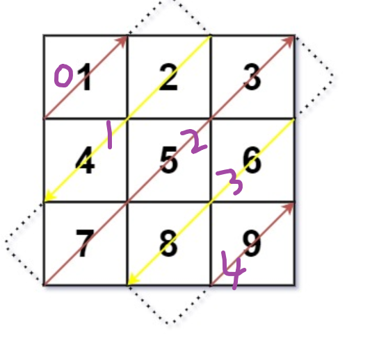

**规律二：**

当 元素**从下往上**遍历时（i为偶数），其实也可以发现 他的**行是逐渐递减**的，**列是逐渐递加**的

> 例如：
>
> 遍历第二条对角线的元素： mat\[2][0]、 mat\[1][1]、 mat\[0][2]
>
> 行的变化：2——> 1 ——> 0
>
> 列的变化: 0 ——> 1 ——> 2

当 元素**从上往下**遍历时，其实也可以发现 他的**行是逐渐递加**的，**列是逐渐递减**的

> 例如：
>
> 遍历第一条对角线的元素： mat\[0][1]、 mat\[1][0]
>
> 行的变化：0 ——> 1
>
> 列的变化: 1 ——> 0


**规律三**：

知道了对角线的规律、每个元素的行和列的变化规律，我们还需要知道每条对角线的起点元素的位置。

当 元素**从下往上**遍历时（i为偶数），分为俩种情况：

- 当 i < m，对角线元素的起点位置为：$（i，0）$
- 当 i >= m, 对角线元素的起点位置为：$（m-1, i-m+1）$

当元素从上往下遍历时 （i为奇数），分为俩种情况：

- 当 i < n，对角线元素的起点位置为：$（0，i）$
- 当 i >= n, 对角线元素的起点位置为：$（ i-n+1,n-1）$

**当我第一次看到这里时，其实是很懵B的，有俩个疑问**：

- 1、为什么要和m比？为什么要和n比？
- 2、起点位置又是怎么来的？

**问题说明：**

当元素**从下往上**遍历时（i为偶数），通过下图可以看出,

- 对角线以上，起点元素的行坐标是和 i 相等的，而它的列坐标不变，一直是0，因此当  i < m，起点元素的坐标为 $（i，0）$
- 对角线以下，无论有几条，起点元素的行坐标一直是  m-1 ，也就是最后一行，而它的列坐标相较于前一条对角线 的起点元素 递增加一， i - m + 1。 因此当  i >= m，起点元素的坐标为 $（ i-n+1,n-1）$

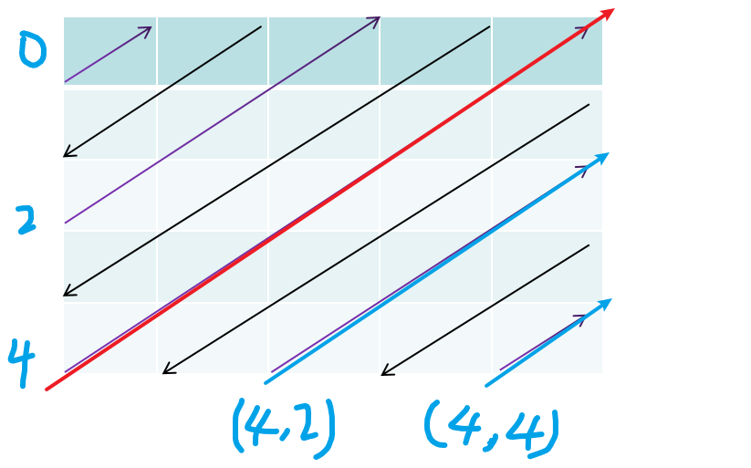


当元素**从上往下**遍历时（i为奇数），通过下图可以看出, 逻辑和上面的一样：

- 对角线以上，行坐标一直是0，列坐标等于 i ，因此起点元素的位置为：$（0，i）$
- 对角线以下，列坐标一直都是最后一列，即 n-1 ，行坐标 = 前一条对角线起点元素行坐标 + 1 ，即 i-n+1，因此最终位置为 $（ i-n+1,n-1）$

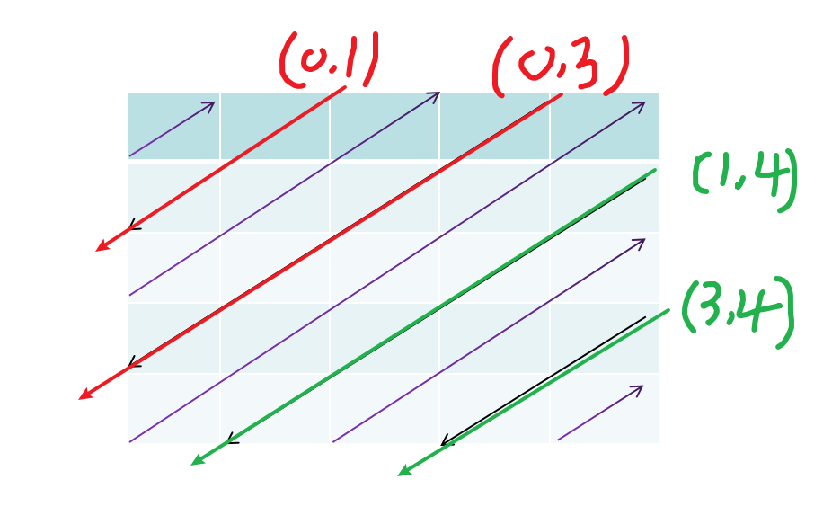

### 代码实现

```java
class Solution {
    public int[] findDiagonalOrder(int[][] mat) {
        int m = mat.length;
        int n = mat[0].length;
        int[] res = new int[m * n];
        int index = 0;

        // 遍历对角线
        for (int i = 0; i < m + n - 1; i++) {
            if (i % 2 == 1) {
                // i是奇数，从上到下
                int x = i < n ? 0 : i - n + 1;
                int y = i < n ? i : n - 1;
                while (x < m && y >= 0) {
                    res[index++] = mat[x][y];
                    x++;
                    y--;
                }
            } else {
                // i是偶数，从下到上
                int x = i < m ? i : m - 1;
                int y = i < m ? 0 : i - m + 1;
                while(y < n && x >=0){
                    res[index++] = mat[x][y];
                    x--;
                    y++;
                }
            }
        }
        return res;
    }
}
```

## [485. 最大连续 1 的个数](https://leetcode.cn/problems/max-consecutive-ones/)

给定一个二进制数组 `nums` ， 计算其中最大连续 `1` 的个数。


**示例 1：**

```
输入：nums = [1,1,0,1,1,1]
输出：3
解释：开头的两位和最后的三位都是连续 1 ，所以最大连续 1 的个数是 3.
```

**示例 2:**

```
输入：nums = [1,0,1,1,0,1]
输出：2
```


**提示：**

- `1 <= nums.length <= 105`
- `nums[i]` 不是 `0` 就是 `1`.

### 思路分析

遍历 $nums$ 数组，使用  $count$ 变量累加连续1的个数， $res$ 保存最大的连续1的个数。

遇到不为1的元素停止，对 $count、res$ 去最大值，否则一直累加 $count$

在遍历完 $nums$ ,  需要在对$count、res$ 去最大值，防止连续的1在数组的末尾


### 代码实现

```java
    public static int findMaxConsecutiveOnes(int[] nums) {
        // 保存结果
        int res = 0;
        // 保存连续的1的个数
        int count = 0;
        for (int i = 0; i < nums.length; i++) {
            if (nums[i] == 1) {
                count++;
            } else {
                // 如果不相等,计算1的个数
                // 同时将1清0，继续计算下一个连续的1的个数
                res = Math.max(count, res);
                count = 0;
            }
        }
        // 这里在进行比较是为了： 数组中连续的1在数组的末尾
        res = Math.max(count, res);

        return res;
    }

```


## [118. 杨辉三角](https://leetcode.cn/problems/pascals-triangle/)

给定一个非负整数 *`numRows`，*生成「杨辉三角」的前 *`numRows`* 行。

在「杨辉三角」中，每个数是它左上方和右上方的数的和。


**示例 1:**

```
输入: numRows = 5
输出: [[1],[1,1],[1,2,1],[1,3,3,1],[1,4,6,4,1]]
```

**示例 2:**

```
输入: numRows = 1
输出: [[1]]
```


**提示:**

- `1 <= numRows <= 30`


### 思路分析

杨辉三角性质：

- 行数与元素个数相等，即：第n行有n个元素
- 每一行的首元素和尾元素都是1
- 除开首尾元素，每一个元素的和都是它左上方元素和右上方元素的和

### 代码实现

```java
    public static List<List<Integer>> generate(int numRows) {
        ArrayList<List<Integer>> res = new ArrayList<>();
        for (int i = 0; i < numRows; i++) {
            // 每一行
            ArrayList<Integer> row = new ArrayList<>();
            // j表示每一行的元素
            for (int j = 0; j <= i; j++) {
                // 每行的第一个元素，与最后一个元素都是1
                if (j == 0 || j == i) {
                    row.add(1);
                }else {
                    // 除了首尾元素，每一个元素都是左上方与右上方的和
                    row.add(res.get(i-1).get(j-1) + res.get(i-1).get(j));
                }
            }
            res.add(row);
        }
        return  res;
    }

```


## [26. 删除有序数组中的重复项](https://leetcode.cn/problems/remove-duplicates-from-sorted-array/)

给你一个 **非严格递增排列** 的数组 `nums` ，请你**[ 原地](http://baike.baidu.com/item/原地算法)** 删除重复出现的元素，使每个元素 **只出现一次** ，返回删除后数组的新长度。元素的 **相对顺序** 应该保持 **一致** 。然后返回 `nums` 中唯一元素的个数。

考虑 `nums` 的唯一元素的数量为 `k` ，你需要做以下事情确保你的题解可以被通过：

- 更改数组 `nums` ，使 `nums` 的前 `k` 个元素包含唯一元素，并按照它们最初在 `nums` 中出现的顺序排列。`nums` 的其余元素与 `nums` 的大小不重要。
- 返回 `k` 。

**判题标准:**

系统会用下面的代码来测试你的题解:

```
int[] nums = [...]; // 输入数组
int[] expectedNums = [...]; // 长度正确的期望答案

int k = removeDuplicates(nums); // 调用

assert k == expectedNums.length;
for (int i = 0; i < k; i++) {
    assert nums[i] == expectedNums[i];
}
```

如果所有断言都通过，那么您的题解将被 **通过**。


**示例 1：**

```
输入：nums = [1,1,2]
输出：2, nums = [1,2,_]
解释：函数应该返回新的长度 2 ，并且原数组 nums 的前两个元素被修改为 1, 2 。不需要考虑数组中超出新长度后面的元素。
```

**示例 2：**

```
输入：nums = [0,0,1,1,1,2,2,3,3,4]
输出：5, nums = [0,1,2,3,4]
解释：函数应该返回新的长度 5 ， 并且原数组 nums 的前五个元素被修改为 0, 1, 2, 3, 4 。不需要考虑数组中超出新长度后面的元素。
```


**提示：**

- `1 <= nums.length <= 3 * 104`
- `-104 <= nums[i] <= 104`
- `nums` 已按 **非严格递增** 排列


### 思路分析

题意很简单，就是**删除**数组中 重复的元素，并保持**相对顺序**。

什么是相对顺序？比如 2、3， 2在3前面，删除后不能2跑到3后面去。

众所周知，数组中无法删除元素，所以采用的是**快慢指针覆盖的方法**

- 使用 l、r快慢指针
- l 指向重复的元素，r指向替换 l 的元素
- 当 $nums[l]  !=  nums[r] $,  将 r 指向的元素覆盖 l+1指向的元素。即：$nums[l+1] = nums[r]$
- 当 $nums[l]  ==  nums[r] $, 只需要移动 r 指针

**为什么要覆盖 l+1 呢？**

这是因为题目中要求保持相对顺序，l 指针指向的是重复元素的第一个，因此 nums[l+1] = nums[l]

（1）如下图所示，l 作为慢指针，r作为快指针，因此循环条件应该是： r<nums.length

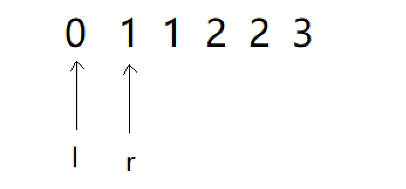

(2)  当 l 和 r 指向的元素相等时，l 指针就停止，r继续移动，直到找到 l 与 r 不相等时，将 r 指向的元素覆盖 l + 1指向的元素

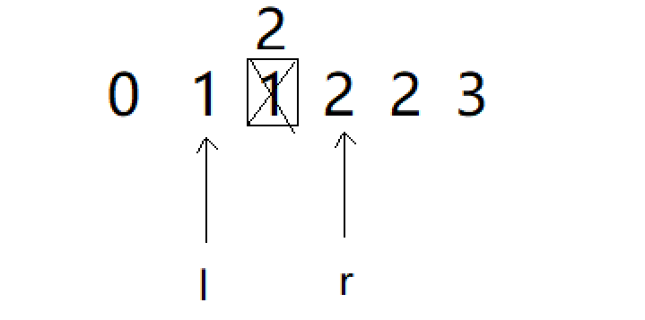

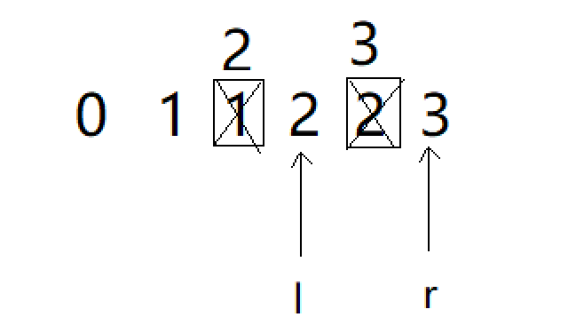

需要注意的是，每次覆盖完，l指针是+1的，所以在执行完，此时的 l 指针应该为4 ，最终返回有效数组的长度为：l+1

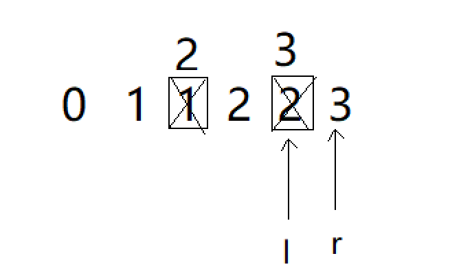

### 代码实现

```java
class Solution {
    public int removeDuplicates(int[] nums) {
        int l = 0;
        int r = 1;

        while(r < nums.length) {
            // 如果不相等， 则覆盖 l+1处的重复元素
            if (nums[l] != nums[r]) {
                nums[l+1] = nums[r];
                // 覆盖完，将l指针右移
                l++;
            }
            r++;
        }
        return l+1;
    }
}
```


## [283. 移动零](https://leetcode.cn/problems/move-zeroes/)

给定一个数组 `nums`，编写一个函数将所有 `0` 移动到数组的末尾，同时保持非零元素的相对顺序。

**请注意** ，必须在不复制数组的情况下原地对数组进行操作。


**示例 1:**

```
输入: nums = [0,1,0,3,12]
输出: [1,3,12,0,0]
```

**示例 2:**

```
输入: nums = [0]
输出: [0]
```


**提示**:

- `1 <= nums.length <= 104`
- `-231 <= nums[i] <= 231 - 1`


**进阶：**你能尽量减少完成的操作次数吗？


### 思路分析

思路和26题一样，仍然使用快慢指针。

l指针指向元素0，r指针指向不为0的元素，将其交换即可。


### 代码实现

需要注意的是，left和right指针都是从0开始

```java
    public void moveZeroes(int[] nums) {
        if(nums == null || nums.length == 1) return;
        // 定义双指针
        int left = 0, right = 0;
        while (right < nums.length) {
            if (nums[right] != 0) {
            // 交换
            int temp = nums[left];
            nums[left] = nums[right];
            nums[right] = temp;
                left++;
            }
            right++;
        }
    }
```


