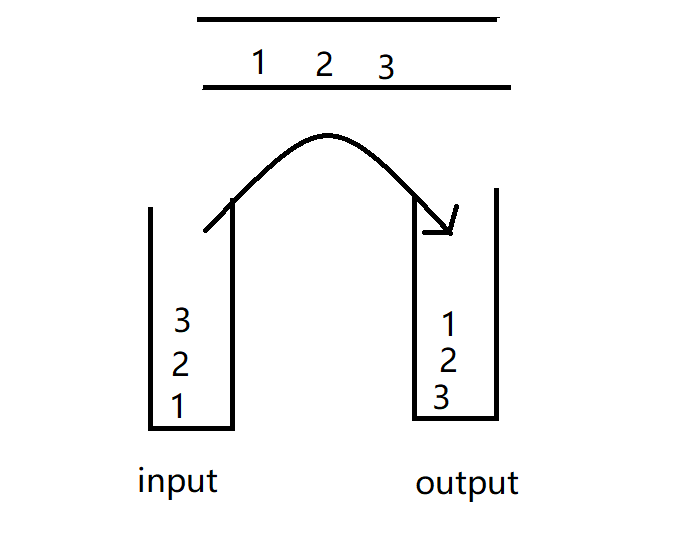

# 栈和队列

## [232. 用栈实现队列](https://leetcode.cn/problems/implement-queue-using-stacks/)

请你仅使用两个栈实现先入先出队列。队列应当支持一般队列支持的所有操作（`push`、`pop`、`peek`、`empty`）：

实现 `MyQueue` 类：

- `void push(int x)` 将元素 x 推到队列的末尾
- `int pop()` 从队列的开头移除并返回元素
- `int peek()` 返回队列开头的元素
- `boolean empty()` 如果队列为空，返回 `true` ；否则，返回 `false`

**说明：**

- 你 **只能** 使用标准的栈操作 —— 也就是只有 `push to top`, `peek/pop from top`, `size`, 和 `is empty` 操作是合法的。
- 你所使用的语言也许不支持栈。你可以使用 list 或者 deque（双端队列）来模拟一个栈，只要是标准的栈操作即可。


**示例 1：**

```
输入：
["MyQueue", "push", "push", "peek", "pop", "empty"]
[[], [1], [2], [], [], []]
输出：
[null, null, null, 1, 1, false]

解释：
MyQueue myQueue = new MyQueue();
myQueue.push(1); // queue is: [1]
myQueue.push(2); // queue is: [1, 2] (leftmost is front of the queue)
myQueue.peek(); // return 1
myQueue.pop(); // return 1, queue is [2]
myQueue.empty(); // return false
```


**提示：**

- `1 <= x <= 9`
- 最多调用 `100` 次 `push`、`pop`、`peek` 和 `empty`
- 假设所有操作都是有效的 （例如，一个空的队列不会调用 `pop` 或者 `peek` 操作）


### 思路分析

使用俩个栈实现队列，一个作为输入栈，一个作为输出栈。

栈为先进后出，队列为先进先出，push 时往输入栈里面push，但是 pop 的时候，需要将输入栈导入到输出栈。此时输出栈的顺序才和队列一致。





### 代码实现

```java
class MyQueue {

    Stack<Integer> inputStack;
    Stack<Integer> outputStack;

    public MyQueue() {
        // 输入栈
       inputStack = new Stack<>();
        // 输出栈
       outputStack = new Stack<>();
    }


    public void push(int x) {
        // 直接压入输入栈
        inputStack.push(x);
    }

    public int pop() {
        // 需要先将输入栈导入输出栈
        exportInputStack();
        return outputStack.pop();
    }

    public int peek() {
        // 需要先将输入栈导入输出栈
        exportInputStack();
        return outputStack.peek();
    }

    public boolean empty() {
        // 俩个栈都为空
          return inputStack.empty() && outputStack.isEmpty();
    }

    // 将输入栈导出到输出栈中
    public void exportInputStack(){
        if (!outputStack.empty()) return;
        while(!inputStack.isEmpty()) {
            outputStack.push(inputStack.pop());
        }
    }
}
```


## [20. 有效的括号](https://leetcode.cn/problems/valid-parentheses/)

给定一个只包括 `'('`，`')'`，`'{'`，`'}'`，`'['`，`']'` 的字符串 `s` ，判断字符串是否有效。

有效字符串需满足：

1. 左括号必须用相同类型的右括号闭合。
2. 左括号必须以正确的顺序闭合。
3. 每个右括号都有一个对应的相同类型的左括号。


**示例 1：**

```
输入：s = "()"
输出：true
```

**示例 2：**

```
输入：s = "()[]{}"
输出：true
```

**示例 3：**

```
输入：s = "(]"
输出：false
```


**提示：**

- `1 <= s.length <= 104`
- `s` 仅由括号 `'()[]{}'` 组成


### 思路分析

根据题意可知，有效的字符串一定是成双成对的，一定**是2的倍数**，并且**左括号后面一定是对应的右括号**！

可以利用栈先进先出的特性，对其进行校验：

- 如果遇到左括号，直接入栈
- 如果遇到右括号，弹栈，判断是否符合()、[]、{} ，若不符合直接返回false

如果是有效的字符串的话，一定是先入栈-弹栈-入栈-弹栈.....这种顺序，那么到最后一个操作时一定是**弹栈**，并且栈一定是**空**的！！！


### 代码实现

```java
    public static boolean isValid(String s) {
        // 如果不是2的倍数，一定不是有效的括号
        if (s.length() % 2 ==1) return false;
        Stack<Character> stack = new Stack<>();
        for (int i = 0; i < s.length(); i++) {
            char c = s.charAt(i);
            // 遇到左括号直接入栈
            if (c == '(' || c == '[' || c == '{') {
                stack.push(s.charAt(i));
            } else {
                // 遇到右括号弹栈，弹出一个左括号
                if (stack.isEmpty()) return false;
                Character pop = stack.pop();
                // 校验
                if (c == ')' && '(' != pop) return false;
                if (c == ']' && '[' != pop) return false;
                if (c == '}' && '{'!= pop) return false;
            }
        }
        return stack.isEmpty();
    }
```


## [1047. 删除字符串中的所有相邻重复项](https://leetcode.cn/problems/remove-all-adjacent-duplicates-in-string/)

给出由小写字母组成的字符串 `S`，**重复项删除操作**会选择两个相邻且相同的字母，并删除它们。

在 S 上反复执行重复项删除操作，直到无法继续删除。

在完成所有重复项删除操作后返回最终的字符串。答案保证唯一。


**示例：**

```
输入："abbaca"
输出："ca"
解释：
例如，在 "abbaca" 中，我们可以删除 "bb" 由于两字母相邻且相同，这是此时唯一可以执行删除操作的重复项。之后我们得到字符串 "aaca"，其中又只有 "aa" 可以执行重复项删除操作，所以最后的字符串为 "ca"。
```


**提示：**

1. `1 <= S.length <= 20000`
2. `S` 仅由小写英文字母组成。


### 思路分析

这个题目其实和 20题：有效的括号 思路一样

- 当stack为空或者遇到不相等的元素，直接入栈
- 遇到相等的元素弹栈，判断下一个元素
- 最后stack中剩下的就是不重复的元素


### 代码实现

```java
    public static String removeDuplicates(String s) {
        Stack<Character> stack = new Stack<>();

        // 将不相等的字符入栈，相等的字符弹栈
        for (int i = 0; i < s.length(); i++) {
            if (stack.isEmpty() || s.charAt(i) != stack.peek()) {
                 stack.push(s.charAt(i));
            } else {
                stack.pop();
            }
        }
        // 剩下的就是不重复的元素
        StringBuilder res = new StringBuilder();
        while (!stack.isEmpty()) {
            res.append(stack.pop());
        }
        return res.reverse().toString();
    }
```


## [150. 逆波兰表达式求值](https://leetcode.cn/problems/evaluate-reverse-polish-notation/)

给你一个字符串数组 `tokens` ，表示一个根据 [逆波兰表示法](https://baike.baidu.com/item/逆波兰式/128437) 表示的算术表达式。

请你计算该表达式。返回一个表示表达式值的整数。

**注意：**

- 有效的算符为 `'+'`、`'-'`、`'*'` 和 `'/'` 。
- 每个操作数（运算对象）都可以是一个整数或者另一个表达式。
- 两个整数之间的除法总是 **向零截断** 。
- 表达式中不含除零运算。
- 输入是一个根据逆波兰表示法表示的算术表达式。
- 答案及所有中间计算结果可以用 **32 位** 整数表示。


**示例 1：**

```
输入：tokens = ["2","1","+","3","*"]
输出：9
解释：该算式转化为常见的中缀算术表达式为：((2 + 1) * 3) = 9
```

**示例 2：**

```
输入：tokens = ["4","13","5","/","+"]
输出：6
解释：该算式转化为常见的中缀算术表达式为：(4 + (13 / 5)) = 6
```

**示例 3：**

```
输入：tokens = ["10","6","9","3","+","-11","*","/","*","17","+","5","+"]
输出：22
解释：该算式转化为常见的中缀算术表达式为：
  ((10 * (6 / ((9 + 3) * -11))) + 17) + 5
= ((10 * (6 / (12 * -11))) + 17) + 5
= ((10 * (6 / -132)) + 17) + 5
= ((10 * 0) + 17) + 5
= (0 + 17) + 5
= 17 + 5
= 22
```


**提示：**

- `1 <= tokens.length <= 104`
- `tokens[i]` 是一个算符（`"+"`、`"-"`、`"*"` 或 `"/"`），或是在范围 `[-200, 200]` 内的一个整数


**逆波兰表达式：**

逆波兰表达式是一种后缀表达式，所谓后缀就是指算符写在后面。

- 平常使用的算式则是一种中缀表达式，如 `( 1 + 2 ) * ( 3 + 4 )` 。
- 该算式的逆波兰表达式写法为 `( ( 1 2 + ) ( 3 4 + ) * )` 。

逆波兰表达式主要有以下两个优点：

- 去掉括号后表达式无歧义，上式即便写成 `1 2 + 3 4 + * `也可以依据次序计算出正确结果。
- 适合用栈操作运算：遇到数字则入栈；遇到算符则取出栈顶两个数字进行计算，并将结果压入栈中


### 思路分析

题目比较简单，只要弄清楚什么是逆波兰表达式即可。需要注意的是除法和减法，不要搞混运算顺序。


### 代码实现

```java
    public static int evalRPN(String[] tokens) {
        Stack<Integer> stack = new Stack<>();
        for (String token : tokens) {
                // 如果是字符，取出俩个数计算，并讲解结果放入栈中
                switch (token){
                    case "*" :
                        stack.push( stack.pop() * stack.pop());
                        break;
                    case "/" :
                        // 除法要特殊处理，先弹出来的是除数，后弹出来的是被除数
                        Integer op1 = stack.pop();
                        Integer op2 = stack.pop();
                        stack.push( op2 / op1);
                        break;
                    case "+" :
                        stack.push( stack.pop() + stack.pop());
                        break;
                    case "-" :
                        // 减法也要特殊处理，先弹出来的是减数，后弹出来的是被减数
                        stack.push( - stack.pop() + stack.pop());
                        break;
                    default:  stack.push(Integer.valueOf(token));
                }
        }
        return  stack.pop();
    }
```


## ☆[239. 滑动窗口最大值](https://leetcode.cn/problems/sliding-window-maximum/)

给你一个整数数组 `nums`，有一个大小为 `k` 的滑动窗口从数组的最左侧移动到数组的最右侧。你只可以看到在滑动窗口内的 `k` 个数字。滑动窗口每次只向右移动一位。

返回 *滑动窗口中的最大值* 。


**示例 1：**

```
输入：nums = [1,3,-1,-3,5,3,6,7], k = 3
输出：[3,3,5,5,6,7]
解释：
滑动窗口的位置                最大值
---------------               -----
[1  3  -1] -3  5  3  6  7       3
 1 [3  -1  -3] 5  3  6  7       3
 1  3 [-1  -3  5] 3  6  7       5
 1  3  -1 [-3  5  3] 6  7       5
 1  3  -1  -3 [5  3  6] 7       6
 1  3  -1  -3  5 [3  6  7]      7
```

**示例 2：**

```
输入：nums = [1], k = 1
输出：[1]
```


**提示：**

- `1 <= nums.length <= 105`
- `-104 <= nums[i] <= 104`
- `1 <= k <= nums.length`


### 思路分析

该题目使用单调递减队列比较容易理解一些。我们只需要**维护队首最大的元素**即可，同时要保证队列中的元素**保持递减**。

那么该如何维护呢？通过题意我们可以发现，每次移动窗口，都是在pop、push，那么在push 和 pop 要遵循以下原则：

1. pop():
    1. 保证队列的单调递减，将 **比当前值小的元素都弹出**
    2. 判断队首元素是否在该滑动区间内 , 如果不是直接弹出队首元素
2. push：
    1. 保证push的元素一定是当前队列中的最小值 或者 队列为空


**例**

> nums = [1,3,-1,-3,5,3,6,7], k = 3
>
> 初始状态设[L,R] = [0,0],队列 Q ={}，res = []
>
> i = 0, nums[0] = 1, 队列为空，直接入队 Q = {1}
>
> i = 1, nums[1] = 3, 3 > 1 遇见比当前值小的，则依次弹出后加入，Q = {3}
>
> i = 2, nums[2] = -1， -1 < 3, 直接入队，Q = {3,-1},此时L=0，R=2，i在区间之内，则res = [3]
>
>
>
> i=3,nums[3]=-3。队尾值为-1，-3<-1，直接加入。队列：{3,-1,-3}。队首3对应的下标为1，L=1,R=3，有效。result=[3,3]
>
> i=4,nums[4]=5。队尾值为-3，5>-3，依次弹出后加入。队列：{5}。此时L=2,R=4，有效。result=[3,3,5]
>
> i=5,nums[5]=3。队尾值为5，3<5，直接加入。队列：{5,3}。此时L=3,R=5，有效。result=[3,3,5,5]
>
> i=6,nums[6]=6。队尾值为3，6>3，依次弹出后加入。队列：{6}。此时L=4,R=6，有效。result=[3,3,5,5,6]
>
> i=7,nums[7]=7。队尾值为6，7>6，弹出队尾值后加入。队列：{7}。此时L=5,R=7，有效。result=[3,3,5,5,6,7]

通过模拟可以发现：

- $R = i， L = R-k+1 = i- k + 1$， 判断队首元素是否在[L,R] 之内，只需要判断队首元素的下标是否大于 $ i-k+1$
- 在队里中存储元素下标更为访问，因为要判断队首元素是否在滑动窗口之内！


### **代码实现**

```java
class Solution {
    public int[] maxSlidingWindow(int[] nums, int k) {
        int length = nums.length;
        ArrayDeque<Integer> queue = new ArrayDeque<>();
        int[] res = new int[length - k + 1];
        int index = 0;

        for (int i = 0; i < length; i++) {

            // 将队列中比当前元素小的都弹出，保证当前值为最小值或者队列为空
            while (!queue.isEmpty() && nums[queue.peekLast()] < nums[i]) queue.pollLast();

            // 增加元素到队尾
            queue.offer(i);

            // 判断队首元素是否在滑动区间内[i-k+1,i]，若不在则弹出队首的元素
            if (queue.peek() < i - k + 1) queue.poll();

            if (i - k + 1 >= 0) {
                // 获取队列最大值，由于是单调递减，第一个元素就是最大值
                res[index++] = nums[queue.peek()];
            }
        }
        return res;
    }
}
```


## [347. 前 K 个高频元素](https://leetcode.cn/problems/top-k-frequent-elements/)

给你一个整数数组 `nums` 和一个整数 `k` ，请你返回其中出现频率前 `k` 高的元素。你可以按 **任意顺序** 返回答案。


**示例 1:**

```
输入: nums = [1,1,1,2,2,3], k = 2
输出: [1,2]
```

**示例 2:**

```
输入: nums = [1], k = 1
输出: [1]
```


**提示：**

- `1 <= nums.length <= 105`
- `k` 的取值范围是 `[1, 数组中不相同的元素的个数]`
- 题目数据保证答案唯一，换句话说，数组中前 `k` 个高频元素的集合是唯一的


**进阶：**你所设计算法的时间复杂度 **必须** 优于 `O(n log n)` ，其中 `n` 是数组大小。


### 思路分析

1. 统计`nums` 数组中每个数字出现的频率

   类似这种统计，我们都可以使用`map`来存储 , 这道题key存储元素，value存储每个元素出现的次数

2. 需要对`map`中的元素按照 `value` 大小进行排序

   最重要的就是该步，时间复杂度也都取决于该步，可以使用冒泡, 选择, 插入等等等，但是他们的复杂度 >= $O(nlogn)$

   因此再次步，我们可以使用 **优先级队列**  当做存储容器，其实现方式通常由 **小顶堆、大顶堆**

    - 小顶堆：非叶子节点比左右孩子结点小
    - 大顶堆：非叶子节点比左右孩子结点大

   在 Java中可以使用`PriorityQueue` 表示优先级队列

3. 获取优先级队列前k个元素


### 代码实现

```java
    public static int[] topKFrequent(int[] nums, int k) {
        HashMap<Integer, Integer> table = new HashMap<>();
        // 统计nums中每个数字出现的次数
        for (int num : nums) {
            // getOrDefault 获取value，如果不存在就存入默认值
            table.put(num,table.getOrDefault(num,0) + 1);
        }

        // 使用优先级队列进行排序
        /*
        * PriorityQueue默认创建的就是小顶堆，即从小到大排序
        * (o1,o2) -> o2[0] - o1[0] : 创建的是大顶堆，即从大到小排序
        * */
        PriorityQueue<int[]> pq = new PriorityQueue<>((o1,o2) -> o2[0] - o1[0]);
        for (Entry<Integer, Integer> entry : table.entrySet()) {
            // 由于创建的大顶堆，比较数组中第一个元素。因此按照value值进行排序
            pq.offer(new int[]{entry.getValue(),entry.getKey()});
        }

        // 获取前k个元素
        int[] ints = new int[k];
        for (int i = 0; i < k; i++) {
            ints[i] = pq.poll()[1];
        }

        return  ints;
    }
```


## 总结

此篇中，最重要的是学到了 `单调队列 `和 `优先级队列`

单调队列通常用`双端队列` 实现，需要**手动**保持队列中的元素单调性，单调递增或者递减，通常用于解决 滑动窗口 类的问题。

优先级队列通常用 `小顶堆、大顶堆`来实现, 在插入删除时**自动**保持顺序


# 
