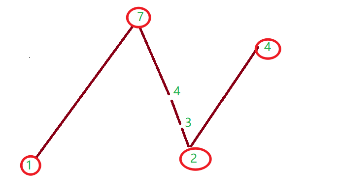
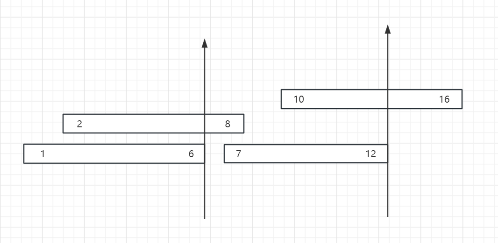
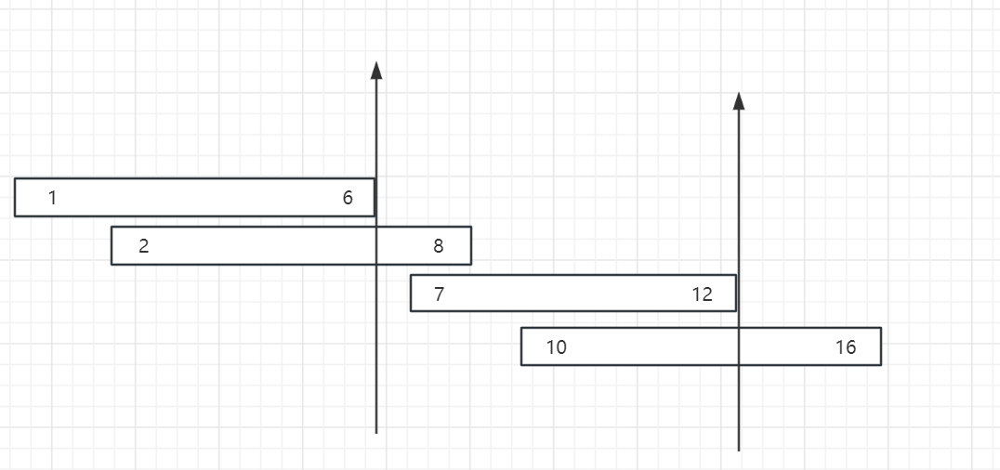
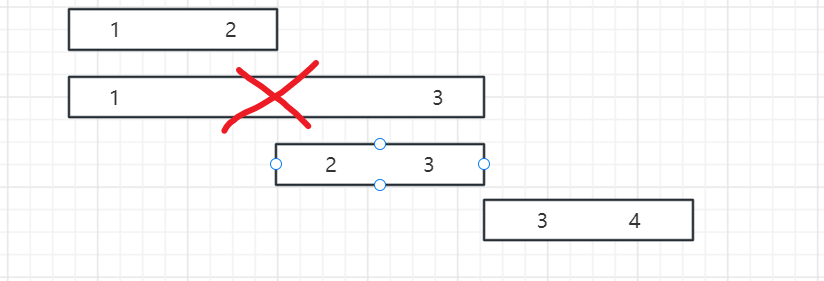
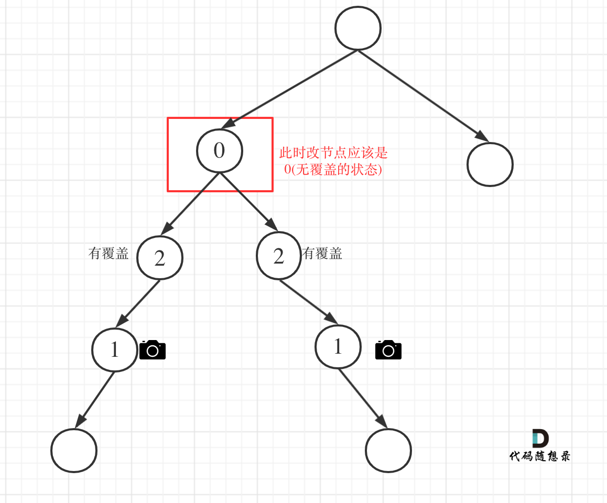

# 贪心算法

**贪心的本质是选择每一阶段的局部最优，从而达到全局最优**。

例如，有一堆钞票，你可以拿走十张，如果想达到最大的金额，你要怎么拿？

指定每次拿最大的，最终结果就是拿走最大数额的钱。

每次拿最大的就是局部最优，最后拿走最大数额的钱就是推出全局最优。


**贪心算法一般分为如下四步**：

- 将问题分解为若干个子问题
- 找出适合的贪心策略
- 求解每一个子问题的最优解
- 将局部最优解堆叠成全局最优解

这个四步其实过于理论化了，我们平时在做贪心类的题目 很难去按照这四步去思考，真是有点“鸡肋”。

做题的时候，只要想清楚 局部最优 是什么，如果推导出全局最优，其实就够了。


## [455. 分发饼干](https://leetcode.cn/problems/assign-cookies/)

假设你是一位很棒的家长，想要给你的孩子们一些小饼干。但是，每个孩子最多只能给一块饼干。

对每个孩子 `i`，都有一个胃口值 `g[i]`，这是能让孩子们满足胃口的饼干的最小尺寸；并且每块饼干 `j`，都有一个尺寸 `s[j]` 。如果 `s[j] >= g[i]`，我们可以将这个饼干 `j` 分配给孩子 `i` ，这个孩子会得到满足。你的目标是尽可能满足越多数量的孩子，并输出这个最大数值。


**示例 1:**

```
输入: g = [1,2,3], s = [1,1]
输出: 1
解释: 
你有三个孩子和两块小饼干，3个孩子的胃口值分别是：1,2,3。
虽然你有两块小饼干，由于他们的尺寸都是1，你只能让胃口值是1的孩子满足。
所以你应该输出1。
```

**示例 2:**

```
输入: g = [1,2], s = [1,2,3]
输出: 2
解释: 
你有两个孩子和三块小饼干，2个孩子的胃口值分别是1,2。
你拥有的饼干数量和尺寸都足以让所有孩子满足。
所以你应该输出2.
```


**提示：**

- `1 <= g.length <= 3 * 104`
- `0 <= s.length <= 3 * 104`
- `1 <= g[i], s[j] <= 231 - 1`


### 思路分析

首先要清楚该题能不能用贪心算法来实现。注意：与其说贪心算法是一种算法，不如说它是一种思想。

即： 每步找到最优解，从而达到全局的最优

**对于该题来说，每一步的最优解是什么？**

在我看来，就是尽量将尺寸大的饼干分配给胃口最大的孩子，这样即不会浪费饼干，也会让孩子得到满足！！


```java
class Solution {
    public int findContentChildren(int[] g, int[] s) {
        if (g.length == 0 || s.length == 0) return 0;
        // 进行升序序,原则就是尽量将 大尺寸的饼干分发给胃口大的孩子
        Arrays.sort(g);
        Arrays.sort(s);
        // 记录孩子满足的个数
        int res = 0;
        // s的索引
        int index = s.length-1;

        for (int i = g.length-1; i >=0 && index >=0;i--) {
            if (s[index] >= g[i]) {
                // 满足胃口，继续为下一个孩子分配饼干
                res++;
                index--;
            }
            // 不满足胃口，继续遍历下一个孩子
        }
        return res;
    }
}
```

## [376. 摆动序列](https://leetcode.cn/problems/wiggle-subsequence/)

如果连续数字之间的差严格地在正数和负数之间交替，则数字序列称为 **摆动序列 。**第一个差（如果存在的话）可能是正数或负数。仅有一个元素或者含两个不等元素的序列也视作摆动序列。

- 例如， `[1, 7, 4, 9, 2, 5]` 是一个 **摆动序列** ，因为差值 `(6, -3, 5, -7, 3)` 是正负交替出现的。
- 相反，`[1, 4, 7, 2, 5]` 和 `[1, 7, 4, 5, 5]` 不是摆动序列，第一个序列是因为它的前两个差值都是正数，第二个序列是因为它的最后一个差值为零。

**子序列** 可以通过从原始序列中删除一些（也可以不删除）元素来获得，剩下的元素保持其原始顺序。

给你一个整数数组 `nums` ，返回 `nums` 中作为 **摆动序列** 的 **最长子序列的长度** 。


**示例 1：**

```
输入：nums = [1,7,4,9,2,5]
输出：6
解释：整个序列均为摆动序列，各元素之间的差值为 (6, -3, 5, -7, 3) 。
```

**示例 2：**

```
输入：nums = [1,17,5,10,13,15,10,5,16,8]
输出：7
解释：这个序列包含几个长度为 7 摆动序列。
其中一个是 [1, 17, 10, 13, 10, 16, 8] ，各元素之间的差值为 (16, -7, 3, -3, 6, -8) 。
```

**示例 3：**

```
输入：nums = [1,2,3,4,5,6,7,8,9]
输出：2
```


**提示：**

- `1 <= nums.length <= 1000`
- `0 <= nums[i] <= 1000`


**进阶：**你能否用 `O(n)` 时间复杂度完成此题?

### 思路分析

求摆动序列的长度，其实就是求出在这个数组中的**波峰和波谷**的数量总和，要么就跳过上升到波峰的那些结点，要么跳过下降的波谷的那些结点。

**贪心算法：**

局部最优解：每次只记录波峰或波谷。全局最优解：整个nums数组波峰和波谷的数量。

**例如**：[1，7,4,3,2,4]

sum值用于记录摆动的个数，从数组第二个元素开始遍历，每一层循环中做的事有：

1. 跳过平坡，即遇到相等元素直接跳过
2. 记录上一次是上坡还是下坡
3. 若上一次是上坡，则只记录下坡，反之则只记录上坡 相当于只记录上坡和下坡数之和。



```java
class Solution {
   public int wiggleMaxLength(int[] nums) {
       // 记录波峰和波谷的数量
       int sum = 1;
       // 记录是上坡还是下坡
       int flag = 0;
       for (int i = 1; i < nums.length; i++) {
           // 当前元素比上一个元素大，当前为上坡，并且上一次是下坡，则符合摆动序列
           if (nums[i] > nums[i - 1] && (flag == 0 || flag == -1)) {
               sum++;
               flag = 1;
           } else if (nums[i] < nums[i - 1] && (flag == 0 || flag == 1)) {
            //     当前元素比上一个元素小，当前是下坡，并且上一个是上坡，则符合摆动序列
               sum++;
               flag = -1;
           }
       }
       return sum;
   }
}
```


## [53. 最大子数组和](https://leetcode.cn/problems/maximum-subarray/)

给你一个整数数组 `nums` ，请你找出一个具有最大和的连续子数组（子数组最少包含一个元素），返回其最大和。

**子数组** 是数组中的一个连续部分。


**示例 1：**

```
输入：nums = [-2,1,-3,4,-1,2,1,-5,4]
输出：6
解释：连续子数组 [4,-1,2,1] 的和最大，为 6 。
```

**示例 2：**

```
输入：nums = [1]
输出：1
```

**示例 3：**

```
输入：nums = [5,4,-1,7,8]
输出：23
```


**提示：**

- `1 <= nums.length <= 105`
- `-104 <= nums[i] <= 104`


**进阶：**如果你已经实现复杂度为 `O(n)` 的解法，尝试使用更为精妙的 **分治法** 求解。


### 思路分析

**贪心算法**

对于求最大子数组和，毫无疑问负数会拉低 最大的和。

假设我们用 count 保存子数组和，如果 count +nums[i]  出现  <= 0 的情况, 就立马舍弃 下标为 i 的元素，重新找 最大子数组 起始点。

在舍弃之前，我们还需要进行判断，万一  count 就是最大子数组的和呢？ 因此我们还需要一个变量 res 来记录最大子数组的和。

```java
 res = Math.max(count,res);
```


**完整代码**

```java
    public int maxSubArray(int[] nums) {
        // 记录最终结果
        int res = Integer.MIN_VALUE;
        // 记录子数组和
        int count = 0;
        for (int i = 0; i < nums.length; i++) {
            count+=nums[i];
            res = Math.max(count,res);
            if (count <= 0) count = 0; // 如果当前count为负数了,将count进行重置。继续找下一个子数组的起始点。
        }
        return res;
    }
```


## [55. 跳跃游戏](https://leetcode.cn/problems/jump-game/)

给你一个非负整数数组 `nums` ，你最初位于数组的 **第一个下标** 。数组中的每个元素代表你在该位置可以跳跃的最大长度。

判断你是否能够到达最后一个下标，如果可以，返回 `true` ；否则，返回 `false` 。


**示例 1：**

```
输入：nums = [2,3,1,1,4]
输出：true
解释：可以先跳 1 步，从下标 0 到达下标 1, 然后再从下标 1 跳 3 步到达最后一个下标。
```

**示例 2：**

```
输入：nums = [3,2,1,0,4]
输出：false
解释：无论怎样，总会到达下标为 3 的位置。但该下标的最大跳跃长度是 0 ， 所以永远不可能到达最后一个下标。
```


**提示：**

- `1 <= nums.length <= 104`
- `0 <= nums[i] <= 105`

### 思路分析

注意题目中这句话：**数组中的每个元素代表你在该位置可以跳跃的最大长度。**

也就是说，假如元素等于3，可以选择跳1步，也可以选择跳2步、3步

既然如此，我们可以将 nums 数组每个元素的能够跳的最远距离都计算一遍，用一个变量保存。 如果能跳到最后就说明成功了。

```java
    public boolean canJump(int[] nums) {
        int cover = 0;
        // 把每一个位置都做为起跳点试一下
        for (int i = 0; i < nums.length; i++) {
            // i>cover 说明 i的位置比最远距离还要远，因此永远也到不了
            if (i > cover) return false;
            // i+nums[i]当前位置能够到达的最远距离，不断进行更新
            cover = Math.max(cover,i+nums[i]);
        }
        return true;
    }
```

**优化**

上面是将所有的起跳点都尝试一遍，但如果当最大距离大于数组的长度了，就没有必要在继续尝试了

```java
    public boolean canJump(int[] nums) {
        int cover = 0;
        // 把每一个位置都做为起跳点试一下
        for (int i = 0; i < nums.length; i++) {
           
            // i>cover 说明 i的位置比最远距离还要远，因此永远也到不了
            if (i > cover) return false;
            // i+nums[i]当前位置能够到达的最远距离，不断进行更新
            cover = Math.max(cover,i+nums[i]);
            // 最远位置超过了数组长度，就没有必要在继续尝试了
             if(cover >= nums.length-1) return true;
        }
        return true;
    }
```


**另一种思想**

我们以第一个元素为起跳点，然后在第一个元素所能覆盖的范围内，找到每一个元素能够跳跃的最远距离。如果在此范围内，最远距离仍然不能覆盖整个数组，即到不了终点。

```java
    public boolean canJump1(int[] nums) {
        if (nums.length == 1) return true;
        int cover = 0;
        for (int i = 0; i <= cover; i++) {
            // 更新在cover范围内每个元素能够到达的最远距离
            cover = Math.max(cover, i + nums[i]);
            if (cover >= nums.length - 1) return true;
        }
        return false;
    }
```


## [45. 跳跃游戏 II](https://leetcode.cn/problems/jump-game-ii/)

给定一个长度为 `n` 的 **0 索引**整数数组 `nums`。初始位置为 `nums[0]`。

每个元素 `nums[i]` 表示从索引 `i` 向前跳转的最大长度。换句话说，如果你在 `nums[i]` 处，你可以跳转到任意 `nums[i + j]` 处:

- `0 <= j <= nums[i]`
- `i + j < n`

返回到达 `nums[n - 1]` 的最小跳跃次数。生成的测试用例可以到达 `nums[n - 1]`。


**示例 1:**

```
输入: nums = [2,3,1,1,4]
输出: 2
解释: 跳到最后一个位置的最小跳跃数是 2。
     从下标为 0 跳到下标为 1 的位置，跳 1 步，然后跳 3 步到达数组的最后一个位置。
```

**示例 2:**

```
输入: nums = [2,3,0,1,4]
输出: 2
```


**提示:**

- `1 <= nums.length <= 104`
- `0 <= nums[i] <= 1000`
- 题目保证可以到达 `nums[n-1]`

### 思路分析

这道题相较于 55 的难点就是要统计` 跳跃的次数` 。

我们可以利用俩个变量：

- curDistance：用来记录当前位置能够覆盖的最远距离
- nextDistance：用来记录下一步能够覆盖的元素距离

当 i 指针指向 curDistance 时，即 i == curDistance，就说明已经走到当前位置能够覆盖的最远距离了，需要进行下一个跳跃。因此将 `curDistance` 更新为 `nextDistance`，相当于进行了一次跳跃。这个操作是为了确保我们在每一步都选择能够使下一步覆盖的范围最大化的位置。

```java
    public int jump(int[] nums) {
        if (nums.length == 1) return 0;
        // 下一步覆盖的最大范围
        int nextDistance = 0;
        // 当前位置覆盖的最大范围
        int curDistance = 0;
        // 跳跃次数
        int step  = 0;
        for (int i = 0; i < nums.length; i++) {
            // 不断更新下一步所覆盖的最大范围
            nextDistance = Math.max(nextDistance,i+nums[i]);
            // 如果i到了当前位置的最大范围，说明需要进行下一次跳跃。将当前位置所覆盖的范围更新为下一步覆盖的范围
            if (i == curDistance){
                step++;
                curDistance = nextDistance;
                if (nextDistance >= nums.length) return step;
            }
        }
        return step;
    }
```


## [1005. K 次取反后最大化的数组和](https://leetcode.cn/problems/maximize-sum-of-array-after-k-negations/)

给你一个整数数组 `nums` 和一个整数 `k` ，按以下方法修改该数组：

- 选择某个下标 `i` 并将 `nums[i]` 替换为 `-nums[i]` 。

重复这个过程恰好 `k` 次。可以多次选择同一个下标 `i` 。

以这种方式修改数组后，返回数组 **可能的最大和** 。


**示例 1：**

```
输入：nums = [4,2,3], k = 1
输出：5
解释：选择下标 1 ，nums 变为 [4,-2,3] 。
```

**示例 2：**

```
输入：nums = [3,-1,0,2], k = 3
输出：6
解释：选择下标 (1, 2, 2) ，nums 变为 [3,1,0,2] 。
```

**示例 3：**

```
输入：nums = [2,-3,-1,5,-4], k = 2
输出：13
解释：选择下标 (1, 4) ，nums 变为 [2,3,-1,5,4] 。
```


**提示：**

- `1 <= nums.length <= 104`
- `-100 <= nums[i] <= 100`
- `1 <= k <= 104`

### 思路分析

想要求得 可能的最大和，那我们尽可能的去反转`绝对值较大的负数` ，若没有负数或者反转完 k 还有剩余，那我们**尽可能反转较小的数**。这俩步就是我们局部最优解。

1. 首先我们对数组按照绝对值进行**升序**
2. 从头到尾依次进行反转并且k-- ，反转的条件就是 必须是负数。正数反转没有意义
3. 反转完，若 k 还有剩余
    1. 若k最后为奇数，将数组最后一个元素，也就是最小的值进行反转。
    2. 若k最后为偶数个，不用进行反转了，因为反转偶数次仍然是它本身。
4. 最后求和

```java
    public int largestSumAfterKNegations(int[] nums, int k) {
        // 局部最优：对元素为负数并且绝对值较大的元素进行取反
        // 根据绝对值大小，进行排序
        nums = Arrays.stream(nums).boxed().sorted((a,b) -> Math.abs(b) - Math.abs(a)).mapToInt(Integer::intValue).toArray();
        for (int i = 0; i < nums.length; i++) {
            // 将绝对值较大的负数进行反转
            if (nums[i] < 0 && k > 0) {
                nums[i] = -nums[i];
                k--;
            }
        }
        // 若k还有剩余，将最小的数进行反转
        // k %2 == 1 判断是奇数还是偶数，偶数次反转等于它本身
        if (k %2 == 1) nums[nums.length -1 ] = - nums[nums.length -1 ];
        // 求和
        return Arrays.stream(nums).sum();
    }
```


## [134. 加油站](https://leetcode.cn/problems/gas-station/)

在一条环路上有 `n` 个加油站，其中第 `i` 个加油站有汽油 `gas[i]` 升。

你有一辆油箱容量无限的的汽车，从第 `i` 个加油站开往第 `i+1` 个加油站需要消耗汽油 `cost[i]` 升。你从其中的一个加油站出发，开始时油箱为空。

给定两个整数数组 `gas` 和 `cost` ，如果你可以按顺序绕环路行驶一周，则返回出发时加油站的编号，否则返回 `-1` 。如果存在解，则 **保证** 它是 **唯一** 的。


**示例 1:**

```
输入: gas = [1,2,3,4,5], cost = [3,4,5,1,2]
输出: 3
解释:
从 3 号加油站(索引为 3 处)出发，可获得 4 升汽油。此时油箱有 = 0 + 4 = 4 升汽油
开往 4 号加油站，此时油箱有 4 - 1 + 5 = 8 升汽油
开往 0 号加油站，此时油箱有 8 - 2 + 1 = 7 升汽油
开往 1 号加油站，此时油箱有 7 - 3 + 2 = 6 升汽油
开往 2 号加油站，此时油箱有 6 - 4 + 3 = 5 升汽油
开往 3 号加油站，你需要消耗 5 升汽油，正好足够你返回到 3 号加油站。
因此，3 可为起始索引。
```

**示例 2:**

```
输入: gas = [2,3,4], cost = [3,4,3]
输出: -1
解释:
你不能从 0 号或 1 号加油站出发，因为没有足够的汽油可以让你行驶到下一个加油站。
我们从 2 号加油站出发，可以获得 4 升汽油。 此时油箱有 = 0 + 4 = 4 升汽油
开往 0 号加油站，此时油箱有 4 - 3 + 2 = 3 升汽油
开往 1 号加油站，此时油箱有 3 - 3 + 3 = 3 升汽油
你无法返回 2 号加油站，因为返程需要消耗 4 升汽油，但是你的油箱只有 3 升汽油。
因此，无论怎样，你都不可能绕环路行驶一周。
```


**提示:**

- `gas.length == n`
- `cost.length == n`
- `1 <= n <= 105`
- `0 <= gas[i], cost[i] <= 104`

### 思路分析

首先我们要知道，要想环绕走一圈，那么不管经过哪个加油站，油箱的剩余油量必然是 `>= 0`， 并且走完一圈后，油箱的总剩余油量一定是 `>= 0`

假设我用 remain 表示从起始点到当前加油站所剩余油量

total 表示总的剩余油量

那么就有：`remain  += gas[i] - cost[i]`   ，`total += gas[i] - cost[i]`

那么对于 remain 无非就有俩种情况：

1. remain < 0 :  此时油量不足，也就是说无论从 [0,i] 哪个加油站开始走，到第 i 个加油站时，油量一定是不足的。 因此我们就可以假设将起始点设在` i+1` 的加油站。假设用 start 表示，那么就有` start = i+1` ，同时将 remain 置0，重新从下一个加油站开始累加。
2. remain >= 0 , 此时油量充足，继续向下一个加油站走

遍历完得到的 total >=0 ，那么起始点就是我们记录的  `start` ，若 <0 则说明无解

```java
    public int canCompleteCircuit(int[] gas, int[] cost) {
        int remain = 0; // 到当前加油站所剩油量
        int total = 0; // 总剩余油量
        int start = 0; // 起始点
        for (int i = 0; i < gas.length; i++) {
            // 记录经过每个加油站时所剩余的油量
            remain += gas[i] - cost[i];
            // 记录总的剩余油量，如果i为起始点，可以走完一圈，那么 total 必然是 >=0的
            total +=gas[i] - cost[i];
            if (remain < 0) {
                // 经过当前加油站时，油量不够,说明[0,i] 这区间内的加油站都不能作为起始点。因此更新新的起始点
                start = i+1;
                remain = 0;
            }
        }
        // total<0不能走完一圈
        return  total < 0 ? -1 : start;
    }
```


## [860. 柠檬水找零](https://leetcode.cn/problems/lemonade-change/)

在柠檬水摊上，每一杯柠檬水的售价为 `5` 美元。顾客排队购买你的产品，（按账单 `bills` 支付的顺序）一次购买一杯。

每位顾客只买一杯柠檬水，然后向你付 `5` 美元、`10` 美元或 `20` 美元。你必须给每个顾客正确找零，也就是说净交易是每位顾客向你支付 `5` 美元。

注意，一开始你手头没有任何零钱。

给你一个整数数组 `bills` ，其中 `bills[i]` 是第 `i` 位顾客付的账。如果你能给每位顾客正确找零，返回 `true` ，否则返回 `false` 。


**示例 1：**

```
输入：bills = [5,5,5,10,20]
输出：true
解释：
前 3 位顾客那里，我们按顺序收取 3 张 5 美元的钞票。
第 4 位顾客那里，我们收取一张 10 美元的钞票，并返还 5 美元。
第 5 位顾客那里，我们找还一张 10 美元的钞票和一张 5 美元的钞票。
由于所有客户都得到了正确的找零，所以我们输出 true。
```

**示例 2：**

```
输入：bills = [5,5,10,10,20]
输出：false
解释：
前 2 位顾客那里，我们按顺序收取 2 张 5 美元的钞票。
对于接下来的 2 位顾客，我们收取一张 10 美元的钞票，然后返还 5 美元。
对于最后一位顾客，我们无法退回 15 美元，因为我们现在只有两张 10 美元的钞票。
由于不是每位顾客都得到了正确的找零，所以答案是 false。
```


**提示：**

- `1 <= bills.length <= 105`
- `bills[i]` 不是 `5` 就是 `10` 或是 `20`

### 思路分析

对于该题无非有三种情况：

- 收到5元，直接收下
- 收到10元，找回5元
- 收到20元，优先找：10+5，若10不够则找 3个5元
    - 为什么要先找10+5呢？ 这是因为10元只能找给20元，而5元则比较万能，这也是贪心的局部最优解

```java
    public boolean lemonadeChange(int[] bills) {
        int five = 0; // 记录5元的张数
        int ten = 0; // 记录10元的张数

        for (int i = 0; i < bills.length; i++) {
            if (bills[i] == 5){
                // 5元直接收下
                five++;
            }else if (bills[i] == 10) {
                // 10元：收下10元，找回5元
                ten++;
                five--;
            }else if (ten > 0) {
                // 20的情况: 若有面额为10的，优先使用10+5
                ten--;
                five--;
            }else {
                // 如果没有10，就使用3张5元
                five -= 3;
            }
            if (five < 0) return false;
        }
        return true;
    }
```


## [135. 分发糖果](https://leetcode.cn/problems/candy/)

`n` 个孩子站成一排。给你一个整数数组 `ratings` 表示每个孩子的评分。

你需要按照以下要求，给这些孩子分发糖果：

- 每个孩子至少分配到 `1` 个糖果。
- 相邻两个孩子评分更高的孩子会获得更多的糖果。

请你给每个孩子分发糖果，计算并返回需要准备的 **最少糖果数目** 。


**示例 1：**

```
输入：ratings = [1,0,2]
输出：5
解释：你可以分别给第一个、第二个、第三个孩子分发 2、1、2 颗糖果。
```

**示例 2：**

```
输入：ratings = [1,2,2]
输出：4
解释：你可以分别给第一个、第二个、第三个孩子分发 1、2、1 颗糖果。
     第三个孩子只得到 1 颗糖果，这满足题面中的两个条件。
```


**提示：**

- `n == ratings.length`
- `1 <= n <= 2 * 104`
- `0 <= ratings[i] <= 2 * 104`

### 思路分析

其实我觉着这道题最不好理解的就是这句话：**相邻两个孩子评分更高的孩子会获得更多的糖果**。

原本我以为将 ratings 数组遍历一遍，只要不相等就将糖果数量+1，结果不出所料....没这么简单。

我们不仅要比较孩子的左边，还要比较孩子的右边，假设当前孩子的评分是相邻之间最高的，就要保证当前孩子获得的糖果比左右俩边的孩子都要多。

因此我们要进行俩次遍历：

第一次遍历从前往后，只比较 当前孩子 和 左孩子 的评分 ，如果 当前孩子 > 左孩子 ， 将 左孩子  的糖果+1 作为 当前孩子 糖果的数量

`candies[]` 为每个孩子所需要糖果的数量，初始化都为1

```java
        // 从前往后遍历: 若右边孩子分数 > 左边孩子的分数，保证右边孩子的糖果数量 > 左边孩子糖果数量
        for (int i = 1; i < ratings.length; i++) {
            if (ratings[i] > ratings[i - 1]) {
                candies[i] = candies[i - 1] + 1;
            }
        }
```

第二次遍历从后往前，比较 当前孩子 和右孩子，若 当前孩子  > 右孩子，此时有俩种选择：

- 第一种选择：将右孩子的糖果数量+1作为 当前孩子 的糖果数量
- 第二种选择：将第一次遍历得到的当前孩子糖果数量作为值

此时在这俩种选择当中，我们就要选择较大的值，这样才能保证 当前孩子 比左、右孩子获得的糖果数量都多。

```java
        // 从后往前遍历：若当前孩子分数 > 右边孩子的分数，保证当前孩子的糖果数量 > 右边孩子糖果数量 && 当前孩子的糖果数量 > 左边孩子的糖果数量
        for (int i = ratings.length - 2; i >= 0; i--) {
            if (ratings[i] > ratings[i + 1]) {
                // 此时如果当前孩子 > 右，有俩个选择
                // 1、选择将右孩子的糖果+1   2、选择将当前孩子的糖果(candies[i]是从前往后比较当前孩子>左孩子得到的)
                // 此时就要进行贪心选择，尽量选择最大的，保证当前孩子既比左孩子多又比右孩子多
                candies[i] = Math.max(candies[i + 1] + 1,candies[i]);
            }
        }
```


最后统计 candies 总和，即总共需要的糖果数量

```java
    public int candy(int[] ratings) {
        // 记录每个学生所需要的糖果数
        int[] candies = new int[ratings.length];
        // 保证每个学生至少能够分到1个糖果
        Arrays.fill(candies, 1);

        // 从前往后遍历: 若 当前孩子分数 > 左边孩子的分数，保证当前孩子的糖果数量 > 左边孩子糖果数量
        for (int i = 1; i < ratings.length; i++) {
            if (ratings[i] > ratings[i - 1]) {
                candies[i] = candies[i - 1] + 1;
            }
        }
        // 从后往前遍历：若当前孩子分数 > 右边孩子的分数，保证当前孩子的糖果数量 > 右边孩子糖果数量
        for (int i = ratings.length - 2; i >= 0; i--) {
            if (ratings[i] > ratings[i + 1]) {
                // 此时如果当前孩子 > 右，有俩个选择
                // 1、选择将右孩子的糖果+1   2、选择将当前孩子的糖果(candies[i]是从前往后比较当前孩子>左孩子得到的)
                // 此时就要进行贪心选择，尽量选择最大的，保证当前孩子既比左孩子多又比右孩子多
                candies[i] = Math.max(candies[i + 1] + 1,candies[i]);
            }
        }
        // 统计所需糖果数量
        return Arrays.stream(candies).sum();
    }
```


## [406. 根据身高重建队列](https://leetcode.cn/problems/queue-reconstruction-by-height/)

假设有打乱顺序的一群人站成一个队列，数组 `people` 表示队列中一些人的属性（不一定按顺序）。每个 `people[i] = [hi, ki]` 表示第 `i` 个人的身高为 `hi` ，前面 **正好** 有 `ki` 个身高大于或等于 `hi` 的人。

请你重新构造并返回输入数组 `people` 所表示的队列。返回的队列应该格式化为数组 `queue` ，其中 `queue[j] = [hj, kj]` 是队列中第 `j` 个人的属性（`queue[0]` 是排在队列前面的人）。


**示例 1：**

```
输入：people = [[7,0],[4,4],[7,1],[5,0],[6,1],[5,2]]
输出：[[5,0],[7,0],[5,2],[6,1],[4,4],[7,1]]
解释：
编号为 0 的人身高为 5 ，没有身高更高或者相同的人排在他前面。
编号为 1 的人身高为 7 ，没有身高更高或者相同的人排在他前面。
编号为 2 的人身高为 5 ，有 2 个身高更高或者相同的人排在他前面，即编号为 0 和 1 的人。
编号为 3 的人身高为 6 ，有 1 个身高更高或者相同的人排在他前面，即编号为 1 的人。
编号为 4 的人身高为 4 ，有 4 个身高更高或者相同的人排在他前面，即编号为 0、1、2、3 的人。
编号为 5 的人身高为 7 ，有 1 个身高更高或者相同的人排在他前面，即编号为 1 的人。
因此 [[5,0],[7,0],[5,2],[6,1],[4,4],[7,1]] 是重新构造后的队列。
```

**示例 2：**

```
输入：people = [[6,0],[5,0],[4,0],[3,2],[2,2],[1,4]]
输出：[[4,0],[5,0],[2,2],[3,2],[1,4],[6,0]]
```


**提示：**

- `1 <= people.length <= 2000`
- `0 <= hi <= 106`
- `0 <= ki < people.length`
- 题目数据确保队列可以被重建


### 思路分析

这道题和[135. 分发糖果](https://leetcode.cn/problems/candy/)有点类似，都是通过来个纬度来确定。像这种题，我们一定要先确定一个纬度，然后在确定另一个纬度。

像[135. 分发糖果](https://leetcode.cn/problems/candy/) 我们就是先从前往后遍历，确定 当前孩子 和 右孩子，然后从后往前，确定当前孩子 和 左孩子。

那么对于这道题来说，我们先确定 h 还是 k 呢？

如果我们先确定 k 的话，从大到小排列之后，会发现并不符合题意，和没确定一样。

我们要确定 h 的话，至少我们能够确定**身高**一定是**从大到小**，让高个子在前面。**若身高相同，根据k进行升序**。

身高排好序之后，我们就可以利用 **k 作为 下标去进行插入了**。

**举例说明**

排序完的people： [[7,0], [7,1], [6,1], [5,0], [5,2]，[4,4]]

插入的过程：

- 插入[7,0]：[[7,0]]
- 插入[7,1]：[[7,0],[7,1]]
- 插入[6,1]：[[7,0],[6,1],[7,1]]
- 插入[5,0]：[[5,0],[7,0],[6,1],[7,1]]
- 插入[5,2]：[[5,0],[7,0],[5,2],[6,1],[7,1]]
- 插入[4,4]：[[5,0],[7,0],[5,2],[6,1],[4,4],[7,1]]


**规则：**

1. 根据 h 进行降序，若 h 相同，根据 k 升序
2. 排序完之后，根据 k 的值进行插入

```java
    public int[][] reconstructQueue(int[][] people) {
        // 根据身高进行从大到小排序
        // a[0] 表示h，a[1]表示k，按照身高大小降序,身高相同，按照k升序
        Arrays.sort(people,(a,b) -> {
            if (a[0] == b[0]) return a[1] - b[1];
            return b[0] - a[0];
        });

        LinkedList<int[]> que = new LinkedList<>();
        // 按照k的值进行插入,将k作为index插入
        for (int[] person : people) {
            que.add(person[1],person);
        }
        return que.toArray(new int[people.length][]);
    }
```


## [452. 用最少数量的箭引爆气球](https://leetcode.cn/problems/minimum-number-of-arrows-to-burst-balloons/)

有一些球形气球贴在一堵用 XY 平面表示的墙面上。墙面上的气球记录在整数数组 `points` ，其中`points[i] = [xstart, xend]` 表示水平直径在 `xstart` 和 `xend`之间的气球。你不知道气球的确切 y 坐标。

一支弓箭可以沿着 x 轴从不同点 **完全垂直** 地射出。在坐标 `x` 处射出一支箭，若有一个气球的直径的开始和结束坐标为 `x``start`，`x``end`， 且满足  `xstart ≤ x ≤ x``end`，则该气球会被 **引爆** 。可以射出的弓箭的数量 **没有限制** 。 弓箭一旦被射出之后，可以无限地前进。

给你一个数组 `points` ，*返回引爆所有气球所必须射出的 **最小** 弓箭数* 。


**示例 1：**

```
输入：points = [[10,16],[2,8],[1,6],[7,12]]
输出：2
解释：气球可以用2支箭来爆破:
-在x = 6处射出箭，击破气球[2,8]和[1,6]。
-在x = 11处发射箭，击破气球[10,16]和[7,12]。
```

**示例 2：**

```
输入：points = [[1,2],[3,4],[5,6],[7,8]]
输出：4
解释：每个气球需要射出一支箭，总共需要4支箭。
```

**示例 3：**

```
输入：points = [[1,2],[2,3],[3,4],[4,5]]
输出：2
解释：气球可以用2支箭来爆破:
- 在x = 2处发射箭，击破气球[1,2]和[2,3]。
- 在x = 4处射出箭，击破气球[3,4]和[4,5]。
```


**提示:**

- `1 <= points.length <= 105`
- `points[i].length == 2`
- `-231 <= xstart < xend <= 231 - 1`

### 思路分析

好多人再看到题目时是懵逼得，这要干嘛？其实有了图之后就很清晰了。

拿第一个例子来说：points =  [[10,16],[2,8],[1,6],[7,12]]



图中的每一个矩形都代表一个气球(直径)，想要用最少的箭射穿最多的气球，**其实就是让气球尽可能的重叠**。

因此为了尽可能的让气球重叠，我们需要进行排序，那么这道题是根据start 还是 end 排序呢？

其实都可以，无非就是处理方式有一些不一样，先**以end来说**，如图所示：

- 先根据 end 进行升序
- 每一箭我们都从 气球的尾端 射出（这是为了尽可能覆盖多的气球。），并且记录end值。
- 只要**气球的尾端 > end** ，就需要重新射一箭，并记录 end



```java
    public int findMinArrowShots(int[][] points) {
        // 根据end进行升序
        Arrays.sort(points,(a,b) -> Integer.compare(a[1],b[1]));
        // 记录每一箭的end值，第一箭从第一个气球的尾端开始
        int end = points[0][1];
        // 需要的箭数
        int count = 1;
        for (int i = 1; i < points.length; i++) {
            if (points[i][0] > end) {
                // 从第二个气球开始，如果气球的尾端 > end,说明需要重新射一箭
                count++;
                // 更新end
                end = points[i][1];
            }
        }
        return count;
    }
```


**对 start 进行降序**

- 此时就不是从气球的尾端射出，而是从首端(start)射出
- 判断 气球的尾端 < start ，说明需要重新射一箭


```java
    public int findMinArrowShots1(int[][] points) {
        // 根据start进行降序
        Arrays.sort(points,(a,b) -> Integer.compare(b[0],a[0]));
        // 记录每一箭的开始位置，第一箭从第一个气球的首端开始
        int start = points[0][0];
        int count = 1;
        for (int i = 1; i < points.length; i++) {
            if (points[i][1] < start) {
                // 如果气球的尾端 < end,说明需要重新射一箭
                count++;
                // 更新开始位置
                start = points[i][0];
            }
        }
        return count;
    }
```


## [435. 无重叠区间](https://leetcode.cn/problems/non-overlapping-intervals/)

给定一个区间的集合 `intervals` ，其中 `intervals[i] = [starti, endi]` 。返回 *需要移除区间的最小数量，使剩余区间互不重叠* 。


**示例 1:**

```
输入: intervals = [[1,2],[2,3],[3,4],[1,3]]
输出: 1
解释: 移除 [1,3] 后，剩下的区间没有重叠。
```

**示例 2:**

```
输入: intervals = [ [1,2], [1,2], [1,2] ]
输出: 2
解释: 你需要移除两个 [1,2] 来使剩下的区间没有重叠。
```

**示例 3:**

```
输入: intervals = [ [1,2], [2,3] ]
输出: 0
解释: 你不需要移除任何区间，因为它们已经是无重叠的了。
```


**提示:**

- `1 <= intervals.length <= 105`
- `intervals[i].length == 2`
- `-5 * 104 <= starti < endi <= 5 * 104`


### 思路分析

这道题和 [452. 用最少数量的箭引爆气球](https://leetcode.cn/problems/minimum-number-of-arrows-to-burst-balloons/)  非常像，我们仍然先对 start 进行升序

```
intervals = [[1,2],[2,3],[3,4],[1,3]]
```



从图中可以直观的看见，只要将 [1,3]区间去掉就行了，但是在代码中如何展示呢？

- 和引爆气球一样，我们仍然使用一个变量记录一个区间的 尾端，假设我用end
- 只要区间的start < end ，就说名此时俩个区间重叠了。此时更新 end 我们尽量更新较小的值，因为这样我们才能拼接更多的区间
    - 比如：在判断第二个区间 [1,3] 时，如果我们将 end 更新为 3，那么循环到 [2,3] 时，也是冲突的，这就需要去掉2个区间了，明显不是最少的
- 当不重叠时，我们将 end 更新为当前区间的 end即可

```java
    public int eraseOverlapIntervals(int[][] intervals) {
        // 对start升序
        Arrays.sort(intervals,(a,b) -> Integer.compare(a[0],b[0]));
        // 记录移除的区间
        int count = 0;
        // 从第一个区间开始，记录其尾端的值
        int end = intervals[0][1];
        for (int i = 1; i < intervals.length; i++) {
            if (intervals[i][0] < end){
                // 发生重叠，这里我们要尽量取得end值小的，这样才能拼接更多的区间
                end = Math.min(end,intervals[i][1]);
                count++;
            }else {
                // 没有发生重叠，则直接更新尾端值
                end = intervals[i][1];
            }
        }
        return count;
    }
```


## [763. 划分字母区间](https://leetcode.cn/problems/partition-labels/)

给你一个字符串 `s` 。我们要把这个字符串划分为尽可能多的片段，同一字母最多出现在一个片段中。

注意，划分结果需要满足：将所有划分结果按顺序连接，得到的字符串仍然是 `s` 。

返回一个表示每个字符串片段的长度的列表。


**示例 1：**

```
输入：s = "ababcbacadefegdehijhklij"
输出：[9,7,8]
解释：
划分结果为 "ababcbaca"、"defegde"、"hijhklij" 。
每个字母最多出现在一个片段中。
像 "ababcbacadefegde", "hijhklij" 这样的划分是错误的，因为划分的片段数较少。 
```

**示例 2：**

```
输入：s = "eccbbbbdec"
输出：[10]
```


**提示：**

- `1 <= s.length <= 500`
- `s` 仅由小写英文字母组成


### 思路分析

- 用一个数组记录每个字母出现的最远下标
- 当遍历到这个最远下标时，就说明到了一个切割点

```java
class Solution {
    public List<Integer> partitionLabels(String s) {
        ArrayList<Integer> res = new ArrayList<>();
        int[] maxDistance = new int[26];
        char[] chars = s.toCharArray();
        // 保存每个字符的最远下标
        for (int i = 0; i < chars.length; i++) {
            maxDistance[chars[i] - 'a'] = i;
        }

        // 记录当前遍历时，每个字母的最远距离
        int currIndex = 0;
        // 记录上一个区间的结束索引
        int lastIndex = -1;
        for (int i = 0; i < chars.length; i++) {
            // 获取当前字母的最远距离
            currIndex = Math.max(currIndex,maxDistance[chars[i] - 'a']);
            if (currIndex == i) {
                // 当遍历到某个字母的最远距离时，则到了分割点
                res.add(i - lastIndex);
                lastIndex = i;
            }
        }
        return res;
    }
}
```


## [738. 单调递增的数字](https://leetcode.cn/problems/monotone-increasing-digits/)

当且仅当每个相邻位数上的数字 `x` 和 `y` 满足 `x <= y` 时，我们称这个整数是**单调递增**的。

给定一个整数 `n` ，返回 *小于或等于 `n` 的最大数字，且数字呈 **单调递增*** 。


**示例 1:**

```
输入: n = 10
输出: 9
```

**示例 2:**

```
输入: n = 1234
输出: 1234
```

**示例 3:**

```
输入: n = 332
输出: 299
```


**提示:**

- `0 <= n <= 109`

### 思路分析

遍历某个数字时，假设当前数字比前一个数字大时，说明不满足递增了。比如： `332`   遍历到 3 和2 时，首先想到的就是 将 3-1 变成 2，然后 2 变成 9 ，32 变成 29 就符合条件了。

那么我们是从前往后遍历，还是从后往前遍历？

如果是从前往后遍历的话，拿332举例，他最后得  329 并不是单调递增的数字。

因此我们要从后往前 ，最后得 `299`

```java
    public int monotoneIncreasingDigits(int n) {
        String s = String.valueOf(n);
        char[] chars = s.toCharArray();
        // 记录需要变成9的起始位置
        int start = s.length();
        // 从后往前遍历：若当前数字比后一个数字大，就让当前数字-1，后面所有的都变成9.
        for (int i = chars.length - 2; i >= 0; i--) {
            if (chars[i] > chars[i+1]) {
                chars[i]--;
                start = i+1;
            }
        }
        for (int i = start; i < chars.length; i++) {
            chars[i] = '9';
        }
        return Integer.parseInt(String.valueOf(chars));
    }
```


## [968. 监控二叉树](https://leetcode.cn/problems/binary-tree-cameras/)

给定一个二叉树，我们在树的节点上安装摄像头。

节点上的每个摄影头都可以监视**其父对象、自身及其直接子对象。**

计算监控树的所有节点所需的最小摄像头数量。


**示例 1：**


```
输入：[0,0,null,0,0]
输出：1
解释：如图所示，一台摄像头足以监控所有节点。
```

**示例 2：**


```
输入：[0,0,null,0,null,0,null,null,0]
输出：2
解释：需要至少两个摄像头来监视树的所有节点。 上图显示了摄像头放置的有效位置之一。
```


**提示：**

1. 给定树的节点数的范围是 `[1, 1000]`。
2. 每个节点的值都是 0。

### 思路分析

根据题意我们可以得知，想要使摄像头数量少，尽量将摄像头放在非叶子节点上，这样能尽可能的监控多个结点。通过上面图片也可以得知，每隔俩个结点就会放一个监控。

这道题的大体思路就是从下到上将叶子结点的父节点放上监控，然后每隔俩个结点放一个监控。

1. 二叉树的遍历
2. 如何隔两个节点放一个摄像头

从下向上遍历我们可以采用后序遍历，即 左右根

```java
int traversal(TreeNode* cur) {

    // 空节点，该节点有覆盖
    if (终止条件) return ;

    int left = traversal(cur->left);    // 左
    int right = traversal(cur->right);  // 右

    逻辑处理                            // 中
    return ;
}
```


**如何隔两个节点放一个摄像头**

此时需要状态转移的公式，大家不要和动态的状态转移公式混到一起，本题状态转移没有择优的过程，就是单纯的状态转移！

来看看这个状态应该如何转移，先来看看每个节点可能有几种状态：

有如下三种：

- 该节点无覆盖
- 本节点有摄像头
- 本节点有覆盖

我们分别有三个数字来表示：

- 0：该节点无覆盖
- 1：本节点有摄像头
- 2：本节点有覆盖

其中无摄像头就是 有覆盖或者无覆盖的状态。还有一个问题就是如果节点为空，那么应该是什么状态？

如果空结点是无覆盖，那么叶子结点就应该放置一个摄像头，这种情况是不对的，其次如果是有摄像头的状态，那叶子结点的父节点就没有必要放置摄像头了，这种情况也不对。因此空结点只能是有覆盖的状态

- 情况1：左右节点都有覆盖

左孩子有覆盖，右孩子有覆盖，那么此时中间节点应该就是无覆盖的状态了。



```java
// 左右节点都有覆盖
if (left == 2 && right == 2) return 0;
```


情况二：左右节点至少有一个是无覆盖的情况，那么此时父节点就应该放置一个摄像头

```java
if (left == 0 || right == 0) {
    result++;
    return 1;
}
```

情况三：左右节点至少有一个有摄像头，此时父节点就是有覆盖的状态

```java
if (left == 1 || right == 1) return 2;
```

情况四：头结点无覆盖的情况，那么头结点也应该放置一个摄像头

递归结束后，还要判断头结点的覆盖状态

```java
int minCameraCover(TreeNode* root) {
    result = 0;
    if (traversal(root) == 0) { // root 无覆盖
        result++;
    }
    return result;
}
```

**完整代码**

```java
class Solution {
    int  res=0;
    public int minCameraCover(TreeNode root) {
        // 对根节点的状态做检验,防止根节点是无覆盖状态 .
        if(minCame(root)==0){
            res++;
        }
        return res;
    }
    /**
     节点的状态值：
       0 表示无覆盖
       1 表示 有摄像头
       2 表示有覆盖
    后序遍历，根据左右节点的情况,来判读 自己的状态
     */
    public int minCame(TreeNode root){
        if(root==null){
            // 空节点默认为 有覆盖状态，避免在叶子节点上放摄像头
            return 2;
        }
        int left=minCame(root.left);
        int  right=minCame(root.right);

        // 如果左右节点都覆盖了的话, 那么本节点的状态就应该是无覆盖,没有摄像头
        if(left==2&&right==2){
            //(2,2)
            return 0;
        }else if(left==0||right==0){
            // 左右节点都是无覆盖状态,那 根节点此时应该放一个摄像头
            // (0,0) (0,1) (0,2) (1,0) (2,0)
            // 状态值为 1 摄像头数 ++;
            res++;
            return 1;
        }else{
            // 左右节点的 状态为 (1,1) (1,2) (2,1) 也就是左右节点至少存在 1个摄像头，
            // 那么本节点就是处于被覆盖状态
            return 2;
        }
    }
}
```

