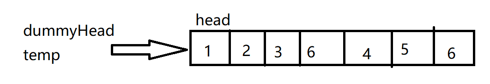
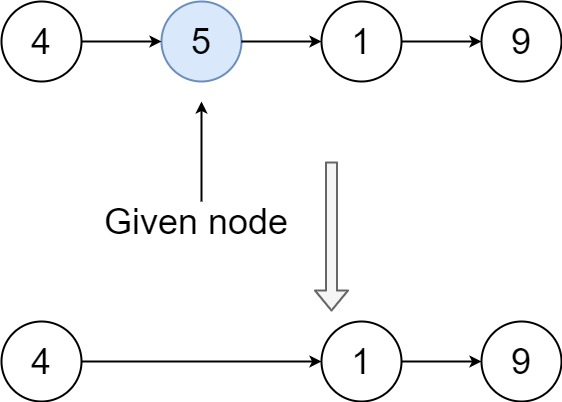
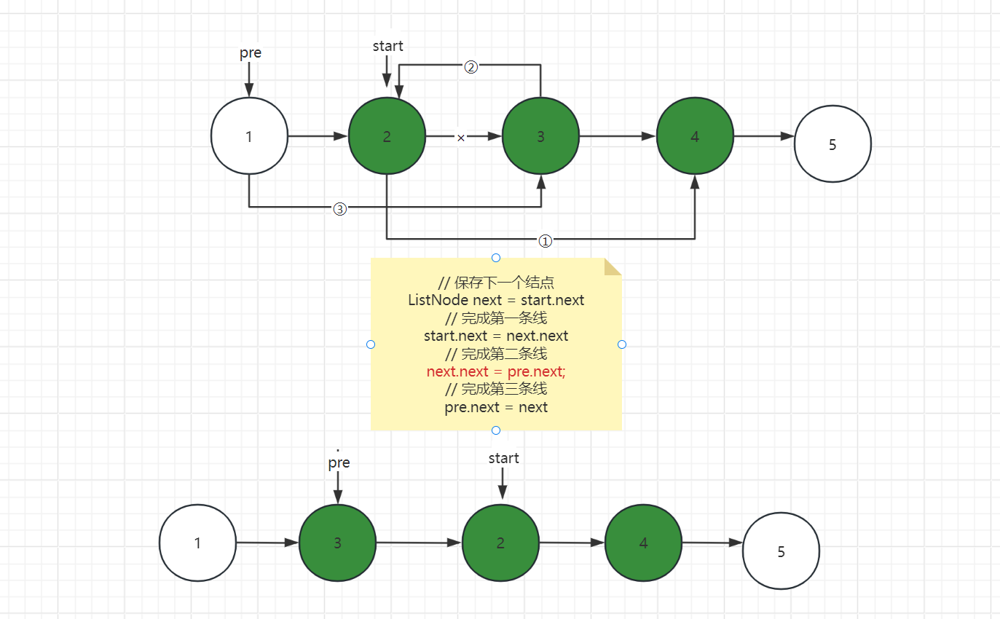
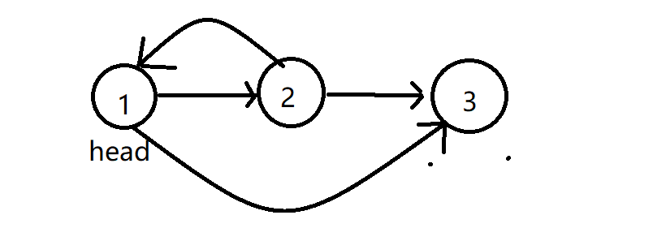

# 链表


## [203. 移除链表元素](https://leetcode.cn/problems/remove-linked-list-elements/)

给你一个链表的头节点 `head` 和一个整数 `val` ，请你删除链表中所有满足 `Node.val == val` 的节点，并返回 **新的头节点** 。


**示例 1：**


```
输入：head = [1,2,6,3,4,5,6], val = 6
输出：[1,2,3,4,5]
```

**示例 2：**

```
输入：head = [], val = 1
输出：[]
```

**示例 3：**

```
输入：head = [7,7,7,7], val = 7
输出：[]
```


**提示：**

- 列表中的节点数目在范围 `[0, 104]` 内
- `1 <= Node.val <= 50`
- `0 <= val <= 50`


### 思路分析

原理很简单：遍历链表，找到与val相等的结点，删除结点即可，即：$node.next = node.next.next$

但是需要注意的是，如果删除的是头结点，那么和其他结点是不一样，其他结点可以通过 $上一结点.next$ 获得，而单链表中的头结点就不行了。

那么如何让头结点和其他结点保持一样的操作呢？

可以设置一个**虚拟头结点**， 这个虚拟头结点指向头结点，这样头结点和其他结点的操作都一致了。都可以通过  $上一结点.next$ 获得。

头结点的上一结点就是**虚拟头结点**，当然我们可以在设置一个**临时结点**等于**虚拟头结点** ，用来遍历



### 代码实现

```java
 public static ListNode removeElements(ListNode head, int val) {
        /*
        * 需要留意的是：
        *   如果删除头结点是和其他结点不一样的，其他结点可以从上一结点获取，但是头结点就无法获取
        * 那么如何让头结点和其他结点保持一样的处理方式呢？
        *   增加一个虚拟头结点，指向头结点
        * */
        // 增加虚拟头结点
        ListNode dummyHead = new ListNode();
        dummyHead.next = head;

        // 使用一个临时结点，用来遍历，删除结点
        ListNode p = dummyHead;
        while(p.next != null) {
            if (p.next.val == val) {
                // 删除的结点
                p.next = p.next.next;
            }else {
                // 移动结点
                p = p.next;
            }
        }
        // 返回头结点
        return  dummyHead.next;
    }
```

## [237. 删除链表中的节点](https://leetcode.cn/problems/delete-node-in-a-linked-list/)

有一个单链表的 `head`，我们想删除它其中的一个节点 `node`。

给你一个需要删除的节点 `node` 。你将 **无法访问** 第一个节点 `head`。

链表的所有值都是 **唯一的**，并且保证给定的节点 `node` 不是链表中的最后一个节点。

删除给定的节点。注意，删除节点并不是指从内存中删除它。这里的意思是：

- 给定节点的值不应该存在于链表中。
- 链表中的节点数应该减少 1。
- `node` 前面的所有值顺序相同。
- `node` 后面的所有值顺序相同。

**自定义测试：**

- 对于输入，你应该提供整个链表 `head` 和要给出的节点 `node`。`node` 不应该是链表的最后一个节点，而应该是链表中的一个实际节点。
- 我们将构建链表，并将节点传递给你的函数。
- 输出将是调用你函数后的整个链表。


**示例 1：**



```
输入：head = [4,5,1,9], node = 5
输出：[4,1,9]
解释：指定链表中值为 5 的第二个节点，那么在调用了你的函数之后，该链表应变为 4 -> 1 -> 9
```

**示例 2：**


```
输入：head = [4,5,1,9], node = 1
输出：[4,5,9]
解释：指定链表中值为 1 的第三个节点，那么在调用了你的函数之后，该链表应变为 4 -> 5 -> 9
```


**提示：**

- 链表中节点的数目范围是 `[2, 1000]`
- `-1000 <= Node.val <= 1000`
- 链表中每个节点的值都是 **唯一** 的
- 需要删除的节点 `node` 是 **链表中的节点** ，且 **不是末尾节点**

```java
    public void deleteNode(ListNode node) {
        node.val = node.next.val;
        node.next = node.next.next;
    }
```


## [206. 反转链表](https://leetcode.cn/problems/reverse-linked-list/)

给你单链表的头节点 `head` ，请你反转链表，并返回反转后的链表。


**示例 1：**


```
输入：head = [1,2,3,4,5]
输出：[5,4,3,2,1]
```

**示例 2：**


```
输入：head = [1,2]
输出：[2,1]
```

**示例 3：**

```
输入：head = []
输出：[]
```


**提示：**

- 链表中节点的数目范围是 `[0, 5000]`
- `-5000 <= Node.val <= 5000`


### 思路分析

思路很简单，无非就是修改指针。即：

原来：$pre.next = cur;$

反转：$cur.next = pre$

cur 表示当前结点，pre表示上一结点

唯一的问题是，我们如何找到当前结点与上一结点，只有都表示出来，我们才能修改指针。这时我们就可以采用双指针的方法，一个 pre指向上一结点，一个cur指向当前结点，不断移动双指针，并更改指针方向。

注意：下图中演示的是cur先移动，但实际上应该pre先移动。


### 代码实现

```java
    public static ListNode reverseList(ListNode head) {
        // 处理特殊情况
        if (head == null || head.next == null) return head;

        /*
        * 反转链表无非就是更改指针的方向，即：
        * 原来：pre.next = cur;
        * 反转：cur.next = pre
        * 但是对于单链表来说，获取下一结点很容易，但是获取上一个结点就不容易了，因此我们可以考虑额外使用一个指针，指向当前结点的上一结点
        * 我们不断移动上一结点和当前结点，并更换俩者的指针方向
        * */

        // 指向当前结点
        ListNode cur = head;
        // 上一结点
        ListNode pre = null;
        // 使用一个临时结点用于移动结点
        ListNode temp = null;

        while(cur != null) {
            // 先保存要移动到的结点，避免被覆盖
            temp = cur.next;
            // 反转，改变指针方向
            cur.next = pre;

            // 移动结点
            // 这里一定要先移动 pre，为什么呢？
            // 如果先移动 cur 的话，此时cur和pre指向的都是当前结点，自己指向自己，这不乱套了~~
            pre = cur;
            cur = temp;
        }

        // 结束循环后，cur=null，因此返回它的上一结点pre，此时pre就是反转后的头结点
        return pre;
    }
```


## [92. 反转链表 II](https://leetcode.cn/problems/reverse-linked-list-ii/)

给你单链表的头指针 `head` 和两个整数 `left` 和 `right` ，其中 `left <= right` 。请你反转从位置 `left` 到位置 `right` 的链表节点，返回 **反转后的链表** 。


**示例 1：**


```
输入：head = [1,2,3,4,5], left = 2, right = 4
输出：[1,4,3,2,5]
```

**示例 2：**

```
输入：head = [5], left = 1, right = 1
输出：[5]
```


**提示：**

- 链表中节点数目为 `n`
- `1 <= n <= 500`
- `-500 <= Node.val <= 500`
- `1 <= left <= right <= n`


**进阶：** 你可以使用一趟扫描完成反转吗？


### 思路分析

采用 “头插法” ，找到 `待反转的第一个结点start` ， 将 start.next 插入到 start 的前面，也就是 pre.next




```java
/**
 * Definition for singly-linked list.
 * public class ListNode {
 *     int val;
 *     ListNode next;
 *     ListNode() {}
 *     ListNode(int val) { this.val = val; }
 *     ListNode(int val, ListNode next) { this.val = val; this.next = next; }
 * }
 */
class Solution {
    public ListNode reverseBetween(ListNode head, int left, int right) {
        // 定义虚拟结点
        ListNode dummyNode = new ListNode();
        dummyNode.next = head;

        // 指向带反转结点的前一个结点
        ListNode pre = dummyNode;
        // 指向第一个待反转结点
        ListNode start = dummyNode.next;

        // 首先先找到第一个反转结点和反转结点的前一个结点
        for (int i = 1; i < left; i++) {
            pre = pre.next;
            start = start.next;
        }

        // 从start开始反转
        for (int i = left; i < right; i++) {
            // 先保存下一个结点，避免被覆盖
            ListNode next = start.next;
            // 完成第一条线
            start.next = next.next;
            // 完成第二条线
            next.next = pre.next;
            // 完成第三条线
            pre.next = next;
        }
        return dummyNode.next;
    }
}
```


## [24. 两两交换链表中的节点](https://leetcode.cn/problems/swap-nodes-in-pairs/)

给你一个链表，两两交换其中相邻的节点，并返回交换后链表的头节点。你必须在不修改节点内部的值的情况下完成本题（即，只能进行节点交换）。


**示例 1：**


```
输入：head = [1,2,3,4]
输出：[2,1,4,3]
```

**示例 2：**

```
输入：head = []
输出：[]
```

**示例 3：**

```
输入：head = [1]
输出：[1]
```


**提示：**

- 链表中节点的数目在范围 `[0, 100]` 内
- `0 <= Node.val <= 100`


### 思路分析

根据题目可以得知，每俩个结点的操作是一样的，换句话说，每一个子问题的处理方式都一样。因此我们可以考虑使用**递归**

使用递归的时候，一定不要深究其细节，不然很容易懵的，我们只需要考虑其中一个小问题，问题自然解决。

**递归三部曲：**

- 终止条件
- 返回值
- 每一次调用做了什么

**终止条件**： 只有俩个或者俩个以上的结点我们才可以交换，因此当 只有一个或者没有结点的时候，就可以终止了。即：$head == null || head.next == null$

**返回值：** 返回值为交换完链表新的 头结点

**每一次调用做了什么：**

俩个结点交换时，新的头结点一直是第二个。设需要交换的两个点为 `head` 和 `newHead`，`head` 连接后面交换完成的子链表，`newHead` 连接 `head`，完成交换




### 代码实现

```java
public  static ListNode swapPairs(ListNode head) {
    // 只有一个结点时
    if (head == null || head.next == null) return head;
    // 临时保存下一个即将要交换的头结点
    ListNode nextHead = head.next.next;
    // 进行交换
    // 新的头结点，每次交换完，头结点都是第二个
    ListNode newHead = head.next;
    newHead.next = head;
    // swapPairs(nextHead); 反转后的头结点
    // head.next指向交换后后的结点
    head.next = swapPairs(nextHead);
    // 返回新的头结点
    return newHead;
}
```


## [19. 删除链表的倒数第 N 个结点](https://leetcode.cn/problems/remove-nth-node-from-end-of-list/)

给你一个链表，删除链表的倒数第 `n` 个结点，并且返回链表的头结点。


**示例 1：**


```
输入：head = [1,2,3,4,5], n = 2
输出：[1,2,3,5]
```

**示例 2：**

```
输入：head = [1], n = 1
输出：[]
```

**示例 3：**

```
输入：head = [1,2], n = 1
输出：[1]
```


**提示：**

- 链表中结点的数目为 `sz`
- `1 <= sz <= 30`
- `0 <= Node.val <= 100`
- `1 <= n <= sz`

### 思路分析

该题我们可以采用双次遍历的方法：

- 第一次遍历，记录链表的个数
- 第二次遍历，找到 **被删除结点 的前一个结点**

假设找到的被删除结点的前一个结点为 temp，则进行删除操作为 $temp.next = temp.next.next$

需要注意的是，有可能会删除头结点，因此为了保证头结点能和其他结点保持一致的操作，采用 **虚拟结点** 的方式


**代码实现**

```java
    public static ListNode removeNthFromEnd(ListNode head, int n) {
        // 处理特殊情况
        if (head == null || head.next == null) return null;

        // 虚拟结点
        ListNode dummyHead = new ListNode();
        dummyHead.next = head;

        // 第一次遍历记录链表的长度
        ListNode temp = head;
        int length = 0;
        while (temp != null) {
            length++;
            temp = temp.next;
        }
        //  第二次遍历找到被删除结点的前一个结点
        length = length - n;
        temp = dummyHead;
        while (length > 0) {
            temp = temp.next;
            length--;
        }
        // 删除结点
        temp.next = temp.next.next;

        return dummyHead.next;
    }
```


## [面试题 02.07. 链表相交](https://leetcode.cn/problems/intersection-of-two-linked-lists-lcci/)

给你两个单链表的头节点 `headA` 和 `headB` ，请你找出并返回两个单链表相交的起始节点。如果两个链表没有交点，返回 `null` 。

图示两个链表在节点 `c1` 开始相交**：**

[](https://assets.leetcode-cn.com/aliyun-lc-upload/uploads/2018/12/14/160_statement.png)

题目数据 **保证** 整个链式结构中不存在环。

**注意**，函数返回结果后，链表必须 **保持其原始结构** 。


**示例 1：**

[](https://assets.leetcode.com/uploads/2018/12/13/160_example_1.png)

```
输入：intersectVal = 8, listA = [4,1,8,4,5], listB = [5,0,1,8,4,5], skipA = 2, skipB = 3
输出：Intersected at '8'
解释：相交节点的值为 8 （注意，如果两个链表相交则不能为 0）。
从各自的表头开始算起，链表 A 为 [4,1,8,4,5]，链表 B 为 [5,0,1,8,4,5]。
在 A 中，相交节点前有 2 个节点；在 B 中，相交节点前有 3 个节点。
```

**示例 2：**

[](https://assets.leetcode.com/uploads/2018/12/13/160_example_2.png)

```
输入：intersectVal = 2, listA = [0,9,1,2,4], listB = [3,2,4], skipA = 3, skipB = 1
输出：Intersected at '2'
解释：相交节点的值为 2 （注意，如果两个链表相交则不能为 0）。
从各自的表头开始算起，链表 A 为 [0,9,1,2,4]，链表 B 为 [3,2,4]。
在 A 中，相交节点前有 3 个节点；在 B 中，相交节点前有 1 个节点。
```

**示例 3：**

[](https://assets.leetcode.com/uploads/2018/12/13/160_example_3.png)

```
输入：intersectVal = 0, listA = [2,6,4], listB = [1,5], skipA = 3, skipB = 2
输出：null
解释：从各自的表头开始算起，链表 A 为 [2,6,4]，链表 B 为 [1,5]。
由于这两个链表不相交，所以 intersectVal 必须为 0，而 skipA 和 skipB 可以是任意值。
这两个链表不相交，因此返回 null 。
```


**提示：**

- `listA` 中节点数目为 `m`
- `listB` 中节点数目为 `n`
- `0 <= m, n <= 3 * 104`
- `1 <= Node.val <= 105`
- `0 <= skipA <= m`
- `0 <= skipB <= n`
- 如果 `listA` 和 `listB` 没有交点，`intersectVal` 为 `0`
- 如果 `listA` 和 `listB` 有交点，`intersectVal == listA[skipA + 1] == listB[skipB + 1]`


### 思路分析

首先要知道相交的结点并不是根据结点的值相等而来的，而是要判断结点的内存地址，因此在Java中我们可以直接**用 "==" 来判断相交的结点**。

所以如何找到内存地址相等的结点成为关键，可以采用快慢双指针的方法。

**双指针**

假设用 pA 指针初始指向 headA，pB 指向 headB，然后同时更新pA、pB，更新方法如下：

- 如果pA指针为null，就移动到headB的头结点，否则就移动到headA的下一个结点
- 如果pB指针为null，就移动到headA的头结点，否则就移动到headB的下一个结点
- 最终pA和pB相遇的位置就是相交的结点

**为什么要这么移动呢？**

通过题目我们可以得知，对于俩个链表的相交结点的后面的结点个数是一样的，假设我们设为 c，而headA相交结点前的结点个数为a，headB相交结点前的结点个数为 b。

这里只讨论headA与headB长度不相等的情况，如果相等 pA、pB会同时到达相交结点直接返回即可。

如果 headA.length < headB.length ，则pA 会率先走完，然后指向 headB，当pA到达相交结点的移动次数为：a + c + b

而 pB 的移动次数为： b + c + a，俩者的移动次数其实是一样的，最终一定会相遇！


**哈希表**

哈希表的方法比较容易理解，将其中一个链表的结点都放到 hash表中，最后遍历另一个链表的结点，如果hash表中包含该结点，则该结点为相交结点


### 代码实现

**双指针**

```java
                // 处理特殊情况
        if (headA == null || headB == null) return null;

        // 定义双指针
        ListNode pA = headA, pB = headB;
        while(pA != pB) {
            // 开始移动
            pA = pA == null ? headB : pA.next;
            pB = pB == null ? headA : pB.next;
        }
        // 若有相交结点，此时pA=pB
        return pA;
```


**哈希表**

```java
    // 哈希表
    public static ListNode getIntersectionNode(ListNode headA, ListNode headB) {
        HashSet<ListNode> hash = new HashSet<>();
        ListNode temp = headA;

        // 先将headA都放入hash表中
        while(temp != null) {
            hash.add(temp);
            temp = temp.next;
        }
        temp = headB;
        while(temp != null) {
            // 看hash表中是否包含该结点
            if (hash.contains(temp)) return temp;
            temp = temp.next;
        }
        // 如果不包含，说明没有相交结点
        return null;

    }
```


## [142. 环形链表 II](https://leetcode.cn/problems/linked-list-cycle-ii/)

给定一个链表的头节点  `head` ，返回链表开始入环的第一个节点。 *如果链表无环，则返回 `null`。*

如果链表中有某个节点，可以通过连续跟踪 `next` 指针再次到达，则链表中存在环。 为了表示给定链表中的环，评测系统内部使用整数 `pos` 来表示链表尾连接到链表中的位置（**索引从 0 开始**）。如果 `pos` 是 `-1`，则在该链表中没有环。**注意：`pos` 不作为参数进行传递**，仅仅是为了标识链表的实际情况。

**不允许修改** 链表。


**示例 1：**


```
输入：head = [3,2,0,-4], pos = 1
输出：返回索引为 1 的链表节点
解释：链表中有一个环，其尾部连接到第二个节点。
```

**示例 2：**


```
输入：head = [1,2], pos = 0
输出：返回索引为 0 的链表节点
解释：链表中有一个环，其尾部连接到第一个节点。
```

**示例 3：**


```
输入：head = [1], pos = -1
输出：返回 null
解释：链表中没有环。
```


**提示：**

- 链表中节点的数目范围在范围 `[0, 104]` 内
- `-105 <= Node.val <= 105`
- `pos` 的值为 `-1` 或者链表中的一个有效索引


### 思路分析

题目太废话，简单来说就是找到环的起始节点，我们可以利用hash表，将结点放入hash表中，若hash表中已经存在某个结点，就说明该结点就是环的起始点


### 代码实现

```java
    public static ListNode detectCycle(ListNode head) {
        HashSet<ListNode> hash = new HashSet<>();
        ListNode temp = head;
        // 若不存在环，尾结点.next一定是
        while(temp != null) {
            if (hash.contains(temp)) {
                // 存在说明该结点为起始点
                return temp;
            }else {
                hash.add(temp);
            }
            temp = temp.next;
        }
        // 说明没有环
        return  null;
    }
```


