# SpringCloud Alibaba

:::tip
本文档只讲解微服务的基础使用,想要了解深层次的原理请跳过，避免耽误时间！！

所有代码均在GitHub,需要请自取

[https://github.com/yangzhaoguang/cloud2024.git](https://github.com/yangzhaoguang/cloud2024.git)
:::

## 一、简介

:::tip 文档
中文文档

[Spring Cloud Alibaba 参考文档 (spring-cloud-alibaba-group.github.io)](https://spring-cloud-alibaba-group.github.io/github-pages/2022/zh-cn/)

github

[spring-cloud-alibaba/README-zh.md at 2022.x · alibaba/spring-cloud-alibaba · GitHub](https://github.com/alibaba/spring-cloud-alibaba/blob/2022.x/README-zh.md)
:::

**是什么**

Spring Cloud Alibaba 致力于提供微服务开发的`一站式解决方案`。此项目包含开发分布式应用微服务的必需组件，方便开发者通过 Spring Cloud 编程模型轻松使用这些组件来开发分布式应用服务。

**主要功能**

- **服务限流降级**：默认支持 WebServlet、WebFlux、OpenFeign、RestTemplate、Spring Cloud Gateway、Dubbo 和 RocketMQ 限流降级功能的接入，可以在运行时通过控制台实时修改限流降级规则，还支持查看限流降级 Metrics 监控。
- **服务注册与发现**：适配 Spring Cloud 服务注册与发现标准，默认集成对应 Spring Cloud 版本所支持的负载均衡组件的适配。
- **分布式配置管理**：支持分布式系统中的外部化配置，配置更改时自动刷新。
- **消息驱动能力**：基于 Spring Cloud Stream 为微服务应用构建消息驱动能力。
- **分布式事务**：使用 @GlobalTransactional 注解， 高效并且对业务零侵入地解决分布式事务问题。
- **阿里云对象存储**：阿里云提供的海量、安全、低成本、高可靠的云存储服务。支持在任何应用、任何时间、任何地点存储和访问任意类型的数据。
- **分布式任务调度**：提供秒级、精准、高可靠、高可用的定时（基于 Cron 表达式）任务调度服务。同时提供分布式的任务执行模型，如网格任务。网格任务支持海量子任务均匀分配到所有 Worker（schedulerx-client）上执行。
- **阿里云短信服务**：覆盖全球的短信服务，友好、高效、智能的互联化通讯能力，帮助企业迅速搭建客户触达通道。


**组件**

**[Sentinel](https://github.com/alibaba/Sentinel)**：把流量作为切入点，从流量控制、熔断降级、系统负载保护等多个维度保护服务的稳定性。

**[Nacos](https://github.com/alibaba/Nacos)**：一个更易于构建云原生应用的动态服务发现、配置管理和服务管理平台。

**[RocketMQ](https://rocketmq.apache.org/)**：一款开源的分布式消息系统，基于高可用分布式集群技术，提供低延时的、高可靠的消息发布与订阅服务。

**[Seata](https://github.com/apache/incubator-seata)**：阿里巴巴开源产品，一个易于使用的高性能微服务分布式事务解决方案。

**[Alibaba Cloud OSS](https://www.aliyun.com/product/oss)**: 阿里云对象存储服务（Object Storage Service，简称 OSS），是阿里云提供的海量、安全、低成本、高可靠的云存储服务。您可以在任何应用、任何时间、任何地点存储和访问任意类型的数据。

**[Alibaba Cloud SchedulerX](https://cn.aliyun.com/aliware/schedulerx)**: 阿里中间件团队开发的一款分布式任务调度产品，提供秒级、精准、高可靠、高可用的定时（基于 Cron 表达式）任务调度服务。

**[Alibaba Cloud SMS](https://www.aliyun.com/product/sms)**: 覆盖全球的短信服务，友好、高效、智能的互联化通讯能力，帮助企业迅速搭建客户触达通道。

**版本对应关系**

- 2022.x 分支对应的是 Spring Cloud 2022 与 Spring Boot 3.0.x，最低支持 JDK 17。
- 2021.x 分支对应的是 Spring Cloud 2021 与 Spring Boot 2.6.x，最低支持 JDK 1.8。
- 2020.0 分支对应的是 Spring Cloud 2020 与 Spring Boot 2.4.x，最低支持 JDK 1.8。
- 2.2.x 分支对应的是 Spring Cloud Hoxton 与 Spring Boot 2.2.x，最低支持 JDK 1.8。
- greenwich 分支对应的是 Spring Cloud Greenwich 与 Spring Boot 2.1.x，最低支持 JDK 1.8。
- finchley 分支对应的是 Spring Cloud Finchley 与 Spring Boot 2.0.x，最低支持 JDK 1.8。
- 1.x 分支对应的是 Spring Cloud Edgware 与 Spring Boot 1.x，最低支持 JDK 1.7。


**依赖**

```xml
<dependencyManagement>
    <dependencies>
        <dependency>
            <groupId>com.alibaba.cloud</groupId>
            <artifactId>spring-cloud-alibaba-dependencies</artifactId>
            <version>2022.0.0.0</version>
            <type>pom</type>
            <scope>import</scope>
        </dependency>
    </dependencies>
</dependencyManagement>
```


## 二、服务注册+配置Nacos

> 一个更易于构建云原生应用的`动态服务发现`、`配置管理`和服务管理平台。
>
> Nacos = Consul


### 2.1 下载启动

> 地址：[https://github.com/alibaba/nacos/releases](https://github.com/alibaba/nacos/releases)
>
> 版本选择：2.3.0

解压之后，进入到 `/bin` 目录，打开`cmd`命令行, 执行：

```sh
startup.cmd -m standalone
```

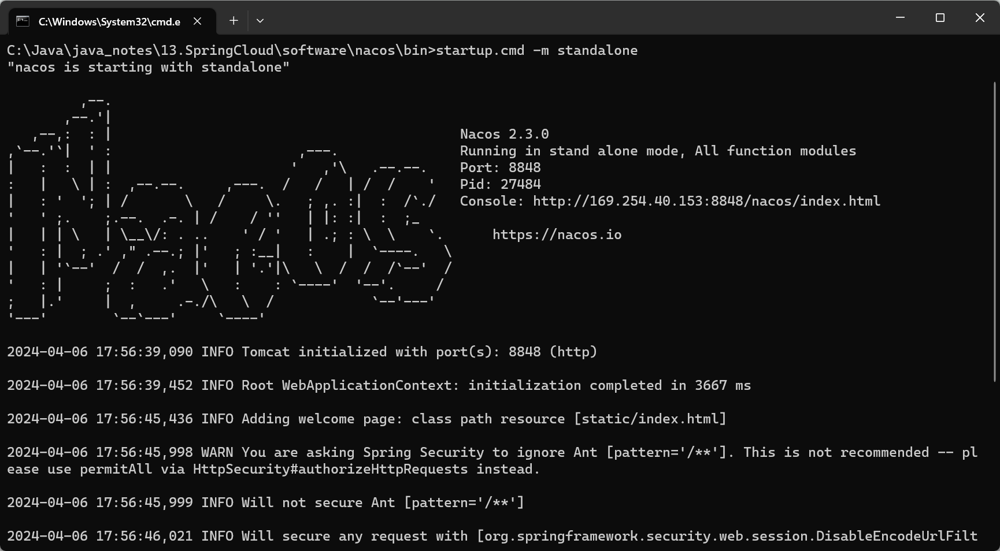


启动成功，访问：`localhost:8848/nacos`

### 2.2 服务注册

新创建俩个模块 `cloudalibaba-provider-payment9001` 、 `cloudalibaba-comsumer-order83`.

`cloudalibaba-provider-payment9001`

**yaml**

```yaml
server:
    port: 9001

spring:
    application:
        name: nacos-payment-provider
    cloud:
        nacos:
            discovery:
                server-addr: localhost:8848 #配置Nacos地址

```

**POM**

```xml
    <dependencies>
        <!--nacos-discovery-->
        <dependency>
            <groupId>com.alibaba.cloud</groupId>
            <artifactId>spring-cloud-starter-alibaba-nacos-discovery</artifactId>
        </dependency>
        <!-- 引入自己定义的api通用包 -->
        <dependency>
            <groupId>com.atguigu.cloud</groupId>
            <artifactId>cloud-api-commons</artifactId>
            <version>1.0-SNAPSHOT</version>
        </dependency>
        <!--SpringBoot通用依赖模块-->
        <dependency>
            <groupId>org.springframework.boot</groupId>
            <artifactId>spring-boot-starter-web</artifactId>
        </dependency>
        <dependency>
            <groupId>org.springframework.boot</groupId>
            <artifactId>spring-boot-starter-actuator</artifactId>
        </dependency>
        <!--hutool-->
        <dependency>
            <groupId>cn.hutool</groupId>
            <artifactId>hutool-all</artifactId>
        </dependency>
        <!--lombok-->
        <dependency>
            <groupId>org.projectlombok</groupId>
            <artifactId>lombok</artifactId>
            <version>1.18.28</version>
            <scope>provided</scope>
        </dependency>
        <!--test-->
        <dependency>
            <groupId>org.springframework.boot</groupId>
            <artifactId>spring-boot-starter-test</artifactId>
            <scope>test</scope>
        </dependency>
    </dependencies>

    <build>
        <plugins>
            <plugin>
                <groupId>org.springframework.boot</groupId>
                <artifactId>spring-boot-maven-plugin</artifactId>
            </plugin>
        </plugins>
    </build>
```

**PayAlibabaController**

```java
@RestController
public class PayAlibabaController {
    @Value("${server.port}")
    private String serverPort;

    @GetMapping(value = "/pay/nacos/{id}")
    public String getPayInfo(@PathVariable("id") Integer id) {
        return "nacos registry, serverPort: " + serverPort + "\t id" + id;
    }
}

```


`cloudalibaba-comsumer-order83`.

**yaml**

```yaml
server:
    port: 83

spring:
    application:
        name: nacos-order-consumer
    cloud:
        nacos:
            discovery:
                server-addr: localhost:8848
#消费者将要去访问的微服务名称(nacos微服务提供者叫什么你写什么)
service-url:
    nacos-user-service: http://nacos-payment-provider
```

**POM**

```xml
    <dependencies>
        <!--nacos-discovery-->
        <dependency>
            <groupId>com.alibaba.cloud</groupId>
            <artifactId>spring-cloud-starter-alibaba-nacos-discovery</artifactId>
        </dependency>
        <!--loadbalancer-->
        <dependency>
            <groupId>org.springframework.cloud</groupId>
            <artifactId>spring-cloud-starter-loadbalancer</artifactId>
        </dependency>
        <!--web + actuator-->
        <dependency>
            <groupId>org.springframework.boot</groupId>
            <artifactId>spring-boot-starter-web</artifactId>
        </dependency>
        <dependency>
            <groupId>org.springframework.boot</groupId>
            <artifactId>spring-boot-starter-actuator</artifactId>
        </dependency>
        <!--lombok-->
        <dependency>
            <groupId>org.projectlombok</groupId>
            <artifactId>lombok</artifactId>
            <optional>true</optional>
        </dependency>
    </dependencies>

    <build>
        <plugins>
            <plugin>
                <groupId>org.springframework.boot</groupId>
                <artifactId>spring-boot-maven-plugin</artifactId>
            </plugin>
        </plugins>
    </build>
```


**配置类**

在未整合 OpenFeign 之前，仍然可以使用 RestTemplate + LoadBalance 负责负载均衡+远程调用！这也就说明了为什么要在消费端引入  `loadbalancer` 依赖

```java
@Configuration
public class RestTemplateConfig
{
    @Bean
    @LoadBalanced //赋予RestTemplate负载均衡的能力
    public RestTemplate restTemplate()
    {
        return new RestTemplate();
    }
}

```

**OrderNacosController**

```java
@RestController
public class OrderNacosController
{
    @Resource
    private RestTemplate restTemplate;

    @Value("${service-url.nacos-user-service}")
    private String serverURL;

    @GetMapping("/consumer/pay/nacos/{id}")
    public String paymentInfo(@PathVariable("id") Integer id)
    {
        String result = restTemplate.getForObject(serverURL + "/pay/nacos/" + id, String.class);
        return result+"\t"+"    我是OrderNacosController83调用者。。。。。。";
    }
}
```


### 2.3 服务配置

以 搭建`cloudalibaba-config-nacos-client3377` 模块为例：

**依赖**

> 基本上所有的外部配置中心都需要 `bootstrap` 配置文件

```xml
<dependency>
    <groupId>com.alibaba.cloud</groupId>
    <artifactId>spring-cloud-starter-alibaba-nacos-config</artifactId>
</dependency>

<dependency>
    <groupId>org.springframework.cloud</groupId>
    <artifactId>spring-cloud-starter-bootstrap</artifactId>
</dependency>
```


`bootstrap.yml`

**注意**：必须使用 `bootstrap.properties` 配置文件来配置 Nacos Server 地址

```yaml
# nacos配置
spring:
  application:
    name: nacos-config-client
  cloud:
    nacos:
      discovery:
        server-addr: localhost:8848 #Nacos服务注册中心地址
      config:
        server-addr: localhost:8848 #Nacos作为配置中心地址
        file-extension: yaml #指定yaml格式的配置

# nacos端配置文件DataId的命名规则是：
# ${spring.application.name}-${spring.profile.active}.${spring.cloud.nacos.config.file-extension}
# 本案例的DataID是:nacos-config-client-dev.yaml
```

`application.yml`

```yaml
server:
  port: 3377

spring:
  profiles:
    active: dev # 表示开发环境
       #active: prod # 表示生产环境
       #active: test # 表示测试环境
```


**主启动类**

```java
@EnableDiscoveryClient
@SpringBootApplication
public class Main3377 {
    public static void main(String[] args) {
        SpringApplication.run(Main3377.class,args);
    }
}

```

`NacosConfigClientController` :

:zap::zap::zap:`@RefreshScope` 配置文件动态刷新功能！

```java
@RestController
@RefreshScope //在控制器类加入@RefreshScope注解使当前类下的配置支持Nacos的动态刷新功能。
public class NacosConfigClientController
{
    @Value("${config.info}")
    private String configInfo;

    @GetMapping("/config/info")
    public String getConfigInfo() {
        return configInfo;
    }
}
```


> :zap::zap::zap: **Nacos配置规则**

```yaml
${prefix}-${spring.profiles.active}.${file-extension}
```

- `prefix` 默认为 `spring.application.name` 的值，也可以通过配置项  `spring.cloud.nacos.config.prefix` 来配置。
- `spring.profiles.active` 即为当前环境对应的 profile，：当 `spring.profiles.active` 为空时，对应的连接符 `-` 也将不存在，dataId 的拼接格式变成 `${prefix}.${file-extension}`
- `file-exetension` 为配置内容的数据格式，可以通过配置项 `spring.cloud.nacos.config.file-extension` 来配置。目前只支持 `properties` 和 `yaml` 类型。


**演示**

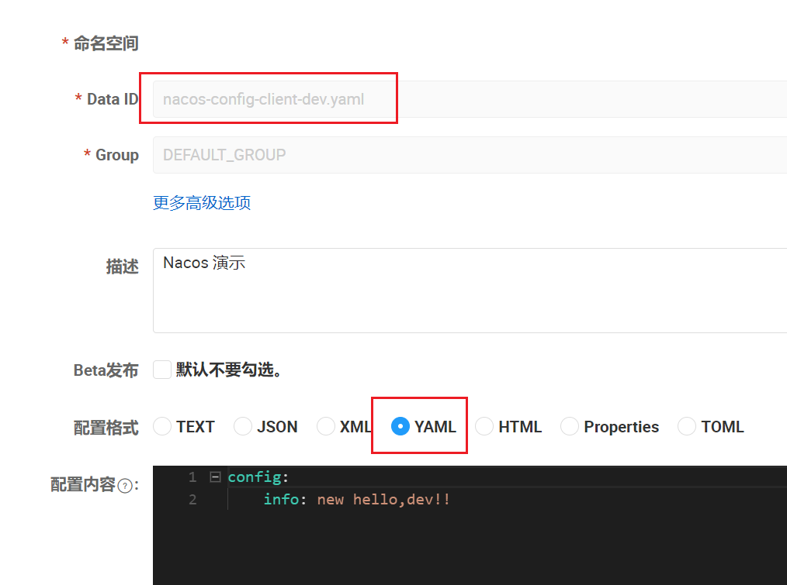


#### 2.3.1 NameSpace-GroupID-DataId

**是什么？**

用于进行租户粒度的配置隔离。不同的命名空间下，可以存在相同的 Group 或 Data ID 的配置。

Namespace 的常用场景之一是`不同环境的配置的区分隔离`，例如开发测试环境和生产环境的资源（如配置、服务）隔离等。

类似Java里面的package名和类名，最外层的Namespace是可以用于区分部署环境的 ，Group和DataID逻辑上区分两个目标对象

**三者之间的关系**

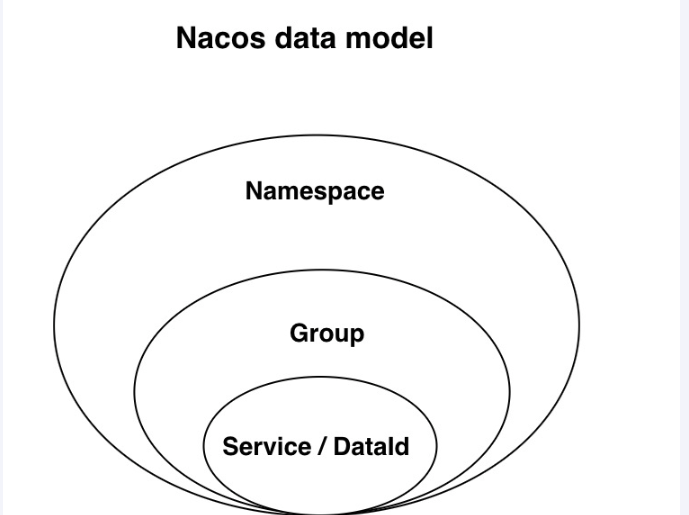


默认情况：`Namespace=public，Group=DEFAULT_GROUP`

Nacos默认的命名空间是 `public`，Namespace主要用来实现隔离。比方说我们现在有三个环境：开发、测试、生产环境，我们就可以创建三个Namespace，不同的Namespace之间是隔离的。`Group`默认是`DEFAULT_GROUP`，Group可以把不同的微服务划分到同一个分组里面去


**配置**

通过`GROUP`分组区分环境

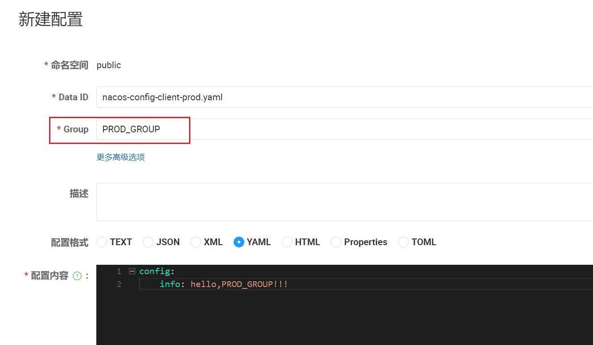

在`bootstrap.yaml` 中要通过 `group` 指明

```yaml
# nacos配置
spring:
    application:
        name: nacos-config-client
    cloud:
        nacos:
            discovery:
                server-addr: localhost:8848 #Nacos服务注册中心地址
            config:
                server-addr: localhost:8848 #Nacos作为配置中心地址
                file-extension: yaml #指定yaml格式的配置
                group: PROD_GROUP
```


通过`NameSpace`分组区分环境

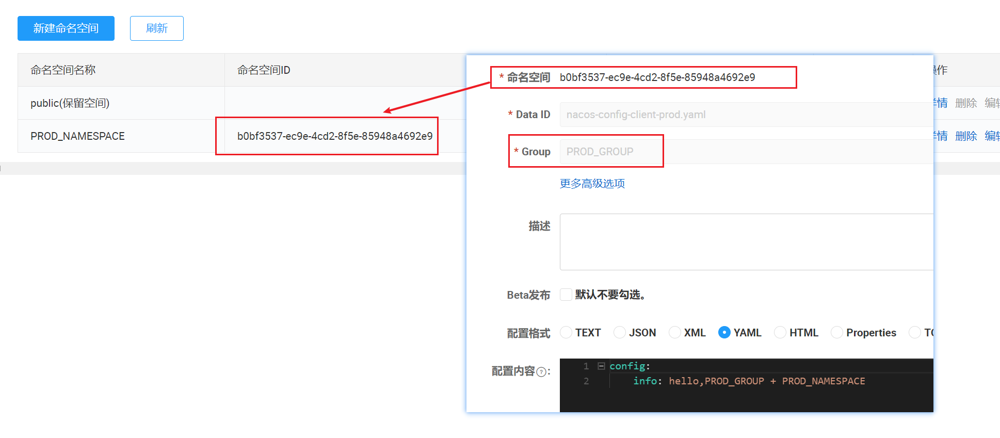

在`bootstrap.yaml` 中要通过 `namespace` 指明，字段值为 `命名空间ID`

```yaml
# nacos配置
spring:
    application:
        name: nacos-config-client
    cloud:
        nacos:
            discovery:
                server-addr: localhost:8848 #Nacos服务注册中心地址
            config:
                server-addr: localhost:8848 #Nacos作为配置中心地址
                file-extension: yaml #指定yaml格式的配置
                group: PROD_GROUP
                namespace: b0bf3537-ec9e-4cd2-8f5e-85948a4692e9
```


## 三、熔断限流 Sentinel

:::tip 文档
中文文档

[introduction | Sentinel (sentinelguard.io)](https://sentinelguard.io/zh-cn/docs/introduction.html)

github

[GitHub - alibaba/Sentinel: A powerful flow control component enabling reliability, resilience and monitoring for microservices. (面向云原生微服务的高可用流控防护组件)](https://github.com/alibaba/Sentinel?tab=readme-ov-file)
:::


### 3.1 介绍

**是什么**

Sentinel 是面向分布式、多语言异构化服务架构的`流量治理组件`，主要以流量为切入点，从`流量路由、流量控制、流量整形、熔断降级、系统自适应过载保护、热点流量防护`等多个维度来帮助开发者保障微服务的稳定性。

**主要特性**‘

`丰富的应用场景`：Sentinel 承接了阿里巴巴近 10 年的双十一大促流量的核心场景，例如秒杀（即突发流量控制在系统容量可以承受的范围）、消息削峰填谷、集群流量控制、实时熔断下游不可用应用等。

`完备的实时监控`：Sentinel 同时提供实时的监控功能。您可以在控制台中看到接入应用的单台机器秒级数据，甚至 500 台以下规模的集群的汇总运行情况。

`广泛的开源生态`：Sentinel 提供开箱即用的与其它开源框架/库的整合模块，例如与 Spring Cloud、Apache Dubbo、gRPC、Quarkus 的整合。您只需要引入相应的依赖并进行简单的配置即可快速地接入 Sentinel。同时 Sentinel 提供 Java/Go/C++ 等多语言的原生实现。

`完善的 SPI 扩展机制`：Sentinel 提供简单易用、完善的 SPI 扩展接口。您可以通过实现扩展接口来快速地定制逻辑。例如定制规则管理、适配动态数据源等。

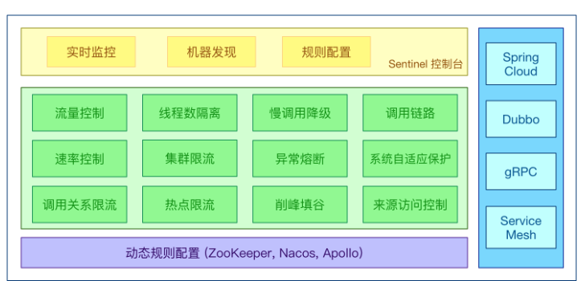


### 3.2 下载安装

Sentinel 分为两个部分:

- `核心库（Java 客户端）`不依赖任何框架/库，能够运行于所有 Java 运行时环境，同时对 Dubbo / Spring Cloud 等框架也有较好的支持。
- `控制台（Dashboard）`基于 Spring Boot 开发，打包后可以直接运行，不需要额外的 Tomcat 等应用容器。

> 下载：[Releases · alibaba/Sentinel (github.com)](https://github.com/alibaba/Sentinel/releases)
>
> 启动：java -jar
>
> 访问： localhost:8080
>
> 默认账号密码： sentinel

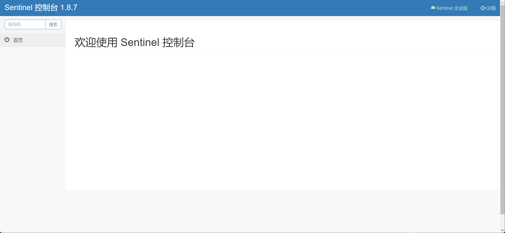

### 3.3 如何使用

**依赖**

```xml
        <!--SpringCloud alibaba sentinel -->
        <dependency>
            <groupId>com.alibaba.cloud</groupId>
            <artifactId>spring-cloud-starter-alibaba-sentinel</artifactId>
        </dependency>
```

**yaml**

```yaml
server:
    port: 8401

spring:
    application:
        name: cloudalibaba-sentinel-service
    cloud:
        nacos:
            discovery:
                server-addr: localhost:8848         #Nacos服务注册中心地址
        sentinel:
            transport:
                dashboard: localhost:8080 #配置Sentinel dashboard控制台服务地址
                port: 8719 #默认8719端口，假如被占用会自动从8719开始依次+1扫描,直至找到未被占用的端口

```

> 由于 Sentinel 采用的是懒加载，有请求之后才会开始进行监控！

#### 3.3.1 流控规则

Sentinel能够对流量进行控制，主要是监控应用的`QPS流量`或者`并发线程数`等指标，如果达到指定的阈值时，就会被流量进行控制，以避免服务被瞬时的高并发流量击垮，保证服务的高可靠性。参数见最下方：

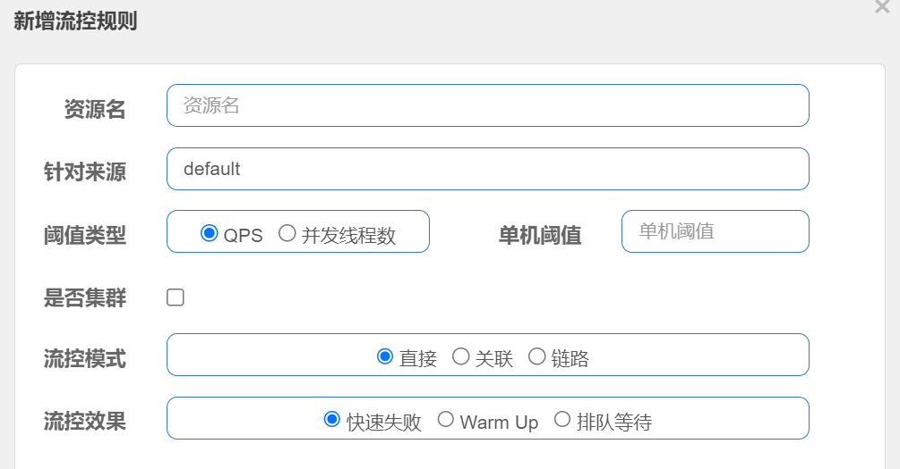


| 资源名   | 资源的唯一名称，默认就是请求的接口路径，可以自行修改，但是要保证唯一。 |
| -------- | ------------------------------------------------------------ |
| 针对来源 | 具体针对某个微服务进行限流，默认值为default，表示不区分来源，全部限流。 |
| 阈值类型 | QPS表示通过QPS进行限流，并发线程数表示通过并发线程数限流。   |
| 单机阈值 | 与阈值类型组合使用。如果阈值类型选择的是QPS，表示当调用接口的QPS达到阈值时，进行限流操作。如果阈值类型选择的是并发线程数，则表示当调用接口的并发线程数达到阈值时，进行限流操作。 |
| 是否集群 | 选中则表示集群环境，不选中则表示非集群环境。                 |


#####  流控模式

**直接**

如果 `/testA` 请求 1S以内有超过 2个请求数量，就会直接报错！

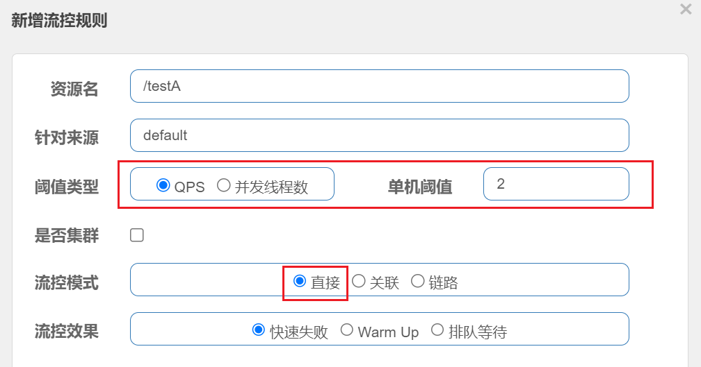

**效果**

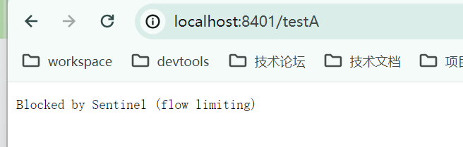


**关联**

当关联的资源达到阈值时，就限流自己！

例如下面：

当 `/testB` 请求 1S超过2个请求时，就会限流 `/testA`

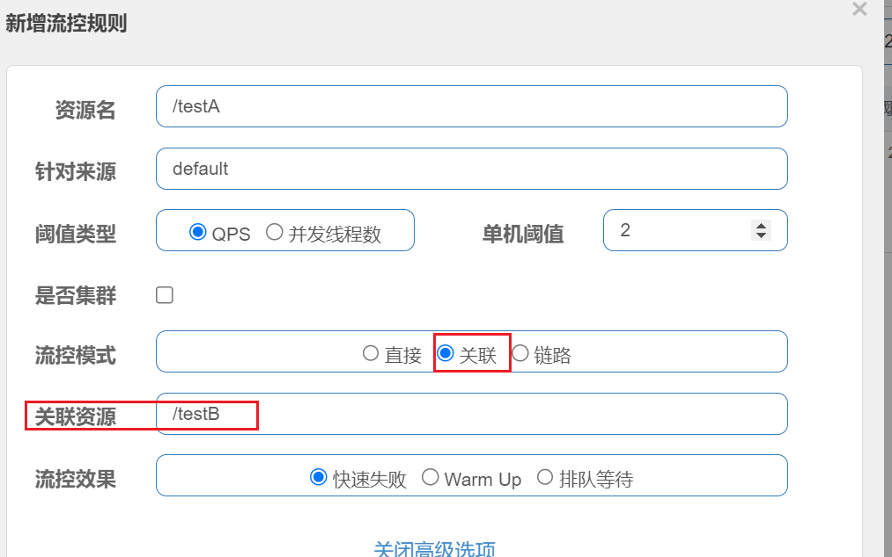


**链路**

来自不同链路的请求对同一个目标访问时，实施针对性的不同限流措施！

比如：C请求来访问`common资源`就限流、D请求来访问`common资源`就不限流

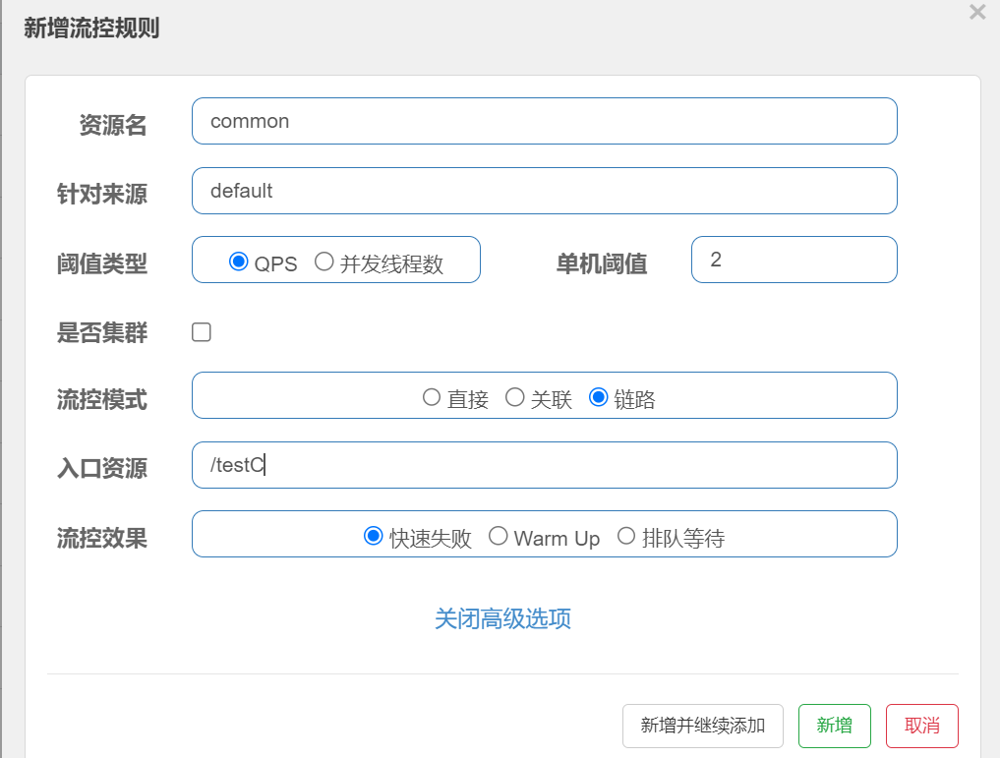


**测试**

`FlowLimitService`

```java
@Service
public class FlowLimitService
{
    @SentinelResource(value = "common")
    public void common()
    {
        System.out.println("------FlowLimitService come in");
    }
}
```

`FlowLimitController`

/testC 、/testD 访问同一个资源common

```java
    @GetMapping("/testC")
    public String testC()
    {
        flowLimitService.common();
        return "------testC";
    }
    @GetMapping("/testD")
    public String testD()
    {
        flowLimitService.common();
        return "------testD";
    }
```

`yaml`

```yaml
spring:
	cloud:
		sentinel:
			 web-context-unify: false # controller层的方法对service层调用不认为是同一个根链路
```


#####  流控效果

**快速失败** ： 直接报错

**Warm Up** : 预热

Warm Up（`RuleConstant.CONTROL_BEHAVIOR_WARM_UP`）方式，即`预热/冷启动方式`。当系统长期处于低水位的情况下，当流量突然增加时，直接把系统拉升到高水位可能瞬间把系统压垮。通过"冷启动"，让通过的流量缓慢增加，在一定时间内逐渐增加到阈值上限，给冷系统一个预热的时间，避免冷系统被压垮。

默认`coldFactor`为 3，即请求 QPS 从` threshold / 3` 开始，经预热时长逐渐升至设定的 QPS 阈值

> 以下为例说明：
>
> 阀值为10，预热时长设置5秒。
>
> 系统初始化的阀值为10 / 3 约等于3, 即阀值刚开始为3；
>
> 然后过了5秒后阀值才慢慢升高恢复到10。

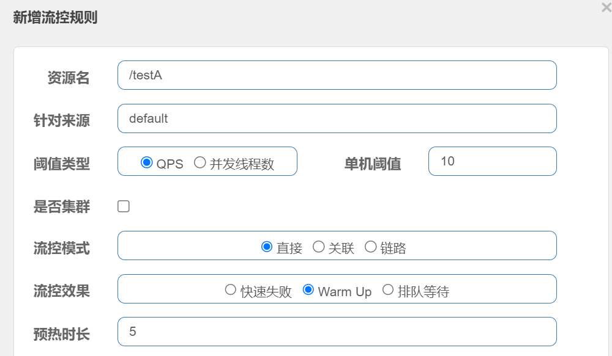


**排队等待**

匀速排队（`RuleConstant.CONTROL_BEHAVIOR_RATE_LIMITER`）方式会严格控制请求通过的间隔时间，也即是让请求以均匀的速度通过，对应的是漏桶算法。


> 图中所示，每1s处理一次`/testB`，5s过后的所有请求都会抛弃，也就是说只能处理 5个请求！

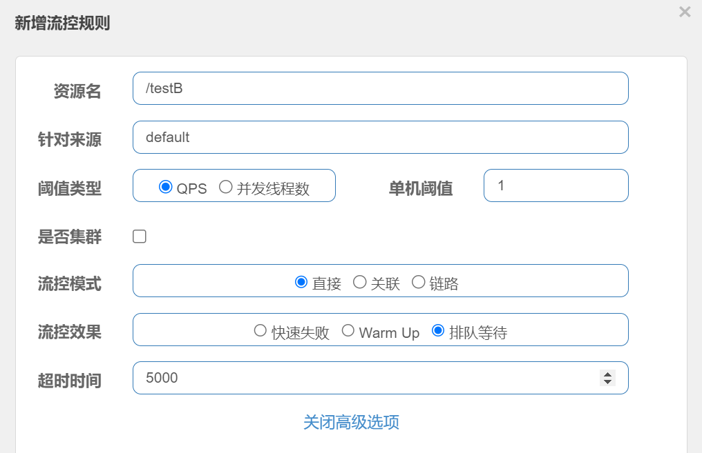

Jmeter 设置 1s发送10个请求

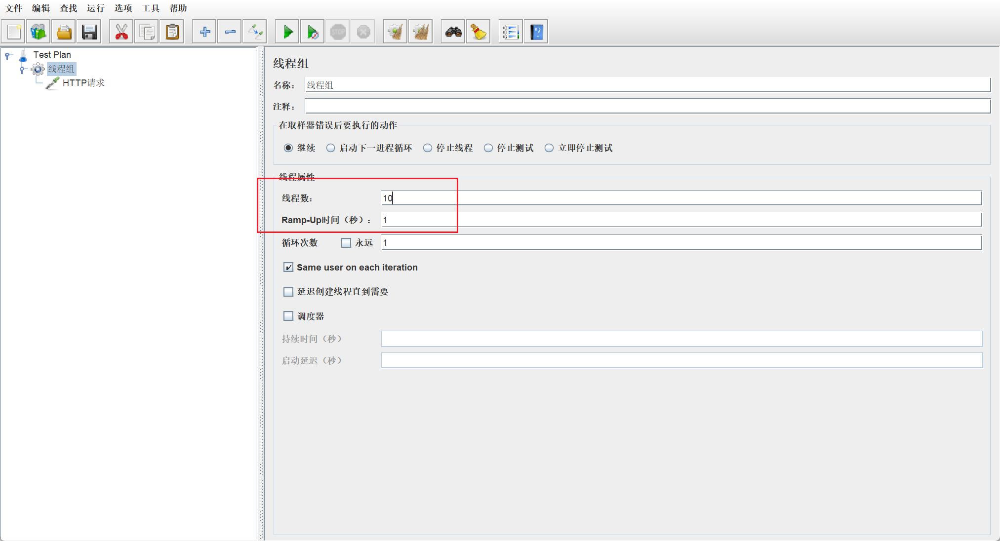

**效果**

最终只执行了6次请求，剩余4次全被抛弃了

执行6次是因为在最后1s请求进来了

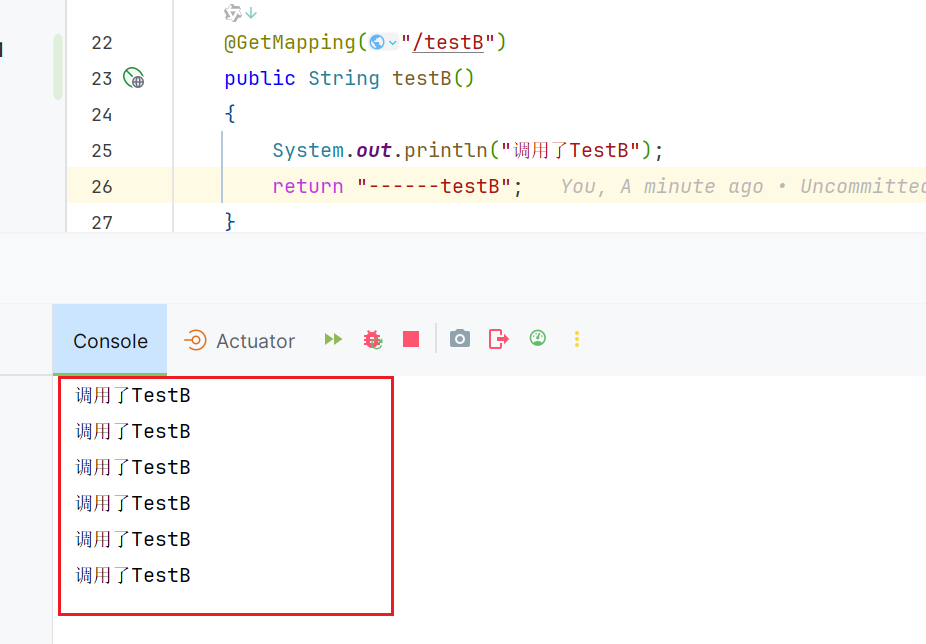


#### 3.3.2 熔断规则

**名词解释**

1.调用：一个请求发送到服务器，服务器给与响应，一个响应就是一个调用。

2.最大RT：即最大的响应时间，指系统对请求作出响应的业务处理时间。

3.慢调用：处理业务逻辑的实际时间 > 设置的最大RT时间，这个调用叫做慢调用。

4.慢调用比例：在所以调用中，慢调用占有实际的比例＝慢调用次数➗总调用次数

5.比例阈值：自己设定的 ， 比例阈值＝慢调用次数➗调用次数

6.统计时长：时间的判断依据

7.最小请求数：设置的调用最小请求数，上图比如1秒钟打进来10个线程（大于我们配置的5个了）调用被触发

**熔断状态**

1、熔断状态(保险丝跳闸断电，不可访问)：在接下来的熔断时长内请求会自动被熔断

2、探测恢复状态(探路先锋)：熔断时长结束后进入探测恢复状态

3、结束熔断(保险丝闭合恢复，可以访问)：在探测恢复状态，如果接下来的一个请求响应时间小于设置的慢调用 RT，则结束熔断，否则继续熔断。

##### 慢调用比例

`进入熔断状态判断依据`：在统计时长内，实际请求数目＞设定的最小请求数  且   实际慢调用比例＞比例阈值 ，进入熔断状态。

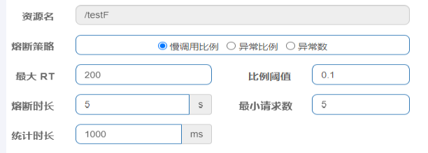

拿上图的例子来说：

在 `1S（统计时长）`内，若 `总调用次数 > 5` 并且  `慢调用比例(响应时间超过200ms) > 10%`  就会进入熔断状态，熔断时长为 5s


##### 异常比例

在`1S（统计时长）`内，总  `调用数>5` 并且 `异常比例(异常调用/总调用数) > 10%` 进入熔断状态，熔断时长为5S

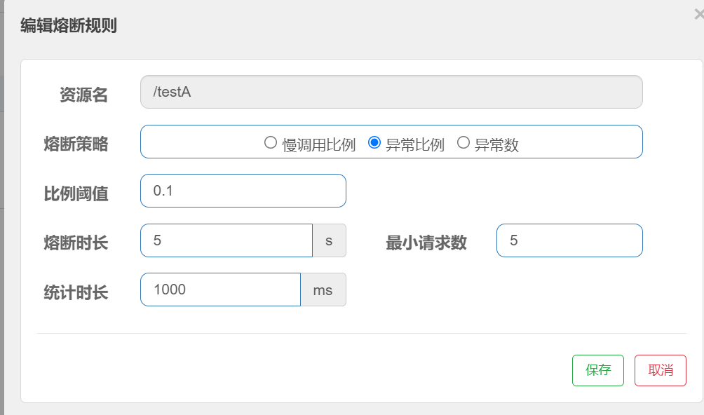


##### 异常数

上面那个是 达到一定的`异常比例`之后进入熔断状态，这个是基于`异常数量`

在`1S（统计时长）`内，总  `调用数>5` 并且 `异常数 > 2` 进入熔断状态，熔断时长为5S

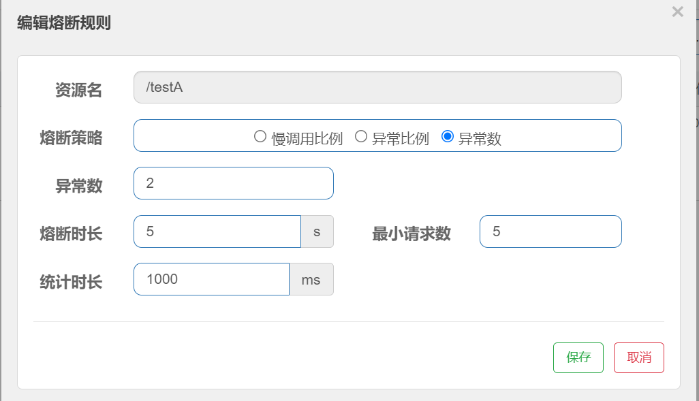


### 3.3.3 @SentinelResource

`@SentinelResource ` 是一个流量防卫防护组件注解，用于指定防护资源，对配置的资源进行流程控制，熔断降级等功能！

**参数说明**

```java
@Target({ElementType.METHOD, ElementType.TYPE})
@Retention(RetentionPolicy.RUNTIME)
@Inherited
public @interface SentinelResource {

    //资源名称
    String value() default "";

    //entry类型，标记流量的方向，取值IN/OUT，默认是OUT
    EntryType entryType() default EntryType.OUT;
    //资源分类
    int resourceType() default 0;

    //处理BlockException的函数名称,函数要求：
    //1. 必须是 public
    //2.返回类型 参数与原方法一致
    //3. 默认需和原方法在同一个类中。若希望使用其他类的函数，可配置blockHandlerClass ，并指定blockHandlerClass里面的方法。
    String blockHandler() default "";

    //存放blockHandler的类,对应的处理函数必须static修饰。
    Class<?>[] blockHandlerClass() default {};

    //用于在抛出异常的时候提供fallback处理逻辑。 fallback函数可以针对所
    //有类型的异常（除了 exceptionsToIgnore 里面排除掉的异常类型）进行处理。函数要求：
    //1. 返回类型与原方法一致
    //2. 参数类型需要和原方法相匹配
    //3. 默认需和原方法在同一个类中。若希望使用其他类的函数，可配置fallbackClass ，并指定fallbackClass里面的方法。
    String fallback() default "";

    //存放fallback的类。对应的处理函数必须static修饰。
    String defaultFallback() default "";

    //用于通用的 fallback 逻辑。默认fallback函数可以针对所有类型的异常进
    //行处理。若同时配置了 fallback 和 defaultFallback，以fallback为准。函数要求：
    //1. 返回类型与原方法一致
    //2. 方法参数列表为空，或者有一个 Throwable 类型的参数。
    //3. 默认需要和原方法在同一个类中。若希望使用其他类的函数，可配置fallbackClass ，并指定 fallbackClass 里面的方法。
    Class<?>[] fallbackClass() default {};
 

    //需要trace的异常
    Class<? extends Throwable>[] exceptionsToTrace() default {Throwable.class};

    //指定排除忽略掉哪些异常。排除的异常不会计入异常统计，也不会进入fallback逻辑，而是原样抛出。
    Class<? extends Throwable>[] exceptionsToIgnore() default {};
}
```

简单来说，被 `@SentinelResource` 注解标注的资源也能够配置限流、降级等规则，那它和手动的配置，也就是通过`访问路径` 设置有什么不一样呢？

> 其实很简单，想要自定义响应信息就使用 `@SentinelResource` 注解。
>
> 触发限流规则会执行 `blockHandler` , 出现异常降级会执行 `fallback`


**案例演示**

> 若资源和 `blockHandler`、`doActionFallback` 不在同一个类中，使用 `blockHandlerClass` 、`fallbackClass` 指明！

```java
    @GetMapping("/rateLimit/doAction/{p1}")
    @SentinelResource(value = "doActionSentinelResource",
            blockHandler = "doActionBlockHandler", fallback = "doActionFallback")
    public String doAction(@PathVariable("p1") Integer p1) {
        if (p1 == 0){
            throw new RuntimeException("p1等于零直接异常");
        }
        return "doAction";
    }

    public String doActionBlockHandler(@PathVariable("p1") Integer p1, BlockException e){
        log.error("sentinel配置自定义限流了:{}", e);
        return "sentinel配置自定义限流了";
    }

    public String doActionFallback(@PathVariable("p1") Integer p1,Throwable e){
        log.error("程序逻辑异常了:{}", e);
        return "程序逻辑异常了"+"\t"+e.getMessage();
    }
```

**配置流控规则**

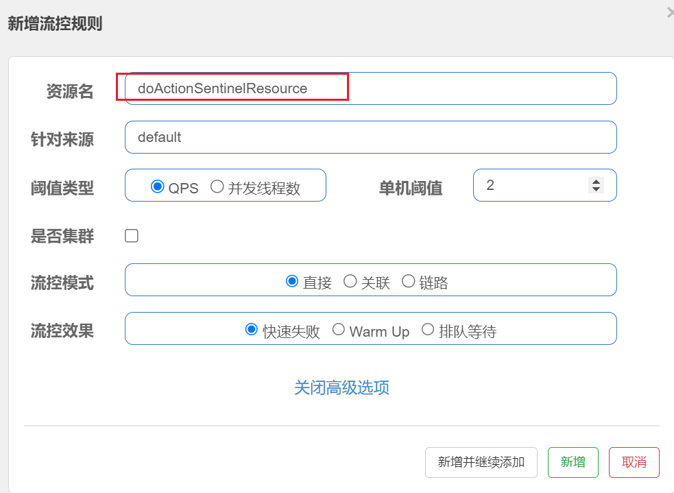


**效果**

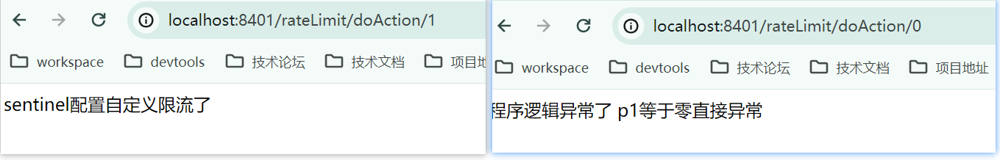


### 3.3.4 热点规则

热点即经常访问的数据，很多时候我们希望统计或者限制某个热点数据中访问频次最高的TopN数据，并对其访问进行限流或者其它操作

**代码**

```java
    @GetMapping("/testHotKey")
    @SentinelResource(value = "testHotKey",blockHandler = "dealHandler_testHotKey")
    public String testHotKey(@RequestParam(value = "p1",required = false) String p1,

                             @RequestParam(value = "p2",required = false) String p2){
        return "------testHotKey";
    }
    public String dealHandler_testHotKey(String p1,String p2,BlockException exception)
    {
        return "-----dealHandler_testHotKey";
    }
```

**热点规则配置**

> 参数索引从0开始，例如上面的代码中，p1、p2俩个参数，对应的索引：0、1
>
> 下面规则的意思是：
>
> 当携带p1参数的请求，超过1秒1次的时候，就会进行限流，执行`dealHandler_testHotKey` 方法

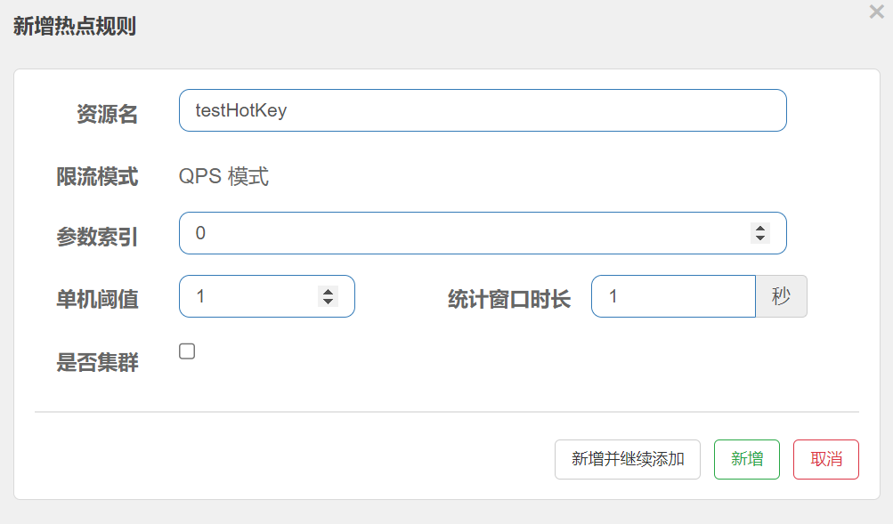


**参数例外项**

期望某个参数达到某个特殊值之后，它的阈值也会不同。

例如下面：当 p1的参数值等于5时，单独设置它的阈值为 200。

**注意**：参数类型必须为八个基本类型之一！

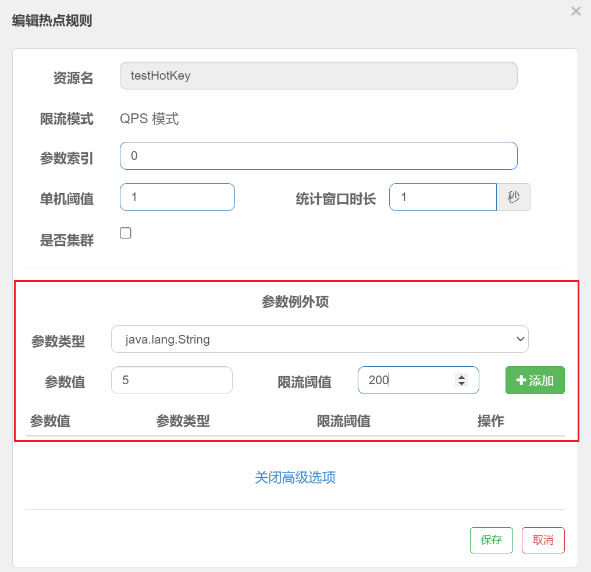


### 3.3.5 授权规则

在某些场景下，需要根据调用接口的来源判断是否允许执行本次请求。此时就可以使用Sentinel提供的授权规则来实现，Sentinel的授权规则能够根据请求的来源判断是否允许本次请求通过。

在Sentinel的授权规则中，提供了 `白名单`与`黑名单 `两种授权类型。白放行、黑禁止


自定义一个请求转换器，设置针对哪一个参数名设置 `白名单、黑名单`

```java
@Component
public class MyRequestOriginParser implements RequestOriginParser
{
    @Override
    public String parseOrigin(HttpServletRequest httpServletRequest) {
        return httpServletRequest.getParameter("serverName");
    }
}
 
```

**业务代码**

```java
    @RestController
    public class EmpowerController //Empower授权规则，用来处理请求的来源
    {
        @GetMapping(value = "/empower")
        public String requestSentinel4(){
            return "Sentinel授权规则";
        }
    }
```

**配置授权规则**

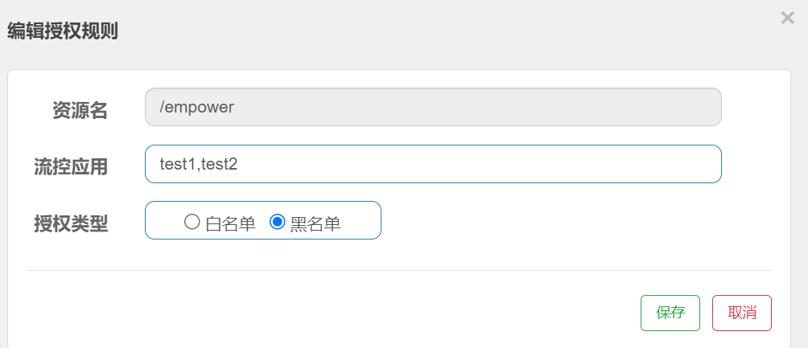


当 `serverName` 参数名称等于 `test1` 或者 `test2` 会进入到黑名单！

> ```http
> http://localhost:8401/empower?serverName=test2
> http://localhost:8401/empower?serverName=test1
> ```


### 3.3.6 持久化规则

一旦我们重启应用，sentinel规则将消失，生产环境需要将配置规则进行持久化

**方法**

将限流配置规则持久化进Nacos保存，只要Nacos里面的配置不删除，sentinel上的流控规则持续有效

**步骤**

**1、增加依赖**

```java
        <dependency>
            <groupId>com.alibaba.csp</groupId>
            <artifactId>sentinel-datasource-nacos</artifactId>
        </dependency>
```

**2、yaml**

如果命名空间不是默认的 `public` ，则需要使用 `namespace: ` 指明

```yaml
spring:
  cloud:
    sentinel:
      datasource:
        ds1: 
          nacos:
            server-addr: localhost:8848
            dataId: ${spring.application.name}
            groupId: DEFAULT_GROUP
            data-type: json
            rule-type: flow
        ds2:  # 可以配置多个
          nacos:
            server-addr: localhost:8848
            dataId: ${spring.application.name}
            groupId: DEFAULT_GROUP
            data-type: json
            rule-type: System
```

**rule-type说明**

- `flow`流量控制规则
- `Degrade`熔断降级规则
- `Authority`访问控制规则
- `System`系统保护规则
- `param_flow`热点规则


**3、Nacos配置说明**

DataId：服务名称

配置格式一定要选择 json

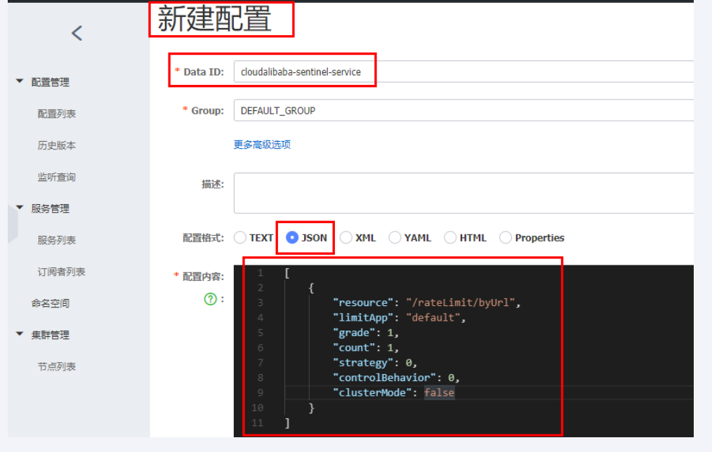

```json
[
    {
        "resource": "/rateLimit/byUrl",
        "limitApp": "default",
        "grade": 1,
        "count": 1,
        "strategy": 0,
        "controlBehavior": 0,
        "clusterMode": false
    }
]

```

**参数配置说明**：

**流控规则**：

`resource`：资源名称；
`limitApp`：来源应用；
`grade`：阈值类型，0表示线程数，1表示QPS；
`count`：单机阈值；
`strategy`：流控模式，0表示直接，1表示关联，2表示链路；
`controlBehavior`：流控效果，0表示快速失败，1表示Warm Up，2表示排队等待；
`clusterMode`：是否集群。

**熔断规则**

`resource` ：资源名
`grade `：熔断策略，支持慢调用比例/异常比例/异常数策略。0：慢调用比例，1：异常比例，2：异常数。默认为 0，慢调用比例。
`count` ：慢调用比例模式下为慢调用临界 RT（超出该值计为慢调用）；异常比例/异常数模式下为对应的阈值。
`timeWindow` ：熔断时长，单位为秒。
`minRequestAmount` ：熔断触发的最小请求数，请求数小于该值时即使异常比率超出阈值也不会熔断。默认为 5 。
`statIntervalMs `：统计时长（单位为 ms），如 60*1000 代表分钟级。默认为 1000 ms。
`slowRatioThreshold `：慢调用比例阈值，仅慢调用比例模式有效


**热点规则**

`resource` ：资源名

`paramIdx` : 参数索引

`count`: 单机阈值

`clusterMode` : 是否集群模式，默认false

`grade` : 阈值类型，固定为1 为QPS

`durationInSec`: 统计窗口时长

`paramFlowItemList` : 参数例外项，是一个数组 `[]`

- `classType`: 参数类型，比如：`java.lang.String`
- `count` : 限流阈值
- `object` : 参数值

```json
[
   {
        "resource": "testHotKey",
        "paramIdx": 0,
        "grade": 1,
        "count": 1, 
        "durationInSec": 1,
        "paramFlowItemList": [
            {
                "classType": "java.lang.String",
                "count":200,
                "object": 5
            }
        ]
    }
]
```


### 3.4 sentinel 整合OpenFeign

> 我们在使用 OpenFeign 访问失败的话， 访问者要有 `fallback服务降级`的情况，不要持续访问9001加大微服务负担，但是通过feign接口调用的又方法各自不同，如果每个不同方法都加一个fallback配对方法，会导致代码膨胀不好管理，工程埋雷

我们可以看到每一个方法都配备了一个  `blockHandler` 和 `fallback` , 如果有几十个`Controller` 方法 , 难道我们也要配 好几十个 `blockHandler` 和 `fallback`  ？

这显然是很愚蠢的行为~

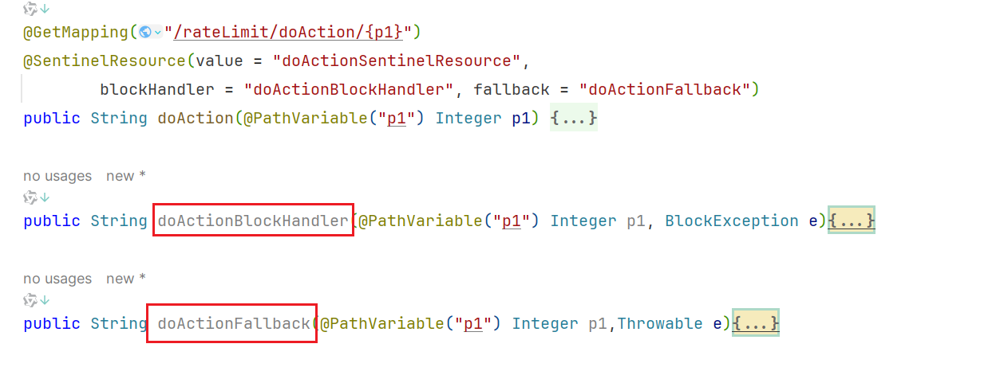


**处理方法**

`fallback `统一在 OpenFeign 接口中定义

**执行步骤**

一定要清楚 Sentinel 监控的是 服务提供者，也就是被调用者。

而消费者，也就是调用者 则是利用 OpenFeign 调用 被调用者！

1、因此在 `服务提供者9001` 中加入 `sentinel ` 监控：

```yaml
spring:
    application:
        name: nacos-payment-provider
    cloud:
        nacos:
            discovery:
                server-addr: localhost:8848 #配置Nacos地址
        sentinel:
            transport:
                dashboard: localhost:8080 #配置Sentinel dashboard控制台服务地址
                port: 8719 #默认8719端口，假如被占用会自动从8719开始依次+1扫描,直至找到未被占用的端口
```


2、将 `fallback` 统一放到 OpenFeign 的接口 中

```java
@FeignClient(value = "nacos-payment-provider",fallback = PayFeignSentinelApiFallBack.class)
public interface PayFeignSentinelApi
{
    @GetMapping("/pay/nacos/get/{orderNo}")
    public ResultData getPayByOrderNo(@PathVariable("orderNo") String orderNo);
}

```

通过 `fallback` 属性指明调用出错时的返回逻辑！

> 注意，要实现OpenFeign 接口，并且要重写方法！

```java
@Component
public class PayFeignSentinelApiFallBack implements PayFeignSentinelApi{
    @Override
    public ResultData getPayByOrderNo(String orderNo) {
        return ResultData.fail(ReturnCodeEnum.RC500.getCode(),"对方服务宕机或不可用，FallBack服务降级o(╥﹏╥)o");
    }
}

```


3、再`消费端83`使用OpenFeign远程调用，先在主启动类增加 `@EnableFeignClients` 注解！！

激活sentinel对OpenFeign的支持

```yaml
# 激活Sentinel对Feign的支持
feign:
    sentinel:
        enabled: true
```


**故障**

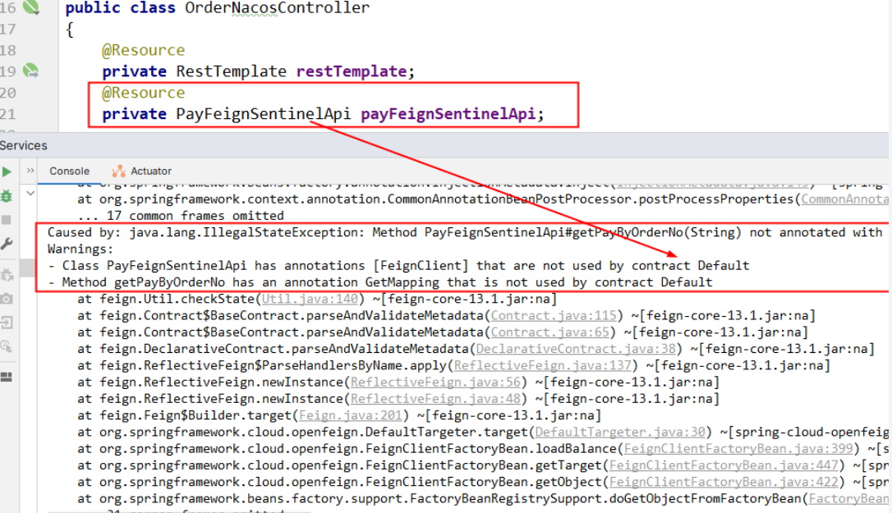

出现的原因是由于 `SpringBoot、SpringCloud`版本太高，与阿里巴巴的Sentinel不兼容，降低版本即可，修改以下版本：

```xml
<spring.boot.version>3.0.9</spring.boot.version>
<spring.cloud.version>2022.0.2</spring.cloud.version>
```


### 3.5 sentinel整合GateWay

从 1.6.0 版本开始，Sentinel 提供了 Spring Cloud Gateway 的适配模块，可以提供两种资源维度的限流：

- `route 维度`：即在 Spring 配置文件中配置的路由条目，资源名为对应的 routeId
- `自定义 API 维度`：用户可以利用 Sentinel 提供的 API 来自定义一些 API 分组

其实 sentinel 整合 Gateway 有俩种方式，一种是`配置类` 方式，一种是`控制台`

#### 控制台方式

手动在控制台增加流控规则。

**优点**

- 操作方便，图形化界面
- 配置简单，无需更改代码

**缺点**

- 需要进行持久化配置

> 新建网关模块 `cloudalibaba-sentinel-gateway9528`

**依赖**

```xml
    <dependencies>
        <!--nacos-discovery-->
        <dependency>
            <groupId>com.alibaba.cloud</groupId>
            <artifactId>spring-cloud-starter-alibaba-nacos-discovery</artifactId>
        </dependency>
        <dependency>
            <groupId>org.springframework.cloud</groupId>
            <artifactId>spring-cloud-starter-gateway</artifactId>
        </dependency>
        <!--    spring cloud gateway整合sentinel的依赖-->
        <dependency>
            <groupId>com.alibaba.cloud</groupId>
            <artifactId>spring-cloud-alibaba-sentinel-gateway</artifactId>
        </dependency>

        <!--    sentinel的依赖-->
        <dependency>
            <groupId>com.alibaba.cloud</groupId>
            <artifactId>spring-cloud-starter-alibaba-sentinel</artifactId>
        </dependency>
    </dependencies>
```

**yaml**

```yaml
server:
    port: 9528

spring:
    application:
        name: cloudalibaba-sentinel-gateway     # sentinel+gataway整合Case
    cloud:
        nacos:
            discovery:
                server-addr: localhost:8848
        sentinel:
            transport:
                dashboard: localhost:8080
        gateway:
            routes:
                - id: pay_routh1 #pay_routh1                #路由的ID(类似mysql主键ID)，没有固定规则但要求唯一，建议配合服务名
                  uri: http://localhost:9001                #匹配后提供服务的路由地址
                  predicates:
                      - Path=/pay/**                      # 断言，路径相匹配的进行路由

```


**增加 Vm Options**

```sh
-Dcsp.sentinel.app.type=1
```

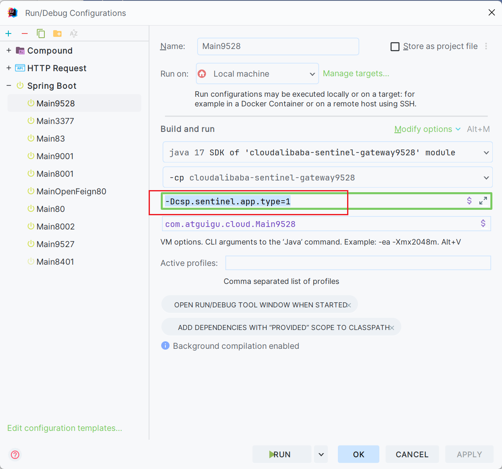


启动成功后，向网关发送一次请求，

```http
http://localhost:9528/pay/nacos/1
```

看 sentinel 控制台，已经注册进来了，此时就可以随心所以得进行限流配置了！

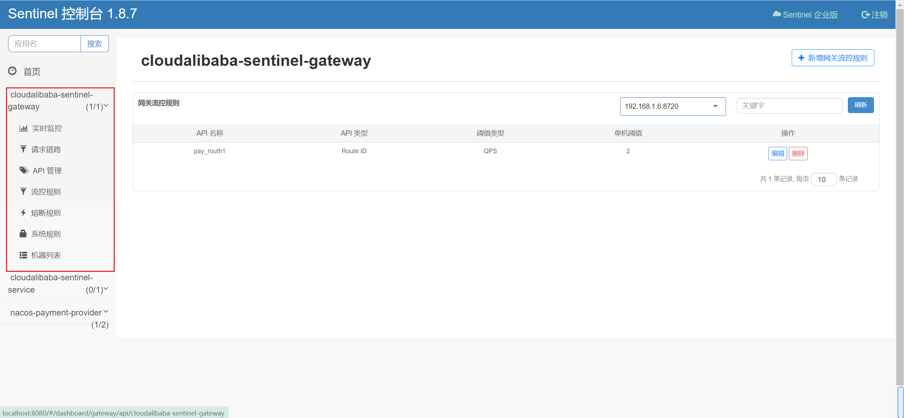


新增流控规则，API名称为` routeId`

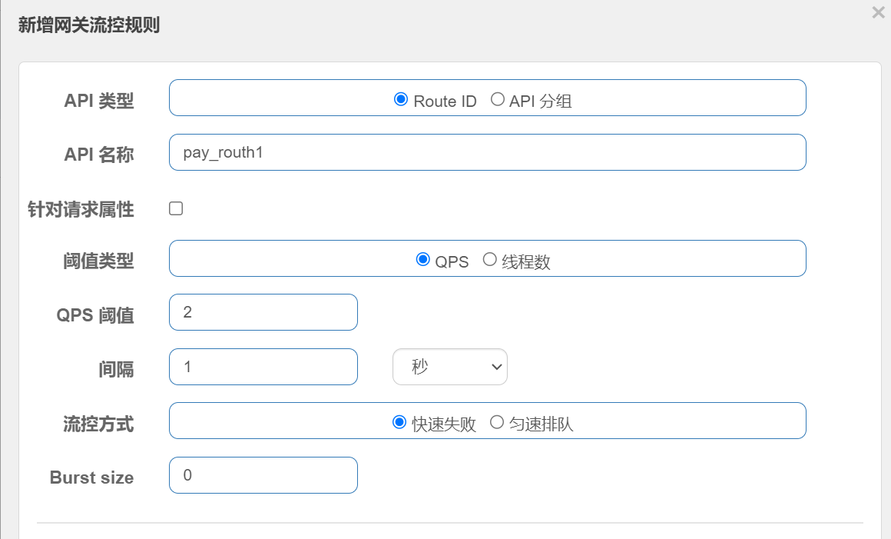


此时如果出发流控规则，发现报以下错误，这是因为项目环境是JDK17，依赖的spring-cloud-alibaba-sentinel-gateway版本为2022.0.0.0 ，检查发现其下的sentinel-spring-cloud-gateway-adapter-1.8.6.jar是JDK8编译的，简单来说就是`版本适配问题`

```java
java.lang.NoSuchMethodError: 'org.springframework.web.reactive.function.server.ServerResponse$BodyBuilder org.springframework.web.reactive.function.server.ServerResponse.status(org.springframework.http.HttpStatus)'

```

只需要自定义限流返回信息即可！有三种方式可以实现：

**1、yaml配置自定义返回信息**

```yaml
spring:
  cloud:
    ## 整合sentinel，配置sentinel控制台的地址
    sentinel:
      #配置限流之后，响应内容
      scg:
        fallback:
          ## 两种模式，一种是response返回文字提示信息，
          ## 一种是redirect，重定向跳转，需要同时配置redirect(跳转的uri)
          mode: response
          ## 响应的状态
          response-status: 200
          ## 响应体
          response-body: '{"code": 200,"message": "限流啦！请稍后再试"}'
```


**2、yaml配置重定向**

```yaml
spring:
  cloud:
    ## 整合sentinel，配置sentinel控制台的地址
    sentinel:
      #配置限流之后，响应内容
      scg:
        fallback:
          ## 两种模式，一种是response返回文字提示信息，一种是redirect，重定向跳转，需要同时配置redirect(跳转的uri)
          mode: redirect
          ## 跳转的URL
          redirect: http://www.baidu.com
```


**3、配置类方式**

```java
@Configuration
public class GatewayConfig {
    /**
     * 自定义限流处理器
     */
    @PostConstruct
    public void initBlockHandlers() {
        BlockRequestHandler blockHandler = (serverWebExchange, throwable) -> {
            Map map = new HashMap();
            map.put("code",200);
            map.put("message","请求失败，稍后重试！");
            return ServerResponse.status(HttpStatus.OK)
                    .contentType(MediaType.APPLICATION_JSON_UTF8)
                    .body(BodyInserters.fromObject(map));
        };
        GatewayCallbackManager.setBlockHandler(blockHandler);
    }
}

```


#### 配置类方式

这种方式可以在代码中配置 流控规则，不需要持久化，每次启动都会重新生成规则。

缺点就是 修改规则需要`改动代码`！

**POM**

```xml
    <!--Sentinel整合GateWay第二种方式：配置类方式-->
    <dependencies>
        <dependency>
            <groupId>org.springframework.cloud</groupId>
            <artifactId>spring-cloud-starter-gateway</artifactId>
        </dependency>
        <dependency>
            <groupId>com.alibaba.csp</groupId>
            <artifactId>sentinel-transport-simple-http</artifactId>
            <version>1.8.6</version>
        </dependency>
        <dependency>
            <groupId>com.alibaba.csp</groupId>
            <artifactId>sentinel-spring-cloud-gateway-adapter</artifactId>
            <version>1.8.6</version>
        </dependency>
        <dependency>
            <groupId>javax.annotation</groupId>
            <artifactId>javax.annotation-api</artifactId>
            <version>1.3.2</version>
            <scope>compile</scope>
        </dependency>
    </dependencies>
```


**配置类**

```java
@Configuration
public class GatewayConfiguration {

    private final List<ViewResolver> viewResolvers;
    private final ServerCodecConfigurer serverCodecConfigurer;

    public GatewayConfiguration(ObjectProvider<List<ViewResolver>> viewResolversProvider, ServerCodecConfigurer serverCodecConfigurer)
    {
        this.viewResolvers = viewResolversProvider.getIfAvailable(Collections::emptyList);
        this.serverCodecConfigurer = serverCodecConfigurer;
    }

    @Bean
    @Order(Ordered.HIGHEST_PRECEDENCE)
    public SentinelGatewayBlockExceptionHandler sentinelGatewayBlockExceptionHandler() {
        // Register the block exception handler for Spring Cloud Gateway.
        return new SentinelGatewayBlockExceptionHandler(viewResolvers, serverCodecConfigurer);
    }

    @Bean
    @Order(-1)
    public GlobalFilter sentinelGatewayFilter() {
        return new SentinelGatewayFilter();
    }

    @PostConstruct //javax.annotation.PostConstruct
    public void doInit() {
        initBlockHandler();
    }


    //处理/自定义返回的例外信息
    private void initBlockHandler() {
        Set<GatewayFlowRule> rules = new HashSet<>();
        //  定义流控规则
        rules.add(new GatewayFlowRule("pay_routh1").setCount(2).setIntervalSec(1));

        GatewayRuleManager.loadRules(rules);
        BlockRequestHandler handler = new BlockRequestHandler() {
            @Override
            public Mono<ServerResponse> handleRequest(ServerWebExchange exchange, Throwable t) {
                Map<String,String> map = new HashMap<>();

                map.put("errorCode", HttpStatus.TOO_MANY_REQUESTS.getReasonPhrase());
                map.put("errorMessage", "请求太过频繁，系统忙不过来，触发限流(sentinel+gataway整合Case)");

                return ServerResponse.status(HttpStatus.TOO_MANY_REQUESTS)
                        .contentType(MediaType.APPLICATION_JSON)
                        .body(BodyInserters.fromValue(map));
            }
        };
        GatewayCallbackManager.setBlockHandler(handler);
    }
}

```


#### 持久化规则

上面说了通过 控制台 的方式，需要持久化，否则一重启服务 规则都没了。

其实和 `3.3.6 持久化规则` 中讲解的方法一致，参数也一样。但是有俩点需要注意：

- 配置中的 `resource` 名称是你的 `routeId`
- 增加配置类（固定死的）：

```java
@Configuration
@Order(2)
public class SentinelPersistenceConfig {

    @Autowired
    private SentinelProperties sentinelProperties;

    @Bean
    public SentinelPersistenceConfig init() throws Exception {
        loadGWFlowRule();
        return new SentinelPersistenceConfig();
    }

    private void loadGWFlowRule() {
        sentinelProperties.getDatasource().entrySet().stream().filter(map -> {
            return map.getValue().getNacos() != null;
        }).forEach(map -> {
            NacosDataSourceProperties nacos = map.getValue().getNacos();
            ReadableDataSource<String, Set<GatewayFlowRule>> gwFlowRuleDataSource = new NacosDataSource<>(
                    nacos.getServerAddr(), nacos.getGroupId(), nacos.getDataId(),
                    source -> JSON.parseObject(source, new TypeReference<Set<GatewayFlowRule>>() {
                    }));
            GatewayRuleManager.register2Property(gwFlowRuleDataSource.getProperty());
        });
    }
}

```


**举例说明**

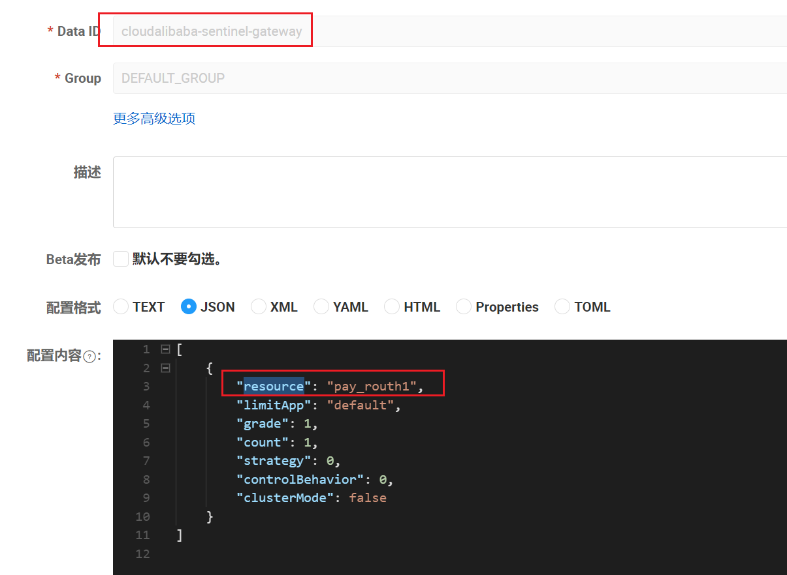


## 四、Seata

> 在订单支付成功后，交易中心会调用订单中心的服务把订单状态更新，并调用物流中心的服务通知商品发货，同时还要调用积分中心的服务为用户增加相应的积分。**如何保障分布式事务一致性，成为了确保订单业务稳定运行的核心诉求之一**。


### 4.1 介绍

Seata 是一款开源的分布式事务解决方案，致力于提供高性能和简单易用的分布式事务服务。Seata 将为用户提供了 `AT、TCC、SAGA 和 XA `事务模式，为用户打造一站式的分布式解决方案。(本次只讲解了 `AT` 模式)

> 官网文档：[https://seata.apache.org/zh-cn/docs/overview/what-is-seata](https://seata.apache.org/zh-cn/docs/overview/what-is-seata)


:::important
只需要使用一个  `@GlobalTransactional` 注解，seata就会帮我们管理分布式事务
:::


**工作流程**

分布式事务处理过程的一ID+三组件模型

- **Transaction ID XID**：全局唯一的事务ID
- **Transaction Coordinator (TC）**： `可以理解为 Seata`，负责维护全局事务和分支事务的状态，驱动全局事务提交或者回滚
- **Transaction Manager (TM)**：标注全局`@GlobalTransactional` 启动入口动作的微服务模块(比如订单模块)，他是事务的发起者，负责定义全局事务的范围，并根据 TC 维护的全局事务和分支事务状态，做出开始事务、提交事务、回滚事务的决议
- **Resource Manager (RM**）：就是 数据库本身，`可以是多个RM`，负责管理分支事务的资源，向TC注册分支事务，汇报分支事务的状态，驱动分支事务的提交或者回滚！


1. TM 向 TC 申请开启一个全局事务，全局事务创建成功并生成一个全局唯一的 XID；
2. XID 在微服务调用链路的上下文中传播，可以通过 RootContent 获取；
3. RM 向 TC 注册分支事务，将其纳入 XID 对应全局事务的管辖；
4. TM 向 TC 发起针对 XID 的全局提交或回滚决议；
5. TC 调度 XID 下管辖的全部分支事务完成提交或回滚请求。


### 4.2 下载

> https://seata.apache.org/zh-cn/unversioned/download/seata-server


#### 4.2.1 数据库准备

```sql
CREATE DATABASE seata;
USE seata;
```

SQL来源：https://github.com/apache/incubator-seata/blob/develop/script/server/db/mysql.sql

```sql
-- -------------------------------- The script used when storeMode is 'db' --------------------------------
-- the table to store GlobalSession data
CREATE TABLE IF NOT EXISTS `global_table`
(
    `xid`                       VARCHAR(128) NOT NULL,
    `transaction_id`            BIGINT,
    `status`                    TINYINT      NOT NULL,
    `application_id`            VARCHAR(32),
    `transaction_service_group` VARCHAR(32),
    `transaction_name`          VARCHAR(128),
    `timeout`                   INT,
    `begin_time`                BIGINT,
    `application_data`          VARCHAR(2000),
    `gmt_create`                DATETIME,
    `gmt_modified`              DATETIME,
    PRIMARY KEY (`xid`),
    KEY `idx_status_gmt_modified` (`status` , `gmt_modified`),
    KEY `idx_transaction_id` (`transaction_id`)
) ENGINE = InnoDB
  DEFAULT CHARSET = utf8mb4;

-- the table to store BranchSession data
CREATE TABLE IF NOT EXISTS `branch_table`
(
    `branch_id`         BIGINT       NOT NULL,
    `xid`               VARCHAR(128) NOT NULL,
    `transaction_id`    BIGINT,
    `resource_group_id` VARCHAR(32),
    `resource_id`       VARCHAR(256),
    `branch_type`       VARCHAR(8),
    `status`            TINYINT,
    `client_id`         VARCHAR(64),
    `application_data`  VARCHAR(2000),
    `gmt_create`        DATETIME(6),
    `gmt_modified`      DATETIME(6),
    PRIMARY KEY (`branch_id`),
    KEY `idx_xid` (`xid`)
) ENGINE = InnoDB
  DEFAULT CHARSET = utf8mb4;

-- the table to store lock data
CREATE TABLE IF NOT EXISTS `lock_table`
(
    `row_key`        VARCHAR(128) NOT NULL,
    `xid`            VARCHAR(128),
    `transaction_id` BIGINT,
    `branch_id`      BIGINT       NOT NULL,
    `resource_id`    VARCHAR(256),
    `table_name`     VARCHAR(32),
    `pk`             VARCHAR(36),
    `status`         TINYINT      NOT NULL DEFAULT '0' COMMENT '0:locked ,1:rollbacking',
    `gmt_create`     DATETIME,
    `gmt_modified`   DATETIME,
    PRIMARY KEY (`row_key`),
    KEY `idx_status` (`status`),
    KEY `idx_branch_id` (`branch_id`),
    KEY `idx_xid` (`xid`)
) ENGINE = InnoDB
  DEFAULT CHARSET = utf8mb4;

CREATE TABLE IF NOT EXISTS `distributed_lock`
(
    `lock_key`       CHAR(20) NOT NULL,
    `lock_value`     VARCHAR(20) NOT NULL,
    `expire`         BIGINT,
    primary key (`lock_key`)
) ENGINE = InnoDB
  DEFAULT CHARSET = utf8mb4;

INSERT INTO `distributed_lock` (lock_key, lock_value, expire) VALUES ('AsyncCommitting', ' ', 0);
INSERT INTO `distributed_lock` (lock_key, lock_value, expire) VALUES ('RetryCommitting', ' ', 0);
INSERT INTO `distributed_lock` (lock_key, lock_value, expire) VALUES ('RetryRollbacking', ' ', 0);
INSERT INTO `distributed_lock` (lock_key, lock_value, expire) VALUES ('TxTimeoutCheck', ' ', 0);
```


#### 4.2.2 配置

下载解压后，进入 `conf/` 目录，修改 `application.yaml` 配置文件：

```yaml
#  Copyright 1999-2019 Seata.io Group.

#

#  Licensed under the Apache License, Version 2.0 (the "License");

#  you may not use this file except in compliance with the License.

#  You may obtain a copy of the License at

#

#  http://www.apache.org/licenses/LICENSE-2.0

#

#  Unless required by applicable law or agreed to in writing, software

#  distributed under the License is distributed on an "AS IS" BASIS,

#  WITHOUT WARRANTIES OR CONDITIONS OF ANY KIND, either express or implied.

#  See the License for the specific language governing permissions and

#  limitations under the License.

 

server:

  port: 7091

 

spring:

  application:

    name: seata-server

 

logging:

  config: classpath:logback-spring.xml

  file:

    path: ${log.home:${user.home}/logs/seata}

  extend:

    logstash-appender:

      destination: 127.0.0.1:4560

    kafka-appender:

      bootstrap-servers: 127.0.0.1:9092

      topic: logback_to_logstash

 

console:

  user:

    username: seata

    password: seata

 

 

seata:

  config:

    type: nacos

    nacos:

      server-addr: 127.0.0.1:8848

      namespace:

      group: SEATA_GROUP #后续自己在nacos里面新建,不想新建SEATA_GROUP，就写DEFAULT_GROUP

      username: nacos

      password: nacos

  registry:

    type: nacos

    nacos:

      application: seata-server

      server-addr: 127.0.0.1:8848

      group: SEATA_GROUP #后续自己在nacos里面新建,不想新建SEATA_GROUP，就写DEFAULT_GROUP

      namespace:

      cluster: default

      username: nacos

      password: nacos    

  store:

    mode: db

    db:

      datasource: druid

      db-type: mysql

      driver-class-name: com.mysql.cj.jdbc.Driver

      url: jdbc:mysql://localhost:3306/seata?characterEncoding=utf8&useSSL=false&serverTimezone=GMT%2B8&rewriteBatchedStatements=true&allowPublicKeyRetrieval=true

      user: root

      password: 123456

      min-conn: 10

      max-conn: 100

      global-table: global_table

      branch-table: branch_table

      lock-table: lock_table

      distributed-lock-table: distributed_lock

      query-limit: 1000

      max-wait: 5000

 

 

 

  #  server:

  #    service-port: 8091 #If not configured, the default is '${server.port} + 1000'

  security:

    secretKey: SeataSecretKey0c382ef121d778043159209298fd40bf3850a017

    tokenValidityInMilliseconds: 1800000

    ignore:

      urls: /,/**/*.css,/**/*.js,/**/*.html,/**/*.map,/**/*.svg,/**/*.png,/**/*.jpeg,/**/*.ico,/api/v1/auth/login,/metadata/v1/**

 
```


**启动命令**：

> seata-server.bat

**控制台界面**

> http://localhost:7091


### 4.3 案例搭建

**需求说明**

这里我们创建三个服务，一个订单服务，一个库存服务，一个账户服务。

当用户下单时，会在订单服务中创建一个订单，然后通过远程调用库存服务来扣减下单商品的库存，再通过远程调用账户服务来扣减用户账户里面的余额，最后在订单服务中修改订单状态为已完成

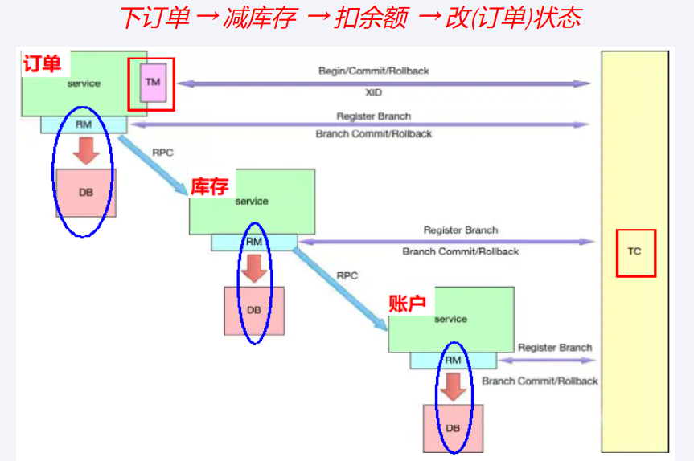

#### **数据库创建**

创建三个数据库、三张表、每个库中增加 ` undo_log` 表

> SQL来源：https://github.com/apache/incubator-seata/blob/develop/script/client/at/db/mysql.sql

```sql
#order

CREATE DATABASE seata_order;

USE seata_order;

 

CREATE TABLE t_order(

`id` BIGINT(11) NOT NULL AUTO_INCREMENT PRIMARY KEY,

`user_id` BIGINT(11) DEFAULT NULL COMMENT '用户id',

`product_id` BIGINT(11)DEFAULT NULL COMMENT '产品id',

`count` INT(11) DEFAULT NULL COMMENT '数量',

`money` DECIMAL(11,0) DEFAULT NULL COMMENT '金额',

`status` INT(1) DEFAULT NULL COMMENT '订单状态: 0:创建中; 1:已完结'

)ENGINE=INNODB AUTO_INCREMENT=1 DEFAULT CHARSET=utf8;

 

SELECT * FROM t_order;


-- for AT mode you must to init this sql for you business database. the seata server not need it.

CREATE TABLE IF NOT EXISTS `undo_log`

(

    `branch_id`     BIGINT       NOT NULL COMMENT 'branch transaction id',

    `xid`           VARCHAR(128) NOT NULL COMMENT 'global transaction id',

    `context`       VARCHAR(128) NOT NULL COMMENT 'undo_log context,such as serialization',

    `rollback_info` LONGBLOB     NOT NULL COMMENT 'rollback info',

    `log_status`    INT(11)      NOT NULL COMMENT '0:normal status,1:defense status',

    `log_created`   DATETIME(6)  NOT NULL COMMENT 'create datetime',

    `log_modified`  DATETIME(6)  NOT NULL COMMENT 'modify datetime',

    UNIQUE KEY `ux_undo_log` (`xid`, `branch_id`)

) ENGINE = InnoDB AUTO_INCREMENT = 1 DEFAULT CHARSET = utf8mb4 COMMENT ='AT transaction mode undo table';

ALTER TABLE `undo_log` ADD INDEX `ix_log_created` (`log_created`);
```


```sql
#storage

CREATE DATABASE seata_storage;

 

USE seata_storage;

 

CREATE TABLE t_storage(

`id` BIGINT(11) NOT NULL AUTO_INCREMENT PRIMARY KEY,

`product_id` BIGINT(11) DEFAULT NULL COMMENT '产品id',

`total` INT(11) DEFAULT NULL COMMENT '总库存',

`used` INT(11) DEFAULT NULL COMMENT '已用库存',

`residue` INT(11) DEFAULT NULL COMMENT '剩余库存'

)ENGINE=INNODB AUTO_INCREMENT=1 DEFAULT CHARSET=utf8;

 

INSERT INTO t_storage(`id`,`product_id`,`total`,`used`,`residue`)VALUES('1','1','100','0','100');

 

SELECT * FROM t_storage;


 -- for AT mode you must to init this sql for you business database. the seata server not need it.

CREATE TABLE IF NOT EXISTS `undo_log`

(

    `branch_id`     BIGINT       NOT NULL COMMENT 'branch transaction id',

    `xid`           VARCHAR(128) NOT NULL COMMENT 'global transaction id',

    `context`       VARCHAR(128) NOT NULL COMMENT 'undo_log context,such as serialization',

    `rollback_info` LONGBLOB     NOT NULL COMMENT 'rollback info',

    `log_status`    INT(11)      NOT NULL COMMENT '0:normal status,1:defense status',

    `log_created`   DATETIME(6)  NOT NULL COMMENT 'create datetime',

    `log_modified`  DATETIME(6)  NOT NULL COMMENT 'modify datetime',

    UNIQUE KEY `ux_undo_log` (`xid`, `branch_id`)

) ENGINE = InnoDB AUTO_INCREMENT = 1 DEFAULT CHARSET = utf8mb4 COMMENT ='AT transaction mode undo table';

ALTER TABLE `undo_log` ADD INDEX `ix_log_created` (`log_created`);
```


```sql
#account

create database seata_account;

 

use seata_account;

 

CREATE TABLE t_account(

`id` BIGINT(11) NOT NULL AUTO_INCREMENT PRIMARY KEY COMMENT 'id',

`user_id` BIGINT(11) DEFAULT NULL COMMENT '用户id',

`total` DECIMAL(10,0) DEFAULT NULL COMMENT '总额度',

`used` DECIMAL(10,0) DEFAULT NULL COMMENT '已用余额',

`residue` DECIMAL(10,0) DEFAULT '0' COMMENT '剩余可用额度'

)ENGINE=INNODB AUTO_INCREMENT=2 DEFAULT CHARSET=utf8;

 

INSERT INTO t_account(`id`,`user_id`,`total`,`used`,`residue`)VALUES('1','1','1000','0','1000');

 

SELECT * FROM t_account;

 -- for AT mode you must to init this sql for you business database. the seata server not need it.

CREATE TABLE IF NOT EXISTS `undo_log`

(

    `branch_id`     BIGINT       NOT NULL COMMENT 'branch transaction id',

    `xid`           VARCHAR(128) NOT NULL COMMENT 'global transaction id',

    `context`       VARCHAR(128) NOT NULL COMMENT 'undo_log context,such as serialization',

    `rollback_info` LONGBLOB     NOT NULL COMMENT 'rollback info',

    `log_status`    INT(11)      NOT NULL COMMENT '0:normal status,1:defense status',

    `log_created`   DATETIME(6)  NOT NULL COMMENT 'create datetime',

    `log_modified`  DATETIME(6)  NOT NULL COMMENT 'modify datetime',

    UNIQUE KEY `ux_undo_log` (`xid`, `branch_id`)

) ENGINE = InnoDB AUTO_INCREMENT = 1 DEFAULT CHARSET = utf8mb4 COMMENT ='AT transaction mode undo table';

ALTER TABLE `undo_log` ADD INDEX `ix_log_created` (`log_created`);
```


**MyBatis一键生成代码**

`config.properties`

```properties
# seata_order
#jdbc.driverClass = com.mysql.cj.jdbc.Driver
#jdbc.url = jdbc:mysql://localhost:3306/seata_order?characterEncoding=utf8&useSSL=false&serverTimezone=GMT%2B8&rewriteBatchedStatements=true&allowPublicKeyRetrieval=true
#jdbc.user = root
#jdbc.password =root

# seata_storage
#jdbc.driverClass = com.mysql.cj.jdbc.Driver
#jdbc.url = jdbc:mysql://localhost:3306/seata_storage?characterEncoding=utf8&useSSL=false&serverTimezone=GMT%2B8&rewriteBatchedStatements=true&allowPublicKeyRetrieval=true
#jdbc.user = root
#jdbc.password =root

# seata_account
jdbc.driverClass = com.mysql.cj.jdbc.Driver
jdbc.url = jdbc:mysql://localhost:3306/seata_account?characterEncoding=utf8&useSSL=false&serverTimezone=GMT%2B8&rewriteBatchedStatements=true&allowPublicKeyRetrieval=true
jdbc.user = root
jdbc.password =root
```


`generatorConfig.xml`

```xml
        <!--  seata_order -->
<!--        <table tableName="t_order" domainObjectName="Order">
            <generatedKey column="id" sqlStatement="JDBC"/>
        </table>-->

        <!--seata_storage-->
<!--        <table tableName="t_storage" domainObjectName="Storage">
            <generatedKey column="id" sqlStatement="JDBC"/>
        </table>-->

        <!--seata_account-->
        <table tableName="t_account" domainObjectName="Account">
            <generatedKey column="id" sqlStatement="JDBC"/>
        </table>
```


`cloud-api-commons` 增加 `StorageFeignApi`、`AccountFeignApi` 俩个OpenFeign调用接口

```java
@FeignClient(value = "seata-account-service")
public interface AccountFeignApi
{
    //扣减账户余额
    @PostMapping("/account/decrease")
    ResultData decrease(@RequestParam("userId") Long userId, @RequestParam("money") Long money);

```

```java
@FeignClient(value = "seata-account-service")
public interface AccountFeignApi {
    //扣减账户余额
    @PostMapping("/account/decrease")
    ResultData decrease(@RequestParam("userId") Long userId, @RequestParam("money") Long money);
}
```


#### **新建订单 Order 微服务**

将自动生成的 entity、mapper放到对应的文件夹，此步骤省略~

**POM**

```xml
   <dependencies>
        <!-- nacos -->
        <dependency>
            <groupId>com.alibaba.cloud</groupId>
            <artifactId>spring-cloud-starter-alibaba-nacos-discovery</artifactId>
        </dependency>
        <!--alibaba-seata-->
        <dependency>
            <groupId>com.alibaba.cloud</groupId>
            <artifactId>spring-cloud-starter-alibaba-seata</artifactId>
        </dependency>
        <!--openfeign-->
        <dependency>
            <groupId>org.springframework.cloud</groupId>
            <artifactId>spring-cloud-starter-openfeign</artifactId>
        </dependency>
        <!--loadbalancer-->
        <dependency>
            <groupId>org.springframework.cloud</groupId>
            <artifactId>spring-cloud-starter-loadbalancer</artifactId>
        </dependency>
        <!--cloud-api-commons-->
        <dependency>
            <groupId>com.atguigu.cloud</groupId>
            <artifactId>cloud-api-commons</artifactId>
            <version>1.0-SNAPSHOT</version>
        </dependency>
        <!--web + actuator-->
        <dependency>
            <groupId>org.springframework.boot</groupId>
            <artifactId>spring-boot-starter-web</artifactId>
        </dependency>
        <dependency>
            <groupId>org.springframework.boot</groupId>
            <artifactId>spring-boot-starter-actuator</artifactId>
        </dependency>
        <!--SpringBoot集成druid连接池-->
        <dependency>
            <groupId>com.alibaba</groupId>
            <artifactId>druid-spring-boot-starter</artifactId>
        </dependency>
        <!-- Swagger3 调用方式 http://你的主机IP地址:5555/swagger-ui/index.html -->
        <dependency>
            <groupId>org.springdoc</groupId>
            <artifactId>springdoc-openapi-starter-webmvc-ui</artifactId>
        </dependency>
        <!--mybatis和springboot整合-->
        <dependency>
            <groupId>org.mybatis.spring.boot</groupId>
            <artifactId>mybatis-spring-boot-starter</artifactId>
        </dependency>
        <!--Mysql数据库驱动8 -->
        <dependency>
            <groupId>mysql</groupId>
            <artifactId>mysql-connector-java</artifactId>
        </dependency>
        <!--persistence-->
        <dependency>
            <groupId>javax.persistence</groupId>
            <artifactId>persistence-api</artifactId>
        </dependency>
        <!--通用Mapper4-->
        <dependency>
            <groupId>tk.mybatis</groupId>
            <artifactId>mapper</artifactId>
        </dependency>
        <!--hutool-->
        <dependency>
            <groupId>cn.hutool</groupId>
            <artifactId>hutool-all</artifactId>
        </dependency>
        <!-- fastjson2 -->
        <dependency>
            <groupId>com.alibaba.fastjson2</groupId>
            <artifactId>fastjson2</artifactId>
        </dependency>
        <!--lombok-->
        <dependency>
            <groupId>org.projectlombok</groupId>
            <artifactId>lombok</artifactId>
            <version>1.18.28</version>
            <scope>provided</scope>
        </dependency>
        <!--test-->
        <dependency>
            <groupId>org.springframework.boot</groupId>
            <artifactId>spring-boot-starter-test</artifactId>
            <scope>test</scope>
        </dependency>
    </dependencies>
```


**yaml**

```yaml
server:
    port: 2001

spring:
    application:
        name: seata-order-service
    cloud:
        nacos:
            discovery:
                server-addr: localhost:8848         #Nacos服务注册中心地址
    # ==========applicationName + druid-mysql8 driver===================
    datasource:
        type: com.alibaba.druid.pool.DruidDataSource
        driver-class-name: com.mysql.cj.jdbc.Driver
        url: jdbc:mysql://localhost:3306/seata_order?characterEncoding=utf8&useSSL=false&serverTimezone=GMT%2B8&rewriteBatchedStatements=true&allowPublicKeyRetrieval=true
        username: root
        password: root
# ========================mybatis===================
mybatis:
    mapper-locations: classpath:mapper/*.xml
    type-aliases-package: com.atguigu.cloud.entities
    configuration:
        map-underscore-to-camel-case: true

# ========================seata===================
seata:
    registry:
        type: nacos
        nacos:
            server-addr: 127.0.0.1:8848
            namespace: ""
            group: SEATA_GROUP
            application: seata-server
    tx-service-group: default_tx_group # 事务组，由它获得TC服务的集群名称
    service:
        vgroup-mapping: # 点击源码分析
            default_tx_group: default # 事务组与TC服务集群的映射关系
    data-source-proxy-mode: AT

logging:
    level:
        io:
            seata: info

```


**主启动类**

```java
@SpringBootApplication
@MapperScan("com.atguigu.cloud.mapper") //import tk.mybatis.spring.annotation.MapperScan;
@EnableDiscoveryClient //服务注册和发现
@EnableFeignClients
public class SeataOrderMainApp2001 {
    public static void main(String[] args) {
        SpringApplication.run(SeataOrderMainApp2001.class,args);
    }
}

```


**service**

```java
public interface OrderService {

    /**
     * 创建订单
     */
    void create(Order order);

}

```


**controller**

```java
@RestController
public class OrderController {

    @Resource
    private OrderService orderService;

    /**
     * 创建订单
     */
    @GetMapping("/order/create")
    public ResultData create(Order order)
    {
        orderService.create(order);
        return ResultData.success(order);
    }
}
```


**serviceImpl**

**流程**：

插入订单  --》扣减库存 --》扣减账号余额 ---》修改订单状态

` String xid = RootContext.getXID();`  用于获取全局事务ID，建议每次使用都打印出来，方便检查！

```java
@Slf4j
@Service
public class OrderServiceImpl implements OrderService
{
    @Resource
    private OrderMapper orderMapper;
    @Resource//订单微服务通过OpenFeign去调用库存微服务
    private StorageFeignApi storageFeignApi;
    @Resource//订单微服务通过OpenFeign去调用账户微服务
    private AccountFeignApi accountFeignApi;


    @Override
    @GlobalTransactional(name = "zzyy-create-order",rollbackFor = Exception.class) //AT
    //@GlobalTransactional @Transactional(rollbackFor = Exception.class) //XA
    public void create(Order order) {

        // !!!xid检查
        String xid = RootContext.getXID();

        //1. 新建订单
        log.info("==================>开始新建订单"+"\t"+"xid_order:" +xid);
        //订单状态status：0：创建中；1：已完结
        order.setStatus(0);
        int result = orderMapper.insertSelective(order);

        //插入订单成功后获得插入mysql的实体对象
        Order orderFromDB = null;
        if(result > 0)
        {
            orderFromDB = orderMapper.selectOne(order);
            //orderFromDB = orderMapper.selectByPrimaryKey(order.getId());
            log.info("-------> 新建订单成功，orderFromDB info: "+orderFromDB);
            System.out.println();
            //2. 扣减库存
            log.info("-------> 订单微服务开始调用Storage库存，做扣减count");
            storageFeignApi.decrease(orderFromDB.getProductId(), orderFromDB.getCount());
            log.info("-------> 订单微服务结束调用Storage库存，做扣减完成");
            System.out.println();
            //3. 扣减账号余额
            log.info("-------> 订单微服务开始调用Account账号，做扣减money");
            accountFeignApi.decrease(orderFromDB.getUserId(), orderFromDB.getMoney());
            log.info("-------> 订单微服务结束调用Account账号，做扣减完成");
            System.out.println();
            //4. 修改订单状态
            //订单状态status：0：创建中；1：已完结
            log.info("-------> 修改订单状态");
            orderFromDB.setStatus(1);

            // Example类似于MP中的QueryWrapper
            Example whereCondition=new Example(Order.class);
            Example.Criteria criteria=whereCondition.createCriteria();
            criteria.andEqualTo("userId",orderFromDB.getUserId());
            criteria.andEqualTo("status",0);

            int updateResult = orderMapper.updateByExampleSelective(orderFromDB, whereCondition);

            log.info("-------> 修改订单状态完成"+"\t"+updateResult);
            log.info("-------> orderFromDB info: "+orderFromDB);
        }
        System.out.println();
        log.info("==================>结束新建订单"+"\t"+"xid_order:" +xid);

    }
}

```


#### 新建库存 Storage 微服务

> 启动类、yaml、POM 三个模块都一样，省略了~


`StorageMapper.xml`

```xml
  <update id="decrease">
    UPDATE
      t_storage
    SET
      used = used + #{count},
      residue = residue - #{count}
    WHERE product_id = #{productId}
  </update>
```

`StorageService`

```java
public interface StorageService {
    /**
     * 扣减库存
     */
    void decrease(Long productId, Integer count);
}
```

`StorageServiceImpl`

```java
@Service
@Slf4j
public class StorageServiceImpl implements StorageService
{

    @Resource
    private StorageMapper storageMapper;

    /**
     * 扣减库存
     */
    @Override
    public void decrease(Long productId, Integer count) {
        log.info("------->storage-service中扣减库存开始");
        storageMapper.decrease(productId,count);
        log.info("------->storage-service中扣减库存结束");
    }
}
```


`StorageController`

```java
@RestController
public class StorageController {
    @Resource
    private StorageService storageService;

    /**
     * 扣减库存
     */
    @RequestMapping("/storage/decrease")
    public ResultData decrease(Long productId, Integer count) {

        storageService.decrease(productId, count);
        return ResultData.success("扣减库存成功!");
    }
}
```


#### 新建库存 Account 微服务

> 启动类、yaml、POM 三个模块都一样，省略了~


`AccountMapper.xml`

```xml
  <update id="decrease">
    UPDATE
      t_account
    SET
      residue = residue - #{money},used = used + #{money}
    WHERE user_id = #{userId};
  </update>
```


`AccountService`

```java
public interface AccountService {
    /**
     * 扣减库存
     */
    void decrease(@Param("userId") Long userId, @Param("money") Long money);

}
```


`AccountServiceImpl`

```java
@Service
@Slf4j
public class AccountServiceImpl implements AccountService
{
    @Resource
    AccountMapper accountMapper;

    /**
     * 扣减账户余额
     */
    @Override
    public void decrease(Long userId, Long money) {
        log.info("------->account-service中扣减账户余额开始");

        accountMapper.decrease(userId,money);

        //myTimeOut();
        //int age = 10/0;
        log.info("------->account-service中扣减账户余额结束");
    }

    /**
     * 模拟超时异常，全局事务回滚
     */
    private static void myTimeOut()
    {
        try { TimeUnit.SECONDS.sleep(65); } catch (InterruptedException e) { e.printStackTrace(); }
    }
}
```


`AccountController`

```java
@RestController
public class AccountController {

    @Resource
    AccountService accountService;

    /**
     * 扣减账户余额
     */
    @RequestMapping("/account/decrease")
    public ResultData decrease(@RequestParam("userId") Long userId, @RequestParam("money") Long money){
        accountService.decrease(userId,money);
        return ResultData.success("扣减账户余额成功！");
    }
}

```


#### **测试**

> http://localhost:2001/order/create?userId=1&productId=1&count=10&money=100

- 在没有增加 `@GlobalTransactional` 的情况下：

在  `seata-account-service2003` 中，扣减账户时，设置超时，OpenFeign 默认超时 60S，

超过 60S 就会报错！

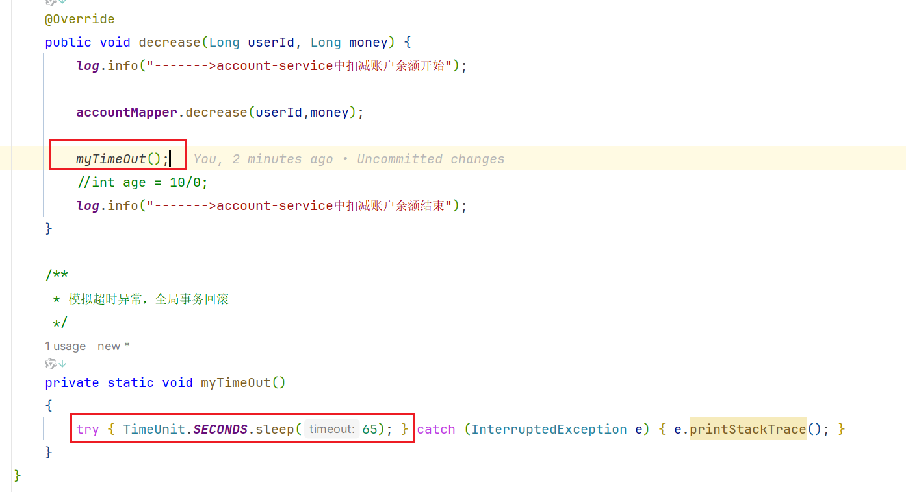


**先来观察数据库的初始情况**：


发送请求完，发现订单创建了、库存扣减了、 但是在账户上却没有扣减，这就没有保证数据一致性的问题！

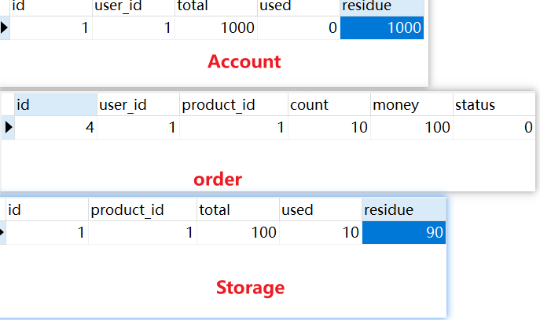


- 增加 `@GlobalTransactional` 的情况下：

再来看一下这个图，事务的发起者 TM 上增加 `@GlobalTransactional` 注解，在本案例中就是在订单服务中增加

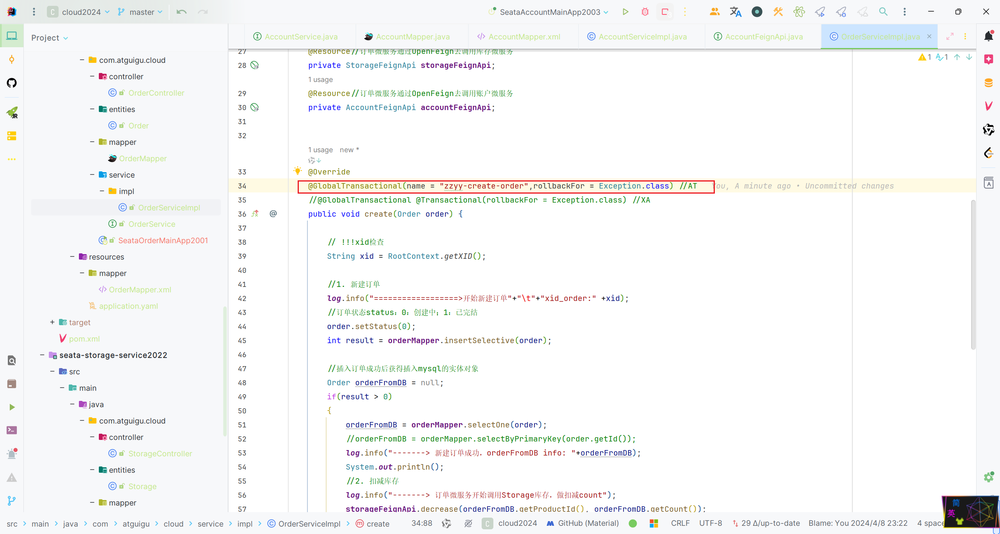


此时在发送请求时，数据库正常回滚了！

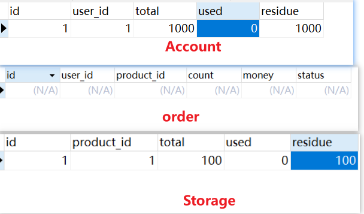


### 4.4 Seata 原理

> 默认讲解的模式为 `AT`

采用`两阶段提交协议`的演变，保证分布式事务：

**在一阶段 --- 加载**，Seata 会拦截“业务 SQL”，

- 解析 SQL 语义，找到“`业务 SQL`”要更新的业务数据，在业务数据被更新前，将其保存成  `before image`，
- 执行“业务 SQL”更新业务数据，在业务数据更新之后，
-  其保存成 `after image`，最后生成行锁。

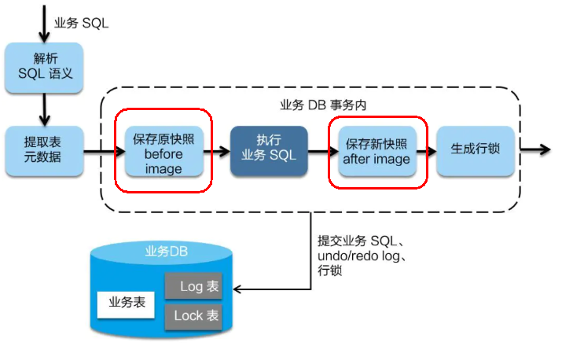

**第二阶段 ---- 提交**

二阶段如是顺利提交的话，因为“业务 SQL”在一阶段已经提交至数据库，所以Seata框架只需将一阶段保存的`快照数据`和`行锁`删掉，完成数据清理即可。


**二阶段 ----- 回滚**

二阶段如果是回滚的话，Seata 就需要回滚一阶段已经执行的“业务 SQL”，还原业务数据。
回滚方式便是用“before image”还原业务数据；

但在还原前要首先要校验脏写，对比“数据库当前业务数据”和 “after image”，如果两份数据完全一致就说明没有脏写，可以还原业务数据，如果不一致就说明有脏写，出现脏写就需要转人工处理。
