# SpringCloud

:::tip 
本文档只讲解微服务的基础使用,想要了解深层次的原理请跳过，避免耽误时间！！

所有代码均在GitHub,需要请自取

[https://github.com/yangzhaoguang/cloud2024.git](https://github.com/yangzhaoguang/cloud2024.git)
:::

**目前常用的组件**：

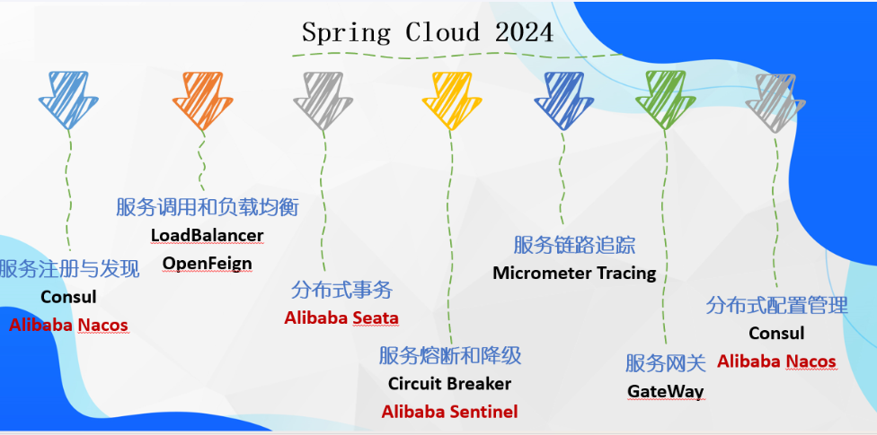


## 一、搭建示例项目

:::note
 以下为详细的搭建流程，若嫌麻烦 可以接 clone 我的代码，回退到 `BASE CODE` 即可！！
[https://github.com/yangzhaoguang/cloud2024.git](https://github.com/yangzhaoguang/cloud2024.git) 
:::

**业务图**

模拟订单支付的简单业务

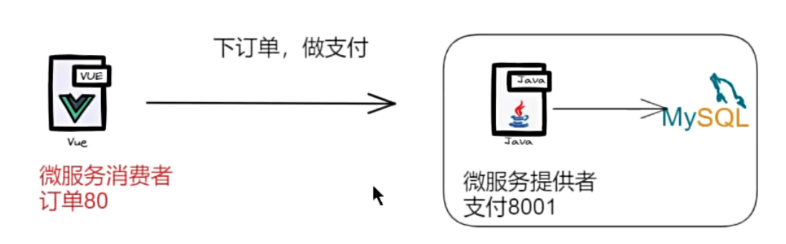


> 数据库表SQL

```sql
DROP TABLE IF EXISTS `t_pay`;

 

CREATE TABLE `t_pay` (

  `id` INT(10) UNSIGNED NOT NULL AUTO_INCREMENT,

  `pay_no` VARCHAR(50) NOT NULL COMMENT '支付流水号',

  `order_no` VARCHAR(50) NOT NULL COMMENT '订单流水号',

  `user_id` INT(10) DEFAULT '1' COMMENT '用户账号ID',

  `amount` DECIMAL(8,2) NOT NULL DEFAULT '9.9' COMMENT '交易金额',

  `deleted` TINYINT(4) UNSIGNED NOT NULL DEFAULT '0' COMMENT '删除标志，默认0不删除，1删除',

  `create_time` TIMESTAMP NOT NULL DEFAULT CURRENT_TIMESTAMP COMMENT '创建时间',

  `update_time` TIMESTAMP NOT NULL DEFAULT CURRENT_TIMESTAMP ON UPDATE CURRENT_TIMESTAMP COMMENT '更新时间',

  PRIMARY KEY (`id`)

) ENGINE=INNODB AUTO_INCREMENT=1 DEFAULT CHARSET=utf8mb4 COMMENT='支付交易表';

 

INSERT INTO t_pay(pay_no,order_no) VALUES('pay17203699','6544bafb424a');

 

SELECT * FROM t_pay;
```


### 1.1 环境搭建

**版本要求**

:::important
由于Maven使用版本较高，可能需要将IDEA升级成2023（2022不知道行不行，反正2021不行~~）
:::

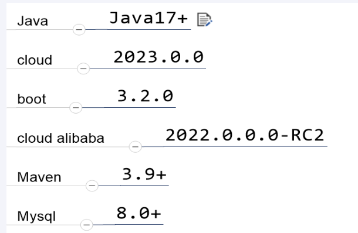

**搭建Maven父工程**

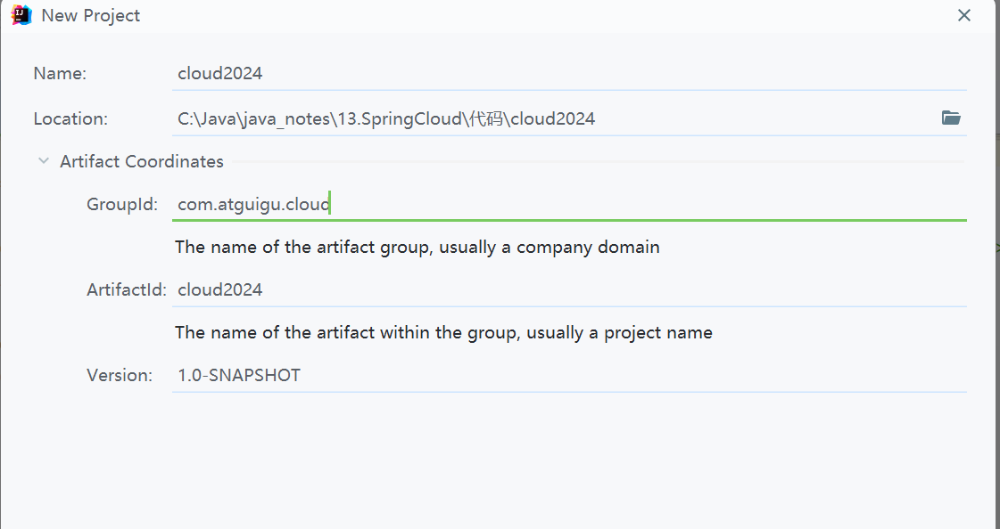

**一些Setting**

**字符编码**

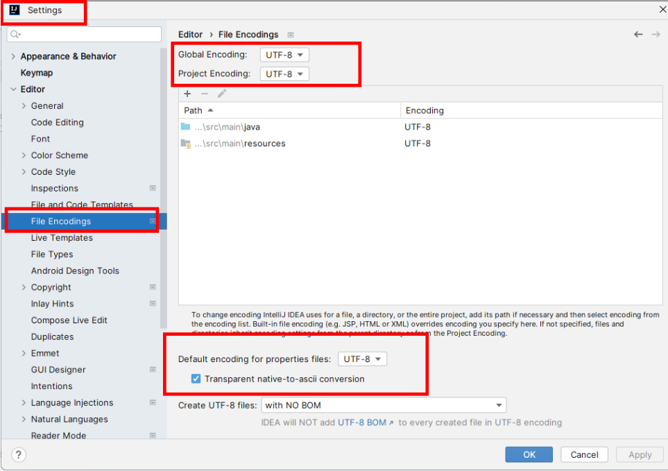

**注解生效**

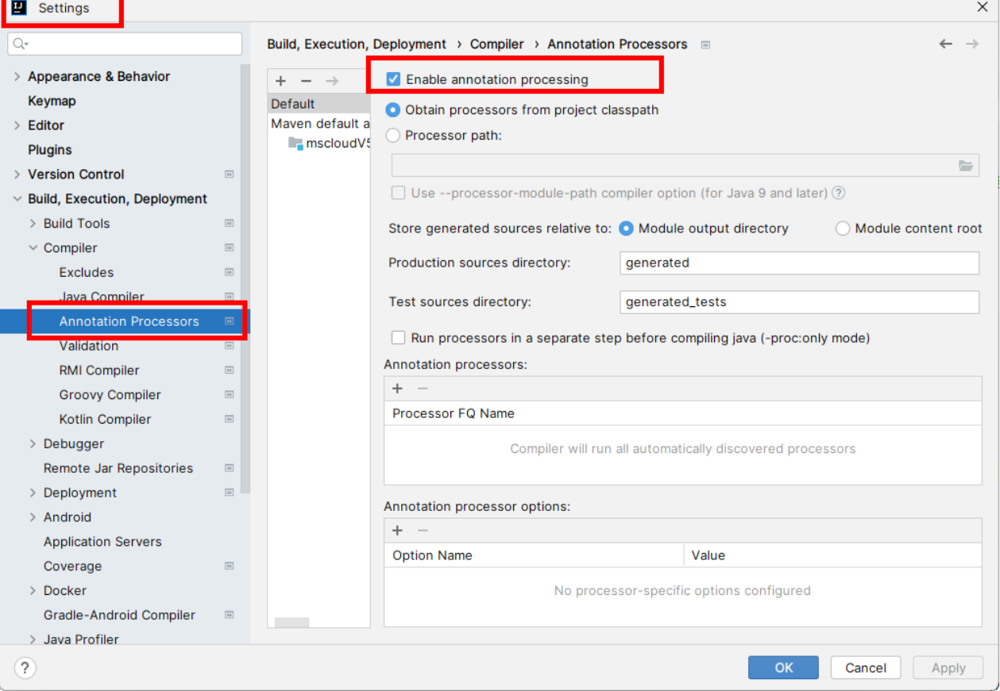

**Java编译版本**

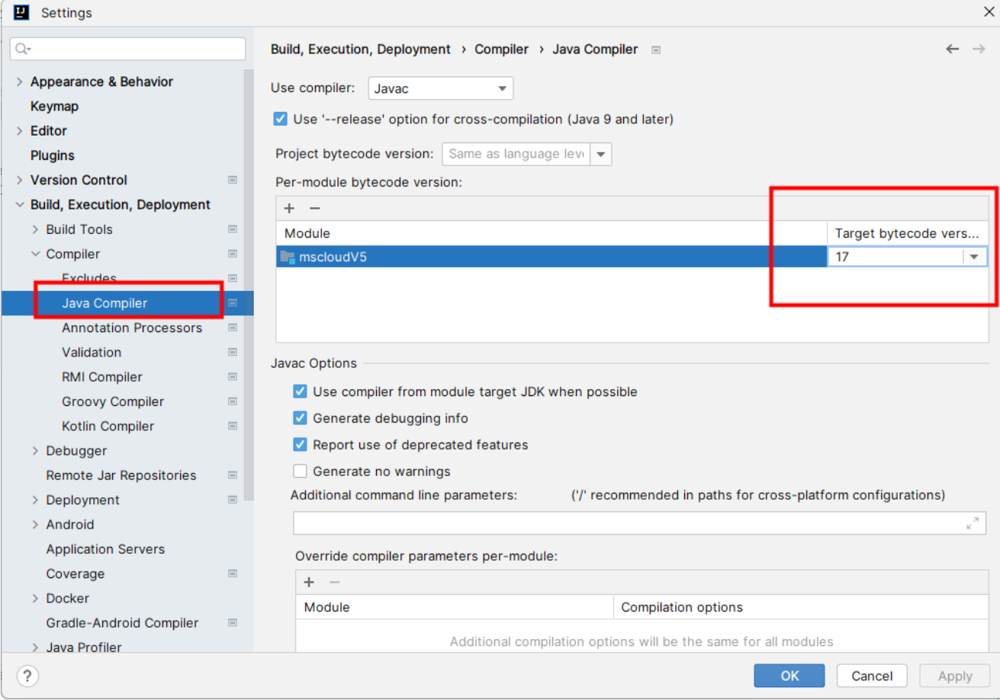

**POM**

> **dependencyManagement 和 dependencies 的区别：**
>
> dependencyManagement  是用来管理版本依赖版本号的 ，出现在父工程中 。所有的子项目都统一使用同一个版本号。 dependencyManagement  并不会引入 jar 包 ，而是声明 jar 包，真正引入 jar 应该在 子工程的 dependencies  下 ，而在子工程中不需要写另外的版本号，如果需要新的版本号在子工程中重新指明 version 即可 ！

```xml
<?xml version="1.0" encoding="UTF-8"?>
<project xmlns="http://maven.apache.org/POM/4.0.0"
         xmlns:xsi="http://www.w3.org/2001/XMLSchema-instance"
         xsi:schemaLocation="http://maven.apache.org/POM/4.0.0 http://maven.apache.org/xsd/maven-4.0.0.xsd">
    <modelVersion>4.0.0</modelVersion>

    <groupId>com.atguigu.cloud</groupId>
    <artifactId>cloud2024</artifactId>
    <version>1.0-SNAPSHOT</version>
    <packaging>pom</packaging>

    <properties>
        <maven.compiler.source>17</maven.compiler.source>
        <maven.compiler.target>17</maven.compiler.target>
        <project.build.sourceEncoding>UTF-8</project.build.sourceEncoding>
        <hutool.version>5.8.22</hutool.version>
        <lombok.version>1.18.26</lombok.version>
        <druid.version>1.1.20</druid.version>
        <mybatis.springboot.version>3.0.2</mybatis.springboot.version>
        <mysql.version>8.0.11</mysql.version>
        <swagger3.version>2.2.0</swagger3.version>
        <mapper.version>4.2.3</mapper.version>
        <fastjson2.version>2.0.40</fastjson2.version>
        <persistence-api.version>1.0.2</persistence-api.version>
        <spring.boot.test.version>3.1.5</spring.boot.test.version>
        <spring.boot.version>3.2.0</spring.boot.version>
        <spring.cloud.version>2023.0.0</spring.cloud.version>
        <spring.cloud.alibaba.version>2022.0.0.0-RC2</spring.cloud.alibaba.version>
    </properties>

    <dependencyManagement>
        <dependencies>
            <!--springboot 3.2.0-->
            <dependency>
                <groupId>org.springframework.boot</groupId>
                <artifactId>spring-boot-starter-parent</artifactId>
                <version>${spring.boot.version}</version>
                <type>pom</type>
                <scope>import</scope>
            </dependency>
            <!--springcloud 2023.0.0-->
            <dependency>
                <groupId>org.springframework.cloud</groupId>
                <artifactId>spring-cloud-dependencies</artifactId>
                <version>${spring.cloud.version}</version>
                <type>pom</type>
                <scope>import</scope>
            </dependency>
            <!--springcloud alibaba 2022.0.0.0-RC2-->
            <dependency>
                <groupId>com.alibaba.cloud</groupId>
                <artifactId>spring-cloud-alibaba-dependencies</artifactId>
                <version>${spring.cloud.alibaba.version}</version>
                <type>pom</type>
                <scope>import</scope>
            </dependency>
            <!--SpringBoot集成mybatis-->
            <dependency>
                <groupId>org.mybatis.spring.boot</groupId>
                <artifactId>mybatis-spring-boot-starter</artifactId>
                <version>${mybatis.springboot.version}</version>
            </dependency>
            <!--Mysql数据库驱动8 -->
            <dependency>
                <groupId>mysql</groupId>
                <artifactId>mysql-connector-java</artifactId>
                <version>${mysql.version}</version>
            </dependency>
            <!--SpringBoot集成druid连接池-->
            <dependency>
                <groupId>com.alibaba</groupId>
                <artifactId>druid-spring-boot-starter</artifactId>
                <version>${druid.version}</version>
            </dependency>
            <!--通用Mapper4之tk.mybatis-->
            <dependency>
                <groupId>tk.mybatis</groupId>
                <artifactId>mapper</artifactId>
                <version>${mapper.version}</version>
            </dependency>
            <!--persistence-->
            <dependency>
                <groupId>javax.persistence</groupId>
                <artifactId>persistence-api</artifactId>
                <version>${persistence-api.version}</version>
            </dependency>
            <!-- fastjson2 -->
            <dependency>
                <groupId>com.alibaba.fastjson2</groupId>
                <artifactId>fastjson2</artifactId>
                <version>${fastjson2.version}</version>
            </dependency>
            <!-- swagger3 调用方式 http://你的主机IP地址:5555/swagger-ui/index.html -->
            <dependency>
                <groupId>org.springdoc</groupId>
                <artifactId>springdoc-openapi-starter-webmvc-ui</artifactId>
                <version>${swagger3.version}</version>
            </dependency>
            <!--hutool-->
            <dependency>
                <groupId>cn.hutool</groupId>
                <artifactId>hutool-all</artifactId>
                <version>${hutool.version}</version>
            </dependency>
            <!--lombok-->
            <dependency>
                <groupId>org.projectlombok</groupId>
                <artifactId>lombok</artifactId>
                <version>${lombok.version}</version>
                <optional>true</optional>
            </dependency>
            <!-- spring-boot-starter-test -->
            <dependency>
                <groupId>org.springframework.boot</groupId>
                <artifactId>spring-boot-starter-test</artifactId>
                <version>${spring.boot.test.version}</version>
                <scope>test</scope>
            </dependency>
        </dependencies>
    </dependencyManagement>
</project>

```


### 1.2 Mapper4一键生成

> 官网：[https://github.com/abel533/Mapper](https://github.com/abel533/Mapper)


创建一个名称为 `mybatis_generator2024` 的Maven工程

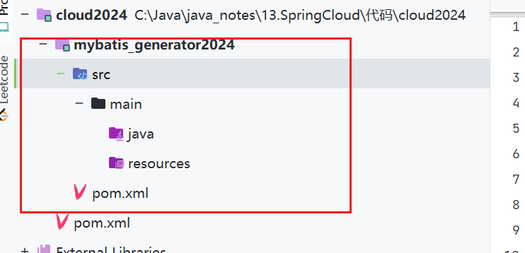

引入 `POM`：

```xml
    <dependencies>
        <!--Mybatis 通用mapper tk单独使用，自己独有+自带版本号-->
        <dependency>
            <groupId>org.mybatis</groupId>
            <artifactId>mybatis</artifactId>
            <version>3.5.13</version>
        </dependency>
        <!-- Mybatis Generator 自己独有+自带版本号-->
        <dependency>
            <groupId>org.mybatis.generator</groupId>
            <artifactId>mybatis-generator-core</artifactId>
            <version>1.4.2</version>
        </dependency>
        <!--通用Mapper-->
        <dependency>
            <groupId>tk.mybatis</groupId>
            <artifactId>mapper</artifactId>
        </dependency>
        <!--mysql8.0-->
        <dependency>
            <groupId>mysql</groupId>
            <artifactId>mysql-connector-java</artifactId>
        </dependency>
        <!--persistence-->
        <dependency>
            <groupId>javax.persistence</groupId>
            <artifactId>persistence-api</artifactId>
        </dependency>
        <!--hutool-->
        <dependency>
            <groupId>cn.hutool</groupId>
            <artifactId>hutool-all</artifactId>
        </dependency>
        <!--lombok-->
        <dependency>
            <groupId>org.projectlombok</groupId>
            <artifactId>lombok</artifactId>
            <optional>true</optional>
        </dependency>
        <dependency>
            <groupId>org.springframework.boot</groupId>
            <artifactId>spring-boot-starter-test</artifactId>
            <scope>test</scope>
            <exclusions>
                <exclusion>
                    <groupId>org.junit.vintage</groupId>
                    <artifactId>junit-vintage-engine</artifactId>
                </exclusion>
            </exclusions>
        </dependency>
    </dependencies>

    <build>
        <resources>
            <resource>
                <directory>${basedir}/src/main/java</directory>
                <includes>
                    <include>**/*.xml</include>
                </includes>
            </resource>
            <resource>
                <directory>${basedir}/src/main/resources</directory>
            </resource>
        </resources>
        <plugins>
            <plugin>
                <groupId>org.springframework.boot</groupId>
                <artifactId>spring-boot-maven-plugin</artifactId>
                <configuration>
                    <excludes>
                        <exclude>
                            <groupId>org.projectlombok</groupId>
                            <artifactId>lombok</artifactId>
                        </exclude>
                    </excludes>
                </configuration>
            </plugin>
            <plugin>
                <groupId>org.mybatis.generator</groupId>
                <artifactId>mybatis-generator-maven-plugin</artifactId>
                <version>1.4.2</version>
                <configuration>
                    <configurationFile>${basedir}/src/main/resources/generatorConfig.xml</configurationFile>
                    <overwrite>true</overwrite>
                    <verbose>true</verbose>
                </configuration>
                <dependencies>
                    <dependency>
                        <groupId>mysql</groupId>
                        <artifactId>mysql-connector-java</artifactId>
                        <version>8.0.33</version>
                    </dependency>
                    <dependency>
                        <groupId>tk.mybatis</groupId>
                        <artifactId>mapper</artifactId>
                        <version>4.2.3</version>
                    </dependency>
                </dependencies>
            </plugin>
        </plugins>
    </build>
```


**创建配置文件**

**properties**：

```properties
#t_pay表包名
package.name=com.atguigu.cloud

# mysql8.0
jdbc.driverClass = com.mysql.cj.jdbc.Driver
jdbc.url= jdbc:mysql://localhost:3306/cloud2024?characterEncoding=utf8&useSSL=false&serverTimezone=GMT%2B8&rewriteBatchedStatements=true&allowPublicKeyRetrieval=true
jdbc.user = root
jdbc.password =root
```

**generatorConfig.xml**

```xml
<?xml version="1.0" encoding="UTF-8"?>
<!DOCTYPE generatorConfiguration
        PUBLIC "-//mybatis.org//DTD MyBatis Generator Configuration 1.0//EN"
        "http://mybatis.org/dtd/mybatis-generator-config_1_0.dtd">

<generatorConfiguration>
    <properties resource="config.properties"/>

    <context id="Mysql" targetRuntime="MyBatis3Simple" defaultModelType="flat">
        <property name="beginningDelimiter" value="`"/>
        <property name="endingDelimiter" value="`"/>

        <plugin type="tk.mybatis.mapper.generator.MapperPlugin">
            <property name="mappers" value="tk.mybatis.mapper.common.Mapper"/>
            <property name="caseSensitive" value="true"/>
        </plugin>

        <jdbcConnection driverClass="${jdbc.driverClass}"
                        connectionURL="${jdbc.url}"
                        userId="${jdbc.user}"
                        password="${jdbc.password}">
        </jdbcConnection>

        <!--包名-->
        <javaModelGenerator targetPackage="${package.name}.entities" targetProject="src/main/java"/>

        <sqlMapGenerator targetPackage="${package.name}.mapper" targetProject="src/main/java"/>

        <javaClientGenerator targetPackage="${package.name}.mapper" targetProject="src/main/java" type="XMLMAPPER"/>

        <!--表名以及对应的实体类-->
        <table tableName="t_pay" domainObjectName="Pay">
            <generatedKey column="id" sqlStatement="JDBC"/>
        </table>
    </context>
</generatorConfiguration>

```

**一切就绪之后，双击插件即可**：

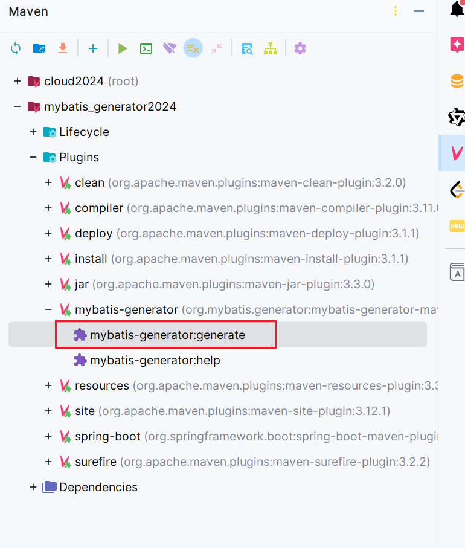


### 1.3 新建支付模块

**新建一个支付模块**

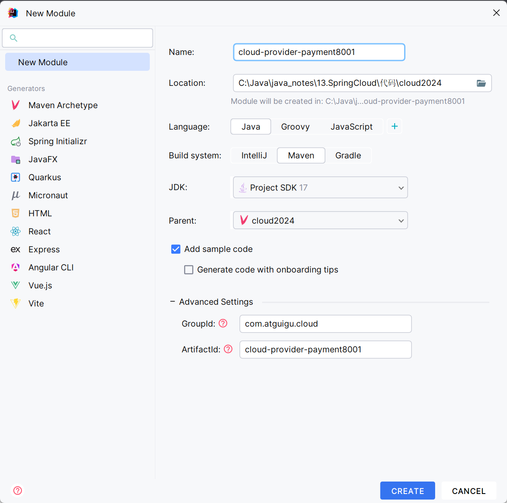


**POM**

```xml
    <dependencies>
        <!--SpringBoot通用依赖模块-->
        <dependency>
            <groupId>org.springframework.boot</groupId>
            <artifactId>spring-boot-starter-web</artifactId>
        </dependency>
        <dependency>
            <groupId>org.springframework.boot</groupId>
            <artifactId>spring-boot-starter-actuator</artifactId>
        </dependency>
        <!--SpringBoot集成druid连接池-->
        <dependency>
            <groupId>com.alibaba</groupId>
            <artifactId>druid-spring-boot-starter</artifactId>
        </dependency>
        <!-- Swagger3 调用方式 http://你的主机IP地址:5555/swagger-ui/index.html -->
        <dependency>
            <groupId>org.springdoc</groupId>
            <artifactId>springdoc-openapi-starter-webmvc-ui</artifactId>
        </dependency>
        <!--mybatis和springboot整合-->
        <dependency>
            <groupId>org.mybatis.spring.boot</groupId>
            <artifactId>mybatis-spring-boot-starter</artifactId>
        </dependency>
        <!--Mysql数据库驱动8 -->
        <dependency>
            <groupId>mysql</groupId>
            <artifactId>mysql-connector-java</artifactId>
        </dependency>
        <!--persistence-->
        <dependency>
            <groupId>javax.persistence</groupId>
            <artifactId>persistence-api</artifactId>
        </dependency>
        <!--通用Mapper4-->
        <dependency>
            <groupId>tk.mybatis</groupId>
            <artifactId>mapper</artifactId>
        </dependency>
        <!--hutool-->
        <dependency>
            <groupId>cn.hutool</groupId>
            <artifactId>hutool-all</artifactId>
        </dependency>
        <!-- fastjson2 -->
        <dependency>
            <groupId>com.alibaba.fastjson2</groupId>
            <artifactId>fastjson2</artifactId>
        </dependency>
        <!--lombok-->
        <dependency>
            <groupId>org.projectlombok</groupId>
            <artifactId>lombok</artifactId>
            <version>1.18.28</version>
            <scope>provided</scope>
        </dependency>
        <!--test-->
        <dependency>
            <groupId>org.springframework.boot</groupId>
            <artifactId>spring-boot-starter-test</artifactId>
            <scope>test</scope>
        </dependency>
    </dependencies>

    <build>
        <plugins>
            <plugin>
                <groupId>org.springframework.boot</groupId>
                <artifactId>spring-boot-maven-plugin</artifactId>
            </plugin>
        </plugins>
    </build>
```


**yaml配置文件**

```yaml
server:
    port: 8001

# ==========applicationName + druid-mysql8 driver===================
spring:
    application:
        name: cloud-payment-service
    
    datasource:
        type: com.alibaba.druid.pool.DruidDataSource
        driver-class-name: com.mysql.cj.jdbc.Driver
        url: jdbc:mysql://localhost:3306/cloud2024?characterEncoding=utf8&useSSL=false&serverTimezone=GMT%2B8&rewriteBatchedStatements=true&allowPublicKeyRetrieval=true
        username: root
        password: root

# ========================mybatis===================
mybatis:
    mapper-locations: classpath:mapper/*.xml
    type-aliases-package: com.atguigu.cloud.entities
    configuration:
        map-underscore-to-camel-case: true
```


**PayService**

```java
public interface PayService {
    public int add(Pay pay);
    public int delete(Integer id);
    public int update(Pay pay);

    public Pay   getById(Integer id);
    public List<Pay> getAll();
}
```

**PayServiceImpl**

```java
public class PayServiceImpl implements PayService {
    @Resource
    PayMapper payMapper;
    @Override
    public int add(Pay pay){
        return payMapper.insertSelective(pay);
    }
    @Override
    public int delete(Integer id){
        return payMapper.deleteByPrimaryKey(id);
    }
    @Override
    public int update(Pay pay){
        return payMapper.updateByPrimaryKeySelective(pay);
    }
    @Override
    public Pay getById(Integer id){
        return payMapper.selectByPrimaryKey(id);
    }
    @Override
    public List<Pay> getAll(){
        return payMapper.selectAll();
    }
}

```

**PayController**

```java
@RestController
public class PayController{
    @Resource
    PayService payService;

    @PostMapping(value = "/pay/add")
    public String addPay(@RequestBody Pay pay){
        System.out.println(pay.toString());
        int i = payService.add(pay);
        return "成功插入记录，返回值："+i;
    }
    @DeleteMapping(value = "/pay/del/{id}")
    public Integer deletePay(@PathVariable("id") Integer id) {
        return payService.delete(id);
    }
    @PutMapping(value = "/pay/update")
    public String updatePay(@RequestBody PayDTO payDTO){
        Pay pay = new Pay();
        BeanUtils.copyProperties(payDTO, pay);

        int i = payService.update(pay);
        return "成功修改记录，返回值："+i;
    }
    @GetMapping(value = "/pay/get/{id}")
    public Pay getById(@PathVariable("id") Integer id){
        return payService.getById(id);
    }//全部查询getall作为家庭作业
}

```

**主启动类**

```java
@SpringBootApplication
@MapperScan("com.atguigu.cloud.mapper")
public class Main8001 {
    public static void main(String[] args) {
        SpringApplication.run(Main8001.class,args);
    }
}
```

**PayDTO**

```java
@Data
@AllArgsConstructor
@NoArgsConstructor
public class PayDTO implements Serializable
{
    private Integer id;
    //支付流水号
    private String payNo;
    //订单流水号
    private String orderNo;
    //用户账号ID
    private Integer userId;
    //交易金额
    private BigDecimal amount;
}
```


> 将mybatis_generator2024中生成的 mapper、entity拷贝到此模块！
>
> 最后使用postman、Swagger测试


### 1.4 解决时间格式、同一返回结果

**时间格式修改**

- 修改yaml

```yaml
spring:    
    jackson:
        date-format: yyyy-MM-dd HH:mm:ss
```

- 指定字段上使用注解

```java
    @Column(name = "update_time")
    @JsonFormat(pattern = "yyyy-MM-dd HH:mm:ss", timezone = "GMT+8")
    private Date updateTime;

    @Column(name = "create_time")
    @JsonFormat(pattern = "yyyy-MM-dd HH:mm:ss", timezone = "GMT+8")
    private Date createTime;
```


**统一返回结果**

通用HTTP返回状态码：


**枚举类**

```java
@Getter
public enum ReturnCodeEnum
{
    /**操作失败**/
    RC999("999","操作XXX失败"),
    /**操作成功**/
    RC200("200","success"),
    /**服务降级**/
    RC201("201","服务开启降级保护,请稍后再试!"),
    /**热点参数限流**/
    RC202("202","热点参数限流,请稍后再试!"),
    /**系统规则不满足**/
    RC203("203","系统规则不满足要求,请稍后再试!"),
    /**授权规则不通过**/
    RC204("204","授权规则不通过,请稍后再试!"),
    /**access_denied**/
    RC403("403","无访问权限,请联系管理员授予权限"),
    /**access_denied**/
    RC401("401","匿名用户访问无权限资源时的异常"),
    RC404("404","404页面找不到的异常"),
    /**服务异常**/
    RC500("500","系统异常，请稍后重试"),
    RC375("375","数学运算异常，请稍后重试"),

    INVALID_TOKEN("2001","访问令牌不合法"),
    ACCESS_DENIED("2003","没有权限访问该资源"),
    CLIENT_AUTHENTICATION_FAILED("1001","客户端认证失败"),
    USERNAME_OR_PASSWORD_ERROR("1002","用户名或密码错误"),
    BUSINESS_ERROR("1004","业务逻辑异常"),
    UNSUPPORTED_GRANT_TYPE("1003", "不支持的认证模式");

    /**自定义状态码**/
    private final String code;
    /**自定义描述**/
    private final String message;

    ReturnCodeEnum(String code, String message){
        this.code = code;
        this.message = message;
    }

    //遍历枚举V1
    public static ReturnCodeEnum getReturnCodeEnum(String code)
    {
        for (ReturnCodeEnum element : ReturnCodeEnum.values()) {
            if(element.getCode().equalsIgnoreCase(code))
            {
                return element;
            }
        }
        return null;
    }
    //遍历枚举V2
    public static ReturnCodeEnum getReturnCodeEnumV2(String code)
    {
        return Arrays.stream(ReturnCodeEnum.values()).filter(x -> x.getCode().equalsIgnoreCase(code)).findFirst().orElse(null);
    }


    /*public static void main(String[] args)
    {
        System.out.println(getReturnCodeEnumV2("200"));
        System.out.println(getReturnCodeEnumV2("200").getCode());
        System.out.println(getReturnCodeEnumV2("200").getMessage());
    }*/
}

```

**统一返回结果**

```java
@Data
@Accessors(chain = true)
public class ResultData<T> {

    private String code;/** 结果状态 ,具体状态码参见枚举类ReturnCodeEnum.java*/
    private String message;
    private T data;
    private long timestamp ;


    public ResultData (){
        this.timestamp = System.currentTimeMillis();
    }

    public static <T> ResultData<T> success(T data) {
        ResultData<T> resultData = new ResultData<>();
        resultData.setCode(ReturnCodeEnum.RC200.getCode());
        resultData.setMessage(ReturnCodeEnum.RC200.getMessage());
        resultData.setData(data);
        return resultData;
    }

    public static <T> ResultData<T> fail(String code, String message) {
        ResultData<T> resultData = new ResultData<>();
        resultData.setCode(code);
        resultData.setMessage(message);

        return resultData;
    }

}

```


### 1.5 全局异常处理


```java
@Slf4j
@RestControllerAdvice
public class GlobalExceptionHandler
{
    /**
     * 默认全局异常处理。
     * @param e the e
     * @return ResultData
     */
    @ExceptionHandler(RuntimeException.class)
    @ResponseStatus(HttpStatus.INTERNAL_SERVER_ERROR)
    public ResultData<String> exception(Exception e) {
        System.out.println("----come in GlobalExceptionHandler");
        log.error("全局异常信息exception:{}", e.getMessage(), e);
        return ResultData.fail(ReturnCodeEnum.RC500.getCode(),e.getMessage());
    }
}
```


### 1.6 新建订单模块

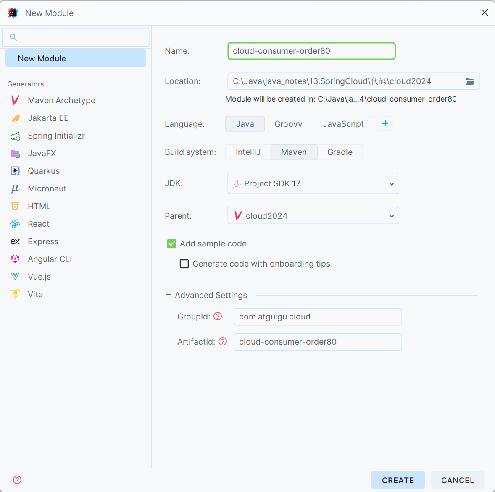

**POM**

```xml
    <dependencies>
        <!--web + actuator-->
        <dependency>
            <groupId>org.springframework.boot</groupId>
            <artifactId>spring-boot-starter-web</artifactId>
        </dependency>
        <dependency>
            <groupId>org.springframework.boot</groupId>
            <artifactId>spring-boot-starter-actuator</artifactId>
        </dependency>
        <!--lombok-->
        <dependency>
            <groupId>org.projectlombok</groupId>
            <artifactId>lombok</artifactId>
            <optional>true</optional>
        </dependency>
        <!--hutool-all-->
        <dependency>
            <groupId>cn.hutool</groupId>
            <artifactId>hutool-all</artifactId>
        </dependency>
        <!--fastjson2-->
        <dependency>
            <groupId>com.alibaba.fastjson2</groupId>
            <artifactId>fastjson2</artifactId>
        </dependency>
        <!-- swagger3 调用方式 http://你的主机IP地址:5555/swagger-ui/index.html -->
        <dependency>
            <groupId>org.springdoc</groupId>
            <artifactId>springdoc-openapi-starter-webmvc-ui</artifactId>
        </dependency>
    </dependencies>

    <build>
        <plugins>
            <plugin>
                <groupId>org.springframework.boot</groupId>
                <artifactId>spring-boot-maven-plugin</artifactId>
            </plugin>
        </plugins>
    </build>
```


**yaml**

```yaml
server:
    port: 80

```


**主启动类**

```java
@SpringBootApplication
public class Main80 {
    public static void main(String[] args) {
        SpringApplication.run(Main80.class,args);
    }
}

```


> 由于订单模块需要调用支付模块，在未使用微服务之前，暂时通过 RESTTemplate 调用：

**配置类**

```java
@SpringBootApplication
public class Main80 {
    public static void main(String[] args) {
        SpringApplication.run(Main80.class,args);
    }
}

```


**Controller**

```java
@RestController
public class OrderController{
    public static final String PaymentSrv_URL = "http://localhost:8001";//先写死，硬编码
    @Autowired
    private RestTemplate restTemplate;

    /**
     * 一般情况下，通过浏览器的地址栏输入url，发送的只能是get请求
     * 我们底层调用的是post方法，模拟消费者发送get请求，客户端消费者
     * 参数可以不添加@RequestBody
     * @param payDTO
     * @return
     */
    @GetMapping("/consumer/pay/add")
    public ResultData addOrder(PayDTO payDTO){
        return restTemplate.postForObject(PaymentSrv_URL + "/pay/add",payDTO,ResultData.class);
    }
    // 删除+修改操作作为家庭作业，O(∩_∩)O。。。。。。。
    @GetMapping("/consumer/pay/get/{id}")
    public ResultData getPayInfo(@PathVariable("id") Integer id){
        return restTemplate.getForObject(PaymentSrv_URL + "/pay/get/"+id, ResultData.class, id);
    }


}
```

### 1.7 目前项目存在的问题

项目中有大量重复的代码，类，通常在开发中，会将`共同的类`都存放在另一个模块下

因此我们重新创建一个  `cloud-api-commons` 模块，用来存放公共的类！

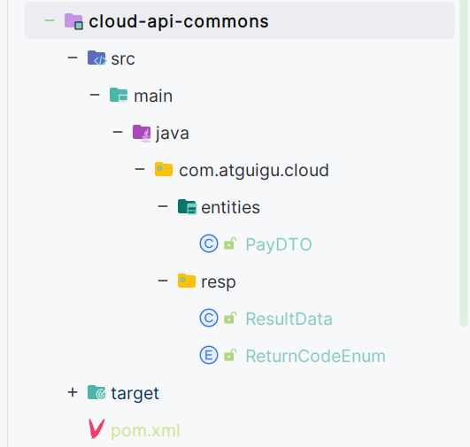


:::details 上面的Controller中，我们使用 RESTTemplate调用 支付接口，这样有什么问题？
 

 1、如果订单微服务和支付微服务的IP地址或者端口号发生了变化，则需要重新修改

 2、如果系统中提供了多个订单微服务和支付微服务，则无法实现微服务的负载均衡功能

 3、如果系统需要支持更高的并发，需要部署更多的订单微服务和支付微服务，硬编码订单微服务则后续的维护会变得异常复杂

 因此，就下来就学习 微服务！！

:::

## 二、Consul

### 2.1 介绍、安装

Consul 是一套开源的分`布式服务发现`和 `配置管理系统`，由 HashiCorp 公司用 Go 语言开发。

提供了微服务系统中的`服务治理、配置中心、控制总线`等功能。这些功能中的每一个都可以根据需要单独使用，也可以一起使用以构建全方位的服务网格，总之Consul提供了一种完整的服务网格解决方案。

**功能**

- 服务发现 ： 提供 HTTP 和 DNS 俩中发现方式


- 健康检测：支持多种方式，HTTP、TCP


- KV 存储：Key、Value 的存储方式


- 多数据中心


- 可视化 Web 界面

:::details 下载

 [https://www.consul.io/downloads.html](https://www.consul.io/downloads.html)

 下载后只有一个 exe 文件，使用 cmd 命令行查看 consul 版本信息：

 ```sh
 consul -version
 ```

 使用开发者模式启动：

 ```sh
 consul agent -dev
 ```

 访问 web 管理界面：

 [http://localhost:8500](http://localhost:8500)

:::

### 2.2 服务注册

**POM增加依赖**

```xml
        <dependency>
            <groupId>org.springframework.cloud</groupId>
            <artifactId>spring-cloud-starter-consul-discovery</artifactId>
        </dependency>
```

**配置**

```yaml
spring:
    application:
        name: cloud-payment-service
    cloud:
        consul:
            host: localhost
            port: 8500
            discovery:
                service-name: ${spring.application.name} # 服务名
```

主启动类增加 `@EnableDiscoveryClient` 注解！


**启动报错**

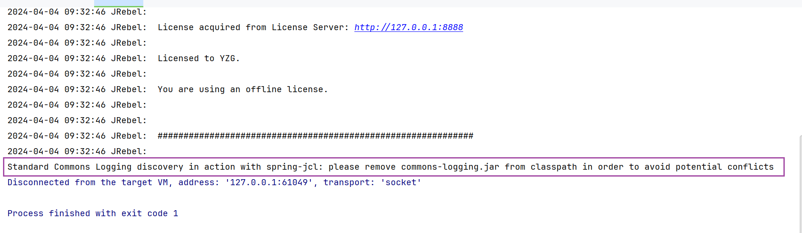

与 `commons-logging` 包冲突，需要在依赖中排除

```xml
        <dependency>
            <groupId>org.springframework.cloud</groupId>
            <artifactId>spring-cloud-starter-consul-discovery</artifactId>
            <exclusions>
                <exclusion>
                    <groupId>commons-logging</groupId>
                    <artifactId>commons-logging</artifactId>
                </exclusion>
            </exclusions>
        </dependency>
```


### 2.3 小问题

此时已经将俩个模块注册到 Consul  中，在 `OrderController `中就可以使用 `服务名` 替代具体的 IP地址了

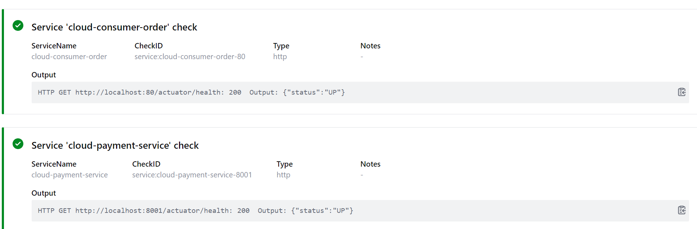

```java
 public static final String PaymentSrv_URL = "http://cloud-payment-service";//服务注册中心上的微服务名称
```

此时访问 `http://localhost:80/consumer/pay/get/1` 报错，

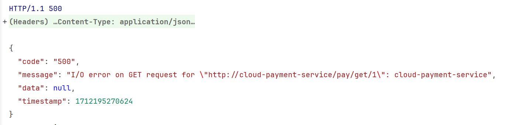

这是因为 Consul 天生支持负载均衡，默认有多个`cloud-payment-service`，需要配置负载均衡，在 `RestTemplate` 方法上增加 `@LoadBalanced` 注解

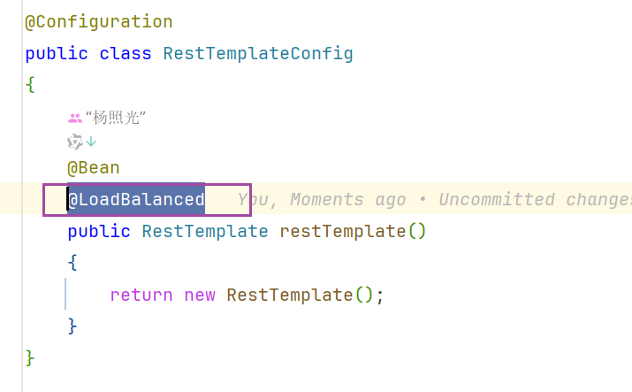


### 2.4 分布式配置

由于每个服务都需要必要的配置信息才能运行，所以一套`集中式的、动态的配置`管理设施是必不可少的。比如某些配置文件中的内容大部分都是相同的，只有个别的配置项不同。就拿数据库配置来说吧，如果每个微服务使用的技术栈都是相同的，则每个微服务中关于数据库的配置几乎都是相同的，有时候主机迁移了，我希望`一次修改，处处生效`。

> 在 Consul 中提供了 `分布式配置` 的功能，下面看看如何使用！

**Consul 配置规则**

默认是  `config/应用名,环境/data` ，默认读取`data	`配置文件

> ```
> config/application,dev/data
> config/application/data
> ```

分隔符可通过: `spring.cloud.consul.config.profile-separator ` 设置

读取的配置文件可以通过:  `spring.cloud.consul.config.data-key `  配置


1、引入依赖

```xml
        <!--SpringCloud consul config-->
        <dependency>
            <groupId>org.springframework.cloud</groupId>
            <artifactId>spring-cloud-starter-consul-config</artifactId>
        </dependency>
        <dependency>
            <groupId>org.springframework.cloud</groupId>
            <artifactId>spring-cloud-starter-bootstrap</artifactId>
        </dependency>
```


2、新增 `bootstrap.yaml `配置文件

```yaml
spring:
  application:
    name: cloud-payment-service
    ####Spring Cloud Consul for Service Discovery
  cloud:
    consul:
      host: localhost
      port: 8500
      discovery:
        service-name: ${spring.application.name}
      config:
        profile-separator: '-' # default value is ","，we update '-'
        format: YAML
```


3、`application.yaml`

```yaml
server:
    port: 8001

# ==========applicationName + druid-mysql8 driver===================
spring:
    datasource:
        type: com.alibaba.druid.pool.DruidDataSource
        driver-class-name: com.mysql.cj.jdbc.Driver
        url: jdbc:mysql://localhost:3306/cloud2024?characterEncoding=utf8&useSSL=false&serverTimezone=GMT%2B8&rewriteBatchedStatements=true&allowPublicKeyRetrieval=true
        username: root
        password: root


# ========================mybatis===================
mybatis:
    mapper-locations: classpath:mapper/*.xml
    type-aliases-package: com.atguigu.cloud.entities
    configuration:
        map-underscore-to-camel-case: true
```


> applicaiton.yml是用户级的资源配置项
>
> bootstrap.yml是系统级的，优先级更加高


4、在 Consul 中创建配置文件，一定要符合 规则

一共有三层：

- 第一层为 `config/`
- 第二层为：`应用名-环境/`

- 第三层为 `data配置文件`

注意右上角的格式为 `Yaml`，要和你配置的`format` 一样

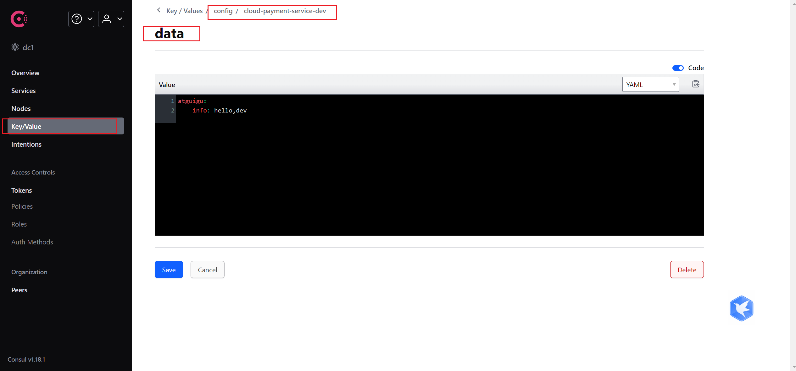


### 2.5 动态刷新

当修改 Consul 上的配置时，客户端无法做到实时更新

- 在主启动类上`@RefreshScope` 注解

- 可以设置 `spring.cloud.consul.config.watch.wait-time` 指明等待多少时间同步更新，默认是` 55s`


### 2.6 配置持久化

当Consul 重启之后，在上面的配置就会`消失` ， 因此需要配置` 持久化` , 保证 配置不会丢失

1、创建一个` myData` 文件夹，将配置保存在此处

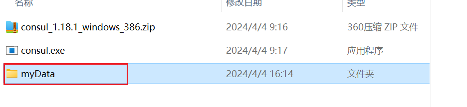

2、在此目录下创建 `consul_start.bat` 启动脚本

将 `-data-dir、binpath ` 改成你自己  的路径

```sh
@echo.服务启动......  
@echo off  
@sc create Consul binpath= "C:\Java\java_notes\13.SpringCloud\software\consul.exe agent -server -ui -bind=127.0.0.1 -client=0.0.0.0 -bootstrap-expect  1  -data-dir C:\Java\java_notes\13.SpringCloud\software\myData"
@net start Consul
@sc config Consul start= AUTO  
@echo.Consul start is OK......success
@pause
```

若你第一次因为 `路径错误` 找不到文件启动失败，以管理员身份启动 `cmd` , 执行 `sc delete Consul`  后, 修改正确的路径，再次管理员身份运行 `bat`


3、以管理员身份运行，启动成功

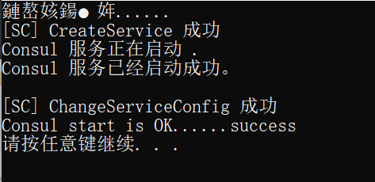

4、此时在 Consul 上增加的配置就会保存到 `myData `目录下

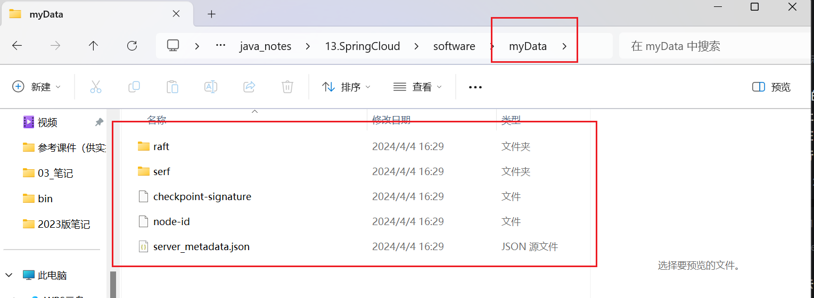

## 三、服务调用

### 3.1 LoadBalance

#### 3.1.1 介绍

由于 SpringCloud 的 Ribbon 已经停更，官网明确说明使用 `LoadBalance`替换 Ribbon

> **LB负载均衡(Load Balance)是什么**

简单的说就是`将用户的请求平摊的分配到多个服务上`，从而达到系统的HA（高可用）。常见的负载均衡有软件Nginx，LVS，硬件 F5等。

> **LoadBalance本地负载均衡客户端 VS Nginx服务端负载均衡区别**

Nginx是服务器负载均衡，客户端所有请求都会交给nginx，然后由nginx实现转发请求。即负载均衡是由服务端实现的。

LoadBalance本地负载均衡，在调用其他微服务接口时候，会在注册中心上获取注册信息服务列表之后缓存到JVM本地，从而在本地实现RPC远程服务调用技术。


#### 3.1.2 如何使用

:::tip 官网地址
 [https://docs.spring.io/spring-cloud-commons/docs/current/reference/html/#spring-cloud-loadbalancer](https://docs.spring.io/spring-cloud-commons/docs/current/reference/html/#spring-cloud-loadbalancer)
:::

从官网得知 LB 为`负载均衡器的抽象和实现`

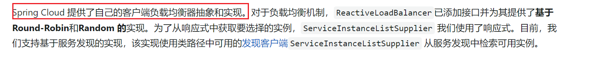

具体的通过 RestTemplate 实现 LB

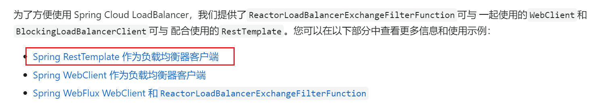

可通过增加     `@LoadBalanced  `、`  @Bean` 俩个注解实现 LB

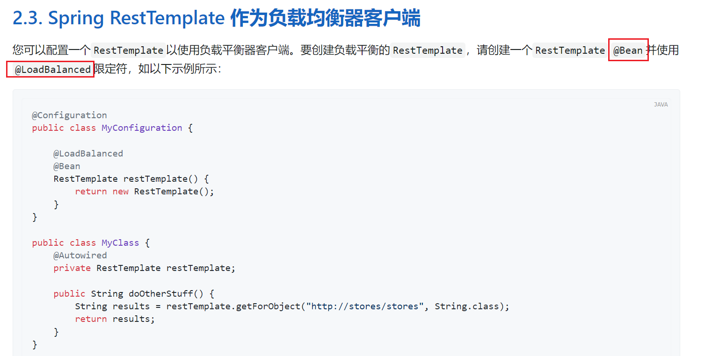


#### 3.1.3 案例演示

拷贝 8001 为 8002 微服务，通过调用 80 服务，来实现 8001/8002 的负载均衡

启动成功后，Consul中 `cloud-payment-service` 服务已经变成俩个，一个8001，一个8002

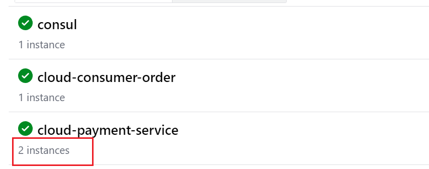


修改80订单服务，通过负载均衡调用 8001/8002

1、新增 loadbalance 依赖

```xml
        <dependency>
            <groupId>org.springframework.cloud</groupId>
            <artifactId>spring-cloud-starter-loadbalancer</artifactId>
        </dependency>
```


2、修改Controller

```java
    @GetMapping(value = "/consumer/pay/get/info")
    private String getInfoByConsul()
    {
        return restTemplate.getForObject(PaymentSrv_URL + "/pay/get/info", String.class);
    }
```


3、访问 `/consumer/pay/get/info`


#### 3.1.4 负载均衡原理

> **rest接口第几次请求数 % 服务器集群总数量 = 实际调用服务器位置下标**
>
> 每次服务重启动后rest接口计数从 1 开始。

**例如**：

```java
List<ServiceInstance> instances = discoveryClient.getInstances("CLOUD-PAYMENT-SERVICE");

如：   List [0] instances = 127.0.0.1:8002
　　   List [1] instances = 127.0.0.1:8001

8001+ 8002 组合成为集群，它们共计2台机器，集群总数为2， 按照轮询算法原理：

当总请求数为1时： 1 % 2 =1 对应下标位置为1 ，则获得服务地址为 127.0.0.1:8001
当总请求数位2时： 2 % 2 =0 对应下标位置为0 ，则获得服务地址为 127.0.0.1:8002
当总请求数位3时： 3 % 2 =1 对应下标位置为1 ，则获得服务地址为 127.0.0.1:8001
当总请求数位4时： 4 % 2 =0 对应下标位置为0 ，则获得服务地址为 127.0.0.1:8002
如此类推......
```


### 3.2 OpenFeign

#### 3.2.1 介绍

:::tip 官网地址
[https://github.com/spring-cloud/spring-cloud-openfeign](https://github.com/spring-cloud/spring-cloud-openfeign)
:::

Feign 是一个声明式的Web服务客户端，让编写Web服务客户端变得非常容易，**只需创建一个接口并在接口上添加 @FeignClient 注解即可**

> **OpenFeign 较与 Loadbalance 的优势**？


前面在使用 LoadBalance 时，我们需要手动 `New RestTemplate` 去调用服务端接口，但实际上一个项目中可能有多处需要调用，每一个都要自己去 `New`， 一是`管理不方便`，二是并`没有实现接口编程`！

而 OpenFeign 的出现正解决了这一难题，通过`定义一个接口 + 一个注解` 完成 对外暴露可以被调用的接口方法清单。大大简化和降低了调用客户端的开发量。

OpenFeign同时还集成`SpringCloud LoadBalancer`、`阿里巴巴Sentinel来提供熔断、降级等功能`。


#### 3.2.2 如何使用

1、增加依赖

```java
        <!--openfeign-->
        <dependency>
            <groupId>org.springframework.cloud</groupId>
            <artifactId>spring-cloud-starter-openfeign</artifactId>
        </dependency>
```


2、在**客户端**的主启动类上增加 `@EnableFeignClients` 注解

> 需要调用接口的 模块 增加 @EnableFeignClients

```java
@SpringBootApplication
@EnableFeignClients
public class Application {

    public static void main(String[] args) {
        SpringApplication.run(Application.class, args);
    }

}
```

3、再客户端中暴露的接口清单中增加   `@FeignClient("stores")` ， 里面的value值为 `服务端名称`，也就是实现这些方法的模块！

```java
@FeignClient("stores")
public interface StoreClient {
    @RequestMapping(method = RequestMethod.GET, value = "/stores")
    List<Store> getStores();

    @RequestMapping(method = RequestMethod.GET, value = "/stores")
    Page<Store> getStores(Pageable pageable);

    @RequestMapping(method = RequestMethod.POST, value = "/stores/{storeId}", consumes = "application/json")
    Store update(@PathVariable("storeId") Long storeId, Store store);

    @RequestMapping(method = RequestMethod.DELETE, value = "/stores/{storeId:\\d+}")
    void delete(@PathVariable Long storeId);
}
```


#### 3.2.3 案例演示

> 将服务端提供的接口清单 放在通用模块 common 中，通过OpenFeign 调用服务端中具体的Controller 方法！

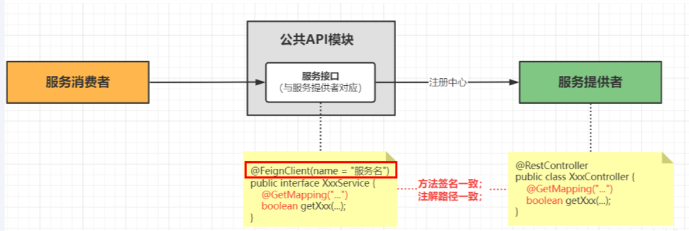


1、在 `commons `公共模块中增加 OpenFeign 依赖

2、提供服务端暴露的接口清单，使用 `@FeignClient `指明服务端名称！

```java
@FeignClient("cloud-payment-service") // 指明服务端的服务名
public interface PayFeignApi{
    /**
     * 新增一条支付相关流水记录
     * @param payDTO
     * @return
     */
    @PostMapping("/pay/add")
    public ResultData addPay(@RequestBody PayDTO payDTO);

    /**
     * 按照主键记录查询支付流水信息
     * @param id
     * @return
     */
    @GetMapping("/pay/get/{id}")
    public ResultData getPayInfo(@PathVariable("id") Integer id);
    // public ResultData getPayInfo(@PathVariable Integer id); // 这样写是错误的，必须指明路径参数名称

    /**
     * openfeign天然支持负载均衡演示
     * @return
     */
    @GetMapping(value = "/pay/get/info")
    public String mylb();
}

```

3、新建模块 `cloud-consumer-feign-order80`

**POM** 和 `cloud-consumer-order80` 一样

**YAML**

```yaml
server:
    port: 80

spring:
    application:
        name: cloud-consumer-openfeign-order
    ####Spring Cloud Consul for Service Discovery
    cloud:
        consul:
            host: localhost
            port: 8500
            discovery:
                prefer-ip-address: true #优先使用服务ip进行注册
                service-name: ${spring.application.name}

```

**主启动类**

再客户端的主启动类上增加 `@EnableFeignClients`

```java
@SpringBootApplication
@EnableDiscoveryClient
@EnableFeignClients
public class MainOpenFeign80 {
    public static void main(String[] args) {
        SpringApplication.run(MainOpenFeign80.class,args);
    }
}
```


**Controller**

使用了 OpenFeign，此时在 Controller 中就无需在使用 RestTemplate，引入所创建的  `PayFeignApi` 接口清单

```java
@RestController
public class OrderController{

    @Autowired
    private PayFeignApi payFeignApi;
    @PostMapping("/feign/pay/add")
    public ResultData addOrder(@RequestBody PayDTO payDTO)
    {
        System.out.println("第一步：模拟本地addOrder新增订单成功(省略sql操作)，第二步：再开启addPay支付微服务远程调用");
        ResultData resultData = payFeignApi.addPay(payDTO);
        return resultData;
    }

    @GetMapping("/feign/pay/get/{id}")
    public ResultData getPayInfo(@PathVariable("id") Integer id)
    {
        System.out.println("-------支付微服务远程调用，按照id查询订单支付流水信息");
        ResultData resultData = payFeignApi.getPayInfo(id);
        return resultData;
    }

    /**
     * openfeign天然支持负载均衡演示
     *
     * @return
     */
    @GetMapping(value = "/feign/pay/mylb")
    public String mylb()
    {
        return payFeignApi.mylb();
    }
}

```


**执行流程**

> 客户端order80服务  通过`PayFeignApi`调用服务端暴露的接口，在PayFeignApi中通过  `@FeignClient` 中的服务端名称去`Consul `中找到对应的服务，最后调用服务端提供的服务接口！


#### 3.2.4 高级特性

##### 1、超时控制

> OpenFeign的默认超时时间为60s

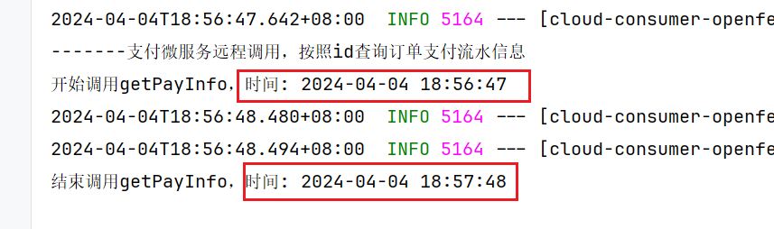

- 全局配置

```yaml
spring:
    cloud:
        openfeign:
            client:
                config:
                  default:
                      connect-timeout: 5000
                      read-timeout: 5000
```


- 局部配置(指定哪个服务的超时时间)

```yaml
spring:
  cloud:
    openfeign:
      client:
        config:
          cloud-payment-service:
            		#连接超时时间
                      connectTimeout: 5000
            		#读取超时时间
                      readTimeout: 5000
```

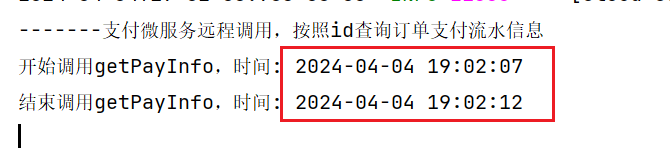

##### 2、重试机制

> 默认关闭

增加配置类开启重试机制：

> 最大请求次数3次：
>
> - 初始请求一次
> - 重试俩次

```java
@Configuration
public class FeignConfig
{
    @Bean
    public Retryer myRetryer()
    {
        // return Retryer.NEVER_RETRY; //Feign默认配置是不走重试策略的

        // 最大请求次数为3(1+2)，初始间隔时间为100ms，重试间最大间隔时间为1s
        return new Retryer.Default(100,1,3);
    }
}
```


**测试**

在上面我将超时时间设置了5s，重试3次，那么执行间隔为 15S

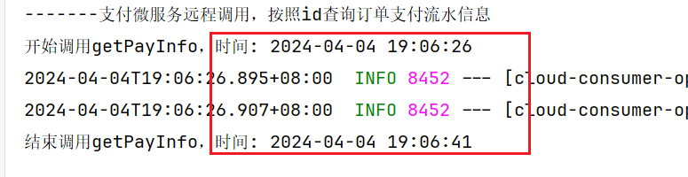

:::tip
目前控制台没有看到3次重试过程，只看到结果，**正常的，正确的**，是feign的日志打印问题
:::


##### 3、默认HttpClient修改

OpenFeign中http client 如果不做特殊配置，OpenFeign默认使用JDK自带的 `HttpURLConnection`发送HTTP请求，由于默认HttpURLConnection`没有连接池、性能和效率比较低`

> 因此使用 Apache HttpClient5 替换默认的HttpURLConnection


1、增加依赖

```xml
        <!-- httpclient5-->
        <dependency>
            <groupId>org.apache.httpcomponents.client5</groupId>
            <artifactId>httpclient5</artifactId>
            <version>5.3</version>
        </dependency>
        <!-- feign-hc5-->
        <dependency>
            <groupId>io.github.openfeign</groupId>
            <artifactId>feign-hc5</artifactId>
            <version>13.1</version>
        </dependency>

```

2、开启

```yaml
#  Apache HttpClient5 配置开启
spring:
  cloud:
    openfeign:
      httpclient:
        hc5:
          enabled: true
```


**测试**

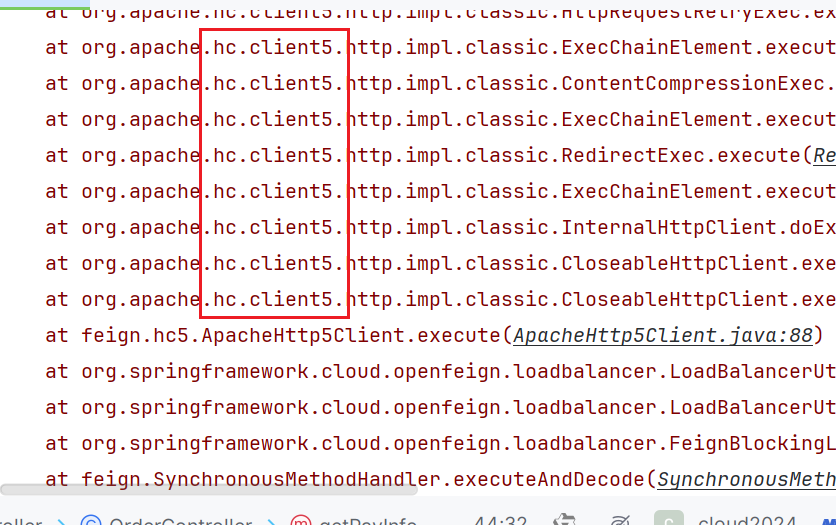

##### 4、请求/响应压缩

**开启请求/响应压缩、设置出发压缩大小**

```yaml
spring:
    cloud:
        openfeign:
            compression:
                request: # 请求压缩
                    enabled: true
                response: # 响应压缩
                    enabled: true
                    min-request-size: 2024  #最小触发压缩的大小
                    mime-types: text/xml,application/xml,application/json  #触发压缩数据类型
```

##### 5、日志打印功能

Feign 提供了日志打印功能，我们可以通过配置来调整日志级别，从而了解 Feign 中 Http 请求的细节，说白了就是对Feign接口的调用情况进行监控和输出

> 日志级别
>
> NONE：默认的，不显示任何日志；
>
> BASIC：仅记录请求方法、URL、响应状态码及执行时间；
>
> HEADERS：除了 BASIC 中定义的信息之外，还有请求和响应的头信息；
>
> FULL：除了 HEADERS 中定义的信息之外，还有请求和响应的正文及元数据。


在FeignConfig中注册

```java
    @Bean
    Logger.Level feignLoggerLevel() {
        return Logger.Level.FULL;
    }
```


在配置文件中指明哪个接口需要打印：

```yaml
# 公式(三段)：logging.level + 含有@FeignClient注解的完整带包名的接口名+debug
logging:
    level:
        com:
            atguigu:
                cloud:
                    feignService:
                        PayFeignApi: debug 
```


**测试**

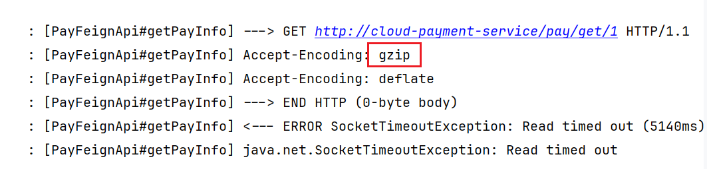


## 四、熔断降级

复杂分布式体系结构中的应用程序有数十个依赖关系，每个依赖关系在某些时候将`不可避免地失败`

多个微服务之间调用的时候，假设微服务A调用微服务B和微服务C，微服务B和微服务C又调用其它的微服务，这就是所谓的  **“扇出”**。**如果扇出的链路上某个微服务的调用响应时间过长或者不可用，对微服务A的调用就会占用越来越多的系统资源，进而引起系统崩溃，所谓的“雪崩效应”.**

**解决方法**

>  有问题的节点，快速熔断（快速返回失败处理或者返回默认兜底数据【服务降级】）。

### 4.1 概念介绍

**降级**

简单来说就是服务器出现问题时，返回给用户一个友好提示，例如 服务器忙，请稍后再试

一般情况下，`程序运行异常、超时、服务熔断触发降级、线程池打满` 都会触发降级！

**熔断**

在互联网系统中，当下游服务因访问压力过大而响应变慢或失败，上游服务为了保护系统整体的可用性，可以暂时切断对下游服务的调用。  **这种牺牲局部，保全整体的措施就叫做熔断。**

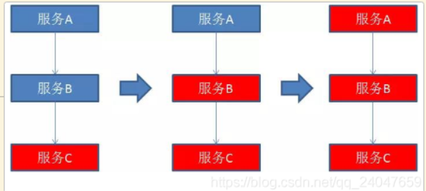

一旦下游服务C因某些原因变得不可用，积压了大量请求，服务B的请求线程也随之阻塞。线程资源逐渐耗尽，使得服务B也变得不可用。紧接着，服务    A也变为不可用，整个调用链路被拖垮。

因此，需要服务熔断来确保整个系统的可用性

**限流**

秒杀高并发等操作，严禁一窝蜂的过来拥挤，大家排队，一秒钟N个，有序进行

### 4.2 Resilience4J

#### 4.2.1 介绍

> Circuit breaker提供了跨不同断路器实现的抽象, 它提供了一致的 API 供您在应用程序中使用.
>
> 而 Resilience4J 正是Circuit breaker的实现！
>
> Resilience4j 是一个用于`帮助构建弹性`和`容错性`应用程序的 Java 库。它提供了一组工具和模式，使开发人员能够更容易地编写可靠、高可用的应用程序。

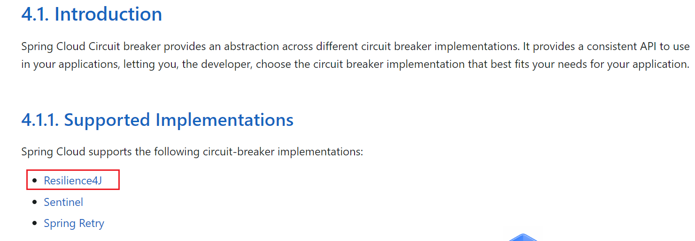

**作用**

- **resilience4j-circuitbreaker: Circuit breaking（断路）**
- **resilience4j-ratelimiter: Rate limiting （限流）**
- **resilience4j-bulkhead: Bulkheading （隔离）**
- resilience4j-retry: Automatic retrying (sync and async) （自动重试）
- resilience4j-timelimiter: Timeout handling （超时处理）
- resilience4j-cache: Result caching （结果缓存）


#### 4.2.2 熔断机制

:::tip 中文文档
[https://github.com/lmhmhl/Resilience4j-Guides-Chinese/blob/main/core-modules/CircuitBreaker.md](https://github.com/lmhmhl/Resilience4j-Guides-Chinese/blob/main/core-modules/CircuitBreaker.md)
:::

**避免局部不稳定因素导致整体的雪崩。熔断降级作为保护自身的手段，通常在客户端（调用端）进行配置**。

`断路器(Circuit Breaker)`是熔断机制的一种实现方式。它是熔断机制的`具体实现`，类似于电路中的断路器，用于监控对依赖服务的调用。当依赖服务的故障率超过阈值时，断路器会切换到`开启状态`，阻止对该服务的请求，从而防止故障的传播。在开启状态下，断路器会暂时拒绝所有请求，并在一段时间后尝试重新请求依赖服务。如果这次请求成功，断路器会恢复到`关闭状态`，继续允许请求通过；

**断路器的状态**

- `关闭(CLOSE)`
    - 断路器关闭时，所有请求均可通过，属于正常状态
- `开启(OPEN)`
    - 当请求的失败率达到一定的`阈值`后，断路器就会由 关闭转换为开启状态，并拒绝所有请求。
- `半开(HALF_OPEN)`
    - 断路开启经过一段时间后，会转换到 `半开` 状态 ， 并允许通过一定数量的请求，尝试`重新计算失败率` , 如果失败率超过阈值，仍然为开启状态，否则变为关闭状态！
- 禁用（DISABLE）
    - 始终允许访问
- 强制开启（FORCED_OPEN）
    - 始终拒绝访问

**断路器使用滑动窗口来统计调用结果，有俩种计算`阈值`的方式**

- 基于调用数量的滑动窗口： 统计最近N次的调用结果
- 基于时间的滑动窗口： 统计最近N秒的调用结果


##### 1、断路器配置参数

| **failure-rate-threshold**                       | **以百分比配置失败率峰值**                                   |
| ------------------------------------------------ | ------------------------------------------------------------ |
| **sliding-window-type**                          | **断路器的滑动窗口期类型 可以基于“次数”（COUNT_BASED）或者“时间”（TIME_BASED）进行熔断，默认是COUNT_BASED。** |
| **sliding-window-size**                          | **若COUNT_BASED，则10次调用中有50%失败（即5次）打开熔断断路器；若为TIME_BASED则，此时还有额外的两个设置属性，含义为：在N秒内（sliding-window-size）100%（slow-call-rate-threshold）的请求超过N秒（slow-call-duration-threshold）打开断路器** |
| **slowCallRateThreshold**                        | **以百分比的方式配置，断路器把调用时间大于slowCallDurationThreshold的调用视为慢调用，当慢调用比例大于等于峰值时，断路器开启，并进入服务降级。** |
| **slowCallDurationThreshold**                    | **配置调用时间的峰值，高于该峰值的视为慢调用。**             |
| **permitted-number-of-calls-in-half-open-state** | **运行断路器在HALF_OPEN状态下时进行N次调用，如果故障或慢速调用仍然高于阈值，断路器再次进入打开状态。** |
| **minimum-number-of-calls**                      | **在每个滑动窗口期样本数，配置断路器计算错误率或者慢调用率的最小调用数。比如设置为5意味着，在计算故障率之前，必须至少调用5次。如果只记录了4次，即使4次都失败了，断路器也不会进入到打开状态。** |
| **wait-duration-in-open-state**                  | **从OPEN到HALF_OPEN状态需要等待的时间**                      |


##### 2、基于调用数量统计的案例演示

> **断路器应该配置在哪个模块？**
>
> 配置在客户端，也就是调用方！我们可以这样想，断路器相当于家庭的保险丝，客户端就相当于家里的电器(调用方)， 服务端就相当于 国家电网 (被调用方)。

`cloud-provider-payment8001` 模块模块新建一个 `PayCircuitController` ，并且通过OpenFeign 暴露出去

```java
@RestController
public class PayCircuitController
{
    //=========Resilience4j CircuitBreaker 的例子
    @GetMapping(value = "/pay/circuit/{id}")
    public String myCircuit(@PathVariable("id") Integer id)
    {
        if(id == -4) throw new RuntimeException("----circuit id 不能负数");
        if(id == 9999){
            try { TimeUnit.SECONDS.sleep(5); } catch (InterruptedException e) { e.printStackTrace(); }
        }
        return "Hello, circuit! inputId:  "+id+" \t " + IdUtil.simpleUUID();
    }
}
```

`cloud-api-commons` 模块

```java
    /**
     * Resilience4j CircuitBreaker 的例子
     * @param id
     * @return
     */
    @GetMapping(value = "/pay/circuit/{id}")
    public String myCircuit(@PathVariable("id") Integer id);
```


在客户端也就是 `cloud-consumer-feign-order80` 模块配置熔断机制。

**增加依赖**：

```xml
        <!--resilience4j-circuitbreaker-->
        <dependency>
            <groupId>org.springframework.cloud</groupId>
            <artifactId>spring-cloud-starter-circuitbreaker-resilience4j</artifactId>
        </dependency>
        <!-- 由于断路保护等需要AOP实现，所以必须导入AOP包 -->
        <dependency>
            <groupId>org.springframework.boot</groupId>
            <artifactId>spring-boot-starter-aop</artifactId>
        </dependency>
```

**yaml配置**

```yaml
spring:
    cloud:
        openfeign:
            circuitbreaker:
       			 enabled: true
       			 group:
          			enabled: true #没开分组永远不用分组的配置。精确优先、分组次之(开了分组)、默认最后
          			
# Resilience4j CircuitBreaker 按照次数：COUNT_BASED 的例子
#  6次访问中当执行方法的失败率达到50%时CircuitBreaker将进入开启OPEN状态(保险丝跳闸断电)拒绝所有请求。
#  等待5秒后，CircuitBreaker 将自动从开启OPEN状态过渡到半开HALF_OPEN状态，允许一些请求通过以测试服务是否恢复正常。
#  如还是异常CircuitBreaker 将重新进入开启OPEN状态；如正常将进入关闭CLOSE闭合状态恢复正常处理请求。
resilience4j:
    circuitbreaker:
        configs:
            default:
#设置50%的调用失败时打开断路器，超过失败请求百分⽐CircuitBreaker变为OPEN状态
                failureRateThreshold: 50 。
                # 滑动窗口的类型
                slidingWindowType: COUNT_BASED 
#滑动窗⼝的⼤⼩配置COUNT_BASED表示6个请求，配置TIME_BASED表示6秒
                slidingWindowSize: 6 
#断路器计算失败率或慢调用率之前所需的最小样本(每个滑动窗口周期)。如果minimumNumberOfCalls为10，则必须最少记录10个样本，然后才能计算失败率。如果只记录了9次调用，即使所有9次调用都失败，断路器也不会开启。            
                minimumNumberOfCalls: 6
# 是否启用自动从开启状态过渡到半开状态，默认值为true。如果启用，CircuitBreaker将自动从开启状态过渡到半开状态，并允许一些请求通过以测试服务是否恢复正常
                automaticTransitionFromOpenToHalfOpenEnabled: true 
#从OPEN到HALF_OPEN状态需要等待的时间
                waitDurationInOpenState: 5s 
#半开状态允许的最大请求数，默认值为10。在半开状态下，CircuitBreaker将允许最多permittedNumberOfCallsInHalfOpenState个请求通过，如果其中有任何一个请求失败，CircuitBreaker将重新进入开启状态。
                permittedNumberOfCallsInHalfOpenState: 2 
                recordExceptions:
                - java.lang.Exception  # 计入失败的异常
        instances:
            cloud-payment-service:
                baseConfig: default

```

**创建OrderCircuitController**

```java
@RestController
public class OrderCircuitController
{
    @Resource
    private PayFeignApi payFeignApi;

    @GetMapping(value = "/feign/pay/circuit/{id}")
    // name要和配置中的instances保持一致
    // fallbackMethod兜底方法，当断路器开启时，要给用户一个友好的反馈！
    @CircuitBreaker(name = "cloud-payment-service", fallbackMethod = "myCircuitFallback")
    public String myCircuitBreaker(@PathVariable("id") Integer id)
    {
        return payFeignApi.myCircuit(id);
    }
    //myCircuitFallback就是服务降级后的兜底处理方法
    public String myCircuitFallback(Integer id,Throwable t) {
        // 这里是容错处理逻辑，返回备用结果
        return "myCircuitFallback，系统繁忙，请稍后再试-----/(ㄒoㄒ)/~~";
    }
}

```


**测试**

正常的请求：[localhost/feign/pay/circuit/1](http://localhost/feign/pay/circuit/1)

错误的请求：[localhost/feign/pay/circuit/-4](http://localhost/feign/pay/circuit/-4)

> 在 PayCircuitController中当ID = -4 时 ，会抛出 RuntimeException 异常，在配置中我们配置了 `recordExceptions` ， 因此会计入失败的请求！。
>
> 若异常不相同或者不是父子类的关系，则不会计入！

当我们访问6次，错误的请求占 50% 时，就会开启断路器，执行fallback兜底方法！


##### 3、基于调用时间 统计的案例演示

配置

```yaml
# Resilience4j CircuitBreaker 按照时间：TIME_BASED 的例子
resilience4j:
    timelimiter:
        configs:
            default:
                timeout-duration: 10s #神坑的位置，timelimiter 默认限制远程1s，超于1s就超时异常，配置了降级，就走降级逻辑
    circuitbreaker:
        configs:
            default:
                failureRateThreshold: 50 #设置50%的调用失败时打开断路器，超过失败请求百分⽐CircuitBreaker变为OPEN状态。
                slowCallDurationThreshold: 2s #慢调用时间阈值，高于这个阈值的视为慢调用并增加慢调用比例。
                slowCallRateThreshold: 30 #慢调用百分比峰值，断路器把调用时间⼤于slowCallDurationThreshold，视为慢调用，当慢调用比例高于阈值，断路器打开，并开启服务降级
                slidingWindowType: TIME_BASED # 滑动窗口的类型
                slidingWindowSize: 2 #滑动窗口的大小配置，配置TIME_BASED表示2秒
                minimumNumberOfCalls: 2 #断路器计算失败率或慢调用率之前所需的最小样本(每个滑动窗口周期)。
                permittedNumberOfCallsInHalfOpenState: 2 #半开状态允许的最大请求数，默认值为10。
                waitDurationInOpenState: 5s #从OPEN到HALF_OPEN状态需要等待的时间
                recordExceptions:
                    - java.lang.Exception
        instances:
            cloud-payment-service:
                baseConfig: default

```


#### 4.2.3 隔离

:::tip 文档
[https://github.com/lmhmhl/Resilience4j-Guides-Chinese/blob/main/core-modules/bulkhead.md](https://github.com/lmhmhl/Resilience4j-Guides-Chinese/blob/main/core-modules/bulkhead.md)
:::

**依赖隔离&负载保护**：用来限制对于下游服务的最大并发数量

Resilience4j提供了两种隔离的实现方式，可以限制并发执行的数量:

- `SemaphoreBulkhead`使用了信号量
- `FixedThreadPoolBulkhead`使用了有界队列和固定大小线程池


##### 1、SemaphoreBulkhead

> 这个和[JUC](https://blog.csdn.net/aetawt/article/details/128044736)中的 Semaphore 原理是一样的。
>
> 通过`维持一组许可证` 来实现阻塞和通行

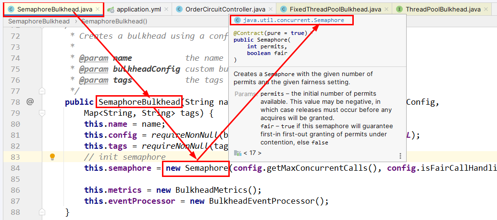


**如何使用**

增加依赖

```xml
<!--resilience4j-bulkhead-->
<dependency>
    <groupId>io.github.resilience4j</groupId>
    <artifactId>resilience4j-bulkhead</artifactId>
</dependency>
```

配置参数

```yaml
####resilience4j bulkhead 的例子
resilience4j:
  bulkhead:
    configs:
      default:
        maxConcurrentCalls: 2 # 隔离允许并发线程执行的最大数量
        maxWaitDuration: 1s # 当达到并发调用数量时，新的线程的阻塞时间，我只愿意等待1秒，过时不候进舱壁兜底fallback
    instances:
      cloud-payment-service:
        baseConfig: default
  timelimiter:
    configs:
      default:
        timeout-duration: 20s
```

在调用方的Controller使用注解 `@Bulkhead` 标注，指明隔离类型为：`Bulkhead.Type.SEMAPHORE`

```java
    /**
     *(船的)舱壁,隔离
     * @param id
     * @return
     */
    @GetMapping(value = "/feign/pay/bulkhead/{id}")
    @Bulkhead(name = "cloud-payment-service",fallbackMethod = "myBulkheadFallback",type = Bulkhead.Type.SEMAPHORE)
    public String myBulkhead(@PathVariable("id") Integer id)
    {
        return payFeignApi.myBulkhead(id);
    }
    public String myBulkheadFallback(Throwable t)
    {
        return "myBulkheadFallback，隔板超出最大数量限制，系统繁忙，请稍后再试-----/(ㄒoㄒ)/~~";
    }
```


##### 2、FixedThreadPoolBulkhead

> 这个和[JUC](https://blog.csdn.net/aetawt/article/details/128044736) 中的 ThreadPool 原理是一样的。

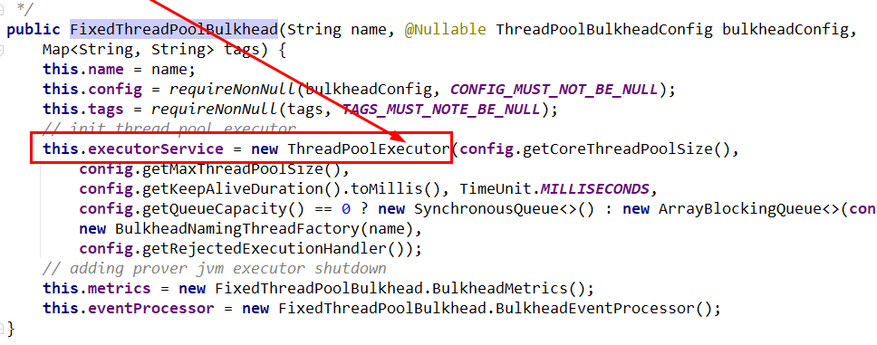

**如何使用**

依赖

```
<!--resilience4j-bulkhead-->
<dependency>
    <groupId>io.github.resilience4j</groupId>
    <artifactId>resilience4j-bulkhead</artifactId>
</dependency>
```

配置

```yaml
####resilience4j bulkhead -THREADPOOL的例子
resilience4j:
    timelimiter:
        configs:
            default:
                timeout-duration: 10s #timelimiter默认限制远程1s，超过报错不好演示效果所以加上10秒
    thread-pool-bulkhead:
        configs:
            default:
                core-thread-pool-size: 4   # 最大线程数
                max-thread-pool-size: 2 # 核心线程数
                queue-capacity: 2 # 等待队列
                # 并发的线程数：最大线程数 + 等待队列 = 6
        instances:
            cloud-payment-service:
                baseConfig: default
```

在调用方的Controller使用注解 `@Bulkhead` 标注，指明隔离类型为：`Bulkhead.Type.THREADPOOL`

并且` FixedThreadPoolBulkhead` 要求的返回类型为 `CompletableFuture`

```java
/**
 * (船的)舱壁,隔离,THREADPOOL
 * @param id
 * @return
 */
@GetMapping(value = "/feign/pay/bulkhead/{id}")
@Bulkhead(name = "cloud-payment-service",fallbackMethod = "myBulkheadPoolFallback",type = Bulkhead.Type.THREADPOOL)
public CompletableFuture<String> myBulkheadTHREADPOOL(@PathVariable("id") Integer id)
{
    System.out.println(Thread.currentThread().getName()+"\t"+"enter the method!!!");
    try { TimeUnit.SECONDS.sleep(3); } catch (InterruptedException e) { e.printStackTrace(); }
    System.out.println(Thread.currentThread().getName()+"\t"+"exist the method!!!");

    return CompletableFuture.supplyAsync(() -> payFeignApi.myBulkhead(id) + "\t" + " Bulkhead.Type.THREADPOOL");
}
public CompletableFuture<String> myBulkheadPoolFallback(Integer id,Throwable t)
{
    return CompletableFuture.supplyAsync(() -> "Bulkhead.Type.THREADPOOL，系统繁忙，请稍后再试-----/(ㄒoㄒ)/~~");
}

 
```


#### 4.2.4 限流

:::tip 文档
[https://github.com/lmhmhl/Resilience4j-Guides-Chinese/blob/main/core-modules/ratelimiter.md](https://github.com/lmhmhl/Resilience4j-Guides-Chinese/blob/main/core-modules/ratelimiter.md)
:::

依赖

```xml
        <!--resilience4j-ratelimiter-->
        <dependency>
            <groupId>io.github.resilience4j</groupId>
            <artifactId>resilience4j-ratelimiter</artifactId>
        </dependency>
```

配置

```yaml
####resilience4j ratelimiter 限流的例子
resilience4j:
    ratelimiter:
        configs:
            default:
                limitForPeriod: 2 #在一次刷新周期内，允许执行的最大请求数
                limitRefreshPeriod: 1s # 限流器每隔limitRefreshPeriod刷新一次，将允许处理的最大请求数量重置为limitForPeriod
                timeout-duration: 1 # 线程等待权限的默认等待时间
        instances:
            cloud-payment-service:
                baseConfig: default
```


使用 `@RateLimiter` 注解标注

```java
    @GetMapping(value = "/feign/pay/ratelimit/{id}")
    @RateLimiter(name = "cloud-payment-service",fallbackMethod = "myRatelimitFallback")
    public String myBulkhead(@PathVariable("id") Integer id) {
        return payFeignApi.myRatelimit(id);
    }

    public String myRatelimitFallback(Integer id,Throwable t)
    {
        return "你被限流了，禁止访问/(ㄒoㄒ)/~~";
    }
```


## 五、分布式链路追踪

在微服务框架中，一个由客户端发起的请求在后端系统中会经过多个不同的的服务节点调用来协同产生最后的请求结果，每一个前段请求都会形成一条复杂的分布式服务调用链路，链路中的任何一环出现高延时或错误都会引起整个请求最后的失败。

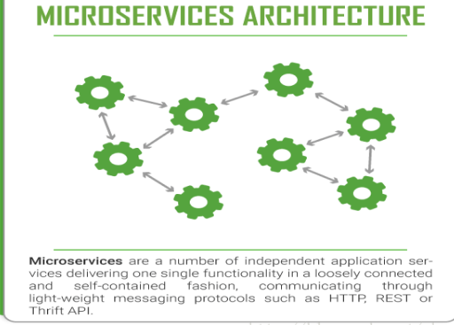

在分布式与微服务场景下，我们需要解决如下问题：

- 在大规模分布式与微服务集群下，如何实时观测系统的整体调用链路情况。

- 在大规模分布式与微服务集群下，如何快速发现并定位到问题。

- 在大规模分布式与微服务集群下，如何尽可能精确的判断故障对系统的影响范围与影响程度。

- 在大规模分布式与微服务集群下，如何尽可能精确的梳理出服务之间的依赖关系，并判断出服务之间的依赖关系是否合理。

- 在大规模分布式与微服务集群下，如何尽可能精确的分析整个系统调用链路的性能与瓶颈点。

- 在大规模分布式与微服务集群下，如何尽可能精确的分析系统的存储瓶颈与容量规划。

### 5.1 Micrometer + Zipkin

> Micrometer  提供了一套完整的服务跟踪的解决方案
>
> 在分布式系统中提供追踪解决方案并且兼容支持了zipkin

一条链路通过Trace Id唯一标识，Span标识发起的请求信息，各span通过parent id 关联起来


#### 5.1.1 下载 ZipKin

**下载 zipkin：**

[https://zipkin.io/pages/quickstart](https://zipkin.io/pages/quickstart)

**执行 jar 包：**

java -jar zipkin-server-2.12.9-exec.jar

**访问：**

[http://localhost:9411/zipkin/](http://localhost:9411/zipkin/)


#### 5.1.2 搭建链路监控

1、父工程引入

```xml
        <micrometer-tracing.version>1.2.0</micrometer-tracing.version>
        <micrometer-observation.version>1.12.0</micrometer-observation.version>
        <feign-micrometer.version>12.5</feign-micrometer.version>
        <zipkin-reporter-brave.version>2.17.0</zipkin-reporter-brave.version>


<!--micrometer-tracing-bom导入链路追踪版本中心  1-->
<dependency>
    <groupId>io.micrometer</groupId>
    <artifactId>micrometer-tracing-bom</artifactId>
    <version>${micrometer-tracing.version}</version>
    <type>pom</type>
    <scope>import</scope>
</dependency>
<!--micrometer-tracing指标追踪  2-->
<dependency>
    <groupId>io.micrometer</groupId>
    <artifactId>micrometer-tracing</artifactId>
    <version>${micrometer-tracing.version}</version>
</dependency>
<!--micrometer-tracing-bridge-brave适配zipkin的桥接包 3-->
<dependency>
    <groupId>io.micrometer</groupId>
    <artifactId>micrometer-tracing-bridge-brave</artifactId>
    <version>${micrometer-tracing.version}</version>
</dependency>
<!--micrometer-observation 4-->
<dependency>
    <groupId>io.micrometer</groupId>
    <artifactId>micrometer-observation</artifactId>
    <version>${micrometer-observation.version}</version>
</dependency>
<!--feign-micrometer 5-->
<dependency>
    <groupId>io.github.openfeign</groupId>
    <artifactId>feign-micrometer</artifactId>
    <version>${feign-micrometer.version}</version>
</dependency>
<!--zipkin-reporter-brave 6-->
<dependency>
    <groupId>io.zipkin.reporter2</groupId>
    <artifactId>zipkin-reporter-brave</artifactId>
    <version>${zipkin-reporter-brave.version}</version>
</dependency>
```


2、子工程引入以下五个即可

```xml
        <!--micrometer-tracing指标追踪  1-->
        <dependency>
            <groupId>io.micrometer</groupId>
            <artifactId>micrometer-tracing</artifactId>
        </dependency>
        <!--micrometer-tracing-bridge-brave适配zipkin的桥接包 2-->
        <dependency>
            <groupId>io.micrometer</groupId>
            <artifactId>micrometer-tracing-bridge-brave</artifactId>
        </dependency>
        <!--micrometer-observation 3-->
        <dependency>
            <groupId>io.micrometer</groupId>
            <artifactId>micrometer-observation</artifactId>
        </dependency>
        <!--feign-micrometer 4-->
        <dependency>
            <groupId>io.github.openfeign</groupId>
            <artifactId>feign-micrometer</artifactId>
        </dependency>
        <!--zipkin-reporter-brave 5-->
        <dependency>
            <groupId>io.zipkin.reporter2</groupId>
            <artifactId>zipkin-reporter-brave</artifactId>
        </dependency>
```


3、配置，哪个服务需要监控就配置哪个服务！

```yaml
# ========================zipkin===================
management:
    zipkin:
        tracing:
            endpoint: http://localhost:9411/api/v2/spans
    tracing:
        sampling:
            probability: 1.0 #采样率默认为0.1(0.1就是10次只能有一次被记录下来)，值越大收集越及时。
```


## 六、Gateway 网关

> **什么是网关？**

网关的角色是作为一个 API 架构，用来保护、增强和控制对于 API 服务的访问

> **GateWay 和 Nginx都作为网关，有什么区别？**


通常可以将Nginx至于 Gateway 网关前，负责对 Gateway 网关的负载均衡，然后再由网关决定进入根据判定到哪个真实的web 服务器。 让两者的分工更加明确，也就是：**Gateway 网关聚合服务，Nginx请求转发**


### 6.1 Gateway 三大核心

- **Route（路由）**: 路由是构建网关的基本模块，它由ID，目标URI，一系列的断言和过滤器组成，如果断言为true则匹配该路由
- **Predicate（谓词）**:  参考的是Java8的 `java.util.function.Predicate`  开发人员可以匹配HTTP请求中的所有内容(例如请求头或请求参数)，如果请求与断言相匹配则进行路由
- **Filter（过滤器）**: 这些是 [`GatewayFilter`](https://github.com/spring-cloud/spring-cloud-gateway/tree/main/spring-cloud-gateway-server/src/main/java/org/springframework/cloud/gateway/filter/GatewayFilter.java) 的实例，已经用特定工厂构建。在这里，你可以在发送下游请求之前或之后修改请求和响应。

**工作流程：**


- 客户端向 `Spring Cloud Gateway` 发出请求。
- 如果 `Gateway Handler Mapping` 找到与请求相匹配的路由，将其发送到 `Gateway Web Handler`。
- Handler 再通过指定的 **过滤器链** 来将请求发送到我们实际的服务执行业务逻辑，然后返回。
- 过滤器之间用虚线分开是因为过滤器可能会在发送代理请求之前（“pre”）或之后（“post”）执行业务逻辑。

> 核心就是： `Gateway Handler Mapping` 、`Gateway Web Handler`、`Fileter Chian`
>
> 有点类似于SpringMVC的执行流程


### 6.2 简单配置

> 网关也是一个单独的服务模块，因此需要单独的创建 `网关模块`

1、创建网关服务模块

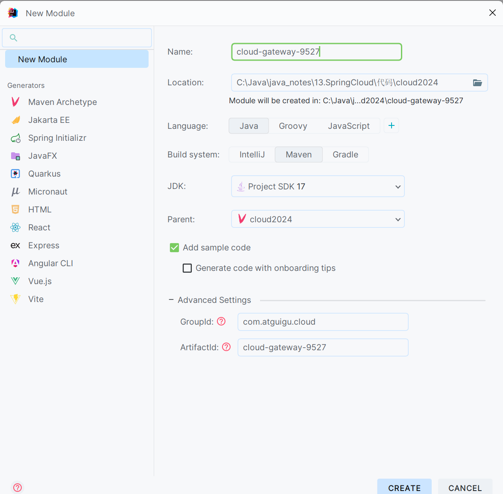


2、POM

```xml
    <dependencies>
        <!--gateway-->
        <dependency>
            <groupId>org.springframework.cloud</groupId>
            <artifactId>spring-cloud-starter-gateway</artifactId>
        </dependency>
        <!--服务注册发现consul discovery,网关也要注册进服务注册中心统一管控-->
        <dependency>
            <groupId>org.springframework.cloud</groupId>
            <artifactId>spring-cloud-starter-consul-discovery</artifactId>
        </dependency>
        <!-- 指标监控健康检查的actuator,网关是响应式编程删除掉spring-boot-starter-web dependency-->
        <dependency>
            <groupId>org.springframework.boot</groupId>
            <artifactId>spring-boot-starter-actuator</artifactId>
        </dependency>
    </dependencies>

    <build>
        <plugins>
            <plugin>
                <groupId>org.springframework.boot</groupId>
                <artifactId>spring-boot-maven-plugin</artifactId>
            </plugin>
        </plugins>
    </build>
```


3、yaml

```yaml
server:
    port: 9527

spring:
    application:
        name: cloud-gateway #以微服务注册进consul或nacos服务列表内
    cloud:
        consul: #配置consul地址
            host: localhost
            port: 8500
            discovery:
                prefer-ip-address: true
                service-name: ${spring.application.name}
                
        gateway:
            routes:
#路由的ID(类似mysql主键ID)，没有固定规则但要求唯一，建议配合服务名
                - id: pay_routh1 #pay_routh1       
				 # 路由地址：lb表示负载均衡LoadBalance
                 uri: lb://cloud-payment-service            
                  # 断言，路径相匹配的进行路由
                  predicates:
                      - Path=/pay/gateway/get/**              
                
                
                - id: pay_routh2 #pay_routh2                
                  uri: lb://cloud-payment-service           
                  predicates:
                      - Path=/pay/gateway/info/**            
```


4、启动类

```java
@EnableDiscoveryClient
@SpringBootApplication
public class Main9527 {
    public static void main(String[] args) {
        SpringApplication.run(Main9527.class,args);
    }
}
```

> 此时访问 9527 端口，网关就能够替我们转发到 `8001` 端口


### 6.3 高级特性

#### 6.3.1 Predicate断言

:::tip 中文文档
[https://springdoc.cn/spring-cloud-gateway/](https://springdoc.cn/spring-cloud-gateway/)
:::

**GateWay自带的RoutePredicateFactory**

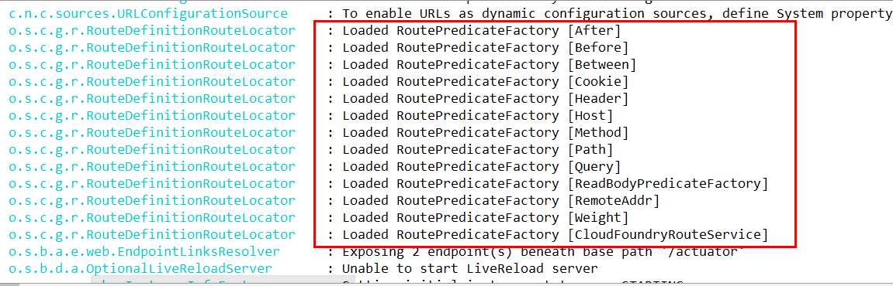

Spring Cloud Gateway将路由匹配作为Spring WebFlux `HandlerMapping` 基础设施的一部分。Spring Cloud Gateway包括许多内置的 `RoutePredicateFactory`。所有这些`Predicate`都与HTTP请求的不同属性相匹配。你可以用逻辑 `and` 语句组合多个RoutePredicateFactory。


有两种方式来配置谓词和过滤器：`快捷方式`和`完全展开`的参数

- **快捷方式**：过滤器名称（filter name）后面跟一个等号 (`=`)，然后是用逗号 (`,`) 分隔的参数值。

```yaml
spring:
  cloud:
    gateway:
      routes:
      - id: after_route
        uri: https://example.org
        predicates:
        - Cookie=mycookie,mycookievalue
```

- **完全展开**：完全展开的参数看起来更像标准的yaml配置，有名称/值对。一般来说，会有一个 `name` key和一个 `args` key。`args` key是一个键值对的映射，用于配置谓词或过滤器。

```yaml
spring:
  cloud:
    gateway:
      routes:
      - id: after_route
        uri: https://example.org
        predicates:
        - name: Cookie
          args:
            name: mycookie
            regexp: mycookievalue
```


##### （1）After、Before、Between

以下三个表示匹配在指定日期之后、之前、之间的请求，均是 `java ZonedDateTime` 格式

- `After`：在指定日期之后

```yaml
spring:
  cloud:
    gateway:
      routes:
      - id: after_route
        uri: https://example.org
        predicates:
         - After=2024-04-06T10:15:38.866925800+08:00[Asia/Shanghai]
```

- `Before`:

```yaml
spring:
    cloud: 
        gateway:
            routes:
                - id: pay_routh1 
                  uri: lb://cloud-payment-service            
                  predicates:
                      - Before=2024-04-06T10:42:38.866925800+08:00[Asia/Shanghai]   # 在指定时间之前
```

- `Between`:

```yaml
spring:
    cloud: 
        gateway:
            routes:
                - id: pay_routh1 
                  uri: lb://cloud-payment-service            
                  predicates:        
                      - Between=2024-04-06T10:22:38.866925800+08:00[Asia/Shanghai],2024-04-06T10:27:38.866925800+08:00[Asia/Shanghai] 
```

若不符合 `predicates` ：

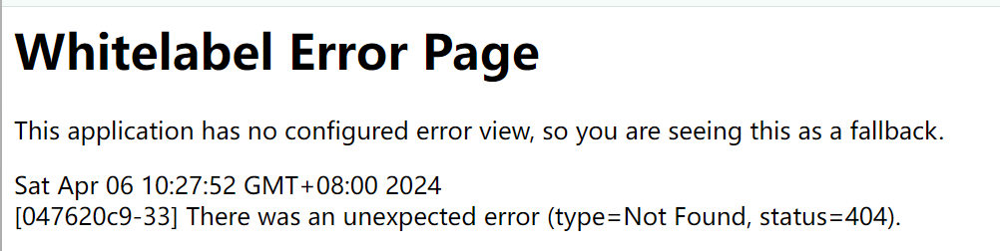


##### （2）Cookie、Header、HOST、PATH


`Cookie`：匹配具有给定名称且其值符合正则表达式的`cookie`

```yaml
spring:
    cloud: 
        gateway:
            routes:
                - id: pay_routh1 
                  uri: lb://cloud-payment-service            
                  predicates:        
                       - Cookie=username,123  # 指定Cookie
```

`Header`：与具有给定名称且其值与正则表达式相匹配的 `header` 匹配

```yaml
spring:
    cloud: 
        gateway:
            routes:
                - id: pay_routh1 
                  uri: lb://cloud-payment-service            
                  predicates:        
                  # Header中带有X-Request-Id为整数才可访问
                       - Header=X-Request-Id, \d+ 
```

`HOST`:  一个主机（Host）名称的 `patterns` 列表。该pattern是Ant风格的模式，以 `.` 为分隔符。这个谓词匹配符合该pattern的Host header

```yaml
spring:
    cloud: 
        gateway:
            routes:
                - id: pay_routh1 
                  uri: lb://cloud-payment-service            
                  predicates:     
                  # 参数中带有：以HOST为name，value符合**.atguigu.com
                      - Host=**.atguigu.com
```

**测试**

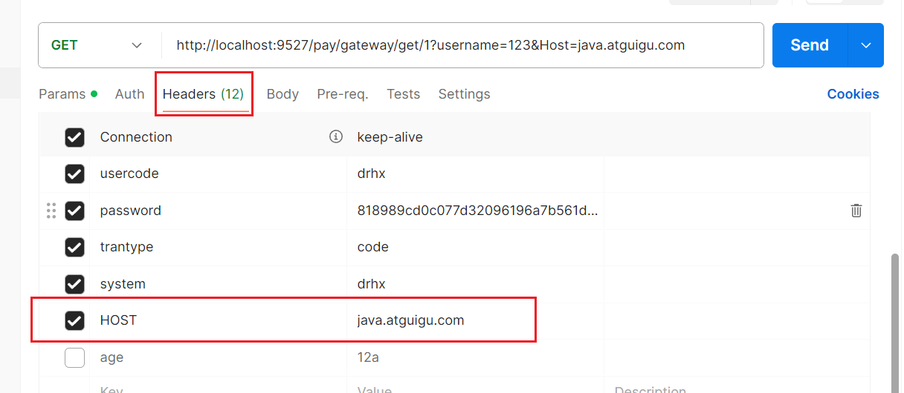


`PATH`:  路径匹配


##### (3) Query

`Query` 路由谓词工厂需要两个参数：一个必需的 `param` 和一个可选的 `regexp`（这是一个Java正则表达式）。下面的例子配置了一个 query 路由谓词。

```yaml
spring:
    cloud: 
        gateway:
            routes:
                - id: pay_routh1 
                  uri: lb://cloud-payment-service            
                  predicates:     
                   # 参数中必须带有username且值是整数
                     - Query=username, \d+ 
```


**测试**：

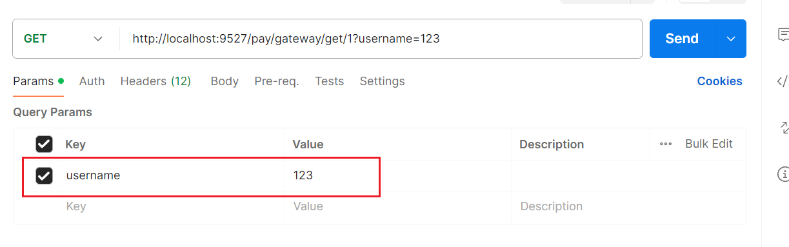

##### （4）RemoteAddr

`RemoteAddr` 路由谓词工厂接受一个 `sources` 集合（最小长度为1），它是CIDR注解（IPv4或IPv6）字符串，如 `192.168.0.1/16`（其中 `192.168.0.1` 是一个IP地址，`16` 是一个子网掩码）

```yaml
spring:
    cloud: 
        gateway:
            routes:
                - id: pay_routh1 
                  uri: lb://cloud-payment-service            
                  predicates:     
                  # 外部访问我的IP限制，最大跨度不超过32，目前是1~24它们是 CIDR 表示法。
                     - RemoteAddr=192.168.124.1/24 
```

> CIDR 使用了更灵活的方式来表示 IP 地址和子网掩码，而不是简单地将它们分成几个固定的类别。CIDR 地址由 IP 地址和一个后缀表示，后缀通常用斜杠（/）后面跟着一个数字表示子网掩码的位数。例如，`192.168.1.0/24` 表示一个拥有 24 位子网掩码的网络。
>
> 例如：
>
> `192.168.1.0/30`
>
> 有30位用于网络地址和子网掩码，剩下的2位用于主机地址。所以可用的主机地址数是2的幂次方，即2^2 = 4
>
> 这四个IP地址包括网络地址、广播地址和两个可用的主机地址。网络地址和广播地址分别是每个子网的第一个和最后一个地址，因此对于CIDR地址 `192.168.1.0/30`：
>
> - 网络地址是 `192.168.1.0`
> - 第一个主机地址是 `192.168.1.1`
> - 第二个主机地址是 `192.168.1.2`
> - 广播地址是 `192.168.1.3`

##### （5）Methods

`Method` 路由谓词工厂接受一个 `methods` 参数，它是一个或多个参数：要匹配的HTTP方法。

```yaml
spring:
    cloud: 
        gateway:
            routes:
                - id: pay_routh1 
                  uri: lb://cloud-payment-service            
                  predicates:     
                     - Method=GET,POST
```


##### （6）自定义Predicate断言

> 需求: 希望用一个 userType 字段来描述用户的会员等级(diamonds, gold, silver)。
>
> 在配置文件中可以配置哪种等级的会员可以访问

先来看看，GateWay中原有Predicate是怎么写的

- 创建一个 `XXXRoutePredicateFactory` 类，注意后缀必须是 `RoutePredicateFactory`, 前面无所谓
- 继承 `AbstractRoutePredicateFactory<Config>` 抽象类或者实现 `RoutePredicateFactory<C>` 接口
- 自定义的 `XXXRoutePredicateFactory` 类中包含4部分：
    - `空参构造器`： 调用父类的构造器
    - `Config配置类` : 说明要校验的参数，，在本案例中也就是 `userType`
    - `apply方法`： 具体的校验过程
    - `shortcutFieldOrder`: 实现快捷方式，若不实现此方法，只能够使用`完全展开`的配置方式

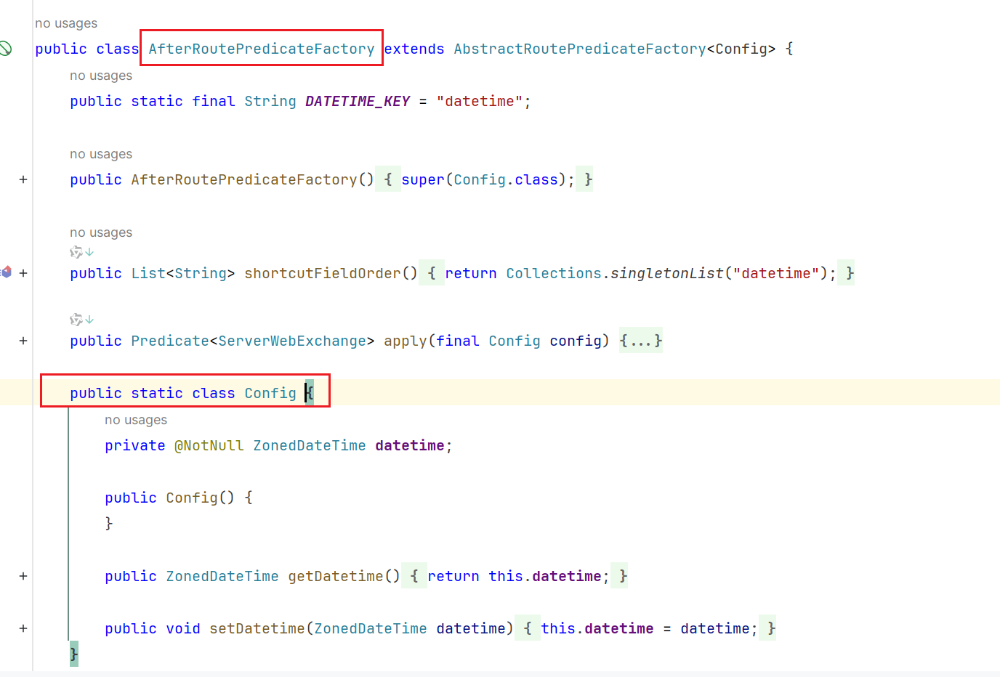


**示例代码**

```java
@Component
public class MyRoutePredicateFactory extends AbstractRoutePredicateFactory<MyRoutePredicateFactory.Config> {
    // 1、空参构造器，调用父类的构造器
    public MyRoutePredicateFactory() {
        super(MyRoutePredicateFactory.Config.class);
    }


    //  2、配置类
    @Validated
    public static class Config {
        @Getter@Setter@NotEmpty
        private String userType;
    }

    // 3、具体的校验规则
    public Predicate<ServerWebExchange> apply(MyRoutePredicateFactory.Config config) {
        return new GatewayPredicate() {
            @Override
            public boolean test(ServerWebExchange serverWebExchange) {
                //  获取请求参数中的第一个参数
                String userType = serverWebExchange.getRequest().getQueryParams().getFirst("userType");
                //  若为null返回false
                if (StringUtil.isNullOrEmpty(userType)) return false;
                // 请求参数中的userTYpe与配置的userType相等，则返回true
                if (userType.equalsIgnoreCase(config.getUserType())) return true;
                return false;
            }
        };
    }


    //  4、快捷方式
    public List<String> shortcutFieldOrder() {
        return Collections.singletonList("userType");
    }


}
```

此时，将网关模块重新启动，在控制台可以看见自定义的断言工厂：

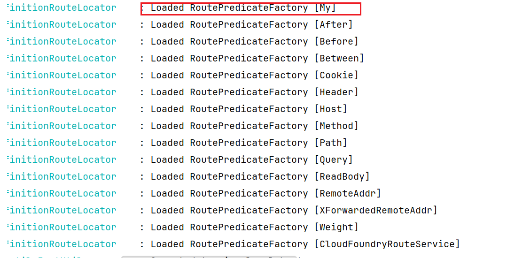

接下来就可以配置使用了：

```yaml
spring:
    cloud: 
        gateway:
            routes:
                - id: pay_routh1 
                  uri: lb://cloud-payment-service            
                  predicates:     
                     - My=diamonds # 自定义的断言，请求参数中的userType=diamonds
```


#### 6.3.2 Filter过滤器

和 SpringMVC 中的拦截器，Servlet中的过滤器一个意思

**能干嘛**：

- 请求鉴权
- 异常处理
- **记录接口调用时长统计**

**类型**

- `GatewayFilter `：全局过滤器
- `GlobalFilter`： 单一内置的过滤器
- `自定义过滤器`

##### （1）请求头相关

`AddRequestHeader` : 需要一个 `name` 和 `value` 参数，增加到请求头中

```yaml
spring:
    cloud: 
        gateway:
            routes:
                - id: pay_routh1 
                  uri: lb://cloud-payment-service            
                  predicates:
                      - Path=/pay/gateway/filter/**             
                  filters:
                  # 请求头kv，若一头含有多参则重写一行设置
                      - AddRequestHeader=X-Request-atguigu1,atguiguValue1  
                      - AddRequestHeader=X-Request-atguigu2,atguiguValue2
```

`RemoveRequestHeader`:需要一个 `name` 参数。它是要被删除的header的名称

```yaml
spring:
    cloud: 
        gateway:
            routes:
                - id: pay_routh1 
                  uri: lb://cloud-payment-service            
                  predicates:
                      - Path=/pay/gateway/filter/**             
                  filters:
                      -  RemoveRequestHeader=sec-fetch-site      # 删除请求头sec-fetch-site

```

`SetRequestHeader`:接受 `name` 和 `value` 参数, 根据name修改成为 value

```yaml
spring:
    cloud: 
        gateway:
            routes:
                - id: pay_routh1 
                  uri: lb://cloud-payment-service            
                  predicates:
                      - Path=/pay/gateway/filter/**             
                  filters:
                      -  SetRequestHeader=sec-fetch-mode, Blue-updatebyzzyy # 将请求头sec-fetch-mode对应的值修改为Blue-updatebyzzyy
```


##### （2）请求参数相关

`AddRequestParameter` : 需要一个 `name` 和 `value` 参数, 增加请求参数

`RemoveRequestParameter` ： 需要一个 `name` 参数。它是要删除的查询参数的名称

```yaml
spring:
    cloud: 
        gateway:
            routes:
                - id: pay_routh1 
                  uri: lb://cloud-payment-service            
                  predicates:
                      - Path=/pay/gateway/filter/**             
                  filters:
                  # 新增请求参数Parameter：k ，v
                    - AddRequestParameter=customerId,9527001 
                    # 删除url请求参数customerName，你传递过来也是null
                    - RemoveRequestParameter=customerName   
```


##### （3）回应头相关

`AddResponseHeader` : 需要一个 `name` 和 `value`增加回应头，

`RemoveResponseHeader`需要一个 `name` 参数。它是要被移除的 header 的名称

`SetResponseHeader` 接受 `name` 和 `value` 参数 ,修改名称为 `name` 的回应头


##### （4）前缀和路径相关

`PrefixPath` : 自动添加路径前缀, 下面这个例子把 `/mypath` 作为所有匹配请求的路径的前缀

```yaml
spring:
  cloud:
    gateway:
      routes:
      - id:  pay_routh1 
        uri: lb://cloud-payment-service    
        filters:
        - PrefixPath=/mypath
```

`SetPath：`修改路径，接受一个路径模板参数。它提供了一种简单的方法，通过允许模板化的路径段来操作请求路径

对于请求路径为 `/red/blue` 的情况，在进行下行请求之前，将路径设置为 `/blue`。

```yaml
spring:
  cloud:
    gateway:
      routes:
      - id: setpath_route
        uri: https://example.org
        predicates:
        - Path=/red/{segment}
        filters:
        - SetPath=/{segment}
```

`RedirectTo `需要两个参数，`status` 和 `url`。`status` 参数应该是一个300系列的重定向 HTTP 状态码，如301。`url` 参数应该是一个有效的URL

```yaml
spring:
  cloud:
    gateway:
      routes:
      - id: prefixpath_route
        uri: https://example.org
        filters:
         - RedirectTo=302, http://www.atguigu.com/ 
         # 访问http://localhost:9527/pay/gateway/filter跳转到http://www.atguigu.com/
```


##### （5）自定义全局过滤器

> **需求**：统计所有接口调用耗时
>
> **解决方法**：自定义过滤器

```java
@Component
@Slf4j
public class MyGlobalFilter implements GlobalFilter, Ordered {

    /**
     * 数字越小优先级越高
     * @return
     */
    @Override
    public int getOrder()
    {
        return 0;
    }

    private static final String BEGIN_VISIT_TIME = "begin_visit_time";//开始访问时间
    /**
     *第2版，各种统计
     * @param exchange
     * @param chain
     * @return
     */
    @Override
    public Mono<Void> filter(ServerWebExchange exchange, GatewayFilterChain chain) {
        //先记录下访问接口的开始时间
        exchange.getAttributes().put(BEGIN_VISIT_TIME, System.currentTimeMillis());

        return chain.filter(exchange).then(Mono.fromRunnable(()->{
            Long beginVisitTime = exchange.getAttribute(BEGIN_VISIT_TIME);
            if (beginVisitTime != null){
                log.info("访问接口主机: " + exchange.getRequest().getURI().getHost());
                log.info("访问接口端口: " + exchange.getRequest().getURI().getPort());
                log.info("访问接口URL: " + exchange.getRequest().getURI().getPath());
                log.info("访问接口URL参数: " + exchange.getRequest().getURI().getRawQuery());
                log.info("访问接口时长: " + (System.currentTimeMillis() - beginVisitTime) + "ms");
                log.info("我是美丽分割线: ###################################################");
                System.out.println();
            }
        }));
    }

}

```


##### （6）自定义单一内置过滤器

> 上面是全局过滤器，只要发送请求就会执行
>
> 下面定义单一内置过滤器

先看看GateWay原厂的过滤器如何实现：

> 看源码其实能看出来，和自定义Predicate非常相似。

- 创建 `XXXGatewayFilterFactory`,  后缀必须是 `GatewayFilterFactory`, 前面无所谓
- 继承 `AbstractGatewayFilterFactory<Config>` 抽象类或者实现 `GatewayFilterFactory<C>` 接口
- 自定义的 `XXXGatewayFilterFactory` 类中包含4部分：
    - `空参构造器`： 调用父类的构造器
    - `Config配置类` : 说明要校验的参数
    - `apply方法`： 具体的校验过程
    - `shortcutFieldOrder`: 实现快捷方式，若不实现此方法，只能够使用`完全展开`的配置方式

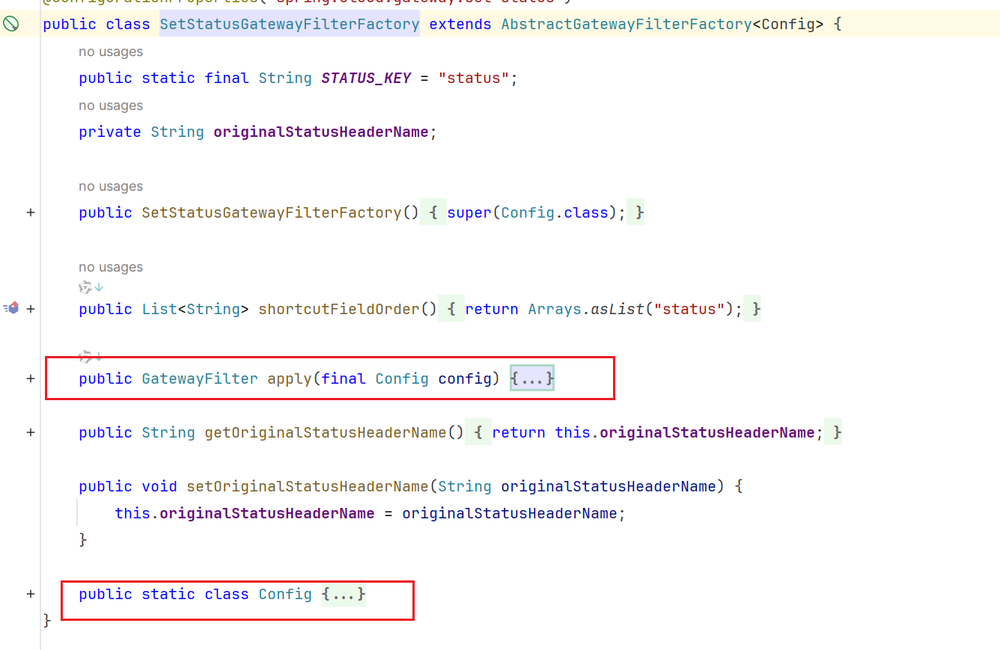


**代码**

> 判断请求参数中是否包含：`atguigu` , 不包含直接返回`400`

```java
@Component
public class MyGatewayFilterFactory extends AbstractGatewayFilterFactory<Config>
{
    public MyGatewayFilterFactory()
    {
        super(MyGatewayFilterFactory.Config.class);
    }


    @Override
    public GatewayFilter apply(MyGatewayFilterFactory.Config config)
    {
        return new GatewayFilter()
        {
            @Override
            public Mono<Void> filter(ServerWebExchange exchange, GatewayFilterChain chain)
            {
                ServerHttpRequest request = exchange.getRequest();
                System.out.println("进入了自定义网关过滤器MyGatewayFilterFactory，status："+config.getStatus());
                if(request.getQueryParams().containsKey("atguigu")){
                    return chain.filter(exchange);
                }else{
                    exchange.getResponse().setStatusCode(HttpStatus.BAD_REQUEST);
                    return exchange.getResponse().setComplete();
                }
            }
        };
    }

    @Override
    public List<String> shortcutFieldOrder() {
        return Arrays.asList("status");
    }

    public static class Config
    {
        @Getter
        @Setter
        private String status;//设定一个状态值/标志位，它等于多少，匹配和才可以访问
    }
}
//单一内置过滤器GatewayFilter


```

**配置**

```
spring:
  cloud:
    gateway:
      routes:
      - id: prefixpath_route
        uri: https://example.org
        filters:
          - My=atguigu
```


# 
