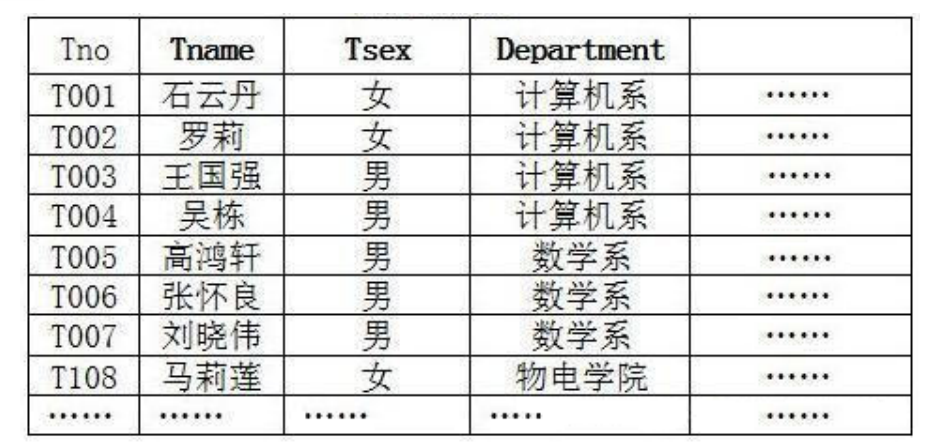
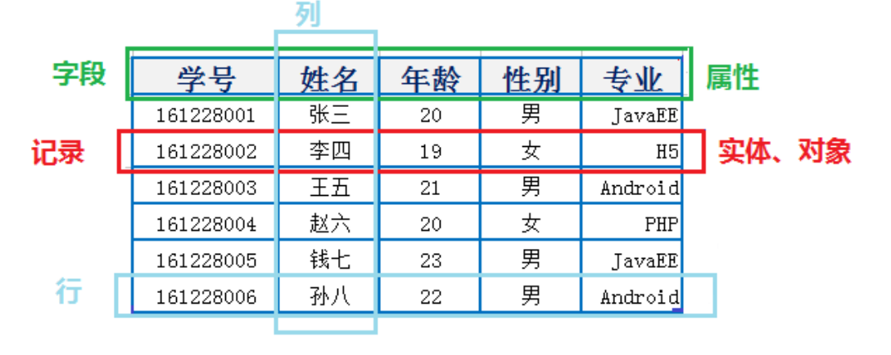
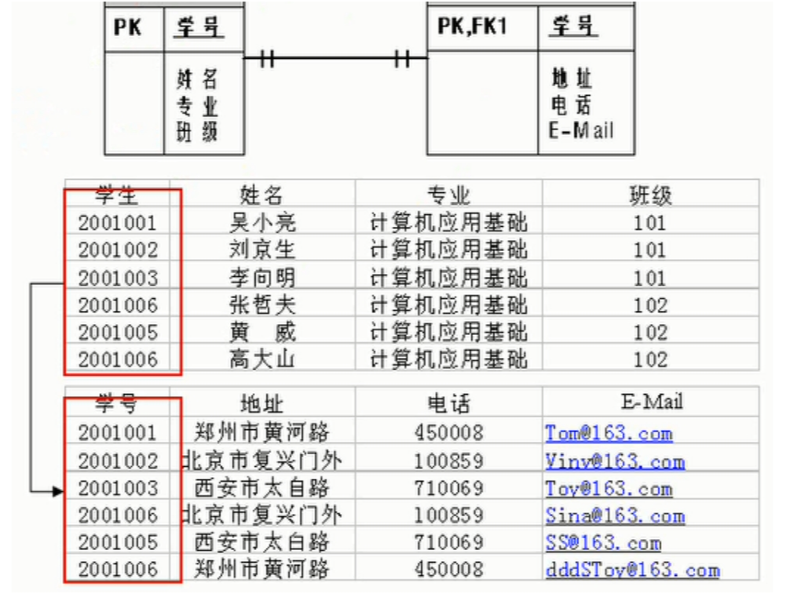
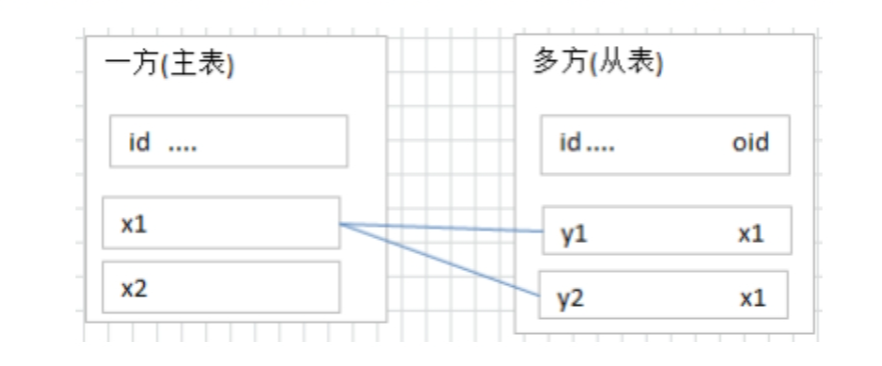
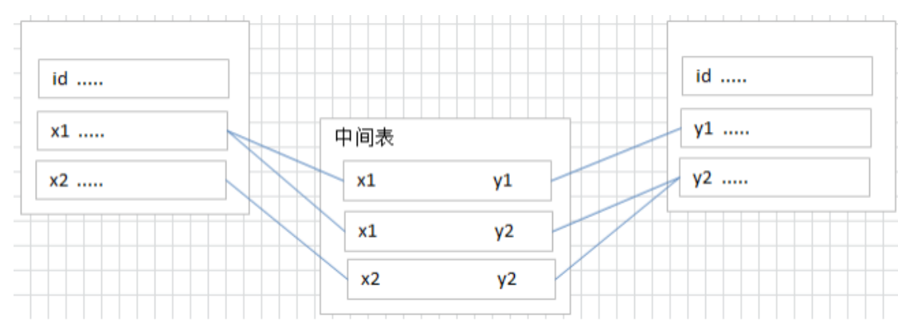
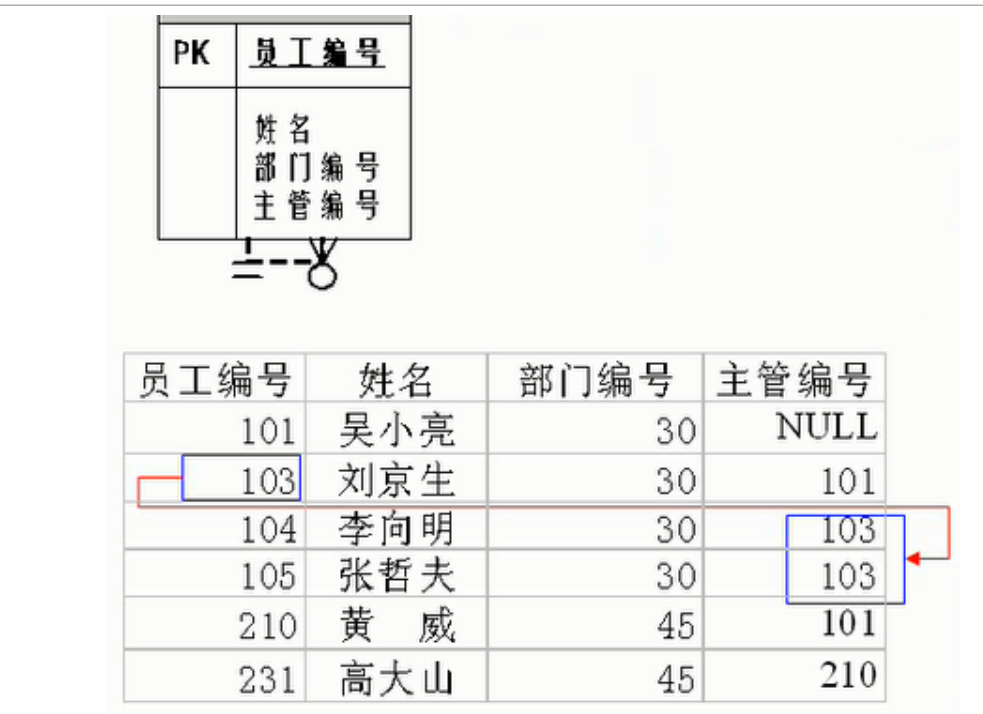

# 一、概述

## 1.1 RDBMS 和 非 RDBMS

关系型数据库绝对是 DBMS 的主流，其中使用最多的 DBMS 分别是 Oracle、 MySQL 和 SQL Server。

这些都是关系型数据库（RDBMS）。

### 1.1.1 关系型数据库(RDBMS)

这种类型的数据库是 `最古老` 的数据库类型，关系型数据库模型是把复杂的数据结构归结为简单的 二元关系 （即二维表格形式）。



关系型数据库以 `行(row)` 和 `列(column)` 的形式存储数据，以便于用户理解。这一系列的行和列被

**SQL就是关系型数据库的查询语句**

**优势**

- 可以使用SQL语句方便在一个表或者多个表进行复杂查询
- 使得对于安全性能很高的数据访问要求得以实现


### 1.1.2 非关系型数据库(非RDBMS)

非关系型数据库，可看成传统关系型数据库的功能 阉割版本 ，基于键值对存储数据，不需要经过SQL层 的解析， **性能非常高** 。同时，通过减少不常用的功能，进一步提高性能。 目前基本上大部分主流的非关系型数据库都是免费的。

**有哪些非关系型数据库？**

**键值型数据库**

键值型数据库通过 Key-Value 键值的方式来存储数据，其中 Key 和 Value 可以是简单的对象，也可以是复杂的对象。Key 作为唯一的标识符，`优点是查找速度快`，在这方面明显优于关系型数据库，`缺点是无法像关系型数据库一样使用条件过滤（比如 WHERE），如果你不知道去哪里找数据，就要遍历所有的键`，这就会消耗大量的计算。

典型的键值型数据库使用场景是作为`缓存`。比如：`Redis`

**文档型数据库**

此类数据库可存放并获取文档，可以是XML、JSON等格式。在数据库中文档作为处理信息的基本单位， 一个文档就相当于一条记录。文档数据库所存放的文档，就相当于键值数据库所存放的“值”。MongoDB 是最流行的文档型数据库。此外，还有CouchDB等。

**搜索引擎数据库**

虽然关系型数据库采用了索引提升检索效率，但是针对全文索引效率却较低。搜索引擎数据库是应用在 搜索引擎领域的数据存储形式，由于搜索引擎会爬取大量的数据，并以特定的格式进行存储，这样在检 索的时候才能保证性能最优。核心原理是“倒排索引”。 典型产品：Solr、Elasticsearch、Splunk 等。


## 1.2 关系型数据库的设计规则

-  一个数据库中可以有多个表，每个表都有一个名字，用来标识自己。
-  表名具有唯一性。 表具有一些特性，这些特性定义了数据在表中如何存储，类似Java和Python中 “类”的设计。

### 1.2.1 表、记录、字段

E-R（entity-relationship，实体-联系）模型中有三个主要概念是：` 实体集 、 属性 、 联系集` 。



```
数据库中的一张表  <----> Java中的类
数据库中的一条记录  <----> Java中的对象
数据库中的一个列  <----> Java中的一个字段、属性
```


### 1.2.2 表的关联关系

**四种**：一对一关联、一对多关联、多对多关联、自我引用

**一对一(one to one)**

- 在实际的开发中应用不多，因为一对一可以创建成一张表。
- 一条记录对应另一个表中的一条记录

**两种建表原则**：

- 外键唯一：主表的主键和从表的外键（唯一），形成主外键关系，外键唯一。
- 外键是主键：主表的主键和从表的主键，形成主外键关系。




**一对多关系(one to many)**

- 一条记录对应另一个表中的多条记录

**一对多建表原则**：在从表(多方)创建一个字段，字段作为外键指向主表(一方)的主键



**多对多关系(many to many)**

要表示多对多关系，必须`创建第三个表`，该表通常称为 `联接表` ，它将多对多关系划分为两个一对多关 系。将这两个表的主键都插入到第三个表中。




**自我引用(self reference)**




