# 二、SQL

SQL（Structured Query Language，结构化查询语言）是使用关系模型的数据库应用语言， 与数据直 接打交道 ，由 IBM 上世纪70年代开发出来。后由美国国家标准局（ANSI）开始着手制定SQL标准， 先后有 `SQL-86 ， SQL-89 ， SQL-92 ， SQL-99 `等标准。

## 2.1 SQL的分类

- **DDL（Data Definition Languages、数据定义语言）**
    - 这些语句定义了不同的数据库、表、视图、索 引等数据库对象，还可以用来`创建、删除、修改数据库和数据表的结构`。
    - 主要的语句关键字包括 `CREATE 、 DROP 、 ALTER、TRUNCATE `等。

- **DML（Data Manipulation Language、数据操作语言）**
    - 用于添加、删除、更新和查询数据库记 录，并检查数据完整性。
    - 主要的语句关键字包括 `INSERT 、 DELETE 、 UPDATE 、 SELECT `等。
    - `DML 是SQL中最基础的，也是最为重要的`

- **DCL（Data Control Language、数据控制语言）**
    - 用于定义数据库、表、字段、用户的访问权限和 安全级别。
    - 主要的语句关键字包括 `GRANT 、 REVOKE 、 COMMIT 、 ROLLBACK 、 SAVEPOINT` 等。


> 因为查询语句使用的非常的频繁，所以很多人把查询语句单拎出来一类：`DQL（数据查询语言）`。 还有单独将 COMMIT 、 ROLLBACK 取出来称为`TCL （Transaction Control Language，事务控制语 言）`。


## 2.2 SQL规范

(**建议遵守**)

**MySQL 在 Windows 环境下是大小写不敏感的**

**MySQL 在 Linux 环境下是大小写敏感的**

- 数据库名、表名、表的别名、变量名是严格区分大小写的
- 关键字、函数名、列名(或字段名)、列的别名(字段的别名) 是忽略大小写的。

推荐采用统一的书写规范：

- 数据库名、表名、表别名、字段名、字段别名等都小写
- SQL 关键字、函数名、绑定变量等都大写


（**必须遵守**）

- SQL 可以写在一行或者多行。为了提高可读性，各子句分行写，必要时使用缩进
- 每条命令以 ; 或 \g 或 \G 结束
- 关键字不能被缩写也不能分行
- 关于标点符号 必须保证所有的()、单引号、双引号是成对结束的 ，必须使用英文状态下的半角输入方式
- 字符串型和日期时间类型的数据可以使用单引号（' '）表示，列的别名，尽量使用双引号（" "），而且不建议省略as

## 2.3 DML中的SELECT

### 2.3.1 基本SELECT

```sql
-- 基本结构: SELECT 字段1,字段2 FROM 表名;
SELECT first_name,last_name FROM employees;

--  * 表示查询出所有字段
SELECT * FROM employees;

-- 也可以省略 FROM
SELECT 1+1, 2*3;
--  DUAL表示伪表
SELECT 1+1, 2*3 FROM DUAL;

```


#### (1) 列的别名

为指定字段设置别名，可以使用`空格`或者` AS` 或者 `" "` , 在MYSQL中使用 '' 不会报错，但是尽量别用 '' ！！！

```sql
SELECT first_name firstName,last_name AS lastName,salary "month salary" FROM employees;
```

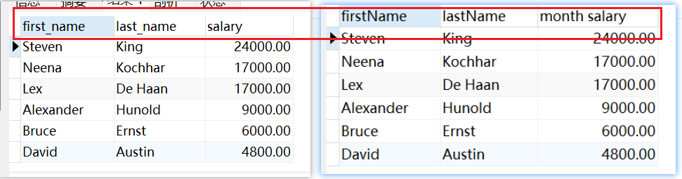


#### (2) 去掉重复行

```sql
# 去掉重复的department_id
SELECT DISTINCT  department_id FROM employees
```

**错误的使用**

```sql
SELECT salary, DISTINCT department_id FROM employees
```

查询出来的 salary 和 department_id 数量不对，因此会报错

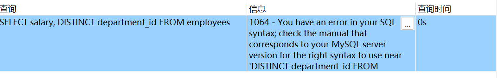

如果我们改成这样：

```sql
SELECT DISTINCT department_id,salary FROM employees
```

他会对 department_id，salary 组合起来进行去重，如下图所示： 会将 department_id + salary  组合在一起看是否一样。**这样虽然不报错，但是没有意义**

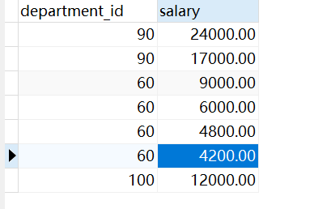


#### (3) 空值参与运算

空值: 就是为null的列，null不等同于0或者'', 如果`空值参与运算，那么结果也一定是 null`

```SQL
# commission_pct可能存在null的情况
SELECT department_id,commission_pct,salary  "月工资" , salary * (1 + commission_pct) * 12 "年工资" FROM employees
```

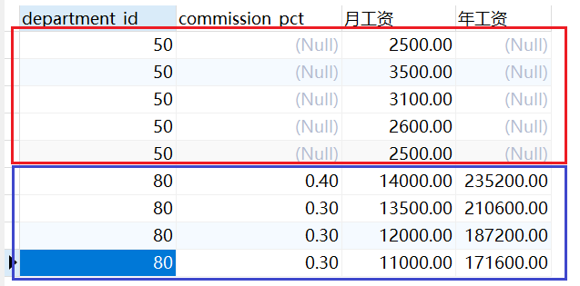


#### (4) 着重号

着重号: \`\` , 如果你的表名、字段名与MYSQL中的关键字重复，使用 `` 括起来。

```sql
SELECT * FROM `order`
```


### 2.3.2 过滤器WHERE

WHERE 用来筛选符合条件的结果，一定是紧跟在FROM后面的。

```sql
# 查询部门编号为90的员工
SELECT * FROM employees
WHERE department_id = '90'
```


### 2.3.3 运算符

#### 算数运算符

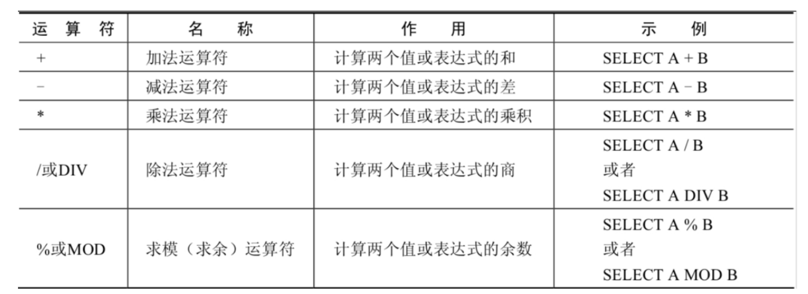


值得注意的是: 使用 + 号进行计算时，如果数值和字符串类型进行计算，会将字符串转换为数值类型(隐形转换)

```sql
SELECT 100 + '2'
结果: 102
```


#### 比较运算符

比较运算符用来对表达式左边的操作数和右边的操作数进行比较，比较的结果为真则返回1，比较的结果为假则返回0，其他情况则返回NULL。

比较运算符经常被用来作为SELECT查询语句的条件来使用，返回符合条件的结果记录。

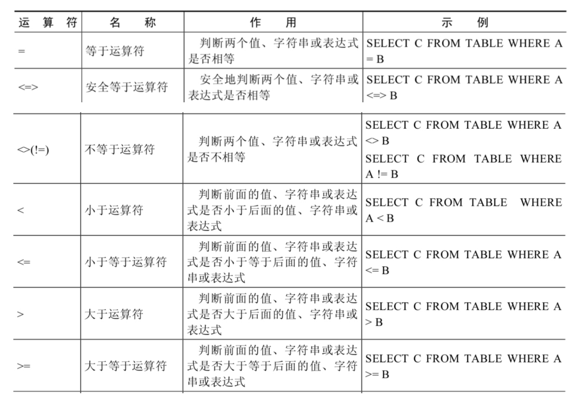

**(1) 等号运算符**

- 如果等号两边的值、字符串或表达式都为字符串，则MySQL会按照字符串进行比较，其比较的 是每个字符串中字符的ANSI编码是否相等
- 如果等号两边的值一个是整数，另一个是字符串，则MySQL会将字符串转化为数字进行比较。
- 如果等号两边的值、字符串或表达式中有一个为NULL，则比较结果为NULL。

```sql
SELECT
	1 = 1,
	1 = '1',
	1 = 'a',
	'ab' = 'ab',
	1 = NULL,
	NULL = NULL
```

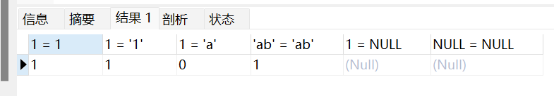


**(2) 安全等于运算符**

与 = 类似，唯一区别的就是，<=> 增加了对 NULL 的判断，若俩边有一个为 NULL，则结果为 0，都为NULL，则结果为 1

```sql
SELECT NULL <=> NULL, 1 <=>NULL
```

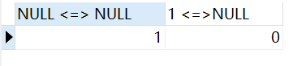

#### 符号运算符

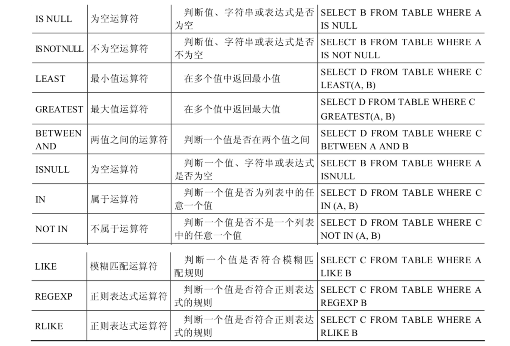

**转义字符的使用**

我想查询名字第二个字符带有 _ 并且含有'a'的员工

此时可以使用 \ 将_ 进行转移，不在表示前面有单个字符

```sql
SELECT department_id,last_name FROM employees
WHERE last_name LIKE '_\_a%'
```

545 206 = 751

#### 逻辑运算符

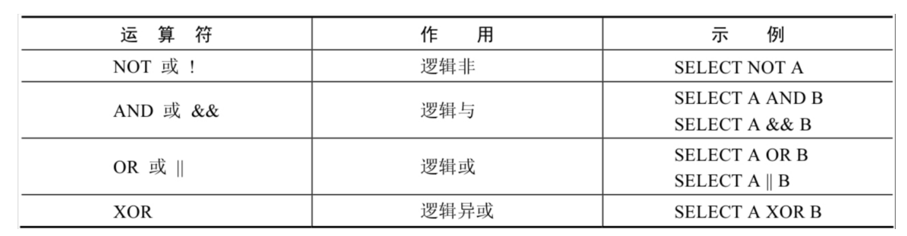


#### 位运算符

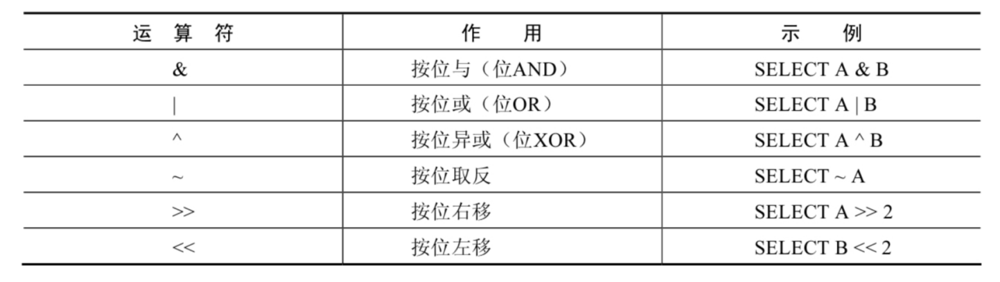


### 2.3.4 多表查询

**笛卡尔积**

笛卡尔乘积是一个数学运算。假设我有两个集合 X 和 Y，那么 X 和 Y 的笛卡尔积就是 X 和 Y 的所有可能 组合，也就是第一个对象来自于 X，第二个对象来自于 Y 的所有可能。组合的个数即为两个集合中元素 个数的乘积数。

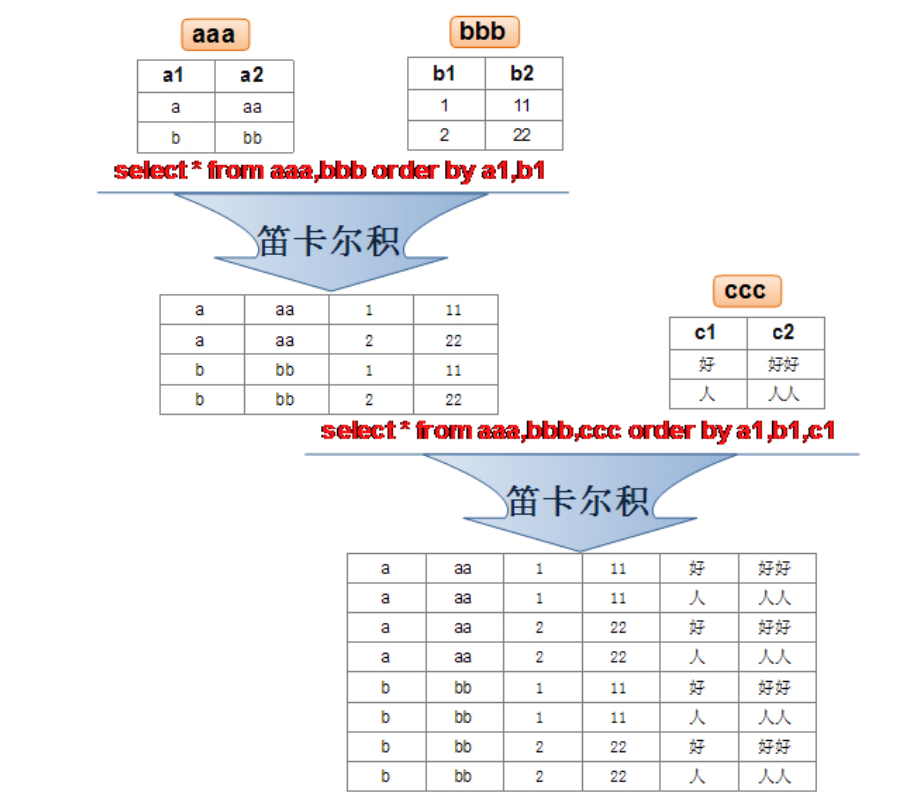

#### (1) 等值连接

假设我想查询每一个员工所在得部门名称，如果想要简单得进行如下查询, 就会产生 `笛卡尔积`

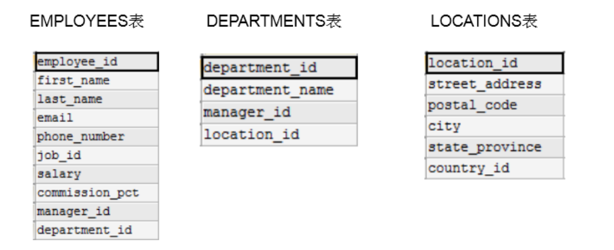

```sql
SELECT last_name,department_name
FROM employees,departments
```

**产生的笛卡尔积得原因**:

- 省略多个表的连接条件（或关联条件）
- 连接条件（或关联条件）无效
- 所有表中的所有行互相连接

因此为了避免产生笛卡尔积，应该增加WHERE条件

```sql
SELECT last_name,department_name
FROM employees,departments
WHERE employees.department_id = departments.department_id
```


**注意**：多表查询时，如果涉及到一个字段在多个表中都存在时，一定要指明查询得表。

如下图所示，我想要查询部门ID，但是部门ID在俩张表中都存在，MYSQL就不知道去哪张表里面查了。

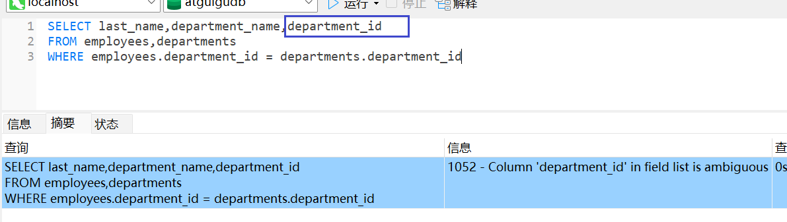

**正确写法，在多表查询时，在优化角度来说，建议每个字段前都指明其所在的表**：

```sql
SELECT employees.last_name,departments.department_name,departments.department_id
FROM employees,departments
WHERE employees.department_id = departments.department_id
```

为了避免混乱，可以对表起别名：

```sql
SELECT emp.last_name,dept.department_name,dept.department_id
FROM employees emp,departments dept
WHERE emp.department_id = dept.department_id
```


**案例2**

查询每一个员工的 姓名、部门名称、部门所在城市名称

```sql
SELECT emp.last_name,dept.department_name,lo.city
FROM employees emp,departments dept,locations lo
WHERE emp.department_id = dept.department_id AND dept.location_id = lo.location_id
```

> 假设有n张表进行查询，则最少需要 n-1 个连接条件！


#### (2) 非等值连接

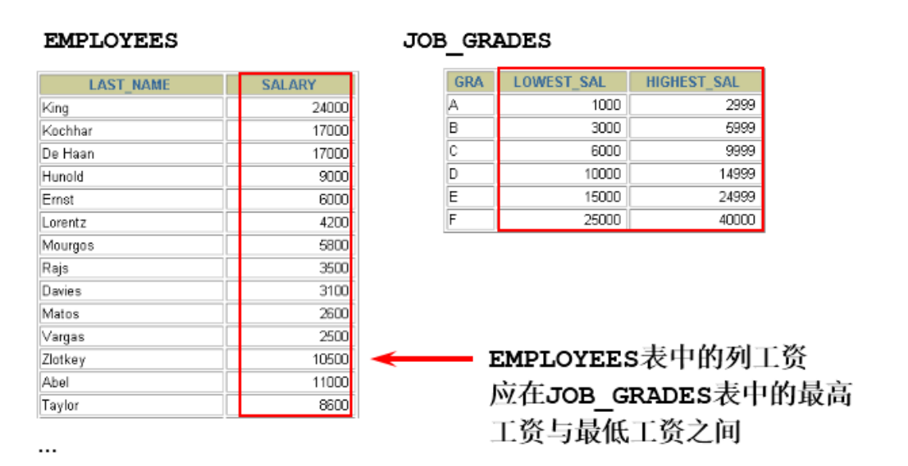

查询出每一个员工的工资等级。其工资范围在 JOB_GRADES 表中

```sql
SELECT emp.last_name,emp.salary,jg.grade_level
FROM employees emp,job_grades jg
WHERE emp.salary BETWEEN jg.lowest_sal AND jg.highest_sal
```


#### (3) 非自连接

只要涉及到多张表进行连接的，都是非自连接！！

#### (4) 自连接

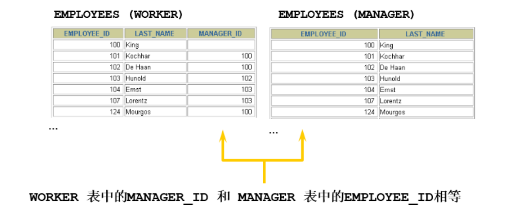

查询出每个员工的管理者名称，其中管理者也在 EMPLOYEES 表中。

```sql
SELECT emp.last_name,emp.manager_id, mgr.last_name,mgr.employee_id
FROM employees emp ,employees mgr
WHERE emp.manager_id = mgr.employee_id
```


#### (5) 内连接 VS 外连接

**内连接**: 合并具有同一列的两个以上的表的行, 结果集中不包含一个表与另一个表不匹配的行

**外连接**: 两个表在连接过程中除了返回满足连接条件的行以外还返回左（或右）表中不满足条件的 行 ，这种连接称为左（或右） 外连接。没有匹配的行时, 结果表中相应的列为空(NULL)。

- 如果是左外连接，则连接条件中左边的表也称为 `主表` ，右边的表称为 `从表` 。

- 如果是右外连接，则连接条件中右边的表也称为 `主表` ，左边的表称为 `从表` 。

##### 内连接

**语法：** INNER JOIN 表名 ON 连接条件

INNER 可省略

```sql
SELECT  last_name,department_name FROM employees emp
JOIN departments dept ON emp.department_id = dept.department_id
```

连接多张表可使用多次JOIN...ON

```sql
SELECT  last_name,department_name,city FROM employees emp
JOIN departments dept ON emp.department_id = dept.department_id
JOIN locations lo ON dept.location_id = lo.location_id
```

##### 外连接

**左外连接：** LEFT OUTER  JOIN `表名` ON 连接条件

**右外连接：** RIGHT OUTER  JOIN `表名` ON 连接条件

OUTER  可省略

```sql
-- employees为为主表
-- departments为从表
-- 左外连接
SELECT  last_name,department_name FROM employees emp
LEFT OUTER JOIN departments dept ON emp.department_id = dept.department_id
-- 右外连接
SELECT  last_name,department_name FROM employees emp
LEFT OUTER JOIN departments dept ON emp.department_id = dept.department_id
```

外连接可以将不符合条件的行也都查询出来，而内连接只能查询符合条件的行。

因此如果在SQL题目中有 `所有` 的关键字，优先考虑外连接！！！

**通过查询结果查看左右连接区别：**

左连接：

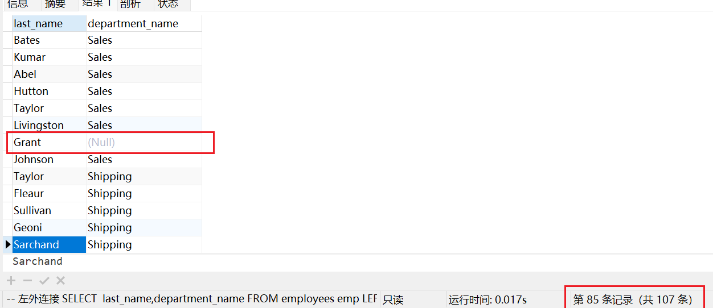

右连接：

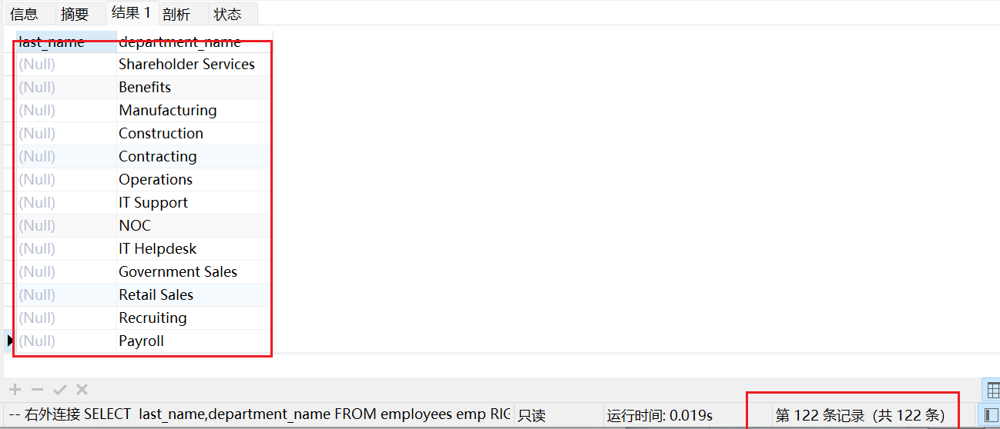

在我们使用左连接时，会将左表不符合条件的行查询出来，也就是 last_name为 Grant 的，没有部门，但是也查询出来了。

使用右连接时，会将右表不符合条件的行查询出来, 也就是department表中有16个部门没有员工！


**需求**

如果现在我想把左表、右表不符合条件的行都查询出来。这就是`满外连接`

在说慢外连接的前提，我们先了解MYSQL 的七种 JOIN 的方式，而在此之前，还需要了解一个关键字 `UNION`

##### UNION（ALL）

**合并查询结果** 利用UNION关键字，可以给出多条SELECT语句，并将它们的结果组合成单个结果集。合并 时，两个表对应的列数和数据类型必须相同，并且相互对应。各个SELECT语句之间使用UNION或UNION ALL关键字分隔。

**语法格式**

```sql
SELECT column,... FROM table1
UNION [ALL]
SELECT column,... FROM table2
```

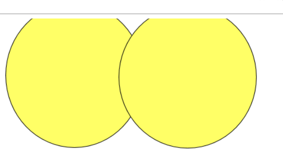

UNION 操作符返回两个查询的结果集的并集，去除重复记录。

**UNION ALL**

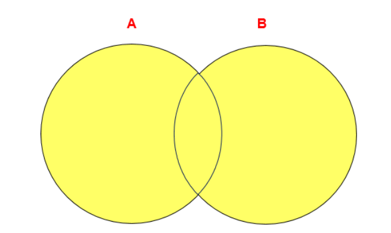

UNION ALL操作符返回两个查询的结果集的并集。对于两个结果集的重复部分，不去重。

> 注意：执行UNION ALL语句时所需要的资源比UNION语句少。如果明确知道合并数据后的结果数据 不存在重复数据，或者不需要去除重复的数据，则尽量使用UNION ALL语句，以提高数据查询的效 率。


##### 七种JOIN的使用

A可以用employees表表示，B可以用departments表表示

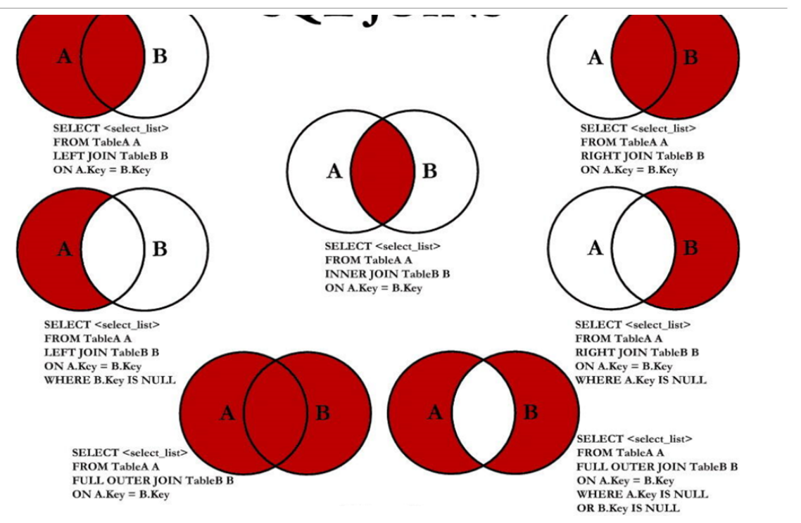

1、**中图**: 内连接，查询员工的姓名以及所在部门名称，没有部门的员工不会查询出来

```sql
SELECT  last_name,department_name FROM employees emp
INNER JOIN departments dept ON emp.department_id = dept.department_id
```


2、**左上图**：左外连接，查询员工的姓名以及所在部门名称，没有部门的员工也会查询出来，也就是说会将`主表`中不符合条件的行也查询出来

```sql
-- 左外连接
SELECT  last_name,department_name FROM employees emp
LEFT OUTER JOIN departments dept ON  dept.department_id =emp.department_id
```


3、**右上图**： 右外连接，查询员工的姓名以及所在部门名称，会将部门下没有员工的部门也会查询出来，也就是说会将`从表`中不符合条件的行也查询出来

```sql
-- 右外连接
SELECT  last_name,department_name FROM employees emp
RIGHT  OUTER JOIN departments dept ON emp.department_id = dept.department_id
```


4、**左中图：** 在左外连接的基础上，将A、B的交集去掉，查询出A表也就是employees表中不符合条件的行

```sql
SELECT  last_name,department_name FROM employees emp
LEFT  JOIN departments dept ON  dept.department_id =emp.department_id
WHERE dept.department_id  IS NULL
```

5、**右中图：** 在右外连接的基础上，将A、B的交集去掉，查询出B表也就是departments表中不符合条件的行

```sql
-- 右外连接
SELECT  last_name,department_name FROM employees emp
RIGHT  JOIN departments dept ON emp.department_id = dept.department_id
WHERE emp.department_id IS NULL
```


6、**左下图**：慢外连接，左上图的查询结果 + 右中图的查询结果

```sql
-- 满外连接
SELECT  last_name,department_name FROM employees emp
LEFT OUTER JOIN departments dept ON  dept.department_id =emp.department_id
UNION ALL
SELECT  last_name,department_name FROM employees emp
RIGHT JOIN departments dept ON  dept.department_id =emp.department_id
WHERE emp.department_id IS NULL
```


7、**右下图**： 左中图+右中图的查询结果

```sql
SELECT  last_name,department_name FROM employees emp
LEFT  JOIN departments dept ON  dept.department_id =emp.department_id
WHERE dept.department_id  IS NULL
UNION ALL
SELECT  last_name,department_name FROM employees emp
RIGHT  JOIN departments dept ON emp.department_id = dept.department_id
WHERE emp.department_id IS NULL
```


## 2.4 DML之增删改

**插入数据**

```sql
# 按字段的默认顺序插入数据
INSERT INTO 表名
VALUES (value1,value2,....);
# 指定字段的顺序及插入数据的顺序
INSERT INTO 表名(column1 [, column2, …, columnn]) 
VALUES (value1 [,value2, …, valuen]);
# 插入多条数据
INSERT INTO table_name 
VALUES 
(value1 [,value2, …, valuen]),
 (value1 [,value2, …, valuen]),
 ……
 (value1 [,value2, …, valuen]);
 # 或者
 INSERT INTO table_name(column1 [, column2, …, columnn]) 
VALUES 
(value1 [,value2, …, valuen]),
 (value1 [,value2, …, valuen]),
 ……
 (value1 [,value2, …, valuen]);
 
 
 # 将查询结果插入到表中，表的字段名保持一致
 INSERT INTO 目标表名
(tar_column1 [, tar_column2, …, tar_columnn])
 SELECT
 (src_column1 [, src_column2, …, src_columnn])
 FROM 源表名
[WHERE condition]
```

> 一个同时插入多行记录的INSERT语句等同于多个单行插入的INSERT语句，但是多行的INSERT语句 在处理过程中 `效率更高`。因为MySQL执行单条INSERT语句插入多行数据比使用多条INSERT语句 快，所以在插入多条记录时最好选择使用单条INSERT语句的方式插入。


**更新数据**

```sql
UPDATE 表名 SET 字段名1 = '', 字段名2 = '' WHERE 条件
```


**删除数据**

```sql
#  table_name指定要执行删除操作的表；“[WHERE ]”为可选参数，指定删除条件，如果没有WHERE子句，语句将删除表中的所有记录。
DELETE FROM table_name [WHERE <condition>];
```


