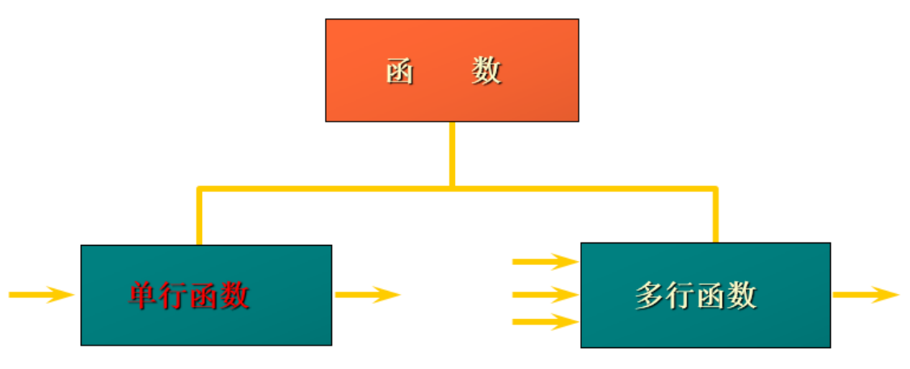
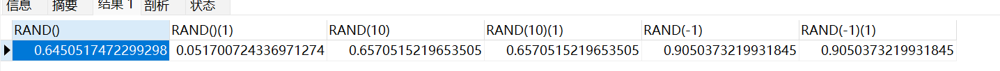
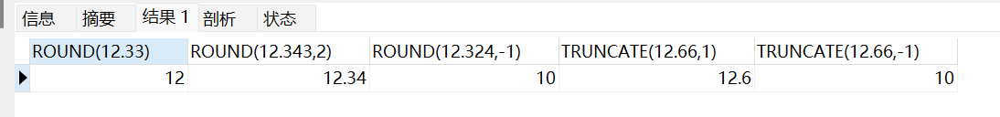
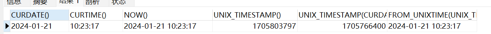
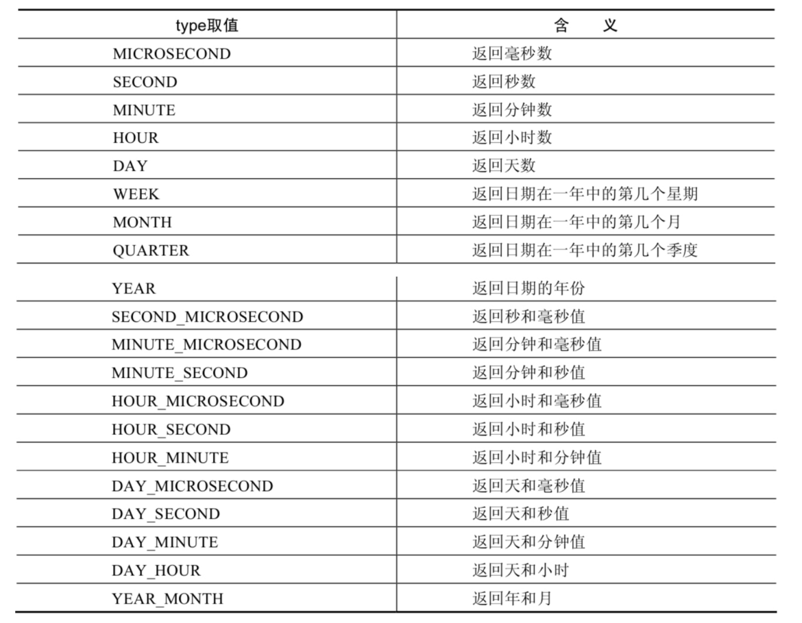
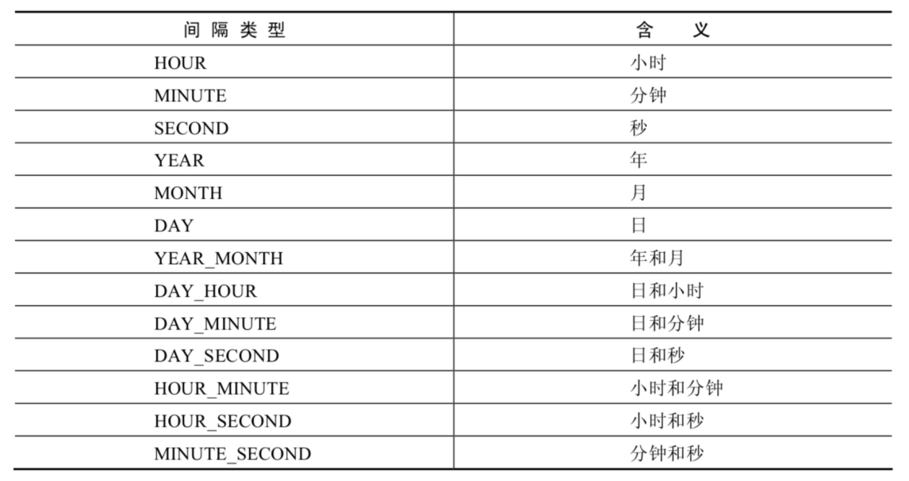
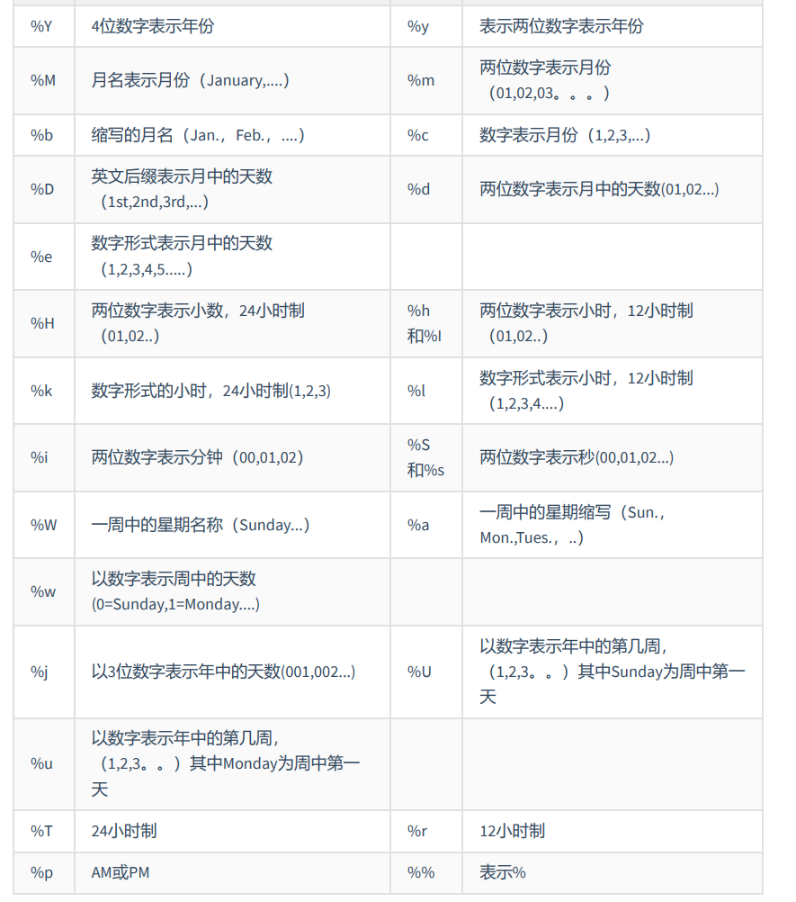
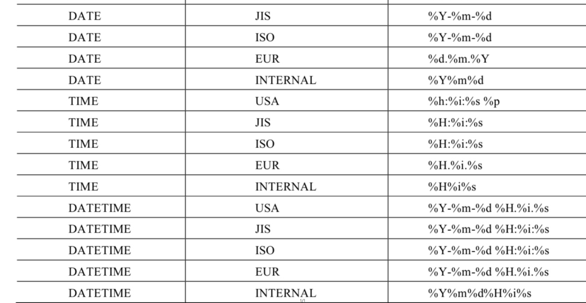

# 三、函数

**函数的分类**



- 操作数据对象
- 接受参数返回一个结果
- **只对一行进行变换**
- **每行返回一个结果**
- 可以嵌套
- 参数可以是一列或一个值

## 3.1 单行函数

### 3.1.1 数值函数

#### （1）基本函数

| 函数                | 解释                                                         |
| ------------------- | ------------------------------------------------------------ |
| ABS(x)              | 返回x的绝对值                                                |
| SIGN(X)             | 返回X的符号。正数返回1，负数返回-1，0返回0                   |
| PI()                | 返回圆周率的值                                               |
| CEIL(x)，CEILING(x) | 返回大于或等于某个值的最小整数                               |
| FLOOR(x)            | 返回小于或等于某个值的最大整数                               |
| LEAST(e1,e2,e3…)    | 返回列表中的最小值                                           |
| GREATEST(e1,e2,e3…) | 返回列表中的最大值                                           |
| MOD(x,y)            | 返回X除以Y后的余数                                           |
| RAND()              | 返回0~1的随机值                                              |
| RAND(x)             | 返回0~1的随机值，其中x的值用作种子值，相同的X值会产生相同的随机 数 |
| ROUND(x)            | 返回一个对x的值进行四舍五入后，最接近于X的整数               |
| ROUND(x,y)          | 返回一个对x的值进行四舍五入后最接近X的值，并保留到小数点后面Y位 |
| TRUNCATE(x,y)       | 返回数字x截断为y位小数的结果                                 |
| SQRT(x)             | 返回x的平方根。当X的值为负数时，返回NULL                     |

**RAND：随机数**

对于 RAND(x) 函数，如果种子相同的话，那么获取的随机数也是一样的！

```sql
SELECT RAND(),RAND(),RAND(10),RAND(10),RAND(-1),RAND(-1)
FROM DUAL;
```




**ROUND、TRUNCATE: 四舍五入、截断**

ROUND(12.324,-1)：-1看小数点前1位，尽心四舍五入

```sql
SELECT
ROUND(12.33),ROUND(12.343,2),ROUND(12.324,-1),TRUNCATE(12.66,1),TRUNCATE(12.66,-1)
FROM DUAL;
```




#### （2）三角函数

| 函数       | 解释                                                         |
| ---------- | ------------------------------------------------------------ |
| RADIANS(x) | 将角度转化为弧度，其中，参数x为角度值                        |
| DEGREES(x) | 将弧度转化为角度，其中，参数x为弧度值                        |
| SIN(x)     | 返回x的正弦值，其中，参数x为弧度值                           |
| ASIN(x)    | 返回x的反正弦值，即获取正弦为x的值。如果x的值不在-1到1之间，则返回NULL |
| COS(x)     | 返回x的余弦值，其中，参数x为弧度值                           |
| ACOS(x)    | 返回x的反余弦值，即获取余弦为x的值。如果x的值不在-1到1之间，则返回NULL |
| TAN(x)     | 返回x的正切值，其中，参数x为弧度值                           |
| ATAN(x)    | 返回x的反正切值，即返回正切值为x的值                         |
| COT(x)     | 返回x的余切值，其中，X为弧度值                               |
| ATAN2(m,n) | 返回两个参数的反正切值                                       |


#### （4） 指数和对数


| 函数                 | 解释                                                 |
| -------------------- | ---------------------------------------------------- |
| POW(x,y)，POWER(X,Y) | 返回x的y次方                                         |
| EXP(X)               | 返回e的X次方，其中e是一个常数，2.718281828459045     |
| LN(X)，LOG(X)        | 返回以e为底的X的对数，当X <= 0 时，返回的结果为NULL  |
| LOG10(X)             | 返回以10为底的X的对数，当X <= 0 时，返回的结果为NULL |
| LOG2(X)              | 返回以2为底的X的对数，当X <= 0 时，返回NULL          |


#### （5） 进制间的转换


| 函数          | 解释                     |
| ------------- | ------------------------ |
| BIN(x)        | 返回x的二进制编码        |
| HEX(x)        | 返回x的十六进制编码      |
| OCT(x)        | 返回x的八进制编码        |
| CONV(x,f1,f2) | 返回f1进制数变成f2进制数 |


### 3.1.2 字符串函数

> 注意：MySQL中，字符串的位置是从1开始的。

​

| 函数                              | 解释                                                         |
| --------------------------------- | ------------------------------------------------------------ |
| ASCII(S)                          | 返回字符串S中的第一个字符的ASCII码值                         |
| CHAR_LENGTH(s)                    | 返回字符串s的字符数。作用与CHARACTER_LENGTH(s)相同           |
| LENGTH(s)                         | 返回字符串s的字节数，和字符集有关                            |
| CONCAT(s1,s2,......,sn)           | 连接s1,s2,......,sn为一个字符串                              |
| CONCAT_WS(x, s1,s2,......,sn)     | 同CONCAT(s1,s2,...)函数，但是每个字符串之间要加上x           |
| INSERT(str, idx, len, replacestr) | 将字符串str从第idx位置开始，len个字符长的子串替换为字符串replacestr |
| REPLACE(str, a, b)                | 用字符串b替换字符串str中所有出现的字符串a                    |
| UPPER(s) 或 UCASE(s)              | 将字符串s的所有字母转成大写字母                              |
| LOWER(s) 或LCASE(s)               | 将字符串s的所有字母转成小写字母                              |
| LEFT(str,n)                       | 返回字符串str最左边的n个字符                                 |
| RIGHT(str,n)                      | 返回字符串str最右边的n个字符                                 |
| LPAD(str, len, pad)               | 用字符串pad对str最左边进行填充，直到str的长度为len个字符     |
| RPAD(str ,len, pad)               | 用字符串pad对str最右边进行填充，直到str的长度为len个字符     |
| LTRIM(s)                          | 去掉字符串s左侧的空格                                        |
| RTRIM(s)                          | 去掉字符串s右侧的空格                                        |
| TRIM(s)                           | 去掉字符串s开始与结尾的空格                                  |
| TRIM(s1 FROM s)                   | 去掉字符串s开始与结尾的s1                                    |
| TRIM(LEADING s1 FROM s)           | 去掉字符串s开始处的s1                                        |
| TRIM(TRAILING s1 FROM s)          | 去掉字符串s结尾处的s1                                        |
| REPEAT(str, n)                    | 返回str重复n次的结果                                         |
| SPACE(n)                          | 返回n个空格                                                  |
| STRCMP(s1,s2)                     | 比较字符串s1,s2的ASCII码值的大小                             |
| SUBSTR(s,index,len)               | 返回从字符串s的index位置其len个字符，作用与SUBSTRING(s,n,len)、 MID(s,n,len)相同 |
| LOCATE(substr,str)                | 返回字符串substr在字符串str中首次出现的位置，作用于POSITION(substr IN str)、INSTR(str,substr)相同 。未找到，返回0 |
| ELT(m,s1,s2,…,sn)                 | 返回指定位置的字符串，如果m=1，则返回s1，如果m=2，则返回s2，如 果m=n，则返回sn |
| FIELD(s,s1,s2,…,sn)               | 返回字符串s在字符串列表中第一次出现的位置                    |
| FIND_IN_SET(s1,s2)                | 返回字符串s1在字符串s2中出现的位置。其中，字符串s2是一个以逗号分 隔的字符串 |
| REVERSE(s)                        | 返回s反转后的字符串                                          |
| NULLIF(value1,value2)             | 比较两个字符串，如果value1与value2相等，则返回NULL，否则返回 value1 |


### 3.1.3 日期函数

#### (1) 获取日期、时间

| 函数                                                         | 解释                            |
| ------------------------------------------------------------ | ------------------------------- |
| CURDATE() ，CURRENT_DATE()                                   | 返回当前日期，只包含年、 月、日 |
| CURTIME() ， CURRENT_TIME()                                  | 返回当前时间，只包含时、 分、秒 |
| NOW() / SYSDATE() / CURRENT_TIMESTAMP() / LOCALTIME() / LOCALTIMESTAMP() | 返回当前系统日期和时间          |
| UTC_DATE()                                                   | 返回UTC（世界标准时间） 日期    |
| UTC_TIME()                                                   | 返回UTC（世界标准时间） 时间    |

**日期与时间戳的转换**

| 函数                     | 解释                                                         |
| ------------------------ | ------------------------------------------------------------ |
| UNIX_TIMESTAMP()         | 以UNIX时间戳的形式返回当前时间。SELECT UNIX_TIMESTAMP() - >1634348884 |
| UNIX_TIMESTAMP(date)     | 将时间date以UNIX时间戳的形式返回。                           |
| FROM_UNIXTIME(timestamp) | 将UNIX时间戳的时间转换为普通格式的时间                       |


```sql
-- 获取日期与时间
SELECT CURDATE(),CURTIME(),NOW(),UNIX_TIMESTAMP(),UNIX_TIMESTAMP(CURDATE()),FROM_UNIXTIME(UNIX_TIMESTAMP())
```




#### (2) 获取月份、星期、星期数、天数等函数

| 函数                                     | 用法                                             |
| ---------------------------------------- | ------------------------------------------------ |
| YEAR(date) / MONTH(date) / DAY(date)     | 返回 年份/月份/天                                |
| HOUR(time) / MINUTE(time) / SECOND(time) | 返回 时/分/秒                                    |
| MONTHNAME(date)                          | 返回月份：January，..                            |
| DAYNAME(date)                            | 返回星期几：MONDAY，TUESDAY.....SUNDAY           |
| WEEKDAY(date)                            | 返回周几，注意，周1是0，周2是1，。。。周日是6    |
| QUARTER(date)                            | 返回日期对应的季度，范围为1～4                   |
| WEEK(date) ， WEEKOFYEAR(date)           | 返回一年中的第几周                               |
| DAYOFYEAR(date)                          | 返回日期是一年中的第几天                         |
| DAYOFMONTH(date)                         | 返回日期位于所在月份的第几天                     |
| DAYOFWEEK(date)                          | 返回周几，注意：周日是1，周一是2，。。。周六是 7 |
| EXTRACT(type FROM date)                  | 返回指定日期中特定的部分，type指定返回的值       |

EXTRACT(type FROM date)函数中type的取值与含义：




#### (3) 时间和秒钟的转换

| 函数                 | 解释                                                         |
| -------------------- | ------------------------------------------------------------ |
| TIME_TO_SEC(time)    | 将 time 转化为秒并返回结果值。转化的公式为： 小时*3600+分钟 *60+秒 |
| SEC_TO_TIME(seconds) | 将 seconds 描述转化为包含小时、分钟和秒的时                  |


#### (4) 计算日期和时间的函数

| 函数                                                         | 解释                                            |
| ------------------------------------------------------------ | ----------------------------------------------- |
| DATE_ADD(datetime, INTERVAL expr type) ADDDATE(date,INTERVAL expr type) | 返回与给定日期时间相差INTERVAL时 间段的日期时间 |
| DATE_SUB(date,INTERVAL expr type)， SUBDATE(date,INTERVAL expr type) | 返回与date相差INTERVAL时间间隔的 日期           |

上述中type 的取值：



```sql
-- 后天
SELECT DATE_ADD(NOW(),INTERVAL 2 DAY)
--  前天
SELECT DATE_SUB(NOW(),INTERVAL 2 DAY)
```


| 函数                         | 解释                                                         |
| ---------------------------- | ------------------------------------------------------------ |
| ADDTIME(time1,time2)         | 返回time1加上time2的时间。当time2为一个数字时，代表的是 秒 ，可以为负数 |
| SUBTIME(time1,time2)         | 返回time1减去time2后的时间。当time2为一个数字时，代表的 是 秒 ，可以为负数 |
| DATEDIFF(date1,date2)        | 返回date1 - date2的日期间隔天数                              |
| TIMEDIFF(time1, time2)       | TIMEDIFF(time1, time2) 返                                    |
| FROM_DAYS(N)                 | 返回从0000年1月1日起，N天以后的日期                          |
| TO_DAYS(date                 | 返回日期date距离0000年1月1日的天数                           |
| LAST_DAY(date)               | 返回date所在月份的最后一天的日期                             |
| MAKEDATE(year,n)             | 针对给定年份与所在年份中的天数返回一个日期                   |
| MAKETIME(hour,minute,second) | 将给定的小时、分钟和秒组合成时间并返回                       |
| PERIOD_ADD(time,n            | 返回time加上n后的时间                                        |

```sql
SELECT
ADDTIME(NOW(),20),SUBTIME(NOW(),30),SUBTIME(NOW(),'1:1:3'),DATEDIFF(NOW(),'2021-10-
01'),
TIMEDIFF(NOW(),'2021-10-25 22:10:10'),FROM_DAYS(366),TO_DAYS('0000-12-25'),
LAST_DAY(NOW()),MAKEDATE(YEAR(NOW()),12),MAKETIME(10,21,23),PERIOD_ADD(20200101010101,
10)
FROM DUAL;

```


#### (5) 日期的格式化与解析

| 函数                              | 解释                                       |
| --------------------------------- | ------------------------------------------ |
| DATE_FORMAT(date,fmt)             | 按照字符串fmt格式化日期date值              |
| TIME_FORMAT(time,fmt)             | 按照字符串fmt格式化时间time值              |
| GET_FORMAT(date_type,format_type) | 返回日期字符串的显示格式                   |
| STR_TO_DATE(str, fmt)             | 按照字符串fmt对str进行解析，解析为一个日期 |

上述函数 **fmt** 通用的格式：



GET_FORMAT函数中date_type和format_type参数取值如下：




```sql
SELECT STR_TO_DATE('09/01/2009','%m/%d/%Y')
FROM DUAL;
SELECT STR_TO_DATE('20140422154706','%Y%m%d%H%i%s')
FROM DUAL;
SELECT STR_TO_DATE('2014-04-22 15:47:06','%Y-%m-%d %H:%i:%s')
FROM DUAL;
```


### 3.1.4 流程控制函数

流程处理函数可以根据不同的条件，执行不同的处理流程，可以在SQL语句中实现不同的条件选择。 MySQL中的流程处理函数主要包括IF()、IFNULL()和CASE()函数。

| 函数                                                         | 解释                                             |
| ------------------------------------------------------------ | ------------------------------------------------ |
| IF(value,value1,value2)                                      | 如果value的值为TRUE，返回value1， 否则返回value2 |
| IFNULL(value1, value2)                                       | 如果value1不为NULL，返回value1，否 则返回value2  |
| CASE WHEN 条件1 THEN 结果1 WHEN 条件2 THEN 结果2 .... [ELSE resultn] END | 相当于Java的if...else if...else..                |
| CASE expr WHEN 常量值1 THEN 值1 WHEN 常量值1 THEN 值1 .... [ELSE 值n] END | 相当于Java的switch...case..                      |


```sql
SELECT IF(1 > 0,'正确','错误')
->正确

SELECT CASE
WHEN 1 > 0
THEN '1 > 0'
WHEN 2 > 0
THEN '2 > 0'
ELSE '3 > 0'
END
->1 > 0


SELECT employee_id,salary, CASE WHEN salary>=15000 THEN '高薪'
WHEN salary>=10000 THEN '潜力股'
WHEN salary>=8000 THEN '屌丝'
ELSE '草根' END "描述"
FROM employees;


```


## 3.2 多行函数

### 3.2.1 聚合函数

聚合（或聚集、分组）函数，它是对 一组数据进行汇总的函数，`输入的是一组数据的集合，输出的是单个值`。

#### (1) 常用的聚合函数

**AVG()/SUM()**

AVG: 求平均值

SUM：求总和

只适用于数值类型的

```sql
SELECT SUM(salary) FROM employees
SELECT AVG(salary) FROM employees
```

**MAX()/MIN()**

MAX：最大值 MIN：最小值

可以适用于字符串、数值、日期类型！

```sql
SELECT MAX(salary),MIN(salary) FROM employees
SELECT MAX(last_name),MIN(last_name) FROM employees
```


**COUNT()**

COUNT(expr) 返回expr不为空的记录总数。

```sql
SELECT COUNT(salary) FROM employees
```

上面这几个聚合函数都会自动过滤NULL值

**问题：用count(*)，count(1)，count(列名)谁好呢**

其实，对于MyISAM引擎的表是没有区别的。这种引擎内部有一计数器在维护着行数。

Innodb引擎的表用count(*),count(1)直接读行数，复杂度是O(n)，因为innodb真的要去数一遍。但好于具体的count(列名)。

#### (2) GROUP BY

可以使用GROUP BY子句将表中的数据分成若干组

```sql
SELECT column, group_function(column)
FROM table
[WHERE condition]
[GROUP BY group_by_expression]
[ORDER BY column];
```


> 在SELECT列表中所有未包含在组函数中的列都应该包含在 GROUP BY子句中
>
> 反之， GROUP BY子句中的字段可以不出现在SELECT后

```sql
SELECT department_id, AVG(salary)
FROM employees
GROUP BY department_id ;

```


#### (3) HAVIGN

**作用**：用来过滤数据的

**举例**：查询各个部门中最高工资比10000高的部门信息

```sql
-- 错误写法
SELECT department_id, MAX(salary)
FROM employees
WHERE MAX(salary) > 10000
GROUP BY department_id ;
```

**要求1**：如果过滤条件中使用到啊了`聚合函数` ， 则必须使用` HAVING 替换 WHERE` 否则就会报错

**要求2**： 如果要使用 HAVING，则必须在 GROUP BY 后面

**要求3**： HAVIGN 一般会和 GROUP BY搭配使用，如果单独使用HAVING 不会报错，但是没有意义，将整个查询结果作为一组。

```sql
-- 正确写法
SELECT department_id, MAX(salary)
FROM employees
GROUP BY department_id 
HAVING MAX(salary) > 10000
```

**结论：**

当过滤条件中有聚合函数时，则过滤条件`一定`要放在HAVIGN中

当过滤条件中没有聚合函数时，则过滤条件放在 `WHERE和HAVING都可以`，但是建议放在WHERE中，`WEHRE 的执行效率会比放在 HAVIGN 中效率高`


#### (4) SQL的完整结构及执行原理

```sql
SELECT ...,....,...
FROM ... JOIN ...
ON 多表的连接条件
JOIN ...
ON ...
WHERE 不包含组函数的过滤条件
AND/OR 不包含组函数的过滤条件
GROUP BY ...,...
HAVING 包含组函数的过滤条件
ORDER BY ... ASC/DESC
LIMIT ...,...

```

**SQL的执行顺序**

```sql
FROM -> (LEFT/RIGHT) JOIN ON -> WHERE -> GROUP BY -> HAVING -> SELECT 的字段 -> DISTINCT -> ORDER BY -> LIMIT

```

```sql
SELECT DISTINCT player_id, player_name, count(*) as num # 顺序 5
FROM player JOIN team ON player.team_id = team.team_id # 顺序 1
WHERE height > 1.80 # 顺序 2
GROUP BY player.team_id # 顺序 3
HAVING num > 2 # 顺序 4
ORDER BY num DESC # 顺序 6
LIMIT 2 # 顺序 7
```


在 SELECT 语句执行这些步骤的时候，每个步骤都会产生一个 `虚拟表` ，然后将这个虚拟表传入下一个步 骤中作为输入。需要注意的是，这些步骤隐含在 SQL 的执行过程中，对于我们来说是不可见的。

> 了解了SQL的执行顺序，我们在来说为什么WHERE会比HAVIGN执行效率高，假设我们有百万条数据，在经历过WHERE之后可能就剩非常少的数据，在这些数据在分组, HAVIGN过滤就非常轻松了。
>
> 但是将条件放在HAVIGN中，先对百万条数据进行分组，这个操作就非常耗时了！

