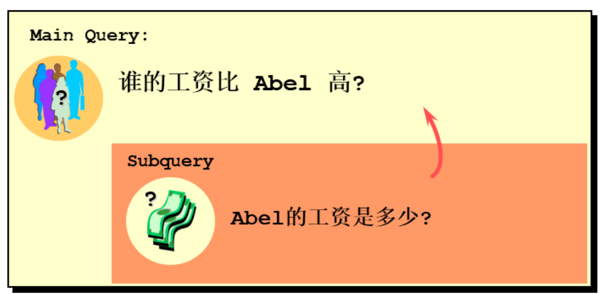
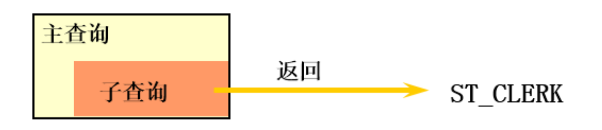
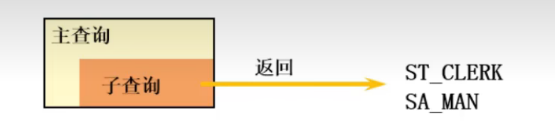
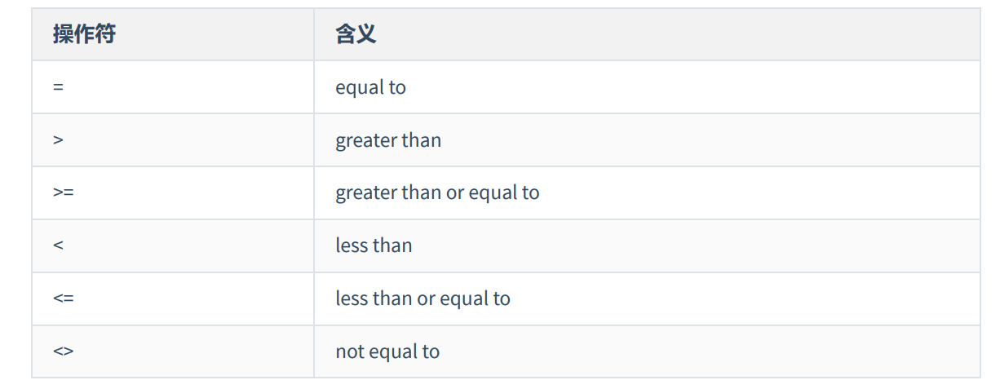
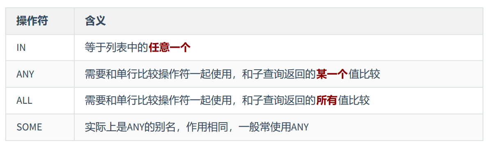
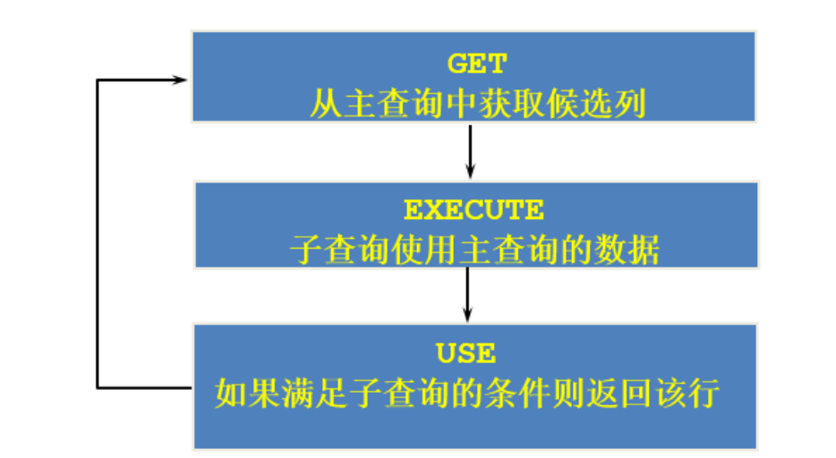
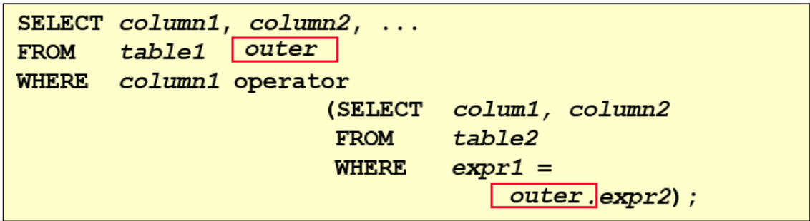
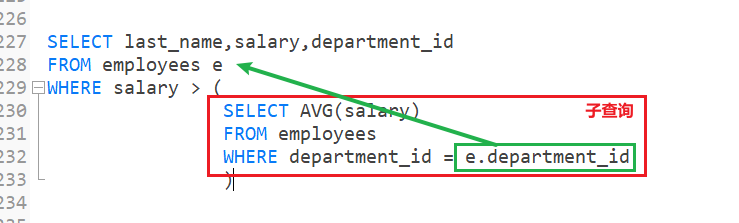

# 四、子查询

子查询指一个查询语句嵌套在另一个查询语句内部的查询，这个特性从MySQL 4.1开始引入。

SQL 中子查询的使用大大增强了 SELECT 查询的能力，因为很多时候查询需要从结果集中获取数据，或者 需要从同一个表中先计算得出一个数据结果，然后与这个数据结果（可能是某个标量，也可能是某个集 合）进行比较。

> 子查询其实就相当于变成语言中的嵌套FOR循环


## 4.1 提出需求并解决



```sql
#方式一：
SELECT salary
FROM employees
WHERE last_name = 'Abel';
SELECT last_name,salary
FROM employees
WHERE salary > 11000;


#方式二：自连接
SELECT e2.last_name,e2.salary
FROM employees e1,employees e2
WHERE e1.last_name = 'Abel'
AND e1.`salary` < e2.`salary`

#方式三：子查询
SELECT last_name,salary
FROM employees
WHERE salary > (
                SELECT salary
                FROM employees
                WHERE last_name = 'Abel'
                );
```


子查询（内查询）在主查询之前一次执行完成。

子查询的结果被主查询（外查询）使用 。

**注意事项**

- 子查询要包含在括号内
- 将子查询放在比较条件的右侧
- 单行操作符对应单行子查询，多行操作符对应多行子查询


## 4.2 子查询的分类

**分类方式一**：我们按内查询的结果返回一条还是多条记录，将子查询分为 `单行子查询` 、 `多行子查询` 。

单行子查询返回一条记录



多行子查询返回多条记录




**分类方式二**：我们按内查询是否被执行多次，将子查询划分为 `相关(或关联)子查询` 和 `不相关(或非关联)子查询` 。

子查询从数据表中查询了数据结果，如果这个数据结果只执行一次，然后这个数据结果作为主查询的条 件进行执行，那么这样的子查询叫做`不相关子查询`。

同样，如果子查询需要执行多次，即采用循环的方式，先从外部查询开始，每次都传入子查询进行查 询，然后再将结果反馈给外部，这种嵌套的执行方式就称为`相关子查询`。


### 4.2.1 单行子查询

#### (1) 单行比较操作符



#### (2) 案例

**题目**：返回公司`工资最少`的员工的last_name,job_id和salary

```sql
SELECT last_name, job_id, salary
FROM employees
WHERE salary = (
    			SELECT MIN(salary)
				FROM employees
				);
```

**题目**：查询`与141号员工的manager_id和department_id相同的其他`员工的employee_id， manager_id，department_id

```sql
-- 实现方式一
SELECT employee_id, manager_id, department_id
FROM employees
WHERE manager_id = (
										SELECT manager_id
										FROM employees
										WHERE employee_id = 141
										)
AND department_id = (
										SELECT department_id
										FROM employees
										WHERE employee_id = 141
										)
AND employee_id != 141

-- 实现方式二
SELECT employee_id, manager_id, department_id
FROM employees
WHERE (department_id,manager_id) = (                                                                            SELECT department_id,manager_id
                                   FROM employees
                                   WHERE employee_id = 141
									)
AND employee_id != 141

```


#### (3) HAVING中的子查询

**题目**：查询`最低工资大于50号部门最低工资的` 部门id和其最低工资

```sql
SELECT department_id, MIN(salary)
FROM employees
GROUP BY department_id
HAVING MIN(salary) > (
											SELECT MIN(salary)
											FROM employees
											WHERE department_id = 50
										 )
```


#### (4) CASE 中的子查询

**题目**：显式员工的employee_id,last_name和location。`其中，若员工department_id与location_id为1800 的department_id相同，则location为’Canada’，其余则为’USA’`。

```sql
SELECT employee_id, last_name,
(CASE department_id WHEN
(SELECT department_id FROM departments WHERE location_id = 1800)
THEN 'Canada' ELSE 'USA' END) "location"
FROM employees;

```


### 4.2.2 多行子查询

- 也称为集合比较子查询
- 内查询返回多行
- 使用多行比较操作符

#### (1) 多行比较操作符



#### (2) 案例

**题目**：返回`其它job_id中比job_id为‘IT_PROG’部门【任一】工资都低的员工的`员工号、姓名、job_id以及 salary

```sql
SELECT employee_id,last_name,job_id,salary
FROM employees
WHERE job_id != 'IT_PROG'
AND salary < ANY(
								SELECT salary
								FROM employees
								WHERE job_id = 'IT_PROG'
								)
```

**题目**：返回`其它job_id中比job_id为‘IT_PROG’部门【所有】工资都低的员工的`员工号、姓名、job_id以及 salary

```sql
SELECT employee_id,last_name,job_id,salary
FROM employees
WHERE job_id != 'IT_PROG'
AND salary < ALL(
								SELECT salary
								FROM employees
								WHERE job_id = 'IT_PROG'
								)

```

**题目**：查询平均工资最低的部门id

```sql
-- 错误的，聚合函数不能嵌套
SELECT MIN(AVG(salary))
FROM employees
GROUP BY department_id
```

- 查询出所有部门的平均工资

```sql
SELECT AVG(salary) AS "avg_salary"
FROM employees
GROUP BY department_id
```


- 将结果作为一张新表，查询出这个新表中最低的平均工资

```sql
SELECT MIN(avg_salary)
FROM (
	SELECT AVG(salary) AS "avg_salary"
	FROM employees
	GROUP BY department_id
	)  dept_avg_salary
```


- 查询平均工资等于这个最低的平均工资的部门ID

```sql
SELECT department_id
FROM employees
GROUP BY department_id
HAVING AVG(salary) = (
						SELECT MIN(avg_salary)
						FROM (
							SELECT AVG(salary) AS "avg_salary"
							FROM employees
							GROUP BY department_id
							)  dept_avg_salary
					)
```

**优化**

```sql
SELECT department_id
FROM employees
GROUP BY department_id
HAVING AVG(salary) <= ALL (
							SELECT AVG(salary) AS "avg_salary"
							FROM employees
							GROUP BY department_id
						  )
```


### 4.2.3 相关子查询

如果子查询的执行依赖于外部查询，通常情况下都是因为`子查询中的表用到了外部的表`，并进行了条件 关联，因此每执行一次外部查询，子查询都要`重新计算一次`，这样的子查询就称之为 `关联子查询 `。

相关子查询按照一行接一行的顺序执行，主查询的每一行都执行一次子查询。





**说明：** 子查询中使用主查询的列

**题目**：查询员工`中工资大于本部门平均工资的员工`的last_name,salary和其department_id

由外向里思考：

**第一种方式**：

- 先查询出员工的last_name,salary和其department_id

```sql
SELECT last_name,salary,department_id
FROM employees
WHERE salary > (本部门的平均工资)
```

- 查询本部门的平均工资
    - 需要注意的是：这个本部门是要使用到主查询中的部门ID，它不是固定的，子查询中使用到了主查询中的列，这就是相关子查询！！！！

```sql
SELECT last_name,salary,department_id
FROM employees e
WHERE salary > (
				SELECT AVG(salary)
				FROM employees
				WHERE department_id = e.department_id
				)

```




**第二种方式：**

查询结果都能当做一张新表使用，我们可以将每个部门的ID、平均工资查询出来当做一张新表。

将主表与这个新表进行连接，通过部门ID查询出工资比平均工资大的员工

- 将每个部门的ID、平均工资查询出来当做一张新表

```sql
SELECT department_id,AVG(salary) AS "avg_salary"
FROM employees
GROUP BY department_id 
```

- 将主表与这个新表进行连接，通过部门ID查询出工资比平均工资大的员工

```sql
SELECT e1.last_name,salary,e1.department_id
FROM employees e1, (
					SELECT department_id,AVG(salary) AS "avg_salary"
					FROM employees
					GROUP BY department_id 
					) t_dept_avg_salary
WHERE e1.department_id = t_dept_avg_salary.department_id
AND e1.salary >  t_dept_avg_salary.avg_salary
```

**注意事项：**

- 在子查询中如果用到聚合函数作为列，一定要为其起一个别名，类似上面的 "avg_salary"
- 俩张表连接，至少要有一个连接条件，否则会出现 "笛卡尔积"


**题目**：查询员工的id,salary,`按照department_name 排序`

```sql
SELECT employee_id,salary
FROM employees e
ORDER BY (
            SELECT department_name
            FROM departments d
            WHERE e.`department_id` = d.`department_id`
		  );

```

**题目**：若employees表中employee_id与job_history表中employee_id相同的数目不小于2，输出这些相同 id的员工的employee_id,last_name和其job_id

```sql
SELECT e.employee_id, last_name,e.job_id
FROM employees e
WHERE 2 <= (
            SELECT COUNT(*)
            FROM job_history
            WHERE employee_id = e.employee_id
           );

```

**结论**:  除了GROUP BY 和 LIMIT不能使用子查询，其他地方都可以使用！

