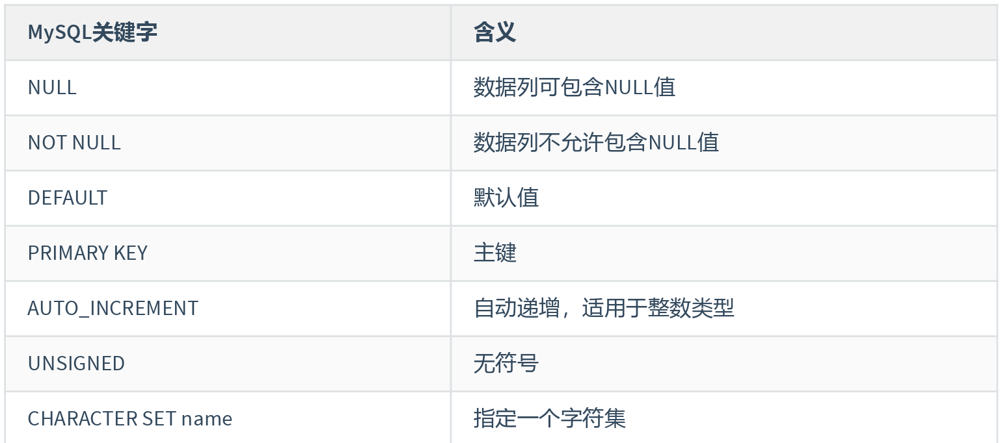
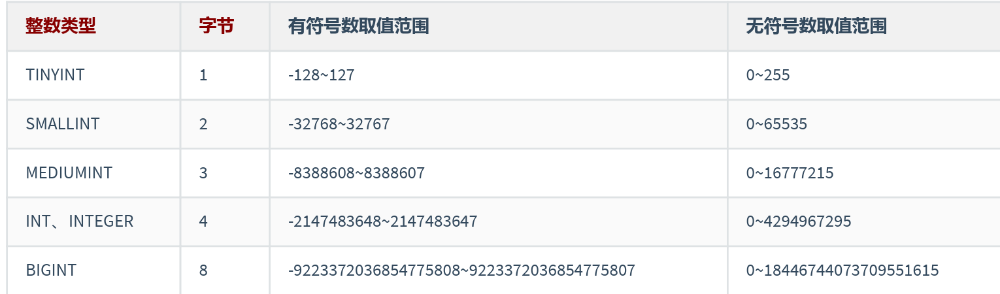
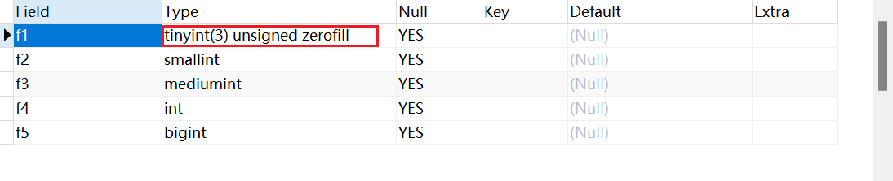
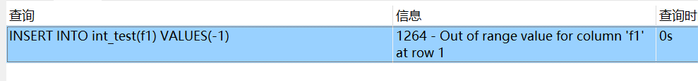
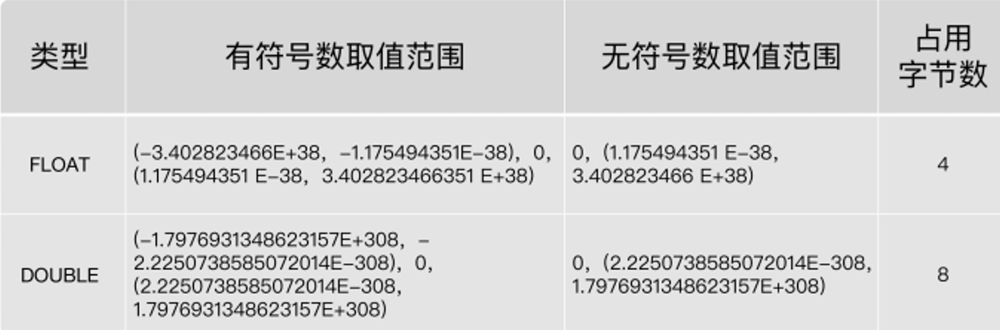
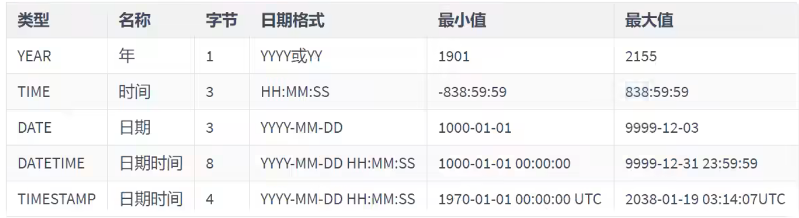
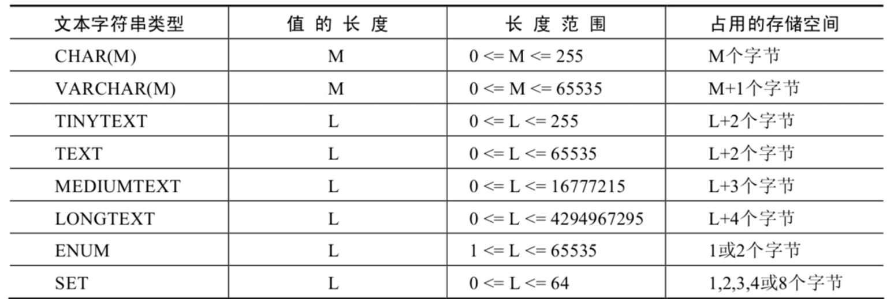
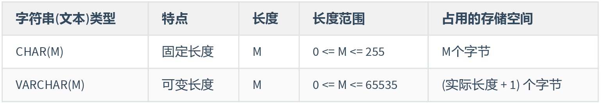
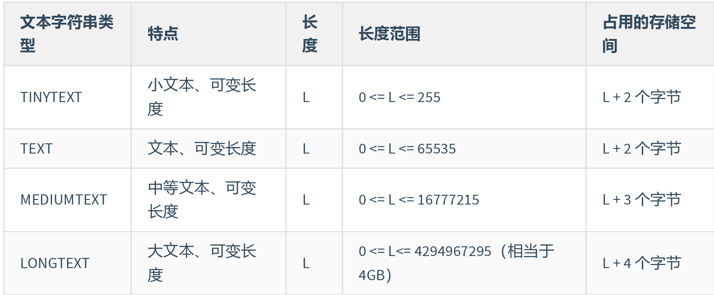
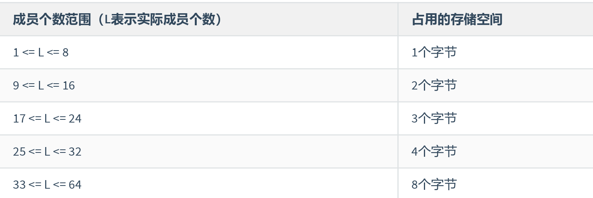

# 六、 MYSQL中的数据类型

常见数据类型的属性，如下：



## 6.1 整型

整数类型一共有 5 种，包括 TINYINT、SMALLINT、MEDIUMINT、INT（INTEGER）和 BIGINT。

它们的区别如下表所示




### 6.1.1 可选属性

#### (1) M

`M` : 表示显示宽度，M的取值范围是(0, 255)。例如，int(5)：当数据宽度小于5位的时候在数字前面需要用 字符填满宽度。该项功能需要配合“ ZEROFILL ”使用，表示用“0”填满宽度，否则指定显示宽度无效。

> 如果设置了显示宽度，那么插入的数据宽度超过显示宽度限制，会不会截断或插入失败？
>
> 答案：不会对插入的数据有任何影响，还是按照类型的实际宽度进行保存，即 显示宽度与类型可以存储的 值范围无关。**从MySQL 8.0.17开始，整数数据类型不推荐使用显示宽度属性**。

整型数据类型可以在定义表结构时指定所需要的显示宽度，如果不指定，则系统为每一种类型指定默认 的宽度值。

```sql
create TABLE IF NOT EXISTS `int_test` (
	f1 TINYINT(3) ZEROFILL, // 当插入的数据不足3位，则使用0在前面填充
	f2 SMALLINT,
	f3 MEDIUMINT,
	f4 INTEGER,
	f5 BIGINT
)

```

当使用 ZEROFILL 时，自动会添加 unsigned，表示默认从0开始



#### (2) UNSIGEND

`UNSIGNED` : 无符号类型（非负），所有的整数类型都有一个可选的属性UNSIGNED（无符号属性），无 符号整数类型的最小取值为0。所以，如果需要在MySQL数据库中保存非负整数值时，可以将整数类型设 置为无符号类型。

如果设置 UNSIGEND ，当插入数据为负数时，会报错：



#### (3) ZEROFILL

`ZEROFILL` : 0填充,（如果某列是ZEROFILL，那么MySQL会自动为当前列添加UNSIGNED属性），如果指 定了ZEROFILL只是表示不够M位时，用0在左边填充，如果超过M位，只要不超过数据存储范围即可。

原来，在 int(M) 中，M 的值跟 int(M) 所占多少存储空间并无任何关系。 int(3)、int(4)、int(8) 在磁盘上都 是占用 4 bytes 的存储空间。也就是说，**int(M)，必须和 UNSIGNED ZEROFILL 一起使用才有意义**。如果整 数值超过M位，就按照实际位数存储。只是无须再用字符 0 进行填充


### 6.1.2 适用场景

`TINYINT` ：一般用于枚举数据，比如系统设定取值范围很小且固定的场景。

`SMALLINT` ：可以用于较小范围的统计数据，比如统计工厂的固定资产库存数量等。

`MEDIUMINT` ：用于较大整数的计算，比如车站每日的客流量等。

`INT、INTEGER` ：取值范围足够大，一般情况下不用考虑超限问题，用得最多。比如商品编号。

`BIGINT` ：只有当你处理特别巨大的整数时才会用到。比如双十一的交易量、大型门户网站点击量、证 券公司衍生产品持仓等。

在评估用哪种整数类型的时候，你需要考虑 `存储空间`和 `可靠性的平衡`问题：

- 一方 面，用`占用字节数少` 的整数类型可以`节省存储空间`；

- 另一方面，要是为了节省存储空间， 使用的整数类型取值范围太小，一 旦遇到超出取值范围的情况，就可能引起 系统错误，影响可靠性。

举个例子，商品编号采用的数据类型是 INT。原因就在于，客户门店中流通的商品种类较多，而且，每 天都有旧商品下架，新商品上架，这样不断迭代，日积月累。 如果使用 SMALLINT 类型，虽然占用字节数比 INT 类型的整数少，但是却不能保证数据不会超出范围 65535。

相反，使用 INT，就能确保有足够大的取值范围，不用担心数据超出范围影响可靠性的问题。 你要注意的是，在实际工作中，**系统故障产生的成本远远超过增加几个字段存储空间所产生的成本。因 此，我建议你首先确保数据不会超过取值范围，在这个前提之下，再去考虑如何节省存储空间**。


## 6.2 浮点类型

浮点数和定点数类型的特点是可以 处理小数，你可以把整数看成小数的一个特例。因此，浮点数和定点 数的使用场景，比整数大多了。 MySQL支持的浮点数类型，分别是 **FLOAT、DOUBLE、REAL**。

- FLOAT 表示单精度浮点数；

- DOUBLE 表示双精度浮点数；



- REAL默认就是 DOUBLE。如果你把 SQL 模式设定为启用“ REAL_AS_FLOAT ”，那 么，MySQL 就认为 REAL 是 FLOAT。如果要启用“REAL_AS_FLOAT”，可以通过以下 SQL 语句实现：

```sql
SET sql_mode = “REAL_AS_FLOAT”;
```


**问题1**：FLOAT 和 DOUBLE 这两种数据类型的区别是啥呢？

FLOAT 占用字节少，取值范围小，DOUBLE 占用字节多，取值范围大

**问题2**：为什么浮点数类型的无符号数取值范围，只相当于有符号数取值范围的一半，也就是只相当于 有符号数取值范围大于等于零的部分呢？

MySQL 存储浮点数的格式为： `符号(S) 、 尾数(M) 和  阶码(E)` 。因此，无论有没有符号，MySQL 的浮 点数都会存储表示符号的部分。因此， 所谓的无符号数取值范围，其实就是有符号数取值范围大于等于 零的部分。

**问题3**

在编程中，如果用到浮点数，要特别注意误差问题，因为浮点数是不准确的，所以我们要避免使用“=”来 判断两个数是否相等。同时，在一些对精确度要求较高的项目中，千万不要使用浮点数，不然会导致结 果错误，甚至是造成不可挽回的损失。那么，MySQL 有没有精准的数据类型呢？当然有，这就是定点数 类型： `DECIMAL` 。

## 6.3 定点数类型

MySQL中的定点数类型只有 DECIMAL 一种类型

使用 `DECIMAL(M,D)` 的方式表示高精度小数。其中，M被称为精度，D被称为标度。`(M,D)中 M=整数位+小数位，D=小数位`。 D<=M<=255，0<=D<=30。

- 定点数在MySQL内部是以 **字符串的形式进行存储**，这就决定了它一定是精准的。

- 当DECIMAL类型不指定精度和标度时，其默认为DECIMAL(10,0)。当数据的精度超出了定点数类型的 精度范围时，则MySQL同样会进行四舍五入处理。

**浮点数 vs 定点数**

- 浮点数相对于定点数的优点是在长度一定的情况下，`浮点类型取值范围大，但是不精准`，适用 于需要取值范围大，又可以容忍微小误差的科学计算场景（比如计算化学、分子建模、流体动 力学等）

- 定点数类型`取值范围相对小，但是精准，没有误差`，适合于对精度要求极高的场景 （比如涉 及金额计算的场景）


## 6.4 位类型

BIT类型中存储的是二进制值，类似010110


BIT类型，如果没有指定(M)，默认是1位。这个1位，表示只能存1位的二进制值。这里(M)是表示二进制的 位数，位数最小值为1，最大值为64。


## 6.5 日期和时间类型

MySQL有多种表示日期和时间的数据类型，不同的版本可能有所差异，MySQL8.0版本支持的日期和时间 类型主要有：YEAR类型、TIME类型、DATE类型、DATETIME类型和TIMESTAMP类型

- YEAR 类型通常用来表示年

- DATE 类型通常用来表示年、月、日

- TIME 类型通常用来表示时、分、秒

- DATETIME 类型通常用来表示年、月、日、时、分、秒

- TIMESTAMP 类型通常用来表示带时区的年、月、日、时、分、秒



**从MySQL5.5.27开始，2位格式的YEAR已经不推荐使用**。YEAR默认格式就是“YYYY”，没必要写成YEAR(4)， 从MySQL 8.0.19开始，不推荐使用指定显示宽度的YEAR(4)数据类型。


## 6.6 文本字符串类型

在实际的项目中，我们还经常遇到一种数据，就是字符串数据。

MySQL中，文本字符串总体上分为 CHAR 、 VARCHAR 、 LONGTEXT 、 ENUM 、 SET 等类型。




### 6.6.1 CHAR 与 VARCHAR

CHAR和VARCHAR类型都可以存储比较短的字符串。




**CHAR类型**

- CHAR(M) 类型一般需要预先定义字符串长度。如果不指定(M)，则表示长度默认是1个字符。
- 如果保存时，数据的实际长度比CHAR类型声明的长度小，则会在 `右侧填充空格`以达到指定的长 度。当MySQL检索CHAR类型的数据时，CHAR类型的字段会去除尾部的空格。
- 定义CHAR类型字段时，声明的字段长度即为CHAR类型字段所占的存储空间的字节数

**VARCHAR类型**：

- VARCHAR(M) 定义时， 必须指定长度M，否则报错
- MySQL4.0版本以下，varchar(20)：指的是20字节，如果存放UTF8汉字时，只能存6个（每个汉字3字 节） ；MySQL5.0版本以上，varchar(20)：指的是20字符。
- 检索VARCHAR类型的字段数据时，会保留数据尾部的空格。VARCHAR类型的字段所占用的存储空间 为字符串实际长度加1个字节

**哪些情况用CHAR 哪些情况用 VARCHAR**


**情况1**：存储很短的信息。比如门牌号码101，201……这样很短的信息应该用char，因为varchar还要占个 byte用于存储信息长度，本来打算节约存储的，结果得不偿失。

**情况2**：情况2:固定长度的。比如使用uuid作为主键，那用char应该更合适。因为他固定长度，varchar动态根据长度的特性就消失了，而且还要占个长度信息。

**情况3**：十分频繁改变的column。因为varchar每次存储都要有额外的计算，得到长度等工作，如果一个 非常频繁改变的，那就要有很多的精力用于计算，而这些对于char来说是不需要的。

**情况4** 具体存储引擎的情况

`MyISAM `数据存储引擎和数据列：MyISAM数据表，最好使用固定长度(CHAR)的数据列代替可变长 度(VARCHAR)的数据列。这样使得整个表静态化，从而使 数据检索更快，用空间换时间。

`MEMORY` 存储引擎和数据列：MEMORY数据表目前都使用固定长度的数据行存储，因此无论使用 CHAR或VARCHAR列都没有关系，两者都是作为CHAR类型处理的。

·InnoDB· 存储引擎，建议使用VARCHAR类型。因为对于InnoDB数据表，内部的行存储格式并没有区 分固定长度和可变长度列（所有数据行都使用指向数据列值的头指针），而且`主要影响性能的因素 是数据行使用的存储总量`，由于char平均占用的空间多于varchar，所以除了简短并且固定长度的， 其他考虑varchar。这样节省空间，对磁盘I/O和数据存储总量比较好


### 6.6.2 TEXT 类型

在MySQL中，TEXT用来保存文本类型的字符串，总共包含4种类型，分别为TINYTEXT、TEXT、 MEDIUMTEXT 和 LONGTEXT 类型

在向TEXT类型的字段保存和查询数据时，系统自动按照实际长度存储，不需要预先定义长度。这一点和 VARCHAR类型相同



**由于实际存储的长度不确定，MySQL 不允许 TEXT 类型的字段做主键**。遇到这种情况，你只能采用 CHAR(M)，或者 VARCHAR(M)

**说明**

TEXT文本类型，可以存比较大的文本段，搜索速度稍慢，因此如果不是特别大的内容，建议使用CHAR， VARCHAR来代替。还有TEXT类型不用加默认值，加了也没用。而且text和blob类型的数据删除后容易导致 “空洞”，使得文件碎片比较多，所以`频繁使用的表不建议包含TEXT类型字段，建议单独分出去，单独用 一个表`。


### 6.6.3 ENUM 类型

ENUM类型也叫作枚举类型，ENUM类型的取值范围需要在定义字段时进行指定。设置字段值时，ENUM 类型只允许从成员中选取单个值，不能一次选取多个值


当ENUM类型包含1～255个成员时，需要1个字节的存储空间；

当ENUM类型包含256～65535个成员时，需要2个字节的存储空间。

ENUM类型的成员个数的上限为65535个。

```sql
CREATE TABLE test_enum(
 season ENUM('春','夏','秋','冬','unknow')
 );
 
 # 正确使用
 INSERT INTO test_enum
 VALUES('春'),('秋');
 # 忽略大小写
INSERT INTO test_enum
 VALUES('UNKNOW');
 # 允许按照角标的方式获取指定索引位置的枚举值
INSERT INTO test_enum
 VALUES('1'),(3);
 # Data truncated for column 'season' at row 1
 INSERT INTO test_enum
 VALUES('ab');
 # 当ENUM类型的字段没有声明为NOT NULL时，插入NULL也是有效的
INSERT INTO test_enum
 VALUES(NULL);
```


### 6.6.4 SET 类型

当SET类型包含的成员个数不同时，其所占用的存储空间也是不同的，具体如下




SET类型在存储数据时成员个数越多，其占用的存储空间越大。注意：`SET类型在选取成员时，可以一次 选择多个成员，这一点与ENUM类型不同`。

```sql
CREATE TABLE test_set(
 s SET ('A', 'B', 'C')
 );
 
 INSERT INTO test_set (s) VALUES ('A'), ('A,B');
 #插入重复的SET类型成员时，MySQL会自动删除重复的成员
INSERT INTO test_set (s) VALUES ('A,B,C,A');
 #向SET类型的字段插入SET成员中不存在的值时，MySQL会抛出错误。
INSERT INTO test_set (s) VALUES ('A,B,C,D');
 SELECT *
 FROM test_set;
```


### 6.6.5 JSON 类型

JSON（JavaScript Object Notation）是一种轻量级的 数据交换格式。简洁和清晰的层次结构使得 JSON 成 为理想的数据交换语言。它易于人阅读和编写，同时也易于机器解析和生成，并有效地提升网络传输效 率。J**SON 可以将 JavaScript 对象中表示的一组数据转换为字符串，然后就可以在网络或者程序之间轻 松地传递这个字符串，并在需要的时候将它还原为各编程语言所支持的数据格式**


当需要检索JSON类型的字段中数据的某个具体值时，可以使用“->”和“->>”符号。

```sql
# 创建表
CREATE TABLE json_test(
 js JSON
)
# 插入数据
INSERT INTO json_test (js) 
VALUES ('{"name":"songhk", "age":18, "address":{"province":"beijing", 
"city":"beijing"}}');
# 取出json中的数据
SELECT js -> '$.name' AS NAME,js -> '$.age' AS age ,js -> '$.address.province' 
AS province, js -> '$.address.city' AS city FROM json_test;
```

