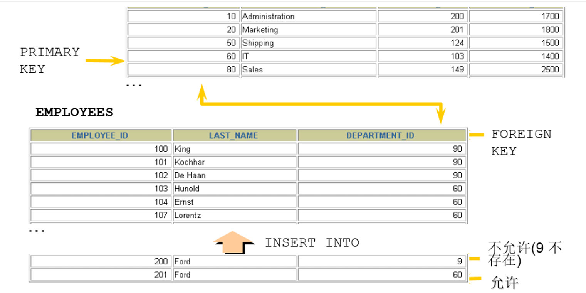

# 七、 约束

## 7.1 约束概念

**为什么需要约束？**

数据完整性（Data Integrity）是指数据的精确性（Accuracy）和可靠性（Reliability）。它是防止数据库中 存在不符合语义规定的数据和防止因错误信息的输入输出造成无效操作或错误信息而提出的。

为了保证数据的完整性，SQL规范以约束的方式对表数据进行额外的条件限制。从以下`四个方面`考虑：

- 实体完整性（Entity Integrity） ：例如，同一个表中，不能存在两条完全相同无法区分的记录
- 域完整性（Domain Integrity） ：例如：年龄范围0-120，性别范围“男/女
- 引用完整性（Referential Integrity） ：例如：员工所在部门，在部门表中要能找到这个部门
- 用户自定义完整性（User-defined Integrity） ：例如：用户名唯一、密码不能为空等，本部门 经理的工资不得高于本部门职工的平均工资的5倍


**什么是约束？**

约束是表级的强制规定。

可以在创建表时规定约束（通过 `CREATE TABLE `语句），或者在表创建之后通过 `ALTER TABLE `语句规定 约束。


## 7.2 约束的分类

根据约束数据列的限制，约束可分为：

- 单列约束：每个约束只约束一列

- 多列约束：每个约束可约束多列数据

根据约束的作用范围，约束可分为：

- 列级约束：只能作用在一个列上，跟在列的定义后面

- 表级约束：可以作用在多个列上，不与列一起，而是单独定义

根据约束起的作用，约束可分为：

- NOT NULL 非空约束，规定某个字段不能为空
- UNIQUE 唯一约束，规定某个字段在整个表中是唯一的
- PRIMARY KEY 主键(非空且唯一)约束
- FOREIGN KEY 外键约束
- CHECK 检查约束
- DEFAULT 默认值约束

**查看某张表的约束：**

```sql
#information_schema数据库名（系统库）
#table_constraints表名称（专门存储各个表的约束）
SELECT * FROM information_schema.table_constraints 
WHERE table_name = '表名称';
```


### 7.2.1 非空约束

限定某个字段/某列的值不允许为空

**关键字**：NOT NULL

**特点**

默认所有的类型的值都可以是NULL，包括INT、FLOAT等数据类型

非空约束只能出现在表对象的列上，只能某个列单独限定非空，不能组合非空

一个表可以有很多列都分别限定了非空

空字符串''不等于NULL，0也不等于NULL

**增加**

```sql
# 建表时
CREATE TABLE 表名称(
字段名  数据类型,
字段名  数据类型 NOT NULL,  
字段名  数据类型 NOT NULL
 );
 # 建表之后
 alter table 表名称 modify 字段名 数据类型 not null;
```


### 7.2.2 唯一性约束

用来限制某个字段/某列的值不能重复

**关键字：**UNIQUE

**特点**

同一个表可以有多个唯一约束。

唯一约束可以是某一个列的值唯一，也可以多个列组合的值唯一。

唯一性约束允许列值为空。

在创建唯一约束的时候，如果不给唯一约束命名，就默认和列名相同。

MySQL会给唯一约束的列上默认创建一个唯一索引。


**增加约束**

字段列表中如果是一个字段，表示该列的值唯一。如果是两个或更多个字段，那么复合唯一，即多个字段的组合是唯 一的

```sql
# 建表时：
create table 表名称(
字段名  数据类型,
字段名  数据类型  unique,  
字段名  数据类型  unique key,
字段名  数据类型
);


create table 表名称(
字段名  数据类型,
字段名  数据类型,  
字段名  数据类型,
 [constraint 约束名] unique key(字段名)
 );
 
 
# 建表后：
#方式1：
alter table 表名称 add unique key(字段列表); 
#方式2：
alter table 表名称 modify 字段名 字段类型 unique
```


**删除唯一约束**

- 添加唯一性约束的列上也会自动创建唯一索引。

- 删除唯一约束只能通过删除唯一索引的方式删除。

- 删除时需要指定唯一索引名，唯一索引名就和唯一约束名一样。

- 如果创建唯一约束时未指定名称，如果是单列，就默认和列名相同；如果是组合列，那么默认和() 中排在第一个的列名相同。也可以自定义唯一性约束名。

```sql
SELECT * FROM information_schema.table_constraints WHERE table_name = '表名'; #查看都有哪些约束

# 删除索引
ALTER TABLE USER 
DROP INDEX uk_name_pwd;
```

注意：可以通过  `show index from `表名称; 查看表的索引


### 7.2.3 主键约束

用来唯一标识表中的一行记录

**关键字**：primary key

**特点：**

主键约束相当于唯一约束+非空约束的组合，主键约束列不允许重复，也不允许出现空值。

一个表最多只能有一个主键约束，建立主键约束可以在列级别创建，也可以在表级别上创建

如果是多列组合的复合主键约束，那么这些列都不允许为空值，并且组合的值不允许重复。

`MySQL的主键名总是PRIMARY`，就算自己命名了主键约束名也没用。

当创建主键约束时，系统默认会在所在的列或列组合上建立对应的主键索引（能够根据主键查询 的，就根据主键查询，效率更高）。如果删除主键约束了，主键约束对应的索引就自动删除了。

需要注意的一点是，不要修改主键字段的值。因为主键是数据记录的唯一标识，如果修改了主键的 值，就有可能会破坏数据的完整性。


**添加主键约束**

建表时：

```sql
create table 表名称(
字段名  数据类型 primary key #列级模式,
字段名  数据类型,  
字段名  数据类型

);

create table 表名称(
字段名  数据类型,
字段名  数据类型,  
字段名  数据类型,
 [constraint 约束名] primary key(字段列表....) #表级模式
 #字段列表可以是一个字段，也可以是多个字段，如果是多个字段的话，是复合主键
);
```

建表后：

```sql
ALTER TABLE 表名称 ADD PRIMARY KEY(字段列表); 
```


**删除主键**

```sql
alter table 表名称 drop primary key;
```


### 7.2.4 自增列

某个字段的值自增

**关键字**：auto_increment

**特点**

（1）一个表最多只能有一个自增长列

（2）当需要产生唯一标识符或顺序值时，可设置自增长

（3）自增长列约束的列必须是键列（`主键列，唯一键列`）

（4）自增约束的列的数据类型必须是`整数类型 `

（5）如果自增列指定了 0 和 null，会在当前最大值的基础上自增；如果自增列手动指定了具体值，直接 赋值为具体值。

**添加约束**

**错误演示**

```sql
# 不能单独使用，配合唯一列、主键列使用
create table employee(
 eid int auto_increment,
 ename varchar(20)
 );
 # ERROR 1075 (42000): Incorrect table definition; there can be only one auto column and it must be defined as a key  
 
 
 # 必须是整型
 create table employee(
 eid int primary key,
 ename varchar(20) unique key auto_increment
 );
 # ERROR 1063 (42000): Incorrect column specifier for column 'ename'  因为ename不是整数类
型
```


**正确使用**

```sql
create table 表名称(
字段名  数据类型  primary key auto_increment,
字段名  数据类型  unique key not null,  
字段名  数据类型  unique key,
字段名  数据类型  not null default 默认值, 
);
 create table 表名称(
字段名  数据类型 default 默认值 ,
字段名  数据类型 unique key auto_increment,  
字段名  数据类型 not null default 默认值,,
 primary key(字段名)
 );
 
 alter table 表名称 modify 字段名 数据类型 auto_increment;
```


**删除约束**

```sql
#alter table 表名称 modify 字段名 数据类型 auto_increment;#给这个字段增加自增约束
alter table 表名称 modify 字段名 数据类型; #去掉auto_increment相当于删除
```


### 7.2.5 外键约束

限定某个表的某个字段的引用完整性。

比如：员工表的员工所在部门的选择，必须在部门表能找到对应的部分。




**关键字：**FOREIGN KEY

**主表/从表 和 父表/子表**

主表（父表）：被引用的表，被参考的表 【部门表】

从表（子表）：引用别人的表，参考别人的表【员工表】

**特点**

（1）从表的外键列，必须引用/参考主表的主键或唯一约束的列

为什么？因为被依赖/被参考的值必须是唯一的

（2）在创建外键约束时，如果不给外键约束命名，默认名不是列名，而是自动产生一个外键名（例如 student_ibfk_1;），也可以指定外键约束名。

（3）创建(CREATE)表时就指定外键约束的话，先创建主表，再创建从表

（4）删表时，先删从表（或先删除外键约束），再删除主表

（5）当主表的记录被从表参照时，主表的记录将不允许删除，如果要删除数据，需要先删除从表中依赖 该记录的数据，然后才可以删除主表的数据

（6）`在“从表”中指定外键约束`，并且一个表可以建立多个外键约束

（7）从表的外键列与主表被参照的列名字可以不相同，但是数据类型必须一样，逻辑意义一致。如果类 型不一样，创建子表时，就会出现错误`“ERROR 1005 (HY000): Can't create table'database.tablename'(errno: 150)”`。

（9）删除外键约束后，必须 手动删除对应的索引

> **总结**：
>
> 约束关系是针对双方的 添加了外键约束后，主表的修改和删除数据受约束
>
> 添加了外键约束后，从表的添加和修改数据受约束
>
> 在从表上建立外键，要求主表必须存在
>
> 删除主表时，要求从表从表先删除，或将从表中外键引用该主表的关系先删除


**添加约束**

建表时：

```sql
create table 主表名称(
字段1  数据类型  primary key,
字段2  数据类型
);

 create table 从表名称(
字段1  数据类型  primary key,
字段2  数据类型,
 [CONSTRAINT <外键约束名称>] FOREIGN KEY（从表的某个字段) references 主表名(被参考字段)
 );
```

建表后：

```sql
ALTER TABLE 从表名 ADD [CONSTRAINT 约束名] FOREIGN KEY (从表的字段) REFERENCES 主表名(被引用
字段) [on update xx][on delete xx];
```

**举例**

```sql
# 主表
CREATE TABLE dept (
	id VARCHAR(30) PRIMARY KEY ,
	dept_name VARCHAR(30)
)

# 从表
CREATE TABLE emp (
	id VARCHAR(30) PRIMARY KEY ,
	name VARCHAR(30) not NULL,
	dept_id VARCHAR(30),
	# 增加外键
	CONSTRAINT pk_dept_id FOREIGN KEY  (dept_id) REFERENCES dept(id)
)
```


**约束等级**

`Cascade方式` ：在父表上update/delete记录时，同步update/delete掉子表的匹配记录

`Set null方式` ：在父表上update/delete记录时，将子表上匹配记录的列设为null，但是要注意子 表的外键列不能为not null

` No action方式` ：如果子表中有匹配的记录，则不允许对父表对应候选键进行update/delete操作

`Restrict方式` ：同no action， 都是立即检查外键约束

`Set default方式` （在可视化工具SQLyog中可能显示空白）：父表有变更时，子表将外键列设置 成一个默认的值，但Innodb不能识别


> 如果没有指定等级，就相当于Restrict方式
>
> 对于外键约束，最好是采用:  `ON UPDATE CASCADE ON DELETE RESTRICT` 的方式
>
> 就是当主表更新时，子表跟着更新，主表删除时，如果子表有对应的数据，就不允许删除

```sql
create table dept(
 did int primary key,        
 dname varchar(50)           
);


create table emp(
 eid int primary key, 
 ename varchar(5),     
 deptid int,
 foreign key (deptid) references dept(did)  ON UPDATE CASCADE ON DELETE RESTRICT
);
```


**删除外键约束**：

```sql
# (1)第一步先查看约束名和删除外键约束
SELECT * FROM information_schema.table_constraints WHERE table_name = '表名称';
ALTER TABLE 从表名 DROP FOREIGN KEY 外键约束名;

# （2）第二步查看索引名和删除索引。（注意，只能手动删除）
SHOW INDEX FROM 表名称; #查看某个表的索引名
ALTER TABLE 从表名 DROP INDEX 索引名;
```


**总结**

在 MySQL 里，`外键约束是有成本的，需要消耗系统资源`。对于大并发的 SQL 操作，有可能会不适 合。比如大型网站的中央数据库，可能会 不允许你使用系统自带的外键约束，在 `因为外键约束的系统开销而变得非常慢`。所以， MySQL 允 应用层面完成检查数据一致性的逻辑。也就是说，即使你不 用外键约束，也要想办法通过应用层面的附加逻辑，来实现外键约束的功能，确保数据的一致性。


### 7.2.6 CHECK约束

检查某个字段的值是否符号xx要求，一般指的是值的范围

**关键字：** CHECK

MySQL5.7 可以使用check约束，但check约束对数据验证没有任何作用。添加数据时，没有任何错误或警 告 但是MySQL 8.0中可以使用check约束了。


**添加约束**

```sql
CREATE TABLE temp(
 id INT AUTO_INCREMENT,
 NAME VARCHAR(20),
 age INT CHECK(age > 20),
 PRIMARY KEY(id)
 );
```


### 7.2.7 DEFAULT 约束

给某个字段/某列指定默认值，一旦设置默认值，在插入数据时，如果此字段没有显式赋值，则赋值为默 认值

**关键字：**DEFAULT

**添加约束**

```sql
create table 表名称(
字段名  数据类型  primary key,
字段名  数据类型  unique key not null,  
字段名  数据类型  unique key,
字段名  数据类型  not null default 默认值, 
);

alter table 表名称 modify 字段名 数据类型 default 默认值
```


# 
