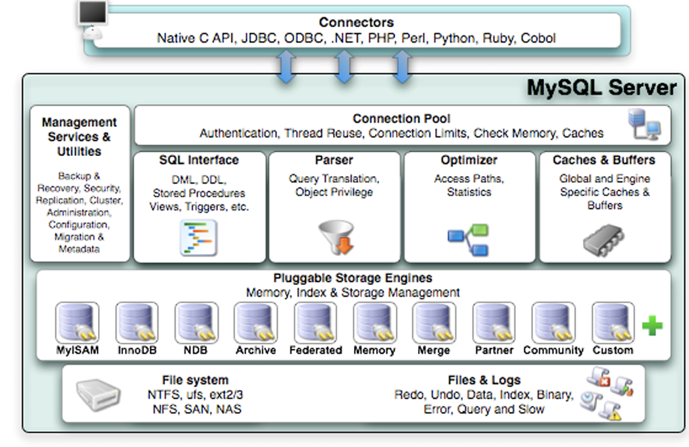
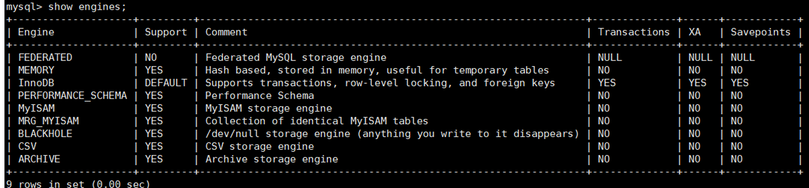
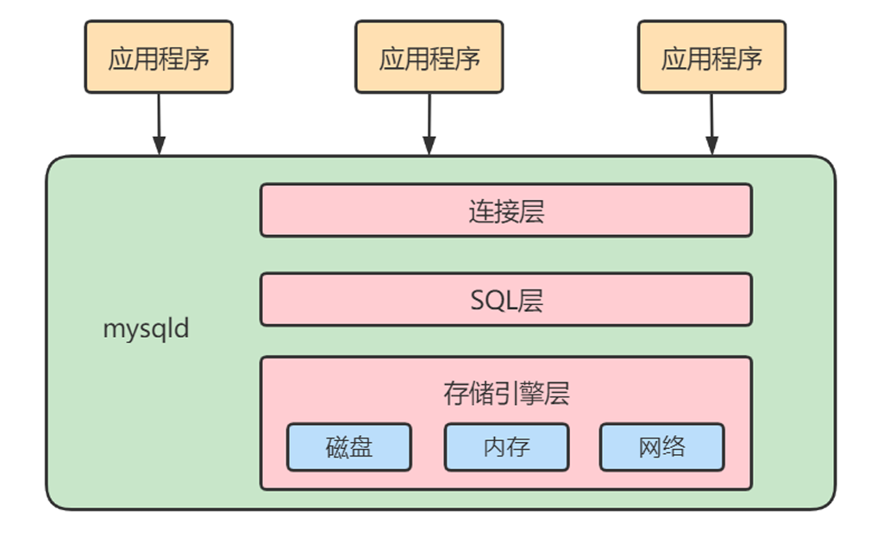
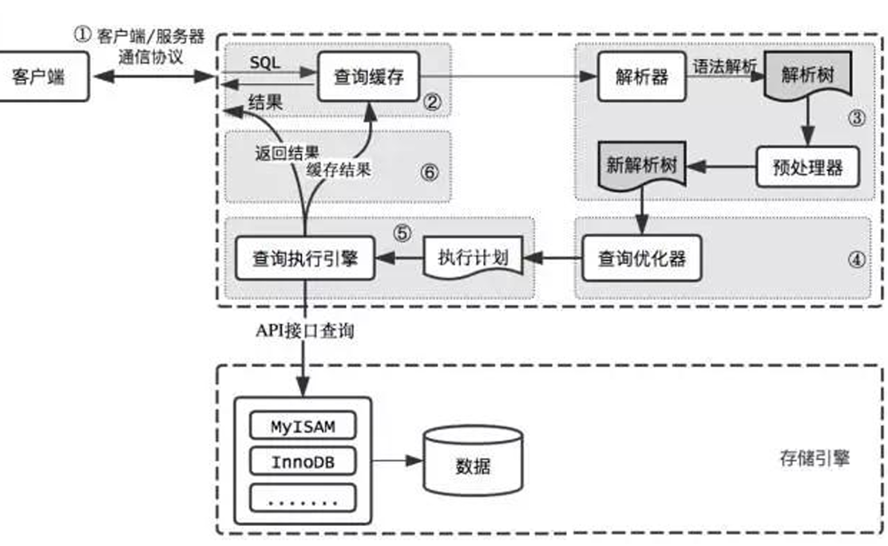
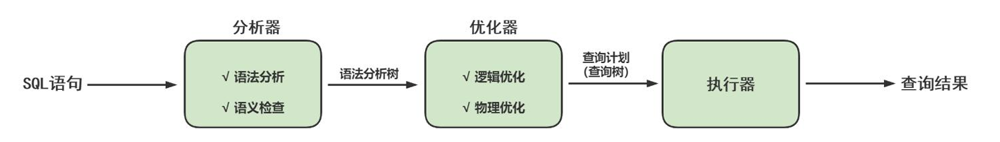

# 八、 MYSQL架构

## 8.1 逻辑架构剖析

首先 MySQL 是典型的 C/s 架构，即 client/Server 架构，服务器端程序使用的 mysqld

不论客户端进程和服务器进程是采用哪种方式进行通信，最后实现的效果都是:**客户端进程向服务器进程发送一段文本(SOL语句)段文本，服务器进程处理后在向客户端进程发送一段文本(处理结果)，**



### 8.1.1 第一层：连接层

系统（客户端）访问 MySQL 服务器前，做的第一件事就是建立`TCP 连接` ， 经过三次握手建立连接成功后， MySQL 服务器对  TCP 传输过来的账号密码做身份认证、权限获取。

- 用户名或密码不对，会收到一个`Access denied for user`错误，客户端程序结束执行
- 用户名密码认证通过，会从权限表查出账号拥有的权限与连接关联，之后的权限判断逻辑，都将依 赖于此时读到的权限

TCP 连接收到请求后，必须要分配给一个线程专门与这个客户端的交互。所以还会有个线程池，去走后 面的流程。每一个连接从线程池中获取线程，省去了创建和销毁线程的开销。

### 8.1.2 第二层：服务层

#### SQL接口

- 接收用户的SQL命令，并且返回用户需要查询的结果。比如SELECT ... FROM就是调用SQL Interface

- MySQL支持DML（数据操作语言）、DDL（数据定义语言）、存储过程、视图、触发器、自定 义函数等多种SQL语言接口

#### Parser: 解析器

- 在解析器中对 SQL 语句进行语法分析、语义分析。将SQL语句分解成数据结构，并将这个结构 传递到后续步骤，以后SQL语句的传递和处理就是基于这个结构的。如果在分解构成中遇到错 误，那么就说明这个SQL语句是不合理的
- 在SQL命令传递到解析器的时候会被解析器验证和解析，并为其创建 典丰富查询语法树，会 语法树，并根据数据字 验证该客户端是否具有执行该查询的权限。创建好语法树后，MySQL还 会对SQl查询进行语法上的优化，进行查询重写。

#### Optimizer: 查询优化器

- SQL语句在语法解析之后、查询之前会使用查询优化器确定 SQL 语句的执行路径，生成一个 `执行计划`。
- 这个执行计划表明应该 使用哪些索引进行查询（全表检索还是使用索引检索），表之间的连 接顺序如何，最后会按照执行计划中的步骤调用存储引擎提供的方法来真正的执行查询，并将 查询结果返回给用户。

#### Caches & Buffers： 查询缓存组件

- MySQL内部维持着一些Cache和Buffer，比如Query Cache用来缓存一条SELECT语句的执行结 果，如果能够在其中找到对应的查询结果，那么就不必再进行查询解析、优化和执行的整个过程了，直接将结果反馈给客户端。
- 这个缓存机制是由一系列小缓存组成的。比如表缓存，记录缓存，key缓存，权限缓存等
- 这个查询缓存可以在 不同客户端之间共享。
- 从MySQL 5.7.20开始，不推荐使用查询缓存，并在 MySQL 8.0中删除

### 8.1.3 第三层：引擎层

插件式存储引擎层（ Storage Engines），`真正的负责了MySQL中数据的存储和提取，对物理服务器级别 维护的底层数据执行操作`，服务器通过API与存储引擎进行通信。不同的存储引擎具有的功能不同

MySQL 8.0.25默认支持的存储引擎如下




### 8.1.4 第四层：存储层

所有的数据，数据库、表的定义，表的每一行的内容，索引，都是存在 文件系统上，以 文件的方式存 在的，并完成与存储引擎的交互。当然有些存储引擎比如InnoDB，也支持不使用文件系统直接管理裸设 备，但现代文件系统的实现使得这样做没有必要了。在文件系统之下，可以使用本地磁盘，可以使用 DAS、NAS、SAN等各种存储系统。

### 总结



简化为三层结构：

1. 连接层：客户端和服务器端建立连接，客户端发送 SQL 至服务器端；
2. SQL 层（服务层）：对 SQL 语句进行查询处理；与数据库文件的存储方式无关；
3. 存储引擎层：与数据库文件打交道，负责数据的存储和读取。


## 8.2 SQL执行流程




1、**查询缓存:**Server 如果在查询缓存中发现了这条 SQL 语句，就会直接将结果返回给客户端；如果没有，就进入到解析器阶段。需要说明的是，因为`查询缓存往往效率不高`，所以在 `MySQL8.0 之后就抛弃` 了这个功能

2、**解析器**： 在解析器中对 SQL 语句进行语法分析、语义分析

分析器先做“ 词法分析”。你输入的是由多个字符串和空格组成的一条 SQL 语句，MySQL 需要识别出里面 的字符串分别是什么，代表什么。 MySQL 从你输入的"select"这个关键字识别出来，这是一个查询语 句。它也要把字符串“T”识别成“表名 T”，把字符串“ID”识别成“列 ID”。

4、**优化器：**：在优化器中会确定 SQL 语句的执行路径，比如是根据 `全表检索`，还是根据`索引检索`等。

在查询优化器中，可以分为 `逻辑查询优化阶段`和 `物理查询优化阶段`。

5、**执行器** 截止到现在，还没有真正去读写真实的表，仅仅只是产出了一个执行计划。于是就进入了 执行器阶段。

在执行之前需要判断该用户是否 具备权限。如果没有，就会返回权限错误。如果具备权限，就执行 SQL 查询并返回结果。在 MySQL8.0 以下的版本，如果设置了查询缓存，这时会将查询结果进行缓存。

SQL 语句在 MySQL 中的流程是： **SQL语句→查询缓存→解析器→优化器→执行器**。




## 8.3 存储引擎

为了管理方便，人们把 `连接管理 、 査询缓存 、 语法解析、 査询优化` 这些并不涉及真实数据存储的功能划分为`MySQL server 的功能`，把`真实存取数据的功能划`分为 `存储引擎`的功能。

所以在 MySQL server 完成了查询优化后，只需按照生成的 执行计划 调用底层存储引擎提供的 API，获取到数据后返回给客户端就好了。

MySQL中提到了存储引擎的概念。简而言之，`存储引擎就是指表的类型，表以什么文件格式存储`。 其实存储引擎以前叫做`表处理器`，后来改名为 `存储引擎` ，它的功能就是接收上层传下来的指令，然后对表中的数据进行提取或写入操作。


```sql
# 查看MYSQL的存储引擎
SHOW ENGINES
# MEMORY
# MRG_MYISAM
# CSV
# FEDERATED
# PERFORMANCE_SCHEMA
# MyISAM
# InnoDB
# ndbinfo
# BLACKHOLE
# ARCHIVE
# ndbcluster

# 查看默认的存储引擎
show variables like '%storage_engine%'; 


# 临时修改存储引擎
SET DEFAULT_STORAGE_ENGINE=MyISAM;

# 永久生效，修改 my.cnf 文件：
default-storage-engine=MyISAM
 # 重启服务
systemctl restart mysqld.service
```


### 8.3.1 InnoDB引擎

- MySQL从3.23.34a开始就包含InnoDB存储引擎。 **大于等于5.5之后，默认采用InnoDB引擎**。
- InnoDB是MySQL的 **默认事务型引擎**，它被设计用来处理大量的短期(short-lived)事务。可以确保事务 的完整提交(Commit)和回滚(Rollback)。
- **除非有非常特别的原因需要使用其他的存储引擎，否则应该优先考虑InnoDB引擎**
- 数据文件结构：
    - 表名.frm 存储表结构（MySQL8.0时，合并在表名.ibd中）
    - 表名.ibd 存储数据和索引
- InnoDB是 为处理巨大数据量的最大性能设计。
- 对比MyISAM的存储引擎， InnoDB写的处理效率差一些，并且会占用更多的磁盘空间以保存数据和 索引。
- MyISAM只缓存索引，不缓存真实数据；InnoDB不仅缓存索引还要缓存真实数据，因此占用内存 高，而且内存大小对性能有决定性的影响。


### 8.3.2 MyISAM引擎

- MyISAM提供了大量的特性，包括全文索引、压缩、空间函数(GIS)等，但`MyISAM不支持事务、行级锁、外键`，有一个毫无疑问的缺陷就是`崩溃后无法安全恢复`。
- 优势是访问的`速度快`，对事务完整性没有要求或者以SELECT、INSERT为主的应用
    - 这是因为 MyISAM**不需要维护额外的事务日志和事务控制**
    - 数据和索引存储在不同的文件中，这可以使 MyISAM 更容易进行快速的全表扫描
- 针对数据统计有额外的常数存储。故而 count(*) 的查询效率很高
- 数据文件结构：
    - 表名.frm 存储表结构
    - 表名.MYD 存储数据 (MYData)
    - 表名.MYI 存储索引 (MYIndex)
- 应用场景：只读应用或者以读为主的业务


# 
