# 九、 索引

## 9.1 为什么要使用索引

索引是存储引擎用于`快速找到数据记录的一种数据结构`，就好比一本教课书的目录部分，通过目录中找到对应文章的页码，便可快速定位到需要的文章。MySQL中也是一样的道理，进行数据查找时，首先查看查询条件是否命中某条索引，符合则 `通过索引査找` 相关数据，如果不符合则需要` 全表扫描` ，即需要一条一条地查找记录，直到找到与条件符合的记录。

> 使用索引的目的就是为了减少磁盘IO的次数，加快查询效率


## 9.2 索引的特点及优缺点

MySQL官方对索引的定义为：**索引（Index）是帮助MySQL高效获取数据的数据结构**。


**索引的本质**：索引是数据结构。你可以简单理解为“`排好序的快速查找数据结构`”，满足特定查找算法。 这些数据结构以某种方式指向数据， 这样就可以在这些数据结构的基础上实现 高级查找算法。


**索引是在存储引擎中实现的 ，因此每种存储引擎的索引不一定完全相同**，并且每种存储引擎不一定支持所有索引类型。同时，存储引擎可以定义每个表的 最大索引数 和最大索引长度。所有存储引擎支持每个表至少16个索引，总索引长度至少为256字节。有些存储引擎支持更多的索引数和更大的索引长度。

**优点**

（1）类似大学图书馆建书目索引，提高数据检索的效率，`降低 数据库的IO成本`，这也是创建索引最主 要的原因。
（2）通过创建唯一索引，可以保证数据库表中每一行 `数据的唯一性`。

（3）在实现数据的 参考完整性方面，可以 加速表和表之间的连接。换句话说，对于有依赖关系的子表和父表联合查询时， 可以`提高查询速度`。

（4）在使用分组和排序子句进行数据查询时，可以显著 减少查询中分组和排序的时间，`降低了CPU的消耗`。


**缺点**

（1）创建索引和维护索引要 `耗费时间` 且随着数据量的增加，所耗费的时间也会增加。

（2）索引需要`占 磁盘空间`，除了数据表占数据空间之 外，每一个索引还要占一定的物理空间， 存储在磁盘上，如果有大量的索引，索引文件就可能比数据文 件更快达到最大文件尺寸。

（3）虽然索引大大提高了查询速度，同时却会 `降低更新表的速度`。当对表 中的数据进行增加、删除和修改的时候，索引也要动态地维护，这样就降低了数据的维护速度。


## 9.3 一个简单索引的设计方案

创建一个表

```sql
mysql> CREATE TABLE index_demo(
c1 INT,
c2 INT,
 c3 CHAR(1),
 PRIMARY KEY(c1)) ROW_FORMAT = Compact;
```

这个新建的 `index_demo `表中有2个INT类型的列，1个CHAR(1)类型的列，而且我们规定了c1列为主键， 这个表使用 `Compact `行格式来实际存储记录的。这里我们简化了index_demo表的行格式示意图：

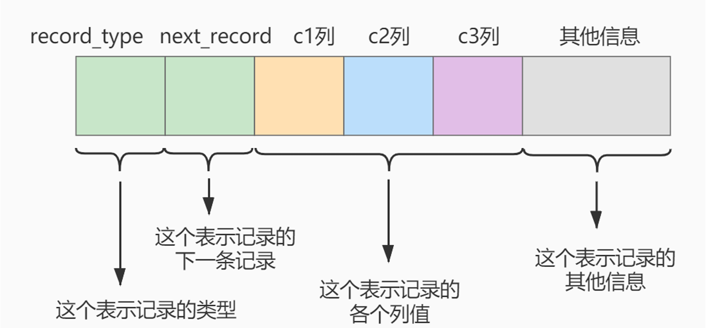

**record_type** ：记录头信息的一项属性，表示记录的类型，`0表示普通记录、1表示目录项记录、2表示最小记 录、3表示最大记录`

**next_record** ：记录头信息的一项属性，表示下一条地址相对于本条记录的地址偏移量，我们用 箭头来表明下一条记录是谁

**各个列的值**：这里只记录在 index_demo 表中的三个列，分别是 c1 、c2和c3。

**其他信息**：除了上述3种信息以外的所有信息，包括其他隐藏列的值以及记录的额外信息

**把一些记录放到页里示意图如下**：

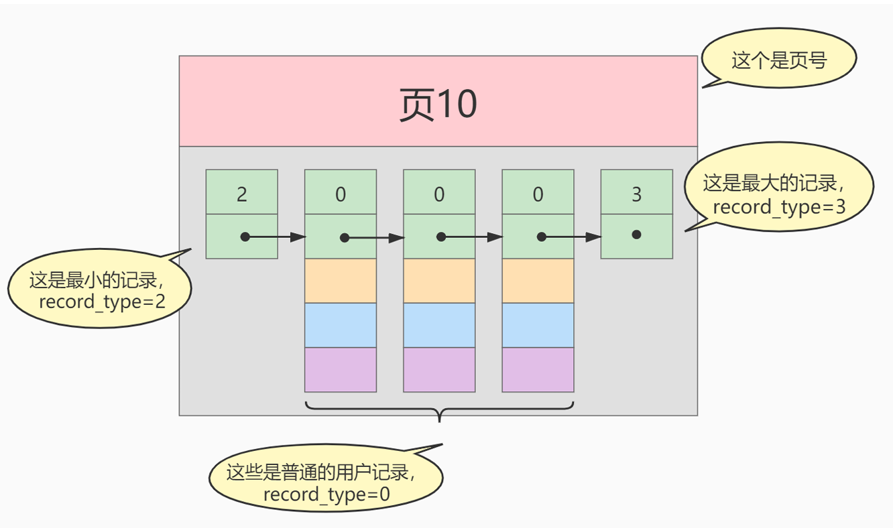


我们在根据某个搜索条件查找一些记录时为什么要遍历所有的数据页呢？因为各个页中的记录并`没有规律`，我们并不知道我们的搜索条件匹配哪些页中的记录，所以不得不依次遍历所有的数据页。

所以如果 我们 `想快速的定位到需要查找的记录在哪些数据页`中该咋办？我们可以为快速定位记录所在的数据页而 建 立一个目录，建这个目录必须完成下边这些事

- 下一个数据页中用户记录的主键值必须大于上一个页中用户记录的主键值。 （主键值是依次递增的）

- 给所有的页建立一个目录项。

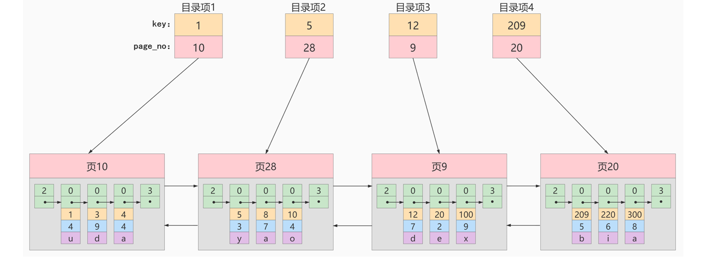


至此，针对数据页做的简易目录就搞定了。这个目录有一个别名，称为 `索引`


## 9.4 InnoDB中的索引方案

### 9.4.1 目录项记录的页

上图中，每个目录项并没有关联起来，若是新增一个目录项或者删除一个目录项，想要重新维护是非常麻烦的。

因此我们可以将`多个目录项放到一个页中`，并使用 类似 `链表` 的形式关联起来。如下图所示：

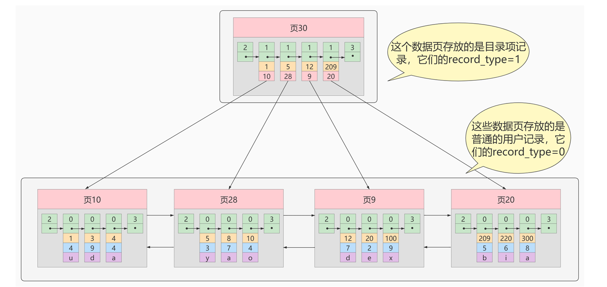

从图中可以看出来，我们新分配了一个编号为30的页来专门`存储目录项记录`。这里再次强调 和普通的 用户记录的**不同点**：

- 目录项记录的 record_type 值是1，而普通用户记录的 record_type 值是0。
- 目录项记录只有`主键值和页的编号`两个列，而普通的用户记录的列是用户自己定义的，可能包含 `很多列`，另外还有InnoDB自己添加的隐藏列。

**相同点:**

两者用的是一样的`数据页`，都会为主键值生成 Page Directory （页目录），从而在按照主键 值进行查找时可以使用 `二分法来加快查询速度`。

### 9.4.2 多个目录项记录的页

虽然说 目录项记录 中只存储主键值和对应的页号，比用户记录需要的存储空间小多了，但是不论怎么说一个页只有 `16KB `大小，能存放的 目录项记录 也是有限的，那如果表中的数据太多，以至于一个数据页不足以存放所有的目录项记录，因此就需要在`增加一个目录页`

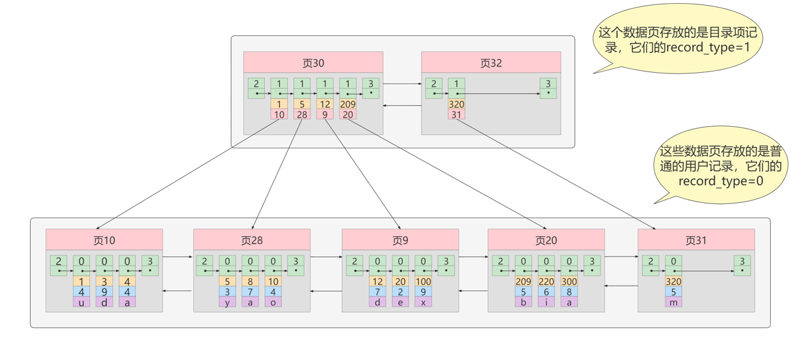


### 9.4.3 目录项记录页得目录页

当目录页较多时，可以为目录页在抽取出一个目录页

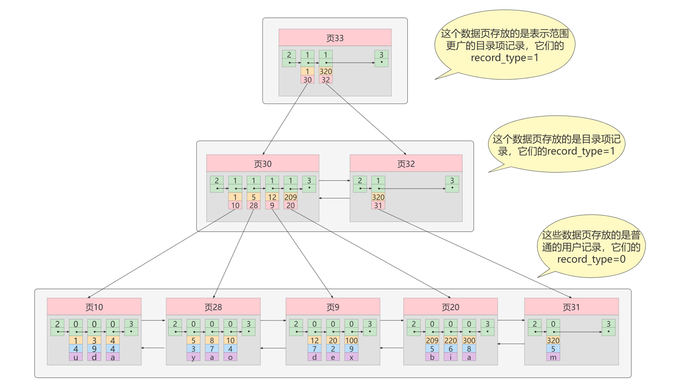


### 9.4.4 B+Tree

上面的图其实就是 B+Tree的数据结构，简化为：

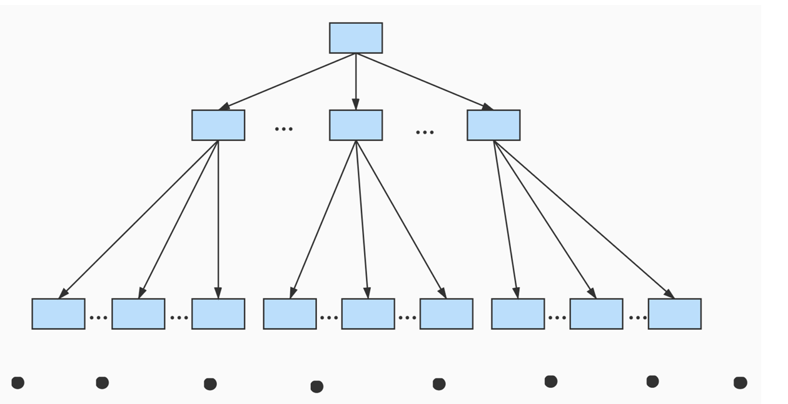

不论是存放`用户记录` 的数据页，还是存放 `目录项记录` 的数据页，我们都把它们存放到B+树这个数据结构中了，所以我们也称这些数据页为`节点`。

从图中可以看出，我们的`实际用户记录其实都存放在B+树的最底层的节点上`，这些节点也被称为 `叶子节点`，其余用来存放 目录项 的节点称为 非叶子节点 或者 内节点，其中B+树最上边的那个节点也称为 `根节点`。

**树的高度越低，IO次数就越少**，`一般B+树的高度不会超过4层！！！`

假设所有存放用户记录的叶子节点代表的数据页可以存放`100条用户记录`，所有存放目录项记录的内节点代表的数据页可以存放`1000条目录项记录`，那么:

- 如果B+树只有1层，也就是只有1个用于存放用户记录的节点，最多能存放`100条记录`。
- 如果B+树有2层，最多能存放`1000x100=10,0000条记录`。
- 如果B+树有3层，最多能存放`1000x1000x100=1,0000,0000条记录`
- 如果B+树有4层，最多能存放`1000x1800x1000x100=1000,0000,0000条记录`


## 9.5 常见索引概念

索引按照物理实现方式，索引可以分为 2 种：`聚簇（聚集）`和`非聚簇（非聚集）索引`。我们也把非聚集 索引称为二级索引或者辅助索引。

### 9.5.1 聚簇索引

聚簇索引并`不是一种单独的索引类型`，而是一种`数据存储方式`(所有的用户记录都存储在了叶子节点)，也就是
所谓的 **索引即数据，数据即索引(索引的叶子节点包含实际的数据行，而不是指向数据行的指针)**。

**特点**

1. 使用记录主键值的大小进行记录和页的排序，这包括三个方面的含义：
    - 普通用户记录 按照主键的大小 排成一个`单向链表`
    - 各个存放 用户记录的页也是根据页中用户记录的主键大小顺序排成一个 `双向链表。`
    - 存放 目录项记录的页分为不同的层次，在同一层次中的页也是根据页中目录项记录的主键 大小顺序排成一个 `双向链表`。
2. B+树的 叶子节点存储的是完整的用户记录。
    - 所谓完整的用户记录，就是指这个记录中存储了`所有列的值（包括隐藏列）`。


**优点**

- 数据访问更快，因为`聚簇索引将索引和数据保存在同一个B+树中`，因此从聚簇索引中获取数据比非 聚簇索引更快
- 聚簇索引对于主键的 `排序查找`和 `范围查找`速度非常快
- 按照聚簇索引排列顺序，查询显示一定范围数据的时候，由于数据都是紧密相连，数据库不用从多 个数据块中提取数据，所以 `节省了大量的IO操作`。

**缺点**

- `插入速度严重依赖于插入顺序`，按照主键的顺序插入是最快的方式，否则将会出现`页分裂`，严重影 响性能。因此，对于InnoDB表，我们一般都会定义一个自增的ID列为主键
- `更新主键的代价很高`，因为将会导致被更新的行移动。因此，对于InnoDB表，我们一般定义主键为 不可更新
- 二级索引访问需要两次索引查找，第一次找到主键值，第二次根据主键值找到行数据


**限制**

- 对于MySQL数据库目前只有`InnoDB数据引擎支持聚簇索引，而MyISAM并不支持聚簇索引`。
- 由于数据物理存储排序方式只能有一种，所以每个MySQL的 表`只能有一个聚簇索引`。一般情况下就是该表的`主键`。
- 如果没有定义主键，Innodb会选择 `非空的唯一索引`代替。如果没有这样的索引，Innodb会`隐式的定义一个主键来作为聚簇索引`。

为了充分利用聚簇索引的聚簇的特性，所以innodb表的主键列尽量 `选用有序的顺序id `，而不建议用无序的id,
比如UUID、MD5、HASH、字符串列作为主键无法保证数据的顺序增长。


### 9.5.2 二级索引（辅助索引、非聚簇索引）

二级索引就是除主键列之外的列创建的索引。假设以C2列作为二级索引，那么就需要以C2在创建一颗B+树：

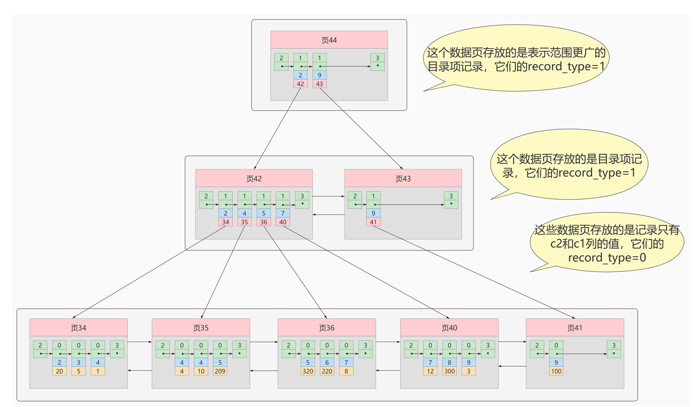


假设我们要执行这样一条SQL 语句：

```java
select * from xxx where c2 = ?
```

首先通过C2的值定位到 `叶子节点`, 由于我们想要查询 所有列的值，包括C1、C2、C3, 而二级索引中只包含 C2 和 C1 的值，所以还需要拿着C1再去聚簇索引中查找。因此需要查询俩次B+树，这种情况就叫做 `回表`

> **回表** 我们根据这个以c2列大小排序的B+树只能确定我们要查找记录的主键值，所以如果我们想根 据c2列的值查找到完整的用户记录的话，仍然需要到 聚簇索引中再查一遍，这个过程称为 回表。也就 是根据c2列的值查询一条完整的用户记录需要使用到2棵B+树！


**那么，为什么不将完整的用户记录都放到叶子节点中呢？**

如果将完整的用户记录都放到叶子结点中，确实不用回表，但是没创建一颗 B+树都要拷贝一份用户完整的记录，`太浪费空间`！


### 9.5.3 联合索引

联合索引其实就是非聚簇索引的一种。

同时以`多个列的大小作为排序规则，也就是同时为多个列建立索引`，比方说我们想让B+树按 照c2 和c3列 的大小进行排序，这个包含两层含义

- 先把各个记录和页按照c2列进行排序。

- 在记录的c2列相同的情况下，采用c3列进行排序


## 9.6 MyISAM索中的索引方案


即使多个存储引擎支持同一种类型的索引，但是他们的实现原理也是不同的。Innodb和MyISAM默认的索 引是Btree索引；而Memory默认的索引是Hash索引。(这里的B-Tree 其实就是B+ Tree)

MyISAM引擎使用` B+Tree 作为索引结构`，叶子节点的data域存放的是 `数据记录的地址`。

### 9.6.1 MyISAM索引原理

我们知道 `InnoDB中索引即数据`，也就是聚簇索引的那棵B+树的叶子节点中已经把所有完整的用户记录都包含了而 MyISAM 的索引方案虽然也使用树形结构，但是却 `将索引和数据分开存储`:

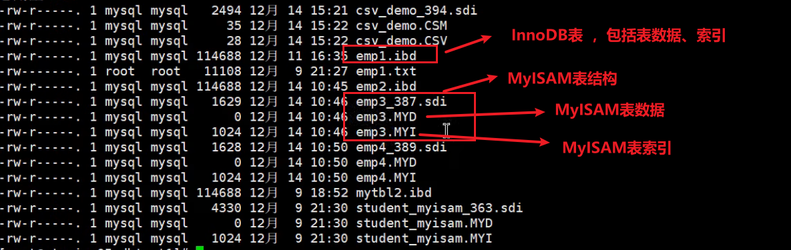

- 将表中的记录 按照记录的插入顺序 单独存储在一个文件中，称之为 `数据文件（MYD文件）`。这个文件并不划分为若干个数据页，有多少记录就往这个文件中塞多少记录就成了。由于在插入数据的时候并 `没有刻意按照主键大小排序`，所以我们并不能在这些数据上使用二分法进行查找。
- 使用 MYISAM 存储引擎的表会把索引信息另外存储到一个称为 `索引文件(MYI文件)` 的另一个文件中。 MYISAM 会单独为表的主键创建一个索引，只不过在索引的叶子节点中存储的`不是完整的用户记录`，而是 `主键值 + 数据记录地址` 的组合。

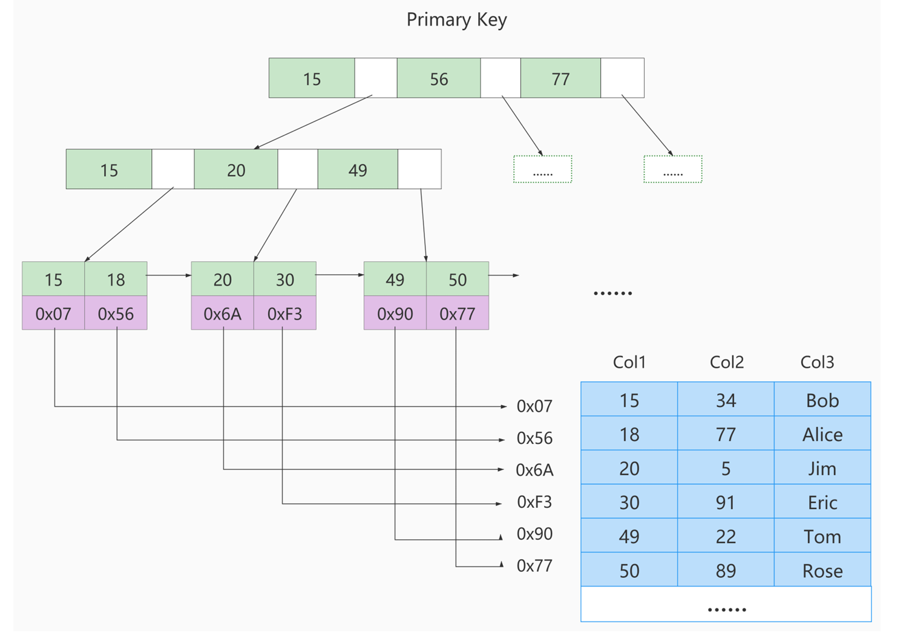

## 9.7 InnoDB引擎与MyISAM引擎对比

- InnoDB支持事物，而MyISAM不支持事物
- InnoDB支持MVCC, 而MyISAM不支持
- InnoDB支持外键，而MyISAM不支持
- InnoDB不支持全文索引，而MyISAM支持。
- InnoDB的索引方式为 "聚簇索引",表数据和索引都保存到一个表中,  而MyISAM是非聚簇索引！表数据和索引保存在俩个文件中！
- InnoDB支持行级锁，而MyISAM支持表级锁,因此在高并发的场景下建议使用 InnoDB，MyISAM适合适合用于非事务场景下，比如以读为主或者只读的应用！
- 对比MyISAM的存储引擎， InnoDB写的处理效率差一些，并且会占用更多的磁盘空间以保存数据和 索引。
- MyISAM只缓存索引，不缓存真实数据；InnoDB不仅缓存索引还要缓存真实数据， 占用内存高，而且内存大小对性能有决定性的影响

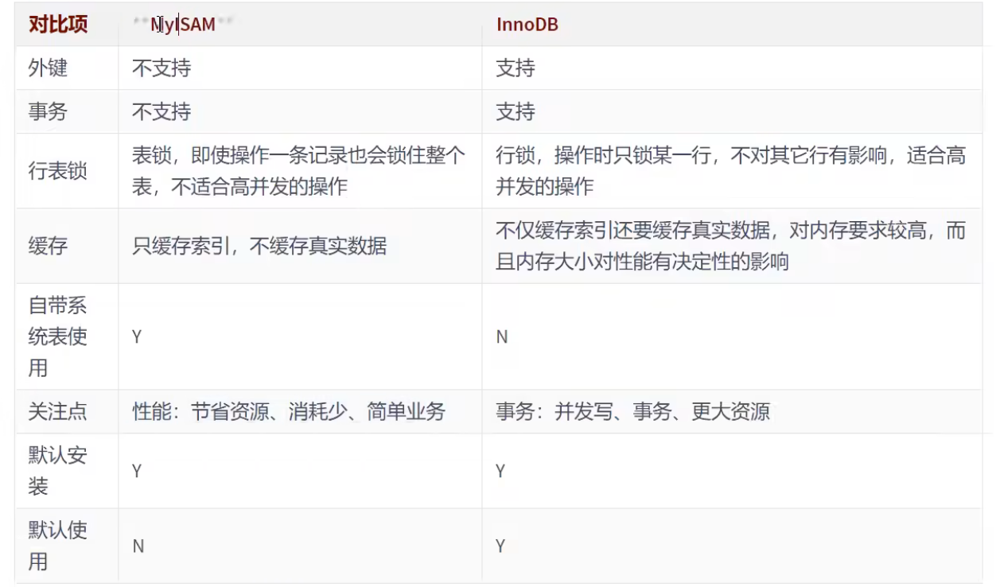

## 9.8 索引的代价

**空间上的代价**

每建立一个索引都要为它建立一棵B+树，每一棵B+树的每一个节点都是一个数据页，一个页默认会 占用16KB的存储空间，一棵很大的B+树由许多数据页组成，那就是很大的一片存储空间。

**时间上的代价**

每次对表中的数据进行 增、删、改操作时，都需要去修改各个B+树索引。

B+树每 层节点都是按照索引列的值 从小到大的顺序排序而组成了 双向链表。。而增、删、改操作可能会对节点和记录的排序造成破坏，所以存储引擎需 要额外的时间进行一些 `记录移位， 页面分裂、 页面回收`等操作来维护好节点和记录的排序。


## 9.9 MySQL数据结构选择的合理性

从MYSOL的角度讲，不得不考虑一个现实问题就是磁盘 IO。如果我们能让索引的数据结构尽量减少硬盘的 IO 操作，所消耗的时间也就越小。可以说，`磁盘的I/0 操作次数 对索引的使用效率至关重要`。

### (1) HASH结构

Hash 本身是一个函数，又被称为散列函数，它可以帮助我们`大幅提升检索数据的效率`。

Hash 算法是通过某种确定性的算法(比如 MD5、SHA1、SHA2、SHA3)将输入转变为输出。 `相同的输入永远可以得到相同的输出`，假设输入内容有微小偏差，在输出中通常会有不同的结果。

**加速查找速度的数据结构，常见的有两类**

(1)树，Java例如平衡二叉搜索树，查询/插入/修改/删除的平均时间复杂度都是0(1og2N);

(2)哈希，例如HashMap，查询/插入/修改/删除的平均时间复杂度都是0(1);

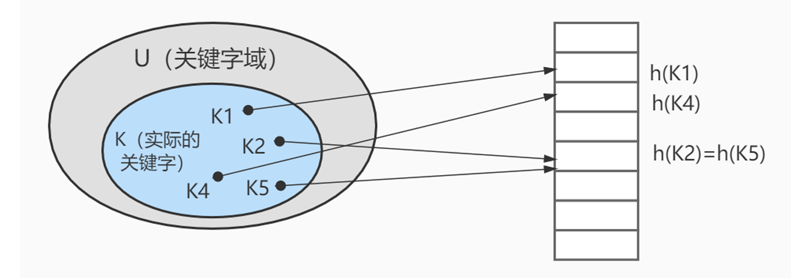

上图中哈希函数h有可能将两个不同的关键字映射到相同的位置，这叫做 碰撞，在数据库中一般采用` 拉链法`来解决。在拉链法中，将散列到同一槽位的元素放在一个链表中，如下图所示：

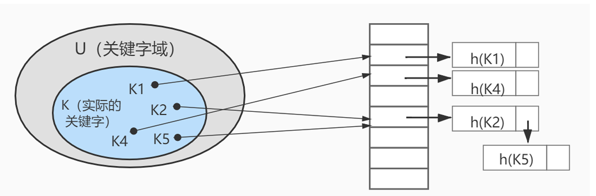


**Hash结构效率高，那为什么索引结构要设计成树型呢？**

**原因1**: Hash 索引仅能满足(=)(<>)和 IN 查询。如果进行范围査询 ，哈希型的索引，时间复杂度会退化为0(n);而树型的“有序”特性，依然能够保持0(log2N) 的高效率。

**原因2**:Hash 索引还有一个缺陷，数据的存储是没有顺序的，在 ORDER BY 的情况下，使用 Hash 索引还需要对数据重新排序。

**原因3**:对于联合索引的情况，Hash 值是将联合索引键合并后一起来计算的，无法对单独的一个键或者几个索引键进行查询。

**原因4**:对于等值查询来说，通常 Hash 索引的效率更高，不过也存在一种情况，就是`索引列的重复值如果很多，效率就会降低` 。这是因为遇到 Hash 冲突时，需要遍历桶中的行指针来进行比较，找到查询的关键字，非常耗时。所以，Hash 索引通常不会用到重复值多的列上，比如列为性别、年龄的情况等。

**Hash索引使用存储引擎**


### (2) 二叉搜索树

一个节点只能有两个子节点，也就是一个节点度不能超过2

左子节点<本节点;右子节点>=本节点，比我大的向右，比我小的向左


但是存在特殊的情况，就是有时候二叉树的深度非常大。比如我们给出的数据顺序是(5,22,23,34,77,89,91)，创

造出来的二分搜索树如下图所示:

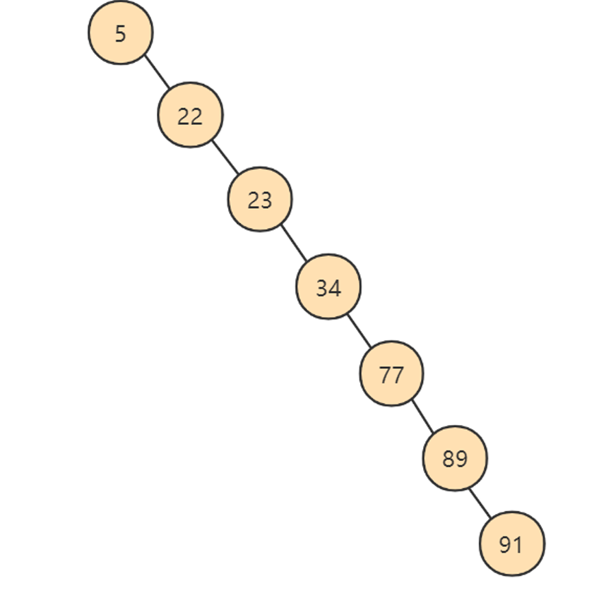

### (3) AVL

为了解决上面二叉查找树退化成链表的问题，人们提出了`平衡二叉搜索树(Balanced Binary Tree)`，又称为AVL树(有别于AVL算法)，它在二叉搜索树的基础上增加了约束，具有以下性质:

**它是一棵空树或它的左右两个子树的高度差的绝对值不超过1，并且左右两个子树都是一棵平衡二叉树。**

这里说一下，常见的平衡二叉树有很多种，包括了 `平衡二叉搜索树、 红黑树 、 数堆 、 伸展树`。平衡二叉搜索树是最早提出来的自平衡二叉搜索树，当我们提到平衡二叉树时一般指的就是平衡二叉搜索树。事实上，第一棵树就属于平衡二叉搜索树，搜索时间复杂度就是O(log2n)。

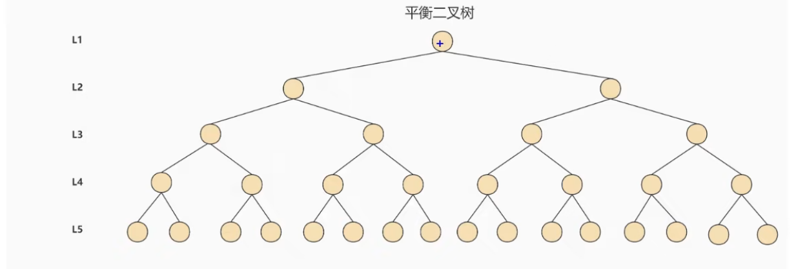

**每访问一次节点就需要进行一次磁盘 I/0 操作**，对于上面的树来说，我们需要进行5次 I0 操作。虽然平衡二叉树的效率高，但是树的深度也同样高，这就意味着磁盘 IO 操作次数多，会影响整体数据査询的效率。

针对同样的数据，如果我们把二叉树改成  M 叉树（M>2）呢？当 M=3 时，同样的 31 个节点可以由下面 的三叉树来进行存储

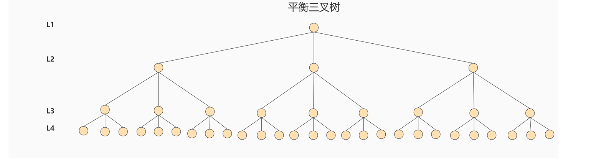


### (4) B-Tree

8 树的英文是 Balance Tree，也就是 `多路平衡査找树`。简写为B-Tree (注意横杠表示这两个单词连起来的意思，不是减号)。它的高度远小于平衡二又树的高度。

B 树的结构如下图所示：

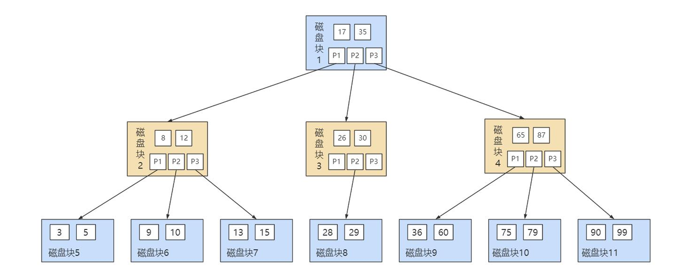

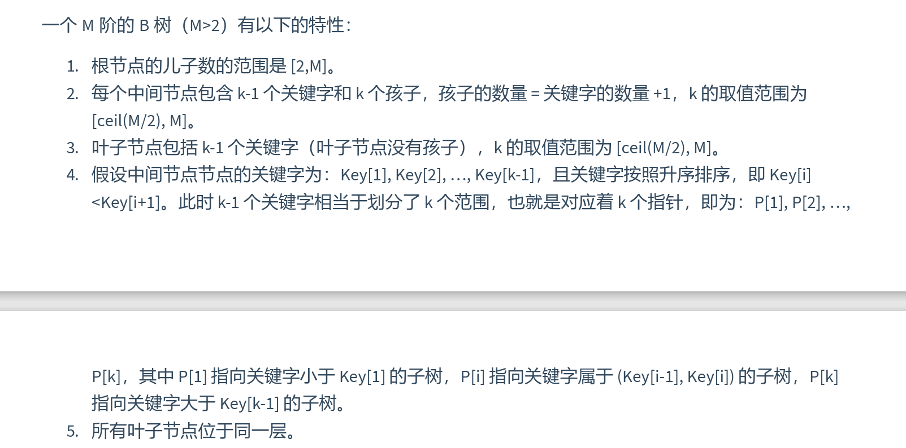


### (5) B+ Tree

**B+ Tree 和 B-Tree 的差异**


**B+ 树的中间结点不存储数据，这样有什么好处呢？**

1、B+树的`查询效率更加稳定`，因为数据都存储在叶子结点上，而B树的中间节点也有可能存储数据，这就导致可能放到叶子结点获取结果，也可能访问非叶子结点得到结果

2、B+树的`查询效率更高`，这是因为B+树的中间结点不存储数据，因此同样的磁盘页大小，B+存储的数据就更多，树的高度就会越矮，需要的IO操作就越少！

3、不仅是对单个关键字的查询上，`在范围查询上，B+树的效率也比B树高`，这是因为所有关键字都存储在叶子结点中，叶子结点之间有指针相互关联，数据又是递增的，因此范围查找可以通过指针连接查找


