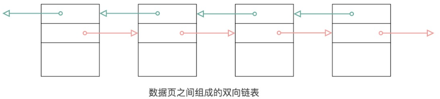

# 十、 InnoDB数据存储结构

## 10.1 磁盘与内存交互的基本单位: 页

InnoDB 将数据划分为若干个页，InnoDB中页的大小默认为 `16KB`

以` 页` 作为磁盘和内存之间交豆的 `基本单位`，也就是一次最少从磁盘中读取16KB的内容到内存中，一次最少把内存中的16KB内容刷新到磁盘中。也就是说，**在数据库中，不论读一行，还是读多行，都是将这些行所在的页进行加载。也就是说，数据库管理存储空间的基本单位是页(Page)，数据库 I/0 操作的最小单位是页**。一个页中可以存储多个行记录，


## 10.2 数据页的内部结构

页如果按类型划分的话，常见的有`数据页(保存 B+ 树节点)系统页、 Undo 页和 事务数据页 `等。数据页是我们最常使用的页。

数据页的 16KB大小的存储空间被划分为七个部分**，分别是文件头(File Header)、页头(Page Header)、最大页目录(Page最小记录(Infimum+supremum)、用户记录(User Records)、空闲空间(Free Space)、Directory)和文件尾(File Tailer)**。
页结构的示意图如下所示:


### 10.2.1 **文件头**

描述各种页的通用信息。（比如页的编号、其上一页、下一页是谁等）

**文件头内部组成**：


**FIL_PAGE_OFFSET（4字节）**

每一个页都有一个单独的页号，就跟你的身份证号码一样，InnoDB通过页号可以`唯一`定位一个页。

**FIL_PAGE_TYPE（2字节）**

这个代表当前页的类型。


**FIL_PAGE_PREV（4字节）和FIL_PAGE_NEXT（4字节）**

InnoDB都是以页为单位存放数据的，如果数据分散到多个不连续的页中存储的话需要把这些页关联起来，FIL_PAGE_PREV和FIL_PAGE_NEXT就分别代表本页的上一个和下一个页的页号。这样`通过建立一个双向链表把许许多多的页就都串联起来了，保证这些页之间不需要是物理上的连续，而是逻辑上的连续`。



**FIL_PAGE_SPACE_OR_CHKSUM（4字节）**

代表当前页面的校验和（checksum）。

**什么是校验和？**
就是对于一个很长的字节串来说，我们会通过某种算法来计算一个比较短的值来代表这个很长的字节串，这个比较短的值就称为校验和。

在比较两个很长的字节串之前，先比较这两个长字节串的校验和，如果校验和都不一样，则两个长字节串肯定是不同的，所以省去了直接比较两个比较长的字节串的时间损耗。

**文件头部和文件尾部都有属性：FIL_PAGE_SPACE_OR_CHKSUM**

**作用**
InnoDB存储引擎以页为单位把数据加载到内存中处理，如果该页中的数据在内存中被修改了，那么在修改后的某个时间需要把数据同步到磁盘中。但是在同步了一半的时候断电了，造成了该页传输的不完整。

为了检测一个页是否完整（也就是在同步的时候有没有发生只同步一半的尴尬情况），这时可以`通过文件尾的校验和（checksum 值）与文件头的校验和做比对`，如果两个值不相等则证明页的传输有问题，需要重新进行传输，否则认为页的传输已经完成。

**FIL_PAGE_LSN（8字节）**

页面被最后修改时对应的日志序列位置（英文名是：Log Sequence Number）

### 10.2.2 文件尾

- 前4个字节代表页的校验和：
    - 这个部分是和File Header中的校验和相对应的。

- 后4个字节代表页面被最后修改时对应的日志序列位置（LSN）：
    - 这个部分也是为了校验页的完整性的，如果首部和尾部的LSN值校验不成功的话，就说明同步过程出现了问题。


### 10.2.3 Free Space (空闲空间)

我们自己存储的记录会按照指定的**行格式**存储到 User Records 部分。但是在一开始生成页的时候，其实并没有User Records这个部分，**每当我们插入一条记录，都会从Free Space部分，也就是尚未使用的存储空间中申请一个记录大小的空间划分到User Records部分**，当Free Space部分的空间全部被User Records部分替代掉之后，也就意味着这个页使用完了，如果还有新的记录插入的话，就需要去申请新的页了。


### 10.2.4 User Records (用户记录)

User Records中的这些记录按照**指定的行格式**一条一条摆在User Records部分，相互之间形成单链表。

**用户记录里的一条条数据如何记录？**详情看COMPACT行格式中的记录头信息


### 10.2.5 Infimum + Supremum（最小最大记录）

记录可以比大小，对于一条完整的记录来说，比较记录的大小就是`比较主键的大小`。比方说我们插入的4行记录的主键值分别是：1、2、3、4，这也就意味着这4条记录是从小到大依次递增。

InnoDB规定的最小记录与最大记录这两条记录的构造十分简单，都是由5字节大小的记录头信息和8字节大小的一个固定的部分组成的，如图所示


### 10.2.6 Page Directory（页目录）

为什么需要页目录？

在页中，记录是以`单向链表`的形式进行存储的。单向链表的特点就是`插入、删除非常方便，但是检索效率不高`，最差的情况下需要遍历链表上的所有节点才能完成检索。因此在页结构中专门设计了页目录这个模块，专门给记录做一个目录，通过二分查找法的方式进行检索，提升效率。


### 10.2.7 Page Header（页面头部）

为了能得到一个数据页中存储的记录的状态信息，比如本页中已经存储了多少条记录，第一条记录的地址是什么，页目录中存储了多少个槽等等，特意在页中定义了一个叫Page Header的部分，这个部分占用固定的56个字节，专门存储各种状态信息。


## 10.3 InnoDB 行格式

我们平时的数据以行为单位来向表中插入数据，这些记录在磁盘上的存放方式也被称为`行格式`或者`记录格式`。InnoDB存储引擎设计了4种不同类型的`行格式`，分别是`Compact`、`Redundant`、`Dynamic`和`Compressed`行格式。

```sql
SELECT @@innodb_default_row_format;
```


### 10.3.1 指定行格式的语法

```sql
-- 创建表格时指定
CREATE TABLE 表名 (


) ROW_FORMAT=行格式名称;
-- 创建表格后指定
ALTER TABLE 表名 ROW_FORMAT=行格式名称

-- 举例
 CREATE TABLE record_test_table (
     col1 VARCHAR(8),
     col2 VARCHAR(8) NOT NULL,
     col3 CHAR(8),
     col4 VARCHAR(8)
 ) CHARSET=ascii ROW_FORMAT=COMPACT;
 
INSERT INTO record_test_table(col1, col2, col3, col4) 
VALUES ('zhangsan', 'lisi', 'wangwu', 'songhk'), ('tong', 'chen', NULL, NULL);
```


### 10.3.1 COMPACT行格式

在MySQL 5.1版本中，默认设置为Compact行格式。一条完整的记录其实可以被分为`记录的额外信息`和`记录的真实数据`两大部分。


#### 变长字段长度列表

MySQL支持一些变长的数据类型，比如VARCHAR(M)、VARBINARY(M)、TEXT类型，BLOB类型，这些数据类型修饰列称为变长字段，变长字段中存储多少字节的数据不是固定的，所以我们在存储真实数据的时候需要顺便把这些数据占用的字节数也存起来。**在Compact行格式中，把所有变长字段的真实数据占用的字节长度都存放在记录的开头部位，从而形成一个变长字段长度列表**。


#### NULL值列表

Compact行格式会把可以为NULL的列统一管理起来，存在一个标记为NULL值列表中。**如果表中没有允许存储 NULL 的列，则 NULL值列表也不存在了**。

#### 记录头像信息


**记录头信息中各个属性如下**：


**简化后的行格式示意图**：


```sql
插入数据：
INSERT INTO page_demo 
VALUES
(1, 100, 'song'), 
(2, 200, 'tong'), 
(3, 300, 'zhan'), 
(4, 400, 'lisi');
```

**示意图如下：**


**delete_mask**

这个属性标记着当前记录是否被删除，占用1个二进制位。

- 值为0：代表记录并没有被删除
- 值为1：代表记录被删除掉了

**min_rec_mask**

B+树的每层非叶子节点中的最小记录都会添加该标记，min_rec_mask值为1。
我们自己插入的四条记录的min_rec_mask值都是0，意味着它们都不是B+树的非叶子节点中的最小记录。

**record_type**

这个属性表示当前记录的类型，一共有4种类型的记录：
0：表示普通记录
1：表示B+树非叶节点记录
2：表示最小记录
3：表示最大记录

从图中我们也可以看出来，我们自己插入的记录就是普通记录，它们的record_type值都是0，而最小记录和最大记录的record_type值分别为2和3。至于record_type为1的情况，我们在索引的数据结构章节讲过。

**heap_no**

这个属性表示当前记录在本页中的位置。

从图中可以看出来，我们插入的4条记录在本页中的位置分别是：2、3、4、5。

**怎么不见heap_no值为0和1的记录呢？**

MySQL会自动给每个页里加了两个记录，由于这两个记录并不是我们自己插入的，所以有时候也称为`伪记录或者虚拟记录`。这两个伪记录一个代表`最小记录`，一个代表`最大记录`。最小记录和最大记录的heap_no值分别是0和1，也就是说它们的位置最靠前。

**n_owned**

页目录中每个组中最后一条记录的头信息中会存储该组一共有多少条记录，作为 n_owned 字段。

**next_record**

记录头信息里该属性非常重要，它表示从当前记录的真实数据到`下一条记录的真实数据的地址偏移量`。
比如：第一条记录的next_record值为32，意味着从第一条记录的真实数据的地址处向后找32个字节便是下一条记录的真实数据。

#### 记录的真实数据

记录的真实数据除了我们自己定义的列的数据以外，还会有三个隐藏列：


实际上这几个列的真正名称其实是：`DB_ROW_ID、DB_TRX_ID、DB_ROLL_PTR`。

- 一个表没有手动定义主键，则会选取一个Unique键作为主键，如果连Unique键都没有定义的话，则会为表默认添加一个名为row_id的隐藏列作为主键。所以row_id是在没有自定义主键以及Unique键的情况下才会存在的。

- 事务ID和回滚指针在后面的《第14章_MySQL事务日志》章节中讲解。

# 
