# 十二、性能分析工具的使用

## 12.1 数据库服务器的优化步骤

当我们遇到数据库调优问题的时候，该如何思考呢？这里把思考的流程整理成下面这张图。

整个流程划分成了 `观察（Show status）` 和 `行动（Action）` 两个部分。字母 S 的部分代表观察（会使 用相应的分析工具），字母 A 代表的部分是行动（对应分析可以采取的行动）。

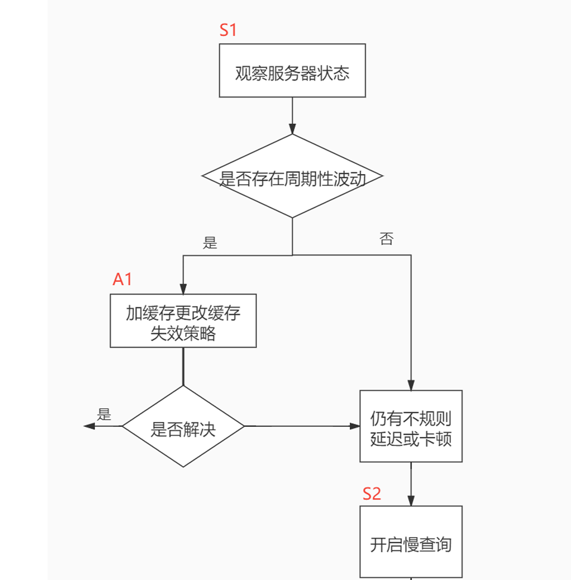

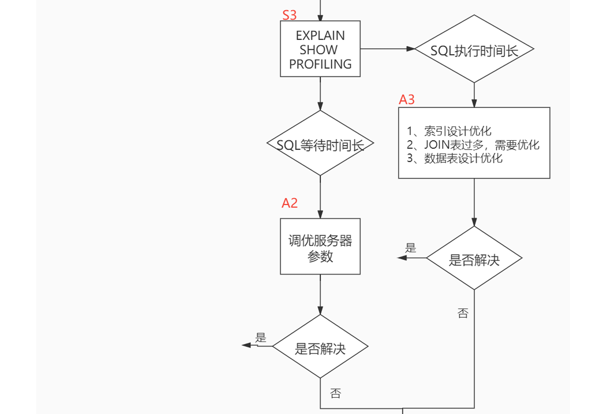

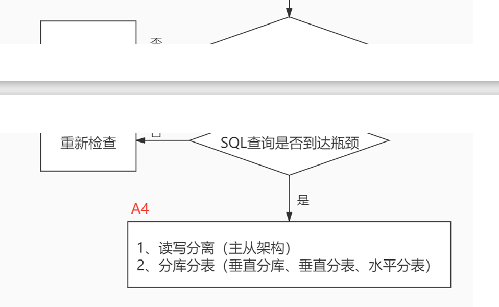


## 12.2 查看系统性能参数

在MySQL中，可以使用` SHOW STATUS `语句查询一些MySQL数据库服务器的 性能参数、 SHOW STATUS语句语法如下

```sql
SHOW [GLOBAL|SESSION] STATUS LIKE '参数'
```

**性能参数如下**：

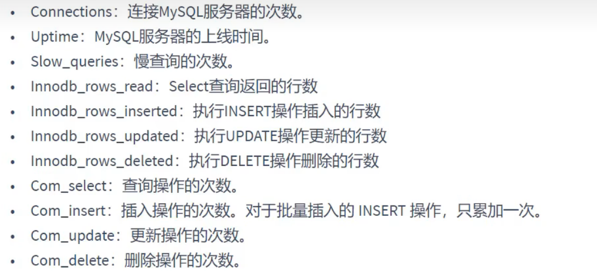


## 12.3 统计SQL的查询成本：last_query_cost

如果我们想要查询 id=900001 的记录，然后看下查询成本，我们可以直接在聚簇索引上进行查找：

```sql
SELECT student_id, class_id, NAME, create_time FROM student_info 
WHERE id = 900001;
```

运行结果（1 条记录，运行时间为  0.042s ）

然后再看下查询优化器的成本，实际上我们只需要检索一个页即可：

```sql
mysql> SHOW STATUS LIKE 'last_query_cost';
 +-----------------+----------+
 | Variable_name   | Value    
|
 +-----------------+----------+
 | Last_query_cost | 1.000000 |
 +-----------------+----------+
```

如果我们想要查询 id 在 900001 到 9000100 之间的学生记录呢？

```sql
SELECT student_id, class_id, NAME, create_time FROM student_info 
WHERE id BETWEEN 900001 AND 900100;
```

运行结果（100 条记录，运行时间为  0.046s ）： 然后再看下查询优化器的成本，这时我们大概需要进行 20 个页的查询。

```sql
mysql> SHOW STATUS LIKE 'last_query_cost';
 +-----------------+-----------+
 | Variable_name   | Value     
|
 +-----------------+-----------+
 | Last_query_cost | 21.134453 |
 +-----------------+-----------+
```

你能看到页的数量是刚才的 20 倍，但是查询的效率并没有明显的变化，实际上这两个 SQL 查询的时间 基本上一样，就是因为采用了`顺序读取的方式`将页面一次性加载到缓冲池中，然后再进行查找。虽然 数量（last_query_cost）增加了不少 ，但是通过缓冲池的机制，并 没有增加多少查询时间。

**使用场景**：它对于比较开销是非常有用的，特别是我们有好几种查询方式可选的时候。


## 12.4 定位执行慢的SQL：慢查询日志

MySQL的慢查询日志，用来记录在MySQL中 `响应时间超过阀值` 的语句，具体指运行时间超过long_query_time 值的SQL，则会被记录到慢査询日志中。 long_query_time的默认值为`10`，意思是运行10秒以上(不含10秒)的语句，认为是超出了我们的最大忍耐时间值。

默认情况下，MySQL数据库 `没有开启慢查询日志`，需要我们手动来设置这个参数。**如果不是调优需要的话，一般不建议启动该参数，因为开启慢查询日志会或多或少带来一定的性能影响**。


### 12.4.1 开启/关闭/删除 慢查询日志

查看慢查询日志是否开启

```sql
SHOW VARIABLES LIKE '%slow_query_log%'
```

开启慢查询日志

```sql
set global slow_query_log='ON'
```

查看慢查询的时间阈值设置，使用如下命令：

```sql
 show variables like '%long_query_time%'
```

设置慢查询时间阈值

```sql
set [global] long_query_time = 1;  
# 不加global只是当前窗口有效
```


**关闭慢查询日志：**

**永久关闭**

```sql
[mysqld]
 slow_query_log=OFF
```

或者删掉slow_query_log=OFF

**临时性方式**

```sql
SET GLOBAL slow_query_log=off
```


**删除慢查询日志**

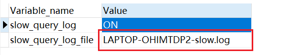

手动删除后，使用命令 `mysqladmin flush-1ogs` 来重新生成查询日志文件，具体命令如下，执行完毕会在数据目录下重新生成慢查询日志文件。

```sql
mysqladmin -uroot -p flush-logs slow
```


### 12.4.2 慢查询日志分析工具：mysqldumpslow

在生产环境中，如果要手工分析日志，查找、分析SQL，显然是个体力活，MySQL提供了日志分析工具 `mysqldumpslow `

查看mysqldumpslow帮助信息：

```sql
mysqldumpslow --help
```

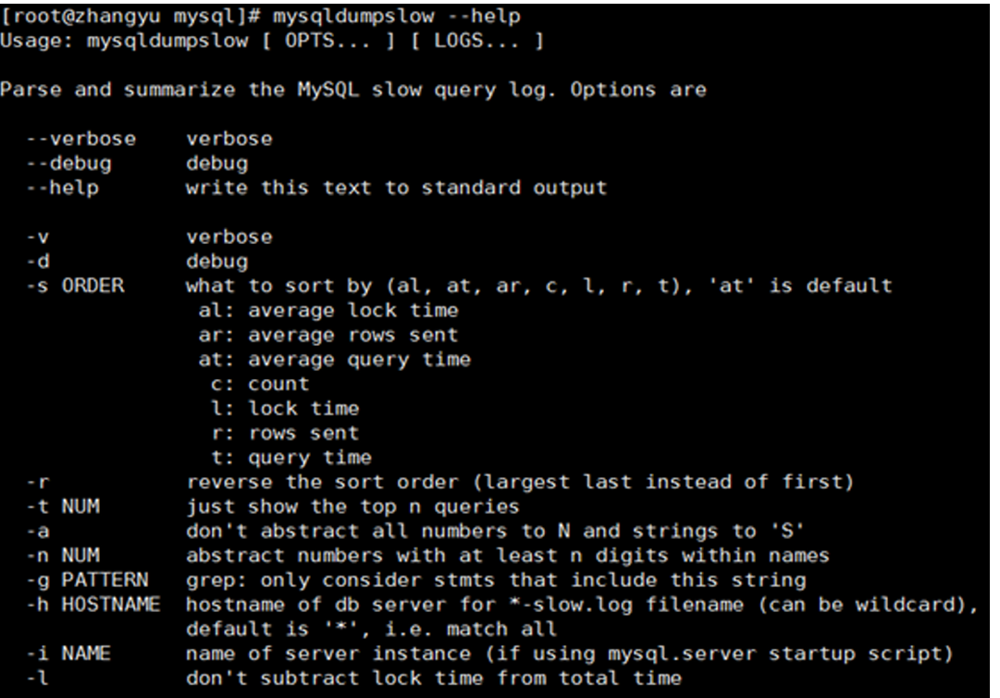

- -a: 不将数字抽象成N，字符串抽象成S
- -s: 是表示按照何种方式排序：
    - c: 访问次数
    - l: 锁定时间
    - r: 返回记录
    - **t: 查询时间**
    - al:平均锁定时间
    - ar:平均返回记录数
    - at:平均查询时间 （默认方式）
    - ac:平均查询次数
- -t: 即为返回前面多少条的数据；
- -g: 后边搭配一个正则匹配模式，大小写不敏感的；


**工作中常用的**

```sql
#得到查询时间最多的10个SQL
 mysqldumpslow -s t -t 10 /var/lib/mysql/atguigu-slow.log
#得到返回记录集最多的10个SQL
 mysqldumpslow -s r -t 10 /var/lib/mysql/atguigu-slow.log
 #得到访问次数最多的10个SQL
 mysqldumpslow -s c -t 10 /var/lib/mysql/atguigu-slow.log
 #得到按照时间排序的前10条里面含有左连接的查询语句
mysqldumpslow -s t -t 10 -g "left join" /var/lib/mysql/atguigu-slow.log
 #另外建议在使用这些命令时结合 | 和more 使用 ，否则有可能出现爆屏情况
mysqldumpslow -s r -t 10 /var/lib/mysql/atguigu-slow.log | more
```


## **12.5 分析查询语句**

定位了查询慢的 SQL 之后，我们就可以使用 `EXPLAIN `或 `DESCRIBE` 工具做针对性的分析查询语句。
。**DESCRIBE** 语句的使用方法与EXPLAIN语句是一样的，并且分析结果也是一样的。


**能做什么？**

- 表的读取顺序
- 数据读取操作的操作类型
- 哪些索引可以使用
- **哪些索引被实际使用**

- 表之间的引用
- **每张表有多少行被优化器查询**

**基本语法**

```sql
EXPLAIN SELECT select_options
或者
DESCRIBE SELECT select_options
```

`EXPLAIN `语句输出的各个列的作用如下

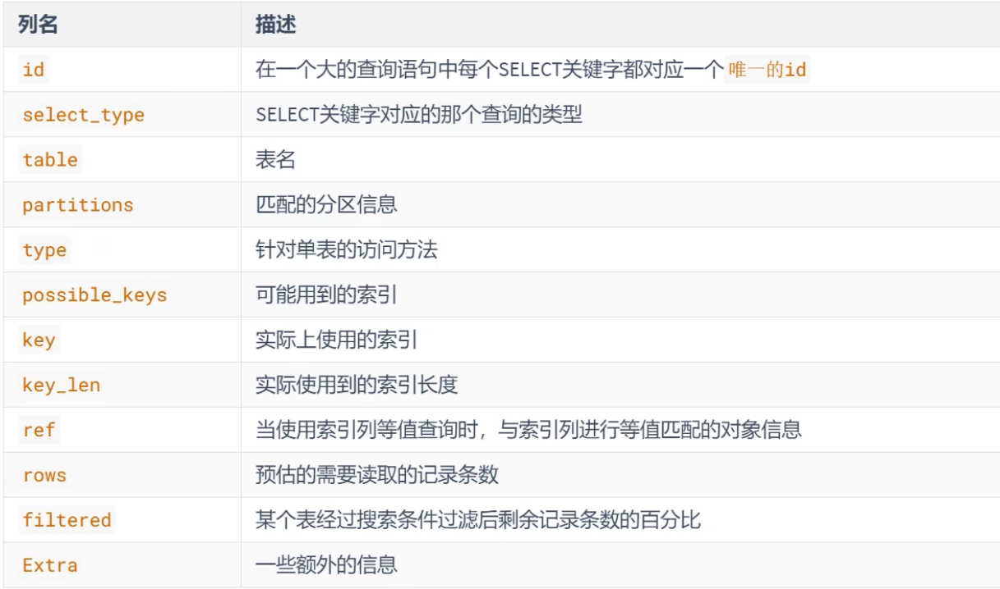


### 12.5.1 table

不论我们的查询语句有多复杂，里边儿 `包含了多少个表`，到最后也是需要对每个表进行 单表访问的，**所 以MySQL规定EXPLAIN语句输出的每条记录都对应着某个单表的访问方法**，该条记录的table列代表着该 表的表名（有时不是真实的表名字，可能是简称）。

```sql
mysql> EXPLAIN SELECT * FROM s1 INNER JOIN s2;
+----+-------------+-------+------------+------+---------------+------+---------+------+------+----------+-------------------------------+
| id | select_type | table | partitions | type | possible_keys | key  | key_len | ref  | rows | filtered | Extra                         |
+----+-------------+-------+------------+------+---------------+------+---------+------+------+----------+-------------------------------+
|  1 | SIMPLE      | s1    | NULL       | ALL  | NULL          | NULL | NULL    | NULL | 9895 |   100.00 | NULL                          |
|  1 | SIMPLE      | s2    | NULL       | ALL  | NULL          | NULL | NULL    | NULL | 9895 |   100.00 | Using join buffer (hash join) |
+----+-------------+-------+------------+------+---------------+------+---------+------+------+----------+-------------------------------+
2 rows in set, 1 warning (0.00 sec)
```


### 12.5.2 id

查询语句中每出现一个 SELECT 关键字，MYSQL 就会为它分配一个唯一的ID

```sql
mysql> EXPLAIN SELECT * FROM s1 INNER JOIN s2;
```

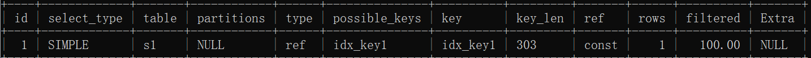

当涉及多个SELECT时，id值为多个

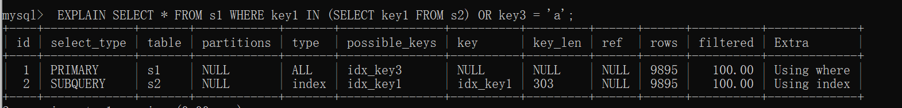

需要注意的是，并不是有多少个SELECT就会有多少ID，因此查询优化器可能对涉及子查询的查询语句进行重写,转变为多表查询的操作

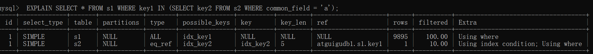

在使用 UNION 表进行去重的时候，可能会涉及到临时表

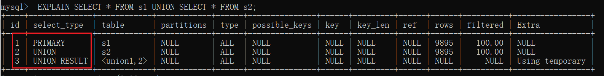

使用 UNION ALL 就无需使用临时表

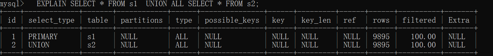

**总结**

- id值相同，可以认为是一组

- id值越大，优先级越高，越先执行

- 关注点：id号每个号码，表示一趟独立的查询，一个sql查询的趟数越少越好


### 12.5.3 select_type

一条大的查询语句里边可以包含`若干个SELECT关键字`，每个SELECT关键字代表着一个小的査询语句，而每个SELECT关键字的FROM子句中都可以包含若干张表(这些表用来做连接査询)，`每一张表都对应着执行计划输出中的一条记录 `，对于在同一个SELECT关键字中的表来说，它们的id值是相同的。


MySQL`为每一个SELECT关键字代表的小査询都定义了一个称之为 select_type 的属性`，意思是我们只要知道了某个小査询的 select_type属性，就知道了这个 小査询在整个大査询中扮演了一个什么角色，我们看一下select_type都能取哪些值，请看官方文档:

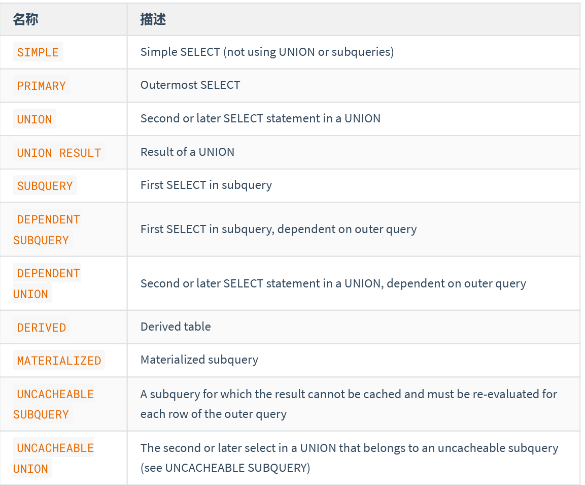

查询语句中不包含`UNION`或者子查询的查询都算作是`SIMPLE`类型

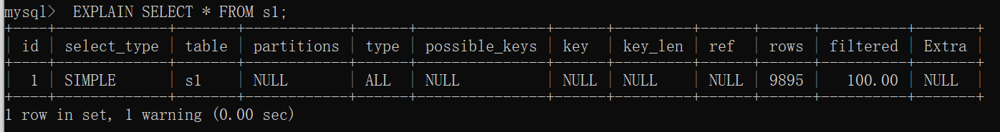

连接查询也算是`SIMPLE`类型

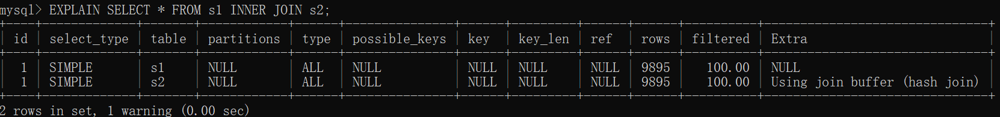


对于包含`UNION`或者`UNION ALL`或者子查询的大查询来说，它是由几个小查询组成的，其中最左边的那个查询的`select_type`值就是`PRIMARY`

对于包含`UNION`或者`UNION ALL`的大查询来说，它是由几个小查询组成的，其中除了最左边的那个小查询以外，其余的小查询的`select_type`值就是`UNION`

其中 UNION RESULT 就是临时表！

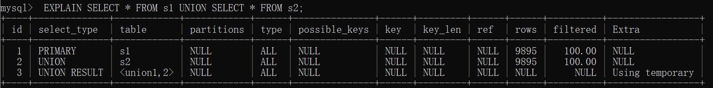


如果包含子查询的查询语句不能够转为对应的`semi-join`的形式，并且该子查询是不相关子查询。该子查询的第一个`SELECT`关键字代表的那个查询的`select_type`就是`SUBQUERY`

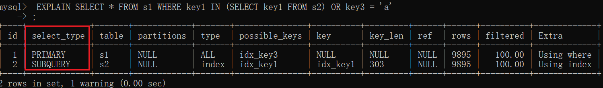

如果包含子查询的查询语句不能够转为对应的`semi-join`的形式，并且该子查询是相关子查询，则该子查询的第一个`SELECT`关键字代表的那个查询的`select_type`就是`DEPENDENT SUBQUERY`

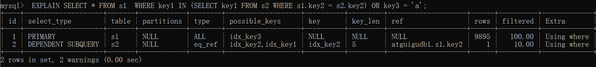

注意的是，select_type为`DEPENDENT SUBQUERY`的查询可能会被执行多次。


在包含`UNION`或者`UNION ALL`的大查询中，如果各个小查询都依赖于外层查询的话，那除了最左边的那个小查询之外，其余的小查询的`select_type`的值就是`DEPENDENT UNION`。

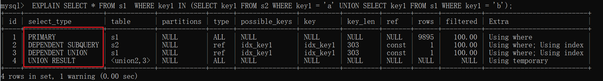

对于包含`派生表`的查询，该派生表对应的子查询的`select_type`就是`DERIVED`

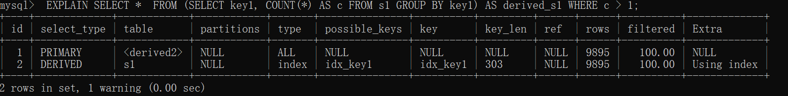

#当查询优化器在执行包含子查询的语句时，选择将子查询物化之后与外层查询进行连接查询时，该子查询对应的`select_type`属性就是`MATERIALIZED`

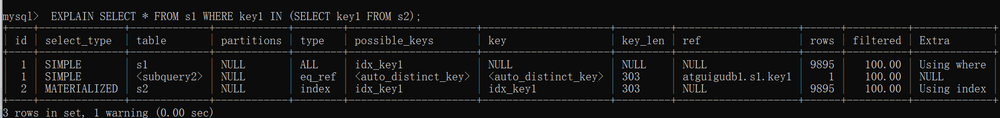


### 12.5.4 type△

执行计划的一条记录就代表着MySQL对某个表的 `执行査询时的访问方法，又称“访问类型`”，其中的 type 列就表明了这个访问方法是啥，是较为重要的一个指标。比如，看到type列的值是ref，表明MySQL 即将使用 ref访问方法来执行对 s1 表的查询。

完整的访问方法如下: `system ， const ， eq_ref ， ref ， index_merge ， unique_subquery ， fulltext ， ref_or_null ， index_subquery ,range,index,ALL`


**system**

当表中 `只有一条记录 `并且该表使用的存储引擎的统计数据是精确的，比如MyISAM、Memory，那么对该表的访
问方法就是 system 。比方说我们新建一个 MyISAM 表，并为其插入1条记录

**例如**：MyISAM表中只有一条记录，执行 count(*) 时type就是system

MyISAM中维护一个计数器，记录表中的总记录数，使用 count(*) 直接返回

```sql
 CREATE TABLE t(i INT) ENGINE=MYISAM;
 INSERT INTO t VALUES(1);
 
 EXPLAIN SELECT * FROM t;
```

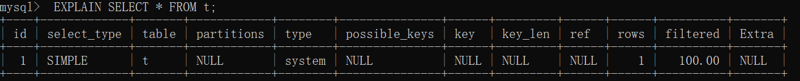


**cost**

当我们根据主键或者唯一二级索引列与常数进行等值匹配时，对单表的访问方法就是 `const`

```sql
 EXPLAIN SELECT * FROM s1 WHERE id = 10005;
 
 EXPLAIN SELECT * FROM s1 WHERE key2 = 10066;
```

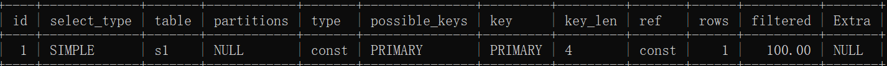


**eq_ref**

在连接查询时，如果被驱动表是通过主键或者唯一二级索引列等值匹配的方式进行访问的,（如果该主键或者唯一二级索引是联合索引的话，所有的索引列都必须进行等值比较），则对该被驱动表的访问方法就是`eq_ref`

```sql
 EXPLAIN SELECT * FROM s1 INNER JOIN s2 ON s1.id = s2.id;
```

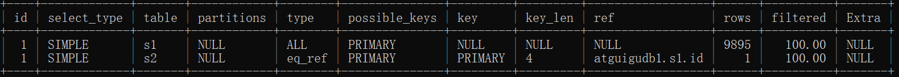

**ref**

当通过普通的二级索引列与常量进行等值匹配时来查询某个表，那么对该表的访问方法就可能是`ref`

```sql
EXPLAIN SELECT * FROM s1 WHERE key1 = 'a';
```

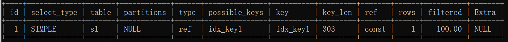


**ref_or_null**

当对普通二级索引进行等值匹配查询，该索引列的值也可以是`NULL`值时，那么对该表的访问方法就可能是`ref_or_null`

```sql
 EXPLAIN SELECT * FROM s1 WHERE key1 = 'a' OR key1 IS NULL;
```

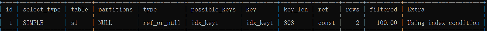

**index_merge**

单表访问方法时在某些场景下可以使用`Intersection`、`Union、Sort-Union`这三种索引合并的方式来执行查询

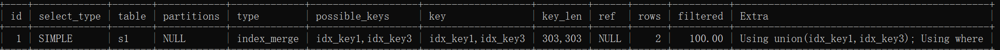

**unique_subquery**

`unique_subquery`是针对在一些包含`IN`子查询的查询语句中，如果查询优化器决定将`IN`子查询
#转换为`EXISTS`子查询，而且子查询可以使用到主键进行等值匹配的话，那么该子查询执行计划的`type`
#列的值就是`unique_subquery`

```sql
 EXPLAIN SELECT * FROM s1 
 WHERE key2 IN (SELECT id FROM s2 WHERE s1.key1 = s2.key1) OR key3 = 'a';
```

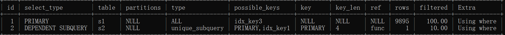


**range**

如果使用索引获取某些`范围区间`的记录，那么就可能使用到`range`访问方法

```sql
 EXPLAIN SELECT * FROM s1 WHERE key1 IN ('a', 'b', 'c');
```

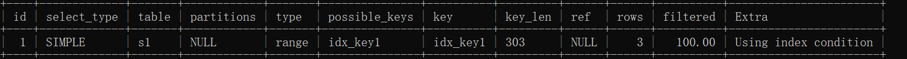


**index**

当我们可以使用索引覆盖，但需要扫描全部的索引记录时，该表的访问方法就是`index`

```sql
 EXPLAIN SELECT key_part2 FROM s1 WHERE key_part3 = 'a';
```

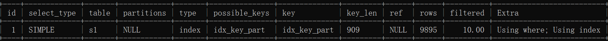


**all**

全表扫描

```sql
EXPLAIN SELECT * FROM s1
```


结果值从最好到最坏依次是： `system > const > eq_ref > ref` > fulltext > ref_or_null > index_merge > unique_subquery > index_subquery > `range > index > ALL `


### **12.5.5 possible_keys和key**

可能用到的索引 和 实际上使用的索引

```sql
EXPLAIN SELECT * FROM s1 WHERE key1 > 'z' AND key3 = 'a';
```

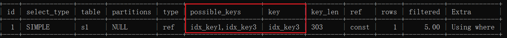


### 12.5.6  key_len ☆

实际使用到的索引长度(即：字节数)

帮你检查`是否充分的利用上了索引`，`值越大越好`,主要针对于联合索引，有一定的参考意义。

### 12.5.7  ref

当使用索引列等值查询时，与索引列进行等值匹配的对象信息。比如只是一个常数或者是某个列。

```sql
 EXPLAIN SELECT * FROM s1 INNER JOIN s2 ON s1.id = s2.id;
```

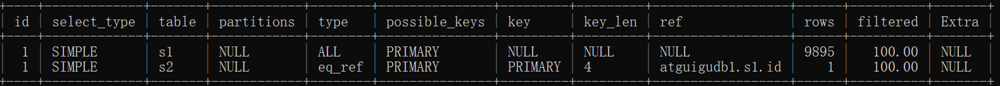


### 12.5.8 rows

预估的需要读取的记录条数`值越小越好`

```sql
 EXPLAIN SELECT * FROM s1 WHERE key1 > 'z';
```

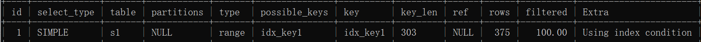


### 12.5.9 filtered

某个表经过搜索条件过滤后剩余记录条数的百分比

```sql
 #对于单表查询来说，这个filtered列的值没什么意义，我们`更关注在连接查询
 #中驱动表对应的执行计划记录的filtered值`，它决定了被驱动表要执行的次数(即：rows * filtered)
 EXPLAIN SELECT * FROM s1 INNER JOIN s2 ON s1.key1 = s2.key1 WHERE s1.common_field = 'a';
```

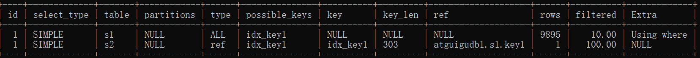


### 12.5.10 Extra ☆

一些额外的信息.更准确的理解MySQL到底将如何执行给定的查询语句

```sql
 #当查询语句的没有`FROM`子句时将会提示该额外信息
 EXPLAIN SELECT 1;
 
 
 #查询语句的`WHERE`子句永远为`FALSE`时将会提示该额外信息
 EXPLAIN SELECT * FROM s1 WHERE 1 != 1;
 
 
 #当我们使用全表扫描来执行对某个表的查询，并且该语句的`WHERE`
 #子句中有针对该表的搜索条件时，在`Extra`列中会提示上述额外信息。
 EXPLAIN SELECT * FROM s1 WHERE common_field = 'a';
 
 
 #当使用索引访问来执行对某个表的查询，并且该语句的`WHERE`子句中
 #有除了该索引包含的列之外的其他搜索条件时，在`Extra`列中也会提示上述额外信息。
 EXPLAIN SELECT * FROM s1 WHERE key1 = 'a' AND common_field = 'a';
 
 
 #当查询列表处有`MIN`或者`MAX`聚合函数，但是并没有符合`WHERE`子句中
 #的搜索条件的记录时，将会提示该额外信息
 EXPLAIN SELECT MIN(key1) FROM s1 WHERE key1 = 'abcdefg';
 
 EXPLAIN SELECT MIN(key1) FROM s1 WHERE key1 = 'NlPros'; #NlPros 是 s1表中key1字段真实存在的数据


 #当我们的查询列表以及搜索条件中只包含属于某个索引的列，也就是在可以
 #使用覆盖索引的情况下，在`Extra`列将会提示该额外信息。比方说下边这个查询中只
 #需要用到`idx_key1`而不需要回表操作：
 EXPLAIN SELECT key1,id FROM s1 WHERE key1 = 'a';
 
  #有些搜索条件中虽然出现了索引列，但却不能使用到索引
 #看课件理解索引条件下推
 EXPLAIN SELECT * FROM s1 WHERE key1 > 'z' AND key1 LIKE '%a';
 
 
 #在连接查询执行过程中，当被驱动表不能有效的利用索引加快访问速度，MySQL一般会为
 #其分配一块名叫`join buffer`的内存块来加快查询速度，也就是我们所讲的`基于块的嵌套循环算法`
 #见课件说明
 EXPLAIN SELECT * FROM s1 INNER JOIN s2 ON s1.common_field = s2.common_field;
 
 
 #当我们使用左（外）连接时，如果`WHERE`子句中包含要求被驱动表的某个列等于`NULL`值的搜索条件，
 #而且那个列又是不允许存储`NULL`值的，那么在该表的执行计划的Extra列就会提示`Not exists`额外信息
 EXPLAIN SELECT * FROM s1 LEFT JOIN s2 ON s1.key1 = s2.key1 WHERE s2.id IS NULL;
 
 
 #如果执行计划的`Extra`列出现了`Using intersect(...)`提示，说明准备使用`Intersect`索引
 #合并的方式执行查询，括号中的`...`表示需要进行索引合并的索引名称；
 #如果出现了`Using union(...)`提示，说明准备使用`Union`索引合并的方式执行查询；
 #出现了`Using sort_union(...)`提示，说明准备使用`Sort-Union`索引合并的方式执行查询。
 EXPLAIN SELECT * FROM s1 WHERE key1 = 'a' OR key3 = 'a';
 
 
 #当我们的`LIMIT`子句的参数为`0`时，表示压根儿不打算从表中读出任何记录，将会提示该额外信息
 EXPLAIN SELECT * FROM s1 LIMIT 0;
 
 
 #有一些情况下对结果集中的记录进行排序是可以使用到索引的。
 #比如：
 EXPLAIN SELECT * FROM s1 ORDER BY key1 LIMIT 10;
 
 
 #很多情况下排序操作无法使用到索引，只能在内存中（记录较少的时候）或者磁盘中（记录较多的时候）
 #进行排序，MySQL把这种在内存中或者磁盘上进行排序的方式统称为文件排序（英文名：`filesort`）。
 
 #如果某个查询需要使用文件排序的方式执行查询，就会在执行计划的`Extra`列中显示`Using filesort`提示
 EXPLAIN SELECT * FROM s1 ORDER BY common_field LIMIT 10;
 
 
 #在许多查询的执行过程中，MySQL可能会借助临时表来完成一些功能，比如去重、排序之类的，比如我们
 #在执行许多包含`DISTINCT`、`GROUP BY`、`UNION`等子句的查询过程中，如果不能有效利用索引来完成
 #查询，MySQL很有可能寻求通过建立内部的临时表来执行查询。如果查询中使用到了内部的临时表，在执行
 #计划的`Extra`列将会显示`Using temporary`提示
 EXPLAIN SELECT DISTINCT common_field FROM s1;
 
 #EXPLAIN SELECT DISTINCT key1 FROM s1;
 
 #同上。
 EXPLAIN SELECT common_field, COUNT(*) AS amount FROM s1 GROUP BY common_field;
 
 #执行计划中出现`Using temporary`并不是一个好的征兆，因为建立与维护临时表要付出很大成本的，所以
 #我们`最好能使用索引来替代掉使用临时表`。比如：扫描指定的索引idx_key1即可
 EXPLAIN SELECT key1, COUNT(*) AS amount FROM s1 GROUP BY key1;
 
```

