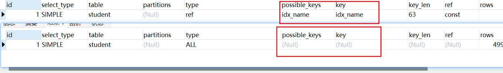

# 十三、索引优化与查询优化


## 13.1 索引失效的11种情况

### 1、全值匹配

```sql
EXPLAIN SELECT SQL_NO_CACHE * FROM student WHERE age=30 
EXPLAIN SELECT SQL_NO_CACHE * FROM student WHERE age=30 AND classId = 4;
EXPLAIN SELECT SQL_NO_CACHE * FROM student WHERE age=30 AND classId = 4 AND name = 'abcd';

```

**分别创建三条索引**：

```sql
CREATE INDEX idx_age ON student(age);
CREATE INDEX idx_age_classid ON student(age,classId);
CREATE INDEX idx_age_classid_name ON student(age,classId,NAME);
```

然后执行上面的三条SQL，当执行到最后一个SQL时可以发现，使用的是 `idx_age_classid_name` 索引


### 2、最佳左前缀法则

索引文件具有 B-Tree 的最左前缀匹配特性，如果左边的值未确定，那么无法使用此索引

```sql
# 由于索引没有以 classId 开头的，因此没有索引可以使用
EXPLAIN SELECT SQL_NO_CACHE * FROM student WHERE  classId = 4 AND name = 'abcd';
```


### 3、计算、函数、类型转换导致索引失效

```sql
EXPLAIN SELECT SQL_NO_CACHE * FROM student WHERE  name = 'abc%';
# 无法使用索引，相较于上一条效率低
EXPLAIN SELECT SQL_NO_CACHE * FROM student WHERE  LEFT(name,3) = 'abc';
```



**类型转换**

由于 name 是 varchar类型，会自动进行类型转换

```sql
EXPLAIN SELECT SQL_NO_CACHE * FROM student WHERE  name = 123;
```


### 4、范围条件右边的列索引失效

```sql
 # 创建联合索引
 create index idx_age_name_classid on student(age,classid,name);
 
 # 执行以下SQL语句
 EXPLAIN SELECT SQL_NO_CACHE * FROM student 
WHERE student.age=30 AND student.classId>20 AND student.name = 'abc' ; 
```

这种情况由于在查询时，classId是范围查询，因此name就无法使用索引。


因此在我们创建索引，考虑`先将 等值 查询的列放在左边`，修改索引：

```
 create index idx_age_name_classid on student(age,name,classId);
```

再去执行SQL语句。发现name已经使用了索引


### 5、不等于(!= 或者<>)索引失效

```sql
  EXPLAIN SELECT SQL_NO_CACHE * FROM student 
WHERE student.age !=30 ;
```


如果不使用 * 使用具体的索引列 + 主键 索引则不会失效：

````sql
  EXPLAIN SELECT SQL_NO_CACHE age,classid FROM student 
WHERE student.age !=30 ;
````


这是因为 **使用覆盖索引，无需进行回表，那么MYSQL优化器就会认为 使用索引比不适用索引效率要高！**


### 6、isNULL 可使用索引，IS NOT NULL无法使用

```sql
  EXPLAIN SELECT SQL_NO_CACHE * FROM student 
WHERE student.age IS NULL ;
```


```sql
  EXPLAIN SELECT SQL_NO_CACHE * FROM student 
WHERE student.age IS NOT NULL ;
```


### 7、like以通配符%开头索引失

```sql
  EXPLAIN SELECT SQL_NO_CACHE * FROM student 
WHERE student.age LIKE '%a';
```


和 != 、<> 一样，如果指定列为索引的列则不会失效：

```sql
  EXPLAIN SELECT SQL_NO_CACHE age FROM student 
WHERE student.age LIKE '%a';
```


### 8、OR 前后存在非索引的列，索引失效


## 13.2 关联查询的优化

## 13.3 子查询优化

子查询是 MySQL 的一项重要的功能，可以帮助我们通过一个SQL 语句实现比较复杂的查询。但是，`子查询的执行效率不高`。原因:

① 执行子査询时，MySQL需要为内层查询语句的査询结果 建立一个临时表，然后外层査询语句从临时表中查询记录。查询完毕后，再 撤销这些临时表。这样会消耗过多的CPU和I0资源，产生大量的慢查询。

② 子查询的结果集存储的临时表，不论是内存临时表还是磁盘临时表都 不会存在索引，所以查询性能会受到一定的影响。

**在MySQL中，可以使用连接（JOIN）查询来替代子查询**。连接查询 不需要建立临时表，其 要快，如果查询中使用索引的话，性能就会更好。


## 13.4 排序优化

**问题**：在 WHERE 条件字段上加索引，但是为什么在 ORDER BY 字段上还要加索引呢？

在 MySQL中，支持两种排序方式，分别是 `FileSort` 和 `Index `排序。

- Index排序中，索引可以保证数据的有序性，不需要再进行排序，效率更高。
- Filesort 排序则一般在内存中进行排序，占用 CPU 较多。如果待排结果较大，会产生临时文件 IO 到磁盘进行排序的情况，效率较低。

**优化建议**：

1. SQL 中，可以在 WHERE 子句和 ORDER BY 子句中使用索引，目的是在 WHERE 子句中 描，在 ORDER BY 子句 `避免全表扫 避免使用 FileSort 排序`。当然，某些情况下全表扫描，或者 FileSort 排 序不一定比索引慢。但总的来说，我们还是要避免，以提高查询效率。
2. 尽量使用 Index 完成 ORDER BY 排序。如果 WHERE 和 ORDER BY 后面是相同的列就使用单索引列； 如果不同就使用联合索引。
3. 无法使用 Index 时，需要对 FileSort 方式进行调优。

```sql
INDEX a_b_c(a,b,c)

ORDER BY a ASC,b DESC,c DESC  /* 排序不一致 */
  WHERE g = const ORDER BY b,c  /*丢失a索引*/
  WHERE a = const ORDER BY c    /*丢失b索引*/
   WHERE a = const ORDER BY a,d  /*d不是索引的一部分*/
   WHERE a in (...) ORDER BY b,c /*对于排序来说，多个相等条件也是范围查询*/

```


**FileSort 算法**

- 双路排序 （慢）
    - **MySQL 4.1之前是使用双路排序**，字面意思就是`两次扫描磁盘，最终得到数据`， 读取行指针和 order by列 ，对他们进行排序，然后扫描已经排序好的列表，按照列表中的值重新从列表中读取 对应的数据输出
    - 从磁盘取排序字段，在buffer进行排序，再从 磁盘取其他字段

取一批数据，要对磁盘进行两次扫描，众所周知，IO是很耗时的，所以在mysql4.1之后，出现了第二种 改进的算法，就是单路排序。

- 单路排序 （快）
    - **从磁盘读取查询需要的 所有列**，按照order by列在buffer对它们进行排序，然后扫描排序后的列表进行输 出， 它的效率更快一些，避免了第二次读取数据。并且把随机IO变成了顺序IO，但是它会使用更多的空 间， 因为它把每一行都保存在内存中了


## 13.5 GROUP BY 和 分页优化

**GROUP BY**

- group by 使用索引的原则几乎跟order by一致 ，group by 即使没有过滤条件用到索引，也可以直接 使用索引。
- group by 先排序再分组，遵照索引建的最佳左前缀法则
- where效率高于having，能写在where限定的条件就不要写在having中了
- 减少使用order by，和业务沟通能不排序就不排序，或将排序放到程序端去做。Order by、group by、distinct这些语句较为耗费CPU，数据库的CPU资源是极其宝贵的。
- 包含了order by、group by、distinct这些查询的语句，where条件过滤出来的结果集请保持在1000行 以内，否则SQL会很慢


**分页优化**一

般分页查询时，通过创建覆盖索引能够比较好地提高性能。一个常见又非常头疼的问题就是 imit 2000000,10此时需要MySQL排序前2000010 记录，仅仅返回2000000-2000010 的记录，其他记录丢弃，查询排序的代价非常大

```sql
EXPLAIN SELECT * FROM student  LIMIT 2000000, 10;
```

**优化方案一**：

在索引上完成排序分页操作，最后根据主键关联回原表查询所需要的其他列内容

```sql
EXPLAIN SELECT * FROM student t,(SELECT id FROM student ORDER BY id LIMIT 2000000,10)  WHERE t.id = a.id;
```


**优化方案二：**

该方案适用于主键自增的表，可以把Limit 查询转换成某个位置的查询 。

```sql
EXPLAIN SELECT * FROM student WHERE id > 2000000 LIMIT 10;
```


## 13.6 优先考虑覆盖索引

**什么是覆盖索引？**

一个索引包含了满足查询结果的数据就叫做覆盖索引。简单来说，就是 索引列名称 + 主键 就是你 SELECT 时的列名。

普通索引创建的B+树只包含当前索引的列和主键，假如只SELECT 这俩个列 不用回表，这就是覆盖索引！

**好处**

1. 避免Innodb表进行索引的二次查询（回表）
2. 可以把随机IO变成顺序IO加快查询效率

**弊端**

**索引字段的维护总是有代价的**。因此，在建立冗余索引来支持覆盖索引时就需要权衡考虑了。这是业务 DBA，或者称为业务数据架构师的工作。


## 13.7 索引下推

Index Condition Pushdown(ICP)是MySQL 5.6中新特性，**是一种在存储引擎层使用索引过滤数据的一种优 化方式**。ICP可以减少存储引擎访问基表的次数以及MySQL服务器访问存储引擎的次数。

```sql
 INDEX (age,classId,name)
 
EXPLAIN SELECT SQL_NO_CACHE * FROM student WHERE student.age=30 AND student.classId != 20 
```

以上面的SQL为例，由于 classId 使用 != 号因为它无法使用索引

**假设没有ICP**

首先从二级索引中筛选出 age = 30 的记录，然后拿着筛选出的记录的主键去 聚簇 索引中找到记录，也就是回表操作，然后在将这些记录进行二次筛选。

**操作步骤:  第一次筛选  ----  回表  ---- 第二次筛选**

**使用ICP**

但实际上在MYSQL中并不是这么操作的，假设第一次筛选出 10万条数据，然后拿着这10万条数据进行回表，最后假设就筛选出 1万条数据，那么就浪费了很多的CPU资源，影响效率。

在MYSQL中，它会在回表前就会过滤掉所有不满足条件的行，也就是先筛选出 age=30、classId != 20 的数据，最后在进行回表！ 这样就大大减少了回表操作。提高了效率！

**操作步骤:  第一次筛选 ---- 第二次筛选 ----  回表  **

> 需要注意的是，条件下推的列必须是索引中包含的列！


**ICP使用条件**

-  只能用于二级索引(secondary index)
-  explain显示的执行计划中type值（join 类型）为 range 、  ref 、  eq_ref 或者 ref_or_null 。
-  并非全部where条件都可以用ICP筛选，如果where条件的字段不在索引列中，还是要读取整表的记录 到server端做where过滤
-  当SQL使用覆盖索引时，不支持ICP优化方法
-  ICP可以用于MyISAM和InnnoDB存储引擎


## 13.8 其他优化策略

**1、 EXISTS 和 IN 的区分**

选择与否，主要看表的大小，可以理解为选择的标准就是 `小表驱动大表`

```sql
# A表大，B表小
SELECT * FROM A WHERE CC IN(SELECT CC FROM B)
# A表小，B表大
SELECT * FROM A WHERE EXISTS(SELECT CC FROM B WHERE B.CC=A.CC)
```


**2、COUNT(*) 和 COUNT(1) 和 COUNT(具体的字段)哪个效率更高？**

三者的效率差不多。

在不同的存储引擎中，COUNT的时间复杂度可能会不同，由于在 `MyISAM` 中维护了一个计数器，可直接将计数器的值返回，因此时间复杂度为 `O(1)`, 而在 `InnoDB` 中则需要循环+计数，因此复杂度为 `O(n)`


**3、关于SELECT ***

在表查询中，建议明确字段，不要使用 * 作为查询的字段列表，推荐使用SELECT<字段列表>查询。

原因

① MySQL 在解析的过程中，会通过 **査询数据字典 将"*"按序转换成所有列名**，这会大大的耗费资源和时间

② 无法使用 **覆盖索引**


**4、 LIMIT 1 对优化的影响**

针对的是会扫描全表的 SQL 语句，如果你可以确定结果集只有一条，那么加上 到一条结果的时候就不会继续扫描了，这样会加快查询速度

如果数据表已经对字段建立了唯一索引，那么可以通过索引进行查询，不会全表扫描的话，就不需要加 上 LIMIT 1


## 13.9 主键的设计

### 13.9.1 自增Id的问题

自增ID做主键，简单易懂，几乎所有数据库都支持自增类型，只是实现上各自有所不同而已。自增ID除了简单其他都是缺点，总体来看存在以下几方面的问题:

1. **可靠性不高**
   存在自增ID回溯的问题，这个问题直到最新版本的MySQL 8.0才修复。

2. **全性不高**
   对外暴露的接口可以非常容易猜测对应的信息。比如:/ser/1/这样的接口，可以非常容易猜测用户ID的值为多少，总用户数量有多少，也可以非常容易地通过接口进行数据的爬取。

3. **性能差**
   自增ID的性能较差，需要在数据库服务器端生成。

4. **交互多**
   业务还需要额外执行一次类似 1ast_insert_id()的函数才能知道刚才插入的自增值，这需要多一次的网络交亘。在海量并发的系统中，多1条SQL，就多一次性能上的开销。

5. **局部唯一性**

   最重要的一点，自增ID是局部唯一的，只在当前数据库实例中唯一，而不是全局唯一，在分布式系统中，无疑是 噩梦


### 13.9.2 业务字段做主键


像上面这种 `会员信息表` 假设我用卡号作为主键，看似很合理，但是卡号可能会出现注销，易主的问题，产生数据的混乱。

比如： 100000001 是张三使用，现在转移给了王五，那么之前张三购买的东西，现在到了王五的名下。显然是不合理的。

**所以，建议尽量不要用跟业务有关的字段做主键。毕竟，作为项目设计的技术人员，我们谁也无法预测在项目的整个生命周期中，哪个业务字段会因为项目的业务需求而有重复，或者重用之类的情况出现。**


### 13.9.3 推荐的主键设计

**非核心业务**：对应表的主键自增ID，如警告、日志、监控等信息

**核心业务**： 至少保证全局唯一性且单调递增，单调递增主要是希望插入时不要影响数据库性能。

在当今的互联网环境中，非常不推荐自增ID作为主键的数据库设计。更推荐类似**有序UUID**的全局 唯一的实现。 另外在真实的业务系统中，主键还可以加入业务和系统属性，如用户的尾号，机房的信息等。这样 的主键设计就更为考验架构师的水平了。

