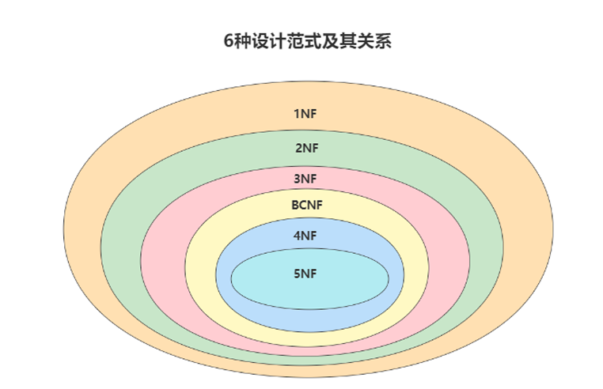

# 十四、数据库的设计规范

在关系型数据库中，关于**数据表设计的基本原则、规则就称为范式**。

目前关系型数据库有六种常见范式，按照范式级别，从低到高分别是：**第一范式（1NF）、第二范式 （2NF）、第三范式（3NF）、巴斯-科德范式（BCNF）、第四范式(4NF）和第五范式（5NF，又称完美 范式）**




**键和相关属性的概念**

范式的定义会使用到主键和候选键，数据库中的键(Key)由一个或者多个属性组成。数据表中常用的几种键和

属性的定义：

`超键`:能唯一标识元组的属性集叫做超键。

`候选键`:如果超键不包括多余的属性，那么这个超键就是候选键。

`主键`:用户可以从候选键中选择一个作为主键。

`外键`: 如果数据表 R1 中的某属性集不是 R1 的主键，而是另一个数据表 R2 的主键，那么这个属性集就是数据表 R1 的外键。

`主属性`:包含在任一候选键中的属性称为主属性,

`非主属性`:与主属性相对，指的是不包含在任何一个候选键中的属性。


**例如，有俩个表**：

球员表(player) ：球员编号 | 姓名 | 身份证号 | 年龄 | 球队编号

球队表(team) ：球队编号 | 主教练 | 球队所在地

其中`球员编号 + 任一字段` 都是超键， 单个的`球员编号`、`身份证号` 可以唯一标识一条数据，这俩个就是候选键


## 14.1 数据库范式

**第一范式**

第一范式主要是确保数据表中每个家段的值必须具有 **原子性**，也就是说数据表中每个字段的值为 **不可再次拆分** 的最小数据单元。

**第二范式**

第二范式要求，在满足第一范式的基础上，还要满足数据表里的每一条数据记录，都是可唯一标识的。而且`所有非主键字段，都必须完全依赖主键`，不能只依赖主键的一部分。如果知道主键的所有属性的值，就可以检索到任(要求中的主键，其实可以拓展替换为候选键)。何元组(行)的任何属性的任何值。

**举例**

比赛表 player_game，里面包含球员编号、姓名、年龄、比赛编号、比赛时间和比赛场地等属性，这 里候选键和主键都为（球员编号，比赛编号），我们可以通过候选键（或主键）来决定如下的关系：

```
(球员编号, 比赛编号) → (姓名, 年龄, 比赛时间, 比赛场地，得分)
```

这种就不符合第二范式，由于姓名、年龄只依赖于球员编号，比赛时间、比赛场地只依赖于比赛编号，并没有完全依赖于主键。

对于非主属性来说，并非完全依赖于主键，会造成什么问题呢？

1. `数据冗余`：如果一个球员可以参加 m 场比赛，那么球员的姓名和年龄就重复了 m-1 次。一个比赛 也可能会有 n 个球员参加，比赛的时间和地点就重复了 n-1 次。
2. `插入异常`：如果我们想要添加一场新的比赛，但是这时还没有确定参加的球员都有谁，那么就没 法插入
3. `删除异常`：如果我要删除某个球员编号，如果没有单独保存比赛表的话，就会同时把比赛信息删 除掉。
4. `更新异常`：如果我们调整了某个比赛的时间，那么数据表中所有这个比赛的时间都需要进行调 整，否则就会出现一场比赛时间不同的情况。

为了避免以上这种情况，应该设计成三张表：


> 第一范式是确定字段是原子性的，而第二范式则确定每一张表都是独立的！


**第三范式**

第三范式是在第二范式的基础上，确保数据表中的每一个非主键字段都和主键字段直接相关，也就是说，**其他非主键字段不依赖于其他非主键字段！**

**举例**

`部门信息表`：每个部门有部门编号（dept_id）、部门名称、部门简介等信息。

`员工信息表`：每个员工有员工编号、姓名、部门编号、部门名称。

如果在员工信息表中在增加 `部门名称` 字段，此时就不符合第三范式，因为 部门名称依赖于部门编号，部门编号依赖于员工编号（部门名称 --》部门编号 --》员工编号）


**BCNF(Bovce Codd Normal Form 巴克斯范式)**

属于修正的第三范式，是防止主键的某一列会依赖于主键的其他列。当3NF消除了主属性对码的部分函数依赖和传递函数依赖称为BCNF。

举例：库存表(仓库名，管理员名，商品名，数量)，主键为(仓库名，管理员名，商品名)，这是满足前面三个范式的，但是仓库名和管理员名之间存在依赖关系，因此删除某一个仓库，会导致管理员也被删除，这样就不满足BCNF。

​	


