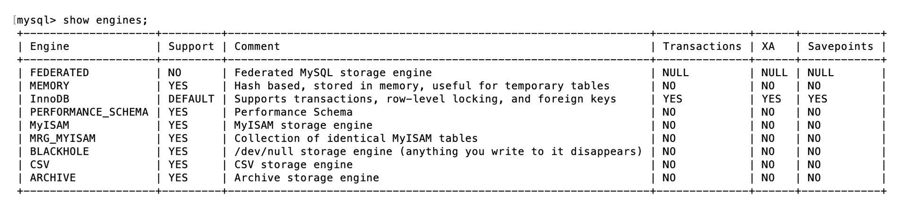
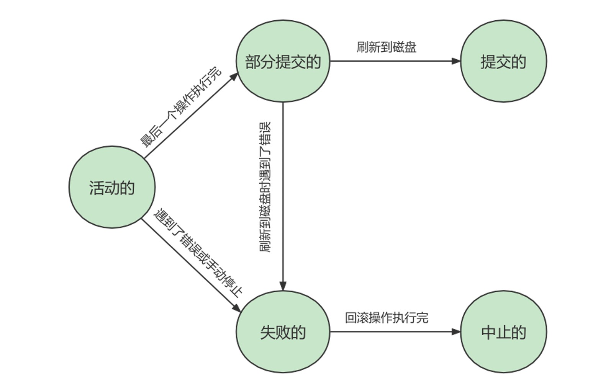
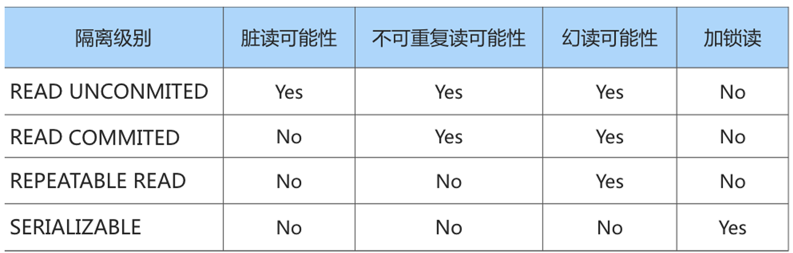
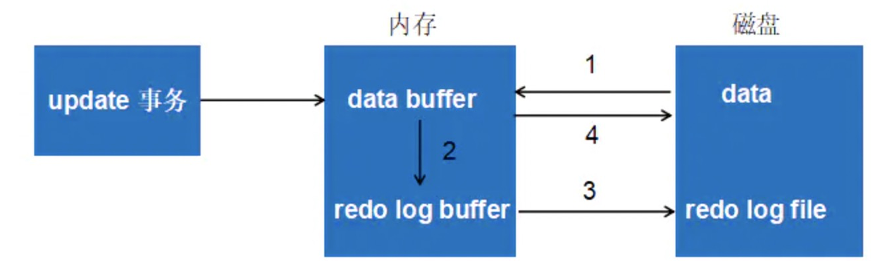
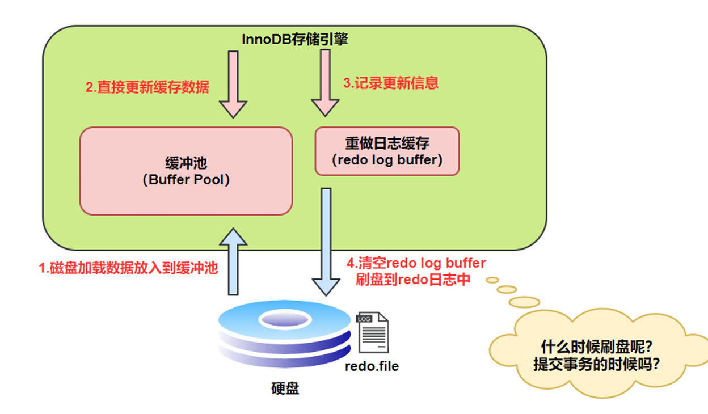
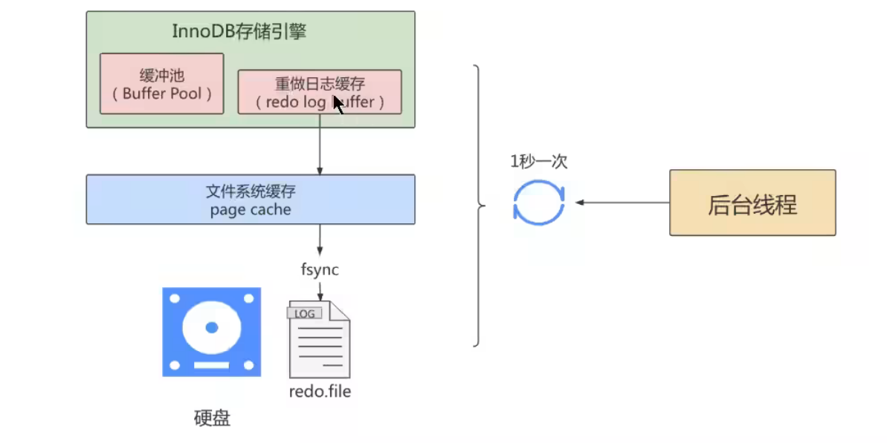
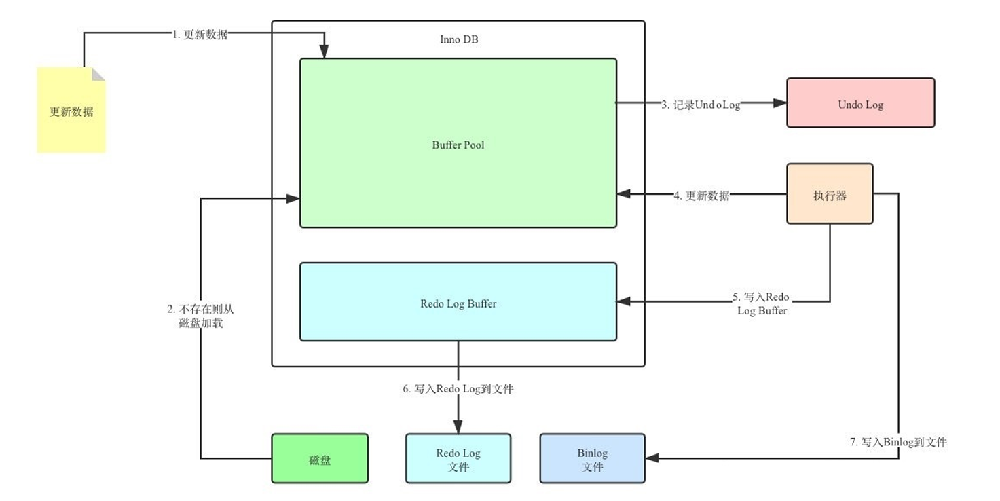

# 十五、事务

## 15.1 事务概述

通过 `show engines` 可以查看支持事务的执行引擎



**事务**：一组逻辑操作单元，使数据从一种状态变换到另一种状态，要么都执行，要么都不执行


**ACID四个特性**

**原子性（atomicity）**： 原子性是指事务是一个不可分割的工作单位，要么全部提交，要么全部失败回滚。

**一致性（consistency）**：

一致性是指事务执行前后，数据从一个 `合法性状态` 变换到另外一个 `合法性状态`。这种状态 是语义上的而不是语法上的，跟具体的业务有关。

**举例1**: A账户有200元，转账300元出去，此时A账户余额为-100元。你自然就发现了此时数据是不一致的，为什么呢?因为你定义了一个状态，余额这列必须>=0。

**举例2**: A账户200元，转账50元给B账户，A账户的钱扣了，但是B账户因为各种意外，余额并没有增加。你也知道此时数据是不一致的，为什么呢?因为你定义了一个状态，要求A+B的总余额必须不变。


**隔离性**

事务的隔离性是指`一个事务的执行 不能被其他事务干扰`，即一个事务内部的操作及使用的数据对 并发的 其他事务是隔离的，并发执行的各个事务之间不能互相干扰


**持久性**

持久性是指一个事务一旦被提交，它对数据库中数据的改变就是 永久性的，接下来的其他操作和数据库 故障不应该对其有任何影响。


## 15.3 事务的状态

我们现在知道 事务是一个抽象的概念，它其实对应着一个或多个数据库操作，MySQL根据这些操作所执 行的不同阶段把 事务大致划分成几个状态：


**活动的（active）**

事务对应的数据库操作正在执行过程中时，我们就说该事务处在 `活跃的` 状态

**部分提交的（partially committed）**

当事务中的最后一个操作执行完成，但由于操作都在内存中执行，所造成的影响并没有刷新到磁盘 时，我们就说该事务处在 部分提交的状态。

**失败的（failed）**

当事务处在 活动的或者 没有刷新到磁盘 部分提交的状态时，可能遇到了某些错误（数据库自身的错误、操作系统 错误或者直接断电等）而无法继续执行，或者人为的停止当前事务的执行，我们就说该事务处在 失 败的状态。

**中止的（aborted）**

如果事务执行了一部分而变为 失败的状态，那么就需要把已经修改的事务中的操作还原到事务执 行前的状态。换句话说，就是要撤销失败事务对当前数据库造成的影响。我们把这个撤销的过程称 之为回滚。回滚操作执行完毕时，也就是数据库恢复到了执行事务之前的状态，我们就说该事 务处在了`中止的（aborted）`


**提交的（committed）**

当一个处在 部分提交的状态的事务将修改过的数据都处 在了`提交的状态。`




## 15.4 如何使用事务

### 15.4.1 显示事务

```sql
mysql> BEGIN;
 #或者
mysql> START TRANSACTION;
```

START TRANSACTION 语句相较于 BEGIN 特别之处在于，后边能跟随几个 `修饰符`：

**① READ ONLY**：标识当前事务是一个 `只读事务` 。也就是属于该事务的数据库操作只能读取数据，而不能修改数据

**② READ WRITE**标识当前事务是一个 读写事务，也就是属于该事务的数据库操作既可以读取数据， 也可以修改数据

**③ WITH CONSISTENT SNAPSHOT** ：启动一致性读。

如果不指明，默认是 `读写事务`


### 15.4.2 隐式事务

```sql
# 使用下面语句查看自动提交是否关闭
SHOW VARIABLES LIKE 'autocommit'
 +---------------+-------+
 | Variable_name | Value |
 +---------------+-------+
 | autocommit    | ON    |
 +---------------+-------+
 1 row in set (0.01 sec)
```

当然，如果我们想关闭这种 自动提交的功能，可以使用下边两种方法之一

- 显式的的使用 START TRANSACTION 或者 BEGIN 语句开启一个事务。这样在本次事务提交或者回 滚前会暂时关闭掉自动提交的功能。
- 把系统变量 autocommit 的值设置为 OFF ，就像这样：

```sql
 SET autocommit = OFF; 
```


## 15.5 事务的隔离级别

**数据并发的问题：**

1、**脏写（ Dirty Write ）**

如果事务`Session A 修改了`另一个 `未提交事务` Session B 修改过的数据，那就意味着发生了 `脏写`

**2、脏读（ Dirty Read ）**

Session A  读取了已经被 Session B  `更新但还没有被提交的字段`。之后若是SessionB回滚， Session A 读取的内容就是 `临时且无效的`。

**3、不可重复读（ Non Repeatable Read ）**

Session A 读取了一个字段，然后 Session B 更新了该字段。之后， Session A 再次读取同一个字段， 值就不同了。那就意味着发生了不可重复读。

**4、幻读（ Phantom ）**

Session A 从一个表中读取了一个字段, 然后 Session B 在该表中 `插入`入了一些新的行。 之后, 如果 Session A 再次读取 同一个表就会多出来几行，这种现象称为`幻读`，多出来的记录称为: `幻影记录`


上面介绍了几种并发事务执行过程中可能遇到的一些问题，这些问题有轻重缓急之分，我们给这些问题 按照严重性来排一下序：

```sql
脏写 > 脏读 > 不可重复读 > 幻读
```

隔离级别越低，并 发问题发生的就越多。 SQL标准 中设立了4个 隔离级别：

**READ UNCOMMITTED** 读未提交，在该隔离级别，所有事务都可以看到其他未提交事务的执行结 果。不能避免脏读、不可重复读、幻读。

**READ COMMITTED **读已提交，一个事务只能看见已经提交事务所做 的改变。这是大多数数据库系统的默认隔离级别（但不是MySQL默认的）。可以避免脏读，但不可 重复读、幻读问题仍然存在。

**REPEATABLE READ **可重复读，事务A在读到一条数据之后，此时事务B对该数据进行了修改并提 交，那么事务A再读该数据，读到的还是原来的内容。可以避免脏读、不可重复读，但幻读问题仍 然存在。这是MySQL的默认隔离级别。

**SERIALIZABLE**：可串行化，确保事务可以从一个表中读取相同的行。在这个事务持续期间，禁止 其他事务对该表执行插入、更新和删除操作。所有的并发问题都可以避免，但性能十分低下。能避 免脏读、不可重复读和幻读

SQL标准 中规定，针对不同的隔离级别，并发事务可以发生不同严重程度的问题，具体情况如下：




**查看数据库默认的隔离级别**

```sql
SHOW VARIABLES LIKE 'transaction_isolation';
或者
SELECT @@transaction_isolation;
```

**设置隔离级别**

```sql
SET [GLOBAL|SESSION] TRANSACTION ISOLATION LEVEL 隔离级别;
 #其中，隔离级别格式：
> READ UNCOMMITTED
 > READ COMMITTED
 > REPEATABLE READ
 > SERIALIZABLE
 
 或者
 
 SET [GLOBAL|SESSION] TRANSACTION_ISOLATION = '隔离级别'
 #其中，隔离级别格式：
> READ-UNCOMMITTED
 > READ-COMMITTED
 > REPEATABLE-READ
 > SERIALIZABLE
```


**关于设置时使用GLOBAL或SESSION的影响**：

- 使用G LOBAL 关键字（在全局范围影响）：
    - 当前已经存在的会话无效
    - 只对执行完该语句之后产生的会话起作用
- 使用S ESSION 关键字（在会话范围影响）：
    - 对当前会话的所有后续的事务有效
    - 如果在事务之间执行，则对后续的事务有效
    - 该语句可以在已经开启的事务中间执行，但不会影响当前正在执行的事务


## 15.6 事务日志

事务有4种特性：原子性、一致性、隔离性和持久性。那么事务的四种特性到底是基于什么机制实现呢？

- 事务的隔离性由 `锁机制`实现。

- 而事务的原子性、一致性和持久性由事务的 `redo `日志和`undo `日志来保证。

    - `REDO LOG` 称为 重做日志，提供再写入操作，恢复提交事务修改的页操作，用来保证事务的`持 久性`。
    - `UNDO LOG` 称为 回滚日志，回滚行记录到某个特定版本，用来保证事务的`原子性、一致性`。

- REDO 和 UNDO 日志都被视作一种`恢复操作`，UNDO 很好理解，回滚之后进行恢复。而 REDO日志是如何恢复呢？

    - 首先要知道在修改数据时，会先从磁盘读取数据保存到内存中，修改的数据是内存中的数据，事后还需要刷新回磁盘，但是假设在刷新的过程中出现了宕机等异常，导致没有刷新成功，那么就会**记录在 REDO 日志中，当服务器重启时，会从REDO日志中读取数据刷新到磁盘中**。


### 15.6.1 redo 日志

#### （1）为什么需要 redo 日志呢？

- 一方面，MySQL采用`checkpoint`机制保证数据最终会被刷新到磁盘上，但是由于 `checkpoint 是定期刷新`, 所以最坏的情 况就是事务提交后，刚写完缓冲池，数据库宕机了，那么这段数据就是丢失的，无法恢复。
- 另一方面，事务包含 `持久性`的特性，就是说对于一个已经提交的事务，在事务提交后即使系统发生了崩 溃，这个事务对数据库中所做的更改也不能丢失。

那么如何保证持久性呢，最暴力的一个办法就是 `实时更新`，我只要更改内存中的数据我就刷新回磁盘, 但通常来说暴力方法都是不可取的，有俩个问题：

- **修正量与刷新磁盘工作量严重不符**
    - 磁盘与内存交互的基本单位是`页`，默认的页大小为 16KB，假设你只修改 1b 的数据，那么也要将这 16KB的数据刷新回磁盘
- **随机IO刷新慢**
    - 一个事务可能包含很多语句，即使是一条语句也可能修改许多页面，假如该事务修改的这些页面可能并不相邻，这就意味着在将某个事务修改的Bufer Pool中的页面 刷新到磁盘 时，需要进行很多的 随机I0，随机I0比顺序I0要慢，尤其对于传统的机械硬盘来说


**另一个解决方案就是 REDO 日志**, 不用把整个页的数据都刷新回磁盘，只需要记录一下被修改数据的偏移量即可。比如：，某个事务将系统表空间中 第10号 页面中偏移量为 100  处的那个字节的值 1 改成2。


#### （2）好处、特点

**好处**

- redo日志降低了刷盘频率
- redo日志占用的空间非常小

**特点**

- redo日志是顺序写入磁盘的
- 事务执行过程中，redo log不断记录


#### （3）redo组成

Redo log可以简单分为以下两个部分：

- **重做日志的缓冲 (redo log buffer)** ，保存在内存中，是易失的。
- **重做日志文件 (redo log file)** ，保存在硬盘中，是持久的。

redo log buffer 大小，默认 16M ，最大值是4096M，最小值为1M

```sql
mysql> show variables like '%innodb_log_buffer_size%';
 +------------------------+----------+
 | Variable_name          | Value    |
 +------------------------+----------+
 | innodb_log_buffer_size | 16777216 |
 +------------------------+----------+
```


#### （4）redo整体流程



```sql
第1步：先将原始数据从磁盘中读入内存中来，修改数据的内存拷贝
第2步：生成一条重做日志并写入redo log buffer，记录的是数据被修改后的值
第3步：当事务commit时，将redo log buffer中的内容刷新到 redo log file，对 redo log file采用追加写的方式
第4步：定期将内存中修改的数据刷新到磁盘中
```


#### （5）redo 刷盘策略

redo log的写入并不是直接写入磁盘的，InnoDB引擎会在写redo log的时候先写redo log buffer，之后以 `一定的频率`刷入到真正的redo log file 中。这里的一定频率怎么看待呢？这就是我们要说的刷盘策略。



注意，redo log buffer刷盘到redo log file的过程并不是真正的刷到磁盘中去，只是刷入到 `文件系统缓存 （page cache）`中去（这是现代操作系统为了提高文件写入效率做的一个优化），真正的写入会交给`系 统自己来决定`（比如page cache足够大了）。那么对于InnoDB来说就存在一个问题，如果交给系统来同 步，同样如果系统宕机，那么数据也丢失了（虽然整个系统宕机的概率还是比较小的）。


针对这种情况，InnoDB给出 `innodb_flush_log_at_trx_commit` 参数，该参数控制 commit提交事务 时，如何将 redo log buffer 中的日志刷新到 redo log file 中。它支持三种策略：

- `设置为0` ：表示每次事务提交时不进行刷盘操作。（系统默认master thread每隔1s进行一次重做日 志的同步）
- `设置为1` ：表示每次事务提交时都将进行同步，刷盘操作（ `默认值`）
- `设置为2`：表示每次事务提交时都只把 redo log buffer 内容写入 page cache，不进行同步。由`os自 己决定什么时候同步到磁盘文件`。

另外，InnoDB存储引擎有一个后台线程，`每隔1 秒`，就会把 redo log buffer 中的内容写到文件系统缓存(page cache)，然后调用刷盘操作。




### 15.6.2 undo 日志

redo log是事务持久性的保证，undo log是事务原子性的保证。在事务中 更新数据的 前置操作其实是要 先写入一个 undo log 。

#### （1）如何理解undo日志

事务需要保证 原子性，也就是事务中的操作要么全部完成，要么什么也不做。但有时候事务执行到一半 会出现一些情况，比如：

- 情况一：事务执行过程中可能遇到各种错误，比如 `服务器本身的错误`， `操作系统错误`，甚至是`突然断电`导致的错误。
- 情况二：程序员可以在事务执行过程中手动输入` ROLLBACK `语句结束当前事务的执行。

以上情况出现，我们需要把数据改回原先的样子，这个过程称之为 `回滚`，这样就可以造成一个假象：这 个事务看起来什么都没做，所以符合 `原子性`要求。

每当我们要对一条记录做改动(这里的 改动 可以指 INSERT、DELETE、UPDATE)，时。都需要“`留一手`"-- 把回滚时所需的东西记下来,比如:

- ·你插入一条记录 时，至少要把这条记录的主键值记下来，之后回滚的时候只需要把这个`主键值`对应的 记录删掉 就好了。(对于每个INSERT，InnoDB存储引擎会完成一个DELETE)
- 你删除了一条记录 ，至少要把这条记录中的`内容`都记下来，这样之后回滚时再把由这些内容组成的记录 插入到表中就好了。(对于每个DELETE，InnoDB存储引擎会执行一个INSERT)
- 你 修改了一条记录 ，至少要把修改这条记录前的`旧值`都记录下来，这样之后回滚时再把这条记录 更新为旧值 就好了。(对于每个UPDATE，InnoDB存储引擎会执行一个相反的UPDATE，将修改前的行放回去)

此外，undo log会产生redo log，也就是**undo log的产生会伴随着redo log的产生**，这是因为undo log也需要持久性的保护。


#### （2）undo日志的作用

- 作用1：回滚数据

- 作用2：MVCC
    - undo的另一个作用是MVCC，即在InnoDB存储引擎中MVCC的实现是通过undo来完成。当用户读取一行记录时，若该记录已经被其他事务占用，当前事务可以通过undo读取之前的行版本信息，以此实现非锁定读取。

#### （3）undo 日志生命周期

以下是undo+redo事务的简化过程假设有2个数值，分别为A=1和B=2，然后将A修改为3，B修改为4

```
1.start transaction;
2.记录 A=1 到undo log;
3.update A= 3;
4.记录 A=3 到redo log;

5.记录 B=2 到undo log;
6.update B= 4;
7.记录B=4 到redo log:

8.将redo log刷新到磁盘
9.commit
```

- 在1-8步骤的任意一步系统宕机，事务未提交，该事务就不会对磁上的数据做任何影响。

- 如果在8-9之间宕机，恢复之后可以选择回滚，也可以选择继续完成事务提交，因为此时redo log已经持久化,

- 若在9之后系统宕机，内存映射中变更的数据还来不及刷回磁盘，那么系统恢复之后，可以根据redo log把数据刷回磁盘。



