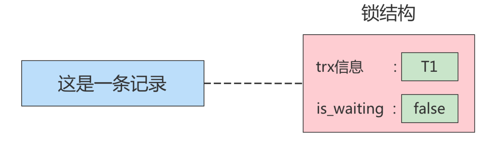
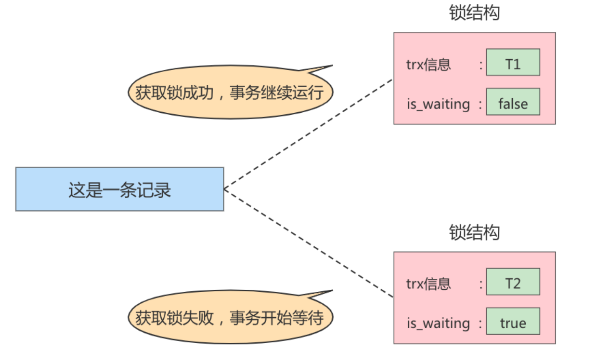
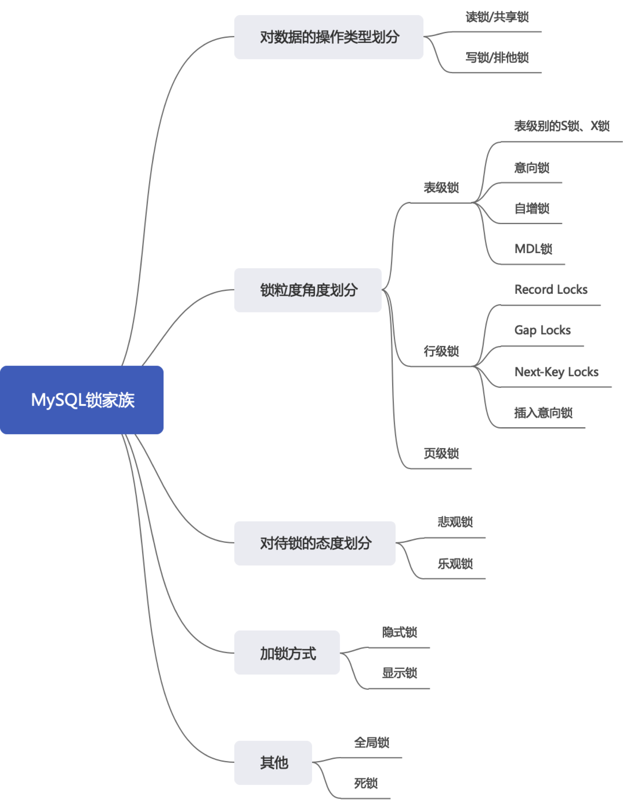
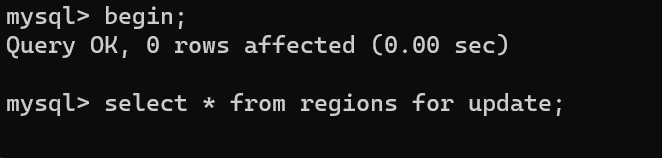
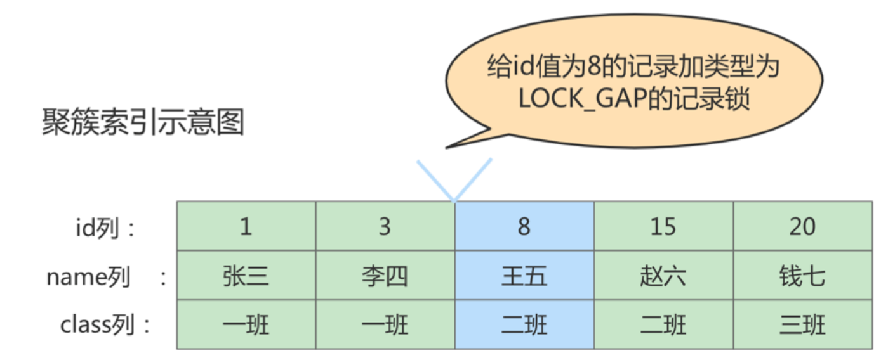
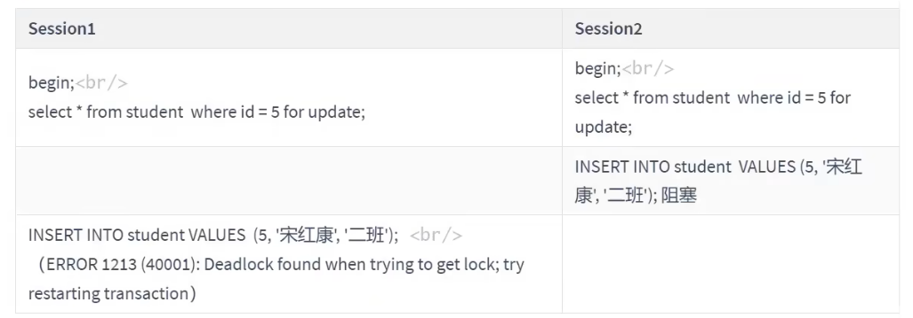
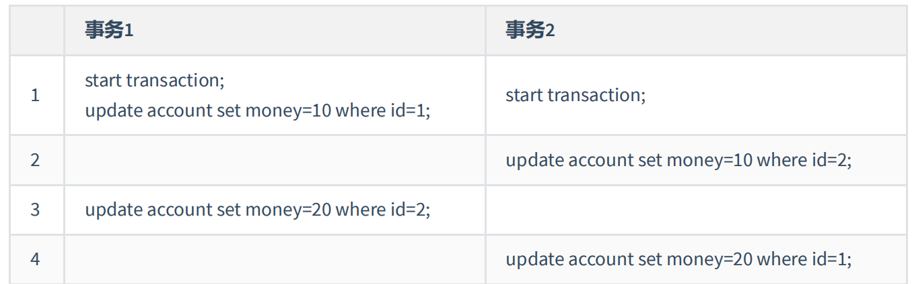

# 十六、锁

在数据库中，除传统的计算资源（如CPU、RAM、I/O等）的争用以外，数据也是一种供许多用户共享的 资源。为保证数据的一致性，需要对 `并发操作进行控制`，因此产生了`锁`。同时 **锁机制也为实现MySQL 的各个隔离级别提供了保证**。 锁冲突也是影响数据库  并发访问性能的一个重要因素。所以锁对数据库而 言显得尤其重要，也更加复杂。


## 16.1 并发事务访问相同的记录

### 16.1.1 读读的情况

读-读 情况，即并发事务相继 读取相同的记录。读取操作本身不会对记录有任何影响，并不会引起什么 问题，所以允许这种情况的发生。

### 16.1.2 写写的情况

写-写 情况，即并发事务相继对相同的记录做出改动

在这种情况下会发生` 脏写`的问题，`任何一种隔离级别都不允许这种问题的发生`。所以在多个未提交事务 相继对一条记录做改动时，需要让它们 `排队执行`，这个排队的过程其实是通过`锁`来实现的。

这个所谓 的锁其实是一个 `内存中的结构`，在事务执行前本来是没有锁的，也就是说一开始是没有`锁结构`和记录进行关联的，当一个事务想对这条记录做改动时，首先会看看内存中有没有与这条记录关联的 `锁结构`,当没有的时候就会在内存中生成一个 `锁结构` 与之关联。比如，`事务 T1` 要对这条记录做改动，就需要生成一个 锁结构与之关联：



在 锁结构 里有很多信息，为了简化理解，只把两个比较重要的属性拿了出来

- `trx信息`:代表这个锁结构是哪个事务生成的。
- `is_waiting`:代表当前事务是否在等待。

当 `事务T1` 获取锁之后，会将` is_waiting` 改为 false , 表示获取锁成功。此时若是 `事务T2` 也想对这条记录进行改动，但是此时 T1 在占着锁，因此会将` is_waiting` 改为 true，表示获取锁失败




- 不加锁
  - 意思就是不需要在内存中生成对应的 锁结构 ，可以直接执行操作。

- 获取锁成功，或者加锁成功
  - 意思就是在内存中生成了对应的 锁结构 ，而且锁结构的 **is_waiting 属性为 false** ，也就是事务可以继续执行操作。

- 获取锁失败，或者加锁失败，或者没有获取到锁
  - 意思就是在内存中生成了对应的 锁结构 ，不过锁结构的 **is_waiting 属性为 true** ，也就是事务需要等待，不可以继续执行操作。


### 16.1.3 读写或写读的情况

读-写 或 写-读 ，即一个事务进行读取操作，另一个进行改动操作。这种情况下可能发生 脏读 、 不可重复读 、 幻读 的问题。

各个数据库厂商对 SQL标准 的支持都可能不一样。比如MySQL在 REPEATABLE READ 隔离级别上就已经解决了 幻读 问题。


### 16.1.4 并发问题的解决方案

怎么解决 `脏读 、 不可重复读 、 幻读` 这些问题呢？其实有两种可选的解决方案：

- 方案一：读操作利用`多版本并发控制（ MVCC ，下章讲解）`，写操作进行 `加锁 `。
- 方案二：读、写操作都采用 加锁 的方式。

所谓的 MVCC，就是生成一个`ReadView`，通过ReadView找到符合条件的记录版本(历史版本由undo日志 构建)。查询语句`只能读 到在生成Readview之前已提交事务所做的更改`，在生成ReadView之前未提交的事务或者之后才开启的事务所做的更改是看不到的。

> 普通的SELECT语句在READ COMMITTED和REPEATABLE READ隔离级别下会使用到MVCC读取记录。
>
> - 在 `READ COMMITTED` 隔离级别下，一个事务在执行过程中每次执行SELECT操作时都会生成一个ReadView，ReadView的存在本身就保证了 `事务不可以读取到未提交的事务所做的更改` ，也就是避免了脏读现象；
> - 在 `REPEATABLE READ` 隔离级别下，一个事务在执行过程中只有 `第一次执行SELECT操作` 才会生成一个ReadView，之后的SELECT操作都 `复用` 这个ReadView，这样也就避免了不可重复读和幻读的问题。


像读写都加锁的方式，显然效率比较低，除非一些特殊场景，比如`银行存钱`， 首先要从数据库读取金额，此时加锁，在更改完之前不允许别的事务进行操作。而大部分采用第一种方案效率会更高！


## 16.2 锁的不同角度的分类




### 16.2.1 读锁、写锁

- **读锁** ：也称为 `共享锁` 、英文用 `S` 表示。针对同一份数据，多个事务的读操作可以同时进行而不会互相影响，相互不阻塞的。
- **写锁** ：也称为 `排他锁` 、英文用 `X `表示。当前写操作没有完成前，它会阻断其他写锁和读锁。这样就能确保在给定的时间里，只有一个事务能执行写入，并防止其他用户读取正在写入的同一资源。

**需要注意的是对于InnoDB引擎来说，读锁和写锁可以加在表上，也可以加在行上。**

**读操作可以加读锁，也可以加写锁，但是写操作只能加写锁**

- 为读操作增加读锁

```sql
SELECT LOCK IN SHARE MODE ;
#或
SELECT FOR SHARE;#(8.0新增语法)
```

- 为读操作增加写锁

```sql
SELECT FOR UPDATE
```


**演示为读操作增加写锁被阻塞**：

1、首先启动俩个客户端C1，C2

2、在C1中开始事务并为读操作增加 写锁

```sql
mysql> begin;
Query OK, 0 rows affected (0.00 sec)

mysql> select * from regions for update;
+-----------+------------------------+
| region_id | region_name            |
+-----------+------------------------+
|         1 | Europe                 |
|         2 | Americas               |
|         3 | Asia                   |
|         4 | Middle East and Africa |
+-----------+------------------------+
4 rows in set (0.00 sec)
```


3、可以看到C1读取成功，此时由于没有提交事务。C2也执行读操作访问相同记录，并且增加写锁，此时就可以看到C2被阻塞




### 16.2.2 表级锁、页锁、行级锁

为了尽可能提高数据库的并发度，`每次锁定的数据范围越小越好`，理论上每次只锁定当前操作的数据的方案会得到最大的并发度，但是`管理锁是很 耗资源 `的事情(涉及获取、检査、释放锁等动作)。因此数据库系统需要在 `高并发响应`和 `系统性能` 两方面进行平衡，这样就产生了“`锁粒度(Lock granularity)`”的概念。


#### （1）表级锁

##### ① 表级别的S锁、X锁

由于 InnoDB 引擎中提供了` 锁粒度` 更细的`行级锁` ，因此在 InnoDB中执行SELECT、INSERT、DELETE

UPDATE语句时，InnoDB存储引擎是不会为这个表添加表级别的 `S锁` 或者 `X锁`的.

但是在对某个表执行一些诸如 `ALTER TABLE 、 DROP TABLE` 这类的 DDL 语句时，其他事务对这个表并发执行诸如`SELECT、INSERT、DELETE、UPDATE`的语句会发生阻塞。这个过程其实是通过在 `server层 `使用一种称之为 `元数据锁 `（英文名： Metadata Locks ，简称 MDL ）结构来实现的。

**设置S、X锁**

```sql
LOCK TABLES t READ ：InnoDB存储引擎会对表 t 加表级别的 S锁 。
LOCK TABLES t WRITE ：InnoDB存储引擎会对表 t 加表级别的 X锁 。
unlock tables; 释放锁
```

**针对表级锁的操作情况**


##### ① 意向锁

InnoDB 支持 `多粒度锁（multiple granularity locking`） ，它允许 `行级锁`与 `表级锁` 共存，而**意向锁**就是其中的一种 `表锁` 。

**作用**

假设有俩个事务 T1、T2，其中T2试图增加表级锁，如果没有意向锁的存在，那么T2就需要去检查每行或者每页是否存在锁，如果数据比较多，这无疑是浪费时间的。如果存在意向锁，那么此时T2就会被阻塞，避免了不要的检查！

**特点**

1、意向锁的存在是为了`协调行锁和表锁的关系`，支持多粒度(表锁与行锁)的锁并存。

2、意向锁是一种 `不与行级锁冲突表级锁`，这一点非常重要。

3、表明“某个事务正在某些行持有了锁或该事务准备去持有锁”


在数据表的场景中，**如果我们给某一行数据加上了排它锁，数据库会自动给更大一级的空间，比如数据页或数据表加上意向锁，告诉其他人这个数据页或数据表已经有人上过排它锁了**

意向锁分为俩种：

**意向共享锁**（intention shared lock, IS）：事务有意向对表中的某些行加**共享锁**（S锁）

```sql
-- 事务要获取某些行的 S 锁，必须先获得表的 IS 锁。
SELECT column FROM table ... LOCK IN SHARE MODE;
```

**意向排他锁**（intention exclusive lock, IX）：事务有意向对表中的某些行加**排他锁**（X锁）

```sql
-- 事务要获取某些行的 X 锁，必须先获得表的 IX 锁。
SELECT column FROM table ... FOR UPDATE;
```

即：意向锁是由存储引擎 自己维护的 ，**用户无法手动操作意向锁**，在为数据行加共享 / 排他锁之前，InooDB 会先获取该数据行 所在数据表的对应意向锁 。

**意向锁是兼容的，但是他会与普通的 共享锁/排它锁互斥**：


**演示意向锁质检互相兼容的情况：**

1、启动俩个客户端C1、C2

2、C1中开启事务，对其中一条数据设置X锁，此时InnoDB自动生成了一个IX

```sql
mysql> begin;
Query OK, 0 rows affected (0.00 sec)

mysql> select * from regions where region_id = 4 for update;
+-----------+------------------------+
| region_id | region_name            |
+-----------+------------------------+
|         4 | Middle East and Africa |
+-----------+------------------------+
1 row in set (6.34 sec)

mysql>
```


3、在C2中开启事务，对另外一条数据设置X锁，此时InnoDB自动生成了一个IX，并且成功访问到了数据

```sql
mysql> begin;
Query OK, 0 rows affected (0.00 sec)

mysql> select * from regions where region_id = 3 for update;
+-----------+-------------+
| region_id | region_name |
+-----------+-------------+
|         3 | Asia        |
+-----------+-------------+
1 row in set (0.00 sec)

mysql>
```


##### ③ 自增锁

自增锁是一种比较特殊的**表级锁**。并且在事务向包含了 `AUTO_INCREMENT` 列的表中新增数据时就会去持有自增锁，假设事务 A 正在做这个操作，如果另一个事务 B 尝试执行 `INSERT`语句，事务 B 会被阻塞住，直到事务 A 释放自增锁。（其实这么说是有些不准确的，因为自增锁有三种模式，每一种模式的处理方式不同）

- **传统模式（Traditional）**
  - 当我们向包含了 `AUTO_INCREMENT` 列的表中插入数据时，都会持有这么一个特殊的表锁——自增锁（AUTO-INC），并且当语句执行完之后就会释放。这样一来可以保证单个语句内生成的自增值是连续的。但是弊端就是 `并发性能差` ,因为要一条一条执行
- **连续模式（Consecutive）**
  - 在锁模式处于连续模式下时，如果 `INSERT` 语句能够提前确定插入的数据量，则可以不用获取自增锁，举个例子，像 `INSERT INTO` 这种简单的、能提前确认数量的新增语句，就不会使用自增锁
- **交叉模式（Interleaved）**
  - 交叉模式（Interleaved）下，所有的 `INSERT` 语句，包含 `INSERT` 和 `INSERT INTO ... SELECT` ，都不会使用 `AUTO-INC` 自增锁，而是使用较为轻量的 `mutex`  锁。这样一来，多条 `INSERT` 语句可以并发的执行，这也是三种锁模式中扩展性最好的一种。

##### ④ 元数据锁（MDL）

MySQL5.5引入了 `meta data lock`，简称MDL锁，属于表锁范畴。MDL 的作用是，`保证读写的正确性`

比如，如果一个查询正在遍历一个表中的数据，而执行期间另一个线程对这个 表结构做变更 ，增加了一

列，那么查询线程拿到的结果跟表结构对不上，肯定是不行的。

因此，**当对一个表做增删改查操作的时候，MYSQL会自动加上 MDL 读锁，对表结构进行修改时，会自动加上 MDL 写锁**


#### （2）InnoDB中的行锁

行锁(Row Lock)也称为`记录锁`，顾名思义，就是锁住某一行(某条记录 row)。需要的注意的是，MySQL服务器层并没有实现行锁机制，行级锁只在存储引擎层实现

**优点**: 锁定力度小，发生 `锁冲突概率低`，可以实现的 `并发度高`，

**缺点**: 对于 `锁的开销比较大`，加锁会比较慢，容易出现 `死锁` 情况。

InnoDB与MyISAM的最大不同有两点: 一是支持事务(TRANSACTION);二是采用了行级锁。


##### ① 记录锁(Record Locks)

记录锁也就是仅仅把一条记录锁上，官方的类型名称为： `LOCK_REC_NOT_GAP` 。比如我们把id值为8的

那条记录加一个记录锁的示意图如图所示。仅仅是锁住了id值为8的记录，对周围的数据没有影响。


记录锁是有S锁和X锁之分的，称之为 `S型记录锁` 和 `X型记录锁` 。

- 当一个事务获取了一条记录的S型记录锁后，其他事务也可以继续获取该记录的S型记录锁，但不可以继续获取X型记录锁；
- 当一个事务获取了一条记录的X型记录锁后，其他事务既不可以继续获取该记录的S型记录锁，也不可以继续获取X型记录锁。


##### ② 间隙锁(Gap Locks)

**gap锁的提出仅仅是为了防止插入幻影记录而提出的**。虽然有 `共享gap锁` 和 `独占gap锁` 这样的说法，但是它们起到的作用是相同的。而且如果对一条记录加了gap锁(不论是共享gap锁还是独占gap锁)，并**不会限制其他事务对这条记录加记录锁或者继续加gap锁**。

比如，把id值为8的那条记录加一个gap锁的示意图如下。




图中id值为8的记录加了gap锁，意味着 **不允许别的事务在id值为8的记录前边的间隙插入新记录** ，其实就是id列的值(3, 8)这个区间的新记录是不允许立即插入的。

若在id值为25的记录增加间隙锁，则 id在 (20,+∞) 这个区间的记录都不允许增加！


**间隙锁的引入，可能会导致同样的语句锁住更大的范围，这其实是影响了并发度的。下面的例子会产生 死锁**



由于都为5增加了间隙锁，双方都会等待对方先释放锁而导致死锁！


##### ③ 临键锁(Next-Key Locks)

有时候我们既想 `锁住某条记录` ，又想 `阻止其他事务在该记录前边的间隙插入新记录` ，所以InnoDB就提出了一种称之为 Next-Key Locks 的锁，官方的类型名称为： `LOCK_ORDINARY` ，我们也可以简称为next-key锁 。Next-Key Locks是在存储引擎 innodb 、事务级别在 可重复读 的情况下使用的数据库锁，innodb默认的锁就是Next-Key locks。

```sql
select * from student where id <=8 and id > 3 for update;
```


##### ④ 插入意向锁(Insert Intention Locks)

我们说一个事务在 插入 一条记录时需要判断一下插入位置是不是被别的事务加了 gap锁（next-key锁也包含 gap锁 ），如果有的话，插入操作需要等待，直到拥有 gap锁 的那个事务提交。但是**InnoDB规定事务在等待的时候也需要在内存中生成一个锁结构**，表明有事务想在某个 `间隙` 中 `插入` 新记录，但是现在在等待。InnoDB就把这种类型的锁命名为`Insert Intention Locks` ，官方的类型名称为：LOCK_INSERT_INTENTION ，我们称为 `插入意向锁` 。插入意向锁是一种 `Gap锁` ，不是`意向锁`，在insert操作时产生


### 16.2.3 页锁

页锁就是在` 页的粒度 `上进行锁定，锁定的数据资源比行锁要多，因为一个页中可以有多个行记录。当我们使用页锁的时候，会出现数据浪费的现象，但这样的浪费最多也就是一个页上的数据行。**页锁的开销介于表锁和行锁之间，会出现死锁。锁定粒度介于表锁和行锁之间，并发度一般。**

`每个层级的锁数量是有限制的`，因为锁会占用内存空间， 锁空间的大小是有限的 。当某个层级的锁数量超过了这个层级的阈值时，就会进行 `锁升级` 。锁升级就是用更大粒度的锁替代多个更小粒度的锁，比如InnoDB 中行锁升级为表锁，这样做的好处是占用的锁空间降低了，但同时数据的并发度也下降了。


#### 1、悲观锁、乐观锁

从对待锁的态度来看锁的话，可以将锁分成`乐观锁`和`悲观锁`，从名字中也可以看出这两种锁是两种看待数据并发的思维方式 。需要注意的是，**乐观锁和悲观锁并不是锁，而是锁的 设计思想** 。


##### 悲观锁

悲观锁总是假设最坏的情况，每次去拿数据的时候都认为别人会修改，所以每次在拿数据的时候都会上锁，这样别人想拿这个数据就会 阻塞 直到它拿到锁（**共享资源每次只给一个线程使用，其它线程阻塞，用完后再把资源转让给其它线程**）。比如行锁，表锁等，读锁，写锁等，都是在做操作之前先上锁，当其他线程想要访问数据时，都需要阻塞挂起。Java中的`synchronized` 和` ReentrantLock` 等独占锁就是悲观锁思想的实现


##### 乐观锁

乐观锁认为对同一数据的并发操作不会总发生，属于小概率事件，不用每次都对数据上锁，但是在更新的时候会判断一下在此期间别人有没有去更新这个数据，也就是**不采用数据库自身的锁机制，而是通过程序来实现**。在程序上，我们可以采用 `版本号机制` 或者` CAS机制` 实现。**乐观锁适用于多读的应用类型，这样可以提高吞吐量**。在Java中 `java.util.concurrent.atomic` 包下的原子变量类就是使用了乐观锁的一种实现方式：CAS实现的。

#### 俩种锁的使用场景

1. `乐观锁` 适合 `读操作多` 的场景，相对来说写的操作比较少。它的优点在于 程序实现 ， 不存在死锁问题，不过适用场景也会相对乐观，因为它阻止不了除了程序以外的数据库操作。

2. `悲观锁` 适合 `写操作多` 的场景，因为写的操作具有 排它性 。采用悲观锁的方式，可以在数据库层面阻止其他事务对该数据的操作权限，防止 读 - 写 和 写 - 写 的冲突。


### 16.2.4 其他锁

#### 1、全局锁

全局锁就是对 `整个数据库实例加锁`。当你需要让整个库处于 `只读状态` 的时候，可以使用这个命令，之后其他线程的以下语句会被阻塞：数据更新语句（数据的增删改）、数据定义语句（包括建表、修改表结构等）和更新类事务的提交语句。全局锁的典型使用 场景 是：`做 全库逻辑备份` 。

```sql
Flush tables with read lock
```


#### 2、死锁

死锁是指两个或多个事务在同一资源上相互占用，并请求锁定对方占用的资源，从而导致恶性循环。死锁示例：



**死锁产生的条件**：

1、两个或者两个以上事务

2、每个事务都已经持有锁并且申请新的锁

3、锁资源同时只能被同一个事务持有或者不兼容

4、事务之间因为持有锁和申请锁导致彼此循环等待

**解决策略**：

- 一种策略是，直接进入等待，直到超时。这个超时时间可以通过参数`innodb_lock_wait_timeout `来设置。
- 另一种策略是，发起死锁检测，发现死锁后，`主动回滚`死锁链条中的某一个事务（将持有最少行级排他锁的事务进行回滚），让其他事务得以继续执行。将参数`innodb_deadlock_detect` 设置为on ，表示开启这个逻辑。

**如何避免死锁**

- 合理设计索引，使业务 SQL尽可能通过索引定位更少的行，减少锁竞争。

- 调整业务逻辑 SQL 执行顺序，避免 update/delete 长时间持有锁的 SQL 在事务前面。

- 避免大事务，尽量将大事务拆成多个小事务来处理，小事务缩短锁定资源的时间，发生锁冲突的几率也更

