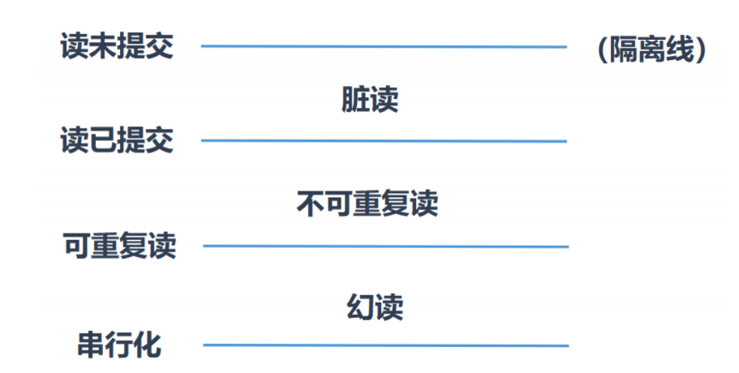
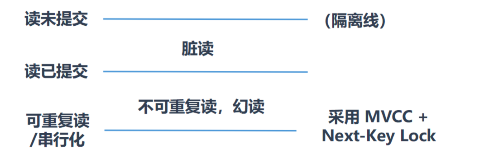
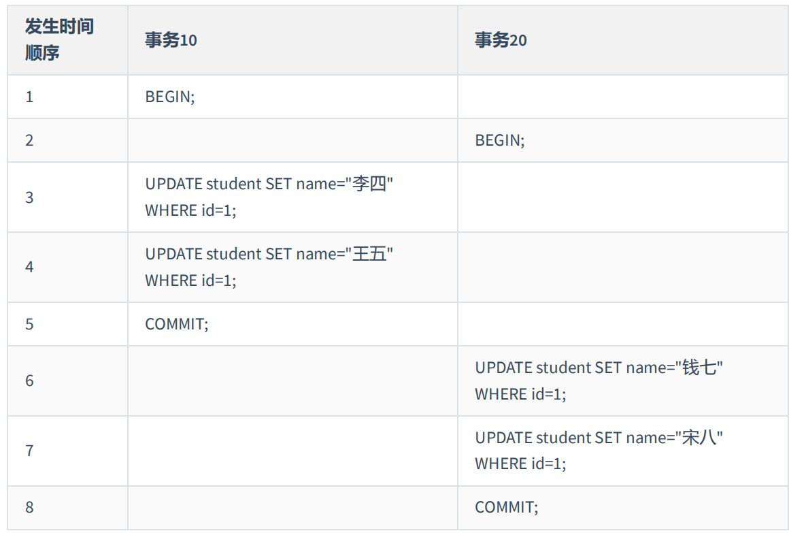
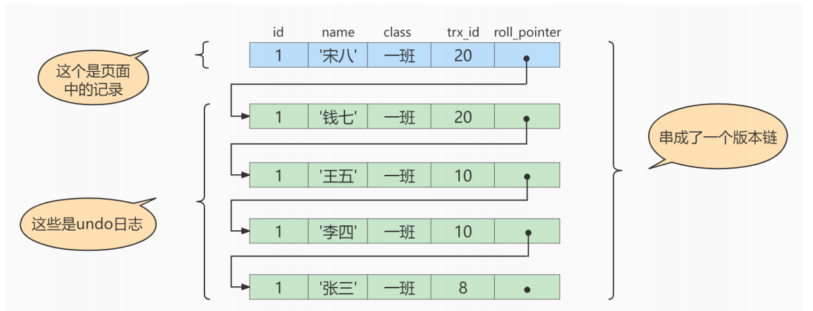
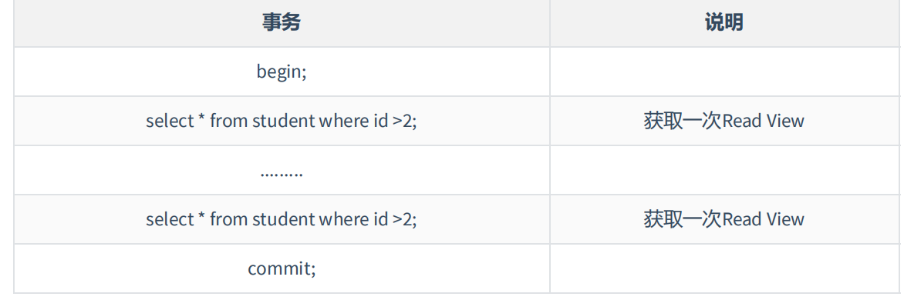
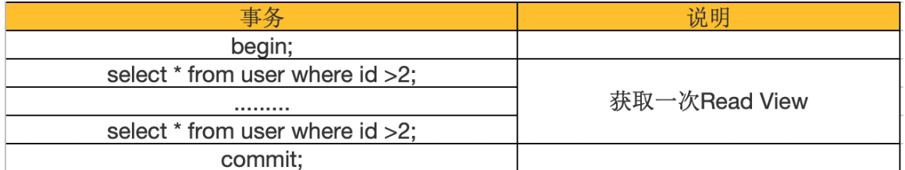
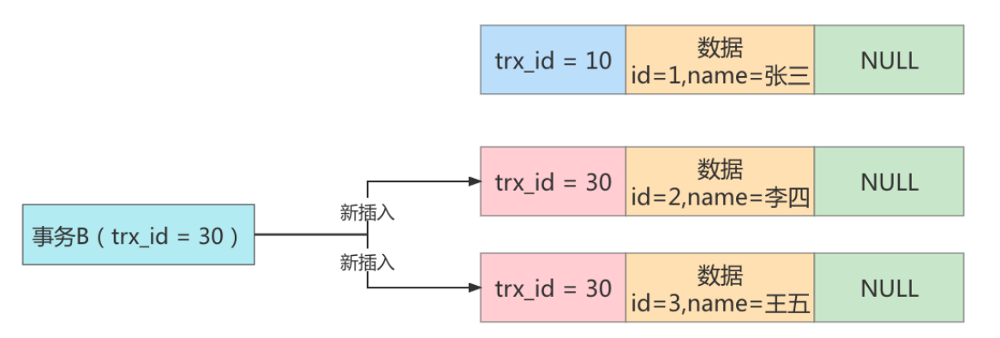

# 十七、MVCC

## 17.1 什么是MVCC

MVCC （Multiversion Concurrency Control），多版本并发控制。顾名思义，MVCC 是通过`数据行的多个版本管理`来实现数据库的 并发控制 。这项技术使得在InnoDB的事务隔离级别下执行 `一致性读` 操作有了保证。

多个版本： 指undo日志中保存的被事务修改的行信息


## 17.2 快照读和当前读

MVCC在MySQL InnoDB中的实现主要是为了提高数据库并发性能，用更好的方式去处理 `读-写冲突` ，做到即使有读写冲突时，也能做到 `不加锁` ， 非阻塞并发读 ，而这个读指的就是 `快照读` , 而非 当前读 。`当前读实际上是一种加锁`的操作，是悲观锁的实现。而MVCC本质是采用乐观锁思想的一种方式。

**快照读**

快照读又叫一致性读，读取的是快照数据。**不加锁的简单的SELECT都属于快照读**，即不加锁的非阻塞读；比如这样：

```sql
SELECT * FROM player WHERE ...
```


**当前读**

当前读读取的是记录的最新版本（最新数据，而不是历史版本的数据），读取时还要保证其他并发事务不能修改当前记录，会对读取的记录进行加锁。**加锁的 SELECT，或者对数据进行增删改**都会进行当前读。比如

```sql
SELECT * FROM student LOCK IN SHARE MODE; # 共享锁
SELECT * FROM student FOR UPDATE; # 排他锁
INSERT INTO student values ... # 排他锁
DELETE FROM student WHERE ... # 排他锁
UPDATE student SET ... # 排他锁
```


## 17.3 复习

### 17.3.1 再谈隔离级别

四个隔离级别可以解决的并发问题如下：

读未提交不能解决 `脏读、不可重复读、幻读`

读已提交解决了`脏读`

可重复读解决了`脏读、不可重复读`

串行化解决以上三种并发问题！



这仅仅是MySQL中定义的标准，但实际上在MySQL中 `可重复读`，已经解决了`幻读`, 靠的就是 MVCC。




### 17.3.2 隐藏字段、UNDO日志版本链

回顾一下undo日志的版本链，对于使用 InnoDB 存储引擎的表来说，它的聚簇索引记录中都包含两个必要的隐藏列：

- `trx_id` ：每次一个事务`对某条聚簇索引记录进行改动`时，都会把该事务的 事务id 赋值给`trx_id` 隐藏列。
- `roll_pointer` ：每次对某条聚簇索引记录进行改动时，都会把旧的版本写入到 undo日志 中，然后这个隐藏列就相当于一个指针，可以通过它来找到该记录修改前的信息。


> insert undo只在事务回滚时起作用，当事务提交后，该类型的undo日志就没用了，它占用的UndoLog Segment也会被系统回收（也就是该undo日志占用的Undo页面链表要么被重用，要么被释放）。


假设之后两个事务id分别为 10 、 20 的事务对这条记录进行 UPDATE 操作，操作流程如下：



每次对记录进行改动，都会记录一条undo日志，每条undo日志也都有一个 roll_pointer 属性（ **INSERT 操作对应的undo日志没有该属性，因为该记录并没有更早的版本**），可以将这些 undo日志都连起来，串成一个链表：




## 17.4 MVCC实现原理之ReadView

MVCC 的实现依赖于：**隐藏字段、Undo Log、Read View**。


### 17.4.1 什么是ReadView

在 MVCC机制中，多个事务对同一个行记录进行更新会产生多个历史快照，这些历史快照保存在` Undo Log`里。如果一个事务想要查询这个行记录，需要读取哪个版本的行记录呢? 这时就需要用到 ReadView 了，它帮我们解决了行的可见性问题，

Readview 就是事务A在**使用MVCC机制进行快照读操作时产生的读视图**。当事务启动时，会**生成数据库系统当前的一个快照**，InnoDB为每个事务构造了一个数组，用来记录并维护系统当前`活跃事务` 的ID(“活跃”指的就是，启动了但还没提交)。

> ReadView是和事务一一对应的！并且只有活跃的事务才会有 ReadView ，谨记！！！


### 17.4.2 设计思路

使用 `READ UNCOMMITTED `隔离级别的事务，由于可以读到未提交事务修改过的记录，所以直接读取记录的最新版本就好了(没有使用到MVCC)。

使用 `SERIALIZABLE `隔离级别的事务，InnoDB规定使用加锁的方式来访问记录。(没有使用到MVCC)


使用 `READ COMMITTED` 和 `REPEATABLE READ` 隔离级别的事务，都必须保证读到 已经提交了的 事务修改过的记录。假如另一个事务已经修改了记录但是尚未提交，是不能直接读取最新版本的记录的。

核心问题就是**需要判断一下版本链中的哪个版本是当前事务可见的，这是ReadView要解决的主要问题。**

**这个ReadView中主要包含4个比较重要的内容，分别如下**：

1、`creator_trx_id `，创建这个 Read View 的事务 ID。

> 说明：只有在对表中的记录做改动时（执行INSERT、DELETE、UPDATE这些语句时）才会为事务分配事务id，否则在一个**只读事务中的事务id值都默认为0**。

2、`trx_ids` ，表示在生成ReadView时当前系统中`活跃`的读写事务的 事务id列表

3、`up_limit_id `，活跃的事务中最小的事务 ID。

4、`low_limit_id `，表示生成ReadView时系统中应该分配给下一个事务的 id 值。low_limit_id 是**系统最大的事务id值**，这里要注意是系统中的事务id，需要区别于正在活跃的事务ID。

> trx_ids 为活跃的事务Id列表，low_limit_id 包括系统中已经提交的事务ID，比如：活跃的事务Id有 1,2 , 提交的事务ID有 3,4。 那么low_limit_id的值就是5。


### 17.4.3 ReadView规则

有了这个ReadView，这样在访问某条记录时，只需要按照下边的步骤判断记录的某个版本是否可见：

- 如果`被访问版本的trx_id属性值与ReadView中的 creator_trx_id 值相同`，意味着当前事务在访问它自己修改过的记录，所以该版本`可以被当前事务访问`。
- 如果`被访问版本的trx_id属性值小于ReadView中的 up_limit_id 值`，表明生成该版本的事务在当前事务生成ReadView前已经提交，所以该版本`可以被当前事务访问`。
- 如果`被访问版本的trx_id属性值大于或等于ReadView中的 low_limit_id 值`，表明生成该版本的事务在当前事务生成ReadView后才开启，所以该版本`不可以被当前事务访问`。
- 如果`被访问版本的trx_id属性值在ReadView的 up_limit_id 和 low_limit_id 之间`，那就需要判断一下trx_id属性值是不是在 trx_ids 列表中。
    - 如果在，说明创建ReadView时生成该版本的事务还是活跃的，该版本不可以被访问。
    - 如果不在，说明创建ReadView时生成该版本的事务已经被提交，该版本可以被访问。

> 总结起来就是访问最新提交的快照！


### 17.4.4 MVCC整体操作流程

1、首先获取事务自己的版本号，也就是事务 ID；

2、 获取 ReadView；

3、查询得到的数据，然后与 ReadView 中的事务版本号进行比较；

4、如果不符合 ReadView 规则，就需要从 Undo Log 中获取历史快照；

5、最后返回符合规则的数据。

> Innodb中，MVCC是通过 Undo Log+ ReadView 进行数据获取，Undo Log保存了历史快照，而ReadView帮我们判断是否可以读取！

在隔离级别为**读已提交（Read Committed）**时，一个事务中的每一次 SELECT 查询都会重新获取一次 Read View。



> 读已提交:  只能读取其他事物提交过后的数据
>
> 相同SQL查询也会重新获取一次 ReadView，如果俩次 ReadView 的不一样，就有可能导致幻读、不可重复读的问题！


当隔离级别为`可重复读`的时候，就避免了不可重复读，这是因为一个事务只在第一次 SELECT 的时候会获取一次 Read View，而后面所有的 SELECT 都会复用这个 Read View，如下表所示：




## 17.5 如何解决幻读

假设现在表 student 中只有一条数据，数据内容中，主键 id=1，隐藏的 trx_id=10，它的 undo log 如下图所示。


假设现在有事务 A 和事务 B 并发执行， 事务 A 的事务 id 为` 20` ， 事务 B 的事务 id 为` 30` 。

**事务A开始第一次查询**

```sql
select * from student where id >= 1;
```

在开始查询之前，MySQL 会为事务 A 产生一个 ReadView，此时 ReadView 的内容如下： `trx_ids=[20,30] ， up_limit_id=20 ， low_limit_id=31 ， creator_trx_id=20 `。

此时SQL语句查询出来id=1的一条数据，然后根据ReadView判断是否可以被访问：

- trx = 1，小于up_limit_id ，说明在生成ReadView之前已经被提交，因此可以被访问

**结果**：第一次查询出 id = 1 的数据

**事务B执行插入操作**

```sql
insert into student(id,name) values(2,'李四');
insert into student(id,name) values(3,'王五');
```

此时`student` 表中有三条数据：



**事务A开始第二次查询**

```sql
select * from student where id >= 1;
```

由于隔离级别为 `可重复读`，此时并不会重新生成 ReadView，三条数据都符合`Where` 条件，都会被查询出来，然后根据ReadView判断哪个版本可以被访问：

- 首先 id = 3，trx_id = 30 ， 在 trx_ids=[20,30] 之间，说明此时的 trx_id = 30 为活跃状态，因此不可以被访问
- id = 2，trx_id = 30 和上面同理，不可以被访问
- id = 1，可以被访问

**结果**：第二次查询出 id = 1 的数据，解决了幻读问题！


## 17.6 总结

**MVCC可以解决**

- **读写之间阻塞的问题**：通过 MVCC 可以让读写互相不阻塞，即读不阻塞写，写不阻塞读，这样就可以提升事务并发处理能力。
- **降低了死锁的概率** ：这是因为 MVCC 采用了乐观锁的方式，读取数据时并不需要加锁，对于写操作，也只锁定必要的行。
- **解决快照读的问题**：当我们查询数据库在某个时间点的快照时，只能看到这个时间点之前事务提交更新的结果，而不能看到这个时间点之后事务提交的更新结果。


# 
