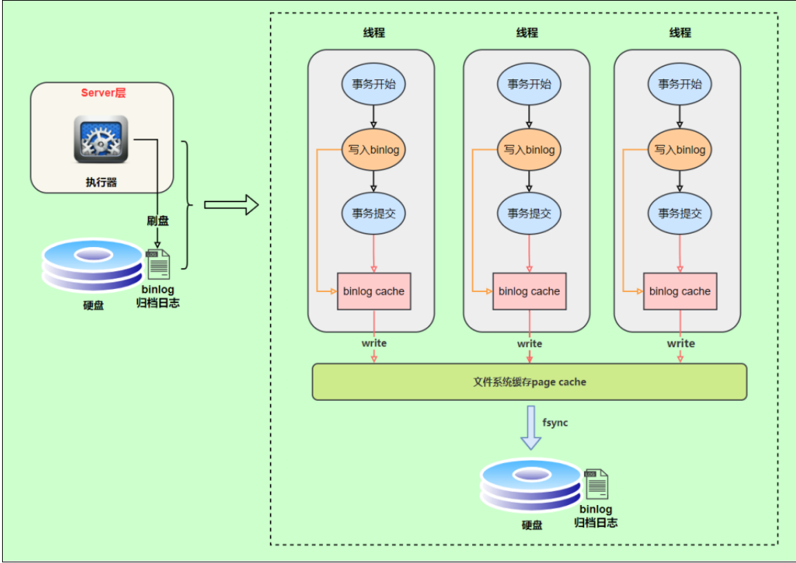
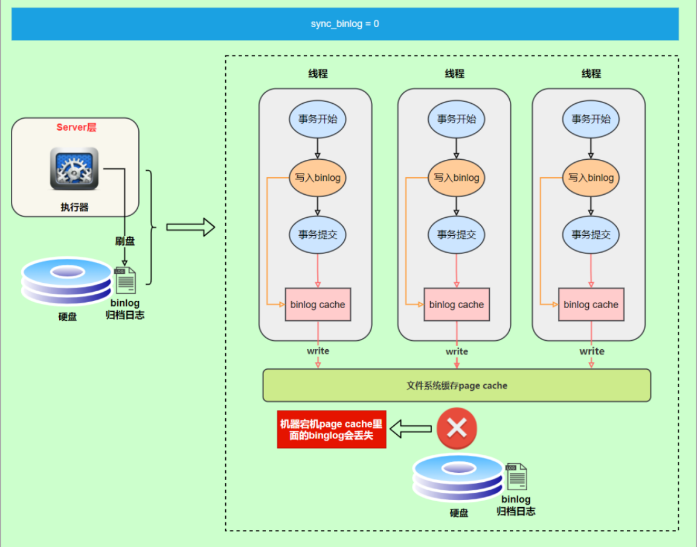
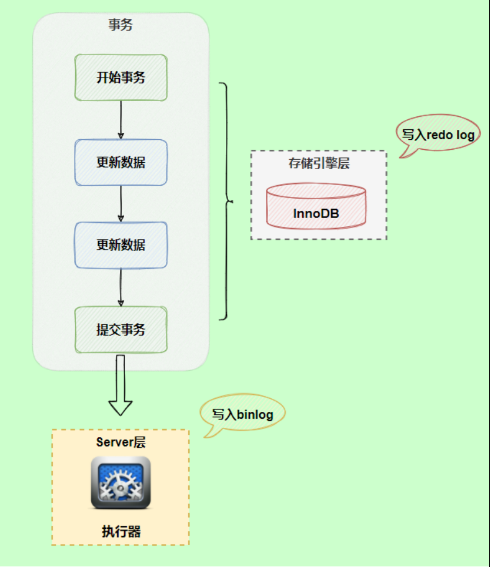
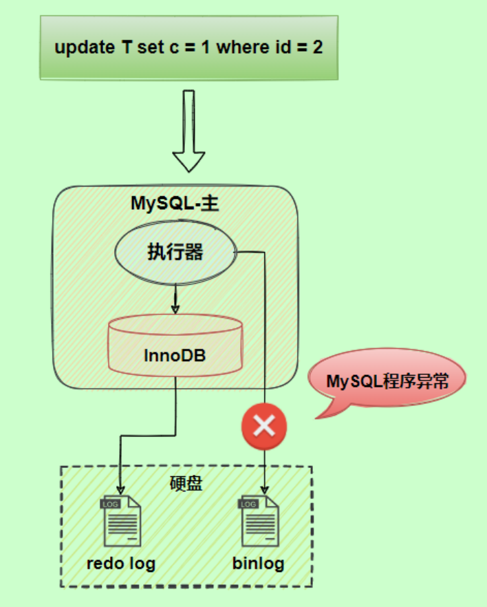
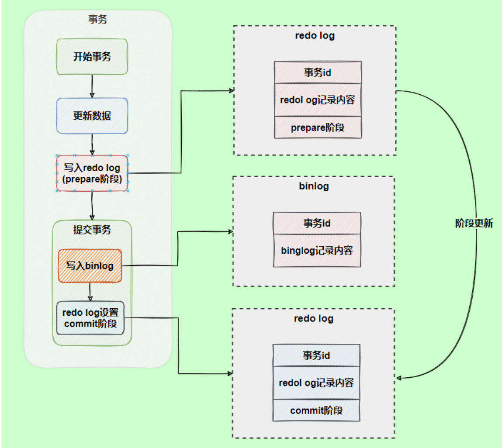
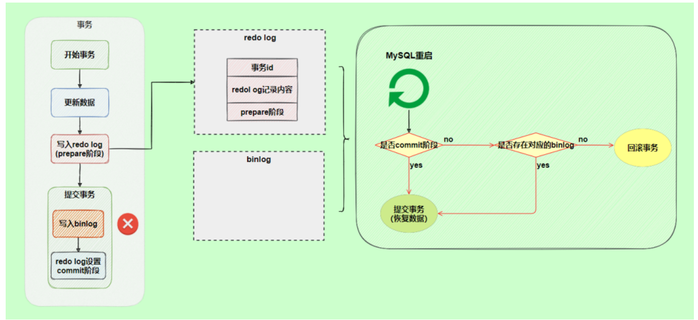

# 十八、日志

## 18.1 日志类型

MySQL有不同类型的日志文件，用来存储不同类型的日志，分为` 二进制日志、 和慢查 错误日志、 通用查询日志 询日志`，这也是常用的4种。MySQL 8又新增两种支持的日志： `中继日志和 数据定义语句日志`。使 用这些日志文件，可以查看MySQL内部发生的事情。

- **慢查询日志：**记录所有执行时间超过long_query_time的所有查询，方便我们对查询进行优化。
- **通用查询日志：**记录所有连接的起始时间和终止时间，以及连接发送给数据库服务器的所有指令，对我们复原操作的实际场景、发现问题，甚至是对数据库操作的审计都有很大的帮助。
- **错误日志：**记录MySQL服务的启动、运行或停止MySQL服务时出现的问题，方便我们了解服务器的状态，从而对服务器进行维护。
- **二进制日志：**记录所有更改数据的语句，可以用于主从服务器之间的数据同步，以及服务器遇到故障时数据的无损失恢复。
- **中继日志：**用于主从服务器架构中，从服务器用来存放主服务器二进制日志内容的一个中间文件。从服务器通过读取中继日志的内容，来同步主服务器上的操作。
- **数据定义语句日志：**记录数据定义语句执行的元数据操作。

**日志弊端**

- 日志功能会` 降低MySQL数据库的性能 `。
- 日志会 `占用大量的磁盘空间` 。

## 18.2 通用查询日志

通用查询日志用来 记录用户的所有操作 ，包括启动和关闭MySQL服务、所有用户的连接开始时间和截止时间、发给 MySQL 数据库服务器的所有 SQL 指令等。当我们的数据发生异常时，**查看通用查询日志，还原操作时的具体场景**，可以帮助我们准确定位问题

**查看当前状态**

```sql
mysql> SHOW VARIABLES LIKE '%general%';
+------------------+------------------------------+
| Variable_name | Value |
+------------------+------------------------------+
| general_log | OFF | #通用查询日志处于关闭状态
| general_log_file | /var/lib/mysql/atguigu01.log | #通用查询日志文件的名称是atguigu01.log
+------------------+------------------------------+
2 rows in set (0.03 sec)
```

**启动日志**

`永久启动`

修改my.cnf或者my.ini配置文件来设置。在[mysqld]组下加入log选项，并重启MySQL服务。格式如下：

```sql
[mysqld]
general_log=ON
general_log_file=[path[filename]] #日志文件所在目录路径，filename为日志文件名
```

`临时启动`

```sql
SET GLOBAL general_log=on; # 开启通用查询日志
SET GLOBAL general_log_file=’path/filename’; # 设置日志文件保存位置
```


**关闭日志**

设置成 OFF 即可


## 18.3 错误日志

在MySQL数据库中，错误日志功能是 `默认开启 `的。而且，错误日志 `无法被禁止 `。

默认情况下，错误日志存储在MySQL数据库的数据文件夹下，名称默认为 `mysqld.log `（Linux系统）或 `hostname.err` （mac系统）。如果需要制定文件名，则需要在my.cnf或者my.ini中做如下配置：

```sql
[mysqld]
log-error=[path/[filename]] #path为日志文件所在的目录路径，filename为日志文件名
```

**查看日志**

```sql
mysql> SHOW VARIABLES LIKE 'log_err%';
+----------------------------+----------------------------------------+
| Variable_name | Value |
+----------------------------+----------------------------------------+
| log_error | /var/log/mysqld.log |
| log_error_services | log_filter_internal; log_sink_internal |
| log_error_suppression_list | |
| log_error_verbosity | 2 |
+----------------------------+----------------------------------------+
4 rows in set (0.01 sec)
```


## 18.4 二进制日志(bin log)

binlog 即 binary log，二进制日志文件，也叫作变更日志（update log）。它记录了数据库所有执行的DDL 和 DML 等数据库更新事件的语句，但是`不包含没有修改任何数据的语句`（如数据查询语句select、show等）

**binlog主要应用场景**：

- 一是用于 `数据恢复`
- 二是用于` 数据复制`


### 18.4.1 使用命令

**查看当前状态**

```sql
mysql> show variables like '%log_bin%';
+---------------------------------+------------------------------------------------------------------+
| Variable_name                   | Value                                                            |
+---------------------------------+------------------------------------------------------------------+
| log_bin                         | ON                                                               |
| log_bin_basename                | C:\ProgramData\MySQL\MySQL Server 8.0\Data\LAPTOP-OHIMTDP2       |
| log_bin_index                   | C:\ProgramData\MySQL\MySQL Server 8.0\Data\LAPTOP-OHIMTDP2.index |
| log_bin_trust_function_creators | OFF                                                              |
| log_bin_use_v1_row_events       | OFF                                                              |
| sql_log_bin                     | ON                                                               |
+---------------------------------+------------------------------------------------------------------+
6 rows in set, 1 warning (0.00 sec)
```


**日志参数设置**

修改MySQL的  `my.cnf` 或  `my.ini `文件可以设置二进制日志的相关参数：

```sql
[mysqld]
#启用二进制日志
log-bin=atguigu-bin
binlog_expire_logs_seconds=600
max_binlog_size=100M
```


**临时性方式**

如果不希望通过修改配置文件并重启的方式设置二进制日志的话，还可以使用如下指令，需要注意的是在mysql8中只有 `会话级别` 的设置，没有了global级别的设置。

```sql
# global 级别
mysql> set global sql_log_bin=0;
ERROR 1228 (HY000): Variable 'sql_log_bin' is a SESSION variable and can`t be used with SET GLOBAL
# session级别
mysql> SET sql_log_bin=0;
Query OK, 0 rows affected (0.01 秒)
```


**查看日志**

当MySQL创建二进制日志文件时，先创建一个以“filename”为名称、以“.index”为后缀的文件，再创建一个以“filename”为名称、以“.000001”为后缀的文件。

MySQL服务 重新启动一次 ，以“.000001”为后缀的文件就会增加一个，并且后缀名按1递增。即日志文件的个数与MySQL服务启动的次数相同；如果日志长度超过了 `max_binlog_size `的上限（默认是1GB），就会创建一个新的日志文件。

查看当前的二进制日志文件列表及大小。指令如下：

```sql
mysql> SHOW BINARY LOGS;
+--------------------+-----------+-----------+
| Log_name | File_size | Encrypted |
+--------------------+-----------+-----------+
| atguigu-bin.000001 | 156 | No |
+--------------------+-----------+-----------+
1 行于数据集 (0.02 秒)
```

**查看日志文件内容**：

下面命令将行事件以 伪SQL的形式 表现出来

```sql
mysqlbinlog -v "文件位置"
# 可查看参数帮助
mysqlbinlog --no-defaults --help
# 查看最后100行
mysqlbinlog --no-defaults --base64-output=decode-rows -vv atguigu-bin.000002 |tail -100
```

上面这种办法读取出binlog日志的全文内容比较多，不容易分辨查看到pos点信息，下面介绍一种更为方便的查询命令：

```sql
mysql> show binlog events [IN 'log_name'] [FROM pos] [LIMIT [offset,] row_count];
```

- IN 'log_name' ：指定要查询的binlog文件名（不指定就是第一个binlog文件）　

- FROM pos ：指定从哪个pos起始点开始查起（不指定就是从整个文件首个pos点开始算）

- LIMIT [offset] ：偏移量(不指定就是0)

- row_count :查询总条数（不指定就是所有行）


**使用日志恢复数据**

恢复命令：

```sql
mysqlbinlog [option] filename|mysql –uuser -ppass;

举例：
# mysqlbinlog命令路径
/usr/bin/mysqlbinlog
--start-position=起始点
-stop-position=终止点
--database= '数据库'
'log文件路径' 
/usr/bin/mysql -uroot -proot -v '数据库'
```

这个命令可以这样理解：使用mysqlbinlog命令来读取filename中的内容，然后使用mysql命令将这些内容恢复到数据库中。

filename ：是日志文件名。

option ：可选项，比较重要的两对option参数是--start-date、--stop-date 和 --start-position、--

stop-position。

- `--start-date` 和 `--stop-date `：可以指定恢复数据库的起始时间点和结束时间点。

- `--start-position` 和`--stop-position` ：可以指定恢复数据的开始位置和结束位置。


> 可以通过 ` show binlog events in 'LAPTOP-OHIMTDP2.000137';` 命令查看事件的起始点和终止点，然后在执行上面的恢复命令！


**删除日志文件**

MySQL的二进制文件可以配置自动删除，同时MySQL也提供了安全的手动删除二进制文件的方法。 `PURGE MASTER LOGS`  只删除指定部分的二进制日志文件， `RESET MASTER ` 删除所有的二进制日志文件。具体如下：

```sql
PURGE {MASTER | BINARY} LOGS TO ‘指定日志文件名’
PURGE {MASTER | BINARY} LOGS BEFORE ‘指定日期’
```


### 18.4.2 写入机制

binlog的写入时机也非常简单，事务执行过程中，先把日志写到 `binlog cache`，事务提交的时候，再把 binlog cache 写到 binlog 文件中。因为一个事务的 binlog 不能被拆开，无论这个事务多大，也要确保一次性写入，所以系统会给每个线程分配一个块内存作为binlog cache。



write和fsync的时机，可以由参数 sync_binlog 控制，默认是 0 。为0的时候，表示每次提交事务都只write，由系统自行判断什么时候执行fsync。虽然性能得到提升，但是机器宕机，page cache里面的 binglog 会丢失。如下图：



为了安全起见，可以设置为 1 ，表示每次提交事务都会执行fsync，就如同**redo log** **刷盘流程**一样。

最后还有一种折中方式，可以设置为N(N>1)，表示每次提交事务都write，但累积N个事务后才fsync。

### 18.4.3 binlog 和 redolog对比

**Redo Log**它是 `物理日志` ，用于保证事务的持久性，即在事务`提交之前`将事务的修改写入磁盘，以便在数据库发生崩溃时恢复未提交的事务

**binlog**  是 ` 逻辑日志` ，记录了所有对数据库进行修改的操作，包括对数据的增删改等，它用于复制、恢复、以及点播恢复等操作。

**Redo Log** 是 InnoDB 存储引擎特有的，它记录了 InnoDB 存储引擎中数据页的物理修改操作。

**Binlog** 是 MySQL 服务器的整体功能，它记录了数据库中执行的 SQL 语句的逻辑操作


### 18.4.4 俩阶段提交

在执行更新语句过程，会记录redo log与binlog两块日志，以基本的事务为单位，redo log在事务执行过程中可以不断写入，而binlog只有在提交事务时才写入，所以redo log与binlog的 `写入时机` 不一样。



**redo log与binlog两份日志之间的逻辑不一致，会出现什么问题？**

如果事务执行完，写完了 redo log 但是由于binlog没写完就异常，这时候binlog里面没有对应的修改记录。



为了解决两份日志之间的逻辑一致问题，InnoDB存储引擎使用**两阶段提交**方案



使用两阶段提交后，写入binlog时发生异常也不会有影响，因为MySQL根据 redolog日志恢复数据时，发现redolog还处于prepare阶段，并且没有对应binlog日志，就会回滚该事务。




## 18.5 中继日志(relay log)

**中继日志只在主从服务器架构的从服务器上存在**。从服务器为了与主服务器保持一致，要从主服务器读取二进制日志的内容，并且把读取到的信息写入 `本地的日志文件 `中，这个从服务器本地的日志文件就叫 `中继日志 `。然后，从服务器读取中继日志，并根据中继日志的内容对从服务器的数据进行更新，完成主从服务器的 `数据同步` 。

文件名的格式是： `从服务器名 -relay-bin.序号` 。中继日志还有一个索引文件： `从服务器名 -relay-bin.index `，用来定位当前正在使用的中继日志。

中继日志与二进制日志的格式相同，可以用 `mysqlbinlog `工具进行查看。下面是中继日志的一个片段：

