# 十九、主从复制

## 19.1 主从复制的概述

### 19.1.1 如何提升数据库的并发能力

在实际工作中，我们常常将` Redis` 作为缓存与 MySQL 配合来使用，当有请求的时候，首先会从缓存中进行查找，如果存在就直接取出。如果不存在再访问数据库，这样就 `提升了读取的效率`，也减少了对后端数据库的 访问压力。 Redis 的缓存架构是` 高并发架构 `中非常重要的一环。

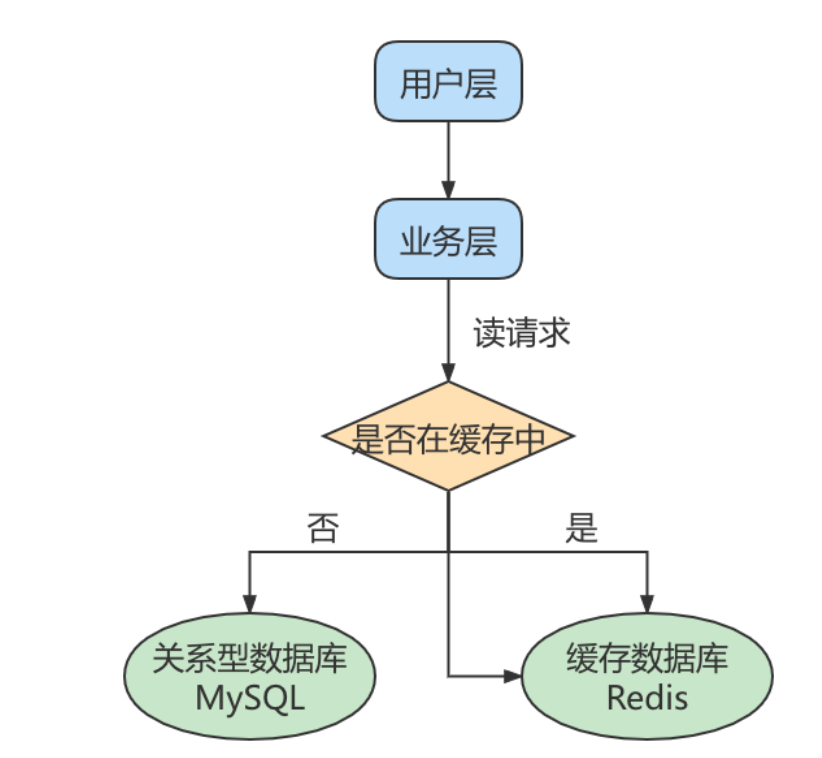

此外，一般应用对数据库而言都是“ `读多写少 `”，也就说对数据库读取数据的压力比较大，有一个思路就是采用数据库集群的方案，做 `主从架构 `、进行 `读写分离` ，这样同样可以提升数据库的并发处理能力。但并不是所有的应用都需要对数据库进行主从架构的设置，毕竟设置架构本身是有成本的。

如果我们的目的在于提升数据库高并发访问的效率，那么首先考虑的是如何 `优化SQL和索引 `，这种方式简单有效；其次才是采用 `缓存的策略` ，比如使用 Redis将热点数据保存在内存数据库中，提升读取的效率；最后才是对数据库采用 `主从架构` ，进行读写分离


### 19.1.2 主从复制的作用

主从同步设计不仅可以`提高数据库的吞吐量`，还有以下 3 个方面的作用

**第1个作用** : `读写分离`。我们可以通过主从复制的方式来 `同步数据`，然后通过读写分离提高数据库并发处理能

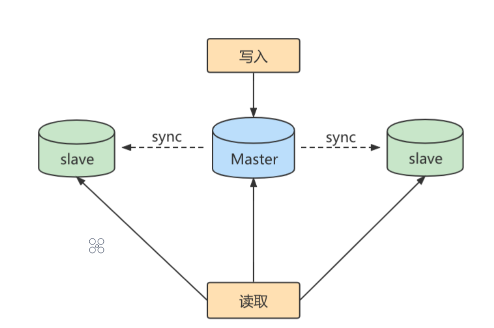

其中一个是Master主库，负责写入数据，我们称之为: `写库`。

其它都是slave从库，负责读取数据，我们称之为: `读库`。

当主库进行更新的时候，会自动将数据复制到从库中，而我们在客户端读取数据的时候，会从从库中进行读取。面对“读多写少”的需求，采用读写分离的方式，可以实现, `更高的并发访问`。同时，

我们还能对从服务器进行 `负载均衡`，让不同的读请求按照策略均匀地分发到不同的从服务器上，让 `读取更加顺畅` 。读取顺畅的另一个原因，就是 `减少了锁表` 的影响，比如我们让主库负责写，当主库出现写锁的时候，不会影响到从库进行 SELECT 的读取。

**第2个作用**  就是`数据备份`。我们通过主从复制将主库上的数据复制到了从库上，相当于是一 种 `热备份机制`，也就是在主库正常运行的情况下进行的备份，不会影响到服务。

**第3个作用** 是`具有高可用性`。数据备份实际上是一种冗余的机制，通过这种冗余的方式可以换取数据库的高可用性，也就是当服务器出现 `故障` 或 `宕机 `的情况下，可以 `切换 `到从服务器上，保证服务的正常运行。


## 19.2 主从复制的原理

`Slave` 会从` Master` 读取 `binlog` 来进行数据同步。

实际上主从同步的原理就是基于 binlog 进行数据同步的。在主从复制过程中，会基于 `3 个线程 `来操作，一个主库线程，两个从库线程

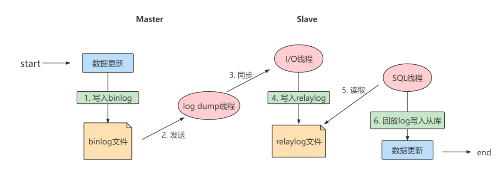

`二进制日志转储线程 （Binlog dump thread）`是一个主库线程。当从库线程连接的时候， 主库可以将二进制日志发送给从库，当主库读取事件（Event）的时候，会在 Binlog 上 加锁 ，读取完成之后，再将锁释放掉。

`从库 I/O 线程` 会连接到主库，向主库发送请求更新 Binlog。这时从库的 I/O 线程就可以读取到主库的二进制日志转储线程发送的 Binlog 更新部分，并且拷贝到本地的中继日志 （Relay log）。

`从库 SQL 线程` 会读取从库中的中继日志，并且执行日志中的事件，将从库中的数据与主库保持同步

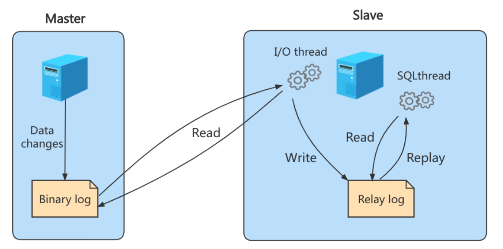

**三步骤：**

步骤1： `Master` 将写操作记录到二进制日志（ binlog ）。

步骤2： Slave 将 Master 的 `binary log events` 拷贝到它的中继日志（ relay log ）；

步骤3： Slave 重做中继日志中的事件，将改变应用到自己的数据库中。 MySQL复制是异步的且串行化的，而且重启后从 `接入点` 开始复制。


**基本准则**：

- 每个 Slave 只有一个 Master
- 每个 Slave 只能有一个唯一的服务器ID
- 每个 Master 可以有多个 Slave


## 19.3 一主一从搭建

一台 `主机` 用于处理所有 `写请求` ，一台 `从机` 负责所有 `读请求` ，架构图如下

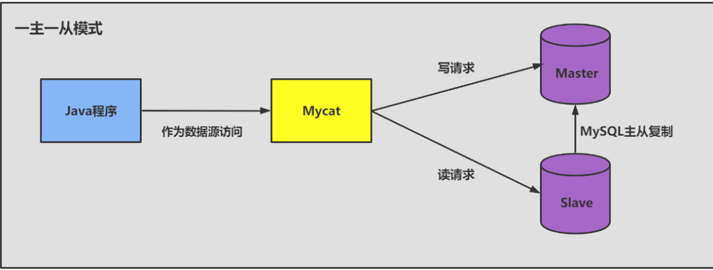


### 19.3.1 准备工作

1、准备` 2台` CentOS 虚拟机

2、每台虚拟机上需要安装好MySQL (可以是MySQL8.0 )

> 注意：克隆的方式需要修改新克隆出来主机的：① MAC地址 ② hostname ③ IP 地址 ④ UUID 。

此外，克隆的方式生成的虚拟机（包含MySQL Server），则克隆的虚拟机MySQL Server的UUID相同，必须修改，否则在有些场景会报错。比如： `show slave status\G` ，报如下的错误：

```sql
Last_IO_Error: Fatal error: The slave I/O thread stops because master and slave have equal MySQL server UUIDs; these UUIDs must be different for replication to work.
```

修改方式：

```sql
vim /var/lib/mysql/auto.cnf
systemctl restart mysqld
```


### 19.3.2 主机配置文件

建议mysql版本一致且后台以服务运行，主从所有配置项都配置在 `[mysqld] `节点下，且都是小写字母。

- **必选**

```sql
#[必须]主服务器唯一ID
server-id=

#[必须]启用二进制日志,指名路径。比如：自己本地的路径/log/mysqlbin
log-bin=atguigu-bin
```


- **可选**

```sql
#[可选] 0（默认）表示读写（主机），1表示只读（从机）
read-only=0
#设置日志文件保留的时长，单位是秒
binlog_expire_logs_seconds=6000
#控制单个二进制日志大小。此参数的最大和默认值是1GB
max_binlog_size=200M
#[可选]设置不要复制的数据库
binlog-ignore-db=test
#[可选]设置需要复制的数据库,默认全部记录。比如：binlog-do-db=atguigu_master_slave
binlog-do-db=需要复制的主数据库名字
#[可选]设置binlog格式
binlog_format=STATEMENT
```

**binlog格式设置：**

格式1：` STATEMENT模式 `（基于SQL语句的复制(statement-based replication, SBR)）

```sql
binlog_format=STATEMENT
```

每一条会修改数据的 `sql语句` 会记录到binlog中。这是默认的binlog格式。

**SBR优点**

- 不需要记录每一行的变化，减少了binlog日志量，文件较小
- binlog中包含了所有数据库更改信息，可以据此来审核数据库的安全等情况
- binlog可以用于实时的还原，而不仅仅用于复制
- 主从版本可以不一样，从服务器版本可以比主服务器版本高

**SBR缺点**

- 不是所有的UPDATE语句都能被复制，尤其是包含不确定操作的时候

格式二：**ROW模式（基于行的复制(row-based replication, RBR)）**

```sql
binlog_format=ROW
```

**RBR 的优点：**

- 任何情况都可以被复制，这对复制来说是最 安全可靠 的。（比如：不会出现某些特定情况下

  的存储过程、function、trigger的调用和触发无法被正确复制的问题）

- 多数情况下，从服务器上的表如果有主键的话，复制就会快了很多

- 复制以下几种语句时的行锁更少：INSERT ... SELECT、包含 AUTO_INCREMENT 字段的 INSERT、没有附带条件或者并没有修改很多记录的 UPDATE 或 DELETE 语句

- 执行 INSERT，UPDATE，DELETE 语句时锁更少

- 从服务器上采用 多线程 来执行复制成为可能

**RBR 的缺点：**

- binlog 大了很多
- 复杂的回滚时 binlog 中会包含大量的数据
- 主服务器上执行 UPDATE 语句时，所有发生变化的记录都会写到 binlog 中，而 SBR 只会写一次，这会导致频繁发生 binlog 的并发写问题
- 无法从 binlog 中看到都复制了些什么语句

格式三： **MIXED模式（混合模式复制(mixed-based replication, MBR)）**

在Mixed模式下，一般的语句修改使用statment格式保存binlog。如一些函数，statement无法完成主从复制的操作，则采用row格式保存binlog。

MySQL会根据执行的每一条具体的sql语句来区分对待记录的日志形式，也就是在Statement和Row之间选择一种。


### 19.3.3 从机配置文件

- **必选**

```sql
#[必须]从服务器唯一ID
server-id=2
```


- **可选**

```sql
# [可选]启用中继日志
relay-log=mysql-relay
```

> 注意：主从机都关闭防火墙
>
> service iptables stop #CentOS 6
>
> systemctl stop firewalld.service #CentOS 7


### 19.3.4 主机：建立账户并授权

```sql
# 在主机MySQL里执行授权主从复制的命令
GRANT REPLICATION SLAVE ON *.* TO 'slave1'@'从机器数据库IP' IDENTIFIED BY 'abc123';
#5.5,5.7
```

**注意：如果使用的是MySQL8，需要如下的方式建立账户，并授权slave：**

```sql
CREATE USER 'slave1'@'%' IDENTIFIED BY '123456';
GRANT REPLICATION SLAVE ON *.* TO 'slave1'@'%';

#此语句必须执行。否则见下面。
ALTER USER 'slave1'@'%' IDENTIFIED WITH mysql_native_password BY '123456';
flush privileges;
```

查询Master的状态，并记录下`File和Position`的值

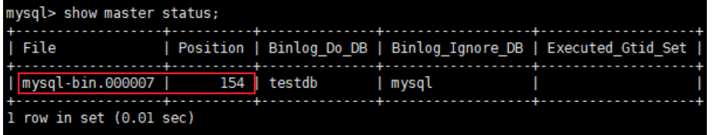


> 注意：执行完此步骤后**不要再操作主服务器MySQL**，防止主服务器状态值变化。


### 19.3.5 从机：配置需要复制的主机

1、从机上复制主机的命令

```sql
CHANGE MASTER TO
MASTER_HOST='主机的IP地址',
MASTER_USER='主机用户名',
MASTER_PASSWORD='主机用户名的密码',
MASTER_LOG_FILE='mysql-bin.具体数字',
MASTER_LOG_POS=具体值;
```

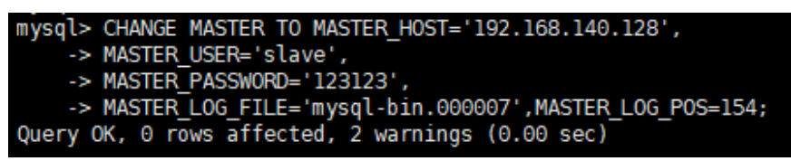

若是之前做过主从复制，并且还仍在开着，请先停止！

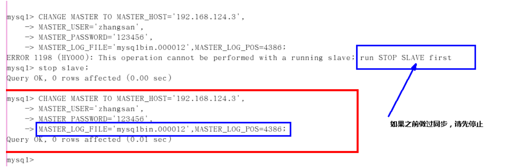


2、启动slave同步

```sql
#启动slave同步
START SLAVE;
```

如果报错

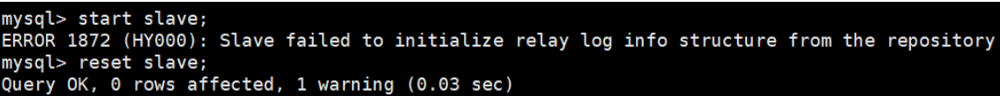

可以执行如下操作，删除之前的 relay_log信息。然后重新执行 `CHANGE MASTER TO ...` 语句即可。

```sql
mysql> reset slave; #删除SLAVE数据库的relaylog日志文件，并重新启用新的relaylog文件
```


查看同步状态

```sql
SHOW SLAVE STATUS\G;
```

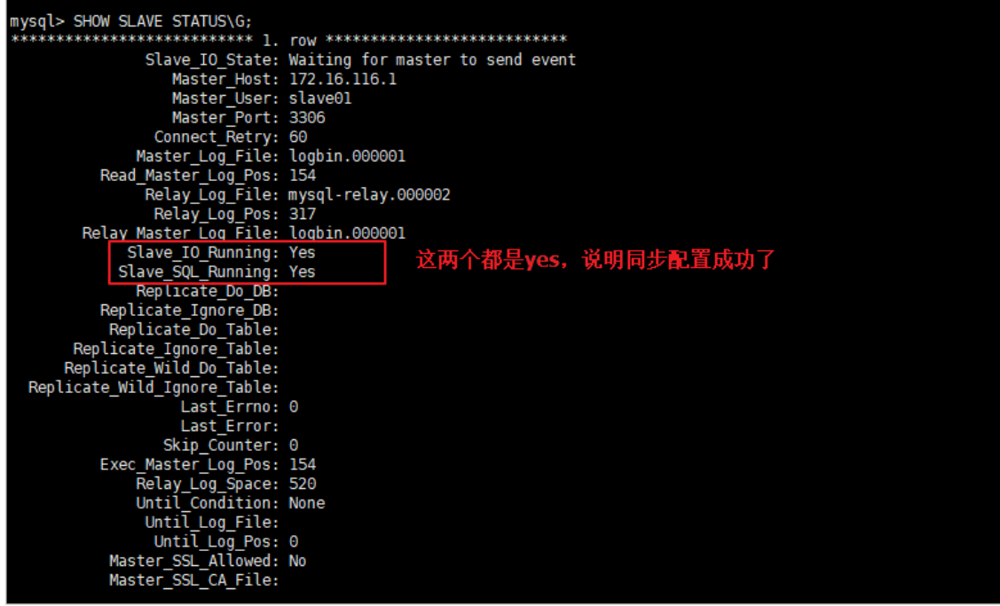

> 上面两个参数都是Yes，则说明主从配置成功！


### 19.3.5 停止复制

```sql
stop slave;
```

如果停止从服务器复制功能，再使用需要重新配置主从。否则会报错如下：

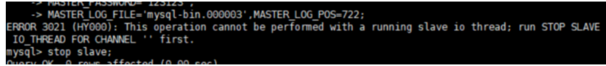

