# 缓存双写一致性问题

只要使用缓存，就可能涉及到 Redis 缓存与数据库 双存储双写，只要是双写，就一定会有**数据一致性**的问题！

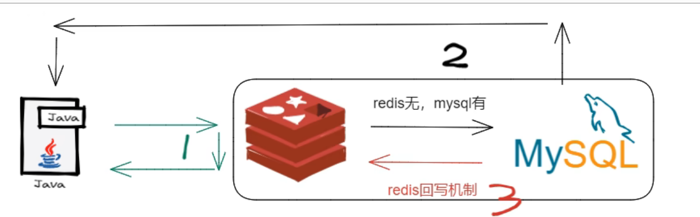

### 你是如何解决数据一致性问题的？

- 采用 **双检加锁** 策略

多个线程同时去查询数据库的这条数据，那么我们可以在第一个查询数据的请求上使用一个 `互斥锁`来锁住它。其他的线程走到这一步拿不到锁就等着，等第一个线程查询到了数据，然后做`缓存`。后面的线程进来发现已经有缓存了，就直接走缓存。

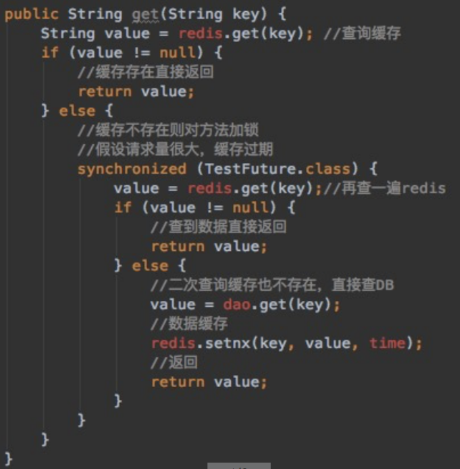

### 你的更新策略是什么？

:::tip 原文
[如何保证数据库和缓存双写一致性？ - 知乎 (zhihu.com)](https://zhuanlan.zhihu.com/p/490902522)
:::

**目前常见的更新策略有四种**：

1. 先写缓存，再写数据库
2. 先写数据库，再写缓存
3. 先删缓存，再写数据库
4. 先写数据库，再删缓存

#### 先写缓存，再写数据库

这种方案是最不可取的，写完缓存后，更新数据库时出现网络异常，导致数据库更新不成功！

那么 Redis 中的数据不就成了 `脏数据`了 吗？

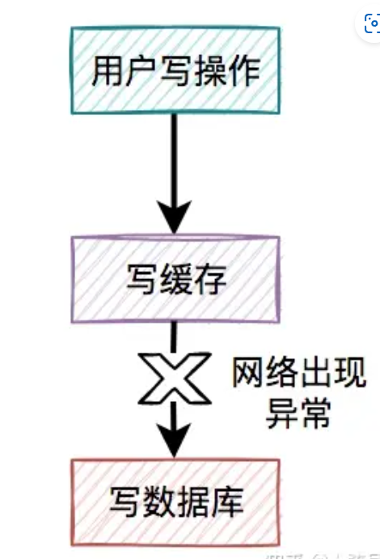

#### 先写数据库，再写缓存

这种方案貌似解决了上面`脏数据` 的问题，但是又带来了一个新问题，`新值被覆盖`的问题

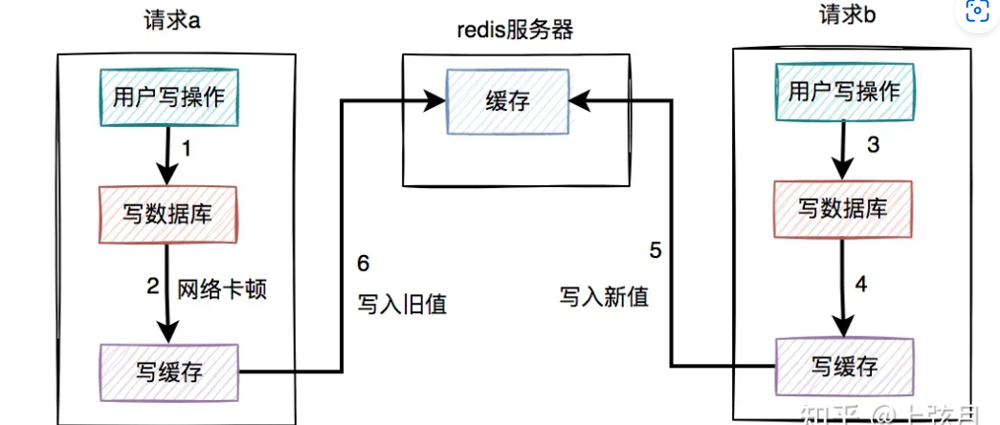

- 假设请求a先执行数据库写操作，在写入缓存是出现卡顿
- 这时，请求b在请求a卡顿的过程中，先更新缓存的值为5
- 在请求b更新完之后，请求a卡顿结束，更新缓存值为6

这时请求a的旧值就覆盖了请求b的新值

#### 先删缓存，再写数据库

这种方案仍然会出现`新值被覆盖`的问题

假设在高并发的场景中，同一个用户的同一条数据，有一个读数据请求c，还有另一个写数据请求d（一个更新操作），同时请求到业务系统。如下图所示：

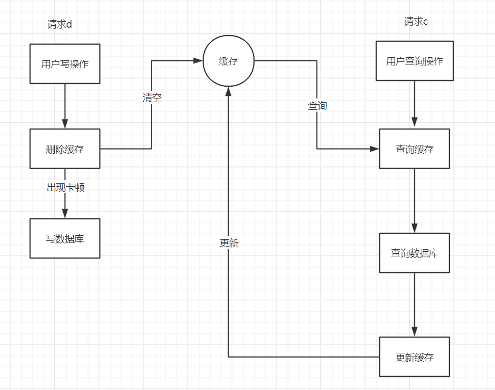

- 请求d先删除数据库，在写数据库时出现卡顿
- 此时请求c过来查询缓存没有，查询数据库并更新缓存，但此时更新的是旧值，请求d由于卡顿还未更新数据库。
- 在请求c更新缓存之后，请求d卡顿结束，写入数据库

这就造成了数据库时请求d更新的新值，而缓存中是请求c更新的旧值，造成了`数据不一致`的问题！

但是这个方案有一个解决方法，就是在请求d写数据库完之后，`间隔一段时间`再去删除缓存，也就是所谓的 `延时双删` 的策略！

值得注意的是，一定要间隔一段时间，在请求c更新缓存之后再去删除，否则没有意义！

> 这个间隔多长时间根据你具体的业务去考虑

#### 先写数据库，再删缓存

这种方案其实是比较推荐的！

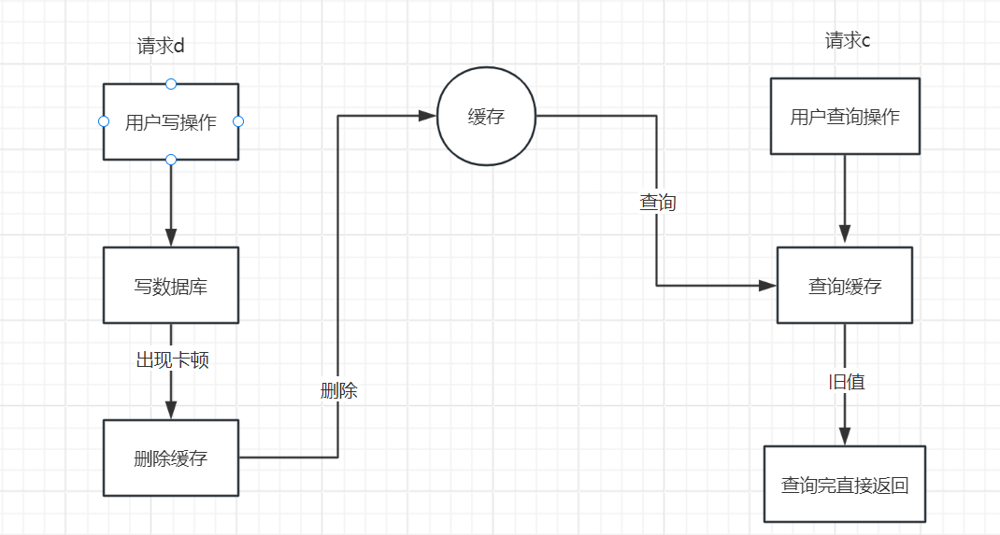

- 请求d先写数据库，由于卡顿未来得及删除缓存
- 请求c查询缓存，由于请求d未删除，返回的是旧值
- 请求d删除缓存

这个方案，仅仅是请求c读到了一次旧值，但随之请求d就删除了，相对前面三个比较能接受一些！

#### 删除失败怎么办

其实先写数据库，再删缓存的方案，跟缓存双删的方案一样，有一个共同的风险点，即：**如果缓存删除失败了，也会导致缓存和数据库的数据不一致**

这种情况就需要使用 `重试机制` ，当删除失败后，可以立即进行重试，若多次重试之后仍然失败，这是就需要记录给相关人员手工处理了！

而实现重试机制有很多种方式，常见的有：`定时任务、RabbitMQ、binlog日志`

##### 定时任务

1、当用户操作写完数据库，但删除缓存失败了，需要将用户数据写入重试表中。如下图所示：

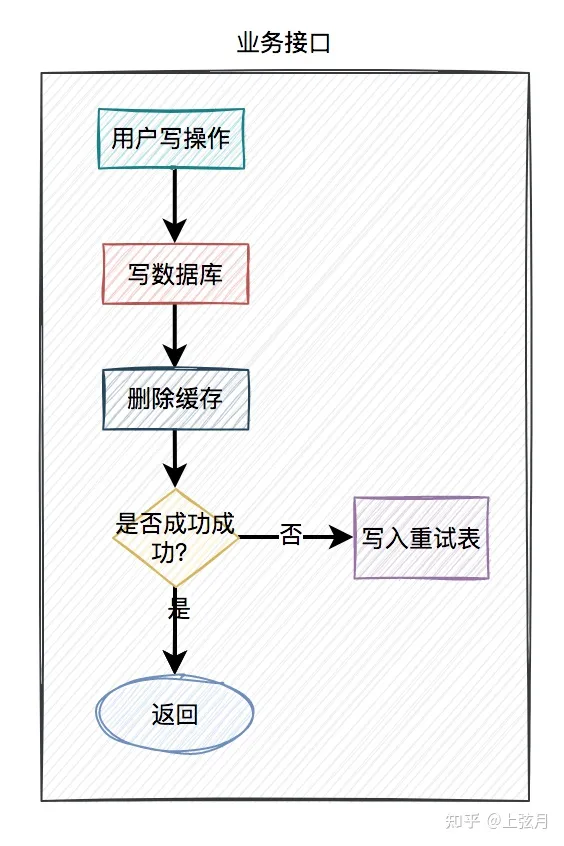

2、在定时任务中，异步读取重试表中的用户数据。重试表需要记录一个重试次数字段，初始值为0。然后重试5次，不断删除缓存，每重试一次该字段值+1。如果其中有任意一次成功了，则返回成功。如果重试了5次，还是失败，则我们需要在重试表中记录一个失败的状态，等待后续进一步处理。

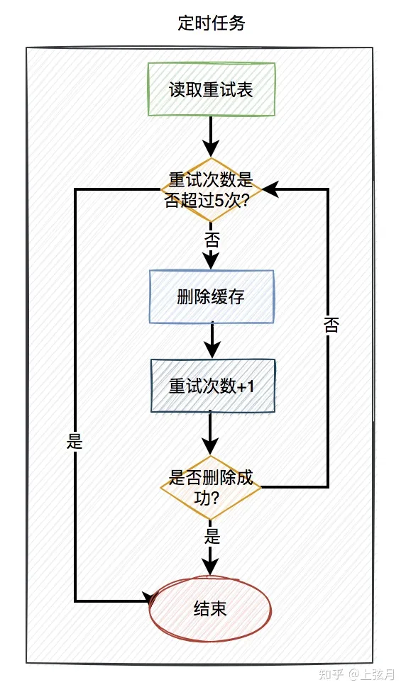

##### RabbitMQ

1. 当用户操作写完数据库，但删除缓存失败了，产生一条mq消息，发送给mq服务器。
2. mq消费者读取mq消息，重试5次删除缓存。如果其中有任意一次成功了，则返回成功。如果重试了5次，还是失败，则写入`死信队列`中。
3. 由指定的消费者监听`死信队列` , 若失败5次仍然未成功可以保存到表中通知相关人员做下一步处理！

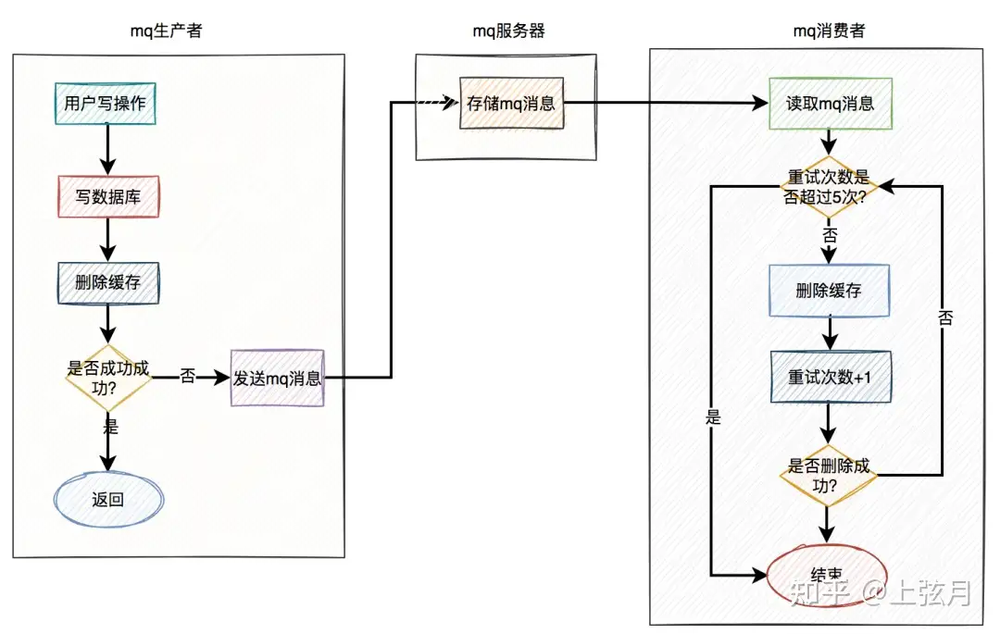

##### binlog

无论是定时任务，还是mq（消息队列），做重试机制，对业务都有一定的侵入性。

其实，还有一种更优雅的实现，即`监听binlog`，比如使用：`canal`等中间件。

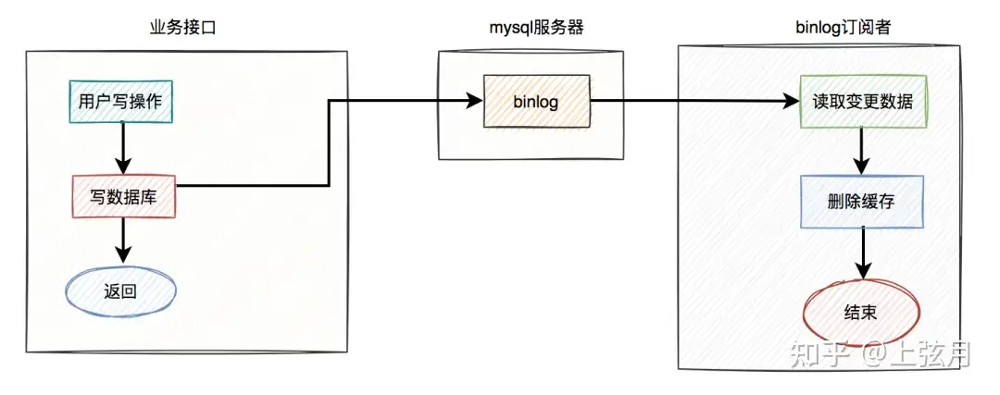

1. 在业务接口中写数据库之后，就不管了，直接返回成功。
2. mysql服务器会自动把变更的数据写入binlog中。
3. binlog订阅者获取变更的数据，然后删除缓存。

这套方案中业务接口确实简化了一些流程，只用关心数据库操作即可，而在binlog订阅者中做缓存删除工作。

但如果只是按照图中的方案进行删除缓存，只删除了一次，也可能会失败。

如何解决这个问题呢？

答：这就需要加上前面聊过的`重试机制`了。如果删除缓存失败，写入重试表，使用定时任务重试。或者写入mq，让mq自动重试。

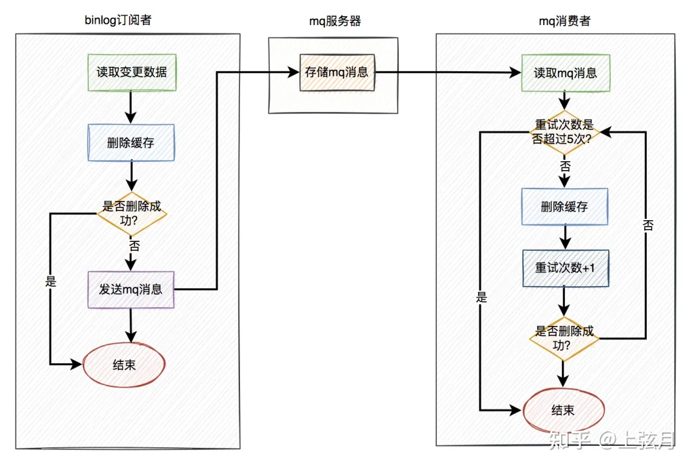
